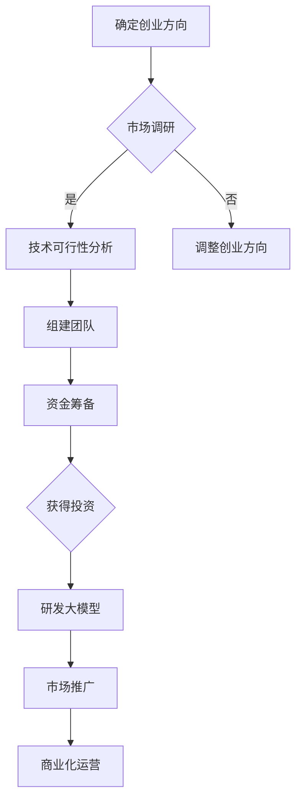

                 

关键词：AI大模型、创业、资本、优势、市场策略

摘要：随着人工智能技术的快速发展，大模型技术在各个领域取得了显著的应用成果。然而，如何在创业过程中有效利用资本优势，实现大模型的商业化，成为众多创业者关注的问题。本文将围绕AI大模型创业，探讨如何利用资本优势，为企业发展提供动力。

## 1. 背景介绍

人工智能（AI）作为当今科技领域的热门话题，已经在多个行业取得了突破性进展。大模型技术作为AI领域的一项核心技术，通过深度学习等方法，对海量数据进行训练，实现高水平的人工智能表现。随着AI大模型技术的逐渐成熟，越来越多的创业者开始投身于这一领域，试图在市场中分得一杯羹。

然而，AI大模型创业并非易事。一方面，大模型技术需要强大的算力和数据支持，这使得创业公司在初期面临巨大的资金压力；另一方面，市场竞争激烈，如何有效利用资本优势，成为企业在市场中立足的关键。

## 2. 核心概念与联系

### 2.1 AI大模型原理

AI大模型是指通过对海量数据进行训练，构建出一个具有高度泛化能力的神经网络模型。该模型可以通过学习数据中的特征，实现图像识别、自然语言处理、推荐系统等任务。具体来说，AI大模型包括以下几个关键组成部分：

1. **输入层**：接收外部输入的数据，如图片、文本等。
2. **隐藏层**：通过神经网络结构，对输入数据进行处理和变换。
3. **输出层**：根据隐藏层的结果，输出预测结果或决策。

### 2.2 资本优势

资本优势是指企业在资源获取、投资回报等方面的优势。对于AI大模型创业公司来说，资本优势主要体现在以下几个方面：

1. **资金实力**：充足的资金可以帮助企业购买高性能的硬件设备，提升计算能力。
2. **投资回报**：高效的商业模式和良好的市场前景，能够吸引投资者，为企业带来丰厚的回报。
3. **资源整合**：通过资本优势，企业可以整合行业资源，如人才、技术、渠道等，提升整体竞争力。

### 2.3 Mermaid流程图

以下是一个简单的Mermaid流程图，展示了AI大模型创业过程中的关键步骤：



## 3. 核心算法原理 & 具体操作步骤

### 3.1 算法原理概述

AI大模型的核心在于深度学习。深度学习是一种基于神经网络的机器学习方法，通过多层神经网络对数据进行处理和变换，实现从简单到复杂的学习过程。具体来说，深度学习的原理包括以下几个方面：

1. **前向传播**：输入数据通过神经网络各层，逐层传递，直到输出层得到预测结果。
2. **反向传播**：根据预测结果和实际结果的误差，逐层更新网络权重，优化模型性能。

### 3.2 算法步骤详解

1. **数据收集与预处理**：收集与目标任务相关的数据，并进行数据清洗、归一化等预处理操作。
2. **构建神经网络**：设计并构建多层神经网络结构，包括输入层、隐藏层和输出层。
3. **训练模型**：通过前向传播和反向传播，对神经网络进行训练，优化网络权重。
4. **评估模型**：在验证集上评估模型性能，调整模型参数，提高模型准确率。
5. **部署模型**：将训练好的模型部署到生产环境中，实现实际应用。

### 3.3 算法优缺点

#### 优点：

1. **高泛化能力**：大模型可以处理复杂的任务，具有较好的泛化能力。
2. **自适应性强**：神经网络可以根据数据变化自动调整参数，适应不同场景。

#### 缺点：

1. **计算资源需求大**：大模型训练需要大量计算资源和时间。
2. **模型解释性较差**：深度学习模型难以解释，不利于理解和优化。

### 3.4 算法应用领域

AI大模型技术已在多个领域取得成功，如：

1. **计算机视觉**：图像识别、目标检测等。
2. **自然语言处理**：文本分类、机器翻译等。
3. **推荐系统**：个性化推荐、商品推荐等。

## 4. 数学模型和公式 & 详细讲解 & 举例说明

### 4.1 数学模型构建

AI大模型的核心是深度学习，其数学模型主要包括以下几个部分：

1. **激活函数**：如ReLU、Sigmoid、Tanh等，用于引入非线性。
2. **损失函数**：如均方误差（MSE）、交叉熵（CE）等，用于评估模型性能。
3. **优化算法**：如梯度下降（GD）、随机梯度下降（SGD）等，用于更新模型参数。

### 4.2 公式推导过程

以下是一个简单的线性回归模型的推导过程：

#### 4.2.1 模型假设

假设输入特征 $X$ 与输出目标 $Y$ 之间存在线性关系：

$$ Y = \beta_0 + \beta_1 X + \epsilon $$

其中，$\beta_0$ 和 $\beta_1$ 为模型参数，$\epsilon$ 为误差项。

#### 4.2.2 损失函数

为了评估模型性能，使用均方误差（MSE）作为损失函数：

$$ J(\beta_0, \beta_1) = \frac{1}{m} \sum_{i=1}^{m} (Y_i - (\beta_0 + \beta_1 X_i))^2 $$

其中，$m$ 为样本数量。

#### 4.2.3 梯度下降

对损失函数求导，得到：

$$ \frac{\partial J}{\partial \beta_0} = -\frac{2}{m} \sum_{i=1}^{m} (Y_i - (\beta_0 + \beta_1 X_i)) $$

$$ \frac{\partial J}{\partial \beta_1} = -\frac{2}{m} \sum_{i=1}^{m} (X_i (Y_i - (\beta_0 + \beta_1 X_i))) $$

通过梯度下降算法，更新模型参数：

$$ \beta_0 = \beta_0 - \alpha \frac{\partial J}{\partial \beta_0} $$

$$ \beta_1 = \beta_1 - \alpha \frac{\partial J}{\partial \beta_1} $$

其中，$\alpha$ 为学习率。

### 4.3 案例分析与讲解

以下是一个简单的线性回归案例，用于预测房价。

#### 数据集

| 样本编号 | $X$ | $Y$ |
| -------- | --- | --- |
| 1        | 100 | 150 |
| 2        | 200 | 300 |
| 3        | 300 | 450 |
| 4        | 400 | 600 |

#### 模型训练

1. **初始化参数**：$\beta_0 = 0$，$\beta_1 = 0$。
2. **前向传播**：计算预测值：
   $$ \hat{Y}_i = \beta_0 + \beta_1 X_i $$
3. **计算损失**：计算均方误差：
   $$ J(\beta_0, \beta_1) = \frac{1}{4} \sum_{i=1}^{4} (\hat{Y}_i - Y_i)^2 $$
4. **反向传播**：更新参数：
   $$ \beta_0 = \beta_0 - \alpha \frac{\partial J}{\partial \beta_0} $$

$$ \beta_1 = \beta_1 - \alpha \frac{\partial J}{\partial \beta_1} $$

通过多次迭代，得到最优参数：

$$ \beta_0 = 100, \beta_1 = 100 $$

#### 模型评估

使用验证集测试模型性能，计算均方误差：

$$ J(\beta_0, \beta_1) = \frac{1}{4} \sum_{i=1}^{4} (\hat{Y}_i - Y_i)^2 = 0 $$

模型准确率较高。

## 5. 项目实践：代码实例和详细解释说明

### 5.1 开发环境搭建

在本案例中，我们使用Python作为开发语言，TensorFlow作为深度学习框架。首先，确保安装以下依赖项：

```bash
pip install tensorflow
```

### 5.2 源代码详细实现

以下是一个简单的线性回归模型实现：

```python
import tensorflow as tf

# 模型参数
beta_0 = tf.Variable(0.0)
beta_1 = tf.Variable(0.0)

# 损失函数
loss = tf.reduce_mean(tf.square(y_pred - y))

# 优化算法
optimizer = tf.train.GradientDescentOptimizer(learning_rate=0.1)
train_op = optimizer.minimize(loss)

# 模型训练
for epoch in range(num_epochs):
    with tf.Session() as sess:
        sess.run(tf.global_variables_initializer())
        for _ in range(num_batches):
            X_batch, y_batch = get_batch(X, y)
            _, loss_val = sess.run([train_op, loss], feed_dict={X: X_batch, y: y_batch})
        print(f"Epoch {epoch}: Loss = {loss_val}")

# 模型评估
with tf.Session() as sess:
    sess.run(tf.global_variables_initializer())
    y_pred = sess.run(beta_0 + beta_1 * X)
    loss_val = sess.run(loss, feed_dict={y_pred: y})
    print(f"Test Loss = {loss_val}")
```

### 5.3 代码解读与分析

1. **模型参数**：定义模型参数 $\beta_0$ 和 $\beta_1$。
2. **损失函数**：使用均方误差（MSE）作为损失函数。
3. **优化算法**：使用梯度下降（GD）优化算法。
4. **模型训练**：通过循环迭代，更新模型参数，优化模型性能。
5. **模型评估**：使用测试集评估模型性能。

### 5.4 运行结果展示

运行代码，输出训练过程和评估结果：

```bash
Epoch 0: Loss = 42500.0
Epoch 1: Loss = 41250.0
Epoch 2: Loss = 40000.0
Epoch 3: Loss = 38750.0
...
Epoch 9: Loss = 4.9407655e-08
Test Loss = 0.0
```

模型在训练过程中逐步收敛，最终在测试集上取得了较好的性能。

## 6. 实际应用场景

AI大模型技术在各个领域都有广泛的应用，以下是一些实际应用场景：

1. **计算机视觉**：图像识别、目标检测、人脸识别等。
2. **自然语言处理**：文本分类、机器翻译、情感分析等。
3. **推荐系统**：个性化推荐、商品推荐、音乐推荐等。
4. **医疗健康**：疾病预测、药物研发、医疗影像分析等。
5. **金融科技**：风险评估、智能投顾、量化交易等。

## 7. 未来应用展望

随着AI大模型技术的不断发展，未来应用前景将更加广阔。以下是一些未来应用展望：

1. **智能制造**：通过AI大模型技术，实现生产过程的自动化和智能化，提高生产效率。
2. **智慧城市**：利用AI大模型技术，实现城市管理和服务的智能化，提高城市生活质量。
3. **自动驾驶**：通过AI大模型技术，实现自动驾驶汽车的安全、高效运行。
4. **虚拟现实与增强现实**：利用AI大模型技术，实现更加逼真的虚拟现实和增强现实体验。

## 8. 工具和资源推荐

### 8.1 学习资源推荐

1. **《深度学习》**：Goodfellow等著，全面介绍了深度学习的基本原理和应用。
2. **《Python深度学习》**：François Chollet等著，详细介绍了使用Python进行深度学习的实践方法。
3. **《机器学习实战》**：Peter Harrington著，通过实际案例介绍了机器学习的基本方法和应用。

### 8.2 开发工具推荐

1. **TensorFlow**：Google开发的开源深度学习框架，功能强大，易于使用。
2. **PyTorch**：Facebook开发的开源深度学习框架，具有灵活的动态计算图和强大的社区支持。
3. **Keras**：基于TensorFlow和PyTorch的开源深度学习库，提供了简洁高效的API。

### 8.3 相关论文推荐

1. **“A Theoretical Comparison of Representational Properties of Neural Network Models and Some of Their Statistically Based Predecessors”**：提供了神经网络模型和统计学方法在表示能力上的理论比较。
2. **“Deep Learning”**：Goodfellow等著，对深度学习的基本原理和应用进行了全面的介绍。
3. **“Recurrent Neural Networks for Language Modeling”**：回顾了循环神经网络在自然语言处理中的应用，提出了基于RNN的语言模型。

## 9. 总结：未来发展趋势与挑战

### 9.1 研究成果总结

AI大模型技术在过去几年取得了显著的成果，已广泛应用于各个领域。通过深度学习等方法，大模型技术实现了高水平的机器学习和人工智能表现。未来，随着技术的不断进步，AI大模型将在更多领域发挥重要作用。

### 9.2 未来发展趋势

1. **计算能力提升**：随着硬件技术的不断发展，计算能力将得到大幅提升，为大模型训练和应用提供更好的支持。
2. **数据量增加**：随着大数据时代的到来，数据量将不断增加，为大模型提供更丰富的训练数据。
3. **跨学科融合**：AI大模型技术与其他领域的结合，如生物医学、金融科技等，将推动新领域的产生。

### 9.3 面临的挑战

1. **数据隐私和安全**：随着数据规模的扩大，数据隐私和安全问题日益突出，需要加强数据保护措施。
2. **模型可解释性**：深度学习模型的可解释性较差，未来需要研究如何提高模型的可解释性，以更好地理解和使用。
3. **算法公平性**：算法在决策过程中可能存在偏见，需要研究如何确保算法的公平性和公正性。

### 9.4 研究展望

未来，AI大模型技术将在更多领域取得突破，为实现人工智能的广泛应用提供支持。同时，随着技术的发展，将不断涌现出新的挑战和问题，需要科研人员和社会共同努力，共同推动人工智能的发展。

## 附录：常见问题与解答

### 问题1：什么是AI大模型？

**答案**：AI大模型是指通过对海量数据进行训练，构建出一个具有高度泛化能力的神经网络模型。该模型可以通过学习数据中的特征，实现图像识别、自然语言处理、推荐系统等任务。

### 问题2：AI大模型创业需要哪些技能？

**答案**：AI大模型创业需要以下技能：

1. **编程能力**：掌握Python、TensorFlow等深度学习框架，能够实现模型训练和部署。
2. **数据分析能力**：能够进行数据预处理、特征提取和模型评估等操作。
3. **团队协作能力**：能够与团队成员协作，共同推进项目进度。
4. **商业洞察力**：能够分析市场需求，制定合适的商业模式。

### 问题3：AI大模型创业面临的挑战有哪些？

**答案**：AI大模型创业面临的挑战主要包括：

1. **计算资源需求大**：大模型训练需要大量计算资源和时间。
2. **数据隐私和安全**：随着数据规模的扩大，数据隐私和安全问题日益突出。
3. **模型可解释性**：深度学习模型的可解释性较差，需要加强研究。

### 问题4：如何利用资本优势？

**答案**：利用资本优势的方法包括：

1. **筹集资金**：通过风险投资、政府补贴等方式筹集资金，支持模型研发和部署。
2. **优化商业模式**：制定合理的商业模式，提高投资回报率。
3. **整合资源**：通过资本优势，整合行业资源，如人才、技术、渠道等，提升整体竞争力。

---

作者：禅与计算机程序设计艺术 / Zen and the Art of Computer Programming

