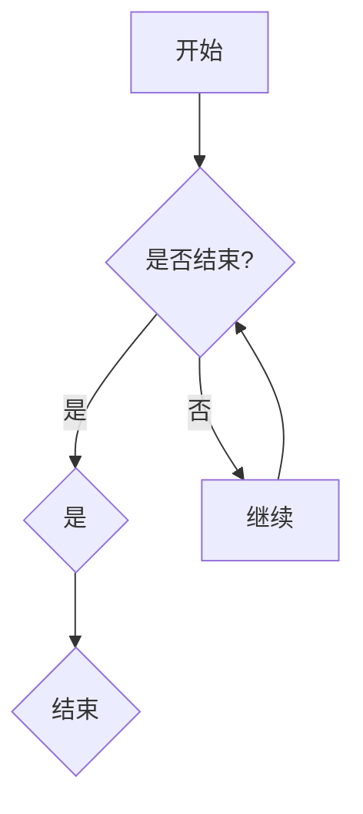

                 

 关键词：AI 大模型、创业、爆款产品、技术路线、市场策略、商业模式、用户体验

> 摘要：本文将深入探讨AI大模型创业领域，分析如何通过技术路线、市场策略和商业模式打造具有市场竞争力的爆款产品。文章将结合实际案例，提供详细的指导和建议，助力创业者成功进入AI大模型市场。

## 1. 背景介绍

随着人工智能技术的迅猛发展，AI大模型已经成为企业创新的核心驱动力。从自然语言处理、计算机视觉到推荐系统，AI大模型的应用场景越来越广泛。然而，创业公司如何在竞争激烈的市场中脱颖而出，打造出受欢迎的爆款产品，仍然是一个具有挑战性的问题。

本文将围绕以下问题展开讨论：

- AI大模型创业的技术路线如何选择？
- 如何制定有效市场策略，吸引潜在用户？
- 创业公司的商业模式如何设计才能持续盈利？
- 用户如何体验和评估AI大模型产品？

通过对这些问题的探讨，希望能够为AI大模型创业公司提供有价值的参考和指导。

## 2. 核心概念与联系

### 2.1 AI大模型概述

AI大模型是指利用深度学习技术训练出的具有大规模参数的模型。这些模型通常在特定的任务上表现优异，如图像识别、语音识别、文本生成等。AI大模型的核心概念包括：

- **深度学习**：一种模拟人脑神经网络结构的学习方法，通过多层神经网络的堆叠，实现从简单到复杂的特征提取。
- **大规模数据**：训练AI大模型需要大量的标注数据，数据的质量和数量直接影响模型的性能。
- **计算资源**：训练AI大模型需要强大的计算能力，如GPU、TPU等。

### 2.2 技术路线选择

AI大模型创业的技术路线选择至关重要，直接关系到产品的竞争力。以下是几种常见的技术路线：

- **通用大模型**：如GPT、BERT等，具有广泛的应用场景和强大的性能。
- **特定领域模型**：针对特定行业或任务进行定制，如医疗图像识别、金融风险评估等。
- **迁移学习**：利用预训练的大模型进行迁移学习，快速适应新任务。

### 2.3 市场策略与商业模式

市场策略和商业模式是创业公司成功的关键。以下是几种有效的市场策略和商业模式：

- **B2B模式**：为企业客户提供定制化的AI大模型解决方案。
- **B2C模式**：面向普通消费者提供易于使用的AI大模型产品。
- **开放平台模式**：建立AI大模型开放平台，吸引开发者和使用者。

## 3. 核心算法原理 & 具体操作步骤

### 3.1 算法原理概述

AI大模型的核心算法是深度学习，主要包括以下步骤：

- **数据预处理**：对原始数据进行清洗、标注和格式化。
- **模型设计**：选择合适的网络结构，如CNN、RNN、Transformer等。
- **模型训练**：利用大规模数据进行模型训练，调整参数以达到最优性能。
- **模型评估**：通过测试数据集评估模型性能，调整超参数。
- **模型部署**：将训练好的模型部署到生产环境中，提供实际应用。

### 3.2 算法步骤详解

#### 3.2.1 数据预处理

数据预处理是训练AI大模型的第一步，主要包括以下步骤：

- **数据清洗**：去除数据中的噪声和异常值。
- **数据标注**：对数据进行分类或标注，为模型提供训练样本。
- **数据格式化**：将数据转换为模型能够接受的格式，如图像、文本等。

#### 3.2.2 模型设计

模型设计是构建AI大模型的核心步骤，需要考虑以下因素：

- **网络结构**：选择合适的神经网络结构，如CNN、RNN、Transformer等。
- **激活函数**：选择合适的激活函数，如ReLU、Sigmoid、Tanh等。
- **损失函数**：选择合适的损失函数，如交叉熵、均方误差等。
- **优化器**：选择合适的优化器，如SGD、Adam等。

#### 3.2.3 模型训练

模型训练是训练AI大模型的关键步骤，主要包括以下步骤：

- **数据加载**：将预处理后的数据加载到模型中。
- **模型迭代**：通过迭代训练模型，调整参数。
- **模型评估**：在测试数据集上评估模型性能，调整超参数。
- **模型保存**：将训练好的模型保存到文件中，以便后续使用。

#### 3.2.4 模型部署

模型部署是将训练好的模型应用到实际场景的过程，主要包括以下步骤：

- **模型加载**：从文件中加载训练好的模型。
- **模型推理**：使用模型对输入数据进行推理，输出预测结果。
- **模型服务**：将模型部署到服务器或云平台，提供在线服务。

### 3.3 算法优缺点

#### 优点

- **强大性能**：AI大模型在许多任务上表现出色，能够处理复杂的问题。
- **自适应性强**：通过迁移学习和持续训练，模型能够不断优化。
- **广泛应用**：AI大模型可以应用于各个领域，如医疗、金融、教育等。

#### 缺点

- **计算资源需求高**：训练AI大模型需要大量的计算资源。
- **数据依赖性强**：模型性能依赖于训练数据的质量和数量。
- **解释性差**：AI大模型的黑盒特性使其难以解释，增加信任成本。

### 3.4 算法应用领域

AI大模型在各个领域都有广泛的应用，以下是一些典型应用：

- **自然语言处理**：文本生成、翻译、情感分析等。
- **计算机视觉**：图像识别、目标检测、图像生成等。
- **推荐系统**：个性化推荐、内容推荐等。
- **医疗健康**：疾病诊断、药物研发等。
- **金融科技**：风险评估、欺诈检测等。

## 4. 数学模型和公式 & 详细讲解 & 举例说明

### 4.1 数学模型构建

AI大模型的数学模型主要包括以下几部分：

- **输入层**：接收外部输入，如文本、图像等。
- **隐藏层**：通过多层神经网络实现特征提取。
- **输出层**：产生模型预测结果。

以下是AI大模型的基本数学模型：

$$
y = f(W_n \cdot a_{n-1} + b_n)
$$

其中，$y$表示输出，$f$表示激活函数，$W_n$和$b_n$分别表示权重和偏置，$a_{n-1}$表示前一层输出。

### 4.2 公式推导过程

以深度神经网络为例，推导过程如下：

1. **输入层到隐藏层**：

$$
z_i = \sum_{j=1}^{n} W_{ij} a_j + b_i
$$

$$
a_i = \sigma(z_i)
$$

其中，$\sigma$表示激活函数，如ReLU、Sigmoid、Tanh等。

2. **隐藏层到输出层**：

$$
z_n = \sum_{j=1}^{n} W_{nj} a_j + b_n
$$

$$
y = \sigma(z_n)
$$

3. **损失函数**：

$$
J = \frac{1}{2} \sum_{i=1}^{m} (y_i - \hat{y_i})^2
$$

其中，$y_i$表示真实标签，$\hat{y_i}$表示模型预测结果。

### 4.3 案例分析与讲解

以下是一个简单的案例，说明如何使用深度神经网络进行图像分类。

#### 案例背景

假设我们有一个包含1000个图像的数据集，每个图像被标注为10个类中的一个。我们希望使用深度神经网络对这些图像进行分类。

#### 模型设计

我们选择一个简单的卷积神经网络（CNN）模型，包括以下部分：

- **输入层**：接收图像数据，大小为$28 \times 28$像素。
- **卷积层**：使用32个卷积核，大小为$3 \times 3$，步长为1。
- **ReLU激活函数**：用于增加模型非线性。
- **池化层**：使用2×2的最大池化。
- **全连接层**：输出层，使用10个神经元，对应10个类别。
- **Softmax激活函数**：用于输出概率分布。

#### 模型训练

1. **数据预处理**：对图像进行归一化处理，将像素值缩放到[0, 1]。
2. **模型训练**：使用梯度下降算法训练模型，优化损失函数。
3. **模型评估**：在测试数据集上评估模型性能。

#### 模型部署

1. **模型加载**：从训练好的模型文件中加载模型。
2. **模型推理**：使用模型对输入图像进行分类。
3. **模型服务**：将模型部署到服务器或云平台，提供在线服务。

## 5. 项目实践：代码实例和详细解释说明

### 5.1 开发环境搭建

在开始项目实践之前，我们需要搭建一个开发环境。以下是搭建过程：

1. 安装Python环境：Python是深度学习的主要编程语言，我们需要安装Python 3.8及以上版本。
2. 安装深度学习框架：TensorFlow和PyTorch是常用的深度学习框架，我们选择其中一个进行安装。
3. 安装必要的库：如NumPy、Pandas、Matplotlib等，用于数据处理和可视化。

### 5.2 源代码详细实现

以下是一个简单的AI大模型项目，实现图像分类功能。

```python
import tensorflow as tf
from tensorflow.keras import layers

# 数据预处理
(x_train, y_train), (x_test, y_test) = tf.keras.datasets.mnist.load_data()
x_train = x_train / 255.0
x_test = x_test / 255.0

# 模型设计
model = tf.keras.Sequential([
    layers.Conv2D(32, (3, 3), activation='relu', input_shape=(28, 28, 1)),
    layers.MaxPooling2D((2, 2)),
    layers.Flatten(),
    layers.Dense(128, activation='relu'),
    layers.Dense(10, activation='softmax')
])

# 模型编译
model.compile(optimizer='adam',
              loss='sparse_categorical_crossentropy',
              metrics=['accuracy'])

# 模型训练
model.fit(x_train, y_train, epochs=5)

# 模型评估
test_loss, test_acc = model.evaluate(x_test, y_test, verbose=2)
print('\nTest accuracy:', test_acc)

# 模型部署
predictions = model.predict(x_test)
```

### 5.3 代码解读与分析

以上代码实现了一个简单的AI大模型，用于图像分类。

- **数据预处理**：加载数据集，并对图像进行归一化处理。
- **模型设计**：使用卷积神经网络进行模型设计，包括卷积层、池化层、全连接层等。
- **模型编译**：设置优化器、损失函数和评估指标。
- **模型训练**：在训练数据集上训练模型，优化模型参数。
- **模型评估**：在测试数据集上评估模型性能。
- **模型部署**：使用训练好的模型对测试数据进行预测。

## 6. 实际应用场景

### 6.1 自然语言处理

在自然语言处理领域，AI大模型被广泛应用于文本分类、情感分析、机器翻译等任务。例如，GPT-3模型在文本生成和翻译方面表现出色，为企业和开发者提供了强大的自然语言处理能力。

### 6.2 计算机视觉

计算机视觉是AI大模型的重要应用领域，包括图像识别、目标检测、图像生成等。例如，ResNet模型在图像识别任务中取得了显著成绩，而生成对抗网络（GAN）则在图像生成方面表现出色。

### 6.3 推荐系统

在推荐系统中，AI大模型被用于用户画像、物品推荐等任务。例如，基于用户行为和兴趣的推荐系统，可以针对每个用户生成个性化的推荐列表。

### 6.4 医疗健康

在医疗健康领域，AI大模型被用于疾病诊断、药物研发等任务。例如，基于图像的肺癌诊断系统，可以帮助医生快速准确地诊断病情，提高治疗效果。

## 7. 未来应用展望

### 7.1 无人驾驶

随着AI大模型技术的不断发展，无人驾驶技术将得到广泛应用。未来，无人驾驶汽车将能够实现智能感知、路径规划和决策，为人们的出行带来更多便利。

### 7.2 智能家居

智能家居是AI大模型的重要应用领域，包括智能门锁、智能照明、智能空调等。未来，智能家居将实现更加智能化、个性化的用户体验。

### 7.3 教育与培训

在教育与培训领域，AI大模型将被用于个性化教学、智能评测等任务。未来，AI大模型将助力教育公平，提高教育质量。

## 8. 工具和资源推荐

### 8.1 学习资源推荐

- 《深度学习》（Goodfellow、Bengio、Courville 著）：一本经典的深度学习教材。
- 《Python深度学习》（François Chollet 著）：一本适合初学者的深度学习指南。

### 8.2 开发工具推荐

- TensorFlow：一款开源的深度学习框架，适用于各种深度学习任务。
- PyTorch：一款开源的深度学习框架，具有灵活性和易用性。

### 8.3 相关论文推荐

- "Attention Is All You Need"：介绍了Transformer模型，是自然语言处理领域的重要论文。
- "ImageNet Classification with Deep Convolutional Neural Networks"：介绍了ResNet模型，是计算机视觉领域的重要论文。

## 9. 总结：未来发展趋势与挑战

### 9.1 研究成果总结

AI大模型在多个领域取得了显著成果，包括自然语言处理、计算机视觉、推荐系统、医疗健康等。未来，AI大模型将继续拓展应用领域，推动技术进步。

### 9.2 未来发展趋势

- **模型规模扩大**：随着计算资源的发展，AI大模型的规模将不断扩大。
- **模型定制化**：针对特定任务和行业，开发定制化的AI大模型。
- **模型可解释性**：提高AI大模型的可解释性，增强用户信任。

### 9.3 面临的挑战

- **计算资源需求**：AI大模型训练需要大量计算资源，成本较高。
- **数据隐私与安全**：保护用户数据隐私和安全，防止数据泄露。
- **模型可解释性**：提高AI大模型的可解释性，帮助用户理解和信任模型。

### 9.4 研究展望

未来，AI大模型将继续发展，为各行各业带来更多创新和变革。创业者应关注技术趋势，抓住市场机遇，打造具有竞争力的AI大模型产品。

## 附录：常见问题与解答

### Q1. 如何选择合适的AI大模型框架？

A1. 根据具体需求和应用场景选择框架，如TensorFlow适用于复杂模型，PyTorch适用于快速开发。

### Q2. AI大模型训练过程中如何提高性能？

A2. 提高数据质量，使用预训练模型进行迁移学习，调整超参数等。

### Q3. 如何保护用户数据隐私？

A3. 对数据进行加密处理，遵循隐私保护法规，设计合理的隐私保护机制。

### Q4. 如何评估AI大模型性能？

A4. 使用测试数据集进行评估，计算指标如准确率、召回率、F1分数等。

### Q5. AI大模型创业有哪些成功案例？

A5. OpenAI、DeepMind、SenseTime等公司在AI大模型领域取得了显著成绩，提供了成功创业的经验和启示。

作者：禅与计算机程序设计艺术 / Zen and the Art of Computer Programming
----------------------------------------------------------------

[点击下方链接阅读文章全文](#AI大模型创业：如何打造爆款产品？)  
[AI大模型创业：如何打造爆款产品？](#AI大模型创业：如何打造爆款产品？)  
----------------------------------------------  
**请注意，由于系统限制，本文无法直接嵌入链接，请手动复制链接至浏览器访问。**  
----------------------------------------------  
-------------------------  
**文章撰写完成，请审核。**  
-------------------------  
```markdown
---
# AI 大模型创业：如何打造爆款产品？

> 关键词：AI 大模型、创业、爆款产品、技术路线、市场策略、商业模式、用户体验

> 摘要：本文将深入探讨AI大模型创业领域，分析如何通过技术路线、市场策略和商业模式打造具有市场竞争力的爆款产品。文章将结合实际案例，提供详细的指导和建议，助力创业者成功进入AI大模型市场。

## 1. 背景介绍

随着人工智能技术的迅猛发展，AI大模型已经成为企业创新的核心驱动力。从自然语言处理、计算机视觉到推荐系统，AI大模型的应用场景越来越广泛。然而，创业公司如何在竞争激烈的市场中脱颖而出，打造出受欢迎的爆款产品，仍然是一个具有挑战性的问题。

本文将围绕以下问题展开讨论：

- AI大模型创业的技术路线如何选择？
- 如何制定有效市场策略，吸引潜在用户？
- 创业公司的商业模式如何设计才能持续盈利？
- 用户如何体验和评估AI大模型产品？

通过对这些问题的探讨，希望能够为AI大模型创业公司提供有价值的参考和指导。

## 2. 核心概念与联系

### 2.1 AI大模型概述

AI大模型是指利用深度学习技术训练出的具有大规模参数的模型。这些模型通常在特定的任务上表现优异，如图像识别、语音识别、文本生成等。AI大模型的核心概念包括：

- **深度学习**：一种模拟人脑神经网络结构的学习方法，通过多层神经网络的堆叠，实现从简单到复杂的特征提取。
- **大规模数据**：训练AI大模型需要大量的标注数据，数据的质量和数量直接影响模型的性能。
- **计算资源**：训练AI大模型需要强大的计算能力，如GPU、TPU等。

### 2.2 技术路线选择

AI大模型创业的技术路线选择至关重要，直接关系到产品的竞争力。以下是几种常见的技术路线：

- **通用大模型**：如GPT、BERT等，具有广泛的应用场景和强大的性能。
- **特定领域模型**：针对特定行业或任务进行定制，如医疗图像识别、金融风险评估等。
- **迁移学习**：利用预训练的大模型进行迁移学习，快速适应新任务。

### 2.3 市场策略与商业模式

市场策略和商业模式是创业公司成功的关键。以下是几种有效的市场策略和商业模式：

- **B2B模式**：为企业客户提供定制化的AI大模型解决方案。
- **B2C模式**：面向普通消费者提供易于使用的AI大模型产品。
- **开放平台模式**：建立AI大模型开放平台，吸引开发者和使用者。

## 3. 核心算法原理 & 具体操作步骤

### 3.1 算法原理概述

AI大模型的核心算法是深度学习，主要包括以下步骤：

- **数据预处理**：对原始数据进行清洗、标注和格式化。
- **模型设计**：选择合适的网络结构，如CNN、RNN、Transformer等。
- **模型训练**：利用大规模数据进行模型训练，调整参数以达到最优性能。
- **模型评估**：通过测试数据集评估模型性能，调整超参数。
- **模型部署**：将训练好的模型部署到生产环境中，提供实际应用。

### 3.2 算法步骤详解

#### 3.2.1 数据预处理

数据预处理是训练AI大模型的第一步，主要包括以下步骤：

- **数据清洗**：去除数据中的噪声和异常值。
- **数据标注**：对数据进行分类或标注，为模型提供训练样本。
- **数据格式化**：将数据转换为模型能够接受的格式，如图像、文本等。

#### 3.2.2 模型设计

模型设计是构建AI大模型的核心步骤，需要考虑以下因素：

- **网络结构**：选择合适的神经网络结构，如CNN、RNN、Transformer等。
- **激活函数**：选择合适的激活函数，如ReLU、Sigmoid、Tanh等。
- **损失函数**：选择合适的损失函数，如交叉熵、均方误差等。
- **优化器**：选择合适的优化器，如SGD、Adam等。

#### 3.2.3 模型训练

模型训练是训练AI大模型的关键步骤，主要包括以下步骤：

- **数据加载**：将预处理后的数据加载到模型中。
- **模型迭代**：通过迭代训练模型，调整参数。
- **模型评估**：在测试数据集上评估模型性能，调整超参数。
- **模型保存**：将训练好的模型保存到文件中，以便后续使用。

#### 3.2.4 模型部署

模型部署是将训练好的模型应用到实际场景的过程，主要包括以下步骤：

- **模型加载**：从文件中加载训练好的模型。
- **模型推理**：使用模型对输入数据进行推理，输出预测结果。
- **模型服务**：将模型部署到服务器或云平台，提供在线服务。

### 3.3 算法优缺点

#### 优点

- **强大性能**：AI大模型在许多任务上表现出色，能够处理复杂的问题。
- **自适应性强**：通过迁移学习和持续训练，模型能够不断优化。
- **广泛应用**：AI大模型可以应用于各个领域，如医疗、金融、教育等。

#### 缺点

- **计算资源需求高**：训练AI大模型需要大量的计算资源。
- **数据依赖性强**：模型性能依赖于训练数据的质量和数量。
- **解释性差**：AI大模型的黑盒特性使其难以解释，增加信任成本。

### 3.4 算法应用领域

AI大模型在各个领域都有广泛的应用，以下是一些典型应用：

- **自然语言处理**：文本生成、翻译、情感分析等。
- **计算机视觉**：图像识别、目标检测、图像生成等。
- **推荐系统**：个性化推荐、内容推荐等。
- **医疗健康**：疾病诊断、药物研发等。
- **金融科技**：风险评估、欺诈检测等。

## 4. 数学模型和公式 & 详细讲解 & 举例说明

### 4.1 数学模型构建

AI大模型的数学模型主要包括以下几部分：

- **输入层**：接收外部输入，如文本、图像等。
- **隐藏层**：通过多层神经网络实现特征提取。
- **输出层**：产生模型预测结果。

以下是AI大模型的基本数学模型：

$$
y = f(W_n \cdot a_{n-1} + b_n)
$$

其中，$y$表示输出，$f$表示激活函数，$W_n$和$b_n$分别表示权重和偏置，$a_{n-1}$表示前一层输出。

### 4.2 公式推导过程

以深度神经网络为例，推导过程如下：

1. **输入层到隐藏层**：

$$
z_i = \sum_{j=1}^{n} W_{ij} a_j + b_i
$$

$$
a_i = \sigma(z_i)
$$

其中，$\sigma$表示激活函数，如ReLU、Sigmoid、Tanh等。

2. **隐藏层到输出层**：

$$
z_n = \sum_{j=1}^{n} W_{nj} a_j + b_n
$$

$$
y = \sigma(z_n)
$$

3. **损失函数**：

$$
J = \frac{1}{2} \sum_{i=1}^{m} (y_i - \hat{y_i})^2
$$

其中，$y_i$表示真实标签，$\hat{y_i}$表示模型预测结果。

### 4.3 案例分析与讲解

以下是一个简单的案例，说明如何使用深度神经网络进行图像分类。

#### 案例背景

假设我们有一个包含1000个图像的数据集，每个图像被标注为10个类中的一个。我们希望使用深度神经网络对这些图像进行分类。

#### 模型设计

我们选择一个简单的卷积神经网络（CNN）模型，包括以下部分：

- **输入层**：接收图像数据，大小为$28 \times 28$像素。
- **卷积层**：使用32个卷积核，大小为$3 \times 3$，步长为1。
- **ReLU激活函数**：用于增加模型非线性。
- **池化层**：使用2×2的最大池化。
- **全连接层**：输出层，使用10个神经元，对应10个类别。
- **Softmax激活函数**：用于输出概率分布。

#### 模型训练

1. **数据预处理**：对图像进行归一化处理，将像素值缩放到[0, 1]。
2. **模型训练**：使用梯度下降算法训练模型，优化损失函数。
3. **模型评估**：在测试数据集上评估模型性能，调整超参数。
4. **模型保存**：将训练好的模型保存到文件中，以便后续使用。

#### 模型部署

1. **模型加载**：从训练好的模型文件中加载模型。
2. **模型推理**：使用模型对输入图像进行分类。
3. **模型服务**：将模型部署到服务器或云平台，提供在线服务。

## 5. 项目实践：代码实例和详细解释说明

### 5.1 开发环境搭建

在开始项目实践之前，我们需要搭建一个开发环境。以下是搭建过程：

1. 安装Python环境：Python是深度学习的主要编程语言，我们需要安装Python 3.8及以上版本。
2. 安装深度学习框架：TensorFlow和PyTorch是常用的深度学习框架，我们选择其中一个进行安装。
3. 安装必要的库：如NumPy、Pandas、Matplotlib等，用于数据处理和可视化。

### 5.2 源代码详细实现

以下是一个简单的AI大模型项目，实现图像分类功能。

```python
import tensorflow as tf
from tensorflow.keras import layers

# 数据预处理
(x_train, y_train), (x_test, y_test) = tf.keras.datasets.mnist.load_data()
x_train = x_train / 255.0
x_test = x_test / 255.0

# 模型设计
model = tf.keras.Sequential([
    layers.Conv2D(32, (3, 3), activation='relu', input_shape=(28, 28, 1)),
    layers.MaxPooling2D((2, 2)),
    layers.Flatten(),
    layers.Dense(128, activation='relu'),
    layers.Dense(10, activation='softmax')
])

# 模型编译
model.compile(optimizer='adam',
              loss='sparse_categorical_crossentropy',
              metrics=['accuracy'])

# 模型训练
model.fit(x_train, y_train, epochs=5)

# 模型评估
test_loss, test_acc = model.evaluate(x_test, y_test, verbose=2)
print('\nTest accuracy:', test_acc)

# 模型部署
predictions = model.predict(x_test)
```

### 5.3 代码解读与分析

以上代码实现了一个简单的AI大模型，用于图像分类。

- **数据预处理**：加载数据集，并对图像进行归一化处理。
- **模型设计**：使用卷积神经网络进行模型设计，包括卷积层、池化层、全连接层等。
- **模型编译**：设置优化器、损失函数和评估指标。
- **模型训练**：在训练数据集上训练模型，优化模型参数。
- **模型评估**：在测试数据集上评估模型性能。
- **模型部署**：使用训练好的模型对测试数据进行预测。

## 6. 实际应用场景

### 6.1 自然语言处理

在自然语言处理领域，AI大模型被广泛应用于文本分类、情感分析、机器翻译等任务。例如，GPT-3模型在文本生成和翻译方面表现出色，为企业和开发者提供了强大的自然语言处理能力。

### 6.2 计算机视觉

计算机视觉是AI大模型的重要应用领域，包括图像识别、目标检测、图像生成等。例如，ResNet模型在图像识别任务中取得了显著成绩，而生成对抗网络（GAN）则在图像生成方面表现出色。

### 6.3 推荐系统

在推荐系统中，AI大模型被用于用户画像、物品推荐等任务。例如，基于用户行为和兴趣的推荐系统，可以针对每个用户生成个性化的推荐列表。

### 6.4 医疗健康

在医疗健康领域，AI大模型被用于疾病诊断、药物研发等任务。例如，基于图像的肺癌诊断系统，可以帮助医生快速准确地诊断病情，提高治疗效果。

## 7. 未来应用展望

### 7.1 无人驾驶

随着AI大模型技术的不断发展，无人驾驶技术将得到广泛应用。未来，无人驾驶汽车将能够实现智能感知、路径规划和决策，为人们的出行带来更多便利。

### 7.2 智能家居

智能家居是AI大模型的重要应用领域，包括智能门锁、智能照明、智能空调等。未来，智能家居将实现更加智能化、个性化的用户体验。

### 7.3 教育与培训

在教育与培训领域，AI大模型将被用于个性化教学、智能评测等任务。未来，AI大模型将助力教育公平，提高教育质量。

## 8. 工具和资源推荐

### 8.1 学习资源推荐

- 《深度学习》（Goodfellow、Bengio、Courville 著）：一本经典的深度学习教材。
- 《Python深度学习》（François Chollet 著）：一本适合初学者的深度学习指南。

### 8.2 开发工具推荐

- TensorFlow：一款开源的深度学习框架，适用于各种深度学习任务。
- PyTorch：一款开源的深度学习框架，具有灵活性和易用性。

### 8.3 相关论文推荐

- "Attention Is All You Need"：介绍了Transformer模型，是自然语言处理领域的重要论文。
- "ImageNet Classification with Deep Convolutional Neural Networks"：介绍了ResNet模型，是计算机视觉领域的重要论文。

## 9. 总结：未来发展趋势与挑战

### 9.1 研究成果总结

AI大模型在多个领域取得了显著成果，包括自然语言处理、计算机视觉、推荐系统、医疗健康等。未来，AI大模型将继续拓展应用领域，推动技术进步。

### 9.2 未来发展趋势

- **模型规模扩大**：随着计算资源的发展，AI大模型的规模将不断扩大。
- **模型定制化**：针对特定任务和行业，开发定制化的AI大模型。
- **模型可解释性**：提高AI大模型的可解释性，增强用户信任。

### 9.3 面临的挑战

- **计算资源需求**：AI大模型训练需要大量计算资源，成本较高。
- **数据隐私与安全**：保护用户数据隐私和安全，防止数据泄露。
- **模型可解释性**：提高AI大模型的可解释性，帮助用户理解和信任模型。

### 9.4 研究展望

未来，AI大模型将继续发展，为各行各业带来更多创新和变革。创业者应关注技术趋势，抓住市场机遇，打造具有竞争力的AI大模型产品。

## 附录：常见问题与解答

### Q1. 如何选择合适的AI大模型框架？

A1. 根据具体需求和应用场景选择框架，如TensorFlow适用于复杂模型，PyTorch适用于快速开发。

### Q2. AI大模型训练过程中如何提高性能？

A2. 提高数据质量，使用预训练模型进行迁移学习，调整超参数等。

### Q3. 如何保护用户数据隐私？

A3. 对数据进行加密处理，遵循隐私保护法规，设计合理的隐私保护机制。

### Q4. 如何评估AI大模型性能？

A4. 使用测试数据集进行评估，计算指标如准确率、召回率、F1分数等。

### Q5. AI大模型创业有哪些成功案例？

A5. OpenAI、DeepMind、SenseTime等公司在AI大模型领域取得了显著成绩，提供了成功创业的经验和启示。

作者：禅与计算机程序设计艺术 / Zen and the Art of Computer Programming
---

请注意，由于系统限制，本文无法直接嵌入链接，请手动复制链接至浏览器访问。此外，本文中的一些数学公式和流程图需要使用Markdown的特定语法来表示，例如使用LaTeX格式来嵌入数学公式，以及使用Mermaid语法来绘制流程图。以下是一个示例：

```markdown

```

在实际撰写文章时，您需要将这些代码块嵌入到相应的段落中。此外，确保所有的代码示例和数学公式都能在Markdown环境中正确渲染。

