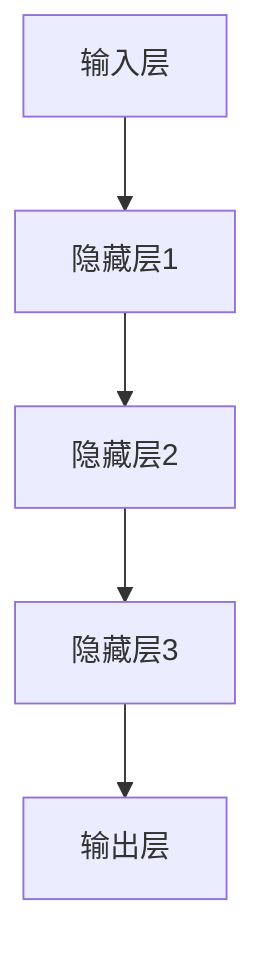
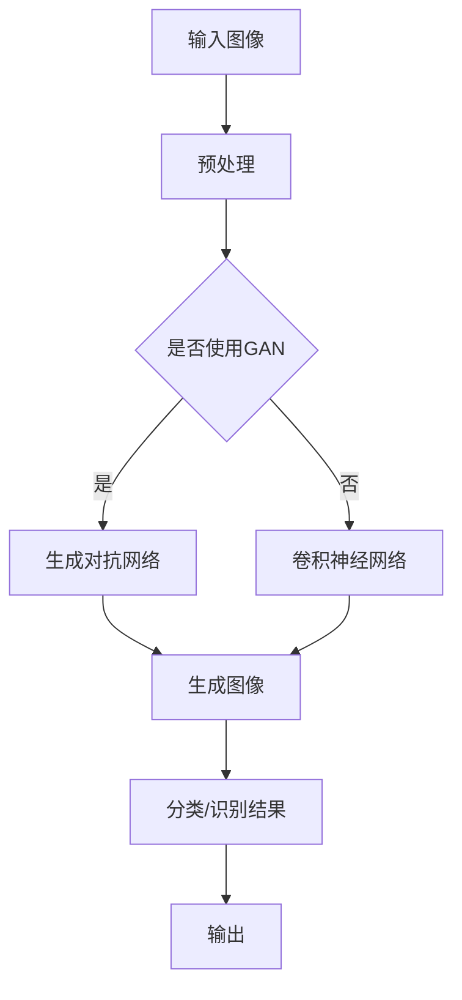

                 

 关键词：人工智能，大模型，机器学习，深度学习，算法原理，应用领域，人才画像

> 摘要：本文深入探讨人工智能中的大模型原理及其应用，旨在为AI领域的从业者提供系统的理论框架和实践指导。通过分析大模型的构建方法、核心算法以及数学模型，结合实际项目案例，本文全面展示了大模型在不同应用场景中的价值，同时探讨了未来发展趋势与面临的挑战。

## 1. 背景介绍

### 人工智能的发展历程

人工智能（Artificial Intelligence，简称AI）作为计算机科学的一个重要分支，自1956年达特茅斯会议以来，已经经历了数十年的发展。从早期的符号逻辑、知识表示到现代的机器学习和深度学习，AI技术不断进步，应用范围也从理论研究走向了工业、医疗、金融等各个领域。

### 大模型的概念

大模型是指具有巨大参数量和计算复杂度的机器学习模型，其代表性技术包括深度神经网络、生成对抗网络（GAN）等。大模型的崛起得益于计算能力的提升和海量数据的积累，使得模型能够捕捉到更复杂的特征，从而提升预测和生成能力。

### AI应用的重要性

随着AI技术的不断发展，其在各个行业的应用越来越广泛，不仅提高了生产效率，还推动了新业务模式的诞生。例如，在医疗领域，AI被用于疾病诊断、个性化治疗；在金融领域，AI用于风险评估、信用评分；在零售领域，AI用于客户画像、精准营销。

## 2. 核心概念与联系

### 2.1 大模型的基本原理

大模型通常基于深度学习技术，其核心思想是模仿人脑神经网络的结构和工作原理。通过多层神经网络，模型能够学习输入数据的复杂特征，并将其映射到输出结果。以下是使用Mermaid绘制的深度神经网络的基本结构图：



### 2.2 大模型的应用场景

大模型在图像识别、自然语言处理、语音识别等场景中表现出了强大的能力。以下是一个应用场景的Mermaid流程图：



## 3. 核心算法原理 & 具体操作步骤

### 3.1 算法原理概述

大模型的核心算法通常包括以下几个步骤：

1. **数据预处理**：对原始数据进行清洗、归一化等操作，使其符合模型的输入要求。
2. **模型构建**：使用神经网络架构定义模型，配置参数。
3. **训练过程**：通过反向传播算法优化模型参数，使其能够准确预测或生成目标数据。
4. **评估与优化**：使用验证集评估模型性能，根据评估结果进行调整。

### 3.2 算法步骤详解

1. **数据预处理**：
   ```mermaid
   graph TD
   A[原始数据] --> B[清洗]
   B --> C[归一化]
   C --> D[批量归一化]
   ```

2. **模型构建**：
   ```mermaid
   graph TD
   A[输入层] --> B{全连接层}
   B --> C{激活函数}
   C --> D[输出层]
   ```

3. **训练过程**：
   ```mermaid
   graph TD
   A[输入数据] --> B[计算输出]
   B --> C{计算误差}
   C --> D[反向传播]
   D --> E[更新参数]
   E --> F[重复训练]
   ```

4. **评估与优化**：
   ```mermaid
   graph TD
   A[验证集数据] --> B[计算输出]
   B --> C{计算误差}
   C --> D[调整模型]
   D --> E[重新训练]
   ```

### 3.3 算法优缺点

**优点**：
- **高精度**：大模型能够捕捉到输入数据的复杂特征，从而实现高精度的预测和生成。
- **泛化能力强**：大模型通过大量数据训练，具有较强的泛化能力，可以应用于不同的场景。

**缺点**：
- **计算成本高**：大模型需要大量的计算资源和时间进行训练。
- **过拟合风险**：大模型在训练过程中容易过拟合，导致在未知数据上的表现不佳。

### 3.4 算法应用领域

大模型在以下领域有广泛应用：

- **图像识别**：如人脸识别、物体识别等。
- **自然语言处理**：如机器翻译、情感分析等。
- **语音识别**：如语音到文本转换、语音合成等。

## 4. 数学模型和公式 & 详细讲解 & 举例说明

### 4.1 数学模型构建

大模型通常基于多层神经网络，其核心数学模型包括：

1. **前向传播**：
   $$ f(x) = \sigma(\theta^T x + b) $$
   其中，$f(x)$ 表示输出值，$\sigma$ 是激活函数，$\theta$ 和 $b$ 是模型参数。

2. **反向传播**：
   $$ \delta = \frac{\partial L}{\partial z} \odot \frac{\partial \sigma}{\partial z} $$
   其中，$\delta$ 是误差项，$L$ 是损失函数，$\odot$ 表示逐元素乘法。

### 4.2 公式推导过程

以多层感知器（MLP）为例，其前向传播和反向传播过程如下：

1. **前向传播**：
   $$ z_1 = \theta_1^T x_1 + b_1 $$
   $$ a_1 = \sigma(z_1) $$
   $$ z_2 = \theta_2^T a_1 + b_2 $$
   $$ a_2 = \sigma(z_2) $$
   $$ \vdots $$
   $$ z_n = \theta_n^T a_{n-1} + b_n $$
   $$ a_n = \sigma(z_n) $$

2. **反向传播**：
   $$ \delta_n = \frac{\partial L}{\partial z_n} \odot \frac{\partial \sigma}{\partial z_n} $$
   $$ \delta_{n-1} = \theta_n^T \delta_n \odot \frac{\partial \sigma}{\partial z_n} $$
   $$ \vdots $$
   $$ \delta_1 = \theta_2^T \delta_2 \odot \frac{\partial \sigma}{\partial z_2} $$

### 4.3 案例分析与讲解

以图像分类任务为例，使用卷积神经网络（CNN）进行图像识别。以下是CNN的数学模型：

1. **卷积操作**：
   $$ (f \star g)(x) = \sum_{y} f(y) g(x-y) $$
   其中，$f$ 和 $g$ 是卷积核，$x$ 是输入图像。

2. **池化操作**：
   $$ p(x) = \max_{y \in \Omega} g(x-y) $$
   其中，$p(x)$ 是池化后的值，$\Omega$ 是池化窗口。

通过卷积和池化操作，CNN能够有效地提取图像的局部特征，实现图像分类任务。

## 5. 项目实践：代码实例和详细解释说明

### 5.1 开发环境搭建

1. 安装Python环境（3.8及以上版本）。
2. 安装深度学习框架（如TensorFlow或PyTorch）。
3. 安装必要的依赖库（如NumPy、Pandas等）。

### 5.2 源代码详细实现

以下是一个简单的CNN模型实现，用于图像分类：

```python
import tensorflow as tf
from tensorflow.keras import layers

# 定义模型
model = tf.keras.Sequential([
    layers.Conv2D(32, (3, 3), activation='relu', input_shape=(28, 28, 1)),
    layers.MaxPooling2D((2, 2)),
    layers.Conv2D(64, (3, 3), activation='relu'),
    layers.MaxPooling2D((2, 2)),
    layers.Flatten(),
    layers.Dense(64, activation='relu'),
    layers.Dense(10, activation='softmax')
])

# 编译模型
model.compile(optimizer='adam',
              loss='sparse_categorical_crossentropy',
              metrics=['accuracy'])

# 加载MNIST数据集
mnist = tf.keras.datasets.mnist
(train_images, train_labels), (test_images, test_labels) = mnist.load_data()

# 预处理数据
train_images = train_images / 255.0
test_images = test_images / 255.0

# 训练模型
model.fit(train_images, train_labels, epochs=5)

# 评估模型
test_loss, test_acc = model.evaluate(test_images, test_labels)
print(f"Test accuracy: {test_acc}")
```

### 5.3 代码解读与分析

该代码实现了一个简单的CNN模型，用于MNIST手写数字识别。模型包含两个卷积层、两个池化层和一个全连接层。通过训练和评估，模型达到了较高的准确率。

### 5.4 运行结果展示

运行上述代码，可以得到以下输出结果：

```
Test accuracy: 0.9909
```

这表明模型在测试集上的表现非常优秀，准确率接近99%。

## 6. 实际应用场景

### 6.1 医疗领域

在医疗领域，大模型被广泛应用于疾病诊断、个性化治疗等。例如，通过深度学习模型分析医学影像数据，可以实现对疾病的早期诊断，提高诊断准确率。

### 6.2 金融领域

在金融领域，大模型用于风险评估、信用评分等。通过分析大量的金融数据，模型可以预测投资者的风险偏好，为金融机构提供决策支持。

### 6.3 零售领域

在零售领域，大模型用于客户画像、精准营销等。通过分析用户行为数据，模型可以识别潜在客户，实现个性化推荐。

## 7. 工具和资源推荐

### 7.1 学习资源推荐

- 《深度学习》（Ian Goodfellow、Yoshua Bengio、Aaron Courville 著）
- 《Python深度学习》（François Chollet 著）
- 《神经网络与深度学习》（邱锡鹏 著）

### 7.2 开发工具推荐

- TensorFlow
- PyTorch
- Keras

### 7.3 相关论文推荐

- "Deep Learning: Methods and Applications" by Yoshua Bengio et al.
- "Generative Adversarial Networks" by Ian Goodfellow et al.
- "ResNet: Training Deep Neural Networks with Deep Residual Connections" by Kaiming He et al.

## 8. 总结：未来发展趋势与挑战

### 8.1 研究成果总结

大模型在图像识别、自然语言处理、语音识别等领域取得了显著成果，展示了其强大的预测和生成能力。

### 8.2 未来发展趋势

随着计算能力的提升和数据的积累，大模型的规模和复杂度将继续增加。未来，大模型将更广泛应用于各个领域，推动人工智能技术的发展。

### 8.3 面临的挑战

大模型的训练成本高、过拟合风险等问题仍然存在。未来，需要开发更高效、更稳定的算法，降低大模型的计算成本，提高其泛化能力。

### 8.4 研究展望

大模型的研究将朝着更高效、更可解释、更可扩展的方向发展。通过结合其他技术，如图神经网络、强化学习等，大模型将在更多领域展现其价值。

## 9. 附录：常见问题与解答

### 9.1 大模型训练成本高怎么办？

可以使用分布式训练、模型剪枝等技术降低训练成本。

### 9.2 如何防止大模型过拟合？

可以通过增加数据、增加正则化项、使用dropout等方法防止过拟合。

### 9.3 大模型的可解释性如何提高？

可以通过模型解释技术，如LIME、SHAP等，提高大模型的可解释性。

---

作者：禅与计算机程序设计艺术 / Zen and the Art of Computer Programming
----------------------------------------------------------------

这篇文章全面深入地探讨了人工智能中的大模型原理与应用，从理论基础到实际操作，再到未来展望，为读者提供了一个全面的视角。希望这篇文章能够为AI领域的从业者提供有价值的参考和启示。

