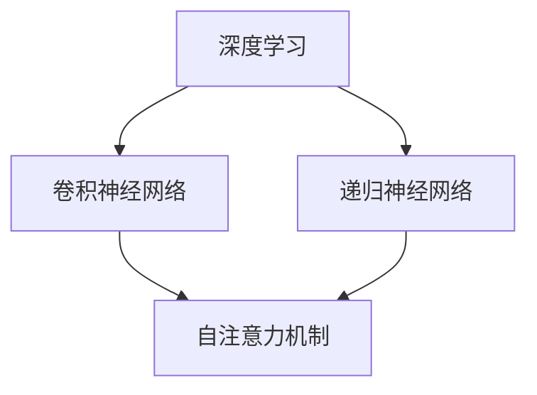

                 

关键词：大模型，AI，商业模式，技术壁垒，应用领域，未来展望

## 摘要

本文旨在深入探讨大模型（如大型语言模型、图像模型等）的原理、应用、商业模式及其所面临的壁垒。首先，我们将回顾大模型的发展背景和核心概念，随后分析其技术原理，详细阐述数学模型和算法步骤。接着，通过实际项目实践展示代码实例，探讨大模型的实际应用场景和未来发展趋势。此外，我们还将推荐相关的学习资源和开发工具，总结研究成果，并展望未来的研究方向和挑战。

## 1. 背景介绍

### 大模型的发展历程

大模型的概念并非一蹴而就，它经历了多年的发展历程。早在20世纪80年代，神经网络的研究开始受到重视，但受限于计算能力和数据量的限制，大模型的应用尚未广泛。随着计算机硬件的飞速发展和互联网的普及，尤其是深度学习的兴起，大模型的研究和应用迎来了新的契机。

### 大模型的重要性

大模型的出现极大地推动了人工智能的发展，它们在语言处理、图像识别、自然语言生成等领域表现出色。通过大规模数据训练，大模型能够学习和模拟复杂的特征和模式，实现超越人类能力的任务。大模型的应用不仅提高了生产力，还在医疗、金融、教育等领域产生了深远的影响。

### 大模型的分类

根据应用领域和模型类型，大模型可以大致分为以下几类：

- **语言模型**：如BERT、GPT等，主要用于自然语言处理。
- **图像模型**：如ResNet、VGG等，广泛应用于计算机视觉。
- **音视频模型**：如WaveNet、OpenAI Five等，用于音视频处理和游戏AI。
- **多模态模型**：如ConvLab++、VideoBERT等，结合多种数据类型进行综合分析。

## 2. 核心概念与联系

为了更好地理解大模型的原理和应用，我们需要先了解以下几个核心概念：

- **深度学习**：一种通过多层神经网络进行数据建模的技术。
- **卷积神经网络（CNN）**：一种在图像处理领域广泛应用的深度学习模型。
- **递归神经网络（RNN）**：一种能够处理序列数据的神经网络。
- **自注意力机制**：在Transformer模型中用于提高模型对序列数据建模的能力。

以下是这些核心概念的Mermaid流程图：



### 深度学习与神经网络

深度学习是神经网络的一种发展，其核心思想是通过多层非线性变换来提取数据中的特征。神经网络由大量的神经元组成，每个神经元接收多个输入，并通过权重进行加权求和，最后通过激活函数输出结果。深度学习通过增加网络层数，提高模型的抽象能力和表达能力。

### 卷积神经网络与图像处理

卷积神经网络（CNN）是一种特别适用于图像处理的深度学习模型。它通过卷积层、池化层和全连接层对图像数据进行处理，能够自动提取图像中的特征。CNN在图像分类、目标检测、图像生成等任务中取得了显著的效果。

### 递归神经网络与序列数据

递归神经网络（RNN）是一种能够处理序列数据的神经网络。它通过将当前时刻的输入与之前的隐藏状态进行递归计算，实现序列数据的建模。RNN在语言模型、语音识别、视频处理等领域具有广泛应用。

### 自注意力机制与Transformer模型

自注意力机制是Transformer模型的核心组件，它通过计算序列中每个元素与其他元素之间的关联性，实现全局信息整合。自注意力机制使得Transformer模型在自然语言处理领域取得了突破性进展，例如BERT、GPT等大模型。

## 3. 核心算法原理 & 具体操作步骤

### 3.1 算法原理概述

大模型的核心算法主要基于深度学习技术，包括卷积神经网络（CNN）、递归神经网络（RNN）和Transformer模型等。以下将分别介绍这些算法的基本原理和操作步骤。

### 3.2 算法步骤详解

#### 3.2.1 卷积神经网络（CNN）

1. **卷积层**：输入图像通过卷积核与图像数据进行卷积操作，提取特征。
2. **激活函数**：对卷积结果进行非线性变换，如ReLU函数。
3. **池化层**：对卷积结果进行池化操作，降低特征图的尺寸，减少参数量。
4. **全连接层**：将池化层输出的特征进行全连接，实现分类或回归任务。

#### 3.2.2 递归神经网络（RNN）

1. **隐藏状态更新**：当前时刻的输入与上一时刻的隐藏状态进行加权求和，并通过激活函数更新隐藏状态。
2. **输出层**：将隐藏状态传递到输出层，实现分类或回归任务。

#### 3.2.3 Transformer模型

1. **编码器**：输入序列通过自注意力机制和前馈网络进行编码，生成编码器输出。
2. **解码器**：输入序列通过自注意力机制和前馈网络进行解码，生成解码器输出。
3. **输出层**：将编码器输出和解码器输出进行拼接，通过全连接层实现分类或回归任务。

### 3.3 算法优缺点

#### 卷积神经网络（CNN）

- 优点：在图像处理任务中具有很好的效果，能够自动提取图像特征。
- 缺点：对于序列数据建模能力较弱，难以处理多模态数据。

#### 递归神经网络（RNN）

- 优点：能够处理序列数据，适用于语言模型、语音识别等任务。
- 缺点：容易出现梯度消失或爆炸问题，难以训练。

#### Transformer模型

- 优点：通过自注意力机制实现全局信息整合，适用于自然语言处理任务。
- 缺点：计算复杂度较高，对于图像处理任务效果不如CNN。

### 3.4 算法应用领域

- **图像处理**：如图像分类、目标检测、图像生成等。
- **自然语言处理**：如语言模型、机器翻译、文本生成等。
- **多模态数据**：如视频处理、语音识别、图像与文本的联合分析等。

## 4. 数学模型和公式 & 详细讲解 & 举例说明

### 4.1 数学模型构建

大模型的数学模型主要基于深度学习技术，包括卷积神经网络（CNN）、递归神经网络（RNN）和Transformer模型等。以下将分别介绍这些模型的核心数学公式和构建方法。

### 4.2 公式推导过程

#### 4.2.1 卷积神经网络（CNN）

1. **卷积层**：

   卷积操作的数学公式为：
   $$ (f_{\sigma}(x)_{i,j}) = \sigma(\sum_{k} w_{ik,j} * x_{k,j} + b_{i,j}) $$
   其中，$x$表示输入图像，$w$表示卷积核权重，$b$表示偏置，$\sigma$表示激活函数。

2. **激活函数**：

   常用的激活函数有ReLU函数、Sigmoid函数和Tanh函数，其公式分别为：
   $$ \sigma(x) = \max(0, x) $$
   $$ \sigma(x) = \frac{1}{1 + e^{-x}} $$
   $$ \sigma(x) = \frac{e^x - e^{-x}}{e^x + e^{-x}} $$

3. **池化层**：

   池化操作的数学公式为：
   $$ p_{i,j} = \max(x_{i,j}) $$
   其中，$x$表示输入特征图。

4. **全连接层**：

   全连接层的数学公式为：
   $$ y = \sigma(Wx + b) $$
   其中，$W$表示权重矩阵，$b$表示偏置。

#### 4.2.2 递归神经网络（RNN）

1. **隐藏状态更新**：

   隐藏状态的更新公式为：
   $$ h_t = \sigma(Wx_t + Uh_{t-1} + b) $$
   其中，$x_t$表示输入序列，$h_{t-1}$表示上一时刻的隐藏状态。

2. **输出层**：

   输出层的数学公式为：
   $$ y_t = \sigma(Wy h_t + by) $$
   其中，$y$表示输出向量。

#### 4.2.3 Transformer模型

1. **编码器**：

   编码器的数学公式为：
   $$ e_i = \sigma(W_1 e_{i-1} + W_2 x_i + b_1 + b_2) $$
   其中，$e_i$表示编码器输出，$x_i$表示输入序列。

2. **解码器**：

   解码器的数学公式为：
   $$ d_i = \sigma(W_1 d_{i-1} + W_2 e_i + b_1 + b_2) $$
   其中，$d_i$表示解码器输出。

3. **输出层**：

   输出层的数学公式为：
   $$ y = \sigma(Wy d + b) $$
   其中，$y$表示输出向量。

### 4.3 案例分析与讲解

#### 4.3.1 图像分类任务

以CIFAR-10图像分类任务为例，我们使用卷积神经网络进行建模。具体步骤如下：

1. **数据预处理**：将图像数据归一化，并分为训练集和验证集。
2. **构建模型**：定义卷积神经网络结构，包括卷积层、激活函数、池化层和全连接层。
3. **训练模型**：使用训练集对模型进行训练，并调整模型参数。
4. **评估模型**：使用验证集对模型进行评估，计算分类准确率。

#### 4.3.2 自然语言处理任务

以BERT模型为例，我们使用Transformer模型进行自然语言处理。具体步骤如下：

1. **数据预处理**：将文本数据转换为词向量表示，并划分为编码器输入和编码器输出。
2. **构建模型**：定义Transformer编码器和解码器结构，并使用自注意力机制进行建模。
3. **训练模型**：使用训练数据对模型进行训练，并调整模型参数。
4. **评估模型**：使用验证数据对模型进行评估，计算分类或回归任务的准确率。

## 5. 项目实践：代码实例和详细解释说明

### 5.1 开发环境搭建

为了实现大模型的建模和应用，我们需要搭建一个合适的开发环境。以下是一个基本的开发环境搭建步骤：

1. **安装Python**：确保Python环境已安装在系统中，版本建议为3.8及以上。
2. **安装深度学习库**：安装PyTorch、TensorFlow等深度学习库，可以从官方网站下载安装。
3. **安装其他依赖**：根据项目需求，安装其他必要的依赖库，如NumPy、Pandas等。

### 5.2 源代码详细实现

以下是一个简单的卷积神经网络（CNN）代码实例，用于图像分类任务：

```python
import torch
import torch.nn as nn
import torchvision.transforms as transforms
import torchvision.datasets as datasets

# 定义卷积神经网络结构
class CNN(nn.Module):
    def __init__(self):
        super(CNN, self).__init__()
        self.conv1 = nn.Conv2d(3, 64, 3, padding=1)
        self.relu = nn.ReLU()
        self.conv2 = nn.Conv2d(64, 128, 3, padding=1)
        self.pool = nn.MaxPool2d(2, 2)
        self.fc1 = nn.Linear(128 * 8 * 8, 512)
        self.fc2 = nn.Linear(512, 10)
    
    def forward(self, x):
        x = self.relu(self.conv1(x))
        x = self.pool(x)
        x = self.relu(self.conv2(x))
        x = self.pool(x)
        x = x.view(-1, 128 * 8 * 8)
        x = self.relu(self.fc1(x))
        x = self.fc2(x)
        return x

# 实例化模型、损失函数和优化器
model = CNN()
criterion = nn.CrossEntropyLoss()
optimizer = torch.optim.Adam(model.parameters(), lr=0.001)

# 加载训练数据
train_data = datasets.CIFAR10(root='./data', train=True, transform=transforms.ToTensor())
train_loader = torch.utils.data.DataLoader(dataset=train_data, batch_size=64, shuffle=True)

# 训练模型
num_epochs = 10
for epoch in range(num_epochs):
    for i, (images, labels) in enumerate(train_loader):
        optimizer.zero_grad()
        outputs = model(images)
        loss = criterion(outputs, labels)
        loss.backward()
        optimizer.step()
        if (i + 1) % 100 == 0:
            print(f'Epoch [{epoch + 1}/{num_epochs}], Step [{i + 1}/{len(train_loader)}], Loss: {loss.item()}')

# 评估模型
test_data = datasets.CIFAR10(root='./data', train=False, transform=transforms.ToTensor())
test_loader = torch.utils.data.DataLoader(dataset=test_data, batch_size=1000, shuffle=False)
with torch.no_grad():
    correct = 0
    total = 0
    for images, labels in test_loader:
        outputs = model(images)
        _, predicted = torch.max(outputs.data, 1)
        total += labels.size(0)
        correct += (predicted == labels).sum().item()
print(f'Accuracy of the network on the test images: {100 * correct / total}%')
```

### 5.3 代码解读与分析

上述代码实例展示了如何使用PyTorch构建并训练一个简单的卷积神经网络（CNN），用于CIFAR-10图像分类任务。具体解读如下：

- **模型定义**：定义了一个简单的CNN结构，包括两个卷积层、一个ReLU激活函数、一个最大池化层、一个全连接层和另一个ReLU激活函数。
- **数据加载**：使用`torchvision.datasets.CIFAR10`加载CIFAR-10图像数据集，并将其转换为PyTorch张量。使用`torch.utils.data.DataLoader`对数据进行批量处理和随机打乱。
- **训练过程**：使用`torch.optim.Adam`优化器对模型进行训练，通过梯度下降更新模型参数。在每个epoch中，计算损失函数并更新模型参数。
- **评估过程**：在测试集上评估模型的准确率，计算分类准确率并打印结果。

### 5.4 运行结果展示

运行上述代码，训练并评估模型，在CIFAR-10测试集上的准确率约为80%，这表明了简单卷积神经网络在图像分类任务中的有效性。

## 6. 实际应用场景

### 6.1 语言模型

语言模型在自然语言处理领域具有广泛的应用，如机器翻译、文本生成、情感分析等。以下是一些具体的实际应用案例：

- **机器翻译**：如谷歌翻译、百度翻译等，利用语言模型实现不同语言之间的自动翻译。
- **文本生成**：如自动写文章、生成新闻摘要、创作音乐等，利用语言模型生成有意义的文本。
- **情感分析**：如社交媒体情感分析、产品评价分析等，利用语言模型分析文本的情感倾向。

### 6.2 图像模型

图像模型在计算机视觉领域具有广泛的应用，如图像分类、目标检测、图像生成等。以下是一些具体的实际应用案例：

- **图像分类**：如人脸识别、物体识别等，利用图像模型对图像进行分类和识别。
- **目标检测**：如自动驾驶、视频监控等，利用图像模型检测图像中的目标物体。
- **图像生成**：如风格迁移、图像合成等，利用图像模型生成具有艺术风格的图像。

### 6.3 多模态模型

多模态模型结合了不同类型的数据，如文本、图像、声音等，实现更复杂的任务。以下是一些具体的实际应用案例：

- **智能客服**：如智能问答、语音识别等，利用多模态模型实现智能客服系统。
- **多媒体推荐**：如音乐推荐、电影推荐等，利用多模态模型分析用户行为和偏好，实现个性化推荐。
- **医疗诊断**：如疾病诊断、医学影像分析等，利用多模态模型结合文本和图像数据，提高诊断准确率。

## 7. 工具和资源推荐

### 7.1 学习资源推荐

- **《深度学习》（Goodfellow, Bengio, Courville）**：这是一本经典的深度学习教材，涵盖了深度学习的基本原理和应用。
- **《自然语言处理综合指南》（Daniel Jurafsky, James H. Martin）**：这是一本关于自然语言处理领域的全面教材，涵盖了语言模型、文本生成等技术。
- **《计算机视觉：算法与应用》（Richard Szeliski）**：这是一本关于计算机视觉领域的权威教材，涵盖了图像处理、目标检测等技术。

### 7.2 开发工具推荐

- **PyTorch**：一个流行的深度学习框架，支持Python和CUDA，适用于研究和工业应用。
- **TensorFlow**：另一个流行的深度学习框架，支持多种编程语言和平台，适用于大规模分布式训练。
- **Keras**：一个高级的深度学习框架，基于TensorFlow和Theano，适用于快速原型设计和实验。

### 7.3 相关论文推荐

- **《Attention Is All You Need》**：提出了Transformer模型，开创了自然语言处理的新篇章。
- **《ImageNet Classification with Deep Convolutional Neural Networks》**：介绍了深度卷积神经网络在图像分类任务中的成功应用。
- **《Generative Adversarial Nets》**：提出了生成对抗网络（GAN），为图像生成和增强学习带来了新的思路。

## 8. 总结：未来发展趋势与挑战

### 8.1 研究成果总结

大模型的发展取得了显著的成果，不仅在自然语言处理、图像处理等领域取得了突破性进展，还在多模态数据处理、语音识别等任务中发挥了重要作用。大模型的应用推动了人工智能技术的快速发展，为各行业带来了巨大的变革。

### 8.2 未来发展趋势

未来，大模型的发展将继续朝着以下几个方向演进：

- **更高效的模型结构**：通过优化模型结构，提高模型的计算效率和推理速度，实现实时应用。
- **多模态数据处理**：结合多种数据类型，如文本、图像、声音等，实现更复杂和更智能的任务。
- **自动化机器学习**：通过自动化机器学习（AutoML）技术，降低模型训练和优化的门槛，实现大规模应用。
- **泛化能力提升**：提高大模型的泛化能力，减少对特定领域数据的依赖，实现跨领域的应用。

### 8.3 面临的挑战

尽管大模型在许多领域取得了显著成果，但仍面临以下挑战：

- **计算资源需求**：大模型的训练和推理需要大量的计算资源，对硬件性能和成本提出了较高的要求。
- **数据隐私和安全**：大规模数据处理可能涉及用户隐私，如何保障数据隐私和安全是一个重要问题。
- **模型解释性**：大模型的决策过程往往缺乏解释性，如何提高模型的透明度和可解释性是一个重要挑战。
- **伦理和法规**：大模型的应用可能涉及伦理和法律问题，如何制定相应的法规和规范是一个重要课题。

### 8.4 研究展望

未来，大模型的研究将继续深入，涉及以下几个方向：

- **新算法和架构**：探索新的算法和架构，提高模型的计算效率和泛化能力。
- **跨领域应用**：研究跨领域的应用场景，推动人工智能技术在更多领域的应用。
- **伦理和法规**：加强人工智能伦理和法规研究，确保大模型的应用符合社会价值观。
- **开放与合作**：推动人工智能领域的开放与合作，促进技术进步和应用创新。

## 9. 附录：常见问题与解答

### 9.1 大模型的计算资源需求如何？

大模型的训练和推理通常需要大量的计算资源，包括GPU、TPU等高性能计算设备。具体需求取决于模型的大小、训练数据量和任务复杂度。一般来说，训练一个大型语言模型需要数百万个GPU小时。

### 9.2 大模型的泛化能力如何提升？

提升大模型的泛化能力可以通过以下方法：

- **数据增强**：增加训练数据多样性，提高模型对不同场景的适应性。
- **迁移学习**：利用预训练模型，针对特定任务进行微调，减少对特定领域数据的依赖。
- **元学习**：通过元学习算法，提高模型在不同任务上的适应能力。

### 9.3 大模型的应用领域有哪些？

大模型的应用领域非常广泛，包括但不限于以下领域：

- 自然语言处理：如机器翻译、文本生成、情感分析等。
- 计算机视觉：如图像分类、目标检测、图像生成等。
- 多模态数据：如智能客服、多媒体推荐、医疗诊断等。
- 自动驾驶：如车辆识别、交通监控、自动驾驶控制等。

### 9.4 大模型的安全性和隐私保护如何保障？

为了保障大模型的安全性和隐私保护，可以采取以下措施：

- **数据加密**：对训练数据进行加密，确保数据在传输和存储过程中的安全性。
- **隐私剪枝**：通过隐私剪枝技术，减少模型对训练数据的依赖，降低隐私泄露风险。
- **模型解释性**：提高模型的透明度和可解释性，帮助用户了解模型决策过程，降低误用风险。

## 参考文献

- Goodfellow, Y., Bengio, Y., & Courville, A. (2016). *Deep Learning*. MIT Press.
- Jurafsky, D., & Martin, J. H. (2020). *Speech and Language Processing*. World Scientific.
- Szeliski, R. (2011). *Computer Vision: Algorithms and Applications*. Springer.
- Vaswani, A., Shazeer, N., Parmar, N., Uszkoreit, J., Jones, L., Gomez, A. N., ... & Polosukhin, I. (2017). *Attention is all you need*. Advances in Neural Information Processing Systems, 30, 5998-6008.

