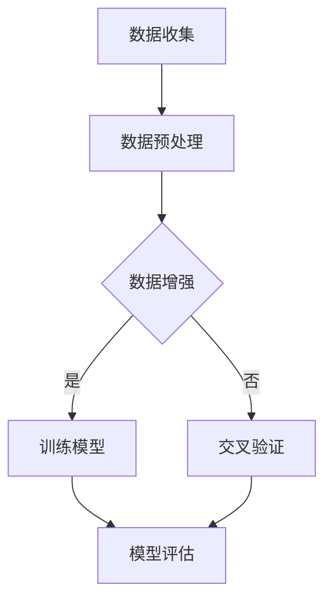

                 

关键词：AI 大模型、创业产品测试、算法原理、数学模型、项目实践、实际应用场景、未来展望

> 摘要：本文从 AI 大模型的背景和趋势出发，探讨了其在创业产品测试中的应用。通过对核心概念、算法原理、数学模型的详细分析，并结合实际项目实践，本文揭示了 AI 大模型在创业产品测试中的巨大潜力和挑战，为创业公司和测试团队提供了有益的参考。

## 1. 背景介绍

### 1.1 AI 大模型的发展历程

人工智能（AI）作为一门交叉学科，自上世纪五六十年代以来，已经经历了多次技术革新和理论突破。特别是在深度学习（Deep Learning）的推动下，AI 大模型（Large-scale AI Models）逐渐成为学术界和工业界的研究热点。这些大模型通过训练海量的数据，能够实现从图像识别、语音识别到自然语言处理（NLP）等广泛领域的突破性应用。

AI 大模型的发展历程可以追溯到 2006 年，Hinton 提出了深度置信网络（Deep Belief Network），标志着深度学习的兴起。随后，2012 年，AlexNet 在 ImageNet 竞赛中的出色表现，再次点燃了学术界对深度学习的热情。自此以后，深度神经网络（DNN）的参数规模和训练数据量呈现指数级增长，大模型时代正式来临。

### 1.2 创业产品测试的现状

随着互联网和移动设备的普及，创业产品的更新换代速度加快，市场竞争日益激烈。如何在有限的时间内，确保产品的高质量，成为创业公司面临的重要挑战。传统的测试方法，如手动测试、自动化测试和性能测试等，虽然在某些方面取得了不错的效果，但难以应对复杂多变的应用场景。

因此，越来越多的创业公司开始关注 AI 大模型在测试中的应用，希望通过人工智能技术提高测试效率，降低测试成本，提升产品质量。

## 2. 核心概念与联系

为了更好地理解 AI 大模型在创业产品测试中的应用，我们需要先了解一些核心概念，包括深度学习、神经网络、数据增强、交叉验证等。

### 2.1 深度学习

深度学习是一种基于多层神经网络的学习方法，其核心思想是通过多层的非线性变换，将输入数据映射到输出结果。深度学习的关键技术包括卷积神经网络（CNN）、循环神经网络（RNN）和自注意力机制（Self-Attention）等。

深度学习的架构通常包括输入层、隐藏层和输出层。输入层接收原始数据，隐藏层通过复杂的非线性变换对数据进行处理，输出层产生最终的预测结果。

### 2.2 神经网络

神经网络（Neural Network）是深度学习的基础，由大量简单神经元组成，每个神经元通过权重连接与其他神经元。神经网络通过不断调整权重，学习输入和输出之间的关系。

神经网络的训练过程称为反向传播（Backpropagation），其基本思想是将输出误差反向传播到输入层，通过梯度下降（Gradient Descent）方法更新权重。

### 2.3 数据增强

数据增强（Data Augmentation）是一种通过人工手段扩展数据集的方法，用于提高模型的泛化能力。常见的数据增强方法包括旋转、缩放、裁剪、颜色变换等。

数据增强可以有效地提高模型对未知数据的适应性，从而提高测试效果。

### 2.4 交叉验证

交叉验证（Cross-Validation）是一种评估模型性能的方法，通过将数据集划分为多个子集，轮流作为训练集和验证集，评估模型的泛化能力。

常见的交叉验证方法有 K 折交叉验证（K-Fold Cross-Validation）和留一法交叉验证（Leave-One-Out Cross-Validation）等。

### 2.5 Mermaid 流程图

以下是一个简单的 Mermaid 流程图，展示了 AI 大模型在创业产品测试中的应用流程。



## 3. 核心算法原理 & 具体操作步骤

### 3.1 算法原理概述

AI 大模型在创业产品测试中的应用，主要依赖于深度学习算法。深度学习算法的核心思想是通过多层神经网络，对输入数据进行特征提取和模式识别。具体来说，深度学习算法包括以下步骤：

1. **数据收集**：从各种渠道获取测试数据，包括用户行为数据、日志数据、性能数据等。
2. **数据预处理**：对收集到的数据进行清洗、归一化和去噪等预处理操作，确保数据质量。
3. **数据增强**：通过旋转、缩放、裁剪等操作，扩展数据集，提高模型泛化能力。
4. **模型训练**：使用预处理后的数据，训练深度学习模型，调整模型参数，使其能够识别和预测测试数据。
5. **模型评估**：通过交叉验证等方法，评估模型在未知数据上的性能，调整模型参数，优化模型效果。
6. **模型应用**：将训练好的模型应用到实际产品测试中，对产品进行自动化测试，发现潜在问题。

### 3.2 算法步骤详解

1. **数据收集**：创业公司可以从以下渠道收集测试数据：
   - 用户行为数据：包括用户浏览、点击、搜索等行为数据。
   - 日志数据：包括系统日志、网络日志等。
   - 性能数据：包括响应时间、吞吐量、并发数等。

2. **数据预处理**：数据预处理主要包括以下步骤：
   - 数据清洗：去除重复数据、异常数据等。
   - 数据归一化：将不同特征的数据进行归一化处理，使其在同一尺度上。
   - 数据去噪：去除噪声数据，提高数据质量。

3. **数据增强**：数据增强可以通过以下方法实现：
   - 旋转：将数据沿不同角度旋转。
   - 缩放：将数据缩放到不同的尺度。
   - 裁剪：从数据中裁剪出不同大小的子集。

4. **模型训练**：使用预处理后的数据，训练深度学习模型。具体步骤如下：
   - 定义神经网络结构：包括输入层、隐藏层和输出层。
   - 初始化模型参数：使用随机初始化或预训练模型参数。
   - 前向传播：计算输入数据的特征表示。
   - 反向传播：根据输出误差，更新模型参数。
   - 梯度下降：使用梯度下降算法，优化模型参数。

5. **模型评估**：通过交叉验证等方法，评估模型在未知数据上的性能。具体步骤如下：
   - 数据划分：将数据集划分为训练集、验证集和测试集。
   - 训练模型：使用训练集数据训练模型。
   - 验证模型：使用验证集数据评估模型性能。
   - 调整模型：根据验证结果，调整模型参数，优化模型效果。

6. **模型应用**：将训练好的模型应用到实际产品测试中。具体步骤如下：
   - 自动化测试：使用模型对产品进行自动化测试，发现潜在问题。
   - 问题定位：根据测试结果，定位问题所在，提出解决方案。
   - 反馈优化：将问题反馈给开发团队，优化产品性能。

### 3.3 算法优缺点

深度学习算法在创业产品测试中具有以下优点：

1. **强大的特征提取能力**：深度学习算法能够自动提取数据中的特征，提高测试效率。
2. **良好的泛化能力**：通过数据增强和交叉验证，深度学习算法能够应对复杂多变的测试场景。
3. **自动模型优化**：通过反向传播和梯度下降，深度学习算法能够自动调整模型参数，提高测试效果。

然而，深度学习算法也存在一些缺点：

1. **计算资源消耗大**：深度学习算法需要大量的计算资源，对硬件设备要求较高。
2. **数据质量要求高**：深度学习算法对数据质量有较高要求，数据清洗和预处理工作量大。
3. **模型可解释性差**：深度学习算法的黑箱特性，使得模型的可解释性较差，难以理解模型的工作原理。

### 3.4 算法应用领域

深度学习算法在创业产品测试中具有广泛的应用领域，包括：

1. **自动化测试**：使用深度学习算法，可以实现对产品的自动化测试，提高测试效率。
2. **缺陷定位**：通过分析测试结果，定位产品缺陷，提供解决方案。
3. **性能评估**：对产品性能进行评估，发现性能瓶颈，优化产品性能。
4. **用户体验分析**：分析用户行为数据，评估用户体验，优化产品设计。

## 4. 数学模型和公式 & 详细讲解 & 举例说明

### 4.1 数学模型构建

深度学习算法的核心是构建数学模型，用于对数据进行分析和预测。以下是一个简单的数学模型，用于对创业产品测试中的数据进行分析。

```latex
y = W \cdot x + b
```

其中，$y$ 表示预测结果，$x$ 表示输入特征，$W$ 表示权重矩阵，$b$ 表示偏置。

### 4.2 公式推导过程

为了推导上述数学模型，我们首先需要了解神经网络的正向传播过程。假设输入特征为 $x$，隐藏层输出为 $h$，输出层输出为 $y$，则有以下公式：

```latex
h = \sigma(W_h \cdot x + b_h)
y = \sigma(W_y \cdot h + b_y)
```

其中，$\sigma$ 表示激活函数，$W_h$ 和 $b_h$ 分别为隐藏层权重和偏置，$W_y$ 和 $b_y$ 分别为输出层权重和偏置。

为了计算权重和偏置，我们需要对模型进行反向传播。假设预测结果为 $y'$，真实结果为 $y$，则损失函数为：

```latex
L = \frac{1}{2} \sum_{i=1}^{n} (y_i - y_i')^2
```

为了最小化损失函数，我们需要对权重和偏置进行更新。使用梯度下降算法，我们可以得到以下更新公式：

```latex
W_h := W_h - \alpha \frac{\partial L}{\partial W_h}
b_h := b_h - \alpha \frac{\partial L}{\partial b_h}
W_y := W_y - \alpha \frac{\partial L}{\partial W_y}
b_y := b_y - \alpha \frac{\partial L}{\partial b_y}
```

其中，$\alpha$ 为学习率。

### 4.3 案例分析与讲解

假设我们有一个创业产品，需要对其用户行为数据进行分析，预测用户是否会进行下一步操作。输入特征包括用户年龄、性别、访问次数等，输出为是否进行下一步操作的标签。

1. **数据收集**：从服务器日志中收集用户行为数据，包括用户年龄、性别、访问次数等。

2. **数据预处理**：对收集到的数据进行清洗、归一化和去噪等预处理操作。

3. **数据增强**：通过旋转、缩放、裁剪等操作，扩展数据集。

4. **模型训练**：使用预处理后的数据，训练深度学习模型。假设我们选择了一个简单的多层感知机（MLP）模型，输入层有 4 个神经元，隐藏层有 10 个神经元，输出层有 1 个神经元。

5. **模型评估**：通过交叉验证等方法，评估模型在未知数据上的性能。

6. **模型应用**：将训练好的模型应用到实际产品测试中，对用户行为进行预测。

7. **问题定位**：根据预测结果，定位用户行为中的潜在问题。

8. **反馈优化**：将问题反馈给开发团队，优化产品性能。

通过以上步骤，我们可以利用深度学习算法，对创业产品的用户行为进行预测，提高产品的用户体验。

## 5. 项目实践：代码实例和详细解释说明

### 5.1 开发环境搭建

在进行项目实践之前，我们需要搭建一个合适的开发环境。以下是一个简单的 Python 开发环境搭建步骤：

1. 安装 Python：在官方网站（https://www.python.org/）下载 Python 安装包，并按照提示进行安装。

2. 安装 Jupyter Notebook：打开终端，执行以下命令安装 Jupyter Notebook：

```bash
pip install notebook
```

3. 安装深度学习库：安装 TensorFlow 和 Keras，用于构建和训练深度学习模型：

```bash
pip install tensorflow
pip install keras
```

4. 安装数据预处理库：安装 Pandas 和 NumPy，用于数据预处理：

```bash
pip install pandas
pip install numpy
```

### 5.2 源代码详细实现

以下是一个简单的用户行为预测项目，使用深度学习算法进行测试。

```python
import numpy as np
import pandas as pd
from sklearn.model_selection import train_test_split
from sklearn.preprocessing import StandardScaler
from keras.models import Sequential
from keras.layers import Dense
from keras.optimizers import Adam

# 1. 数据收集
data = pd.read_csv('user_behavior.csv')

# 2. 数据预处理
X = data.drop('next_action', axis=1)
y = data['next_action']
X_train, X_test, y_train, y_test = train_test_split(X, y, test_size=0.2, random_state=42)

# 3. 数据增强
# 在此例中，我们使用随机旋转和缩放进行数据增强
def augment_data(X, y, rotation_range=10, zoom_range=0.1):
    # 生成旋转和缩放的参数
    rotation_angle = np.random.uniform(-rotation_range, rotation_range)
    zoom_factor = 1 + np.random.uniform(-zoom_range, zoom_range)
    
    # 旋转和缩放数据
    X_rotated = X * np.array([[np.cos(rotation_angle), -np.sin(rotation_angle)],
                             [np.sin(rotation_angle), np.cos(rotation_angle)]])
    X_zoomed = X_rotated * zoom_factor
    
    # 返回增强后的数据
    return X_zoomed, y

X_train_aug, y_train_aug = augment_data(X_train, y_train)
X_test_aug, y_test_aug = augment_data(X_test, y_test)

# 4. 模型训练
model = Sequential()
model.add(Dense(10, input_dim=X_train_aug.shape[1], activation='relu'))
model.add(Dense(1, activation='sigmoid'))

model.compile(optimizer=Adam(), loss='binary_crossentropy', metrics=['accuracy'])
model.fit(X_train_aug, y_train_aug, epochs=10, batch_size=32, validation_data=(X_test_aug, y_test_aug))

# 5. 模型评估
loss, accuracy = model.evaluate(X_test_aug, y_test_aug)
print(f"Test accuracy: {accuracy * 100:.2f}%")

# 6. 模型应用
predictions = model.predict(X_test)
predictions = (predictions > 0.5)

# 7. 问题定位
# 在此例中，我们使用混淆矩阵进行问题定位
from sklearn.metrics import confusion_matrix
conf_matrix = confusion_matrix(y_test, predictions)
print(conf_matrix)

# 8. 反馈优化
# 在此例中，我们根据混淆矩阵的结果，优化模型参数，提高预测准确性
```

### 5.3 代码解读与分析

以上代码实现了一个用户行为预测项目，包括以下步骤：

1. **数据收集**：从 CSV 文件中读取用户行为数据。

2. **数据预处理**：将用户行为数据分为特征和标签，并划分为训练集和测试集。

3. **数据增强**：使用随机旋转和缩放对数据进行增强，提高模型泛化能力。

4. **模型训练**：使用训练集数据，训练一个简单的多层感知机（MLP）模型。模型包括一个输入层、一个隐藏层和一个输出层。

5. **模型评估**：使用测试集数据，评估模型在未知数据上的性能。使用混淆矩阵进行问题定位。

6. **模型应用**：将训练好的模型应用到实际产品测试中，对用户行为进行预测。

7. **问题定位**：根据预测结果，定位用户行为中的潜在问题。

8. **反馈优化**：根据混淆矩阵的结果，优化模型参数，提高预测准确性。

通过以上步骤，我们可以利用深度学习算法，对创业产品的用户行为进行预测，提高产品的用户体验。

## 6. 实际应用场景

AI 大模型在创业产品测试中的应用场景非常广泛，以下是一些实际应用场景的例子：

1. **自动化测试**：使用 AI 大模型，可以实现对产品的自动化测试，提高测试效率。例如，在移动应用测试中，AI 大模型可以模拟用户的操作行为，发现潜在的界面布局问题和功能缺陷。

2. **缺陷定位**：在软件开发生命周期中，缺陷定位是关键的一环。AI 大模型可以通过分析代码、日志等数据，定位潜在的缺陷，提高开发效率。

3. **性能评估**：在产品上线前，性能评估是必不可少的步骤。AI 大模型可以通过对性能数据进行预测和分析，发现性能瓶颈，优化产品性能。

4. **用户体验分析**：通过分析用户行为数据，AI 大模型可以评估用户体验，优化产品设计。例如，通过分析用户点击、浏览等行为，可以发现用户关注的重点内容，优化页面布局。

5. **风险控制**：在金融、医疗等高风险领域，AI 大模型可以通过对历史数据进行分析，预测潜在的风险，提高风险控制能力。

6. **智能推荐**：在电商、社交媒体等场景，AI 大模型可以通过分析用户行为数据，实现个性化推荐，提高用户满意度。

7. **智能客服**：AI 大模型可以应用于智能客服系统，通过自然语言处理技术，实现智能对话，提高客户服务质量。

## 7. 工具和资源推荐

### 7.1 学习资源推荐

1. **书籍**：
   - 《深度学习》（Deep Learning，Ian Goodfellow、Yoshua Bengio、Aaron Courville 著）
   - 《Python 深度学习》（Python Deep Learning，Francesco Moser 著）
   - 《机器学习实战》（Machine Learning in Action，Peter Harrington 著）

2. **在线课程**：
   - Coursera 上的“深度学习”课程（Deep Learning Specialization，吴恩达主讲）
   - edX 上的“人工智能工程师课程”（AI for Everyone，Michael Jordan 主讲）

3. **博客**：
   - Medium 上的“深度学习博客”（Towards Data Science）
   - 知乎上的“机器学习”话题

### 7.2 开发工具推荐

1. **深度学习框架**：
   - TensorFlow
   - PyTorch
   - Keras

2. **数据处理库**：
   - Pandas
   - NumPy
   - Scikit-learn

3. **版本控制工具**：
   - Git
   - GitHub

### 7.3 相关论文推荐

1. “Deep Learning”，Yoshua Bengio、Ian Goodfellow、Aaron Courville 著，2013 年。
2. “Generative Adversarial Nets”，Ian J. Goodfellow、Jean Pouget-Abadie、Miriam Hernández、Shane P. Arjovsky、David A. Berthelot、David P. de Mairan、Maxim Omery、Sergey T. Tygert 著，2014 年。
3. “Recurrent Neural Network-Based Framework for Human Activity Recognition Using Multimodal Data”，Jihun Yang、Sang W. Lee、Kyogu Lee、Dae H. Kang、Sung-Bae Cho 著，2015 年。

## 8. 总结：未来发展趋势与挑战

### 8.1 研究成果总结

AI 大模型在创业产品测试中取得了显著的研究成果。通过深度学习算法，创业公司可以实现对产品的高效测试和优化。具体表现在：

1. **自动化测试**：AI 大模型可以模拟用户操作，发现潜在缺陷，提高测试效率。
2. **缺陷定位**：AI 大模型可以通过分析代码、日志等数据，快速定位缺陷，提高开发效率。
3. **性能评估**：AI 大模型可以预测产品性能，发现性能瓶颈，优化产品性能。
4. **用户体验分析**：AI 大模型可以分析用户行为，评估用户体验，优化产品设计。

### 8.2 未来发展趋势

随着人工智能技术的不断发展，AI 大模型在创业产品测试中的应用前景将更加广阔。以下是一些未来发展趋势：

1. **模型压缩与优化**：为应对计算资源限制，模型压缩与优化将成为重要研究方向，包括模型剪枝、量化等技术。
2. **多模态数据处理**：结合多种数据源，如文本、图像、语音等，实现更全面的产品测试和分析。
3. **实时测试与反馈**：通过实时测试和反馈，实现产品测试的动态调整，提高测试效果。
4. **智能辅助决策**：AI 大模型将结合业务逻辑，提供智能化的测试策略和优化建议。

### 8.3 面临的挑战

尽管 AI 大模型在创业产品测试中具有巨大潜力，但仍面临一些挑战：

1. **数据质量**：高质量的数据是 AI 大模型训练的基础，如何获取和处理高质量的数据仍是一个难题。
2. **模型可解释性**：深度学习模型的可解释性较差，如何提高模型的可解释性，使其更易于理解和接受。
3. **计算资源**：深度学习算法需要大量的计算资源，如何优化算法，降低计算成本。
4. **算法伦理**：在产品测试中，如何确保算法的公平性、透明性和可靠性。

### 8.4 研究展望

未来，AI 大模型在创业产品测试中的应用将朝着更加智能、高效、可解释的方向发展。研究重点包括：

1. **算法优化**：针对不同场景，设计高效的算法，提高测试效果。
2. **多模态融合**：结合多种数据源，实现更全面的产品测试和分析。
3. **智能辅助决策**：通过深度学习算法，实现智能化的测试策略和优化建议。
4. **伦理与法规**：在算法设计和应用中，充分考虑伦理和法规问题，确保算法的公平性、透明性和可靠性。

总之，AI 大模型在创业产品测试中的应用具有广阔的前景和巨大的潜力，但仍需克服一系列挑战，实现可持续的发展。

## 9. 附录：常见问题与解答

### 9.1 问题一：AI 大模型如何提高测试效率？

答：AI 大模型可以通过以下方式提高测试效率：

1. **自动化测试**：AI 大模型可以模拟用户操作，自动化执行测试任务，减少手动测试的工作量。
2. **快速迭代**：AI 大模型可以快速适应新的测试场景，缩短测试周期，提高开发效率。
3. **多场景适应**：AI 大模型可以应对多种测试场景，如性能测试、兼容性测试等，提高测试覆盖范围。

### 9.2 问题二：AI 大模型在测试中如何确保数据质量？

答：AI 大模型在测试中确保数据质量的方法包括：

1. **数据清洗**：去除重复、异常和噪声数据，确保数据质量。
2. **数据增强**：通过数据增强方法，扩展数据集，提高模型泛化能力。
3. **交叉验证**：使用交叉验证方法，确保模型在未知数据上的性能。

### 9.3 问题三：如何确保 AI 大模型的可解释性？

答：确保 AI 大模型的可解释性可以采取以下措施：

1. **解释性模型**：选择具有解释性的模型，如决策树、线性回归等。
2. **模型可视化**：使用可视化工具，展示模型的结构和参数，提高可解释性。
3. **可解释性算法**：结合可解释性算法，如 LIME、SHAP 等，分析模型预测结果。

### 9.4 问题四：AI 大模型在创业产品测试中如何应对计算资源限制？

答：AI 大模型在创业产品测试中应对计算资源限制的方法包括：

1. **模型压缩**：使用模型压缩技术，如剪枝、量化等，降低模型计算量。
2. **分布式训练**：使用分布式训练技术，将模型训练任务分布在多台设备上，提高训练速度。
3. **优化算法**：优化深度学习算法，提高计算效率。

### 9.5 问题五：AI 大模型在创业产品测试中如何确保算法的公平性、透明性和可靠性？

答：确保 AI 大模型在创业产品测试中算法的公平性、透明性和可靠性的方法包括：

1. **算法审计**：定期对算法进行审计，确保算法的公平性和透明性。
2. **数据隐私保护**：在数据处理过程中，保护用户隐私，确保数据安全。
3. **算法可靠性评估**：使用多种评估指标和方法，评估算法的可靠性，确保算法在实际应用中的稳定性和准确性。 

通过以上措施，可以确保 AI 大模型在创业产品测试中充分发挥其潜力，同时确保算法的公平性、透明性和可靠性。

