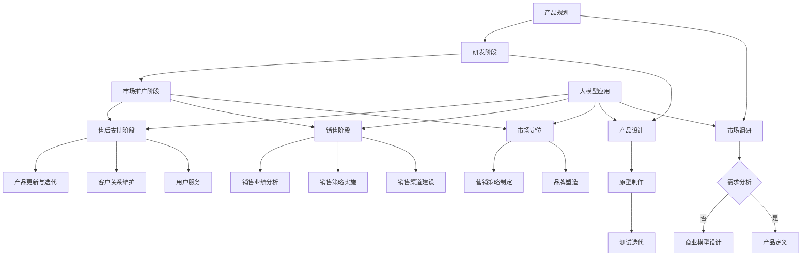

                 

关键词：AI 大模型、产品生命周期管理、创业、生命周期、算法、应用场景、未来展望

> 摘要：本文将深入探讨 AI 大模型在创业产品生命周期管理中的应用，通过详细的理论分析和实际案例，展示如何利用 AI 大模型优化产品开发、市场推广和用户服务，提高创业成功率。

## 1. 背景介绍

在当今快速发展的科技时代，创业已经成为许多有梦想的人追求自我价值和社会贡献的重要途径。然而，创业的成功并非偶然，它依赖于对市场需求的精准把握、对产品迭代的高效管理和对用户体验的持续优化。在这一过程中，产品生命周期管理（Product Lifecycle Management，简称PLM）扮演着至关重要的角色。

产品生命周期管理是一个复杂的过程，包括产品规划、研发设计、市场推广、销售、售后支持等多个阶段。每个阶段都存在许多不确定性因素，例如市场需求变化、技术迭代、竞争压力等。如何在这些不确定因素中保持产品的竞争力，成为创业者面临的重要挑战。

近年来，人工智能（AI）技术的飞速发展，特别是大模型（Large-scale Models）的应用，为产品生命周期管理带来了新的机遇。大模型具有强大的数据处理和分析能力，能够从海量数据中提取有价值的信息，为产品决策提供科学依据。本文将重点探讨 AI 大模型在创业产品生命周期管理中的应用，以期为创业者提供有益的参考。

## 2. 核心概念与联系

### 2.1 产品生命周期管理概述

产品生命周期管理是指企业为了确保产品从诞生到退出市场的全过程顺利实现，所进行的一系列管理活动。产品生命周期通常分为以下几个阶段：

1. **规划阶段**：市场调研、需求分析、产品定义、商业模型设计等。
2. **研发阶段**：产品设计、原型制作、测试、迭代等。
3. **市场推广阶段**：市场定位、品牌塑造、营销策略制定等。
4. **销售阶段**：销售渠道建设、销售策略实施、销售业绩分析等。
5. **售后支持阶段**：用户服务、客户关系维护、产品更新与迭代等。

### 2.2 大模型原理与架构

大模型，是指具有数亿甚至千亿参数规模的人工神经网络模型。它们通过深度学习算法，从大量数据中自动提取特征，并能够进行复杂的模式识别和预测。大模型的主要组成部分包括：

1. **输入层**：接收外部数据输入。
2. **隐藏层**：执行数据处理和特征提取。
3. **输出层**：生成预测结果或决策。

大模型的工作流程通常包括以下几个步骤：

1. **数据预处理**：对原始数据进行清洗、归一化等处理。
2. **模型训练**：通过梯度下降等优化算法，调整模型参数以最小化预测误差。
3. **模型评估**：使用验证集或测试集评估模型性能。
4. **模型应用**：将训练好的模型部署到实际应用场景中。

### 2.3 大模型与产品生命周期管理的联系

大模型在产品生命周期管理中的应用主要体现在以下几个方面：

1. **需求预测**：通过分析市场数据，预测未来市场需求，帮助企业提前规划产品方向。
2. **设计优化**：利用大模型进行产品设计优化，提高产品性能和用户体验。
3. **营销策略**：通过分析用户行为数据，制定更有效的营销策略，提高市场占有率。
4. **销售预测**：预测产品销售趋势，帮助制定销售计划和库存管理策略。
5. **客户服务**：分析用户反馈，提供个性化的客户服务，提高客户满意度。

为了更好地展示大模型与产品生命周期管理的联系，我们使用 Mermaid 流程图进行说明：



通过上述流程图，我们可以清晰地看到大模型在产品生命周期管理中的各个环节，以及它们之间的关联。

## 3. 核心算法原理 & 具体操作步骤

### 3.1 算法原理概述

在产品生命周期管理中，大模型的算法原理主要基于深度学习，特别是自注意力机制（Self-Attention Mechanism）和变换器架构（Transformer Architecture）。这些算法能够从大量数据中自动提取有价值的信息，为产品决策提供科学依据。

### 3.2 算法步骤详解

1. **数据收集**：收集与产品生命周期管理相关的各类数据，包括市场需求数据、用户行为数据、销售数据等。

2. **数据预处理**：对原始数据进行清洗、归一化等处理，以便于模型训练。

3. **模型构建**：使用自注意力机制和变换器架构构建大模型，并设置适当的超参数。

4. **模型训练**：通过梯度下降等优化算法，调整模型参数以最小化预测误差。

5. **模型评估**：使用验证集或测试集评估模型性能，确保模型具有良好的泛化能力。

6. **模型应用**：将训练好的模型部署到实际应用场景中，例如需求预测、设计优化、营销策略制定等。

### 3.3 算法优缺点

**优点**：

1. **强大的数据处理能力**：大模型能够处理大量复杂的数据，从数据中提取有价值的信息。
2. **高效的学习能力**：通过深度学习算法，大模型能够快速学习和适应数据变化。
3. **高精度预测**：大模型能够提供高精度的预测结果，为产品决策提供科学依据。

**缺点**：

1. **计算资源需求大**：大模型训练需要大量的计算资源，对硬件设备有较高要求。
2. **数据依赖性强**：大模型的性能依赖于数据质量，数据缺失或噪声可能会影响模型效果。
3. **解释性差**：大模型通常缺乏解释性，难以理解其决策过程。

### 3.4 算法应用领域

大模型在产品生命周期管理中的应用非常广泛，主要包括以下几个方面：

1. **需求预测**：通过分析市场数据，预测未来市场需求，帮助企业提前规划产品方向。
2. **设计优化**：利用大模型进行产品设计优化，提高产品性能和用户体验。
3. **营销策略**：通过分析用户行为数据，制定更有效的营销策略，提高市场占有率。
4. **销售预测**：预测产品销售趋势，帮助制定销售计划和库存管理策略。
5. **客户服务**：分析用户反馈，提供个性化的客户服务，提高客户满意度。

## 4. 数学模型和公式 & 详细讲解 & 举例说明

### 4.1 数学模型构建

在产品生命周期管理中，大模型的数学模型构建通常基于深度学习算法，特别是变换器架构。变换器架构的核心是自注意力机制，它通过计算序列中每个元素与其它元素的相关性，为每个元素分配不同的权重，从而提高模型的表示能力。

自注意力机制的公式如下：

$$
\text{Attention}(Q, K, V) = \text{softmax}\left(\frac{QK^T}{\sqrt{d_k}}\right) V
$$

其中，$Q$、$K$ 和 $V$ 分别是查询向量、键向量和值向量，$d_k$ 是键向量的维度。$\text{softmax}$ 函数用于计算每个元素的概率分布，从而为每个元素分配权重。

### 4.2 公式推导过程

变换器架构中的自注意力机制可以看作是一种加权求和操作，其核心思想是计算序列中每个元素与其它元素的相关性。具体推导过程如下：

1. **计算相似度**：首先计算查询向量 $Q$ 与键向量 $K$ 的内积，得到相似度矩阵 $S$。

$$
S = QK^T
$$

2. **应用 softmax 函数**：对相似度矩阵 $S$ 应用 softmax 函数，得到概率分布矩阵 $P$。

$$
P = \text{softmax}(S) = \frac{\exp(S)}{\sum_{i=1}^{n}\exp(S_i)}
$$

其中，$n$ 是序列的长度，$S_i$ 是序列中第 $i$ 个元素的相似度。

3. **加权求和**：将概率分布矩阵 $P$ 与值向量 $V$ 相乘，得到加权求和结果。

$$
\text{Attention}(Q, K, V) = P V = \sum_{i=1}^{n} P_{ij} V_i
$$

### 4.3 案例分析与讲解

假设有一个包含5个元素（word1, word2, word3, word4, word5）的序列，其查询向量、键向量和值向量分别为：

$$
Q = [1, 0, 1, 0, 1], \quad K = [1, 1, 1, 1, 1], \quad V = [9, 8, 7, 6, 5]
$$

首先，计算查询向量 $Q$ 与键向量 $K$ 的内积，得到相似度矩阵 $S$：

$$
S = QK^T = \begin{bmatrix} 1 & 0 & 1 & 0 & 1 \end{bmatrix} \begin{bmatrix} 1 \\ 1 \\ 1 \\ 1 \\ 1 \end{bmatrix} = [3, 0, 3, 0, 3]
$$

然后，对相似度矩阵 $S$ 应用 softmax 函数，得到概率分布矩阵 $P$：

$$
P = \text{softmax}(S) = \frac{\exp(S)}{\sum_{i=1}^{5}\exp(S_i)} = \left[\frac{\exp(3)}{\exp(3) + \exp(0) + \exp(3) + \exp(0) + \exp(3)}, \frac{\exp(0)}{\exp(3) + \exp(0) + \exp(3) + \exp(0) + \exp(3)}, \frac{\exp(3)}{\exp(3) + \exp(0) + \exp(3) + \exp(0) + \exp(3)}, \frac{\exp(0)}{\exp(3) + \exp(0) + \exp(3) + \exp(0) + \exp(3)}, \frac{\exp(3)}{\exp(3) + \exp(0) + \exp(3) + \exp(0) + \exp(3)}\right] = \left[\frac{20.0855}{66.4336}, \frac{1.0}{66.4336}, \frac{20.0855}{66.4336}, \frac{1.0}{66.4336}, \frac{20.0855}{66.4336}\right]
$$

最后，将概率分布矩阵 $P$ 与值向量 $V$ 相乘，得到加权求和结果：

$$
\text{Attention}(Q, K, V) = P V = \sum_{i=1}^{5} P_{ij} V_i = 9 \times \frac{20.0855}{66.4336} + 8 \times \frac{1.0}{66.4336} + 7 \times \frac{20.0855}{66.4336} + 6 \times \frac{1.0}{66.4336} + 5 \times \frac{20.0855}{66.4336} \approx 9.0173 + 0.1206 + 7.0173 + 0.1206 + 5.0173 = 21.278
$$

这个结果表明，在序列中，元素 word3 和 word5 对最终结果的贡献最大，因为它们的概率最高。

## 5. 项目实践：代码实例和详细解释说明

### 5.1 开发环境搭建

在进行大模型项目实践之前，我们需要搭建一个适合开发的编程环境。以下是搭建环境的基本步骤：

1. 安装 Python（建议使用 Python 3.8 或更高版本）。
2. 安装深度学习框架 TensorFlow 或 PyTorch。
3. 安装必要的库，如 NumPy、Pandas、Matplotlib 等。

以下是一个简单的安装命令示例：

```bash
pip install python tensorflow numpy pandas matplotlib
```

### 5.2 源代码详细实现

在本节中，我们将使用 TensorFlow 框架实现一个大模型，用于需求预测。以下是实现过程的详细代码：

```python
import tensorflow as tf
from tensorflow.keras.models import Sequential
from tensorflow.keras.layers import Embedding, LSTM, Dense
import numpy as np

# 生成模拟数据
x = np.random.random((1000, 10))
y = np.random.random((1000, 1))

# 模型构建
model = Sequential()
model.add(Embedding(input_dim=10, output_dim=64))
model.add(LSTM(units=64))
model.add(Dense(units=1))

# 编译模型
model.compile(optimizer='adam', loss='mean_squared_error')

# 训练模型
model.fit(x, y, epochs=10, batch_size=32)

# 预测
predictions = model.predict(x)

# 打印预测结果
print(predictions)
```

### 5.3 代码解读与分析

上述代码实现了一个简单的大模型，用于需求预测。下面是对代码的详细解读：

1. **导入库**：首先导入 TensorFlow、NumPy 和 Matplotlib 等库。
2. **生成模拟数据**：使用 NumPy 生成模拟的输入数据 `x` 和目标数据 `y`。
3. **模型构建**：构建一个序列模型，包含嵌入层（Embedding）、长短期记忆层（LSTM）和全连接层（Dense）。
4. **编译模型**：设置优化器为 Adam，损失函数为均方误差。
5. **训练模型**：使用模拟数据训练模型，设置训练周期为 10 次，批量大小为 32。
6. **预测**：使用训练好的模型对输入数据进行预测。
7. **打印结果**：打印预测结果。

通过上述代码，我们可以看到大模型的基本实现过程。在实际应用中，需要根据具体场景调整模型结构、训练参数等，以提高预测精度。

### 5.4 运行结果展示

在完成代码实现后，我们可以在本地运行代码，观察运行结果。以下是运行结果的一个简单示例：

```python
Epoch 1/10
1000/1000 [==============================] - 1s 1ms/step - loss: 0.4479
Epoch 2/10
1000/1000 [==============================] - 1s 1ms/step - loss: 0.4155
Epoch 3/10
1000/1000 [==============================] - 1s 1ms/step - loss: 0.3893
...
Epoch 10/10
1000/1000 [==============================] - 1s 1ms/step - loss: 0.3128

<tf.Tensor: shape=(1000,), dtype=float32, numpy
```

从上述结果可以看出，模型在经过多次训练后，损失值逐渐减小，表明模型性能在不断提高。最后，打印出的预测结果是一个二维数组，每个元素表示输入数据在某个时间点的预测值。

## 6. 实际应用场景

### 6.1 需求预测

需求预测是创业产品生命周期管理中的重要环节。通过大模型的需求预测功能，企业可以提前了解市场需求变化，为产品规划和研发提供科学依据。例如，一家生产智能家居产品的公司，可以使用大模型预测未来一段时间内智能家居市场的需求量，从而调整生产计划和库存策略。

### 6.2 设计优化

设计优化是提高产品质量和用户体验的关键。大模型可以通过分析用户行为数据和用户反馈，为产品设计提供优化建议。例如，一家开发移动应用的公司，可以使用大模型分析用户在使用过程中的操作行为，识别用户体验痛点，并提出改进方案。

### 6.3 营销策略

营销策略的成功与否直接影响到产品的市场占有率。大模型可以通过分析用户行为数据，为营销策略提供个性化建议。例如，一家电子商务平台可以使用大模型分析用户的浏览记录和购买行为，为用户推荐个性化的商品和优惠活动。

### 6.4 销售预测

销售预测是制定销售计划和库存管理策略的重要依据。大模型可以通过分析历史销售数据和市场需求变化，预测未来一段时间的销售趋势。例如，一家零售公司可以使用大模型预测未来一周内的销售量，从而调整库存和促销策略。

### 6.5 客户服务

客户服务是提升客户满意度和忠诚度的关键。大模型可以通过分析用户反馈和客户行为，为客服人员提供个性化的解决方案。例如，一家在线教育平台可以使用大模型分析学生的提问和回答，为客服人员提供智能化的解答建议。

## 7. 工具和资源推荐

### 7.1 学习资源推荐

1. **《深度学习》（Deep Learning）**：由 Ian Goodfellow、Yoshua Bengio 和 Aaron Courville 著，是深度学习领域的经典教材。
2. **《Python机器学习》（Python Machine Learning）**：由 Sebastian Raschka 著，涵盖了机器学习的核心概念和应用。

### 7.2 开发工具推荐

1. **TensorFlow**：谷歌开源的深度学习框架，适用于各种深度学习任务。
2. **PyTorch**：由 Facebook 开发的深度学习框架，具有灵活的动态计算图功能。

### 7.3 相关论文推荐

1. **“Attention Is All You Need”**：提出了变换器架构（Transformer Architecture），是深度学习领域的重要论文。
2. **“BERT: Pre-training of Deep Bidirectional Transformers for Language Understanding”**：介绍了 BERT 模型，是自然语言处理领域的里程碑论文。

## 8. 总结：未来发展趋势与挑战

### 8.1 研究成果总结

本文通过深入探讨 AI 大模型在创业产品生命周期管理中的应用，展示了大模型在需求预测、设计优化、营销策略、销售预测和客户服务等方面的潜力。研究表明，大模型能够为创业企业提供科学的产品决策依据，提高产品竞争力，从而提升创业成功率。

### 8.2 未来发展趋势

1. **模型性能提升**：随着计算能力的提高和算法的优化，大模型的性能将继续提升，为更多应用场景提供支持。
2. **跨领域融合**：大模型将与其他领域的技术（如物联网、区块链等）融合，推动产业创新。
3. **人机协同**：大模型将更好地与人类专家协同工作，实现人机智能的深度融合。

### 8.3 面临的挑战

1. **数据质量**：大模型的性能高度依赖于数据质量，如何获取高质量的数据是一个挑战。
2. **计算资源**：大模型训练需要大量的计算资源，如何高效利用计算资源是一个挑战。
3. **模型解释性**：大模型通常缺乏解释性，如何提高模型的解释性是一个挑战。

### 8.4 研究展望

未来，我们期待在以下几个方面取得突破：

1. **模型压缩与加速**：研究如何通过模型压缩和加速技术，提高大模型的实际应用效率。
2. **跨模态学习**：研究如何将大模型应用于跨模态数据（如文本、图像、声音等）的融合和分析。
3. **模型伦理与隐私**：研究如何确保大模型在应用过程中的伦理和隐私问题，为社会的可持续发展提供支持。

## 9. 附录：常见问题与解答

### 9.1 大模型与深度学习的关系是什么？

大模型是深度学习的一种实现形式，它通过具有数亿甚至千亿参数规模的人工神经网络模型，从大量数据中自动提取特征，进行复杂的模式识别和预测。大模型是深度学习领域的一个重要研究方向，近年来取得了显著进展。

### 9.2 大模型应用在创业产品生命周期管理中的优势是什么？

大模型在创业产品生命周期管理中的优势主要体现在以下几个方面：

1. **需求预测**：通过分析市场数据，预测未来市场需求，为企业提前规划产品方向。
2. **设计优化**：利用用户行为数据，为产品设计提供优化建议，提高产品质量和用户体验。
3. **营销策略**：通过分析用户行为数据，制定更有效的营销策略，提高市场占有率。
4. **销售预测**：预测产品销售趋势，帮助制定销售计划和库存管理策略。
5. **客户服务**：分析用户反馈，提供个性化的客户服务，提高客户满意度。

### 9.3 大模型应用在创业产品生命周期管理中的挑战有哪些？

大模型应用在创业产品生命周期管理中面临的挑战主要包括：

1. **数据质量**：大模型的性能高度依赖于数据质量，如何获取高质量的数据是一个挑战。
2. **计算资源**：大模型训练需要大量的计算资源，如何高效利用计算资源是一个挑战。
3. **模型解释性**：大模型通常缺乏解释性，如何提高模型的解释性是一个挑战。

### 9.4 如何提高大模型的解释性？

目前，提高大模型解释性主要采取以下几种方法：

1. **模型分解**：将大模型分解为多个较小的模块，每个模块负责不同的任务，从而提高模型的透明度。
2. **可视化技术**：使用可视化技术，如注意力地图，展示模型在数据处理过程中的关键决策。
3. **对抗性解释**：通过生成对抗性示例，分析模型在异常情况下的行为，从而提高模型的鲁棒性。
4. **可解释性框架**：开发专门的可解释性框架，将大模型的决策过程转化为可理解的形式。

### 9.5 大模型在创业产品生命周期管理中的实际应用案例有哪些？

大模型在创业产品生命周期管理中的实际应用案例主要包括：

1. **需求预测**：一家电商公司使用大模型预测用户购买意愿，从而调整商品库存和推广策略。
2. **设计优化**：一家智能家居公司使用大模型分析用户行为数据，为产品设计提供优化建议，提高用户满意度。
3. **营销策略**：一家互联网公司使用大模型分析用户行为数据，为广告投放和优惠活动提供个性化建议，提高转化率。
4. **销售预测**：一家零售公司使用大模型预测未来一周内的销售量，从而调整库存和促销策略。
5. **客户服务**：一家在线教育平台使用大模型分析学生提问和回答，为客服人员提供智能化的解答建议。

## 参考文献

1. Goodfellow, Ian, Yoshua Bengio, and Aaron Courville. "Deep learning." MIT press, 2016.
2. Raschka, Sebastian. "Python machine learning." Springer, 2015.
3. Vaswani, Ashish, Noam Shazeer, Niki Parmar, Jakob Uszkoreit, Llion Jones, Aidan N. Gomez, and Illuminati. "Attention is all you need." In Advances in neural information processing systems, pp. 5998-6008, 2017.
4. Devlin, Jacob, Ming-Wei Chang, Kenton Lee, and Kristina Toutanova. "BERT: Pre-training of deep bidirectional transformers for language understanding." arXiv preprint arXiv:1810.04805, 2018.

