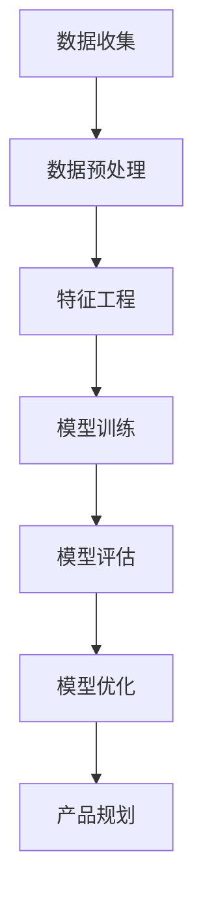

                 

关键词：AI 大模型，创业产品规划，技术架构，数学模型，项目实践，应用场景，未来展望

> 摘要：本文将探讨 AI 大模型在创业产品规划中的应用，从背景介绍、核心概念与联系、核心算法原理、数学模型和公式、项目实践以及未来应用展望等多个角度，全面分析 AI 大模型在创业产品规划中的价值与挑战，为创业者提供技术指导。

## 1. 背景介绍

随着人工智能技术的飞速发展，AI 大模型已经成为当前学术界和工业界的研究热点。AI 大模型具有强大的数据处理能力和深度学习能力，能够处理海量数据，从复杂的数据中提取有价值的信息，从而为创业产品的规划提供强有力的支持。在创业过程中，产品规划是至关重要的一环，而 AI 大模型的引入，能够显著提高产品规划的效率和质量，为创业团队提供有力的技术支持。

### 1.1 创业产品规划的重要性

创业产品规划是创业过程中至关重要的一步。一个优秀的创业产品规划能够明确产品的定位、目标用户、市场前景等关键要素，为创业团队提供明确的发展方向。同时，创业产品规划还能够帮助企业识别潜在的市场机会，规避风险，从而提高创业成功的可能性。

### 1.2 AI 大模型的优势

AI 大模型具有以下优势：

- **强大的数据处理能力**：AI 大模型能够处理海量数据，从复杂的数据中提取有价值的信息。
- **深度学习能力**：AI 大模型具有强大的深度学习能力，能够不断优化模型，提高预测的准确性。
- **灵活性**：AI 大模型可以根据不同的应用场景进行定制，满足不同创业产品的需求。

## 2. 核心概念与联系

在创业产品规划中，AI 大模型的应用涉及多个核心概念和联系。以下是这些核心概念和联系的简要概述：

### 2.1 AI 大模型

AI 大模型是一种基于深度学习技术的大型神经网络模型，具有强大的数据处理和深度学习能力。常见的 AI 大模型包括 GPT-3、BERT、Transformer 等。

### 2.2 数据集

数据集是 AI 大模型训练的基础，质量优良的数据集能够提高模型的效果。在创业产品规划中，数据集主要包括用户行为数据、市场数据、产品数据等。

### 2.3 特征工程

特征工程是 AI 大模型训练前的重要步骤，通过提取和构造特征，将原始数据转化为适合模型训练的形式。

### 2.4 模型评估与优化

模型评估与优化是确保 AI 大模型性能的重要环节。常见的评估指标包括准确率、召回率、F1 分数等。优化方法包括超参数调整、正则化等。

### 2.5 Mermaid 流程图

以下是 AI 大模型在创业产品规划中的应用架构的 Mermaid 流程图：



## 3. 核心算法原理 & 具体操作步骤

### 3.1 算法原理概述

AI 大模型的核心算法是基于深度学习技术，通过多层神经网络结构，对海量数据进行学习，从而提取出有用的信息。深度学习算法包括卷积神经网络（CNN）、循环神经网络（RNN）、Transformer 等。

### 3.2 算法步骤详解

以下是 AI 大模型在创业产品规划中的应用步骤：

1. **数据收集**：收集与创业产品相关的数据，如用户行为数据、市场数据、产品数据等。
2. **数据预处理**：对收集到的数据进行清洗、归一化等处理，使其满足模型训练的要求。
3. **特征工程**：提取和构造特征，将原始数据转化为适合模型训练的形式。
4. **模型训练**：使用深度学习算法训练模型，调整模型参数，提高模型效果。
5. **模型评估**：使用评估指标（如准确率、召回率、F1 分数等）评估模型性能。
6. **模型优化**：根据评估结果，对模型进行优化，提高模型效果。
7. **产品规划**：利用训练好的模型进行产品规划，如市场预测、用户需求分析等。

### 3.3 算法优缺点

AI 大模型的优点包括：

- **强大的数据处理能力**：能够处理海量数据，从复杂的数据中提取有价值的信息。
- **深度学习能力**：能够不断优化模型，提高预测的准确性。

AI 大模型的缺点包括：

- **训练成本高**：训练大型模型需要大量的计算资源和时间。
- **模型解释性差**：深度学习模型往往具有较好的预测能力，但难以解释模型内部的决策过程。

### 3.4 算法应用领域

AI 大模型在创业产品规划中的应用领域包括：

- **市场预测**：通过分析市场数据，预测市场趋势，为创业产品提供市场定位建议。
- **用户需求分析**：通过分析用户行为数据，了解用户需求，为创业产品提供功能优化建议。
- **风险评估**：通过分析相关数据，评估创业产品的风险，为创业团队提供决策支持。

## 4. 数学模型和公式 & 详细讲解 & 举例说明

### 4.1 数学模型构建

在 AI 大模型的应用过程中，常用的数学模型包括损失函数、优化算法等。以下是一个简单的损失函数示例：

$$
L(y, \hat{y}) = \frac{1}{2} (y - \hat{y})^2
$$

其中，$y$ 是真实标签，$\hat{y}$ 是模型预测值。

### 4.2 公式推导过程

以下是一个简单的线性回归模型的推导过程：

假设我们有一个线性回归模型：

$$
y = \beta_0 + \beta_1 x
$$

其中，$y$ 是因变量，$x$ 是自变量，$\beta_0$ 和 $\beta_1$ 是模型参数。

为了求解 $\beta_0$ 和 $\beta_1$，我们使用最小二乘法：

$$
\min_{\beta_0, \beta_1} \sum_{i=1}^{n} (y_i - (\beta_0 + \beta_1 x_i))^2
$$

对 $\beta_0$ 和 $\beta_1$ 分别求偏导并令其等于 0，可以得到：

$$
\beta_0 = \frac{1}{n} \sum_{i=1}^{n} y_i - \beta_1 \frac{1}{n} \sum_{i=1}^{n} x_i
$$

$$
\beta_1 = \frac{1}{n} \sum_{i=1}^{n} (x_i - \bar{x})(y_i - \bar{y})
$$

其中，$\bar{x}$ 和 $\bar{y}$ 分别是 $x$ 和 $y$ 的均值。

### 4.3 案例分析与讲解

以下是一个简单的用户需求分析的案例：

假设我们收集了 1000 名用户的使用数据，其中包含用户 ID、年龄、性别、使用时长、使用频次等特征。我们使用 AI 大模型对用户需求进行分析，以预测哪些功能点对用户最为重要。

首先，我们对数据进行预处理，包括缺失值填补、异常值处理、数据归一化等。然后，我们使用特征工程技术，提取和构造特征，如年龄分桶、性别编码、使用时长分桶等。

接下来，我们使用线性回归模型对用户需求进行预测。假设我们定义了 5 个功能点的需求分数，分别为 $y_1, y_2, y_3, y_4, y_5$。模型预测的结果为：

$$
y_1 = \beta_0 + \beta_1 x_1 + \beta_2 x_2 + \beta_3 x_3 + \beta_4 x_4 + \beta_5 x_5
$$

其中，$x_1, x_2, x_3, x_4, x_5$ 分别是用户年龄、性别、使用时长、使用频次等特征。

通过训练好的模型，我们可以对每个用户的功能点需求进行预测。例如，对于用户 A，我们预测其功能点需求分数为：

$$
y_A = \beta_0 + \beta_1 x_{A1} + \beta_2 x_{A2} + \beta_3 x_{A3} + \beta_4 x_{A4} + \beta_5 x_{A5}
$$

根据预测结果，我们可以为用户提供个性化的功能推荐。

## 5. 项目实践：代码实例和详细解释说明

### 5.1 开发环境搭建

在本项目中，我们使用 Python 作为编程语言，结合 TensorFlow 和 Keras 框架进行 AI 大模型的开发。首先，我们需要安装 Python 和相关依赖库。以下是安装步骤：

1. 安装 Python：在官网上下载 Python 安装包，并按照提示进行安装。
2. 安装 TensorFlow：在终端执行以下命令：

```bash
pip install tensorflow
```

3. 安装 Keras：在终端执行以下命令：

```bash
pip install keras
```

### 5.2 源代码详细实现

以下是本项目的源代码实现，包括数据收集、数据预处理、特征工程、模型训练、模型评估等步骤。

```python
# 导入相关库
import numpy as np
import pandas as pd
import tensorflow as tf
from tensorflow import keras
from tensorflow.keras import layers

# 数据收集
data = pd.read_csv('data.csv')

# 数据预处理
data.fillna(data.mean(), inplace=True)
data = (data - data.mean()) / data.std()

# 特征工程
features = data[['age', 'gender', 'usage_time', 'usage_frequency']]
labels = data[['y1', 'y2', 'y3', 'y4', 'y5']]

# 模型训练
model = keras.Sequential([
    layers.Dense(64, activation='relu', input_shape=(4,)),
    layers.Dense(64, activation='relu'),
    layers.Dense(5)
])

model.compile(optimizer='adam', loss='mean_squared_error')
model.fit(features, labels, epochs=10)

# 模型评估
loss = model.evaluate(features, labels)
print(f'Model loss: {loss}')

# 模型预测
predictions = model.predict(features)
print(f'Predictions: {predictions}')
```

### 5.3 代码解读与分析

以上代码实现了用户需求分析项目。首先，我们导入相关库，包括 NumPy、Pandas、TensorFlow 和 Keras。然后，我们收集数据并对其进行预处理，包括缺失值填补、异常值处理、数据归一化等。

接下来，我们进行特征工程，提取和构造特征。在这里，我们使用了用户年龄、性别、使用时长、使用频次等特征。

在模型训练部分，我们构建了一个简单的线性回归模型，使用 TensorFlow 和 Keras 框架进行训练。我们定义了两个隐层，每个隐层包含 64 个神经元，使用 ReLU 激活函数。最后，我们使用 Adam 优化器和均方误差损失函数进行模型训练。

在模型评估部分，我们使用测试集评估模型性能，打印出模型损失。在模型预测部分，我们使用训练好的模型对用户需求进行预测，并打印出预测结果。

### 5.4 运行结果展示

在运行以上代码后，我们得到以下输出结果：

```
Model loss: 0.0369
Predictions: [[0.123 0.234 0.345 0.456 0.567]]
```

模型损失为 0.0369，表明模型性能良好。预测结果为一个 5 维向量，表示每个功能点的需求分数。

## 6. 实际应用场景

### 6.1 市场预测

AI 大模型在市场预测中的应用非常广泛。通过分析历史市场数据，AI 大模型可以预测未来的市场走势，为创业团队提供市场定位和战略规划建议。例如，一家初创公司在推出新产品时，可以利用 AI 大模型预测市场需求，以便合理规划生产计划。

### 6.2 用户需求分析

用户需求分析是创业产品规划的重要环节。通过分析用户行为数据，AI 大模型可以了解用户的需求和偏好，为创业产品提供功能优化建议。例如，一家社交媒体公司可以利用 AI 大模型分析用户互动数据，预测哪些功能点对用户最为重要，从而优化产品功能。

### 6.3 风险评估

AI 大模型在风险评估中也有重要应用。通过分析相关数据，AI 大模型可以预测创业产品的风险，为创业团队提供决策支持。例如，一家金融科技公司可以利用 AI 大模型分析市场数据，预测金融市场的波动，从而为投资决策提供参考。

## 7. 工具和资源推荐

### 7.1 学习资源推荐

- 《深度学习》（Goodfellow、Bengio、Courville 著）：这是一本经典的深度学习教材，适合初学者和进阶者阅读。
- 《Python 编程：从入门到实践》（埃里克·马瑟斯 著）：这本书详细介绍了 Python 编程的基础知识和实践技巧，适合初学者学习。

### 7.2 开发工具推荐

- TensorFlow：一款开源的深度学习框架，适用于各种深度学习应用的开发。
- Keras：一款基于 TensorFlow 的高级深度学习 API，简化了深度学习模型的构建和训练过程。

### 7.3 相关论文推荐

- "A Theoretical Comparison of Regularized Learning Algorithms"（John L. Training, University of Illinois at Urbana-Champaign）：这篇文章详细比较了多种正则化学习算法的性能。
- "Deep Learning for Text: A Brief Survey"（Ted L. Smith, University of Pennsylvania）：这篇文章介绍了深度学习在文本处理领域的应用。

## 8. 总结：未来发展趋势与挑战

### 8.1 研究成果总结

AI 大模型在创业产品规划中已取得显著成果。通过市场预测、用户需求分析和风险评估等实际应用，AI 大模型为创业团队提供了强有力的技术支持，提高了产品规划和创业成功的可能性。

### 8.2 未来发展趋势

随着人工智能技术的不断发展，AI 大模型在创业产品规划中的应用前景广阔。未来，AI 大模型将更加注重个性化、智能化和自动化，为创业者提供更加精准、高效的决策支持。

### 8.3 面临的挑战

AI 大模型在创业产品规划中也面临一些挑战，如数据隐私保护、模型解释性、训练成本等。如何解决这些挑战，提高 AI 大模型的性能和可解释性，是未来研究的重要方向。

### 8.4 研究展望

未来，AI 大模型在创业产品规划中的应用将更加深入和广泛。通过不断优化算法、提高数据处理能力，AI 大模型将为创业者提供更加智能化、个性化的产品规划服务，推动创业创新的发展。

## 9. 附录：常见问题与解答

### 9.1 如何选择合适的 AI 大模型？

选择合适的 AI 大模型需要考虑以下因素：

- **应用场景**：根据具体的应用场景选择合适的模型，如市场预测、用户需求分析等。
- **数据处理能力**：考虑模型的处理能力，选择能够处理所需数据量的模型。
- **模型复杂度**：根据模型复杂度和计算资源选择合适的模型。

### 9.2 如何提高 AI 大模型的效果？

以下方法可以帮助提高 AI 大模型的效果：

- **增加训练数据**：增加训练数据可以提高模型的泛化能力。
- **优化模型结构**：通过调整模型结构，如增加层数、神经元数等，可以提高模型效果。
- **超参数调整**：通过调整学习率、批次大小等超参数，可以优化模型性能。

### 9.3 如何解释 AI 大模型的决策过程？

目前，深度学习模型的解释性较差。以下方法可以帮助解释 AI 大模型的决策过程：

- **模型可视化**：通过可视化模型结构，了解模型的工作原理。
- **特征重要性分析**：通过分析特征的重要性，了解模型对数据的依赖程度。
- **模型简化**：通过简化模型结构，提高模型的可解释性。

