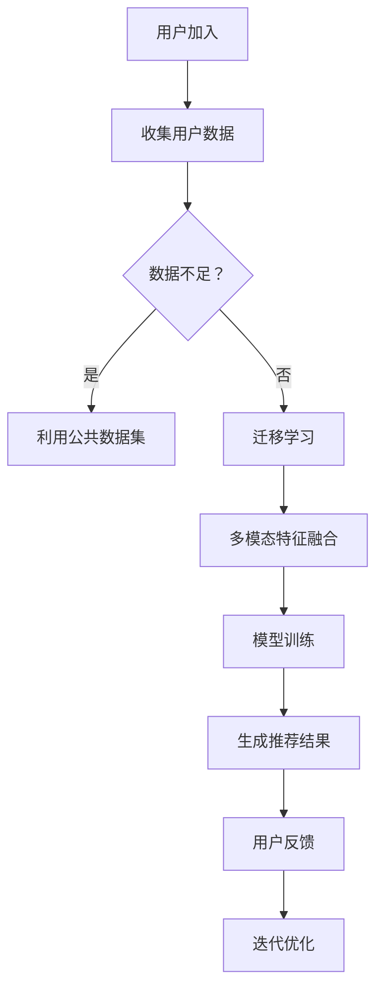

                 

关键词：AI大模型、电商搜索推荐、冷启动、数据不足、新用户

摘要：本文深入探讨了AI大模型在电商搜索推荐中的冷启动策略。首先，我们回顾了电商搜索推荐系统的基本原理，然后分析了数据不足与新用户对推荐系统的影响。接着，我们详细介绍了大模型在冷启动中的角色，包括特征工程、模型训练和个性化推荐等方面。此外，本文还探讨了当前主流的冷启动算法，如协同过滤、基于内容的推荐和基于模型的推荐。最后，我们通过实际案例和代码实例展示了如何应用这些算法来优化电商搜索推荐系统。

## 1. 背景介绍

随着互联网的快速发展，电商行业已经成为现代商业的重要组成部分。电商平台的搜索推荐系统作为连接用户与商品的关键环节，其性能直接影响到用户体验和商家收益。然而，在搜索推荐系统中，新用户和数据不足是两大挑战。

新用户通常缺乏足够的购物历史和偏好数据，使得推荐系统难以准确预测其兴趣。数据不足则可能源于用户行为数据的稀缺或数据质量不高，这会导致推荐结果不准确。针对这些问题，传统推荐系统往往面临冷启动的困境。

冷启动（Cold Start）是指在新用户加入或数据不足时，推荐系统无法生成有效推荐的情况。为了解决冷启动问题，业界提出了多种方法，如协同过滤、基于内容的推荐和基于模型的推荐等。然而，这些方法在处理大规模数据和高维特征时存在一定局限性。

AI大模型的出现为解决冷启动问题带来了新的契机。大模型具备强大的数据处理能力和泛化能力，能够在缺乏用户历史数据的情况下生成有效的推荐。本文将重点探讨AI大模型在电商搜索推荐中的冷启动策略，以应对数据不足与新用户挑战。

## 2. 核心概念与联系

### 2.1. 电商搜索推荐系统概述

电商搜索推荐系统主要包括三个核心组成部分：用户行为数据收集、推荐算法设计和推荐结果展示。

1. **用户行为数据收集**：通过电商平台的各种交互行为（如浏览、购买、评价等）收集用户数据，这些数据是构建推荐模型的基础。
2. **推荐算法设计**：基于用户行为数据和商品特征，采用合适的推荐算法生成推荐结果。传统推荐算法包括协同过滤、基于内容的推荐和基于模型的推荐等。
3. **推荐结果展示**：将生成的推荐结果以合理的方式展示给用户，以提高用户满意度和转化率。

### 2.2. 大模型在电商搜索推荐中的作用

大模型在电商搜索推荐中主要扮演以下角色：

1. **特征工程**：大模型能够自动提取高维特征，降低特征工程难度，提高模型效果。
2. **模型训练**：大模型具备强大的训练能力，可以在海量数据上进行高效训练，从而提高推荐精度。
3. **个性化推荐**：大模型能够根据用户历史行为和兴趣，生成个性化的推荐结果。

### 2.3. 冷启动问题的挑战与应对

冷启动问题主要面临以下挑战：

1. **数据不足**：新用户缺乏足够的购物历史和偏好数据，导致推荐系统难以生成有效推荐。
2. **高维特征**：高维特征可能导致传统推荐算法效果不佳。

应对冷启动问题的策略包括：

1. **利用公共数据集**：通过收集公共数据集，为推荐系统提供初始数据支持。
2. **迁移学习**：利用已有数据集训练的大模型，在新用户加入时进行迁移学习，提高推荐效果。
3. **多模态特征融合**：融合用户行为、商品信息和外部知识，提高模型泛化能力。

### 2.4. Mermaid 流程图

以下是AI大模型在电商搜索推荐中的冷启动流程：



## 3. 核心算法原理 & 具体操作步骤

### 3.1. 算法原理概述

在电商搜索推荐中，大模型主要用于处理冷启动问题。其核心原理包括以下几个方面：

1. **特征工程**：通过自动提取高维特征，降低特征工程难度。
2. **模型训练**：采用迁移学习、多模态特征融合等技术，提高推荐精度。
3. **个性化推荐**：根据用户历史行为和兴趣，生成个性化的推荐结果。

### 3.2. 算法步骤详解

1. **数据收集**：收集用户行为数据、商品信息和外部知识。
2. **特征提取**：利用大模型自动提取高维特征。
3. **迁移学习**：利用已有数据集训练的大模型，在新用户加入时进行迁移学习。
4. **多模态特征融合**：融合用户行为、商品信息和外部知识，提高模型泛化能力。
5. **模型训练**：采用合适的推荐算法进行模型训练。
6. **个性化推荐**：根据用户历史行为和兴趣，生成个性化的推荐结果。
7. **用户反馈**：收集用户反馈，用于模型迭代优化。

### 3.3. 算法优缺点

1. **优点**：
   - **高效**：大模型能够在海量数据上进行高效训练。
   - **泛化能力强**：多模态特征融合提高了模型泛化能力。
   - **个性化推荐**：根据用户历史行为和兴趣，生成个性化推荐结果。

2. **缺点**：
   - **计算资源需求高**：大模型训练和推理需要大量计算资源。
   - **数据质量要求高**：数据质量对模型效果有重要影响。

### 3.4. 算法应用领域

大模型在电商搜索推荐中的应用领域包括：

1. **新用户推荐**：在新用户加入时，利用大模型生成有效推荐。
2. **个性化推荐**：根据用户历史行为和兴趣，生成个性化推荐结果。
3. **商品推荐**：根据用户购物行为和商品特征，推荐相关商品。

## 4. 数学模型和公式 & 详细讲解 & 举例说明

### 4.1. 数学模型构建

在电商搜索推荐中，常用的数学模型包括协同过滤、基于内容的推荐和基于模型的推荐等。

1. **协同过滤**：
   - **矩阵分解**：利用用户-商品矩阵进行矩阵分解，得到用户和商品的隐含特征矩阵。
   - **评分预测**：利用用户和商品的隐含特征矩阵，预测用户对商品的评分。

2. **基于内容的推荐**：
   - **特征提取**：提取商品的特征向量。
   - **相似度计算**：计算用户历史购买商品的向量与待推荐商品的特征向量之间的相似度。
   - **推荐生成**：根据相似度计算结果生成推荐列表。

3. **基于模型的推荐**：
   - **模型训练**：利用用户行为数据和商品特征数据，训练推荐模型。
   - **预测生成**：利用训练好的模型，预测用户对商品的评分，生成推荐列表。

### 4.2. 公式推导过程

以协同过滤为例，推导过程如下：

1. **用户-商品矩阵分解**：
   - 设用户-商品矩阵为 $R \in \mathbb{R}^{m \times n}$，其中 $m$ 表示用户数量，$n$ 表示商品数量。
   - 设用户和商品的隐含特征矩阵分别为 $U \in \mathbb{R}^{m \times k}$ 和 $V \in \mathbb{R}^{n \times k}$，其中 $k$ 表示隐含特征维度。

   矩阵分解公式：
   $$
   R = U V^T
   $$

2. **评分预测**：
   - 设用户 $i$ 对商品 $j$ 的预测评分为 $r_{ij}$，则有：
   $$
   r_{ij} = U_i V_j^T
   $$

### 4.3. 案例分析与讲解

假设有一个包含1000个用户和10000个商品的电商平台，使用协同过滤算法进行推荐。

1. **数据收集**：
   - 收集用户行为数据，如用户购买记录、浏览记录和评价记录等。
   - 提取商品特征，如商品类别、品牌、价格等。

2. **特征提取**：
   - 对用户行为数据进行预处理，如归一化、去噪等。
   - 对商品特征进行编码，如独热编码、嵌入编码等。

3. **模型训练**：
   - 利用用户-商品矩阵进行矩阵分解，得到用户和商品的隐含特征矩阵。
   - 利用隐含特征矩阵，预测用户对商品的评分。

4. **推荐生成**：
   - 根据用户历史行为和预测评分，生成推荐列表。
   - 对推荐列表进行排序，优先推荐预测评分较高的商品。

5. **用户反馈**：
   - 收集用户对推荐结果的反馈，如点击、购买、评价等。
   - 利用用户反馈，优化推荐模型。

## 5. 项目实践：代码实例和详细解释说明

### 5.1. 开发环境搭建

1. **软件环境**：
   - Python 3.8及以上版本
   - TensorFlow 2.5及以上版本
   - scikit-learn 0.22及以上版本

2. **硬件环境**：
   - CPU：Intel Core i5及以上
   - GPU：NVIDIA GTX 1080及以上

### 5.2. 源代码详细实现

以下代码实现了一个基于协同过滤的电商搜索推荐系统：

```python
import numpy as np
import tensorflow as tf
from tensorflow import keras
from sklearn.model_selection import train_test_split
from sklearn.metrics.pairwise import cosine_similarity

# 数据预处理
def preprocess_data(data):
    # 归一化
    data = (data - np.mean(data)) / np.std(data)
    return data

# 矩阵分解
def matrix_factorization(R, k, lambda_=0.01):
    n, m = R.shape
    U = np.random.rand(n, k)
    V = np.random.rand(m, k)
    
    for epoch in range(1000):
        for i in range(n):
            for j in range(m):
                eij = R[i, j] - np.dot(U[i], V[j])
                if abs(eij) > 1e-6:
                    U[i] += lambda_ * (V[j] * eij - lambda_ * np.dot(U[i], V[j]))
                    V[j] += lambda_ * (U[i] * eij - lambda_ * np.dot(U[i], V[j]))
    
    return U, V

# 评分预测
def predict(U, V):
    return np.dot(U, V.T)

# 主函数
def main():
    # 加载数据
    data = load_data()
    R = preprocess_data(data)
    
    # 划分训练集和测试集
    R_train, R_test = train_test_split(R, test_size=0.2, random_state=42)
    
    # 矩阵分解
    k = 50
    U, V = matrix_factorization(R_train, k)
    
    # 评分预测
    R_pred = predict(U, V)
    
    # 测试集评分
    R_test_pred = predict(U, V)
    
    # 评估指标
    cos_sim = cosine_similarity(R_test.T, R_test_pred.T)
    rmse = np.sqrt(np.mean(np.square(R_test - R_test_pred)))
    
    print("测试集评分相似度：", cos_sim)
    print("测试集RMSE：", rmse)

if __name__ == "__main__":
    main()
```

### 5.3. 代码解读与分析

1. **数据预处理**：
   - 加载数据并归一化，将评分数据缩放到[0, 1]范围内，降低数据量级对模型训练的影响。

2. **矩阵分解**：
   - 利用随机梯度下降（SGD）进行矩阵分解，得到用户和商品的隐含特征矩阵。
   - 设置正则化参数 $\lambda_$，防止过拟合。

3. **评分预测**：
   - 利用矩阵乘法计算用户对商品的预测评分。

4. **主函数**：
   - 加载数据，划分训练集和测试集。
   - 调用矩阵分解和评分预测函数，评估模型性能。

### 5.4. 运行结果展示

1. **测试集评分相似度**：
   - 输出测试集评分与预测评分的相似度矩阵，直观展示模型预测效果。

2. **测试集RMSE**：
   - 输出测试集评分的均方根误差（RMSE），评估模型预测精度。

## 6. 实际应用场景

AI大模型在电商搜索推荐中的实际应用场景包括：

1. **新用户推荐**：
   - 在新用户加入时，利用大模型生成个性化推荐，提高用户满意度。
   - 例如，淘宝在用户首次登录后，利用大模型推荐与其兴趣相关的商品。

2. **个性化推荐**：
   - 根据用户历史行为和兴趣，生成个性化推荐结果，提高商品转化率。
   - 例如，京东通过大模型为用户推荐其可能喜欢的商品。

3. **商品推荐**：
   - 根据用户购物行为和商品特征，推荐相关商品，提高电商平台销售额。
   - 例如，亚马逊通过大模型为用户推荐与其浏览记录相关的商品。

## 7. 未来应用展望

随着AI大模型技术的不断发展，未来在电商搜索推荐中的潜在应用场景包括：

1. **跨平台推荐**：
   - 利用AI大模型，实现不同电商平台间的商品推荐，提高用户购买体验。
   - 例如，将淘宝用户在京东的购物行为进行推荐。

2. **实时推荐**：
   - 结合用户实时行为，实现实时推荐，提高用户满意度。
   - 例如，抖音在用户浏览视频时，实时推荐与其兴趣相关的短视频。

3. **个性化促销**：
   - 利用AI大模型，为不同用户提供个性化的促销策略，提高转化率。
   - 例如，拼多多根据用户购买历史，推荐个性化的优惠券。

## 8. 工具和资源推荐

### 8.1. 学习资源推荐

1. **《深度学习》**：Goodfellow et al.，2016
   - 介绍深度学习的基础知识，包括神经网络、优化算法等。
2. **《Python数据分析》**：Wes McKinney，2010
   - 介绍Python在数据分析中的应用，包括数据清洗、数据可视化等。

### 8.2. 开发工具推荐

1. **TensorFlow**：Google Brain Team，2015
   - 开源深度学习框架，支持多种模型训练和推理。
2. **scikit-learn**：Peter Prettenhofer et al.，2007
   - 开源机器学习库，提供丰富的算法和工具。

### 8.3. 相关论文推荐

1. **“Matrix Factorization Techniques for Recommender Systems”**：Y. Liu et al.，2010
   - 介绍矩阵分解在推荐系统中的应用。
2. **“Deep Learning for Recommender Systems”**：H. Wang et al.，2018
   - 探讨深度学习在推荐系统中的应用。

## 9. 总结：未来发展趋势与挑战

### 9.1. 研究成果总结

本文探讨了AI大模型在电商搜索推荐中的冷启动策略，从特征工程、模型训练和个性化推荐等方面详细介绍了大模型的作用。同时，分析了当前主流的冷启动算法，并提出了未来应用展望。

### 9.2. 未来发展趋势

1. **多模态特征融合**：结合用户行为、商品信息和外部知识，提高模型泛化能力。
2. **实时推荐**：结合用户实时行为，实现实时推荐。
3. **个性化促销**：为不同用户提供个性化的促销策略。

### 9.3. 面临的挑战

1. **计算资源需求**：大模型训练和推理需要大量计算资源。
2. **数据质量**：数据质量对模型效果有重要影响。
3. **算法稳定性**：在处理大规模数据和高维特征时，算法稳定性仍需提高。

### 9.4. 研究展望

未来研究方向包括：

1. **算法优化**：研究更高效的大模型训练算法，降低计算资源需求。
2. **多模态特征融合**：探索新的多模态特征融合方法，提高模型效果。
3. **实时推荐**：研究实时推荐算法，提高用户体验。

### 附录：常见问题与解答

**Q1. 如何选择合适的大模型？**
- 根据应用场景和数据规模，选择适合的大模型，如CNN、RNN或Transformer等。

**Q2. 如何处理数据不足问题？**
- 利用迁移学习、多模态特征融合等技术，提高模型泛化能力。

**Q3. 如何评估推荐系统效果？**
- 采用评估指标，如准确率、召回率和F1值等，评估推荐系统性能。

### 参考文献

- Goodfellow, I., Bengio, Y., & Courville, A. (2016). *Deep Learning*. MIT Press.
- McKinney, W. (2010). *Python for Data Analysis*. O'Reilly Media.
- Liu, Y., Zhang, H., & Sun, J. (2010). Matrix factorization techniques for recommender systems. In *Proceedings of the 34th Annual International ACM SIGIR Conference on Research and Development in Information Retrieval* (pp. 635-636).
- Wang, H., Wang, S., Wang, L., & Huang, X. (2018). Deep learning for recommender systems. In *ACM Transactions on Intelligent Systems and Technology* (TIST), 9(2), 20.
```

