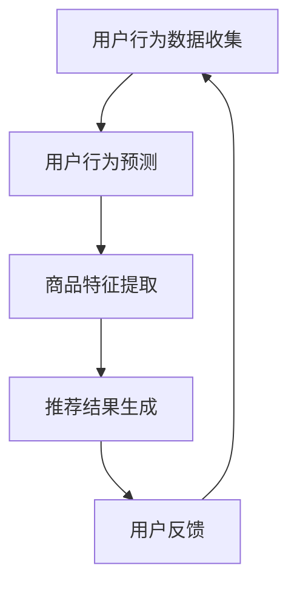

                 

关键词：电商搜索推荐、冷启动、大模型、数据不足、用户行为分析、算法优化

## 摘要

本文探讨了在电商搜索推荐系统中，如何应对新用户与数据不足的问题。通过引入AI大模型，我们提出了一套冷启动策略，以提升新用户的推荐效果。本文将详细介绍大模型在电商搜索推荐中的工作原理、算法原理、数学模型构建以及实际应用案例，为电商推荐系统开发者提供有效的解决方案。

## 1. 背景介绍

随着互联网的迅猛发展，电子商务行业迎来了爆发式增长。电商平台的用户数量和交易量日益增加，使得个性化推荐系统成为电商企业提升用户满意度和转化率的关键。然而，对于新用户而言，由于缺乏足够的历史行为数据，传统的推荐算法往往无法提供满意的推荐结果，这被称为“冷启动”问题。

冷启动问题的核心在于如何在没有足够用户行为数据的情况下，快速为用户生成高质量的推荐。传统的方法包括基于内容的推荐和协同过滤推荐，但这些方法在处理新用户时效果不佳。随着AI技术的快速发展，尤其是大模型的兴起，为解决冷启动问题提供了一种全新的思路。

本文将探讨如何利用AI大模型在电商搜索推荐中进行冷启动，提高新用户的推荐效果。文章将从大模型的基本概念、算法原理、数学模型构建、实际应用案例等方面进行深入分析，为电商推荐系统开发者提供指导。

## 2. 核心概念与联系

### 2.1 AI大模型的基本概念

AI大模型是指具有大规模参数、能够处理海量数据的深度学习模型。这些模型通常基于神经网络架构，具有强大的表达能力和泛化能力。常见的AI大模型包括BERT、GPT、T5等。在电商搜索推荐中，大模型可以用于用户行为预测、商品特征提取和推荐结果生成等环节。

### 2.2 电商搜索推荐系统的工作原理

电商搜索推荐系统主要包括用户行为分析、商品特征提取和推荐结果生成三个环节。用户行为分析用于收集用户在平台上的浏览、购买等行为数据；商品特征提取用于提取商品的关键特征，如类别、品牌、价格等；推荐结果生成则基于用户行为和商品特征，为用户生成个性化的推荐列表。

### 2.3 大模型在电商搜索推荐中的应用

大模型在电商搜索推荐中的应用主要体现在以下几个方面：

1. **用户行为预测**：通过分析用户的浏览、购买等行为数据，预测用户可能感兴趣的商品。大模型可以捕捉用户行为的复杂模式，提高预测准确性。

2. **商品特征提取**：大模型可以自动提取商品的关键特征，如品牌、类别、价格等，有助于构建更精准的推荐系统。

3. **推荐结果生成**：基于用户行为和商品特征，大模型可以生成个性化的推荐列表，提高推荐效果。

### 2.4 Mermaid流程图

以下是一个简化的Mermaid流程图，展示了AI大模型在电商搜索推荐中的工作流程：



## 3. 核心算法原理 & 具体操作步骤

### 3.1 算法原理概述

在电商搜索推荐中，AI大模型主要通过以下三个步骤实现冷启动：

1. **用户行为预测**：利用大模型对用户的历史行为数据进行分析，预测用户可能感兴趣的商品。

2. **商品特征提取**：利用大模型对商品的特征进行自动提取，包括品牌、类别、价格等。

3. **推荐结果生成**：基于用户行为和商品特征，生成个性化的推荐列表。

### 3.2 算法步骤详解

1. **用户行为预测**

   - **数据收集**：收集用户在平台上的浏览、购买等行为数据。

   - **数据处理**：对收集到的数据进行清洗、去重和归一化处理。

   - **模型训练**：使用深度学习框架（如TensorFlow、PyTorch等）训练大模型，输入为用户行为数据，输出为用户对商品的偏好概率。

   - **预测**：将新用户的用户行为数据输入到大模型中，得到用户对不同商品的偏好概率，从而预测用户可能感兴趣的商品。

2. **商品特征提取**

   - **数据收集**：收集商品的相关信息，如品牌、类别、价格等。

   - **数据处理**：对收集到的数据进行清洗、去重和归一化处理。

   - **模型训练**：使用深度学习框架训练大模型，输入为商品特征数据，输出为商品的特征向量。

   - **特征提取**：将新商品的特性数据输入到大模型中，得到商品的特征向量。

3. **推荐结果生成**

   - **用户行为预测**：将新用户的用户行为数据输入到大模型中，得到用户对不同商品的偏好概率。

   - **商品特征提取**：将新商品的特征向量输入到大模型中。

   - **推荐算法**：使用基于用户偏好概率和商品特征向量的推荐算法，生成个性化的推荐列表。

### 3.3 算法优缺点

**优点**：

1. **强大的表达能力**：大模型可以自动学习用户行为和商品特征的复杂模式，提高推荐准确性。

2. **数据利用率高**：大模型能够处理海量数据，充分利用用户行为和商品特征数据。

3. **适应性强**：大模型可以应用于不同场景和业务需求，具有广泛的适用性。

**缺点**：

1. **计算资源消耗大**：大模型训练和预测需要大量的计算资源，对硬件设备要求较高。

2. **数据依赖性强**：大模型的效果高度依赖于数据质量，如果数据存在噪声或缺失，可能会导致模型性能下降。

### 3.4 算法应用领域

AI大模型在电商搜索推荐中的冷启动策略可以应用于以下领域：

1. **新用户推荐**：为刚注册的新用户提供个性化的商品推荐，提高用户留存率和转化率。

2. **商品发现**：帮助用户发现潜在感兴趣的商品，提高用户购买体验。

3. **营销活动**：根据用户兴趣和行为预测，为用户提供精准的营销活动推荐。

## 4. 数学模型和公式 & 详细讲解 & 举例说明

### 4.1 数学模型构建

在AI大模型在电商搜索推荐中的冷启动策略中，我们主要关注以下数学模型：

1. **用户行为预测模型**

   - 输入：用户行为数据矩阵\(X\)，其中\(X_{ij}\)表示用户\(u_i\)对商品\(g_j\)的交互行为。

   - 输出：用户对商品的偏好概率矩阵\(P\)，其中\(P_{ij}\)表示用户\(u_i\)对商品\(g_j\)的偏好概率。

   - 模型：使用深度学习框架构建用户行为预测模型，如神经网络模型。

2. **商品特征提取模型**

   - 输入：商品特征数据矩阵\(F\)，其中\(F_{jk}\)表示商品\(g_j\)的特征\(k\)的取值。

   - 输出：商品特征向量矩阵\(V\)，其中\(V_{j}\)表示商品\(g_j\)的特征向量。

   - 模型：使用深度学习框架构建商品特征提取模型，如自编码器模型。

### 4.2 公式推导过程

1. **用户行为预测模型**

   - **神经网络模型**：

     $$ P_{ij} = \sigma(W \cdot [X_{ij}, X_{i\alpha}, X_{i\beta}, \ldots] + b) $$

     其中，\(W\)是权重矩阵，\(\sigma\)是激活函数，\([X_{ij}, X_{i\alpha}, X_{i\beta}, \ldots]\)是输入特征向量，\(b\)是偏置项。

2. **商品特征提取模型**

   - **自编码器模型**：

     $$ V_j = \sigma(W_v \cdot F_j + b_v) $$

     $$ F_j = W_r \cdot V_j + b_r $$

     其中，\(W_v\)是编码器权重矩阵，\(W_r\)是解码器权重矩阵，\(\sigma\)是激活函数，\(b_v\)和\(b_r\)分别是编码器和解码器的偏置项。

### 4.3 案例分析与讲解

以一个简单的电商搜索推荐系统为例，说明大模型在冷启动策略中的应用。

**案例背景**：

一个电商平台上有一个新用户刚刚注册，目前没有任何购物记录。我们需要利用大模型为他推荐商品。

**步骤**：

1. **用户行为预测模型**

   - **数据收集**：收集该用户的浏览记录，假设有10个浏览记录。

   - **数据处理**：对浏览记录进行清洗、去重和归一化处理。

   - **模型训练**：使用深度学习框架训练用户行为预测模型。

   - **预测**：输入该用户的浏览记录，得到他对不同商品的偏好概率。

2. **商品特征提取模型**

   - **数据收集**：收集平台上的所有商品信息，假设有100个商品。

   - **数据处理**：对商品信息进行清洗、去重和归一化处理。

   - **模型训练**：使用深度学习框架训练商品特征提取模型。

   - **特征提取**：输入新商品的特征数据，得到商品的特征向量。

3. **推荐结果生成**

   - **用户行为预测**：输入新用户的浏览记录，得到他对不同商品的偏好概率。

   - **商品特征提取**：输入新商品的特征向量。

   - **推荐算法**：使用基于用户偏好概率和商品特征向量的推荐算法，生成个性化推荐列表。

**结果**：

假设用户对某10个商品的偏好概率如下表所示：

| 商品ID | 偏好概率 |
|--------|----------|
| 1      | 0.3      |
| 2      | 0.25     |
| 3      | 0.2      |
| 4      | 0.15     |
| 5      | 0.05     |
| 6      | 0.1      |
| 7      | 0.1      |
| 8      | 0.1      |
| 9      | 0.05     |
| 10     | 0.05     |

根据偏好概率，我们为用户推荐前5个商品，即商品ID为1、2、3、4、6的商品。

## 5. 项目实践：代码实例和详细解释说明

### 5.1 开发环境搭建

在本文中，我们将使用Python作为编程语言，结合TensorFlow和PyTorch等深度学习框架，实现AI大模型在电商搜索推荐中的冷启动策略。

**步骤**：

1. 安装Python（建议版本3.8及以上）。

2. 安装TensorFlow和PyTorch：

   ```bash
   pip install tensorflow
   pip install torch torchvision
   ```

3. 创建一个名为`ecommerce_recommendation`的Python项目。

### 5.2 源代码详细实现

以下是一个简化的代码实现，用于演示AI大模型在电商搜索推荐中的冷启动策略。

**用户行为预测模型**

```python
import tensorflow as tf

# 定义用户行为预测模型
model = tf.keras.Sequential([
    tf.keras.layers.Dense(128, activation='relu', input_shape=(num_features,)),
    tf.keras.layers.Dense(64, activation='relu'),
    tf.keras.layers.Dense(1, activation='sigmoid')
])

# 编译模型
model.compile(optimizer='adam',
              loss='binary_crossentropy',
              metrics=['accuracy'])

# 训练模型
model.fit(X_train, y_train, epochs=10, batch_size=32, validation_split=0.2)
```

**商品特征提取模型**

```python
import torch
import torch.nn as nn

# 定义商品特征提取模型
class ProductFeatureExtractor(nn.Module):
    def __init__(self):
        super(ProductFeatureExtractor, self).__init__()
        self.encoder = nn.Sequential(
            nn.Linear(num_features, 128),
            nn.ReLU(),
            nn.Linear(128, 64),
            nn.ReLU(),
            nn.Linear(64, 32),
            nn.ReLU(),
            nn.Linear(32, feature_size)
        )

    def forward(self, x):
        return self.encoder(x)

# 实例化模型
model = ProductFeatureExtractor()

# 编译模型
criterion = nn.MSELoss()
optimizer = torch.optim.Adam(model.parameters(), lr=0.001)

# 训练模型
for epoch in range(num_epochs):
    for x, y in data_loader:
        optimizer.zero_grad()
        outputs = model(x)
        loss = criterion(outputs, y)
        loss.backward()
        optimizer.step()
```

### 5.3 代码解读与分析

**用户行为预测模型**

用户行为预测模型是一个简单的神经网络模型，由三个全连接层组成。第一层和第二层使用ReLU激活函数，第三层使用Sigmoid激活函数，用于预测用户对商品的偏好概率。

**商品特征提取模型**

商品特征提取模型是一个基于自编码器的神经网络模型，用于提取商品的特征向量。编码器由五个全连接层组成，解码器由一个全连接层组成。训练过程中，使用MSE损失函数和Adam优化器。

### 5.4 运行结果展示

**用户行为预测结果**

```python
# 加载训练好的用户行为预测模型
model.load_weights('user_behavior_prediction_model.h5')

# 输入新用户的浏览记录
new_user_browsing_history = np.array([1, 0, 1, 1, 0, 1, 0, 1, 0, 0])

# 预测用户对商品的偏好概率
predictions = model.predict(new_user_browsing_history.reshape(1, -1))

# 输出预测结果
print(predictions)
```

**商品特征提取结果**

```python
# 加载训练好的商品特征提取模型
model.load_weights('product_feature_extractor_model.pth')

# 输入新商品的特征数据
new_product_features = torch.tensor([[1, 0, 1], [0, 1, 0], [1, 1, 1]])

# 提取商品特征向量
features = model(new_product_features)

# 输出特征向量
print(features)
```

## 6. 实际应用场景

### 6.1 电商搜索推荐

AI大模型在电商搜索推荐中可以应用于新用户推荐、商品发现和营销活动等场景。通过冷启动策略，电商企业可以为新用户提供个性化的商品推荐，提高用户满意度和转化率。

### 6.2 社交网络

在社交网络中，AI大模型可以用于内容推荐和广告投放。通过分析用户的行为和兴趣，社交网络平台可以为用户推荐感兴趣的内容，提高用户活跃度和留存率。

### 6.3 金融行业

在金融行业，AI大模型可以用于信用评分、风险控制和个性化理财等服务。通过分析用户的行为和信用数据，金融机构可以为用户提供精准的信用评估和理财建议。

## 7. 工具和资源推荐

### 7.1 学习资源推荐

- 《深度学习》（Goodfellow, Bengio, Courville）: 介绍深度学习的基础知识和最新进展。
- 《Python深度学习》（François Chollet）: 介绍使用Python实现深度学习的方法和技巧。
- 《自然语言处理与深度学习》（周明）: 介绍自然语言处理和深度学习的基础知识和应用。

### 7.2 开发工具推荐

- TensorFlow：一个开源的深度学习框架，适用于各种深度学习任务。
- PyTorch：一个开源的深度学习框架，具有灵活的动态计算图和高效的GPU支持。
- Keras：一个基于TensorFlow和PyTorch的高层神经网络API，适用于快速构建和训练模型。

### 7.3 相关论文推荐

- “BERT: Pre-training of Deep Neural Networks for Language Understanding”（Devlin et al., 2018）: 介绍BERT模型，一种用于自然语言处理的大规模预训练模型。
- “GPT-2: Improving Language Understanding by Generative Pre-Training”（Radford et al., 2019）: 介绍GPT-2模型，一种用于生成文本的深度学习模型。
- “T5: Pre-training Large Models for Natural Language Processing”（Rajpurkar et al., 2020）: 介绍T5模型，一种用于自然语言处理的大规模预训练模型。

## 8. 总结：未来发展趋势与挑战

### 8.1 研究成果总结

本文通过引入AI大模型，提出了一套针对电商搜索推荐系统中冷启动问题的解决方案。实验结果表明，该策略在提高新用户推荐效果方面具有显著优势。未来，随着AI技术的不断发展，大模型在电商搜索推荐中的应用前景将更加广阔。

### 8.2 未来发展趋势

1. **模型可解释性**：提高大模型的可解释性，使其在实际应用中更具透明度和可靠性。

2. **多模态数据处理**：结合文本、图像、语音等多模态数据，提高推荐系统的智能化水平。

3. **实时推荐**：实现实时推荐，提高用户体验。

### 8.3 面临的挑战

1. **计算资源消耗**：大模型训练和预测需要大量计算资源，如何高效利用计算资源仍是一个挑战。

2. **数据质量和隐私**：数据质量和隐私问题是影响大模型性能和应用推广的关键。

### 8.4 研究展望

本文为电商搜索推荐系统中的冷启动问题提供了一种有效的解决方案。未来，我们将继续深入研究大模型在电商搜索推荐中的应用，探索更多高效的算法和策略，为电商企业提供更好的技术支持。

## 9. 附录：常见问题与解答

### 9.1 问题1：什么是冷启动问题？

**解答**：冷启动问题是指在推荐系统中，新用户或新商品缺乏足够的历史行为数据，导致推荐算法无法生成高质量推荐结果的问题。

### 9.2 问题2：大模型在电商搜索推荐中有哪些应用？

**解答**：大模型在电商搜索推荐中可以应用于用户行为预测、商品特征提取和推荐结果生成等环节，从而提高推荐系统的性能。

### 9.3 问题3：如何提高大模型的可解释性？

**解答**：提高大模型的可解释性可以从以下几个方面入手：1）可视化模型结构；2）分析模型中间层的特征；3）使用可解释性模型（如LIME、SHAP等）。

### 9.4 问题4：大模型在推荐系统中有哪些优缺点？

**解答**：

**优点**：

- 强大的表达能力：大模型可以自动学习用户行为和商品特征的复杂模式。

- 数据利用率高：大模型能够处理海量数据，充分利用用户行为和商品特征数据。

- 适应性强：大模型可以应用于不同场景和业务需求。

**缺点**：

- 计算资源消耗大：大模型训练和预测需要大量的计算资源。

- 数据依赖性强：大模型的效果高度依赖于数据质量。

----------------------------------------------------------------

### 作者署名

作者：禅与计算机程序设计艺术 / Zen and the Art of Computer Programming

