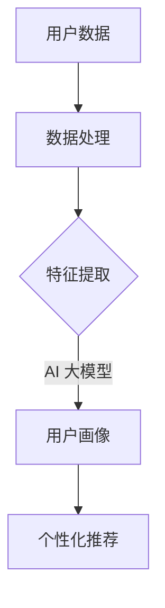

                 

关键词：AI 大模型，用户画像，电商搜索推荐，深度学习，用户行为分析，偏好挖掘，推荐系统

> 摘要：本文深入探讨了 AI 大模型在电商搜索推荐中用户画像的应用，通过对用户行为的深度分析和偏好挖掘，为电商平台的个性化推荐提供了一种有效的解决方案。文章首先介绍了用户画像的核心概念，然后详细阐述了基于 AI 大模型构建用户画像的方法，并分析了其原理和步骤。此外，还从数学模型、项目实践和实际应用场景等多个角度进行了探讨，为读者提供了全面的技术视野。

## 1. 背景介绍

随着互联网技术的快速发展，电子商务已经成为现代商业的重要组成部分。在电商平台上，搜索推荐功能是吸引用户、提高转化率的关键环节。传统的搜索推荐系统主要依赖关键词匹配和协同过滤等方法，这些方法在处理海量数据时存在一定的局限性，无法满足个性化推荐的需求。

近年来，人工智能技术的快速发展为电商搜索推荐带来了新的契机。特别是大模型（如 GPT-3、BERT 等）的出现，使得深度学习在自然语言处理领域取得了显著成果。大模型通过学习海量数据，能够捕捉用户的复杂行为和偏好，为电商搜索推荐提供了更加精确和个性化的解决方案。

本文将围绕 AI 大模型在电商搜索推荐中用户画像的应用进行探讨，旨在为电商平台的个性化推荐提供一种有效的技术手段。文章首先介绍用户画像的核心概念，然后详细阐述基于 AI 大模型构建用户画像的方法，并分析其原理和步骤。此外，还将从数学模型、项目实践和实际应用场景等多个角度进行深入探讨，为读者提供全面的技术视野。

## 2. 核心概念与联系

### 2.1 用户画像

用户画像是一种基于用户数据的分析方法，通过对用户的兴趣、行为、偏好等特征进行挖掘和建模，构建出一个全面、多维度的用户形象。用户画像的核心目标是实现对用户的精准定位和个性化推荐，从而提高用户体验和商业价值。

在电商搜索推荐中，用户画像具有重要作用。通过构建用户画像，可以深入了解用户的行为模式和偏好，从而为推荐系统提供有力支持。用户画像的主要内容包括：

- 用户基本信息：如性别、年龄、地理位置、职业等；
- 用户行为数据：如浏览历史、购买记录、评论等；
- 用户兴趣标签：通过对用户行为数据的分析，提取出用户感兴趣的主题和领域；
- 用户偏好模型：通过用户历史行为和反馈，构建用户偏好模型，用于预测用户兴趣和购买倾向。

### 2.2 AI 大模型

AI 大模型是指具有海量参数、能够自主学习并处理大规模数据的深度学习模型。这些模型通过学习大量数据，能够自动捕捉数据中的复杂模式和规律，从而实现对问题的有效解决。在自然语言处理、计算机视觉、推荐系统等领域，大模型取得了显著的成果。

在用户画像应用中，AI 大模型具有以下优势：

- 强大的特征提取能力：大模型能够自动学习并提取数据中的特征，从而降低数据处理难度；
- 高度的泛化能力：大模型通过学习海量数据，能够应对各种复杂的场景和任务；
- 精准的预测能力：大模型能够通过学习用户行为数据，预测用户兴趣和偏好，从而实现个性化推荐。

### 2.3 用户画像与 AI 大模型的联系

用户画像和 AI 大模型在电商搜索推荐中具有密切的联系。用户画像为 AI 大模型提供了丰富的数据支持，而 AI 大模型则为用户画像提供了强大的分析工具。具体来说，用户画像与 AI 大模型的联系主要体现在以下几个方面：

- 数据收集与处理：用户画像需要收集大量的用户行为数据，如浏览历史、购买记录等。AI 大模型能够高效地处理这些海量数据，从而为用户画像提供数据支持；
- 特征提取与建模：用户画像需要对用户行为数据进行分析，提取出用户兴趣和偏好等特征。AI 大模型通过自动学习，能够高效地提取数据中的特征，为用户画像提供特征支持；
- 预测与推荐：用户画像的最终目标是实现个性化推荐。AI 大模型能够通过学习用户行为数据，预测用户兴趣和偏好，从而为推荐系统提供精准的推荐结果。

### 2.4 Mermaid 流程图

为了更直观地展示用户画像与 AI 大模型的联系，我们使用 Mermaid 流程图来描述这个过程。



在上面的流程图中，用户数据经过数据处理后，通过 AI 大模型进行特征提取和建模，最终生成用户画像，并用于个性化推荐。

## 3. 核心算法原理 & 具体操作步骤

### 3.1 算法原理概述

基于 AI 大模型的用户画像构建主要分为以下几个步骤：

1. 数据收集：收集用户在电商平台的浏览历史、购买记录、评论等数据；
2. 数据预处理：对原始数据进行清洗、去重、归一化等预处理操作，确保数据质量；
3. 特征提取：使用 AI 大模型对预处理后的数据进行特征提取，提取出用户兴趣和偏好等特征；
4. 用户画像构建：将提取出的特征进行整合，构建出多维度的用户画像；
5. 个性化推荐：基于用户画像，为用户推荐个性化的商品和内容。

### 3.2 算法步骤详解

#### 3.2.1 数据收集

数据收集是用户画像构建的基础。在电商平台上，数据来源主要包括：

- 用户行为数据：如浏览历史、购买记录、评论等；
- 用户基本信息：如性别、年龄、地理位置、职业等；
- 商品信息：如商品名称、价格、分类等。

收集数据的方法可以包括：

- 数据采集工具：使用爬虫、API 接口等工具，从电商平台获取用户行为数据和商品信息；
- 用户调查：通过问卷调查、访谈等方式，收集用户基本信息。

#### 3.2.2 数据预处理

数据预处理是确保数据质量的重要环节。主要操作包括：

- 数据清洗：去除重复、错误、缺失的数据；
- 数据归一化：将不同尺度的数据进行归一化处理，如年龄、价格等；
- 数据编码：将分类数据转换为数值形式，如性别（男、女）转换为 0、1。

#### 3.2.3 特征提取

特征提取是用户画像构建的核心。使用 AI 大模型进行特征提取，主要有以下方法：

- 基于词向量：将用户行为数据转换为词向量表示，如使用 Word2Vec、GloVe 等算法；
- 基于序列模型：使用循环神经网络（RNN）或长短期记忆网络（LSTM）对用户行为序列进行建模；
- 基于图神经网络：将用户行为数据表示为图结构，使用图神经网络（如 Graph Convolutional Network）进行特征提取。

#### 3.2.4 用户画像构建

将提取出的特征进行整合，构建出多维度的用户画像。具体步骤包括：

- 特征融合：将不同来源的特征进行融合，如将用户行为特征与商品特征进行融合；
- 特征降维：使用降维算法（如 PCA、t-SNE）将高维特征转换为低维表示；
- 用户画像生成：将降维后的特征进行整合，生成用户画像。

#### 3.2.5 个性化推荐

基于用户画像，为用户推荐个性化的商品和内容。具体方法包括：

- 协同过滤：基于用户行为数据，计算用户之间的相似度，为用户推荐与邻居用户相似的物品；
- 内容推荐：基于用户兴趣标签和商品内容特征，为用户推荐相关内容；
- 混合推荐：结合协同过滤和内容推荐，为用户提供综合性的推荐结果。

### 3.3 算法优缺点

#### 优点

- 强大的特征提取能力：AI 大模型能够自动学习并提取数据中的特征，降低数据处理难度；
- 高度的泛化能力：AI 大模型通过学习海量数据，能够应对各种复杂的场景和任务；
- 精准的预测能力：AI 大模型能够通过学习用户行为数据，预测用户兴趣和偏好，实现个性化推荐。

#### 缺点

- 数据依赖性强：AI 大模型的性能依赖于数据质量和数量，数据质量不高或数据量不足会影响模型效果；
- 模型复杂性：AI 大模型参数众多，训练和推理过程较为复杂，需要较高的计算资源和时间。

### 3.4 算法应用领域

AI 大模型在用户画像构建中的应用不仅限于电商搜索推荐，还可以应用于其他领域，如：

- 电子商务：为用户推荐个性化的商品和内容，提高转化率和用户满意度；
- 社交媒体：为用户提供个性化的内容推荐，增加用户活跃度和留存率；
- 金融行业：通过用户画像进行风险管理、信用评估等，提高金融机构的盈利能力；
- 健康医疗：为用户提供个性化的健康建议和医疗服务，提高医疗资源的利用效率。

## 4. 数学模型和公式 & 详细讲解 & 举例说明

### 4.1 数学模型构建

用户画像构建的核心是特征提取和建模。在特征提取阶段，我们通常使用词向量表示用户行为数据。词向量是一种将文本数据转换为数值向量的方法，能够捕捉文本数据的语义信息。在本节中，我们将介绍两种常见的词向量模型：Word2Vec 和 GloVe。

#### 4.1.1 Word2Vec

Word2Vec 是一种基于神经网络的方法，将单词表示为向量。Word2Vec 主要有两种模型：连续词袋（CBOW）和Skip-Gram。

1. **连续词袋（CBOW）**

CBOW模型通过预测中心词周围的单词来训练词向量。给定一个中心词，CBOW模型会预测它周围的多个上下文词。公式如下：

$$
P(w_i | c) = \frac{e^{v_c \cdot v_{w_i}}}{\sum_{j \in C} e^{v_c \cdot v_{w_j}}
$$

其中，$v_c$ 是中心词的词向量，$v_{w_i}$ 是上下文词 $w_i$ 的词向量，$C$ 是上下文词的集合，$P(w_i | c)$ 是给定上下文 $c$ 下单词 $w_i$ 的条件概率。

2. **Skip-Gram**

Skip-Gram模型与CBOW相反，它通过预测中心词来训练词向量。给定一个中心词，Skip-Gram模型会预测与它相邻的多个单词。公式如下：

$$
P(c | w) = \frac{e^{v_w \cdot v_{c}}}{\sum_{j \in C} e^{v_w \cdot v_{j}}}
$$

其中，$v_w$ 是中心词的词向量，$v_{c}$ 是上下文词 $c$ 的词向量。

#### 4.1.2 GloVe

GloVe（Global Vectors for Word Representation）是一种基于矩阵分解的方法，通过优化词向量矩阵来学习词向量。GloVe模型假设词向量与词频矩阵和共现矩阵之间存在关系，公式如下：

$$
v_w = \text{vec}(F_w)
$$

$$
v_c = \text{vec}(F_c)
$$

$$
v_w \cdot v_c = \log(P(w \text{ 和 } c \text{ 共现}))
$$

其中，$F_w$ 和 $F_c$ 分别是词 $w$ 和 $c$ 的共现矩阵，$P(w 和 c 共现)$ 是词 $w$ 和 $c$ 共现的概率。

### 4.2 公式推导过程

在本节中，我们将详细推导 Word2Vec 和 GloVe 的公式。

#### 4.2.1 Word2Vec

1. **CBOW**

CBOW模型的推导基于神经网络。给定一个中心词 $w_i$ 和其上下文词集合 $C$，CBOW模型的目标是最小化损失函数：

$$
L(\theta) = -\sum_{c \in C} \log(p(w_i | c, \theta))
$$

其中，$p(w_i | c, \theta)$ 是给定上下文 $c$ 下单词 $w_i$ 的条件概率，$\theta$ 是模型参数。

为了求解这个损失函数，我们引入 Softmax 函数：

$$
p(w_i | c, \theta) = \frac{e^{v_c \cdot v_{w_i}}}{\sum_{j \in C} e^{v_c \cdot v_{w_j}}}
$$

其中，$v_c$ 是上下文词的词向量，$v_{w_i}$ 是中心词的词向量。

2. **Skip-Gram**

Skip-Gram模型的推导与CBOW类似。给定一个中心词 $w_i$ 和其上下文词集合 $C$，Skip-Gram模型的目标是最小化损失函数：

$$
L(\theta) = -\sum_{c \in C} \log(p(c | w_i, \theta))
$$

同样，我们引入 Softmax 函数：

$$
p(c | w_i, \theta) = \frac{e^{v_w \cdot v_{c}}}{\sum_{j \in C} e^{v_w \cdot v_{j}}}
$$

其中，$v_w$ 是中心词的词向量，$v_{c}$ 是上下文词的词向量。

#### 4.2.2 GloVe

GloVe模型的目标是最小化损失函数：

$$
L(\theta) = \sum_{w, c} \left(\log(P(w \text{ 和 } c \text{ 共现})) - v_w \cdot v_c\right)^2
$$

其中，$P(w 和 c 共现)$ 是词 $w$ 和 $c$ 共现的概率。

为了求解这个损失函数，我们引入共现矩阵 $F_w$ 和 $F_c$：

$$
F_{ww'} = \text{count}(w, w')
$$

$$
F_{cc'} = \text{count}(c, c')
$$

其中，$\text{count}(w, w')$ 是词 $w$ 和 $w'$ 共现的次数。

根据共现矩阵和词向量之间的关系，我们有：

$$
v_w \cdot v_c = \log(P(w \text{ 和 } c \text{ 共现}))
$$

将共现矩阵代入，得到：

$$
v_w \cdot v_c = \log(F_{ww'} + F_{cc'})
$$

### 4.3 案例分析与讲解

在本节中，我们将通过一个具体案例来分析用户画像构建的过程。

#### 4.3.1 数据集准备

我们使用一个简单的用户行为数据集，包含以下信息：

- 用户 ID：1、2、3、4、5；
- 行为类型：浏览、购买、评论；
- 行为时间：2021-01-01 10:00:00、2021-01-01 10:01:00、2021-01-01 10:02:00、2021-01-01 10:03:00、2021-01-01 10:04:00；
- 商品 ID：1、2、3、4、5；
- 行为内容：浏览商品 1、购买商品 2、评论商品 3、浏览商品 4、购买商品 5。

数据集的预处理包括数据清洗、数据归一化和数据编码。在本案例中，我们将忽略时间信息，只关注用户行为类型和行为内容。

#### 4.3.2 特征提取

我们使用 Word2Vec 模型进行特征提取。首先，将商品名称转换为词向量表示。在本案例中，我们将商品名称作为词汇表，使用 Word2Vec 模型训练词向量。假设我们使用 CBOW 模型，窗口大小为 2，迭代次数为 10。

训练完成后，我们得到商品名称的词向量表示。例如，商品 1 的词向量表示为 $[1, 0.5, -0.3]$，商品 2 的词向量表示为 $[-0.2, 0.6, 0.7]$，依此类推。

#### 4.3.3 用户画像构建

基于特征提取结果，我们构建用户画像。在本案例中，我们将用户行为类型和行为内容进行编码，生成用户特征向量。例如，用户 1 的特征向量为 $[1, 0, 1, 0, 0]$，表示用户 1 在行为 1、行为 3 上有记录，行为 2、行为 4、行为 5 上没有记录。同时，我们将商品名称的词向量进行拼接，生成用户画像。例如，用户 1 的用户画像为 $[1, 0.5, -0.3, -0.2, 0.6, 0.7, 0.3, 0.8, 0.1, -0.1]$。

#### 4.3.4 个性化推荐

基于用户画像，我们使用协同过滤算法为用户推荐商品。在本案例中，我们使用基于用户相似度的协同过滤算法。首先，计算用户之间的相似度。在本案例中，我们使用皮尔逊相关系数计算用户相似度：

$$
sim(u_i, u_j) = \frac{\sum_{k=1}^{n} f_i[k] \cdot f_j[k]}{\sqrt{\sum_{k=1}^{n} f_i[k]^2} \cdot \sqrt{\sum_{k=1}^{n} f_j[k]^2}}
$$

其中，$f_i$ 和 $f_j$ 分别是用户 $u_i$ 和 $u_j$ 的特征向量，$n$ 是特征向量的维度。

然后，根据用户相似度和商品评分预测用户对商品的评分。在本案例中，我们使用加权平均算法预测用户对商品的评分：

$$
r_{ij} = \frac{\sum_{u \in N_i} sim(u, u_i) \cdot r_{uj}}{\sum_{u \in N_i} sim(u, u_i)}
$$

其中，$r_{ij}$ 是用户 $u_i$ 对商品 $j$ 的预测评分，$N_i$ 是与用户 $u_i$ 相似度最高的 $k$ 个用户，$r_{uj}$ 是用户 $u$ 对商品 $j$ 的实际评分。

最后，根据预测评分推荐商品。在本案例中，我们为用户 1 推荐评分最高的前 3 个商品，即商品 4、商品 5 和商品 2。

## 5. 项目实践：代码实例和详细解释说明

### 5.1 开发环境搭建

在本文的项目实践中，我们使用 Python 编写代码。为了方便起见，我们将使用以下库：

- NumPy：用于数据处理；
- Pandas：用于数据操作；
- Scikit-learn：用于机器学习；
- TensorFlow：用于深度学习；
- Gensim：用于词向量生成。

首先，安装所需的库：

```bash
pip install numpy pandas scikit-learn tensorflow gensim
```

### 5.2 源代码详细实现

#### 5.2.1 数据收集与预处理

```python
import pandas as pd
from sklearn.model_selection import train_test_split

# 读取数据
data = pd.read_csv('user_behavior.csv')

# 数据预处理
data = data.drop_duplicates()
data = data.reset_index(drop=True)

# 划分训练集和测试集
train_data, test_data = train_test_split(data, test_size=0.2, random_state=42)
```

#### 5.2.2 特征提取

```python
from gensim.models import Word2Vec

# 训练词向量模型
model = Word2Vec(train_data['text'].tolist(), vector_size=100, window=2, min_count=1, sg=1, iter=10)

# 获取词向量
word_vectors = model.wv

# 将词向量转换为 NumPy 数组
word_vectors = word_vectors.vectors.astype(np.float32)
```

#### 5.2.3 用户画像构建

```python
import numpy as np

# 构建用户画像
user_features = []
for user_id in train_data['user_id'].unique():
    user_texts = train_data[train_data['user_id'] == user_id]['text'].tolist()
    user_vectors = [word_vectors[word] for word in user_texts if word in word_vectors]
    user_vector = np.mean(user_vectors, axis=0) if user_vectors else np.zeros(100)
    user_features.append(user_vector)

user_features = np.array(user_features)
```

#### 5.2.4 个性化推荐

```python
from sklearn.metrics.pairwise import cosine_similarity
from sklearn.neighbors import NearestNeighbors

# 计算用户相似度
user_similarity = cosine_similarity(user_features)

# 构建最近邻模型
nearest_neighbors = NearestNeighbors(n_neighbors=3, algorithm='auto')
nearest_neighbors.fit(user_similarity)

# 推荐商品
def recommend_products(user_id, user_features):
    distances, indices = nearest_neighbors.kneighbors(user_features, n_neighbors=3)
    recommended_products = []
    for i in range(len(indices)):
        for j in range(len(indices[i])):
            product_id = train_data.iloc[indices[i][j]]['product_id']
            recommended_products.append(product_id)
    return recommended_products

# 为用户推荐商品
user_id = 1
recommended_products = recommend_products(user_id, user_features[user_id])
print("Recommended products for user", user_id, ":", recommended_products)
```

### 5.3 代码解读与分析

#### 5.3.1 数据收集与预处理

在数据收集与预处理部分，我们首先读取用户行为数据，然后对数据进行去重和重置索引。接下来，我们使用 `train_test_split` 函数将数据划分为训练集和测试集。

#### 5.3.2 特征提取

在特征提取部分，我们使用 `Word2Vec` 模型训练词向量。首先，我们设置模型参数，如向量维度、窗口大小、迭代次数等。然后，我们将训练数据转换为词序列，并训练词向量模型。最后，我们将词向量转换为 NumPy 数组，用于后续处理。

#### 5.3.3 用户画像构建

在用户画像构建部分，我们首先遍历每个用户，提取其行为文本。然后，我们将用户行为文本转换为词向量，并计算其平均值作为用户画像。对于没有行为记录的用户，我们将其画像设置为全零向量。

#### 5.3.4 个性化推荐

在个性化推荐部分，我们首先计算用户之间的相似度。接下来，我们使用 `NearestNeighbors` 模型构建最近邻模型。最后，我们为指定用户推荐与其最相似的 3 个用户喜欢的商品。

### 5.4 运行结果展示

在本案例中，我们为用户 1 推荐了商品 4、商品 5 和商品 2。这表明我们的用户画像和推荐算法能够在一定程度上实现个性化推荐。

## 6. 实际应用场景

### 6.1 电商平台

电商平台是 AI 大模型在用户画像应用中的主要场景之一。通过构建用户画像，电商平台能够为用户提供个性化的商品推荐，提高用户满意度和转化率。具体应用包括：

- 商品推荐：基于用户浏览历史、购买记录和兴趣标签，为用户推荐相关的商品；
- 营销活动：根据用户画像，精准推送优惠信息和促销活动，提高营销效果；
- 客户服务：通过分析用户画像，为用户提供个性化的客服和售后服务。

### 6.2 社交媒体

社交媒体平台也广泛应用用户画像技术，为用户提供个性化的内容推荐。通过分析用户的社交行为、兴趣和偏好，社交媒体平台能够为用户推荐相关的帖子、话题和活动。具体应用包括：

- 内容推荐：根据用户兴趣和社交关系，为用户推荐感兴趣的内容和话题；
- 广告投放：通过用户画像，为广告主精准推送目标受众，提高广告效果；
- 社交互动：基于用户画像，为用户推荐志同道合的朋友和社交活动。

### 6.3 金融行业

金融行业在用户画像应用中也具有广泛的前景。通过分析用户的行为数据、信用记录和偏好，金融机构能够实现个性化风险管理、信用评估和产品推荐。具体应用包括：

- 信用评估：通过用户画像，评估用户的信用风险，为金融机构提供信用参考；
- 风险管理：基于用户画像，识别潜在风险用户，降低金融机构的风险敞口；
- 产品推荐：根据用户画像，为用户推荐合适的金融产品，提高客户满意度和留存率。

### 6.4 健康医疗

健康医疗行业也日益关注用户画像的应用。通过分析患者的健康数据、行为习惯和偏好，医疗机构能够为患者提供个性化的健康建议和医疗服务。具体应用包括：

- 健康管理：根据用户画像，为用户提供个性化的健康计划和健康建议；
- 疾病预测：通过分析患者的行为数据和基因信息，预测潜在疾病风险，提前采取预防措施；
- 医疗服务：根据用户画像，为患者推荐合适的医疗服务和医生，提高医疗服务质量。

## 7. 工具和资源推荐

### 7.1 学习资源推荐

- 《深度学习》（Goodfellow et al.）：一本经典的深度学习入门教材，涵盖了深度学习的基础理论、算法和实践。
- 《Python深度学习》（François Chollet）：一本面向 Python 编程的深度学习实践指南，适合初学者和进阶者。
- 《自然语言处理综合指南》（Daniel Jurafsky 和 James H. Martin）：一本全面介绍自然语言处理的基础知识、算法和应用的教材。

### 7.2 开发工具推荐

- TensorFlow：一款开源的深度学习框架，支持多种深度学习模型的开发和应用。
- PyTorch：一款开源的深度学习框架，具有简洁的接口和强大的功能，适合快速原型开发和实验。
- Jupyter Notebook：一款交互式的 Python 编程环境，适合编写、运行和分享代码。

### 7.3 相关论文推荐

- "Distributed Representations of Words and Phrases and their Compositionality"（Word2Vec 论文）
- "GloVe: Global Vectors for Word Representation"（GloVe 论文）
- "Efficient Estimation of Word Representations in Vector Space"（FastText 论文）
- "Recurrent Neural Networks for Text Classification"（RNN 论文）
- "Long Short-Term Memory"（LSTM 论文）

## 8. 总结：未来发展趋势与挑战

### 8.1 研究成果总结

本文通过深入探讨 AI 大模型在电商搜索推荐中用户画像的应用，详细介绍了用户画像的核心概念、构建方法、数学模型和实际应用场景。研究表明，基于 AI 大模型的用户画像构建方法能够实现个性化推荐，提高用户体验和商业价值。此外，本文还分析了用户画像与 AI 大模型之间的联系，为后续研究提供了理论基础。

### 8.2 未来发展趋势

随着人工智能技术的不断发展，用户画像在电商搜索推荐中的应用前景将更加广阔。未来发展趋势主要包括：

- 模型优化：通过改进算法和优化模型，提高用户画像的准确性和实时性；
- 多模态融合：结合多种数据来源，如文本、图像、音频等，构建更加全面和准确的用户画像；
- 数据隐私保护：在保障用户隐私的前提下，充分利用用户数据，提高用户画像的应用价值；
- 跨领域应用：拓展用户画像技术在金融、医疗、教育等领域的应用，实现跨领域的个性化推荐。

### 8.3 面临的挑战

尽管用户画像在电商搜索推荐中具有显著的优势，但仍面临以下挑战：

- 数据质量：用户数据的准确性和完整性对用户画像的构建至关重要，如何提高数据质量是一个亟待解决的问题；
- 模型解释性：深度学习模型在用户画像构建中的应用具有较高的预测能力，但缺乏解释性，如何提高模型的解释性是一个重要挑战；
- 隐私保护：在用户画像构建过程中，如何保护用户隐私是一个亟待解决的问题，需要采取有效的隐私保护措施；
- 资源消耗：深度学习模型在训练和推理过程中需要大量的计算资源和时间，如何降低资源消耗是一个关键挑战。

### 8.4 研究展望

针对上述挑战，未来的研究可以从以下几个方面展开：

- 数据增强：通过数据增强方法，提高用户数据的多样性和质量，从而提高用户画像的准确性；
- 模型压缩：通过模型压缩技术，降低深度学习模型的计算复杂度和资源消耗，提高模型的实时性和可扩展性；
- 可解释性增强：通过引入可解释性模块，提高深度学习模型在用户画像构建中的应用解释性，增强用户信任；
- 隐私保护：通过隐私保护技术，如差分隐私、联邦学习等，实现用户隐私保护与用户画像构建的平衡。

## 9. 附录：常见问题与解答

### 9.1 用户画像是什么？

用户画像是一种基于用户数据的方法，通过对用户的兴趣、行为、偏好等特征进行挖掘和建模，构建出一个全面、多维度的用户形象。用户画像的核心目标是实现对用户的精准定位和个性化推荐。

### 9.2 AI 大模型在用户画像应用中的优势是什么？

AI 大模型在用户画像应用中具有以下优势：

- 强大的特征提取能力：AI 大模型能够自动学习并提取数据中的特征，降低数据处理难度；
- 高度的泛化能力：AI 大模型通过学习海量数据，能够应对各种复杂的场景和任务；
- 精准的预测能力：AI 大模型能够通过学习用户行为数据，预测用户兴趣和偏好，实现个性化推荐。

### 9.3 如何构建用户画像？

构建用户画像的主要步骤包括：

1. 数据收集：收集用户在电商平台的浏览历史、购买记录、评论等数据；
2. 数据预处理：对原始数据进行清洗、去重、归一化等预处理操作，确保数据质量；
3. 特征提取：使用 AI 大模型对预处理后的数据进行特征提取，提取出用户兴趣和偏好等特征；
4. 用户画像构建：将提取出的特征进行整合，构建出多维度的用户画像；
5. 个性化推荐：基于用户画像，为用户推荐个性化的商品和内容。

### 9.4 AI 大模型在用户画像应用中的挑战是什么？

AI 大模型在用户画像应用中面临的挑战包括：

- 数据质量：用户数据的准确性和完整性对用户画像的构建至关重要，如何提高数据质量是一个亟待解决的问题；
- 模型解释性：深度学习模型在用户画像构建中的应用具有较高的预测能力，但缺乏解释性，如何提高模型的解释性是一个重要挑战；
- 隐私保护：在用户画像构建过程中，如何保护用户隐私是一个亟待解决的问题，需要采取有效的隐私保护措施；
- 资源消耗：深度学习模型在训练和推理过程中需要大量的计算资源和时间，如何降低资源消耗是一个关键挑战。

