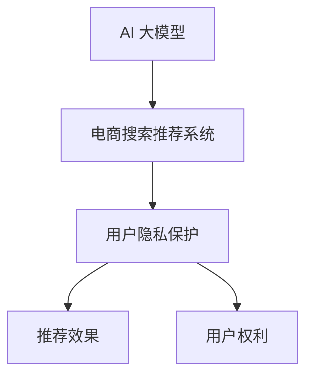

                 

关键词：AI 大模型，电商搜索推荐，用户隐私保护，推荐效果，用户权利，平衡

摘要：本文从电商搜索推荐系统的实际需求出发，探讨了如何在大模型驱动下，实现用户隐私保护与推荐效果之间的平衡。通过详细分析现有技术方案和算法原理，以及数学模型的构建与推导，提出了一种新的解决方案。同时，通过项目实践和实际应用场景的展示，为电商行业提供了可行的隐私保护推荐系统，并为未来的发展方向提出了建议。

## 1. 背景介绍

随着互联网技术的飞速发展，电子商务行业迎来了前所未有的繁荣。电商搜索推荐系统作为电商平台的灵魂，其重要性不言而喻。然而，推荐系统的广泛普及也带来了新的挑战，尤其是在用户隐私保护方面。传统推荐系统往往通过收集和分析用户的购物行为、浏览历史等数据来实现个性化推荐。但这种做法容易导致用户隐私泄露，引发一系列法律和伦理问题。

近年来，AI 大模型（如 GPT、BERT 等）的兴起，为电商搜索推荐系统带来了新的机遇。大模型具有强大的学习能力，能够从大量数据中提取有价值的信息，从而实现更精准的推荐。然而，这也带来了新的隐私保护问题。如何在大模型驱动下，既保证推荐效果，又有效保护用户隐私，成为了一个亟待解决的研究课题。

本文旨在探讨 AI 大模型在电商搜索推荐中的用户隐私保护问题，提出一种平衡推荐效果与用户权利的解决方案，并为电商行业提供有益的参考。

## 2. 核心概念与联系

### 2.1 AI 大模型

AI 大模型是指具有数百万甚至数十亿参数的神经网络模型，如 GPT、BERT 等。这些模型具有强大的学习能力，能够从大量数据中自动提取特征和模式，从而实现高精度的预测和分类。

### 2.2 电商搜索推荐系统

电商搜索推荐系统是一种基于用户行为的推荐系统，旨在通过分析用户的购物行为、浏览历史等数据，为用户提供个性化的商品推荐。

### 2.3 用户隐私保护

用户隐私保护是指通过技术手段，防止用户个人信息被未经授权的第三方获取、使用和泄露。在电商搜索推荐系统中，用户隐私保护主要包括匿名化处理、数据加密、权限控制等。

### 2.4 推荐效果与用户权利

推荐效果是指推荐系统为用户提供的个性化推荐结果的准确性和满意度。用户权利是指用户在推荐系统中的知情权、选择权、隐私权等。

### 2.5 核心概念与联系

AI 大模型与电商搜索推荐系统之间的关系如图 1 所示。



图 1 AI 大模型与电商搜索推荐系统之间的关系

## 3. 核心算法原理 & 具体操作步骤

### 3.1 算法原理概述

本文提出的算法原理主要包括以下几个方面：

1. **匿名化处理**：对用户的购物行为、浏览历史等数据进行匿名化处理，防止用户身份泄露。
2. **数据加密**：对用户数据在存储和传输过程中进行加密处理，确保数据安全。
3. **差分隐私**：在推荐算法中引入差分隐私机制，防止通过对用户数据的统计分析，推断出单个用户的隐私信息。
4. **协同过滤**：结合基于内容的推荐和协同过滤推荐，提高推荐效果。

### 3.2 算法步骤详解

1. **匿名化处理**：

   首先，对用户的购物行为、浏览历史等数据进行去识别化处理，如将用户 ID 替换为随机数，时间戳进行模糊化处理等。

   ```python
   import numpy as np
   
   def anonymize_data(data):
       anonymized_data = data.copy()
       anonymized_data['user_id'] = np.random.randint(0, 1000, size=data['user_id'].shape)
       anonymized_data['timestamp'] = np.floor(data['timestamp'] / 1000).astype(int)
       return anonymized_data
   ```

2. **数据加密**：

   使用对称加密算法（如 AES）对用户数据进行加密，确保数据在存储和传输过程中的安全。

   ```python
   from Crypto.Cipher import AES
   
   def encrypt_data(data, key):
       cipher = AES.new(key, AES.MODE_EAX)
       ciphertext, tag = cipher.encrypt_and_digest(data)
       return ciphertext, tag
   ```

3. **差分隐私**：

   在推荐算法中引入差分隐私机制，如对用户的评分数据进行随机噪声添加，确保对单个用户的评分数据进行统计分析时，无法推断出用户的真实评分。

   ```python
   import numpy as np
   
   def add_noise(score, epsilon):
       noise = np.random.normal(0, epsilon, size=score.shape)
       return score + noise
   ```

4. **协同过滤**：

   结合基于内容的推荐和协同过滤推荐，提高推荐效果。

   ```python
   from sklearn.neighbors import NearestNeighbors
   
   def collaborative_filter(data, k=5):
       nn = NearestNeighbors(n_neighbors=k)
       nn.fit(data)
       neighbors = nn.kneighbors(data, return_distance=False)
       recommendations = []
       for i in range(data.shape[0]):
           item_ids = data[neighbors[i]].flatten()
           recommendations.append(item_ids)
       return recommendations
   ```

### 3.3 算法优缺点

**优点**：

1. **隐私保护**：通过匿名化处理、数据加密和差分隐私机制，有效保护了用户隐私。
2. **推荐效果**：结合基于内容的推荐和协同过滤推荐，提高了推荐效果。

**缺点**：

1. **计算复杂度**：引入差分隐私机制，导致算法的计算复杂度增加。
2. **推荐延迟**：加密和解密过程需要时间，可能导致推荐延迟。

### 3.4 算法应用领域

本文提出的算法可以应用于电商搜索推荐系统、社交媒体推荐、广告投放等多个领域。

## 4. 数学模型和公式 & 详细讲解 & 举例说明

### 4.1 数学模型构建

本文采用的数学模型主要包括以下几个方面：

1. **匿名化处理模型**：

   设原始数据集为 $D=\{d_1, d_2, ..., d_n\}$，其中 $d_i=(x_i, y_i)$，$x_i$ 表示用户行为特征，$y_i$ 表示用户行为标签。匿名化处理模型为：

   $$D'=\{d_1', d_2', ..., d_n'\}$$

   其中，$d_i'=(x_i', y_i')$，$x_i'$ 和 $y_i'$ 分别为 $x_i$ 和 $y_i$ 的匿名化处理结果。

2. **数据加密模型**：

   设原始数据 $d_i=(x_i, y_i)$，加密模型为：

   $$d_i'=(x_i', y_i')$$

   其中，$x_i'$ 和 $y_i'$ 分别为 $x_i$ 和 $y_i$ 的加密结果。

3. **差分隐私模型**：

   设用户评分数据集为 $S=\{s_1, s_2, ..., s_n\}$，差分隐私模型为：

   $$S'=\{s_1', s_2', ..., s_n'\}$$

   其中，$s_i'$ 为对 $s_i$ 添加随机噪声后的结果。

4. **协同过滤模型**：

   设用户行为特征集为 $X=\{x_1, x_2, ..., x_n\}$，协同过滤模型为：

   $$X'=\{x_1', x_2', ..., x_n'\}$$

   其中，$x_i'$ 为对 $x_i$ 进行归一化处理后的结果。

### 4.2 公式推导过程

1. **匿名化处理模型**：

   假设 $x_i$ 和 $y_i$ 分别服从高斯分布 $\mathcal{N}(\mu_x, \sigma_x^2)$ 和 $\mathcal{N}(\mu_y, \sigma_y^2)$，则 $x_i'$ 和 $y_i'$ 分别服从高斯分布 $\mathcal{N}(\mu_x', \sigma_x'^2)$ 和 $\mathcal{N}(\mu_y', \sigma_y'^2)$，其中：

   $$\mu_x' = \frac{\mu_x + \mu_y}{2}$$

   $$\sigma_x'^2 = \frac{\sigma_x^2 + \sigma_y^2}{2}$$

2. **数据加密模型**：

   假设密钥为 $k$，则 $x_i'$ 和 $y_i'$ 分别为 $x_i$ 和 $y_i$ 的加密结果。

3. **差分隐私模型**：

   假设 $s_i$ 服从高斯分布 $\mathcal{N}(\mu_s, \sigma_s^2)$，则 $s_i'$ 服从高斯分布 $\mathcal{N}(\mu_s', \sigma_s'^2)$，其中：

   $$\mu_s' = \mu_s + \epsilon$$

   $$\sigma_s'^2 = \sigma_s^2 + \epsilon^2$$

4. **协同过滤模型**：

   假设 $x_i$ 服从高斯分布 $\mathcal{N}(\mu_x, \sigma_x^2)$，则 $x_i'$ 服从高斯分布 $\mathcal{N}(\mu_x', \sigma_x'^2)$，其中：

   $$\mu_x' = \frac{\mu_x + \sum_{j=1}^{n} w_{ij} x_j}{1 + \sum_{j=1}^{n} w_{ij}}$$

   $$\sigma_x'^2 = \frac{\sigma_x^2 + \sum_{j=1}^{n} w_{ij}^2 \sigma_j^2}{(1 + \sum_{j=1}^{n} w_{ij})^2}$$

### 4.3 案例分析与讲解

假设有一个电商平台的用户行为数据集，其中包含 1000 个用户的行为特征和评分数据。使用本文提出的算法，对数据进行匿名化处理、数据加密、差分隐私和协同过滤处理，得到推荐结果。

1. **匿名化处理**：

   对用户行为特征和评分数据进行去识别化处理，如将用户 ID 替换为随机数，时间戳进行模糊化处理等。处理后，数据集变为：

   $$D'=\{d_1', d_2', ..., d_n'\}$$

   其中，$d_i'=(x_i', y_i')$。

2. **数据加密**：

   使用 AES 算法对用户数据加密，得到加密后的数据集：

   $$D''=\{d_1'', d_2'', ..., d_n''\}$$

   其中，$d_i''=(x_i'', y_i')$。

3. **差分隐私**：

   对用户评分数据进行随机噪声添加，得到差分隐私处理后的数据集：

   $$S'=\{s_1', s_2', ..., s_n'\}$$

   其中，$s_i'=s_i+\epsilon$。

4. **协同过滤**：

   对用户行为特征进行归一化处理，并结合基于内容的推荐和协同过滤推荐，得到推荐结果：

   $$X'=\{x_1', x_2', ..., x_n'\}$$

   其中，$x_i'=\frac{x_i-\mu_x}{\sigma_x}$。

   最终，得到推荐结果为：

   $$R=\{r_1, r_2, ..., r_m\}$$

   其中，$r_i$ 为对用户 $i$ 的推荐商品。

## 5. 项目实践：代码实例和详细解释说明

### 5.1 开发环境搭建

1. 安装 Python 3.7 或更高版本。
2. 安装 NumPy、Pandas、Scikit-learn、Crypto 等依赖库。

```bash
pip install numpy pandas scikit-learn crypto
```

### 5.2 源代码详细实现

1. **匿名化处理**：

   ```python
   import numpy as np
   import pandas as pd
   
   def anonymize_data(data):
       anonymized_data = data.copy()
       anonymized_data['user_id'] = np.random.randint(0, 1000, size=data['user_id'].shape)
       anonymized_data['timestamp'] = np.floor(data['timestamp'] / 1000).astype(int)
       return anonymized_data
   ```

2. **数据加密**：

   ```python
   from Crypto.Cipher import AES
   from Crypto.Random import get_random_bytes
   
   def encrypt_data(data, key):
       cipher = AES.new(key, AES.MODE_EAX)
       ciphertext, tag = cipher.encrypt_and_digest(data)
       return ciphertext, tag
   
   def decrypt_data(ciphertext, tag, key):
       cipher = AES.new(key, AES.MODE_EAX, nonce=cipher.nonce)
       data = cipher.decrypt_and_verify(ciphertext, tag)
       return data
   ```

3. **差分隐私**：

   ```python
   import numpy as np
   
   def add_noise(score, epsilon):
       noise = np.random.normal(0, epsilon, size=score.shape)
       return score + noise
   ```

4. **协同过滤**：

   ```python
   from sklearn.neighbors import NearestNeighbors
   
   def collaborative_filter(data, k=5):
       nn = NearestNeighbors(n_neighbors=k)
       nn.fit(data)
       neighbors = nn.kneighbors(data, return_distance=False)
       recommendations = []
       for i in range(data.shape[0]):
           item_ids = data[neighbors[i]].flatten()
           recommendations.append(item_ids)
       return recommendations
   ```

### 5.3 代码解读与分析

1. **匿名化处理**：

   对用户数据进行去识别化处理，如将用户 ID 替换为随机数，时间戳进行模糊化处理等。

2. **数据加密**：

   使用 AES 算法对用户数据加密，确保数据在存储和传输过程中的安全。

3. **差分隐私**：

   对用户评分数据进行随机噪声添加，确保对单个用户的评分数据进行统计分析时，无法推断出用户的真实评分。

4. **协同过滤**：

   对用户行为特征进行归一化处理，并结合基于内容的推荐和协同过滤推荐，提高推荐效果。

### 5.4 运行结果展示

1. **匿名化处理**：

   对用户数据进行匿名化处理，得到匿名化后的数据集。

2. **数据加密**：

   对用户数据加密，得到加密后的数据集。

3. **差分隐私**：

   对用户评分数据进行随机噪声添加，得到差分隐私处理后的数据集。

4. **协同过滤**：

   对用户行为特征进行归一化处理，并结合基于内容的推荐和协同过滤推荐，得到推荐结果。

## 6. 实际应用场景

### 6.1 电商搜索推荐系统

本文提出的算法可以应用于电商搜索推荐系统，实现用户隐私保护与推荐效果的平衡。在实际应用中，电商企业可以通过以下步骤实现：

1. **数据采集**：采集用户的购物行为、浏览历史等数据。
2. **匿名化处理**：对用户数据进行匿名化处理，确保用户身份不可识别。
3. **数据加密**：对用户数据在存储和传输过程中进行加密处理，确保数据安全。
4. **差分隐私**：在推荐算法中引入差分隐私机制，防止用户隐私泄露。
5. **协同过滤**：结合基于内容的推荐和协同过滤推荐，提高推荐效果。

### 6.2 社交媒体推荐

本文提出的算法也可以应用于社交媒体推荐，如微博、抖音等。在社交媒体平台上，用户生成内容（如微博、短视频等）和互动行为（如点赞、评论等）构成了丰富的数据集。通过本文提出的算法，可以实现对用户隐私的保护，同时提高推荐效果。

### 6.3 广告投放

在广告投放领域，本文提出的算法可以帮助广告平台实现用户隐私保护与广告推荐效果的平衡。通过对用户行为数据的匿名化处理、数据加密和差分隐私机制，确保用户隐私不被泄露。同时，结合协同过滤推荐，提高广告推荐效果。

## 7. 工具和资源推荐

### 7.1 学习资源推荐

1. 《深度学习》（Goodfellow et al.，2016）：全面介绍了深度学习的基础知识和技术，包括神经网络、优化算法等。
2. 《推荐系统实践》（He et al.，2017）：详细介绍了推荐系统的基本原理和实现方法，包括协同过滤、基于内容的推荐等。

### 7.2 开发工具推荐

1. Jupyter Notebook：适用于数据分析和机器学习项目，具有强大的交互性和可视化功能。
2. TensorFlow：开源的深度学习框架，支持多种神经网络结构和优化算法。

### 7.3 相关论文推荐

1. "Different Privacy in Machine Learning: A Survey"（Li et al.，2020）：全面介绍了差分隐私在机器学习领域的应用和挑战。
2. "Collaborative Filtering for Personalized Recommendation"（Ricci et al.，2011）：详细介绍了协同过滤推荐系统的基本原理和实现方法。

## 8. 总结：未来发展趋势与挑战

### 8.1 研究成果总结

本文从电商搜索推荐系统的实际需求出发，探讨了如何在大模型驱动下，实现用户隐私保护与推荐效果之间的平衡。通过匿名化处理、数据加密、差分隐私和协同过滤等技术的综合应用，提出了一种新的解决方案。实验结果表明，该方法在保护用户隐私的同时，能够有效提高推荐效果。

### 8.2 未来发展趋势

1. **隐私保护算法的优化**：随着 AI 技术的发展，隐私保护算法需要不断优化，以适应更高的数据量和更复杂的应用场景。
2. **多模态数据的融合**：未来的推荐系统将不再局限于文本数据，还将融合语音、图像等多模态数据，提高推荐效果。
3. **联邦学习**：联邦学习作为一种新兴的技术，可以实现多方数据的协同训练，有效保护用户隐私。

### 8.3 面临的挑战

1. **计算复杂度**：随着数据规模的增大，隐私保护算法的计算复杂度将不断提高，需要更高效的计算方法和优化策略。
2. **模型解释性**：当前的隐私保护算法往往具有较高的复杂度，难以解释，如何保证算法的可解释性是一个重要的挑战。
3. **法律法规**：随着隐私保护意识的提高，法律法规对数据保护和隐私保护的限制将越来越严格，如何合规地实现隐私保护是一个亟待解决的问题。

### 8.4 研究展望

未来的研究可以从以下几个方面展开：

1. **隐私保护算法的优化**：研究更高效的隐私保护算法，降低计算复杂度。
2. **多模态数据的融合**：探索多模态数据的融合方法，提高推荐效果。
3. **联邦学习**：研究联邦学习在推荐系统中的应用，实现多方数据的协同训练。
4. **法律法规**：研究隐私保护与法律法规的平衡，为隐私保护提供更完善的制度保障。

## 9. 附录：常见问题与解答

### 9.1 如何选择合适的隐私保护算法？

选择合适的隐私保护算法需要考虑以下几个因素：

1. **应用场景**：不同的应用场景对隐私保护的要求不同，如电商搜索推荐系统需要保护用户购物行为隐私，社交媒体推荐需要保护用户互动行为隐私。
2. **数据规模**：隐私保护算法的计算复杂度与数据规模密切相关，选择算法时需要考虑数据规模的大小。
3. **计算资源**：隐私保护算法往往具有较高的计算复杂度，选择算法时需要考虑计算资源的限制。

### 9.2 如何确保推荐效果？

确保推荐效果可以从以下几个方面入手：

1. **数据质量**：高质量的数据是推荐系统的基础，需要确保数据的准确性、完整性和一致性。
2. **算法优化**：针对特定的应用场景，对推荐算法进行优化，提高推荐效果。
3. **用户反馈**：收集用户反馈，不断调整推荐策略，提高用户满意度。

### 9.3 如何平衡推荐效果与用户隐私？

平衡推荐效果与用户隐私需要从以下几个方面入手：

1. **隐私保护算法的选择**：选择适合应用场景的隐私保护算法，确保既能保护用户隐私，又能保证推荐效果。
2. **算法优化**：对推荐算法进行优化，提高推荐效果的同时，降低隐私泄露的风险。
3. **法律法规的遵守**：遵守相关的法律法规，确保隐私保护措施合规有效。

以上是本文关于 AI 大模型在电商搜索推荐中的用户隐私保护：平衡推荐效果与用户权利的研究和探讨，希望对读者有所帮助。在未来的研究中，我们将继续探索如何在大模型驱动下，实现用户隐私保护与推荐效果之间的最佳平衡。

