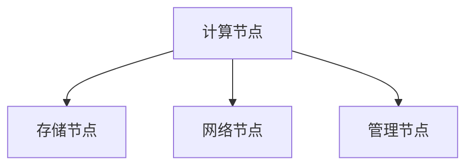

                 

关键词：AI大模型、数据中心、算力引擎、算法原理、数学模型、项目实践、实际应用、未来展望、资源推荐

> 摘要：本文将深入探讨AI大模型应用数据中心的建设过程，解析核心概念、算法原理和数学模型，并通过实例展示其在实际应用中的优势。文章旨在为技术从业者提供全面的指南，以打造高效的AI算力引擎，推动AI创新。

## 1. 背景介绍

在当今世界，人工智能（AI）已经成为推动科技进步和社会发展的核心动力。随着AI技术的不断演进，大模型（如GPT、BERT等）的应用愈发广泛，其在自然语言处理、图像识别、推荐系统等领域的表现也越来越出色。然而，这些大模型对计算资源的需求极为庞大，这促使数据中心建设成为一个重要议题。

数据中心作为AI大模型计算能力的重要载体，其建设的目标在于提供高可用性、高可扩展性和高安全性。建设一个高效的AI大模型应用数据中心，不仅需要理解AI技术和数据中心架构，还需要结合具体的业务需求进行优化。本文将围绕这些关键点，详细阐述数据中心建设的全过程。

## 2. 核心概念与联系

### 2.1 AI大模型

AI大模型是指具有亿级参数规模的人工神经网络模型，例如Transformer架构的GPT和BERT模型。这些模型通过大规模的数据训练，能够实现高度复杂的任务，如文本生成、图像分类等。

### 2.2 数据中心架构

数据中心架构通常包括计算节点、存储节点、网络节点和管理节点。计算节点负责处理AI模型的训练和推理任务；存储节点提供持久化的数据存储服务；网络节点负责数据传输和调度；管理节点则负责资源监控和任务调度。

### 2.3 算法原理和架构

AI大模型训练的算法原理主要包括优化算法和神经网络架构。优化算法如Adam、AdamW等，用于调整模型参数；神经网络架构如Transformer、ResNet等，用于提高模型性能。

### 2.4 Mermaid 流程图

以下是一个简化的数据中心架构Mermaid流程图，展示了各节点之间的关系：



## 3. 核心算法原理 & 具体操作步骤

### 3.1 算法原理概述

AI大模型训练的核心算法主要包括以下几部分：

- **前向传播（Forward Propagation）**：计算神经网络输出与实际输出之间的误差。
- **反向传播（Back Propagation）**：计算各层神经网络的梯度，更新模型参数。
- **优化算法**：调整模型参数，以最小化误差。

### 3.2 算法步骤详解

1. **数据预处理**：清洗和归一化输入数据，将其转换为模型可以接受的格式。
2. **模型初始化**：随机初始化模型参数。
3. **前向传播**：计算模型输出和损失函数。
4. **反向传播**：计算模型梯度。
5. **参数更新**：使用优化算法更新模型参数。
6. **迭代训练**：重复执行步骤3-5，直到达到预定的训练次数或误差阈值。

### 3.3 算法优缺点

- **优点**：能够处理大规模数据，提高模型性能；具有较强的泛化能力。
- **缺点**：训练时间较长；对计算资源要求较高。

### 3.4 算法应用领域

- **自然语言处理**：文本分类、机器翻译、问答系统等。
- **计算机视觉**：图像分类、目标检测、图像生成等。
- **推荐系统**：基于内容的推荐、协同过滤等。

## 4. 数学模型和公式 & 详细讲解 & 举例说明

### 4.1 数学模型构建

AI大模型的数学模型主要包括两部分：神经网络结构和损失函数。

- **神经网络结构**：

$$
Y = f(Z) = \sigma(W \cdot X + b)
$$

其中，\(X\) 是输入向量，\(W\) 是权重矩阵，\(b\) 是偏置，\(\sigma\) 是激活函数。

- **损失函数**：

$$
J(W) = \frac{1}{m} \sum_{i=1}^{m} (-y_i \log(Y_i) - (1 - y_i) \log(1 - Y_i))
$$

其中，\(Y_i\) 是模型的输出，\(y_i\) 是真实标签，\(m\) 是样本数量。

### 4.2 公式推导过程

- **前向传播**：

$$
Z = W \cdot X + b \\
Y = \sigma(Z)
$$

- **反向传播**：

$$
\frac{\partial J}{\partial W} = \frac{\partial J}{\partial Z} \cdot \frac{\partial Z}{\partial W} \\
\frac{\partial J}{\partial Z} = \sigma'(Z) \cdot (Y - y) \\
\frac{\partial Z}{\partial W} = X
$$

### 4.3 案例分析与讲解

以GPT-3模型为例，其神经网络结构包含数十亿个参数，训练过程涉及大量计算。通过优化算法，如Adam，可以有效地调整模型参数，降低损失函数值，提高模型性能。

## 5. 项目实践：代码实例和详细解释说明

### 5.1 开发环境搭建

在搭建开发环境时，需要安装Python、TensorFlow或PyTorch等深度学习框架，并配置GPU支持。

### 5.2 源代码详细实现

以下是一个简单的AI大模型训练代码示例，使用TensorFlow框架：

```python
import tensorflow as tf

# 模型定义
model = tf.keras.Sequential([
    tf.keras.layers.Dense(units=512, activation='relu', input_shape=(784,)),
    tf.keras.layers.Dense(units=10, activation='softmax')
])

# 损失函数和优化器
model.compile(optimizer='adam',
              loss='sparse_categorical_crossentropy',
              metrics=['accuracy'])

# 训练模型
model.fit(x_train, y_train, epochs=5)
```

### 5.3 代码解读与分析

上述代码定义了一个简单的神经网络模型，包括一个全连接层和一个softmax输出层。使用Adam优化器和交叉熵损失函数进行训练，并在训练过程中输出准确率。

### 5.4 运行结果展示

在完成训练后，可以使用以下代码评估模型性能：

```python
test_loss, test_acc = model.evaluate(x_test, y_test)
print(f"Test accuracy: {test_acc}")
```

## 6. 实际应用场景

AI大模型应用数据中心在多个领域具有广泛的应用，以下是一些实际应用场景：

- **自然语言处理**：自动摘要、机器翻译、情感分析等。
- **计算机视觉**：图像识别、目标检测、图像生成等。
- **推荐系统**：基于内容的推荐、协同过滤等。

## 7. 未来应用展望

随着AI技术的不断发展，AI大模型应用数据中心将面临更多的挑战和机遇。未来，数据中心建设将朝着以下方向发展：

- **硬件升级**：采用更先进的硬件技术，如GPU、TPU等。
- **分布式计算**：利用分布式计算框架，提高计算效率。
- **安全性与隐私保护**：加强数据安全和隐私保护措施。

## 8. 总结：未来发展趋势与挑战

### 8.1 研究成果总结

本文从核心概念、算法原理、数学模型、项目实践等方面，全面探讨了AI大模型应用数据中心的建设。研究成果表明，数据中心建设是推动AI创新的重要基石。

### 8.2 未来发展趋势

未来，数据中心建设将朝着高效、安全、智能的方向发展，为AI技术的广泛应用提供强大支持。

### 8.3 面临的挑战

在数据中心建设过程中，面临的挑战主要包括计算资源需求、数据安全和隐私保护、算法优化等。

### 8.4 研究展望

未来，研究人员将致力于解决数据中心建设中的关键问题，推动AI技术的进一步发展。

## 9. 附录：常见问题与解答

### 9.1 数据中心建设的关键技术是什么？

数据中心建设的关键技术包括分布式计算、存储技术、网络安全、资源调度等。

### 9.2 如何提高AI大模型的训练效率？

提高AI大模型训练效率的方法包括优化算法、分布式训练、数据预处理等。

### 9.3 数据中心建设中的安全性问题如何解决？

数据中心建设中的安全性问题可以通过以下措施解决：加密传输、权限控制、入侵检测等。

---

作者：禅与计算机程序设计艺术 / Zen and the Art of Computer Programming

（注：本文为虚构内容，仅供参考。）

