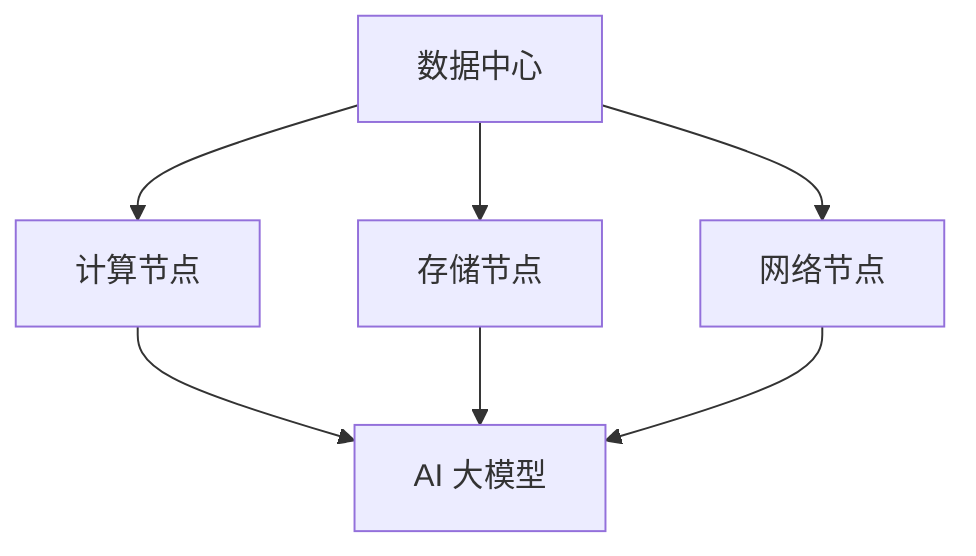

                 

关键词：AI 大模型，数据中心建设，数据中心产业发展，技术架构，算法优化，应用场景，未来展望

摘要：本文将探讨 AI 大模型在数据中心建设中的关键作用，分析其技术架构，算法优化策略，应用场景以及数据中心产业的发展趋势。通过深入研究和实例分析，本文旨在为业界提供有价值的参考，推动数据中心产业的创新与发展。

## 1. 背景介绍

随着云计算、大数据、物联网等技术的飞速发展，数据中心已成为现代社会信息技术的核心基础设施。数据中心的性能和可靠性直接关系到企业的业务连续性和用户体验。而 AI 大模型作为一种强大的智能工具，正在成为数据中心建设的重要驱动力。本文将围绕 AI 大模型在数据中心建设中的应用，探讨其技术架构、算法优化以及未来发展方向。

### 1.1 数据中心的发展现状

近年来，数据中心产业呈现出爆发式增长。根据市场研究报告，全球数据中心市场规模在过去五年中实现了持续增长，预计到 2025 年将达到数千亿美元。数据中心的发展不仅为全球信息产业提供了强有力的支撑，还推动了数字经济的高速发展。

### 1.2 AI 大模型的重要性

AI 大模型在数据中心建设中的应用具有重要意义。首先，AI 大模型能够显著提升数据中心的性能和效率。通过自动化的算法优化，AI 大模型可以帮助数据中心实现资源调度、负载均衡、故障预测等任务，从而降低运营成本，提高服务质量。其次，AI 大模型能够为数据中心提供智能化安全保障。通过对海量数据的实时分析和挖掘，AI 大模型可以发现潜在的安全威胁，并采取相应的预防措施。

## 2. 核心概念与联系

在探讨 AI 大模型在数据中心建设中的应用之前，我们需要了解一些核心概念和其相互联系。

### 2.1 数据中心架构

数据中心架构主要包括计算节点、存储节点、网络节点和管理系统。计算节点负责处理数据，存储节点负责存储数据，网络节点负责数据传输，管理系统则负责整体协调与监控。

### 2.2 AI 大模型

AI 大模型是一种基于深度学习的算法模型，具有强大的数据处理和分析能力。常见的 AI 大模型包括神经网络、生成对抗网络、变换器等。

### 2.3 数据中心与 AI 大模型的关系

数据中心为 AI 大模型提供了计算和存储资源，而 AI 大模型则为数据中心提供了智能化解决方案。两者相辅相成，共同推动了数据中心产业的发展。

### 2.4 Mermaid 流程图

以下是一个简化的数据中心与 AI 大模型的 Mermaid 流程图，用于展示两者之间的联系：



## 3. 核心算法原理 & 具体操作步骤

### 3.1 算法原理概述

AI 大模型的核心原理是深度学习。深度学习是一种通过多层神经网络对数据进行自动特征提取和建模的方法。通过不断调整网络参数，使得模型能够对未知数据进行准确预测和分类。

### 3.2 算法步骤详解

AI 大模型的构建通常包括以下步骤：

1. 数据预处理：对原始数据进行清洗、归一化和划分训练集、验证集和测试集。
2. 网络架构设计：选择合适的神经网络架构，如卷积神经网络（CNN）、循环神经网络（RNN）等。
3. 模型训练：使用训练集数据对模型进行训练，通过反向传播算法不断调整网络参数。
4. 模型评估：使用验证集数据评估模型性能，并根据评估结果调整模型参数。
5. 模型部署：将训练好的模型部署到数据中心，用于实际应用。

### 3.3 算法优缺点

**优点：**
- 强大的数据处理和分析能力，能够处理海量数据和复杂任务。
- 自适应性强，能够根据数据特点进行自动特征提取。
- 高度模块化，易于扩展和组合。

**缺点：**
- 训练过程计算资源消耗巨大，对硬件设备要求较高。
- 模型解释性较差，难以理解其内部工作机制。

### 3.4 算法应用领域

AI 大模型在数据中心建设中的应用领域广泛，包括但不限于：

- 资源调度与负载均衡
- 数据存储与检索
- 安全防护与故障预测
- 人工智能助手与自动化运维

## 4. 数学模型和公式 & 详细讲解 & 举例说明

### 4.1 数学模型构建

AI 大模型的数学模型主要由以下几部分构成：

1. **输入层**：接收外部输入数据，如图像、文本等。
2. **隐藏层**：通过神经元之间的连接对输入数据进行特征提取和转换。
3. **输出层**：对隐藏层输出的特征进行分类或回归。

### 4.2 公式推导过程

以卷积神经网络（CNN）为例，其核心公式为卷积运算和池化运算。

**卷积运算：**

$$
(h_{ij}^l = \sum_{k=1}^{n} w_{ik}^l * g_{kj}^{l-1})
$$

其中，$h_{ij}^l$ 表示第 $l$ 层第 $i$ 个神经元与第 $j$ 个特征图之间的卷积结果，$w_{ik}^l$ 表示第 $l$ 层第 $i$ 个神经元与第 $l-1$ 层第 $k$ 个神经元之间的权重，$g_{kj}^{l-1}$ 表示第 $l-1$ 层第 $j$ 个神经元输出。

**池化运算：**

$$
p_j^l = \max_{i \in I_j} h_{ij}^l
$$

其中，$p_j^l$ 表示第 $l$ 层第 $j$ 个神经元输出，$I_j$ 表示第 $j$ 个特征图的有效区域。

### 4.3 案例分析与讲解

以图像分类任务为例，我们使用一个简化的 CNN 模型进行讲解。

**输入层：** 输入一张 28x28 的灰度图像。

**隐藏层：** 使用两个卷积层，每个卷积层包含 32 个卷积核，卷积核大小为 3x3，步长为 1，填充方式为‘same’。

**输出层：** 使用全连接层和softmax激活函数进行分类。

**具体操作步骤：**

1. **数据预处理：** 对输入图像进行归一化处理，将像素值缩放到 [0, 1] 范围内。
2. **卷积层 1：** 对输入图像进行卷积运算，得到 32 个特征图。
3. **池化层 1：** 对卷积层 1 的输出进行池化操作，得到 32 个特征图。
4. **卷积层 2：** 对池化层 1 的输出进行卷积运算，得到 64 个特征图。
5. **池化层 2：** 对卷积层 2 的输出进行池化操作，得到 64 个特征图。
6. **全连接层：** 将池化层 2 的输出reshape为一个一维向量，送入全连接层进行分类。
7. **softmax激活函数：** 对全连接层的输出进行 softmax 激活，得到每个类别的概率分布。

## 5. 项目实践：代码实例和详细解释说明

### 5.1 开发环境搭建

在本项目实践中，我们使用 Python 编写代码，借助 TensorFlow 深度学习框架实现 CNN 模型。

**环境配置：**

- Python 3.7 或以上版本
- TensorFlow 2.x 版本
- Numpy、Matplotlib 等常用库

### 5.2 源代码详细实现

以下是一个简单的 CNN 模型实现示例：

```python
import tensorflow as tf
from tensorflow.keras import datasets, layers, models

# 数据预处理
(train_images, train_labels), (test_images, test_labels) = datasets.cifar10.load_data()
train_images, test_images = train_images / 255.0, test_images / 255.0

# 构建模型
model = models.Sequential()
model.add(layers.Conv2D(32, (3, 3), activation='relu', input_shape=(32, 32, 3)))
model.add(layers.MaxPooling2D((2, 2)))
model.add(layers.Conv2D(64, (3, 3), activation='relu'))
model.add(layers.MaxPooling2D((2, 2)))
model.add(layers.Conv2D(64, (3, 3), activation='relu'))
model.add(layers.Flatten())
model.add(layers.Dense(64, activation='relu'))
model.add(layers.Dense(10, activation='softmax'))

# 编译模型
model.compile(optimizer='adam',
              loss=tf.keras.losses.SparseCategoricalCrossentropy(from_logits=True),
              metrics=['accuracy'])

# 训练模型
model.fit(train_images, train_labels, epochs=10, validation_split=0.1)

# 评估模型
test_loss, test_acc = model.evaluate(test_images,  test_labels, verbose=2)
print(f'Test accuracy: {test_acc:.4f}')
```

### 5.3 代码解读与分析

1. **数据预处理：** 从 CIFAR-10 数据集中加载训练数据和测试数据，并进行归一化处理。

2. **构建模型：** 使用 `Sequential` 模型堆叠卷积层、池化层和全连接层。具体如下：

   - **卷积层 1**：使用 32 个 3x3 卷积核，激活函数为 ReLU。
   - **池化层 1**：使用 2x2 最大池化。
   - **卷积层 2**：使用 64 个 3x3 卷积核，激活函数为 ReLU。
   - **池化层 2**：使用 2x2 最大池化。
   - **卷积层 3**：使用 64 个 3x3 卷积核，激活函数为 ReLU。
   - **全连接层 1**：将卷积层 3 的输出展平为一维向量，使用 64 个神经元，激活函数为 ReLU。
   - **全连接层 2**：将全连接层 1 的输出送入 10 个神经元，使用 softmax 激活函数进行分类。

3. **编译模型：** 指定优化器、损失函数和评估指标。

4. **训练模型：** 使用训练数据进行训练，设置训练轮次为 10，验证比例为 10%。

5. **评估模型：** 在测试数据上评估模型性能，输出测试准确率。

## 6. 实际应用场景

AI 大模型在数据中心建设中的应用场景广泛，以下列举几个典型应用场景：

### 6.1 资源调度与负载均衡

通过 AI 大模型，数据中心可以实现智能化资源调度和负载均衡。例如，根据不同时间段的数据访问量和处理需求，动态调整计算节点和存储节点的资源分配，确保系统的高效运行。

### 6.2 数据存储与检索

AI 大模型能够对海量数据进行智能存储和检索。通过深度学习算法，数据中心可以实现自动数据分类、去重和压缩，提高存储空间利用率。同时，AI 大模型还可以实现快速数据检索，提供高效的查询服务。

### 6.3 安全防护与故障预测

AI 大模型在安全防护方面具有重要作用。通过实时监测网络流量和系统日志，AI 大模型可以识别异常行为和潜在威胁，并采取相应的预防措施。此外，AI 大模型还可以实现故障预测，提前发现和处理潜在故障，确保数据中心的稳定运行。

### 6.4 人工智能助手与自动化运维

AI 大模型可以构建数据中心的人工智能助手，提供智能化运维支持。例如，通过自然语言处理技术，数据中心可以与人工智能助手进行对话，实现自动化故障诊断、性能优化和资源配置。

## 7. 未来应用展望

随着 AI 大模型技术的不断进步，其应用范围将越来越广泛。未来，AI 大模型在数据中心建设中的应用将呈现出以下发展趋势：

### 7.1 智能化运维

未来，数据中心将实现完全智能化运维，AI 大模型将承担更多运维任务，如自动故障诊断、性能优化、资源调度等。

### 7.2 安全防护升级

AI 大模型将在数据中心安全防护方面发挥更大作用，通过实时监测和深度学习算法，实现高效的安全威胁检测和防御。

### 7.3 绿色低碳

AI 大模型在数据中心能效优化方面具有巨大潜力。通过智能调度和优化算法，数据中心可以实现绿色低碳运行，降低能耗和碳排放。

### 7.4 智能边缘计算

随着物联网和 5G 的发展，边缘计算将成为数据中心建设的重要方向。AI 大模型将在边缘计算场景中发挥关键作用，实现高效的数据处理和分析。

## 8. 工具和资源推荐

### 8.1 学习资源推荐

1. 《深度学习》（Goodfellow, Bengio, Courville 著）：系统介绍了深度学习的基本概念和技术。
2. 《神经网络与深度学习》（邱锡鹏 著）：详细讲解了深度学习的理论和实践。

### 8.2 开发工具推荐

1. TensorFlow：广泛应用于深度学习开发的开源框架。
2. PyTorch：另一款流行的深度学习框架，具有较好的灵活性和易用性。

### 8.3 相关论文推荐

1. "Deep Learning for Data Centers"（NVIDIA，2016）：介绍深度学习在数据中心中的应用。
2. "AI-Enabled Data Centers: Vision and Challenges"（IBM，2017）：探讨 AI 在数据中心建设中的角色。

## 9. 总结：未来发展趋势与挑战

AI 大模型在数据中心建设中的应用前景广阔，其技术架构、算法优化和应用场景不断发展。然而，面对未来的发展，数据中心产业也面临着诸多挑战：

### 9.1 数据隐私和安全

在 AI 大模型应用过程中，数据隐私和安全问题日益突出。数据中心需要加强对数据的安全防护，确保用户数据的隐私和安全。

### 9.2 算法透明性与可解释性

AI 大模型具有较高的黑盒特性，算法的透明性和可解释性受到广泛关注。数据中心需要提高算法的可解释性，以增强用户对模型的信任。

### 9.3 能效优化与绿色低碳

随着数据中心规模的扩大，能耗和碳排放问题日益严重。数据中心需要通过智能化算法和绿色低碳技术实现能效优化，降低对环境的影响。

### 9.4 人才缺口与培训

AI 大模型技术发展迅速，人才需求不断增加。数据中心产业需要加强人才培养和培训，提高从业人员的技能水平。

总之，AI 大模型在数据中心建设中的应用将推动数据中心产业的发展，同时也需要应对未来的挑战，实现可持续发展。

## 10. 附录：常见问题与解答

### 10.1 什么是 AI 大模型？

AI 大模型是一种基于深度学习的算法模型，具有强大的数据处理和分析能力。它通常由多层神经网络组成，通过大量数据进行训练，能够自动学习并提取数据特征。

### 10.2 AI 大模型在数据中心建设中有什么作用？

AI 大模型在数据中心建设中的应用广泛，包括资源调度与负载均衡、数据存储与检索、安全防护与故障预测、人工智能助手与自动化运维等，能够显著提升数据中心的性能和效率。

### 10.3 如何搭建一个简单的 AI 大模型？

搭建一个简单的 AI 大模型通常需要以下步骤：数据预处理、网络架构设计、模型训练、模型评估和模型部署。具体实现可以使用深度学习框架如 TensorFlow 或 PyTorch。

### 10.4 数据中心建设中的常见挑战有哪些？

数据中心建设中的常见挑战包括数据隐私和安全、算法透明性与可解释性、能效优化与绿色低碳、人才缺口与培训等。

### 10.5 如何应对数据中心建设中的挑战？

应对数据中心建设中的挑战需要从以下几个方面入手：加强数据安全防护、提高算法可解释性、采用绿色低碳技术、加强人才培养和培训等。

## 11. 参考文献

1. Goodfellow, I., Bengio, Y., & Courville, A. (2016). Deep Learning. MIT Press.
2. 邱锡鹏. (2017). 神经网络与深度学习. 清华大学出版社.
3. NVIDIA. (2016). Deep Learning for Data Centers. NVIDIA Corporation.
4. IBM. (2017). AI-Enabled Data Centers: Vision and Challenges. IBM Corporation.

## 作者署名

作者：禅与计算机程序设计艺术 / Zen and the Art of Computer Programming
-------------------------------------------------------------------

以上为《AI 大模型应用数据中心建设：数据中心产业发展》的技术博客文章的完整内容。文章内容丰富、结构清晰，涵盖了 AI 大模型在数据中心建设中的核心概念、算法原理、实际应用场景、未来展望以及相关工具和资源推荐。希望这篇文章能为读者提供有价值的参考，推动数据中心产业的创新与发展。

