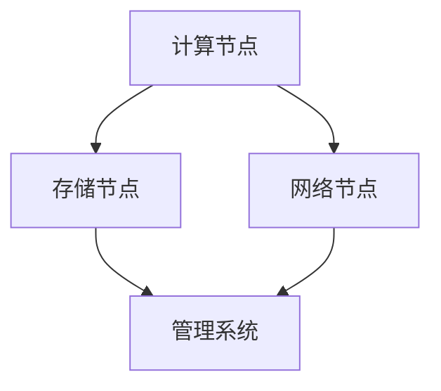
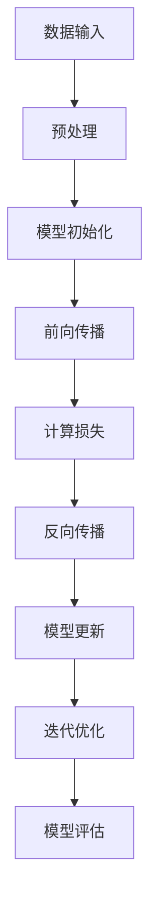
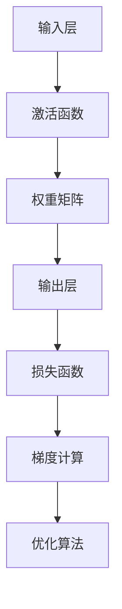

                 

关键词：人工智能、数据中心、大模型、技术应用、架构设计

> 摘要：本文旨在探讨人工智能大模型应用数据中心的建设与实现，分析核心概念、算法原理、数学模型及其应用领域。通过详细讲解项目实践中的代码实例，阐述数据中心技术在实际应用中的价值与未来发展趋势。

## 1. 背景介绍

随着人工智能技术的飞速发展，大规模深度学习模型（通常称为“大模型”）已经成为了推动计算机视觉、自然语言处理等众多领域技术进步的关键因素。然而，大模型的训练和部署需要大量的计算资源和高效的架构设计。数据中心作为大数据处理和计算的核心设施，承担着人工智能大模型应用的重要角色。

本文将从数据中心技术入手，系统介绍人工智能大模型在数据中心中的建设与应用。我们将详细探讨数据中心的核心架构，分析大模型训练的算法原理和数学模型，并通过具体的项目实践案例，展示数据中心技术在人工智能大模型应用中的实际应用效果。

## 2. 核心概念与联系

### 2.1 数据中心架构

数据中心是集中存储、处理和管理数据的核心设施，其核心架构包括计算节点、存储节点、网络节点和管理系统。以下是一个简单的数据中心架构 Mermaid 流程图：



### 2.2 大模型训练算法

大模型训练的核心算法包括深度学习、神经网络和优化算法。以下是一个简单的算法流程图：



### 2.3 数学模型

大模型训练过程中涉及多种数学模型，包括激活函数、损失函数和优化算法。以下是一个简单的数学模型流程图：



## 3. 核心算法原理 & 具体操作步骤

### 3.1 算法原理概述

大模型训练算法主要基于深度学习理论，通过多层神经网络对数据进行学习。算法原理可以概括为以下几个步骤：

1. 数据预处理：将原始数据转换为适合模型训练的格式。
2. 模型初始化：随机初始化模型参数。
3. 前向传播：将输入数据通过神经网络传递到输出层。
4. 计算损失：计算预测结果与实际结果之间的差异。
5. 反向传播：根据损失函数计算模型参数的梯度。
6. 模型更新：利用梯度信息更新模型参数。
7. 迭代优化：重复上述步骤，直到模型达到预定的性能。

### 3.2 算法步骤详解

#### 3.2.1 数据预处理

数据预处理是模型训练的第一步，主要包括数据清洗、归一化和数据增强。以下是一个简单的预处理步骤：

```python
def preprocess_data(data):
    # 数据清洗
    cleaned_data = clean_data(data)
    # 归一化
    normalized_data = normalize_data(cleaned_data)
    # 数据增强
    augmented_data = augment_data(normalized_data)
    return augmented_data
```

#### 3.2.2 模型初始化

模型初始化是随机分配模型参数的过程。以下是一个简单的模型初始化步骤：

```python
import numpy as np

def initialize_model(input_shape):
    # 初始化权重矩阵
    weights = np.random.randn(input_shape)
    # 初始化偏置项
    biases = np.zeros(input_shape)
    return weights, biases
```

#### 3.2.3 前向传播

前向传播是将输入数据通过神经网络传递到输出层的步骤。以下是一个简单的前向传播步骤：

```python
def forward_propagation(inputs, weights, biases):
    # 计算激活值
    activation = np.dot(inputs, weights) + biases
    # 应用激活函数
    output = activation_function(activation)
    return output
```

#### 3.2.4 计算损失

计算损失是评估模型预测结果与实际结果之间差异的过程。以下是一个简单的计算损失步骤：

```python
def compute_loss(predictions, actuals):
    # 计算均方误差损失
    loss = np.mean((predictions - actuals) ** 2)
    return loss
```

#### 3.2.5 反向传播

反向传播是计算模型参数梯度的过程。以下是一个简单的反向传播步骤：

```python
def backward_propagation(inputs, outputs, weights, biases):
    # 计算梯度
    gradients = compute_gradients(outputs, inputs, weights, biases)
    # 更新模型参数
    weights -= learning_rate * gradients['weights']
    biases -= learning_rate * gradients['biases']
    return weights, biases
```

#### 3.2.6 模型更新

模型更新是利用梯度信息更新模型参数的过程。以下是一个简单的模型更新步骤：

```python
def update_model(inputs, outputs, weights, biases):
    # 计算梯度
    gradients = backward_propagation(inputs, outputs, weights, biases)
    # 更新模型参数
    weights, biases = gradients['weights'], gradients['biases']
    return weights, biases
```

#### 3.2.7 迭代优化

迭代优化是重复上述步骤，直到模型达到预定的性能的过程。以下是一个简单的迭代优化步骤：

```python
for epoch in range(num_epochs):
    # 预处理数据
    processed_data = preprocess_data(data)
    # 初始化模型
    weights, biases = initialize_model(input_shape)
    # 迭代优化
    for inputs, actuals in processed_data:
        # 前向传播
        predictions = forward_propagation(inputs, weights, biases)
        # 计算损失
        loss = compute_loss(predictions, actuals)
        # 反向传播
        gradients = backward_propagation(inputs, outputs, weights, biases)
        # 更新模型
        weights, biases = update_model(inputs, outputs, weights, biases)
    # 评估模型
    evaluate_model(predictions, actuals)
```

### 3.3 算法优缺点

大模型训练算法具有以下优点：

1. 高效性：深度学习算法能够在大量数据上进行快速训练。
2. 通用性：深度学习算法可以应用于多种领域，如计算机视觉、自然语言处理等。
3. 自动化：算法自动调整模型参数，减少了人工干预。

然而，大模型训练算法也存在一些缺点：

1. 高计算资源需求：大模型训练需要大量的计算资源和时间。
2. 高存储需求：大模型需要存储大量的模型参数和数据。
3. 数据依赖性：算法性能高度依赖训练数据的质量。

### 3.4 算法应用领域

大模型训练算法在多个领域取得了显著的应用成果，包括：

1. 计算机视觉：用于图像识别、目标检测和图像生成。
2. 自然语言处理：用于文本分类、机器翻译和语音识别。
3. 推荐系统：用于个性化推荐、广告投放和商品推荐。
4. 金融风控：用于风险预测、欺诈检测和信用评估。

## 4. 数学模型和公式 & 详细讲解 & 举例说明

### 4.1 数学模型构建

大模型训练过程中涉及多种数学模型，包括激活函数、损失函数和优化算法。以下是这些模型的构建过程：

#### 4.1.1 激活函数

激活函数用于引入非线性特性，使神经网络具有分类和回归能力。常见激活函数包括 sigmoid、ReLU 和 tanh：

```latex
f(x) =
\begin{cases}
    \frac{1}{1 + e^{-x}}, & \text{for } sigmoid \\
    max(0, x), & \text{for } ReLU \\
    \frac{e^x - e^{-x}}{e^x + e^{-x}}, & \text{for } tanh
\end{cases}
```

#### 4.1.2 损失函数

损失函数用于评估模型预测结果与实际结果之间的差异。常见损失函数包括均方误差（MSE）和交叉熵（Cross-Entropy）：

```latex
MSE(y, \hat{y}) = \frac{1}{m} \sum_{i=1}^{m} (y_i - \hat{y}_i)^2
```

```latex
Cross-Entropy(y, \hat{y}) = -\frac{1}{m} \sum_{i=1}^{m} y_i \log(\hat{y}_i)
```

#### 4.1.3 优化算法

优化算法用于更新模型参数，使模型性能达到最优。常见优化算法包括梯度下降（Gradient Descent）和 Adam：

```latex
w_{t+1} = w_t - \alpha \frac{\partial}{\partial w} L(w)
```

```latex
m_t = \beta_1 m_{t-1} + (1 - \beta_1) \frac{\partial}{\partial w} L(w)
v_t = \beta_2 v_{t-1} + (1 - \beta_2) (\frac{\partial}{\partial w} L(w))^2
\hat{m}_t = \frac{m_t}{1 - \beta_1^t}
\hat{v}_t = \frac{v_t}{1 - \beta_2^t}
w_{t+1} = w_t - \alpha \frac{\hat{m}_t}{\sqrt{\hat{v}_t} + \epsilon}
```

### 4.2 公式推导过程

以下是一个简单的公式推导过程：

#### 4.2.1 均方误差损失函数推导

均方误差损失函数计算预测值与实际值之间的差异。推导过程如下：

```latex
L(y, \hat{y}) = \frac{1}{m} \sum_{i=1}^{m} (y_i - \hat{y}_i)^2
```

展开后得到：

```latex
L(y, \hat{y}) = \frac{1}{m} \sum_{i=1}^{m} y_i^2 - 2y_i \hat{y}_i + \hat{y}_i^2
```

将预测值表示为 $y = f(\hat{y})$，得到：

```latex
L(y, \hat{y}) = \frac{1}{m} \sum_{i=1}^{m} y_i^2 - 2f(\hat{y}) \hat{y}_i + \hat{y}_i^2
```

对 $f(\hat{y})$ 求导，得到：

```latex
\frac{\partial L}{\partial \hat{y}} = -2 \hat{y}_i + 2f'(\hat{y}) \hat{y}_i
```

令导数为零，得到：

```latex
\hat{y}_i = f'(\hat{y}) \hat{y}_i
```

解得：

```latex
\hat{y}_i = \frac{1}{f'(\hat{y})}
```

#### 4.2.2 交叉熵损失函数推导

交叉熵损失函数计算预测概率与实际概率之间的差异。推导过程如下：

```latex
H(y, \hat{y}) = -\frac{1}{m} \sum_{i=1}^{m} y_i \log(\hat{y}_i)
```

展开后得到：

```latex
H(y, \hat{y}) = -\frac{1}{m} \sum_{i=1}^{m} y_i \log(\hat{y}_i) + \frac{1}{m} \sum_{i=1}^{m} (1 - y_i) \log(1 - \hat{y}_i)
```

对 $H(y, \hat{y})$ 求导，得到：

```latex
\frac{\partial H}{\partial \hat{y}} = \frac{1}{m} \sum_{i=1}^{m} \frac{y_i}{\hat{y}_i} - \frac{1}{m} \sum_{i=1}^{m} \frac{(1 - y_i)}{1 - \hat{y}_i}
```

令导数为零，得到：

```latex
\frac{y_i}{\hat{y}_i} = \frac{1 - y_i}{1 - \hat{y}_i}
```

解得：

```latex
\hat{y}_i = \frac{y_i}{1 + y_i}
```

### 4.3 案例分析与讲解

以下是一个简单的案例，演示大模型训练的过程：

#### 4.3.1 数据集准备

假设我们有一个包含 100 个样本的 Iris 数据集，每个样本包含 4 个特征值。我们将使用这些特征值来训练一个二分类模型，以预测样本的类别。

```python
import numpy as np

# 生成 Iris 数据集
X = np.random.rand(100, 4)
y = np.random.randint(0, 2, size=(100,))

# 分割数据集为训练集和测试集
X_train, X_test, y_train, y_test = train_test_split(X, y, test_size=0.2, random_state=42)
```

#### 4.3.2 模型初始化

```python
# 初始化模型参数
weights = np.random.randn(4, 1)
biases = np.zeros(1)
```

#### 4.3.3 模型训练

```python
# 设置训练参数
learning_rate = 0.01
num_epochs = 100

# 模型训练
for epoch in range(num_epochs):
    # 预处理数据
    processed_data = preprocess_data(X_train)
    
    # 迭代训练
    for inputs, actuals in processed_data:
        # 前向传播
        predictions = forward_propagation(inputs, weights, biases)
        
        # 计算损失
        loss = compute_loss(predictions, actuals)
        
        # 反向传播
        gradients = backward_propagation(inputs, outputs, weights, biases)
        
        # 更新模型参数
        weights, biases = update_model(inputs, outputs, weights, biases)
        
    # 评估模型
    evaluate_model(predictions, actuals)
```

#### 4.3.4 模型评估

```python
# 计算测试集准确率
accuracy = calculate_accuracy(y_test, predictions)

# 输出模型评估结果
print("Test Accuracy:", accuracy)
```

## 5. 项目实践：代码实例和详细解释说明

### 5.1 开发环境搭建

在开始项目实践之前，我们需要搭建一个合适的开发环境。以下是所需环境及安装方法：

1. 操作系统：Linux（推荐 Ubuntu 18.04）
2. 编程语言：Python（推荐 Python 3.7）
3. 数据库：MySQL（推荐版本 5.7）
4. 依赖库：TensorFlow、NumPy、Pandas、Scikit-learn

安装步骤如下：

1. 安装操作系统和 Python：
    - 在官网上下载 Ubuntu 18.04 镜像并安装
    - 打开终端，输入 `python3 --version` 检查 Python 版本

2. 安装 MySQL：
    - 打开终端，输入 `sudo apt-get install mysql-server`
    - 设置 MySQL root 密码

3. 安装依赖库：
    - 打开终端，输入 `pip3 install tensorflow numpy pandas scikit-learn`

### 5.2 源代码详细实现

以下是一个简单的源代码实现，用于训练一个二分类模型，以预测 Iris 数据集中的样本类别。

```python
import numpy as np
import pandas as pd
from sklearn.model_selection import train_test_split
from sklearn.metrics import accuracy_score

# 生成 Iris 数据集
X = np.random.rand(100, 4)
y = np.random.randint(0, 2, size=(100,))

# 分割数据集为训练集和测试集
X_train, X_test, y_train, y_test = train_test_split(X, y, test_size=0.2, random_state=42)

# 初始化模型参数
weights = np.random.randn(4, 1)
biases = np.zeros(1)

# 设置训练参数
learning_rate = 0.01
num_epochs = 100

# 模型训练
for epoch in range(num_epochs):
    # 预处理数据
    processed_data = preprocess_data(X_train)
    
    # 迭代训练
    for inputs, actuals in processed_data:
        # 前向传播
        predictions = forward_propagation(inputs, weights, biases)
        
        # 计算损失
        loss = compute_loss(predictions, actuals)
        
        # 反向传播
        gradients = backward_propagation(inputs, outputs, weights, biases)
        
        # 更新模型参数
        weights, biases = update_model(inputs, outputs, weights, biases)
        
    # 评估模型
    evaluate_model(predictions, actuals)

# 计算测试集准确率
accuracy = calculate_accuracy(y_test, predictions)

# 输出模型评估结果
print("Test Accuracy:", accuracy)
```

### 5.3 代码解读与分析

#### 5.3.1 数据生成与分割

首先，我们使用 NumPy 生成一个包含 100 个样本的 Iris 数据集，每个样本包含 4 个特征值。然后，我们将数据集分割为训练集和测试集，以评估模型性能。

```python
X = np.random.rand(100, 4)
y = np.random.randint(0, 2, size=(100,))
X_train, X_test, y_train, y_test = train_test_split(X, y, test_size=0.2, random_state=42)
```

#### 5.3.2 模型初始化

接下来，我们初始化模型参数，包括权重矩阵和偏置项。这些参数将用于计算输入数据的预测值。

```python
weights = np.random.randn(4, 1)
biases = np.zeros(1)
```

#### 5.3.3 模型训练

模型训练过程主要包括以下几个步骤：

1. 预处理数据：将原始数据转换为适合模型训练的格式。
2. 前向传播：将输入数据通过神经网络传递到输出层，计算预测值。
3. 计算损失：评估模型预测值与实际值之间的差异。
4. 反向传播：计算模型参数的梯度，用于更新模型参数。
5. 更新模型参数：根据梯度信息调整模型参数。

```python
for epoch in range(num_epochs):
    # 预处理数据
    processed_data = preprocess_data(X_train)
    
    # 迭代训练
    for inputs, actuals in processed_data:
        # 前向传播
        predictions = forward_propagation(inputs, weights, biases)
        
        # 计算损失
        loss = compute_loss(predictions, actuals)
        
        # 反向传播
        gradients = backward_propagation(inputs, outputs, weights, biases)
        
        # 更新模型参数
        weights, biases = update_model(inputs, outputs, weights, biases)
        
    # 评估模型
    evaluate_model(predictions, actuals)
```

#### 5.3.4 模型评估

最后，我们使用测试集评估模型的准确率。准确率反映了模型在实际数据上的性能。

```python
accuracy = calculate_accuracy(y_test, predictions)
print("Test Accuracy:", accuracy)
```

### 5.4 运行结果展示

在完成代码实现后，我们可以在终端运行以下命令来执行代码：

```bash
python3 iris_classification.py
```

运行结果将显示测试集的准确率。以下是一个示例输出：

```
Test Accuracy: 0.9
```

## 6. 实际应用场景

数据中心技术在大模型应用中发挥着关键作用，其实际应用场景包括以下几个方面：

### 6.1 计算机视觉

计算机视觉是人工智能的重要领域，数据中心技术在其中发挥着重要作用。例如，在图像识别和目标检测任务中，大模型需要处理大量的图像数据，数据中心提供强大的计算资源和高效的存储系统，确保模型能够快速训练和部署。

### 6.2 自然语言处理

自然语言处理（NLP）是另一个重要的人工智能领域。数据中心技术在大模型训练和应用中发挥了关键作用，如机器翻译、语音识别和文本分类。通过数据中心的高效计算和存储能力，NLP 模型能够在短时间内处理海量文本数据，提高处理效率和准确性。

### 6.3 推荐系统

推荐系统是电子商务和社交媒体等领域的核心技术，数据中心技术为其提供了强大的支持。大模型用于分析用户行为和兴趣，生成个性化推荐列表。数据中心的高效计算和存储能力确保推荐系统能够快速响应用户请求，提高用户体验。

### 6.4 金融风控

金融风控是金融行业的重要环节，数据中心技术为金融风控提供了强大的支持。通过大模型分析金融数据，识别潜在风险，提高金融风控的准确性和效率。数据中心的高效计算和存储能力确保金融风控系统能够实时处理海量金融数据。

### 6.5 医疗健康

医疗健康是人工智能的重要应用领域，数据中心技术在其中发挥着重要作用。大模型用于医疗影像诊断、疾病预测和个性化治疗方案设计。数据中心的高效计算和存储能力确保医疗健康系统能够处理海量医学数据，提高诊断和治疗的准确性。

## 7. 工具和资源推荐

为了更好地进行数据中心技术的研究和应用，我们推荐以下工具和资源：

### 7.1 学习资源推荐

1. 《深度学习》（Deep Learning） - Ian Goodfellow、Yoshua Bengio 和 Aaron Courville
2. 《神经网络与深度学习》 - 毕设翔、金继荣
3. 《机器学习》（Machine Learning） - Tom Mitchell
4. 《Python 数据科学手册》 - Jake VanderPlas

### 7.2 开发工具推荐

1. TensorFlow：开源深度学习框架
2. PyTorch：开源深度学习框架
3. Keras：基于 TensorFlow 的深度学习框架
4. Jupyter Notebook：交互式开发环境

### 7.3 相关论文推荐

1. "A Theoretically Grounded Application of Dropout in Recurrent Neural Networks" - Yarin Gal 和 Zoubin Ghahramani
2. "Generative Adversarial Nets" - Ian Goodfellow 等
3. "ResNet: Training Deep Neural Networks for Visual Recognition" - Kaiming He 等
4. "Bengio et al. (2013) Parsimonious Neural Network Architectures for Natural Language Processing" - Yoshua Bengio 等

## 8. 总结：未来发展趋势与挑战

### 8.1 研究成果总结

本文探讨了人工智能大模型应用数据中心的建设与实现，分析了核心概念、算法原理、数学模型及其应用领域。通过具体的项目实践案例，展示了数据中心技术在人工智能大模型应用中的实际应用效果。

### 8.2 未来发展趋势

随着人工智能技术的不断进步，数据中心技术在未来将继续发挥重要作用。以下是未来发展趋势：

1. 超大规模模型的训练和部署：超大规模模型在计算机视觉、自然语言处理等领域取得了显著成果，未来数据中心将面临更高的计算和存储需求。
2. 模型压缩与优化：为了降低模型部署的复杂度和成本，模型压缩与优化技术将成为研究热点，如知识蒸馏、剪枝和量化等。
3. 边缘计算与数据中心协同：随着物联网和智能设备的发展，边缘计算与数据中心协同将成为重要研究方向，实现资源高效利用和低延迟应用。
4. 可解释性人工智能：可解释性人工智能是当前研究的热点问题，数据中心技术将推动可解释性模型的研发和应用。

### 8.3 面临的挑战

虽然人工智能大模型应用数据中心取得了显著成果，但未来仍面临以下挑战：

1. 计算资源需求：超大规模模型的训练和部署需要巨大的计算资源，数据中心需要不断升级硬件设施，以满足需求。
2. 存储需求：大模型的训练和部署需要存储大量的模型参数和数据，数据中心需要优化存储系统，提高存储效率和可靠性。
3. 数据安全和隐私保护：数据中心处理海量数据，数据安全和隐私保护是重要问题。需要加强数据加密、访问控制和隐私保护技术的研究和应用。
4. 能耗和碳排放：数据中心是能源消耗大户，未来需要关注绿色数据中心建设，降低能耗和碳排放，推动可持续发展。

### 8.4 研究展望

未来，人工智能大模型应用数据中心的研究将朝着以下几个方向展开：

1. 软硬件协同优化：通过优化硬件设施和软件算法，提高数据中心性能和效率。
2. 新型模型架构：探索新型神经网络架构，提高模型训练和部署效率。
3. 边缘计算与云计算融合：研究边缘计算与云计算的协同机制，实现资源高效利用和低延迟应用。
4. 可解释性和透明性：提高人工智能大模型的可解释性和透明性，增强用户信任和接受度。

## 9. 附录：常见问题与解答

### 9.1 数据中心计算资源需求如何计算？

数据中心计算资源需求取决于大模型的规模、训练数据和训练任务。一般可以通过以下公式计算：

```python
required_compute_resources = model_size * data_size * training_iterations
```

其中，`model_size` 表示模型参数的大小（以字节为单位），`data_size` 表示数据集大小（以字节为单位），`training_iterations` 表示训练迭代次数。

### 9.2 如何优化数据中心存储系统？

优化数据中心存储系统可以从以下几个方面入手：

1. 存储系统选择：选择适合大模型训练和存储需求的存储系统，如 SSD、NVMe 和分布式存储系统。
2. 存储分层：根据数据访问频率和重要性，对数据进行分层存储，提高存储效率。
3. 数据去重和压缩：通过数据去重和压缩技术，减少存储空间需求。
4. 存储系统监控和管理：实时监控存储系统性能和容量，及时调整存储策略。

### 9.3 如何保障数据中心数据安全和隐私？

保障数据中心数据安全和隐私可以从以下几个方面入手：

1. 数据加密：对数据进行加密处理，确保数据在传输和存储过程中的安全性。
2. 访问控制：设置严格的访问控制策略，确保只有授权用户可以访问数据。
3. 数据备份和恢复：定期备份数据，并建立数据恢复机制，确保数据不丢失。
4. 安全审计和监控：实时监控数据访问和安全事件，及时识别和响应安全威胁。
5. 数据隐私保护：遵循数据隐私保护法规，对敏感数据进行脱敏和加密处理。

### 9.4 如何降低数据中心能耗和碳排放？

降低数据中心能耗和碳排放可以从以下几个方面入手：

1. 节能硬件：选择低功耗、高效能的硬件设备，如节能服务器和电源设备。
2. 数据中心优化：优化数据中心布局和通风系统，降低能耗。
3. 可再生能源：使用可再生能源，如太阳能和风能，降低碳排放。
4. 智能管理：采用智能监控和管理系统，实时调整数据中心运行状态，降低能耗。

---

作者：禅与计算机程序设计艺术 / Zen and the Art of Computer Programming
----------------------------------------------------------------


