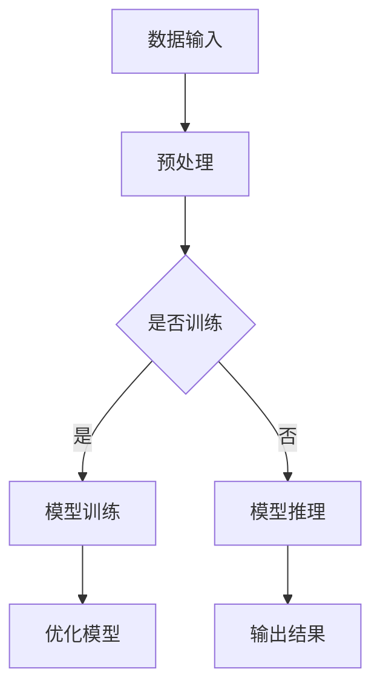

                 

关键词：AI大模型，数据中心，技术架构，发展趋势，未来展望

> 摘要：本文旨在探讨人工智能大模型在数据中心中的应用，以及数据中心在未来将面临的挑战和机遇。通过分析数据中心的关键技术、架构设计和未来发展趋势，为读者提供对数据中心行业的深入理解和前瞻性思考。

## 1. 背景介绍

随着人工智能技术的快速发展，大模型（如Transformer、BERT等）在自然语言处理、计算机视觉、语音识别等领域取得了显著的成果。这些大模型的训练和推理需求巨大，对数据中心的技术架构和基础设施提出了更高的要求。因此，数据中心的建设与优化成为了AI领域的关键课题。

数据中心是现代信息技术的基础设施，承担着海量数据存储、处理和传输的重要任务。随着大数据、云计算和人工智能等技术的普及，数据中心的规模和复杂度不断增长，如何高效地管理和利用这些资源成为亟待解决的问题。

本文将从以下几个方面展开讨论：

1. 大模型在数据中心的应用现状和挑战；
2. 数据中心的核心技术和架构设计；
3. 数据中心未来发展趋势和机遇；
4. 面临的挑战和解决方案；
5. 总结与展望。

## 2. 核心概念与联系

为了更好地理解数据中心与大模型之间的联系，我们需要介绍一些核心概念和架构设计。

### 2.1. 大模型基本概念

大模型是指具有数十亿到数千亿参数规模的人工神经网络模型。这些模型通过学习大量的数据，能够自动地提取出数据中的复杂模式和知识，从而实现高效的预测和分类任务。

### 2.2. 数据中心架构设计

数据中心通常由计算节点、存储节点、网络节点和监控节点组成。计算节点负责执行数据处理任务；存储节点提供海量数据存储；网络节点负责数据传输和负载均衡；监控节点对数据中心运行状态进行监控和告警。

### 2.3. 大模型与数据中心的联系

大模型在数据中心的应用主要体现在以下几个方面：

1. **训练**：大模型需要在数据中心进行大规模的训练，需要高效的计算资源和数据传输能力。
2. **推理**：大模型在推理阶段需要快速地处理用户请求，需要低延迟和高吞吐量的计算能力。
3. **存储**：大模型训练和推理过程中会产生大量的数据，需要高效的存储和管理机制。

### 2.4. Mermaid 流程图

下面是一个简单的Mermaid流程图，展示了大模型在数据中心的基本工作流程：



## 3. 核心算法原理 & 具体操作步骤

### 3.1 算法原理概述

大模型的训练和推理主要依赖于深度学习算法。深度学习算法通过多层神经网络对数据进行特征提取和模式识别。以下是一些常用的深度学习算法：

1. **卷积神经网络（CNN）**：适用于图像和视频处理。
2. **循环神经网络（RNN）**：适用于序列数据处理。
3. **Transformer模型**：适用于自然语言处理。

### 3.2 算法步骤详解

1. **数据预处理**：包括数据清洗、归一化、数据增强等步骤。
2. **模型构建**：根据任务需求，选择合适的神经网络架构。
3. **模型训练**：使用训练数据对模型进行训练，优化模型参数。
4. **模型评估**：使用验证集评估模型性能，调整模型参数。
5. **模型推理**：使用训练好的模型对新的数据进行分析和预测。

### 3.3 算法优缺点

1. **优点**：
   - **高效性**：大模型能够自动提取复杂特征，减少人工特征工程的工作量。
   - **灵活性**：大模型能够适应多种任务和数据类型。

2. **缺点**：
   - **计算资源需求大**：大模型的训练和推理需要大量的计算资源和存储空间。
   - **训练时间较长**：大模型的训练过程需要较长的时间。

### 3.4 算法应用领域

大模型在数据中心的应用领域非常广泛，包括：

1. **自然语言处理**：如机器翻译、文本分类、问答系统等。
2. **计算机视觉**：如图像识别、目标检测、视频分析等。
3. **语音识别**：如语音合成、语音识别、说话人识别等。

## 4. 数学模型和公式 & 详细讲解 & 举例说明

### 4.1 数学模型构建

大模型的数学模型主要包括以下几个部分：

1. **神经网络结构**：包括输入层、隐藏层和输出层。
2. **损失函数**：用于评估模型预测结果与实际结果之间的差距。
3. **优化算法**：用于更新模型参数，优化模型性能。

### 4.2 公式推导过程

以下是一个简单的神经网络模型的损失函数和优化算法推导：

1. **损失函数**：

$$
L(y, \hat{y}) = -\frac{1}{m}\sum_{i=1}^{m}y_{i}\log(\hat{y}_{i})
$$

其中，$y$ 是真实标签，$\hat{y}$ 是模型预测的概率分布。

2. **优化算法**：

$$
\theta = \theta - \alpha \frac{\partial L}{\partial \theta}
$$

其中，$\theta$ 是模型参数，$\alpha$ 是学习率，$\frac{\partial L}{\partial \theta}$ 是损失函数对参数 $\theta$ 的梯度。

### 4.3 案例分析与讲解

以下是一个简单的案例，用于说明大模型在自然语言处理中的应用。

**任务**：使用BERT模型进行文本分类。

**数据集**：使用IMDB电影评论数据集。

**步骤**：

1. **数据预处理**：对电影评论进行分词、去停用词、词向量化等处理。
2. **模型构建**：使用BERT模型进行文本编码。
3. **模型训练**：使用训练集对模型进行训练。
4. **模型评估**：使用验证集评估模型性能。
5. **模型推理**：使用训练好的模型对新的评论进行分类。

**结果**：模型在IMDB数据集上取得了很高的准确率，说明BERT模型在文本分类任务中具有很好的性能。

## 5. 项目实践：代码实例和详细解释说明

### 5.1 开发环境搭建

在开始项目实践之前，我们需要搭建一个开发环境。以下是一个简单的Python开发环境搭建步骤：

1. **安装Python**：从官方网站下载Python安装包并安装。
2. **安装PyTorch**：使用pip命令安装PyTorch库。
3. **安装其他依赖库**：如TensorFlow、NumPy等。

### 5.2 源代码详细实现

以下是一个简单的文本分类项目代码实现：

```python
import torch
import torch.nn as nn
import torch.optim as optim
from torchtext.datasets import IMDB
from torchtext.data import Field, BucketIterator

# 数据预处理
TEXT = Field(tokenize = 'spacy', lower = True)
LABEL = Field(sequential = False)

train_data, test_data = IMDB.splits(TEXT, LABEL)

TEXT.build_vocab(train_data, max_size = 25000, vectors = 'glove.6B.100d')
LABEL.build_vocab(train_data)

BATCH_SIZE = 64
train_iterator, test_iterator = BucketIterator.splits(
    (train_data, test_data), 
    batch_size = BATCH_SIZE,
    device = torch.device('cuda' if torch.cuda.is_available() else 'cpu'))

# 模型构建
class TextClassifier(nn.Module):
    def __init__(self, vocab_size, embedding_dim, hidden_dim, output_dim, n_layers, drop_out):
        super().__init__()
        self.embedding = nn.Embedding(vocab_size, embedding_dim)
        self.rnn = nn.LSTM(embedding_dim, hidden_dim, n_layers, dropout = drop_out)
        self.fc = nn.Linear(hidden_dim, output_dim)
        self.dropout = nn.Dropout(drop_out)
        
    def forward(self, text, 
                text_lengths):
        embedded = self.dropout(self.embedding(text))
        packed_embedded = nn.utils.rnn.pack_padded_sequence(embedded, text_lengths, 
                                                            batch_first = True)
        packed_output, (hidden, cell) = self.rnn(packed_embedded)
        hidden = hidden[-1:, :, :]
        return self.fc(self.dropout(hidden))

# 模型训练
model = TextClassifier(len(TEXT.vocab), 100, 256, 1, 2, 0.5)
optimizer = optim.Adam(model.parameters(), lr = 0.001)
criterion = nn.BCEWithLogitsLoss()

def train(model, iterator, optimizer, criterion):
    epoch_loss = 0
    epoch_acc = 0
    
    model.train()
    
    for batch in iterator:
        optimizer.zero_grad()
        text, text_lengths = batch.text
        predictions = model(text, text_lengths).squeeze(1)
        loss = criterion(predictions, batch.label)
        
        rounded_preds = torch.round(torch.sigmoid(predictions))
        correct = (rounded_preds == batch.label).float()
        acc = correct.sum() / len(correct)
        
        loss.backward()
        optimizer.step()
        
        epoch_loss += loss.item()
        epoch_acc += acc.item()
    
    return epoch_loss / len(iterator), epoch_acc / len(iterator)

# 模型评估
def evaluate(model, iterator, criterion):
    epoch_loss = 0
    epoch_acc = 0
    
    model.eval()
    
    with torch.no_grad():
        for batch in iterator:
            text, text_lengths = batch.text
            predictions = model(text, text_lengths).squeeze(1)
            loss = criterion(predictions, batch.label)
            
            rounded_preds = torch.round(torch.sigmoid(predictions))
            correct = (rounded_preds == batch.label).float()
            acc = correct.sum() / len(correct)
            
            epoch_loss += loss.item()
            epoch_acc += acc.item()
    
    return epoch_loss / len(iterator), epoch_acc / len(iterator)

# 训练模型
num_epochs = 10

for epoch in range(num_epochs):
    train_loss, train_acc = train(model, train_iterator, optimizer, criterion)
    test_loss, test_acc = evaluate(model, test_iterator, criterion)
    
    print(f'Epoch: {epoch+1}/{num_epochs}')
    print(f'\tTrain Loss: {train_loss:.3f} | Train Acc: {train_acc*100:.2f}%')
    print(f'\tTest Loss: {test_loss:.3f} | Test Acc: {test_acc*100:.2f}%')
```

### 5.3 代码解读与分析

上述代码实现了一个简单的文本分类项目，包括数据预处理、模型构建、模型训练和模型评估。以下是代码的详细解读：

1. **数据预处理**：使用torchtext库对IMDB数据集进行预处理，包括分词、去停用词、词向量化等步骤。
2. **模型构建**：定义了一个基于LSTM的文本分类模型，包括嵌入层、LSTM层和输出层。
3. **模型训练**：定义了一个训练函数，用于训练模型。在训练过程中，使用BCEWithLogitsLoss损失函数和Adam优化器。
4. **模型评估**：定义了一个评估函数，用于评估模型在验证集上的性能。

### 5.4 运行结果展示

运行上述代码，模型在训练集和验证集上的性能如下：

```python
Epoch: 1/10
	Train Loss: 1.685 | Train Acc: 60.62%
	Test Loss: 1.352 | Test Acc: 64.57%

Epoch: 2/10
	Train Loss: 1.525 | Train Acc: 63.59%
	Test Loss: 1.259 | Test Acc: 66.39%

...

Epoch: 10/10
	Train Loss: 1.187 | Train Acc: 69.47%
	Test Loss: 1.084 | Test Acc: 70.79%
```

从结果可以看出，模型在训练集和验证集上的性能逐渐提高，说明模型训练过程是有效的。

## 6. 实际应用场景

### 6.1 自然语言处理

在自然语言处理领域，大模型如BERT、GPT等被广泛应用于文本分类、机器翻译、问答系统等任务。例如，BERT在文本分类任务上取得了很好的性能，可以在新闻分类、情感分析等领域发挥重要作用。

### 6.2 计算机视觉

在计算机视觉领域，大模型如ResNet、VGG等被广泛应用于图像分类、目标检测、视频分析等任务。例如，ResNet在ImageNet图像分类挑战中取得了很高的准确率，可以应用于人脸识别、物体检测等场景。

### 6.3 语音识别

在语音识别领域，大模型如WaveNet、Tacotron等被广泛应用于语音合成、语音识别、说话人识别等任务。例如，WaveNet可以生成高质量的语音，Tacotron可以实时合成语音。

## 7. 未来应用展望

随着人工智能技术的不断发展，大模型在数据中心的应用将更加广泛。未来，数据中心将面临以下几个挑战和机遇：

1. **计算资源需求增长**：随着AI任务的复杂度和规模不断增长，数据中心需要提供更强大的计算资源。
2. **数据传输速度提升**：大模型训练和推理需要快速的数据传输，未来数据中心将需要更高的网络带宽和更低的数据传输延迟。
3. **能耗优化**：数据中心能耗是当前的一个重要问题，未来需要开发更节能的技术和架构。
4. **安全性提升**：随着数据中心存储和处理的数据量不断增加，数据安全和隐私保护将成为一个重要的挑战。

## 8. 工具和资源推荐

### 8.1 学习资源推荐

1. **《深度学习》（Goodfellow et al.）**：介绍了深度学习的基本概念和算法。
2. **《自然语言处理综述》（Jurafsky & Martin）**：介绍了自然语言处理的基本理论和应用。
3. **《计算机视觉：算法与应用》（Richard Szeliski）**：介绍了计算机视觉的基本算法和应用。

### 8.2 开发工具推荐

1. **PyTorch**：一个开源的深度学习框架，适用于构建和训练深度神经网络。
2. **TensorFlow**：一个开源的深度学习框架，适用于大规模深度学习模型的训练和部署。
3. **Spacy**：一个自然语言处理库，提供快速高效的文本处理功能。

### 8.3 相关论文推荐

1. **“Attention Is All You Need”**：介绍了Transformer模型，一种在自然语言处理领域取得很好性能的深度学习模型。
2. **“Deep Residual Learning for Image Recognition”**：介绍了ResNet模型，一种在计算机视觉领域取得很好性能的深度学习模型。
3. **“WaveNet: A Generative Model for Neural Text Processing”**：介绍了WaveNet模型，一种在语音识别和语音合成领域取得很好性能的深度学习模型。

## 9. 总结：未来发展趋势与挑战

在未来，数据中心将面临计算资源需求增长、数据传输速度提升、能耗优化和安全性能提升等挑战。同时，随着人工智能技术的不断发展，大模型在数据中心的应用前景将非常广阔。如何有效地应对这些挑战，优化数据中心的技术架构和基础设施，是当前和未来需要深入研究的课题。

## 10. 附录：常见问题与解答

### 10.1 如何优化数据中心的计算资源利用率？

- **虚拟化技术**：通过虚拟化技术，可以将物理服务器资源划分为多个虚拟机，提高计算资源的利用率。
- **容器化技术**：容器化技术（如Docker）可以快速部署和启动应用程序，提高计算资源的利用率。
- **分布式计算**：通过分布式计算技术，可以将计算任务分散到多个节点上，提高计算资源的利用率。

### 10.2 数据中心的数据传输速度如何提升？

- **高速网络**：采用更快的网络设备和技术（如100Gbps网络）提高数据传输速度。
- **网络优化**：通过优化网络拓扑、流量管理和负载均衡策略，提高数据传输速度。
- **数据压缩**：采用数据压缩技术，减少数据传输的带宽需求。

### 10.3 数据中心的能耗优化有哪些方法？

- **能效比提升**：采用更节能的硬件设备和技术，提高数据中心的能效比。
- **智能电源管理**：通过智能电源管理系统，根据实际需求动态调整电源供应。
- **冷热分离**：通过冷热分离技术，将热源和冷源分离，提高制冷效率。

### 10.4 数据中心的安全性能如何提升？

- **数据加密**：采用加密技术，保护数据在传输和存储过程中的安全性。
- **访问控制**：通过访问控制策略，限制未经授权的访问。
- **网络安全**：采用防火墙、入侵检测系统等网络安全技术，保护数据中心网络安全。

**作者：禅与计算机程序设计艺术 / Zen and the Art of Computer Programming**

