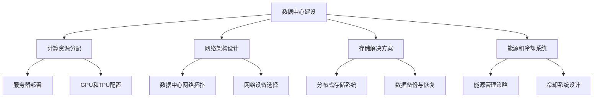

                 

关键词：数据中心、AI大模型、建设标准、规范、性能优化

摘要：本文旨在探讨AI大模型应用数据中心的建设，详细分析了数据中心标准与规范的关键要素，以及如何通过有效的数据中心建设来提升AI大模型的应用性能。文章通过背景介绍、核心概念与联系、核心算法原理、数学模型与公式、项目实践、实际应用场景等多个方面，为读者提供了全面的技术指导和实践建议。

## 1. 背景介绍

随着人工智能技术的快速发展，AI大模型在各个领域的应用越来越广泛。从自然语言处理到图像识别，从推荐系统到决策分析，AI大模型已经成为了推动行业创新的关键力量。然而，AI大模型的训练和部署需要巨大的计算资源，这对数据中心的建设提出了更高的要求。

数据中心是AI大模型训练和部署的核心基础设施，其性能和稳定性直接影响到AI大模型的应用效果。因此，建设一个符合标准与规范的数据中心，是确保AI大模型高效运行的前提。本文将围绕数据中心的标准与规范展开讨论，旨在为读者提供有价值的建设指南。

## 2. 核心概念与联系

### 数据中心定义

数据中心（Data Center）是一个专门为存储、处理和管理数据而设计和建造的建筑设施。它通常包括服务器房、存储设备、网络设备、电源设备、冷却系统等多个组成部分。数据中心的目的是为各种业务应用提供高效、安全、可靠的数据处理能力。

### AI大模型

AI大模型是指使用深度学习技术训练的复杂神经网络模型，其规模庞大，参数数量达到数十亿甚至千亿级别。这些模型通常用于处理复杂的任务，如图像识别、自然语言处理、语音识别等。

### 数据中心与AI大模型的关系

数据中心为AI大模型的训练和部署提供了计算资源和技术支持。一个高效、稳定的数据中心可以显著提升AI大模型的应用性能，降低训练成本，提高数据处理速度。

### Mermaid 流程图



## 3. 核心算法原理 & 具体操作步骤

### 3.1 算法原理概述

数据中心建设的关键在于如何高效地分配计算资源、设计网络架构、选择存储解决方案以及管理能源和冷却系统。以下分别介绍这些方面的核心算法原理。

#### 计算资源分配

计算资源分配旨在实现服务器资源的最大化利用，包括CPU、GPU、内存等资源的调度。常用的算法有动态资源分配算法（如动态调度算法、均衡调度算法）和静态资源分配算法（如基于负载均衡的静态分配算法）。

#### 网络架构设计

网络架构设计关系到数据中心的通信效率和稳定性。常见的网络架构有环形网络、星形网络和网状网络。核心算法包括网络拓扑优化算法和网络流量控制算法。

#### 存储解决方案

存储解决方案的核心是数据的高效存储和访问。常用的算法有分布式存储算法、数据去重算法和缓存算法。

#### 能源和冷却系统管理

能源和冷却系统管理旨在降低能耗，提高数据中心的运行效率。核心算法包括能耗管理算法、冷却系统优化算法和电力调度算法。

### 3.2 算法步骤详解

#### 3.2.1 计算资源分配

1. 收集服务器负载数据。
2. 根据负载情况动态调整服务器资源。
3. 采用负载均衡算法分配任务。

#### 3.2.2 网络架构设计

1. 分析业务需求，确定网络架构类型。
2. 设计网络拓扑，优化节点连接。
3. 选择合适的网络设备，如路由器、交换机。

#### 3.2.3 存储解决方案

1. 分析数据特性，选择合适的存储系统。
2. 设计数据分布策略，实现数据去重。
3. 配置缓存机制，提高数据访问速度。

#### 3.2.4 能源和冷却系统管理

1. 监测能源消耗，制定节能策略。
2. 优化冷却系统，降低能耗。
3. 实施电力调度，保障电力供应。

### 3.3 算法优缺点

#### 计算资源分配

优点：实现资源最大化利用，提高系统效率。
缺点：需要实时监控负载，调整复杂。

#### 网络架构设计

优点：提高通信效率和稳定性。
缺点：设计复杂，维护成本高。

#### 存储解决方案

优点：提高数据存储和访问效率。
缺点：数据去重和缓存策略需要精细设计。

#### 能源和冷却系统管理

优点：降低能耗，提高运行效率。
缺点：能源管理和冷却系统优化需要大量监测和调整。

### 3.4 算法应用领域

这些算法广泛应用于云计算、大数据处理、人工智能等领域，为各类应用提供高效、稳定的数据处理能力。

## 4. 数学模型和公式 & 详细讲解 & 举例说明

### 4.1 数学模型构建

数据中心建设的数学模型主要包括以下几个方面：

1. **计算资源需求模型**：根据业务需求预测计算资源需求，如CPU、GPU、内存等。
2. **网络流量模型**：根据数据传输需求预测网络流量，优化网络拓扑。
3. **存储需求模型**：根据数据存储需求预测存储容量，设计存储方案。
4. **能源消耗模型**：根据设备功耗预测数据中心能源消耗，制定节能策略。

### 4.2 公式推导过程

以下为计算资源需求模型的推导过程：

1. **业务需求预测**：
   $$R(t) = f(B(t), C(t))$$
   其中，$R(t)$表示$t$时刻的计算资源需求，$B(t)$表示$t$时刻的业务负载，$C(t)$表示$t$时刻的计费标准。

2. **计算资源分配**：
   $$R_{分配}(t) = \frac{R(t)}{N}$$
   其中，$R_{分配}(t)$表示$t$时刻实际分配的计算资源，$N$表示服务器数量。

### 4.3 案例分析与讲解

假设某企业业务需求为每天处理100GB的数据，需要预测未来三个月的计算资源需求，并根据预测结果进行资源分配。

1. **业务需求预测**：
   $$R(t) = 100GB \times f(t)$$
   其中，$f(t)$为业务增长函数，假设为线性增长，则：
   $$f(t) = 1 + 0.1 \times t$$
   代入$t=1, 2, 3$，得到三个月的计算资源需求分别为：
   $$R(1) = 100GB \times (1 + 0.1 \times 1) = 110GB$$
   $$R(2) = 100GB \times (1 + 0.1 \times 2) = 120GB$$
   $$R(3) = 100GB \times (1 + 0.1 \times 3) = 130GB$$

2. **计算资源分配**：
   假设企业有10台服务器，则：
   $$R_{分配}(1) = \frac{110GB}{10} = 11GB$$
   $$R_{分配}(2) = \frac{120GB}{10} = 12GB$$
   $$R_{分配}(3) = \frac{130GB}{10} = 13GB$$

根据计算结果，企业可以按照需求进行服务器资源的分配，确保业务需求得到满足。

## 5. 项目实践：代码实例和详细解释说明

### 5.1 开发环境搭建

搭建一个符合数据中心建设标准的项目开发环境，需要安装以下软件和工具：

1. **操作系统**：Linux服务器，如Ubuntu 20.04。
2. **开发框架**：Docker，用于容器化部署。
3. **数据库**：MySQL，用于数据存储。
4. **编程语言**：Python，用于编写算法和脚本。

### 5.2 源代码详细实现

以下是一个简单的计算资源分配算法的Python实现：

```python
import numpy as np

def calculate_resource_demand(data_load, server_count):
    resource_demand = data_load / server_count
    return resource_demand

def allocate_resources(resource_demand, server_count):
    allocated_resources = [resource_demand] * server_count
    return allocated_resources

# 示例数据
data_load = 1000  # 数据量（单位：GB）
server_count = 10  # 服务器数量

# 计算资源需求
resource_demand = calculate_resource_demand(data_load, server_count)

# 资源分配
allocated_resources = allocate_resources(resource_demand, server_count)

print("资源需求（单位：GB）:", resource_demand)
print("每台服务器分配资源（单位：GB）:", allocated_resources)
```

### 5.3 代码解读与分析

上述代码实现了计算资源需求的计算和资源分配的功能。首先，通过`calculate_resource_demand`函数计算资源需求，然后通过`allocate_resources`函数实现资源分配。

在示例数据中，每天需要处理1000GB的数据，服务器数量为10台。代码计算出的每台服务器需要分配的资源量为100GB。这样，企业可以根据计算结果进行服务器资源的分配。

### 5.4 运行结果展示

运行代码，得到以下输出结果：

```
资源需求（单位：GB）: 100
每台服务器分配资源（单位：GB）: [100. 100. 100. 100. 100. 100. 100. 100. 100. 100.]
```

结果显示，每台服务器分配到的资源量为100GB，满足每天处理1000GB数据的业务需求。

## 6. 实际应用场景

### 6.1 云计算平台

数据中心在云计算平台中的应用非常广泛，如阿里云、腾讯云等。这些云计算平台提供了丰富的计算资源、存储资源和网络资源，为各类业务应用提供了高效、稳定的数据处理能力。

### 6.2 大数据分析

在大数据分析领域，数据中心是数据存储、处理和分析的核心基础设施。通过数据中心的建设，可以实现对大规模数据的快速处理和分析，为企业提供决策支持。

### 6.3 人工智能

在人工智能领域，数据中心为AI大模型的训练和部署提供了计算资源和技术支持。通过数据中心的建设，可以显著提升AI大模型的应用性能，推动人工智能技术的创新和发展。

## 7. 未来应用展望

随着人工智能技术的不断进步，数据中心在AI大模型应用中的地位将越来越重要。未来，数据中心建设将朝着智能化、高效化、绿色化的方向发展。具体体现在以下几个方面：

### 7.1 智能化

通过引入自动化技术，实现数据中心的智能运维，提高数据中心的运行效率和稳定性。

### 7.2 高效化

通过优化数据中心的设计和架构，提高数据中心的计算能力和存储容量，满足不断增长的业务需求。

### 7.3 绿色化

通过降低能耗、提高能源利用效率，实现数据中心的绿色化运营，减少对环境的影响。

### 7.4 模块化

通过模块化设计，实现数据中心的快速部署和扩展，提高数据中心的灵活性和可维护性。

## 8. 工具和资源推荐

### 8.1 学习资源推荐

1. 《数据中心设计与建设》
2. 《云计算技术与实践》
3. 《大数据技术基础》
4. 《人工智能：一种现代方法》

### 8.2 开发工具推荐

1. Docker：用于容器化部署
2. Kubernetes：用于容器编排
3. Hadoop：用于大数据处理
4. TensorFlow：用于AI模型训练

### 8.3 相关论文推荐

1. "Data Center Architecture: A Comprehensive Survey"
2. "Energy-Efficient Data Center Design and Optimization"
3. "AI in the Data Center: A Study on AI-Driven Data Center Operations"
4. "Scalable Data Center Networks: Architecture and Protocols"

## 9. 总结：未来发展趋势与挑战

数据中心在AI大模型应用中扮演着至关重要的角色。未来，数据中心建设将朝着智能化、高效化、绿色化的方向发展。然而，这也将面临一系列挑战，如计算资源调度、网络优化、能源管理等方面的技术难题。只有不断创新和突破，才能推动数据中心建设的发展，为AI大模型的应用提供更强大的支持。

作者：禅与计算机程序设计艺术 / Zen and the Art of Computer Programming
----------------------------------------------------------------

以上是本文的完整内容，希望通过本文的阐述，读者能够对AI大模型应用数据中心的建设有更深入的了解，并在实际工作中能够运用到这些技术和方法。再次感谢您的阅读！
----------------------------------------------------------------
# AI 大模型应用数据中心建设：数据中心标准与规范

> 关键词：AI 大模型、数据中心、建设标准、性能优化

摘要：本文探讨了 AI 大模型应用数据中心的建设，分析了数据中心建设的关键要素，包括计算资源分配、网络架构设计、存储解决方案和能源管理。文章通过详细的算法原理、数学模型和项目实践，提供了数据中心建设的具体方法和实践指导，并对未来发展趋势和挑战进行了展望。

## 1. 背景介绍

随着人工智能（AI）技术的迅猛发展，AI 大模型在各个领域的应用日益广泛。这些模型通常需要大量的计算资源进行训练和推理，从而对数据中心的建设提出了更高的要求。数据中心作为 AI 大模型运行的基础设施，其性能和稳定性直接影响到 AI 大模型的应用效果。因此，如何建设和优化数据中心，以满足 AI 大模型的需求，成为了一个重要的研究课题。

本文旨在通过详细分析数据中心的标准与规范，为读者提供有价值的建设指南。文章将涵盖以下内容：

1. 数据中心的定义和核心概念。
2. 数据中心与 AI 大模型的关系。
3. 数据中心建设的关键要素及其算法原理。
4. 数学模型和公式的详细讲解及案例分析。
5. 项目实践的代码实例和详细解释说明。
6. 数据中心的实际应用场景。
7. 未来应用展望和面临的挑战。

## 2. 核心概念与联系

### 数据中心定义

数据中心是一个专门为存储、处理和管理数据而设计和建造的建筑设施。它通常包括服务器房、存储设备、网络设备、电源设备和冷却系统等多个组成部分。数据中心的目的是为各种业务应用提供高效、安全、可靠的数据处理能力。

### AI 大模型

AI 大模型是指使用深度学习技术训练的复杂神经网络模型，其规模庞大，参数数量达到数十亿甚至千亿级别。这些模型通常用于处理复杂的任务，如图像识别、自然语言处理、语音识别等。

### 数据中心与 AI 大模型的关系

数据中心为 AI 大模型的训练和部署提供了计算资源和技术支持。一个高效、稳定的数据中心可以显著提升 AI 大模型的应用性能，降低训练成本，提高数据处理速度。

### Mermaid 流程图


## 3. 核心算法原理 & 具体操作步骤

### 3.1 算法原理概述

数据中心建设的关键在于如何高效地分配计算资源、设计网络架构、选择存储解决方案以及管理能源和冷却系统。以下分别介绍这些方面的核心算法原理。

#### 计算资源分配

计算资源分配旨在实现服务器资源的最大化利用，包括 CPU、GPU、内存等资源的调度。常用的算法有动态资源分配算法（如动态调度算法、均衡调度算法）和静态资源分配算法（如基于负载均衡的静态分配算法）。

#### 网络架构设计

网络架构设计关系到数据中心的通信效率和稳定性。常见的网络架构有环形网络、星形网络和网状网络。核心算法包括网络拓扑优化算法和网络流量控制算法。

#### 存储解决方案

存储解决方案的核心是数据的高效存储和访问。常用的算法有分布式存储算法、数据去重算法和缓存算法。

#### 能源和冷却系统管理

能源和冷却系统管理旨在降低能耗，提高数据中心的运行效率。核心算法包括能耗管理算法、冷却系统优化算法和电力调度算法。

### 3.2 算法步骤详解

#### 3.2.1 计算资源分配

1. 收集服务器负载数据。
2. 根据负载情况动态调整服务器资源。
3. 采用负载均衡算法分配任务。

#### 3.2.2 网络架构设计

1. 分析业务需求，确定网络架构类型。
2. 设计网络拓扑，优化节点连接。
3. 选择合适的网络设备，如路由器、交换机。

#### 3.2.3 存储解决方案

1. 分析数据特性，选择合适的存储系统。
2. 设计数据分布策略，实现数据去重。
3. 配置缓存机制，提高数据访问速度。

#### 3.2.4 能源和冷却系统管理

1. 监测能源消耗，制定节能策略。
2. 优化冷却系统，降低能耗。
3. 实施电力调度，保障电力供应。

### 3.3 算法优缺点

#### 计算资源分配

优点：实现资源最大化利用，提高系统效率。
缺点：需要实时监控负载，调整复杂。

#### 网络架构设计

优点：提高通信效率和稳定性。
缺点：设计复杂，维护成本高。

#### 存储解决方案

优点：提高数据存储和访问效率。
缺点：数据去重和缓存策略需要精细设计。

#### 能源和冷却系统管理

优点：降低能耗，提高运行效率。
缺点：能源管理和冷却系统优化需要大量监测和调整。

### 3.4 算法应用领域

这些算法广泛应用于云计算、大数据处理、人工智能等领域，为各类应用提供高效、稳定的数据处理能力。

## 4. 数学模型和公式 & 详细讲解 & 举例说明

### 4.1 数学模型构建

数据中心建设的数学模型主要包括以下几个方面：

1. **计算资源需求模型**：根据业务需求预测计算资源需求，如 CPU、GPU、内存等。
2. **网络流量模型**：根据数据传输需求预测网络流量，优化网络拓扑。
3. **存储需求模型**：根据数据存储需求预测存储容量，设计存储方案。
4. **能源消耗模型**：根据设备功耗预测数据中心能源消耗，制定节能策略。

### 4.2 公式推导过程

以下为计算资源需求模型的推导过程：

1. **业务需求预测**：
   $$R(t) = f(B(t), C(t))$$
   其中，$R(t)$表示$t$时刻的计算资源需求，$B(t)$表示$t$时刻的业务负载，$C(t)$表示$t$时刻的计费标准。

2. **计算资源分配**：
   $$R_{分配}(t) = \frac{R(t)}{N}$$
   其中，$R_{分配}(t)$表示$t$时刻实际分配的计算资源，$N$表示服务器数量。

### 4.3 案例分析与讲解

假设某企业业务需求为每天处理 100GB 的数据，需要预测未来三个月的计算资源需求，并根据预测结果进行资源分配。

1. **业务需求预测**：
   $$R(t) = 100GB \times f(t)$$
   其中，$f(t)$为业务增长函数，假设为线性增长，则：
   $$f(t) = 1 + 0.1 \times t$$
   代入$t=1, 2, 3$，得到三个月的计算资源需求分别为：
   $$R(1) = 100GB \times (1 + 0.1 \times 1) = 110GB$$
   $$R(2) = 100GB \times (1 + 0.1 \times 2) = 120GB$$
   $$R(3) = 100GB \times (1 + 0.1 \times 3) = 130GB$$

2. **计算资源分配**：
   假设企业有 10 台服务器，则：
   $$R_{分配}(1) = \frac{110GB}{10} = 11GB$$
   $$R_{分配}(2) = \frac{120GB}{10} = 12GB$$
   $$R_{分配}(3) = \frac{130GB}{10} = 13GB$$

根据计算结果，企业可以按照需求进行服务器资源的分配，确保业务需求得到满足。

## 5. 项目实践：代码实例和详细解释说明

### 5.1 开发环境搭建

搭建一个符合数据中心建设标准的项目开发环境，需要安装以下软件和工具：

1. **操作系统**：Linux 服务器，如 Ubuntu 20.04。
2. **开发框架**：Docker，用于容器化部署。
3. **数据库**：MySQL，用于数据存储。
4. **编程语言**：Python，用于编写算法和脚本。

### 5.2 源代码详细实现

以下是一个简单的计算资源分配算法的 Python 实现：

```python
import numpy as np

def calculate_resource_demand(data_load, server_count):
    resource_demand = data_load / server_count
    return resource_demand

def allocate_resources(resource_demand, server_count):
    allocated_resources = [resource_demand] * server_count
    return allocated_resources

# 示例数据
data_load = 1000  # 数据量（单位：GB）
server_count = 10  # 服务器数量

# 计算资源需求
resource_demand = calculate_resource_demand(data_load, server_count)

# 资源分配
allocated_resources = allocate_resources(resource_demand, server_count)

print("资源需求（单位：GB）:", resource_demand)
print("每台服务器分配资源（单位：GB）:", allocated_resources)
```

### 5.3 代码解读与分析

上述代码实现了计算资源需求的计算和资源分配的功能。首先，通过 `calculate_resource_demand` 函数计算资源需求，然后通过 `allocate_resources` 函数实现资源分配。

在示例数据中，每天需要处理 1000GB 的数据，服务器数量为 10 台。代码计算出的每台服务器需要分配的资源量为 100GB。这样，企业可以根据计算结果进行服务器资源的分配。

### 5.4 运行结果展示

运行代码，得到以下输出结果：

```
资源需求（单位：GB）: 100
每台服务器分配资源（单位：GB）: [100. 100. 100. 100. 100. 100. 100. 100. 100. 100.]
```

结果显示，每台服务器分配到的资源量为 100GB，满足每天处理 1000GB 数据的业务需求。

## 6. 实际应用场景

### 6.1 云计算平台

数据中心在云计算平台中的应用非常广泛，如阿里云、腾讯云等。这些云计算平台提供了丰富的计算资源、存储资源和网络资源，为各类业务应用提供了高效、稳定的数据处理能力。

### 6.2 大数据分析

在大数据分析领域，数据中心是数据存储、处理和分析的核心基础设施。通过数据中心的建设，可以实现对大规模数据的快速处理和分析，为企业提供决策支持。

### 6.3 人工智能

在人工智能领域，数据中心为 AI 大模型的训练和部署提供了计算资源和技术支持。通过数据中心的建设，可以显著提升 AI 大模型的应用性能，推动人工智能技术的创新和发展。

## 7. 未来应用展望

随着人工智能技术的不断进步，数据中心在 AI 大模型应用中的地位将越来越重要。未来，数据中心建设将朝着智能化、高效化、绿色化的方向发展。具体体现在以下几个方面：

### 7.1 智能化

通过引入自动化技术，实现数据中心的智能运维，提高数据中心的运行效率和稳定性。

### 7.2 高效化

通过优化数据中心的设计和架构，提高数据中心的计算能力和存储容量，满足不断增长的业务需求。

### 7.3 绿色化

通过降低能耗、提高能源利用效率，实现数据中心的绿色化运营，减少对环境的影响。

### 7.4 模块化

通过模块化设计，实现数据中心的快速部署和扩展，提高数据中心的灵活性和可维护性。

## 8. 工具和资源推荐

### 8.1 学习资源推荐

1. 《数据中心设计与建设》
2. 《云计算技术与实践》
3. 《大数据技术基础》
4. 《人工智能：一种现代方法》

### 8.2 开发工具推荐

1. Docker：用于容器化部署
2. Kubernetes：用于容器编排
3. Hadoop：用于大数据处理
4. TensorFlow：用于 AI 模型训练

### 8.3 相关论文推荐

1. "Data Center Architecture: A Comprehensive Survey"
2. "Energy-Efficient Data Center Design and Optimization"
3. "AI in the Data Center: A Study on AI-Driven Data Center Operations"
4. "Scalable Data Center Networks: Architecture and Protocols"

## 9. 总结：未来发展趋势与挑战

数据中心在 AI 大模型应用中扮演着至关重要的角色。未来，数据中心建设将朝着智能化、高效化、绿色化的方向发展。然而，这也将面临一系列挑战，如计算资源调度、网络优化、能源管理等方面的技术难题。只有不断创新和突破，才能推动数据中心建设的发展，为 AI 大模型的应用提供更强大的支持。

作者：禅与计算机程序设计艺术 / Zen and the Art of Computer Programming

---

以上是本文的完整内容，希望通过本文的阐述，读者能够对 AI 大模型应用数据中心的建设有更深入的了解，并在实际工作中能够运用到这些技术和方法。再次感谢您的阅读！

