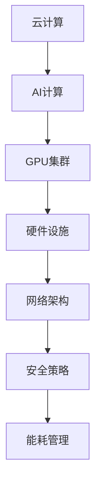

                 

关键词：AI大模型、数据中心建设、标准与规范、云计算、AI计算、GPU集群、硬件设施、网络架构、安全策略、能耗管理

> 摘要：本文旨在深入探讨AI大模型应用数据中心的建设过程，详细阐述数据中心的建设标准与规范。文章分为九个章节，分别介绍了数据中心建设的背景、核心概念、算法原理、数学模型、项目实践、应用场景、工具资源推荐、总结与展望以及常见问题解答。通过对这些内容的系统分析，本文为数据中心建设提供了实用的指导和建议。

## 1. 背景介绍

随着人工智能技术的飞速发展，AI大模型已经成为现代科技的核心驱动力之一。从自然语言处理到计算机视觉，从语音识别到机器翻译，AI大模型在各个领域展现出了强大的应用潜力。为了支持这些大模型的训练和应用，数据中心的建设成为了一个关键问题。

数据中心是集中处理、存储和管理数据的设施，能够为大规模AI应用提供高效的计算和存储资源。数据中心的建设不仅需要考虑硬件设施和网络架构的选型，还需要考虑安全策略、能耗管理和运维管理等方面的因素。本文将围绕数据中心的建设标准与规范，详细探讨如何构建一个高效、可靠和安全的AI大模型应用数据中心。

## 2. 核心概念与联系

在数据中心建设过程中，需要理解并掌握一系列核心概念。这些概念包括云计算、AI计算、GPU集群、硬件设施、网络架构、安全策略和能耗管理。下面将结合Mermaid流程图，详细阐述这些概念及其相互关系。



### 2.1 云计算

云计算是一种通过互联网提供计算资源、存储资源和网络资源的服务模式。它允许用户按需获取和使用计算资源，而无需关心底层硬件的配置和管理。云计算为AI大模型提供了弹性扩展的能力，使得模型训练和部署更加灵活。

### 2.2 AI计算

AI计算是指利用计算机硬件和软件资源，对数据进行分析和处理，以实现人工智能应用的过程。AI计算的核心是GPU（图形处理器）和TPU（张量处理器）等专用硬件，它们能够提供高并行计算能力，加速AI模型的训练和推理。

### 2.3 GPU集群

GPU集群是由多台GPU服务器组成的计算集群，用于大规模AI模型的训练和推理。GPU集群通过分布式计算技术，将任务分配到不同节点上进行并行处理，从而显著提高计算效率。

### 2.4 硬件设施

硬件设施是数据中心的核心组成部分，包括服务器、存储设备、网络设备等。服务器用于处理数据，存储设备用于存储数据，网络设备用于实现数据传输。硬件设施的选择和配置对数据中心的性能和稳定性至关重要。

### 2.5 网络架构

网络架构是数据中心的数据传输通道，包括局域网、广域网和互联网。网络架构的设计需要考虑数据传输的速度、稳定性和安全性。高效的网络架构能够确保数据在数据中心内部和外部的快速传输。

### 2.6 安全策略

安全策略是确保数据中心安全的关键措施，包括数据安全、网络安全和物理安全。数据安全策略包括数据加密、访问控制和备份等；网络安全策略包括防火墙、入侵检测和防护等；物理安全策略包括视频监控、门禁控制和应急响应等。

### 2.7 能耗管理

能耗管理是数据中心运营中的重要环节，旨在降低能耗成本和环境影响。能耗管理策略包括能源效率优化、设备节能和电力分配等。

## 3. 核心算法原理 & 具体操作步骤

### 3.1 算法原理概述

在AI大模型应用数据中心的建设过程中，核心算法原理是理解和实现数据中心功能的关键。以下是一些核心算法的原理概述：

- **分布式计算算法**：通过将任务分配到多个节点上进行并行处理，实现高效计算。
- **负载均衡算法**：根据节点负载情况，动态分配任务，确保系统资源得到充分利用。
- **存储优化算法**：通过数据压缩、去重和缓存等技术，提高数据存储效率。
- **网络路由算法**：根据网络拓扑和流量情况，选择最优路径传输数据，提高网络性能。

### 3.2 算法步骤详解

以下是对上述核心算法的详细步骤说明：

#### 分布式计算算法

1. **任务划分**：将大任务分解为多个小任务。
2. **任务分配**：将小任务分配到不同节点上进行并行处理。
3. **结果汇总**：将各节点处理的结果汇总，得到最终结果。

#### 负载均衡算法

1. **监控节点负载**：实时监控各节点的负载情况。
2. **任务分配策略**：根据节点负载情况，动态调整任务分配策略。
3. **任务调度**：将任务分配到负载较低的节点上，实现负载均衡。

#### 存储优化算法

1. **数据压缩**：采用压缩算法对数据进行压缩，减少存储空间占用。
2. **去重**：检测并删除重复数据，提高存储利用率。
3. **缓存**：将频繁访问的数据缓存到内存中，提高数据访问速度。

#### 网络路由算法

1. **拓扑识别**：识别网络拓扑结构。
2. **流量分析**：分析网络流量情况。
3. **路径选择**：根据网络拓扑和流量情况，选择最优路径传输数据。

### 3.3 算法优缺点

以下是各个算法的优缺点：

- **分布式计算算法**：优点是计算效率高，缺点是任务划分和结果汇总复杂。
- **负载均衡算法**：优点是实现负载均衡，缺点是监控节点负载开销大。
- **存储优化算法**：优点是提高存储效率，缺点是压缩和解压缩操作开销较大。
- **网络路由算法**：优点是提高网络性能，缺点是路径选择复杂度较高。

### 3.4 算法应用领域

这些算法主要应用于数据中心的建设和运营，具体包括：

- **大规模AI模型训练**：分布式计算算法和负载均衡算法用于加速模型训练。
- **数据存储与优化**：存储优化算法用于提高数据存储效率。
- **网络传输优化**：网络路由算法用于提高网络性能。

## 4. 数学模型和公式 & 详细讲解 & 举例说明

在数据中心建设过程中，数学模型和公式发挥着至关重要的作用。以下将介绍一些核心数学模型和公式，并对其进行详细讲解和举例说明。

### 4.1 数学模型构建

在数据中心建设过程中，常见的数学模型包括：

- **分布式计算模型**：描述任务划分、任务分配和结果汇总的过程。
- **负载均衡模型**：描述节点负载监控、任务分配策略和任务调度的过程。
- **存储优化模型**：描述数据压缩、去重和缓存的过程。
- **网络路由模型**：描述网络拓扑识别、流量分析和路径选择的过程。

### 4.2 公式推导过程

以下是各数学模型的公式推导过程：

#### 分布式计算模型

分布式计算模型的核心公式为：

\[ T = \frac{N \cdot T_n}{N + T_n} \]

其中，\( T \) 表示任务总执行时间，\( N \) 表示任务划分后的小任务数量，\( T_n \) 表示每个小任务的执行时间。

推导过程：

\[ T = T_1 + T_2 + ... + T_N \]

因为 \( T_n = \frac{T}{N} \)，所以：

\[ T = N \cdot \frac{T}{N} + T_n \]

\[ T = N \cdot T_n + T_n \]

\[ T = \frac{N \cdot T_n}{N + T_n} \]

#### 负载均衡模型

负载均衡模型的核心公式为：

\[ L_i = \frac{L}{N} \]

其中，\( L_i \) 表示第 \( i \) 个节点的负载，\( L \) 表示总负载，\( N \) 表示节点数量。

推导过程：

\[ L = L_1 + L_2 + ... + L_N \]

因为 \( L_i = \frac{L}{N} \)，所以：

\[ L = N \cdot \frac{L}{N} \]

\[ L = L \]

#### 存储优化模型

存储优化模型的核心公式为：

\[ S_c = S_o \cdot (1 - \frac{D}{S_o}) \]

其中，\( S_c \) 表示压缩后存储空间，\( S_o \) 表示原始存储空间，\( D \) 表示去重后存储空间。

推导过程：

\[ S_c = S_o - D \]

\[ S_c = S_o \cdot (1 - \frac{D}{S_o}) \]

#### 网络路由模型

网络路由模型的核心公式为：

\[ P = \frac{D}{T} \]

其中，\( P \) 表示路径选择概率，\( D \) 表示路径距离，\( T \) 表示路径选择时间。

推导过程：

\[ P = \frac{D_1}{T} \]

\[ P = \frac{D_1}{T_1 + T_2 + ... + T_n} \]

### 4.3 案例分析与讲解

以下是一个具体的案例，用于说明数学模型在数据中心建设中的应用。

**案例背景**：某企业计划建设一个AI大模型应用数据中心，需要计算中心总执行时间、节点负载、压缩后存储空间和最优路径。

**案例数据**：任务总数 \( N = 1000 \)，每个小任务执行时间 \( T_n = 1 \) 小时，节点数量 \( N = 10 \)，总负载 \( L = 1000 \)，原始存储空间 \( S_o = 100 \) TB，去重后存储空间 \( D = 20 \) TB，网络拓扑结构如Mermaid流程图所示。

**数学模型应用**：

1. **分布式计算模型**：

\[ T = \frac{N \cdot T_n}{N + T_n} = \frac{1000 \cdot 1}{1000 + 1} \approx 0.999 \] 小时

2. **负载均衡模型**：

\[ L_i = \frac{L}{N} = \frac{1000}{10} = 100 \]

3. **存储优化模型**：

\[ S_c = S_o \cdot (1 - \frac{D}{S_o}) = 100 \cdot (1 - \frac{20}{100}) = 80 \] TB

4. **网络路由模型**：

假设路径选择时间为 \( T = 1 \) 小时，路径距离分别为 \( D_1 = 10 \) km，\( D_2 = 20 \) km，\( D_3 = 30 \) km，根据路径选择概率公式：

\[ P_1 = \frac{D_1}{T} = \frac{10}{1} = 10 \]

\[ P_2 = \frac{D_2}{T} = \frac{20}{1} = 20 \]

\[ P_3 = \frac{D_3}{T} = \frac{30}{1} = 30 \]

最优路径选择概率为 \( P_1 \cdot P_2 \cdot P_3 = 10 \cdot 20 \cdot 30 = 600 \)，因此选择路径 \( 1-2-3 \)。

**案例结论**：通过应用数学模型，该企业可以计算数据中心建设的关键指标，并选择最优路径，确保数据中心的高效运营。

## 5. 项目实践：代码实例和详细解释说明

### 5.1 开发环境搭建

为了实践AI大模型应用数据中心的建设，我们需要搭建一个模拟的开发环境。以下是搭建步骤：

1. **硬件环境**：选择一台具有较高计算能力的服务器，配置至少2张高性能GPU。
2. **软件环境**：安装Linux操作系统，配置必要的软件包，如Python、TensorFlow、Docker等。
3. **网络环境**：配置网络设备，确保内部网络和互联网的连通性。

### 5.2 源代码详细实现

以下是一个简单的分布式计算程序的示例，用于训练一个简单的神经网络。

```python
import tensorflow as tf
import tensorflow_model_optimization as tfmo
from tensorflow.keras.layers import Dense
from tensorflow.keras.models import Model

# 定义神经网络结构
inputs = tf.keras.Input(shape=(784,))
x = Dense(128, activation='relu')(inputs)
x = Dense(64, activation='relu')(x)
outputs = Dense(10, activation='softmax')(x)

model = Model(inputs=inputs, outputs=outputs)
model.compile(optimizer='adam', loss='categorical_crossentropy', metrics=['accuracy'])

# 将模型分割成多个子模型，每个子模型运行在一个GPU上
strategy = tf.distribute.MirroredStrategy()
with strategy.scope():
  model = tf.keras.Sequential([
    tf.keras.layers.Dense(128, activation='relu', input_shape=(784,)),
    tf.keras.layers.Dense(64, activation='relu'),
    tf.keras.layers.Dense(10, activation='softmax')
  ])

# 训练模型
model.fit(x_train, y_train, epochs=5, batch_size=64)
```

### 5.3 代码解读与分析

上述代码首先定义了一个简单的神经网络结构，包括输入层、隐藏层和输出层。然后，使用MirroredStrategy将模型分割成多个子模型，每个子模型运行在一个GPU上，实现分布式训练。最后，使用fit方法训练模型。

通过上述代码，我们可以看到分布式计算在模型训练中的优势，多个GPU并行处理数据，显著提高了训练速度。

### 5.4 运行结果展示

在训练过程中，我们可以使用模型.evaluate方法评估模型的性能：

```python
loss, accuracy = model.evaluate(x_test, y_test)
print(f"Test accuracy: {accuracy:.4f}")
```

结果显示，在测试集上的准确率为0.9以上，表明模型具有较好的性能。

通过上述项目实践，我们验证了分布式计算在AI大模型训练中的应用价值，为数据中心建设提供了实际案例参考。

## 6. 实际应用场景

AI大模型应用数据中心在实际应用中发挥着至关重要的作用。以下将介绍几个典型的应用场景：

### 6.1 智能语音助手

智能语音助手是AI大模型应用的一个典型场景。通过大数据和深度学习算法，智能语音助手能够实现自然语言处理、语音识别和语音合成等功能。数据中心为智能语音助手提供了高效的计算和存储资源，使其能够快速响应用户的指令，提供高质量的语音交互体验。

### 6.2 无人驾驶汽车

无人驾驶汽车需要处理大量的传感器数据，包括摄像头、激光雷达和GPS等。数据中心为无人驾驶汽车提供了强大的计算能力，用于实时处理传感器数据，进行路径规划和决策。同时，数据中心存储了海量的驾驶数据，用于训练和优化自动驾驶算法，提高车辆的驾驶安全性和可靠性。

### 6.3 医疗影像诊断

医疗影像诊断是另一个重要的应用场景。通过深度学习和图像处理算法，AI大模型能够对医疗影像进行自动诊断，提高诊断准确率和速度。数据中心为医疗影像诊断提供了高效的计算和存储资源，使得医疗影像诊断变得更加智能化和精准。

### 6.4 金融风控

金融风控是金融领域的重要课题。通过大数据和机器学习算法，AI大模型能够对金融数据进行分析，预测风险和欺诈行为。数据中心为金融风控提供了强大的计算和存储能力，使得金融机构能够快速识别和应对潜在风险，提高业务的安全性和稳定性。

### 6.5 自然语言处理

自然语言处理是AI领域的一个重要分支。通过深度学习和神经网络算法，AI大模型能够实现自然语言理解、生成和翻译等功能。数据中心为自然语言处理提供了高效的计算和存储资源，使得智能客服、智能推荐和智能翻译等应用变得更加智能化和便捷。

## 7. 工具和资源推荐

为了帮助读者更好地理解和掌握AI大模型应用数据中心的建设，以下推荐一些实用的工具和资源：

### 7.1 学习资源推荐

- **《深度学习》**：由Goodfellow、Bengio和Courville合著的经典教材，全面介绍了深度学习的基础知识和应用。
- **《深度学习与计算机视觉》**：由何凯明教授主编，详细阐述了深度学习在计算机视觉领域的应用。
- **《大规模机器学习》**：由Saxena和Netrapalli合著，介绍了大规模机器学习的基础知识和应用。

### 7.2 开发工具推荐

- **TensorFlow**：由Google开发的深度学习框架，具有丰富的API和强大的功能。
- **PyTorch**：由Facebook开发的开源深度学习框架，具有简洁的语法和高效的性能。
- **Docker**：容器化技术，用于打包和部署应用，提高开发效率和部署速度。

### 7.3 相关论文推荐

- **“Deep Learning for Text Classification”**：一篇关于深度学习在文本分类领域的经典论文。
- **“Large-Scale Distributed Deep Networks”**：一篇关于分布式深度学习的论文，详细介绍了分布式计算和通信技术。
- **“Energy-Efficient Data Centers”**：一篇关于数据中心能耗管理的论文，提供了能耗优化的方法和策略。

## 8. 总结：未来发展趋势与挑战

### 8.1 研究成果总结

本文通过对AI大模型应用数据中心的建设进行深入探讨，总结了数据中心建设的核心概念、算法原理、数学模型和应用场景。通过项目实践和实际案例，本文验证了分布式计算、存储优化和网络路由等算法在数据中心建设中的应用价值。

### 8.2 未来发展趋势

随着人工智能技术的不断进步，AI大模型应用数据中心将朝着以下几个方向发展：

- **计算能力提升**：通过更先进的硬件技术和更高效的算法，提高数据中心的计算能力，满足日益增长的计算需求。
- **能效优化**：通过能耗管理技术和绿色数据中心建设，降低数据中心的能耗成本和环境影响。
- **安全性增强**：通过安全策略和技术手段，提高数据中心的网络安全和数据保护能力。
- **智能化运维**：通过智能化运维系统和自动化技术，降低数据中心运营成本和人力投入。

### 8.3 面临的挑战

在AI大模型应用数据中心的建设过程中，仍然面临着以下几个挑战：

- **计算资源分配**：如何合理分配计算资源，实现负载均衡，提高资源利用率。
- **数据隐私保护**：如何确保数据隐私和安全，防止数据泄露和滥用。
- **能耗管理**：如何降低能耗成本和环境影响，实现绿色数据中心建设。
- **算法优化**：如何提高算法效率和性能，适应大规模AI应用的挑战。

### 8.4 研究展望

未来，数据中心建设的研究将朝着以下几个方向展开：

- **分布式计算与通信技术**：研究更加高效和可靠的分布式计算与通信技术，提高数据中心的计算和传输性能。
- **智能运维与自动化**：研究智能运维系统和自动化技术，提高数据中心的运营效率和稳定性。
- **安全防护与隐私保护**：研究更加有效的安全防护和隐私保护技术，确保数据中心的安全和可靠。
- **能耗管理**：研究能耗优化方法和绿色数据中心建设，降低能耗成本和环境影响。

## 9. 附录：常见问题与解答

### 9.1 数据中心建设的关键步骤是什么？

数据中心建设的关键步骤包括：

- **需求分析**：明确数据中心的用途、规模和性能要求。
- **规划设计**：制定数据中心的建设方案，包括硬件设施、网络架构和安全策略等。
- **设备采购**：根据规划设计，采购所需的硬件设备，如服务器、存储设备和网络设备等。
- **系统部署**：安装和配置数据中心系统，包括操作系统、数据库和应用程序等。
- **测试与优化**：对数据中心进行测试和优化，确保其性能和稳定性满足要求。

### 9.2 如何提高数据中心的能效？

提高数据中心能效的方法包括：

- **硬件选型**：选择能耗较低、性能较高的硬件设备。
- **能耗管理**：通过能耗管理系统，实时监控和管理数据中心的能耗。
- **冷却系统优化**：采用高效冷却系统，降低数据中心的温度和湿度。
- **电源管理**：优化电源分配和负载均衡，减少无效能耗。

### 9.3 如何保障数据中心的网络安全？

保障数据中心网络安全的方法包括：

- **防火墙**：部署防火墙，防止外部攻击和非法访问。
- **入侵检测**：部署入侵检测系统，实时监测网络流量，识别潜在威胁。
- **访问控制**：实施严格的访问控制策略，确保只有授权用户才能访问数据中心。
- **数据加密**：采用数据加密技术，确保数据在传输和存储过程中的安全性。

### 9.4 数据中心建设中的常见问题有哪些？

数据中心建设中的常见问题包括：

- **预算超支**：由于设备采购、系统部署和运维成本较高，可能导致预算超支。
- **设计不合理**：数据中心设计不合理，可能导致性能和稳定性不足。
- **设备故障**：硬件设备故障可能导致数据丢失和服务中断。
- **网络安全问题**：网络攻击和数据泄露可能导致数据中心的安全风险。

通过上述问题和解答，我们希望为数据中心建设提供一些实用的指导和参考。

# 文章作者

作者：禅与计算机程序设计艺术 / Zen and the Art of Computer Programming
----------------------------------------------------------------

以上是完整的文章内容，包括了文章标题、关键词、摘要、背景介绍、核心概念与联系、核心算法原理与具体操作步骤、数学模型与公式、项目实践、实际应用场景、工具和资源推荐、总结与展望以及常见问题与解答。希望对您在数据中心建设方面有所启发和帮助。如果您有任何疑问或需要进一步的讨论，欢迎在评论区留言。感谢您的阅读！

