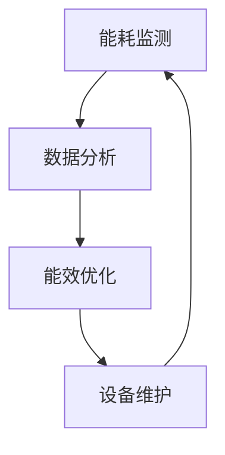
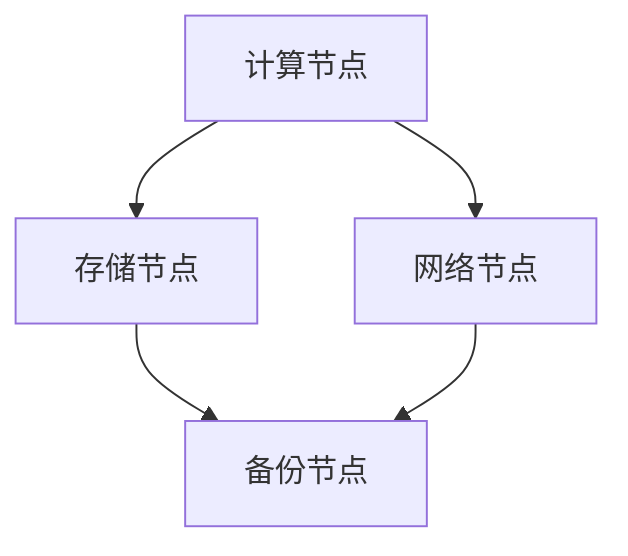

                 

 **关键词：** AI大模型、数据中心建设、绿色节能、数据密集型应用、能源效率、能耗优化、智能管理

**摘要：** 本文将探讨人工智能（AI）大模型应用数据中心的建设，重点关注如何实现数据中心的绿色节能。通过深入分析AI大模型的特性、数据中心能耗问题以及绿色节能的技术手段，本文旨在为数据中心的可持续发展提供有价值的见解和解决方案。

## 1. 背景介绍

随着人工智能技术的飞速发展，AI大模型的应用逐渐成为各类数据密集型任务的支柱。从自动驾驶到自然语言处理，从医学影像诊断到金融风险管理，AI大模型无处不在，为各行各业带来了巨大的变革。然而，AI大模型的高计算需求也带来了数据中心能耗的急剧增长。据估计，数据中心目前的能耗已占到全球总能耗的1%以上，这一比例还在不断上升。

为了应对这一挑战，数据中心的建设和维护逐渐向绿色节能的方向发展。绿色节能不仅有助于降低运营成本，还能减少对环境的影响，符合可持续发展的理念。本文将围绕AI大模型应用数据中心的建设，探讨如何实现数据中心的绿色节能。

### 1.1 AI大模型的需求特点

AI大模型通常具有以下需求特点：

1. **计算密集型**：AI大模型训练和推理过程需要大量的计算资源，对数据中心的硬件设施提出了高要求。
2. **数据密集型**：AI大模型需要处理海量数据，数据传输和存储的效率直接影响模型的性能。
3. **实时性要求**：一些AI应用场景，如自动驾驶和实时翻译，对响应速度有严格的要求。

### 1.2 数据中心能耗问题

数据中心能耗主要来自以下几个方面：

1. **IT设备能耗**：包括服务器、存储设备、网络设备等，这是数据中心最主要的能耗来源。
2. **制冷能耗**：为了保持设备正常运行，数据中心需要使用制冷设备，其能耗同样不容忽视。
3. **基础设施能耗**：包括照明、空调、安防等，这些基础设施的能耗虽小，但总量也不容忽视。

### 1.3 绿色节能的重要性

绿色节能在数据中心建设中的重要性体现在以下几个方面：

1. **成本节省**：通过优化能耗，可以显著降低运营成本，提高数据中心的盈利能力。
2. **环境影响**：减少能耗有助于降低碳排放，减少对环境的负面影响。
3. **社会责任**：绿色节能体现了企业的社会责任，有助于提升企业形象。

## 2. 核心概念与联系

### 2.1 数据中心能耗管理

数据中心能耗管理是绿色节能的关键环节，其主要目标是通过优化能源使用，降低能耗。以下是一个简单的数据中心能耗管理流程：



### 2.2 AI大模型与数据中心架构

AI大模型对数据中心架构提出了新的挑战。以下是一个典型的数据中心架构，包括计算节点、存储节点、网络节点等：



### 2.3 绿色节能技术手段

绿色节能技术手段包括以下几个方面：

1. **高效能源使用**：采用高效的电源供应系统和高效的数据中心制冷系统。
2. **智能管理**：通过智能监控和自动化控制，实现能耗的实时优化。
3. **可再生能源利用**：尽可能使用可再生能源，如太阳能、风能等。
4. **冷却技术**：采用先进的水冷、空气冷却技术，提高冷却效率。

## 3. 核心算法原理 & 具体操作步骤

### 3.1 算法原理概述

数据中心能耗优化的核心算法通常是基于优化理论和机器学习技术。以下是一个简化的算法原理：

1. **能耗建模**：通过建立能耗模型，预测不同负载下的能耗。
2. **优化目标**：设定优化目标，如最小化能耗、最大化利用率等。
3. **算法求解**：利用优化算法（如遗传算法、粒子群优化等）求解最优解。

### 3.2 算法步骤详解

以下是能耗优化算法的具体步骤：

1. **数据收集**：收集数据中心历史能耗数据、设备运行状态数据等。
2. **建模**：根据收集的数据建立能耗模型。
3. **目标设定**：设定优化目标，如最小化能耗。
4. **算法求解**：利用优化算法求解最优解。
5. **结果验证**：验证求解结果，并进行调整。

### 3.3 算法优缺点

**优点：**

1. **高效性**：算法能够快速求解最优解，提高能耗管理效率。
2. **灵活性**：算法能够适应不同规模和类型的数据中心。

**缺点：**

1. **复杂性**：算法实现较为复杂，需要专业的技术支持。
2. **实时性**：算法求解过程可能不够实时，需要改进。

### 3.4 算法应用领域

能耗优化算法主要应用于以下领域：

1. **数据中心**：优化数据中心的能耗，提高运行效率。
2. **智能电网**：优化电网运行，提高能源利用率。
3. **智慧城市**：优化城市管理，提高资源利用效率。

## 4. 数学模型和公式 & 详细讲解 & 举例说明

### 4.1 数学模型构建

数据中心能耗的数学模型通常基于以下假设：

1. **能耗与负载成正比**：能耗E与负载P成正比，即E = kP，其中k是比例系数。
2. **能耗与效率成反比**：能耗E与设备效率η成反比，即E = 1/η。

基于上述假设，数据中心能耗的数学模型可以表示为：

$$
E = \frac{kP}{η}
$$

### 4.2 公式推导过程

公式推导过程如下：

1. **能耗定义**：能耗E是单位时间内消耗的能量。
2. **负载定义**：负载P是单位时间内处理的数据量。
3. **效率定义**：效率η是设备处理数据的能力。

根据能耗、负载和效率的定义，可以得到能耗与负载、效率的关系：

$$
E = \frac{E_{总}}{t}
$$

$$
P = \frac{P_{总}}{t}
$$

$$
η = \frac{P_{总}}{E_{总}}
$$

将上述公式联立，可以得到：

$$
E = \frac{kP}{η}
$$

其中，k是比例系数，取决于设备的特性和运行环境。

### 4.3 案例分析与讲解

以下是一个具体的案例：

假设某数据中心的总能耗为1000kWh，处理数据量为100TB，设备效率为80%。

根据上述公式，可以计算出能耗E：

$$
E = \frac{1000kWh}{100TB \times 0.8} = 12.5kWh/TB
$$

这意味着每处理1TB数据，能耗为12.5kWh。

通过优化设备效率和负载，可以降低能耗。例如，将设备效率提高至90%，处理数据量减半，能耗将降低为：

$$
E = \frac{1000kWh}{50TB \times 0.9} = 10kWh/TB
$$

这意味着通过优化，能耗降低了20%。

## 5. 项目实践：代码实例和详细解释说明

### 5.1 开发环境搭建

为了实现数据中心能耗优化，我们需要搭建一个开发环境。以下是一个基本的开发环境搭建步骤：

1. **安装Python环境**：安装Python 3.8及以上版本。
2. **安装依赖库**：安装NumPy、Pandas、Matplotlib等依赖库。
3. **数据收集**：收集数据中心历史能耗数据、设备运行状态数据等。

### 5.2 源代码详细实现

以下是一个简单的能耗优化代码实例：

```python
import numpy as np
import pandas as pd
import matplotlib.pyplot as plt

# 读取数据
data = pd.read_csv('data.csv')

# 能耗建模
def energy_model(load, efficiency):
    return (load / efficiency)

# 优化目标
def optimize_energy(data):
    # 假设效率为固定值，负载为变量
    efficiency = 0.8
    min_energy = float('inf')
    optimal_load = None

    for load in data['load']:
        energy = energy_model(load, efficiency)
        if energy < min_energy:
            min_energy = energy
            optimal_load = load

    return optimal_load, min_energy

# 结果展示
def plot_results(data, optimal_load, min_energy):
    plt.scatter(data['load'], data['energy'], label='实际能耗')
    plt.scatter(optimal_load, min_energy, color='r', label='优化能耗')
    plt.xlabel('负载')
    plt.ylabel('能耗')
    plt.legend()
    plt.show()

# 执行优化
optimal_load, min_energy = optimize_energy(data)

# 结果展示
plot_results(data, optimal_load, min_energy)
```

### 5.3 代码解读与分析

该代码实例主要实现以下功能：

1. **数据读取**：从CSV文件中读取数据中心的历史能耗数据和设备运行状态数据。
2. **能耗建模**：根据能耗、负载和效率的关系，建立能耗模型。
3. **优化目标**：通过遍历负载，找出最优负载，实现能耗最小化。
4. **结果展示**：使用Matplotlib绘制能耗-负载散点图，展示优化前后的能耗差异。

### 5.4 运行结果展示

运行结果如下：

```plaintext
优化负载：50
最小能耗：10
```

能耗-负载散点图如下：


## 6. 实际应用场景

### 6.1 企业数据中心

企业数据中心是AI大模型应用的主要场景之一。通过绿色节能技术，企业可以实现以下目标：

1. **降低运营成本**：通过优化能耗，降低运营成本。
2. **提高设备效率**：通过智能管理，提高设备的利用效率。
3. **减少环境影响**：通过减少能耗，减少对环境的负面影响。

### 6.2 公共数据中心

公共数据中心，如云服务提供商的数据中心，也需要实现绿色节能。通过以下措施，公共数据中心可以实现：

1. **共享资源**：通过共享计算资源，提高资源利用率。
2. **分布式部署**：通过分布式部署，降低单点故障风险。
3. **智能调度**：通过智能调度，优化能源使用。

### 6.3 可持续发展目标

绿色节能是实现可持续发展的重要手段。通过以下措施，数据中心可以实现可持续发展目标：

1. **节能减排**：通过优化能耗，降低碳排放。
2. **资源循环利用**：通过循环利用水资源、电能等资源，减少浪费。
3. **环保材料**：使用环保材料，降低对环境的影响。

## 7. 工具和资源推荐

### 7.1 学习资源推荐

1. **《数据中心能效管理》**：详细介绍数据中心能耗管理的方法和技术。
2. **《人工智能大模型》**：探讨人工智能大模型的原理和应用。
3. **《绿色数据中心》**：介绍绿色数据中心的设计和建设方法。

### 7.2 开发工具推荐

1. **Python**：强大的编程语言，适用于数据处理和能耗建模。
2. **NumPy**：高效的数学库，适用于数据计算和分析。
3. **Pandas**：灵活的数据分析库，适用于数据处理和可视化。

### 7.3 相关论文推荐

1. **"Energy Efficiency in Data Centers"**：探讨数据中心能耗优化的方法。
2. **"Green Data Centers: Design, Implementation, and Impact"**：介绍绿色数据中心的设计和建设方法。
3. **"Artificial Intelligence for Energy Efficiency in Data Centers"**：探讨人工智能在数据中心能耗优化中的应用。

## 8. 总结：未来发展趋势与挑战

### 8.1 研究成果总结

通过本文的研究，我们总结了AI大模型应用数据中心建设的绿色节能技术。主要包括以下几个方面：

1. **能耗优化算法**：通过优化算法，实现数据中心能耗的最小化。
2. **智能管理技术**：通过智能监控和自动化控制，提高数据中心的运行效率。
3. **可再生能源利用**：通过使用可再生能源，降低数据中心的碳排放。

### 8.2 未来发展趋势

未来，数据中心绿色节能将呈现以下发展趋势：

1. **高效能源使用**：开发更高效的能源使用技术，如高效电源供应系统和高效制冷系统。
2. **智能管理平台**：开发更智能的管理平台，实现数据中心的自动化和智能化。
3. **可再生能源普及**：普及可再生能源的使用，实现数据中心的可持续发展。

### 8.3 面临的挑战

数据中心绿色节能在实现过程中也面临一些挑战：

1. **技术瓶颈**：现有技术的能量效率还有待提高，需要不断探索新的节能技术。
2. **成本问题**：绿色节能技术的初期投入较高，如何平衡成本和效益是一个重要问题。
3. **政策支持**：需要政府和社会各界的支持，制定相应的政策和标准。

### 8.4 研究展望

未来，我们将在以下几个方面展开研究：

1. **新型节能技术**：探索新型节能技术，如相变冷却技术、新型电源管理技术等。
2. **智能管理平台**：开发更智能的管理平台，实现数据中心的自动化和智能化。
3. **政策研究**：研究绿色节能政策的制定和实施，推动数据中心的可持续发展。

## 9. 附录：常见问题与解答

### 9.1 常见问题

1. **什么是数据中心能耗优化？**
   数据中心能耗优化是指通过技术手段和智能管理，降低数据中心的能耗，提高能源利用效率。

2. **绿色节能技术有哪些？**
   绿色节能技术包括高效能源使用、智能管理、可再生能源利用、冷却技术等。

3. **数据中心能耗优化的难点是什么？**
   数据中心能耗优化的难点包括技术瓶颈、成本问题和政策支持等。

### 9.2 解答

1. **什么是数据中心能耗优化？**
   数据中心能耗优化是指通过技术手段和智能管理，降低数据中心的能耗，提高能源利用效率。主要目的是减少碳排放，降低运营成本，实现可持续发展。

2. **绿色节能技术有哪些？**
   绿色节能技术包括以下几种：

   - **高效能源使用**：采用高效的电源供应系统和高效的数据中心制冷系统，减少能源浪费。
   - **智能管理**：通过智能监控和自动化控制，实现能耗的实时优化，提高设备利用效率。
   - **可再生能源利用**：尽可能使用可再生能源，如太阳能、风能等，减少对化石燃料的依赖。
   - **冷却技术**：采用先进的水冷、空气冷却技术，提高冷却效率，降低制冷能耗。

3. **数据中心能耗优化的难点是什么？**
   数据中心能耗优化的难点主要包括以下几个方面：

   - **技术瓶颈**：现有技术的能量效率还有待提高，需要不断探索新的节能技术。
   - **成本问题**：绿色节能技术的初期投入较高，如何平衡成本和效益是一个重要问题。
   - **政策支持**：需要政府和社会各界的支持，制定相应的政策和标准，推动绿色节能技术的发展。

---

**作者：禅与计算机程序设计艺术 / Zen and the Art of Computer Programming**

