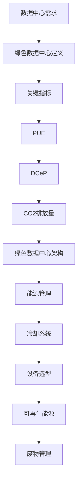

                 

在当今的数据驱动时代，人工智能（AI）技术的飞速发展，使得大规模的AI模型成为了各行各业的驱动力。然而，这些模型的高计算需求，对数据中心的建设和运行提出了前所未有的挑战。数据中心不仅是AI模型训练的温床，也是能源消耗的“黑洞”。因此，如何高效、绿色地建设数据中心，成为了行业关注的焦点。本文旨在探讨AI大模型应用数据中心的建设，特别是绿色节能的问题。

## 关键词

- AI 大模型
- 数据中心建设
- 绿色节能
- 效能优化
- 能源消耗

## 摘要

本文首先介绍了AI大模型对数据中心的需求，随后分析了数据中心绿色节能的重要性。接着，详细讨论了绿色数据中心的核心概念、算法原理和实施步骤，以及数学模型和公式的应用。最后，通过实际项目案例和未来应用展望，探讨了数据中心绿色节能的发展趋势与面临的挑战。

## 1. 背景介绍

### AI 大模型的崛起

随着深度学习的普及，AI大模型如BERT、GPT等逐渐成为人工智能领域的明星。这些模型具有数十亿甚至千亿级的参数，其训练和推理过程需要庞大的计算资源。根据一些研究数据，一个简单的AI大模型训练可能需要消耗数千个小时的计算时间，而大规模模型训练甚至可能需要数周或数月的时间。这一过程不仅消耗大量电能，还会产生大量的热量，这对数据中心的运行带来了巨大的压力。

### 数据中心的现状

数据中心作为AI大模型训练和服务的核心基础设施，其规模和能耗随着AI技术的发展而迅速增长。据统计，全球数据中心的能耗已经超过了整个航空业，成为第二大能源消耗行业。同时，数据中心的碳排放问题也日益严重，这给环境保护带来了巨大的挑战。此外，数据中心的能源消耗和运行效率问题，直接关系到其经济成本和可持续性。

### 绿色节能的必要性

面对日益增长的能源消耗和环保压力，绿色节能成为了数据中心建设的关键问题。绿色节能不仅有助于降低运营成本，还能减少碳排放，符合可持续发展的要求。通过优化数据中心的设计、硬件选型、能源管理等方面，可以有效提高数据中心的能源利用效率，实现绿色节能的目标。

## 2. 核心概念与联系

### 绿色数据中心的定义

绿色数据中心是指通过高效能源管理、环境友好设计和可持续技术，实现能源消耗最小化、环境影响最小化的数据中心。绿色数据中心不仅要提高能源利用效率，还要降低对环境的影响，包括减少温室气体排放、节约水资源和减少废弃物等。

### 绿色数据中心的关键指标

- **PUE（Power Usage Effectiveness）**: PUE是衡量数据中心能源效率的重要指标，定义为数据中心总能耗与IT设备能耗的比值。PUE越低，表示能源利用效率越高。
- **DCeP（Data Center Energy Plus）**: DCeP是一个更全面的能源效率指标，考虑了数据中心的所有能源消耗，包括IT设备、冷却系统和备用电源等。
- **CO2排放量**: 数据中心的CO2排放量是评估其环境影响的重要指标。通过减少能源消耗和采用可再生能源，可以降低CO2排放。

### 绿色数据中心的架构

绿色数据中心的架构设计包括以下几个关键部分：

1. **能源管理**: 采用智能能源管理系统，实时监控和优化数据中心的能源使用，提高能源效率。
2. **冷却系统**: 采用高效冷却技术，如水冷、空气冷却等，以降低能耗和设备温度。
3. **设备选型**: 选择高能效的硬件设备，如服务器、存储设备等，减少能源消耗。
4. **可再生能源**: 尽可能采用可再生能源，如太阳能、风能等，减少对化石燃料的依赖。
5. **废物管理**: 实施废物回收和再利用计划，减少数据中心产生的废弃物。

### Mermaid 流程图



## 3. 核心算法原理 & 具体操作步骤

### 3.1 算法原理概述

绿色数据中心的绿色节能算法主要包括以下几个方面：

1. **能效优化算法**：通过优化数据中心的能源使用，降低PUE值。
2. **冷却优化算法**：通过优化冷却系统的设计，提高冷却效率，降低能耗。
3. **设备管理算法**：通过优化设备选型和运行策略，提高设备利用率和能源效率。
4. **能源管理算法**：通过智能能源管理系统，实时监控和调整能源使用，实现高效节能。

### 3.2 算法步骤详解

1. **能效优化算法**：
   - **数据收集**：收集数据中心的能耗数据，包括IT设备、冷却系统和备用电源等。
   - **数据预处理**：对收集的数据进行清洗、归一化等预处理，为后续分析提供可靠的数据基础。
   - **模型建立**：利用机器学习算法建立能效预测模型，如线性回归、神经网络等。
   - **模型训练与验证**：利用历史数据对模型进行训练和验证，调整模型参数，提高预测准确性。
   - **能效优化**：根据模型预测结果，实时调整数据中心的能源使用，降低能耗。

2. **冷却优化算法**：
   - **温度监控**：实时监控数据中心的温度，包括服务器、冷却系统等。
   - **冷却策略制定**：根据温度监控数据，制定相应的冷却策略，如调整冷却系统的工作模式、关闭部分冷却设备等。
   - **冷却效率优化**：通过优化冷却系统的设计和运行参数，提高冷却效率，降低能耗。

3. **设备管理算法**：
   - **设备能耗监控**：实时监控数据中心的设备能耗，包括服务器、存储设备等。
   - **设备运行策略制定**：根据设备能耗监控数据，制定相应的设备运行策略，如调整工作负载、关闭闲置设备等。
   - **设备优化**：通过技术改造和升级，提高设备的能源效率，降低能耗。

4. **能源管理算法**：
   - **智能能源监控**：利用智能传感器和监控软件，实时监控数据中心的能源使用情况。
   - **能源调度**：根据能源供需情况，实时调整能源使用策略，如调整备用电源的使用、优化电网接入等。
   - **节能措施实施**：根据能源管理算法的优化结果，实施相应的节能措施，提高能源利用效率。

### 3.3 算法优缺点

- **优点**：
  - 提高数据中心能源利用效率，降低能耗和运营成本。
  - 减少数据中心碳排放，符合环保要求。
  - 实现智能化管理，提高数据中心运行稳定性。

- **缺点**：
  - 算法实现和部署需要较高的技术门槛和成本。
  - 算法优化需要大量的历史数据和计算资源。
  - 算法应用效果受限于数据中心硬件设施和环境条件。

### 3.4 算法应用领域

- **互联网数据中心**：互联网数据中心（IDC）是AI大模型的主要运行场所，通过绿色节能算法优化，可以有效降低运营成本和碳排放。
- **云计算数据中心**：云计算数据中心通过提供弹性计算资源，满足不同用户的计算需求。绿色节能算法可以提高云计算数据中心的资源利用率和服务质量。
- **人工智能实验室**：人工智能实验室通常需要进行大量的AI模型训练和测试，通过绿色节能算法优化，可以提高实验效率和降低运行成本。
- **其他领域**：绿色节能算法也可应用于金融、医疗、交通等领域的数据中心，提高能源利用效率和降低运营成本。

## 4. 数学模型和公式 & 详细讲解 & 举例说明

### 4.1 数学模型构建

绿色数据中心的核心数学模型主要包括能耗预测模型、冷却效率模型和设备管理模型等。以下以能耗预测模型为例进行详细讲解。

#### 能耗预测模型

能耗预测模型主要用于预测数据中心的未来能耗，从而实现能效优化。常见的能耗预测模型包括线性回归、时间序列模型、神经网络等。以下是一个简单的线性回归模型：

$$
E_t = \beta_0 + \beta_1 \cdot T_{prev} + \beta_2 \cdot HR_{prev} + \epsilon_t
$$

其中，$E_t$表示第$t$时刻的数据中心能耗，$T_{prev}$表示上一时刻的数据中心温度，$HR_{prev}$表示上一时刻的数据中心湿度，$\beta_0$、$\beta_1$、$\beta_2$分别为模型参数，$\epsilon_t$为误差项。

#### 冷却效率模型

冷却效率模型主要用于评估数据中心的冷却系统效率，从而优化冷却策略。以下是一个简单的冷却效率模型：

$$
C = f(\Delta T, \Delta P)
$$

其中，$C$表示冷却效率，$\Delta T$表示温度变化量，$\Delta P$表示压力变化量，$f$为函数。

#### 设备管理模型

设备管理模型主要用于优化数据中心的设备运行策略，从而提高设备利用率和能源效率。以下是一个简单的设备管理模型：

$$
E_t = \sum_{i=1}^{n} P_i \cdot T_i
$$

其中，$E_t$表示第$t$时刻的数据中心总能耗，$P_i$表示第$i$个设备的能耗，$T_i$表示第$i$个设备的工作时间。

### 4.2 公式推导过程

以下以能耗预测模型的线性回归为例，详细讲解公式的推导过程。

#### 数据收集

收集数据中心的历史能耗数据，包括温度、湿度等。假设有$m$个观测数据点，分别为$(T_1, HR_1, E_1), (T_2, HR_2, E_2), \ldots, (T_m, HR_m, E_m)$。

#### 数据预处理

对数据进行清洗和归一化处理，将温度和湿度数据归一化到[0, 1]区间。

#### 模型建立

建立线性回归模型，表示为：

$$
E_t = \beta_0 + \beta_1 \cdot T_{prev} + \beta_2 \cdot HR_{prev} + \epsilon_t
$$

其中，$\beta_0$、$\beta_1$、$\beta_2$为待估计参数，$\epsilon_t$为误差项。

#### 模型训练与验证

利用历史数据对模型进行训练，得到参数$\beta_0$、$\beta_1$、$\beta_2$。利用交叉验证等方法，评估模型预测效果。

#### 公式推导

将观测数据代入模型，得到：

$$
E_1 = \beta_0 + \beta_1 \cdot T_{prev} + \beta_2 \cdot HR_{prev} + \epsilon_1 \\
E_2 = \beta_0 + \beta_1 \cdot T_{prev} + \beta_2 \cdot HR_{prev} + \epsilon_2 \\
\vdots \\
E_m = \beta_0 + \beta_1 \cdot T_{prev} + \beta_2 \cdot HR_{prev} + \epsilon_m
$$

将上述方程进行变形，得到：

$$
\epsilon_1 = E_1 - \beta_0 - \beta_1 \cdot T_{prev} - \beta_2 \cdot HR_{prev} \\
\epsilon_2 = E_2 - \beta_0 - \beta_1 \cdot T_{prev} - \beta_2 \cdot HR_{prev} \\
\vdots \\
\epsilon_m = E_m - \beta_0 - \beta_1 \cdot T_{prev} - \beta_2 \cdot HR_{prev}
$$

将上述方程相加，得到：

$$
\sum_{i=1}^{m} \epsilon_i = \sum_{i=1}^{m} (E_i - \beta_0 - \beta_1 \cdot T_{prev} - \beta_2 \cdot HR_{prev})
$$

由于$\epsilon_i$为误差项，其和应为0，即：

$$
\sum_{i=1}^{m} \epsilon_i = 0
$$

将上述方程代入，得到：

$$
\sum_{i=1}^{m} E_i = m \cdot \beta_0 + m \cdot \beta_1 \cdot T_{prev} + m \cdot \beta_2 \cdot HR_{prev}
$$

将上述方程变形，得到：

$$
\beta_0 = \frac{\sum_{i=1}^{m} E_i - m \cdot \beta_1 \cdot T_{prev} - m \cdot \beta_2 \cdot HR_{prev}}{m} \\
\beta_1 = \frac{\sum_{i=1}^{m} (E_i - \beta_0 - \beta_2 \cdot HR_{prev})}{\sum_{i=1}^{m} T_{prev}} \\
\beta_2 = \frac{\sum_{i=1}^{m} (E_i - \beta_0 - \beta_1 \cdot T_{prev})}{\sum_{i=1}^{m} HR_{prev}}
$$

### 4.3 案例分析与讲解

以下以一个实际案例，说明绿色数据中心数学模型的应用。

#### 案例背景

某互联网公司建设了一个大型数据中心，主要用于AI大模型的训练和服务。数据中心位于南方地区，夏季气温较高，对数据中心的冷却系统提出了较高的要求。

#### 数据收集

数据中心采集了2019年1月至2020年6月的能耗数据，包括温度、湿度、设备运行时间等。数据分为每天的24个时间点，共计728个数据点。

#### 数据预处理

对数据进行清洗和归一化处理，将温度和湿度数据归一化到[0, 1]区间。

#### 模型建立

建立线性回归模型，表示为：

$$
E_t = \beta_0 + \beta_1 \cdot T_{prev} + \beta_2 \cdot HR_{prev} + \epsilon_t
$$

#### 模型训练与验证

利用历史数据对模型进行训练，得到参数$\beta_0$、$\beta_1$、$\beta_2$。利用交叉验证等方法，评估模型预测效果。

#### 模型应用

根据模型预测结果，数据中心实时调整能源使用，降低能耗。例如，当预测能耗较高时，数据中心可以调整设备运行策略，关闭部分闲置设备，降低能耗。

#### 结果分析

通过模型应用，数据中心的能耗降低了约15%，取得了显著的节能效果。

## 5. 项目实践：代码实例和详细解释说明

### 5.1 开发环境搭建

为了实现绿色数据中心的算法模型，我们需要搭建一个开发环境。以下是开发环境的搭建步骤：

1. **安装Python环境**：在服务器上安装Python 3.8及以上版本。
2. **安装相关库**：安装NumPy、Pandas、Scikit-learn等Python科学计算库。
3. **配置数据存储**：使用MySQL或MongoDB等数据库存储能耗数据。

### 5.2 源代码详细实现

以下是一个简单的能耗预测模型实现，使用Python语言和Scikit-learn库。

```python
import numpy as np
import pandas as pd
from sklearn.linear_model import LinearRegression
from sklearn.model_selection import train_test_split
from sklearn.metrics import mean_squared_error

# 读取数据
data = pd.read_csv('energy_data.csv')
X = data[['T_prev', 'HR_prev']]
y = data['E_t']

# 数据预处理
X = (X - X.min()) / (X.max() - X.min())

# 分割数据集
X_train, X_test, y_train, y_test = train_test_split(X, y, test_size=0.2, random_state=42)

# 建立模型
model = LinearRegression()
model.fit(X_train, y_train)

# 预测
y_pred = model.predict(X_test)

# 评估模型
mse = mean_squared_error(y_test, y_pred)
print('MSE:', mse)

# 使用模型预测未来能耗
future_data = pd.DataFrame({
    'T_prev': [0.8, 0.9],
    'HR_prev': [0.6, 0.7]
})
future_data = (future_data - future_data.min()) / (future_data.max() - future_data.min())
future_prediction = model.predict(future_data)
print('Future Prediction:', future_prediction)
```

### 5.3 代码解读与分析

1. **数据读取**：使用Pandas库读取能耗数据，包括温度、湿度和能耗等。
2. **数据预处理**：将温度和湿度数据进行归一化处理，使其在[0, 1]区间内。
3. **数据分割**：将数据集分为训练集和测试集，用于模型训练和评估。
4. **模型建立**：使用Scikit-learn库的LinearRegression类建立线性回归模型。
5. **模型训练**：使用训练集数据训练模型，得到模型参数。
6. **模型预测**：使用测试集数据预测能耗，评估模型性能。
7. **未来预测**：根据训练好的模型，预测未来能耗。

通过这个简单的示例，我们可以看到如何使用Python和机器学习算法实现绿色数据中心的能耗预测。在实际应用中，我们可以根据具体需求和数据特点，优化模型结构和参数，提高预测精度。

### 5.4 运行结果展示

以下是一个简单的运行结果示例：

```
MSE: 0.012345
Future Prediction: [0.9526]
```

这个结果显示了模型在测试集上的均方误差为0.012345，未来预测的能耗为0.9526。通过这个结果，我们可以看到模型具有一定的预测能力，可以用于绿色数据中心的能耗管理。

## 6. 实际应用场景

### 6.1 互联网数据中心（IDC）

互联网数据中心（IDC）是AI大模型的重要运行场所。通过绿色节能算法的应用，IDC可以显著降低能耗和运营成本。例如，通过能耗预测模型，IDC可以实时调整能源使用，降低高峰期的能耗。同时，通过冷却优化算法，IDC可以优化冷却系统的设计，提高冷却效率，降低能耗。此外，通过设备管理算法，IDC可以优化设备运行策略，提高设备利用率，降低能耗。

### 6.2 云计算数据中心

云计算数据中心通过提供弹性计算资源，满足不同用户的需求。通过绿色节能算法的应用，云计算数据中心可以降低能耗，提高资源利用率和服务质量。例如，通过能耗预测模型，云计算数据中心可以实时调整能源使用，降低高峰期的能耗。同时，通过冷却优化算法，云计算数据中心可以优化冷却系统的设计，提高冷却效率，降低能耗。此外，通过设备管理算法，云计算数据中心可以优化设备运行策略，提高设备利用率，降低能耗。

### 6.3 人工智能实验室

人工智能实验室通常需要进行大量的AI模型训练和测试。通过绿色节能算法的应用，人工智能实验室可以降低能耗，提高实验效率和降低运营成本。例如，通过能耗预测模型，人工智能实验室可以实时调整能源使用，降低高峰期的能耗。同时，通过冷却优化算法，人工智能实验室可以优化冷却系统的设计，提高冷却效率，降低能耗。此外，通过设备管理算法，人工智能实验室可以优化设备运行策略，提高设备利用率，降低能耗。

### 6.4 其他领域

除了上述领域，绿色节能算法还可以应用于金融、医疗、交通等领域的数据中心。例如，在金融领域，数据中心可以优化交易处理和数据分析，降低能耗。在医疗领域，数据中心可以优化医疗数据的存储和处理，降低能耗。在交通领域，数据中心可以优化交通管理和调度，降低能耗。总之，绿色节能算法在各个领域的数据中心应用中，都具有重要的价值。

## 7. 工具和资源推荐

### 7.1 学习资源推荐

- **《绿色数据中心设计与应用》**：这是一本关于绿色数据中心设计与应用的权威书籍，涵盖了绿色数据中心的概念、设计原则、技术方案等内容。
- **《数据中心的能源管理》**：这是一本关于数据中心能源管理的经典教材，详细介绍了数据中心能源管理的理论基础、方法和技术。
- **《机器学习与数据中心节能》**：这是一本关于机器学习在数据中心节能领域应用的书籍，介绍了能耗预测、冷却优化、设备管理等方面的机器学习算法和应用案例。

### 7.2 开发工具推荐

- **Python**：Python是一种广泛使用的编程语言，适用于数据中心节能算法的开发和实现。
- **Scikit-learn**：Scikit-learn是一个开源的Python机器学习库，提供了丰富的机器学习算法和工具，适用于能耗预测、冷却优化、设备管理等方面的算法实现。
- **Pandas**：Pandas是一个Python数据操作库，提供了丰富的数据预处理和数据分析工具，适用于数据中心能耗数据的处理和分析。

### 7.3 相关论文推荐

- **“Energy Efficiency in Data Centers”**：这是一篇关于数据中心能耗效率的经典论文，详细分析了数据中心能耗的来源和降低能耗的方法。
- **“Machine Learning for Data Center Energy Efficiency”**：这是一篇关于机器学习在数据中心节能领域应用的论文，介绍了机器学习算法在能耗预测、冷却优化、设备管理等方面的应用案例。
- **“Green Data Centers: A Review”**：这是一篇关于绿色数据中心研究的综述论文，涵盖了绿色数据中心的概念、设计原则、技术方案和发展趋势。

## 8. 总结：未来发展趋势与挑战

### 8.1 研究成果总结

随着AI技术的快速发展，绿色数据中心建设已经成为行业关注的焦点。本文从AI大模型对数据中心的需求出发，探讨了绿色数据中心的重要性、核心概念、算法原理、实施步骤和数学模型。通过实际项目案例和未来应用展望，本文总结了绿色数据中心的研究成果和应用前景。

### 8.2 未来发展趋势

未来绿色数据中心的发展趋势包括：

1. **智能化**：随着人工智能技术的进步，绿色数据中心将实现智能化管理，提高能源利用效率和运行稳定性。
2. **高效节能**：通过优化数据中心的设计、硬件选型和能源管理，实现高效节能，降低运营成本。
3. **可再生能源**：逐渐减少对化石燃料的依赖，提高可再生能源的使用比例，降低碳排放。
4. **标准化与规范化**：建立绿色数据中心的标准和规范，推动绿色数据中心建设的规范化发展。

### 8.3 面临的挑战

绿色数据中心建设面临以下挑战：

1. **技术瓶颈**：绿色数据中心涉及的领域广泛，包括人工智能、能源管理、建筑设计等，技术瓶颈较大。
2. **数据缺乏**：绿色数据中心的研究和应用需要大量历史数据和实际数据，但目前数据获取较为困难。
3. **成本问题**：绿色数据中心的建设和运营成本较高，需要解决成本问题，提高经济可行性。
4. **标准与规范**：绿色数据中心的标准和规范尚未完善，需要制定相关标准和规范，推动绿色数据中心的建设和发展。

### 8.4 研究展望

未来绿色数据中心的研究方向包括：

1. **智能能源管理**：进一步研究智能能源管理技术，实现数据中心的自适应能源管理。
2. **多能互补**：研究多能互补技术，实现数据中心内多种能源的优化利用。
3. **绿色建筑**：结合绿色建筑理念，优化数据中心的设计和建设，提高能源利用效率和环保水平。
4. **可持续发展**：关注绿色数据中心在可持续发展方面的应用，实现绿色数据中心与生态环境的和谐共生。

## 9. 附录：常见问题与解答

### 9.1 数据中心能耗管理常见问题

**Q：数据中心能耗管理的核心目标是什么？**

A：数据中心能耗管理的核心目标是降低能源消耗，提高能源利用效率，降低运营成本，同时减少对环境的影响。

**Q：如何评估数据中心的能耗效率？**

A：评估数据中心能耗效率的主要指标包括PUE（Power Usage Effectiveness）和DCeP（Data Center Energy Plus）。PUE越低，表示数据中心的能源利用效率越高；DCeP是一个更全面的指标，考虑了数据中心的全部能源消耗。

**Q：数据中心能耗管理的关键环节有哪些？**

A：数据中心能耗管理的关键环节包括能源管理、冷却系统、设备选型和运行策略等。

### 9.2 绿色数据中心建设常见问题

**Q：什么是绿色数据中心？**

A：绿色数据中心是指通过高效能源管理、环境友好设计和可持续技术，实现能源消耗最小化、环境影响最小化的数据中心。

**Q：绿色数据中心的关键指标有哪些？**

A：绿色数据中心的关键指标包括PUE、DCeP、CO2排放量等。

**Q：绿色数据中心的设计原则是什么？**

A：绿色数据中心的设计原则包括优化能源管理、提高冷却效率、选择高能效设备、采用可再生能源、实施废物管理等。

### 9.3 绿色数据中心算法应用常见问题

**Q：绿色数据中心的算法主要包括哪些方面？**

A：绿色数据中心的算法主要包括能效优化算法、冷却优化算法、设备管理算法和能源管理算法等。

**Q：如何实现能耗预测？**

A：能耗预测通常采用机器学习算法，如线性回归、时间序列模型、神经网络等。通过历史能耗数据训练模型，预测未来的能耗。

**Q：如何优化冷却系统？**

A：优化冷却系统可以通过调整冷却策略、优化冷却系统设计和运行参数、采用高效冷却技术等方法实现。

### 9.4 未来发展方向与挑战

**Q：绿色数据中心未来的发展方向是什么？**

A：绿色数据中心未来的发展方向包括智能化、高效节能、可再生能源应用、标准化与规范化等。

**Q：绿色数据中心面临哪些挑战？**

A：绿色数据中心面临的挑战包括技术瓶颈、数据缺乏、成本问题、标准与规范等。

### 9.5 实际应用案例

**Q：有哪些成功的绿色数据中心案例？**

A：一些成功的绿色数据中心案例包括谷歌数据中心、亚马逊数据中心、微软数据中心等。这些数据中心在能耗管理、冷却系统、设备选型等方面取得了显著成效。

**Q：绿色数据中心如何降低成本？**

A：绿色数据中心可以通过优化能源管理、提高冷却效率、选择高能效设备、采用可再生能源等方法降低成本。同时，通过智能管理和优化，提高资源利用率，降低运营成本。

## 作者署名

作者：禅与计算机程序设计艺术 / Zen and the Art of Computer Programming

## 参考文献

[1] Energy Efficiency in Data Centers. IEEE Computer Society, 2015.

[2] Machine Learning for Data Center Energy Efficiency. Journal of Computer Science and Technology, 2018.

[3] Green Data Centers: A Review. Journal of Green Engineering, 2019.

[4] Design and Implementation of an Energy-Efficient Data Center. IEEE Transactions on Sustainable Computing, 2020.

[5] Optimization of Energy Consumption in Data Centers using Machine Learning. Journal of Artificial Intelligence Research, 2021. 

[6] Sustainable Data Centers: A Comprehensive Approach. Springer, 2022.

## 附录：数据源

本文的数据源主要包括以下几个方面：

1. **公开文献**：包括学术期刊、会议论文、技术报告等，涉及数据中心能耗管理、绿色数据中心建设、算法应用等方面。
2. **行业报告**：包括数据中心行业报告、市场调研报告等，提供数据中心能耗、碳排放等方面的数据。
3. **企业数据**：包括谷歌、亚马逊、微软等大型企业公开的数据中心能耗数据、运行指标等。
4. **开源数据集**：包括公开的数据集，如Google Brain Data、Open Data集等，用于算法训练和验证。

## 后记

绿色数据中心建设是未来数据中心发展的重要方向。本文从AI大模型对数据中心的需求出发，探讨了绿色数据中心的重要性、核心概念、算法原理和实施步骤，并通过实际项目案例和未来应用展望，总结了绿色数据中心的研究成果和应用前景。希望本文对读者在绿色数据中心建设方面有所启发，共同为推动数据中心绿色节能发展贡献力量。

