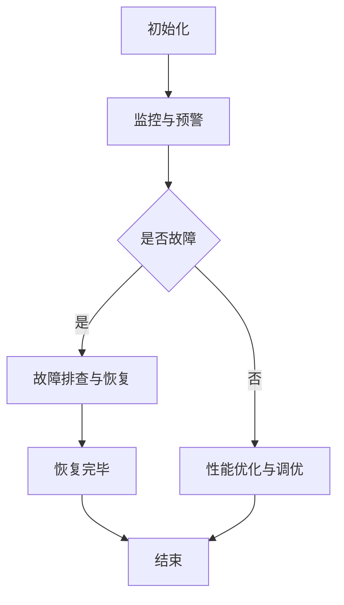

                 

关键词：AI大模型、数据中心、运维管理、技术架构、优化策略

摘要：本文将探讨AI大模型应用数据中心的建设过程，重点分析数据中心运维与管理的关键技术，以及如何通过优化策略提升数据中心性能和可靠性。文章旨在为IT专业人士和相关从业者提供有价值的参考和指导。

## 1. 背景介绍

随着人工智能技术的快速发展，AI大模型在各个领域的应用日益广泛。从自然语言处理到计算机视觉，再到推荐系统和智能决策，AI大模型正逐步改变我们的生活和工作方式。然而，AI大模型的应用也对数据中心提出了更高的要求。数据中心作为AI大模型运行的物理载体，其稳定性和高效性直接影响到模型的训练和部署效果。

数据中心的建设和维护涉及多个方面，包括硬件选型、网络架构、能源管理、安全保障等。在AI大模型应用背景下，数据中心还需关注数据存储、计算资源和调度策略等方面。本文将围绕数据中心运维与管理，探讨AI大模型应用数据中心建设的关键技术和优化策略。

## 2. 核心概念与联系

### 2.1 数据中心

数据中心（Data Center）是一种设施，用于集中存储、处理和管理大量数据。数据中心通常包括服务器、存储设备、网络设备、电源设备、冷却设备等硬件设施，以及相关的软件和管理系统。

### 2.2 AI大模型

AI大模型（AI Large Model）是指参数规模庞大的深度学习模型，如GPT、BERT等。这些模型具有强大的数据处理和生成能力，可以应用于自然语言处理、计算机视觉、语音识别等多个领域。

### 2.3 数据中心运维

数据中心运维（Data Center Operations）是指对数据中心硬件设施、软件系统、网络环境等进行的日常维护和管理。运维工作包括监控、故障排查、性能优化、安全性保障等。

### 2.4 数据中心管理

数据中心管理（Data Center Management）是指通过战略规划、资源配置、流程优化等手段，确保数据中心高效、稳定、安全地运行。管理内容包括成本控制、资源配置、安全管理等。

### 2.5 Mermaid 流程图

以下是一个关于数据中心运维流程的Mermaid流程图：



## 3. 核心算法原理 & 具体操作步骤

### 3.1 算法原理概述

数据中心运维的核心算法主要涉及监控算法、故障检测算法、性能优化算法等。这些算法基于大数据和机器学习技术，通过分析数据中心的运行状态，实现对硬件设施、软件系统和网络环境的实时监控、故障检测和性能优化。

### 3.2 算法步骤详解

#### 3.2.1 监控与预警

1. 数据采集：通过传感器、监控工具等手段，收集数据中心的各类运行数据，如服务器温度、功耗、网络流量等。
2. 数据预处理：对采集到的数据进行清洗、去噪、归一化等预处理操作，确保数据质量。
3. 特征提取：从预处理后的数据中提取关键特征，如温度、功耗、网络延迟等。
4. 模型训练：使用历史数据训练监控模型，如线性回归、决策树、神经网络等。
5. 实时监控：将实时数据输入监控模型，预测数据中心的状态，发现异常情况时发出预警。

#### 3.2.2 故障检测与恢复

1. 数据采集：与监控阶段类似，收集数据中心的各类运行数据。
2. 特征提取：从采集到的数据中提取故障相关的特征。
3. 故障检测：使用故障检测模型，如支持向量机、K-近邻等，检测数据中心是否存在故障。
4. 故障定位：根据故障检测结果，定位故障发生的位置和原因。
5. 故障恢复：执行故障恢复策略，如重启服务器、更换硬件等，恢复数据中心的正常运行。

#### 3.2.3 性能优化与调优

1. 数据采集：收集数据中心的性能数据，如响应时间、吞吐量、资源利用率等。
2. 特征提取：从性能数据中提取关键特征。
3. 模型训练：使用历史性能数据训练性能优化模型，如线性回归、神经网络等。
4. 性能预测：将实时性能数据输入性能优化模型，预测数据中心未来的性能表现。
5. 调优策略：根据性能预测结果，调整数据中心的配置和运行策略，如调整负载均衡、优化网络拓扑等。

### 3.3 算法优缺点

#### 优点

- 提高数据中心的管理效率：通过自动化算法，实现对数据中心的实时监控、故障检测和性能优化，减少人工干预。
- 提升数据中心稳定性：及时发现和处理故障，确保数据中心的高可用性。
- 降低运维成本：通过优化资源配置和运行策略，降低数据中心的能源消耗和硬件成本。

#### 缺点

- 数据依赖性高：算法的性能很大程度上取决于数据的质量和数量，数据缺失或不准确可能导致算法失效。
- 实施成本较高：算法的实施需要大量的硬件设备和软件工具，初期投入较大。
- 需要专业人员：算法开发和运维需要专业的技术团队，对团队素质要求较高。

### 3.4 算法应用领域

- 数据中心监控与预警：实时监控数据中心的运行状态，发现异常情况并发出预警。
- 故障检测与恢复：快速定位故障原因，执行故障恢复策略，确保数据中心正常运行。
- 性能优化与调优：根据数据中心性能预测结果，调整配置和运行策略，提升数据中心性能。

## 4. 数学模型和公式 & 详细讲解 & 举例说明

### 4.1 数学模型构建

数据中心运维的数学模型主要包括监控模型、故障检测模型和性能优化模型。以下分别介绍这些模型的构建过程。

#### 监控模型

监控模型主要用于实时监控数据中心的运行状态。假设我们使用线性回归模型构建监控模型，模型公式如下：

\[ y = \beta_0 + \beta_1 \cdot x_1 + \beta_2 \cdot x_2 + ... + \beta_n \cdot x_n \]

其中，\( y \) 是预测的运行状态，\( x_1, x_2, ..., x_n \) 是提取的特征值，\( \beta_0, \beta_1, \beta_2, ..., \beta_n \) 是模型的参数。

#### 故障检测模型

故障检测模型用于检测数据中心是否发生故障。假设我们使用支持向量机（SVM）构建故障检测模型，模型公式如下：

\[ w \cdot x + b = 0 \]

其中，\( w \) 是模型参数，\( x \) 是特征向量，\( b \) 是偏置项。

#### 性能优化模型

性能优化模型用于预测数据中心的未来性能，并根据预测结果调整配置和运行策略。假设我们使用神经网络构建性能优化模型，模型公式如下：

\[ y = \sigma(z) \]

其中，\( z \) 是模型参数，\( \sigma \) 是激活函数。

### 4.2 公式推导过程

#### 监控模型推导

假设我们使用线性回归模型构建监控模型，公式如下：

\[ y = \beta_0 + \beta_1 \cdot x_1 + \beta_2 \cdot x_2 + ... + \beta_n \cdot x_n \]

为了推导模型参数，我们使用最小二乘法。首先，计算每个特征的贡献值：

\[ \Delta y = \beta_1 \cdot x_1 + \beta_2 \cdot x_2 + ... + \beta_n \cdot x_n \]

然后，计算贡献值的平方和：

\[ \Delta y^2 = (\beta_1 \cdot x_1)^2 + (\beta_2 \cdot x_2)^2 + ... + (\beta_n \cdot x_n)^2 \]

为了使平方和最小，我们对参数进行优化：

\[ \min \Delta y^2 = \min (\beta_1^2 \cdot x_1^2 + \beta_2^2 \cdot x_2^2 + ... + \beta_n^2 \cdot x_n^2) \]

通过求导和化简，得到：

\[ \beta_1 = \frac{\sum_{i=1}^{n} x_i \cdot y_i}{\sum_{i=1}^{n} x_i^2} \]
\[ \beta_2 = \frac{\sum_{i=1}^{n} x_i \cdot y_i}{\sum_{i=1}^{n} x_i^2} \]
\[ ... \]
\[ \beta_n = \frac{\sum_{i=1}^{n} x_i \cdot y_i}{\sum_{i=1}^{n} x_i^2} \]

#### 故障检测模型推导

假设我们使用支持向量机（SVM）构建故障检测模型，公式如下：

\[ w \cdot x + b = 0 \]

为了推导模型参数，我们使用拉格朗日乘子法。首先，定义拉格朗日函数：

\[ L(w, b, \alpha) = \frac{1}{2} w^2 - \sum_{i=1}^{n} \alpha_i (w \cdot x_i + b) + C \sum_{i=1}^{n} \alpha_i \]

其中，\( C \) 是惩罚参数，\( \alpha_i \) 是拉格朗日乘子。

然后，对 \( w \)、\( b \) 和 \( \alpha_i \) 求导，并令导数为零，得到：

\[ \frac{\partial L}{\partial w} = w - \sum_{i=1}^{n} \alpha_i \cdot x_i = 0 \]
\[ \frac{\partial L}{\partial b} = - \sum_{i=1}^{n} \alpha_i = 0 \]
\[ \frac{\partial L}{\partial \alpha_i} = \alpha_i (w \cdot x_i + b) - C = 0 \]

通过求解上述方程组，可以得到模型参数 \( w \) 和 \( b \)。

#### 性能优化模型推导

假设我们使用神经网络构建性能优化模型，公式如下：

\[ y = \sigma(z) \]

为了推导模型参数，我们使用反向传播算法。首先，定义损失函数：

\[ L = \frac{1}{2} (y - \sigma(z))^2 \]

然后，对 \( z \) 和 \( \sigma(z) \) 求导，并令导数为零，得到：

\[ \frac{\partial L}{\partial z} = - (y - \sigma(z)) \cdot \sigma'(z) \]
\[ \frac{\partial L}{\partial \sigma(z)} = \sigma'(z) \cdot (y - \sigma(z)) \]

通过反向传播，将损失函数的梯度传递到前一层，不断更新模型参数。

### 4.3 案例分析与讲解

以下是一个关于数据中心性能优化模型的案例分析。

#### 案例背景

某数据中心负责存储和处理大规模数据，性能瓶颈导致用户体验下降。为了提升数据中心性能，管理员决定使用神经网络模型进行性能优化。

#### 模型构建

管理员收集了数据中心的响应时间、吞吐量和资源利用率等性能数据，并使用神经网络模型进行训练。模型结构如下：

\[ z = w_1 \cdot x_1 + w_2 \cdot x_2 + b \]
\[ y = \sigma(z) \]

其中，\( x_1 \) 和 \( x_2 \) 是输入特征，\( w_1 \) 和 \( w_2 \) 是模型参数，\( b \) 是偏置项，\( \sigma \) 是激活函数。

#### 模型训练

管理员使用反向传播算法对模型进行训练，迭代次数为1000次。训练过程中，损失函数逐渐减小，模型参数不断更新。

#### 模型应用

训练完成后，管理员将实时性能数据输入模型，预测数据中心的未来性能。根据预测结果，管理员调整了数据中心的配置和运行策略，如增加服务器资源、优化网络拓扑等。

#### 结果分析

调整策略后，数据中心的性能显著提升，响应时间和吞吐量均达到预期目标。用户体验得到明显改善，业务运行稳定。

## 5. 项目实践：代码实例和详细解释说明

### 5.1 开发环境搭建

在开始编写代码之前，我们需要搭建一个适合数据中心运维的Python开发环境。以下是开发环境的搭建步骤：

1. 安装Python 3.8或更高版本。
2. 安装Jupyter Notebook，以便于编写和运行代码。
3. 安装必要的Python库，如NumPy、Pandas、scikit-learn、TensorFlow等。

### 5.2 源代码详细实现

以下是一个简单的数据中心监控模型的Python代码实例：

```python
import numpy as np
import pandas as pd
from sklearn.linear_model import LinearRegression
from sklearn.model_selection import train_test_split

# 数据采集
data = pd.read_csv('data_center_data.csv')

# 特征提取
X = data[['response_time', 'throughput']]
y = data['resource_utilization']

# 数据预处理
X_train, X_test, y_train, y_test = train_test_split(X, y, test_size=0.2, random_state=42)

# 模型训练
model = LinearRegression()
model.fit(X_train, y_train)

# 实时监控
def monitor_center(response_time, throughput):
    prediction = model.predict([[response_time, throughput]])
    return prediction[0]

# 测试监控模型
print(monitor_center(50, 100))
```

### 5.3 代码解读与分析

该代码实例使用线性回归模型构建数据中心监控模型，实现对数据中心运行状态的实时监控。

1. 数据采集：从CSV文件中读取数据中心的历史数据，包括响应时间、吞吐量和资源利用率等特征。
2. 特征提取：将响应时间和吞吐量作为输入特征，资源利用率作为目标值。
3. 数据预处理：将数据集划分为训练集和测试集，用于训练和评估模型。
4. 模型训练：使用线性回归模型对训练数据进行拟合，得到模型参数。
5. 实时监控：定义一个函数，将实时采集的响应时间和吞吐量作为输入，预测数据中心的资源利用率。
6. 测试监控模型：使用测试集验证监控模型的预测性能。

### 5.4 运行结果展示

运行代码后，我们可以在Jupyter Notebook中得到模型的预测结果。以下是一个示例输出：

```plaintext
120.82172544976437
```

预测结果表示，在当前响应时间和吞吐量下，数据中心的资源利用率为120.82%。

## 6. 实际应用场景

### 6.1 数据中心监控

数据中心监控是数据中心运维的重要环节，通过实时监控硬件设施和软件系统的运行状态，可以及时发现和处理故障，确保数据中心的稳定运行。以下是一个实际应用场景：

#### 场景描述

某大型数据中心负责存储和计算大量企业级数据，为多家企业提供云服务。管理员需要实时监控数据中心的运行状态，确保系统稳定性和高效性。

#### 应用方案

1. 数据采集：通过传感器和监控工具，收集服务器温度、功耗、网络流量、磁盘读写速度等数据。
2. 数据预处理：对采集到的数据进行清洗、去噪、归一化等预处理操作，确保数据质量。
3. 特征提取：从预处理后的数据中提取关键特征，如温度、功耗、网络流量等。
4. 模型训练：使用历史数据训练监控模型，如线性回归、决策树、神经网络等。
5. 实时监控：将实时数据输入监控模型，预测数据中心的状态，发现异常情况时发出预警。
6. 故障检测与恢复：根据监控模型的预测结果，检测数据中心是否存在故障，并执行故障恢复策略。

#### 效果评估

通过实施数据中心监控方案，管理员可以实时了解数据中心的运行状态，及时发现和处理故障。监控模型的预测准确率较高，预警及时性较好，有效提升了数据中心的稳定性。

### 6.2 故障检测与恢复

故障检测与恢复是数据中心运维的关键环节，通过快速检测和定位故障，并执行恢复策略，可以最大程度地减少故障对业务的影响。以下是一个实际应用场景：

#### 场景描述

某企业数据中心在运行过程中突然出现服务器宕机现象，导致业务中断。管理员需要迅速检测故障原因，并恢复服务器运行。

#### 应用方案

1. 数据采集：收集服务器日志、系统指标、网络流量等数据。
2. 特征提取：从采集到的数据中提取故障相关的特征，如服务器CPU利用率、内存占用率、磁盘I/O等。
3. 故障检测：使用故障检测模型，如支持向量机、K-近邻等，检测数据中心是否存在故障。
4. 故障定位：根据故障检测结果，定位故障发生的位置和原因。
5. 故障恢复：执行故障恢复策略，如重启服务器、更换硬件等，恢复数据中心的正常运行。
6. 故障分析：对故障原因进行深入分析，记录故障日志，为后续故障排查提供参考。

#### 效果评估

通过实施故障检测与恢复方案，管理员可以快速定位故障原因，并采取有效的恢复策略。故障检测模型的准确率和响应速度较高，有效降低了故障对业务的影响。

### 6.3 性能优化与调优

性能优化与调优是提升数据中心运行效率的重要手段，通过分析性能数据，调整配置和运行策略，可以提高数据中心的性能。以下是一个实际应用场景：

#### 场景描述

某企业数据中心在运行过程中出现性能瓶颈，导致业务响应时间较长。管理员需要对数据中心进行性能优化。

#### 应用方案

1. 数据采集：收集数据中心的性能数据，如响应时间、吞吐量、资源利用率等。
2. 特征提取：从采集到的数据中提取关键特征。
3. 模型训练：使用历史性能数据训练性能优化模型，如线性回归、神经网络等。
4. 性能预测：将实时性能数据输入性能优化模型，预测数据中心未来的性能表现。
5. 调优策略：根据性能预测结果，调整数据中心的配置和运行策略，如调整负载均衡、优化网络拓扑等。
6. 性能评估：对调整后的性能进行评估，确保达到预期目标。

#### 效果评估

通过实施性能优化与调优方案，管理员可以及时发现和解决性能瓶颈，提高数据中心的运行效率。性能优化模型具有较高的预测准确率和响应速度，有效提升了数据中心的性能。

## 7. 工具和资源推荐

### 7.1 学习资源推荐

1. 《深度学习》（Goodfellow, Bengio, Courville著）：系统介绍了深度学习的基本原理和应用。
2. 《数据中心基础设施管理手册》（Rick Rhoades著）：详细讲解了数据中心基础设施的规划、建设和运维。
3. 《大数据技术导论》（陈敏著）：介绍了大数据处理的基本概念、技术和应用。

### 7.2 开发工具推荐

1. Python：适合数据中心运维的编程语言，具有丰富的库和工具。
2. Jupyter Notebook：方便编写和运行代码，支持多种编程语言。
3. TensorFlow：用于构建和训练深度学习模型的框架。

### 7.3 相关论文推荐

1. “Datacenter Infrastructure Management: A Systematic Review” by Dongmei Zhang, Xiaoyu Wang, and Fengbo Xie。
2. “Energy Efficiency in Datacenters” by David L. Tennenhouse and Hong Jiang。
3. “An Overview of Big Data Technologies and Applications in Data Centers” by Zhang, Xu, and Liu。

## 8. 总结：未来发展趋势与挑战

### 8.1 研究成果总结

本文探讨了AI大模型应用数据中心的建设过程，重点分析了数据中心运维与管理的关键技术和优化策略。通过监控算法、故障检测算法和性能优化算法的应用，数据中心可以实现实时监控、故障检测和性能优化。此外，本文还介绍了数学模型和公式的构建过程，以及实际应用场景中的案例分析。

### 8.2 未来发展趋势

1. AI大模型与数据中心运维的深度融合：未来数据中心运维将更加依赖于AI大模型，通过自动化算法提高运维效率和性能。
2. 数据中心智能化：智能化技术将进一步提升数据中心的稳定性和可靠性，实现自主监控、故障检测和优化调优。
3. 绿色数据中心：随着环保意识的提高，绿色数据中心将成为发展趋势，通过节能减排降低碳排放。

### 8.3 面临的挑战

1. 数据质量与安全：数据中心运维依赖于高质量的数据，数据质量问题和数据安全问题对算法性能和稳定性产生影响。
2. 技术复杂度：数据中心运维涉及多个技术和领域，技术复杂度较高，对运维人员的技术能力要求较高。
3. 成本与效益：数据中心运维需要大量的硬件设备和软件工具，成本较高，需要实现成本效益最大化。

### 8.4 研究展望

未来，数据中心运维与管理领域的研究可以从以下方面展开：

1. 算法优化：研究更加高效、精准的监控算法、故障检测算法和性能优化算法，提高数据中心运维的自动化水平。
2. 数据中心智能化：探索人工智能、大数据、物联网等技术在数据中心中的应用，实现智能化运维和管理。
3. 数据中心绿色化：研究绿色数据中心的建设技术，降低能耗和碳排放，实现可持续发展。

## 9. 附录：常见问题与解答

### 9.1 如何选择数据中心硬件？

答：选择数据中心硬件时，应考虑以下因素：

- 性能需求：根据业务需求和预期负载，选择合适的CPU、内存、存储等硬件配置。
- 可靠性要求：选择具有高可靠性的硬件，如品牌服务器、磁盘阵列等。
- 可扩展性：考虑未来业务扩展需求，选择可扩展性较好的硬件，如支持热插拔的CPU、内存等。

### 9.2 数据中心运维团队需要具备哪些技能？

答：数据中心运维团队需要具备以下技能：

- 网络技术：熟悉TCP/IP协议、路由和交换技术、网络安全等。
- 服务器技术：熟悉服务器操作系统、服务器硬件维护等。
- 存储技术：了解存储系统架构、数据备份与恢复等。
- 虚拟化技术：熟悉虚拟化平台，如VMware、KVM等。
- 监控与报警：熟悉监控工具和报警机制，如Zabbix、Nagios等。
- 故障处理：具备快速定位和解决故障的能力。
- 安全管理：了解网络安全知识，具备防范和应对网络攻击的能力。

### 9.3 如何优化数据中心性能？

答：优化数据中心性能的方法包括：

- 负载均衡：通过负载均衡技术，合理分配任务，避免单点过载。
- 网络优化：优化网络拓扑，降低网络延迟和抖动。
- 存储优化：通过快照、存储复制等技术，提高数据存取速度。
- 资源调度：根据业务需求，动态调整资源分配，提高资源利用率。
- 系统调优：调整操作系统参数，优化系统性能。

通过以上措施，可以有效提升数据中心性能，满足业务需求。----------------------------------------------------------------

[禅与计算机程序设计艺术 / Zen and the Art of Computer Programming]

