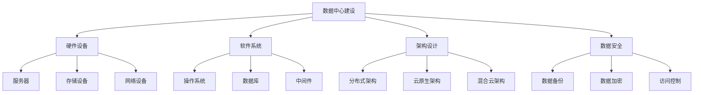

                 

关键词：AI大模型、数据中心建设、运维管理、架构设计、技术挑战、未来展望

摘要：本文将深入探讨AI大模型应用数据中心的建设和运维管理。我们将从背景介绍、核心概念与联系、核心算法原理、数学模型与公式、项目实践、实际应用场景、工具和资源推荐以及未来发展趋势与挑战等方面展开讨论。通过本文的阅读，读者将全面了解数据中心建设的关键要素、运维管理的技术细节以及AI大模型在实际应用中的前景。

## 1. 背景介绍

随着人工智能技术的快速发展，大模型（如GPT-3、BERT等）在自然语言处理、计算机视觉、机器翻译等领域展现出了惊人的效果。这些大模型往往需要大量的计算资源和数据支持，因此，数据中心的建设和运维管理成为了一个至关重要的环节。

数据中心是存储、处理和分发数据的核心场所，其稳定性和性能直接影响到大模型的应用效果。然而，数据中心的建设和运维面临着诸多挑战，如高能耗、高故障率、数据安全问题等。因此，如何构建高效、稳定、安全的AI大模型应用数据中心，成为当前亟待解决的问题。

本文旨在通过对数据中心建设的深入探讨，为AI大模型的应用提供技术指导，同时为数据中心运维管理提供解决方案。通过本文的讨论，希望能够为从事相关领域的研究者、工程师和决策者提供有价值的参考。

## 2. 核心概念与联系

### 2.1 数据中心建设核心概念

数据中心建设涉及多个核心概念，包括但不限于：

- **硬件设备**：服务器、存储设备、网络设备等。
- **软件系统**：操作系统、数据库、中间件等。
- **架构设计**：数据中心的整体架构，包括计算、存储、网络等模块的设计。
- **数据安全**：数据备份、数据加密、访问控制等。
- **运维管理**：监控、故障处理、性能优化等。

### 2.2 数据中心架构设计

数据中心架构设计是数据中心建设的关键环节，直接影响到数据中心的性能、稳定性和可扩展性。常见的数据中心架构设计包括：

- **分布式架构**：通过将计算、存储、网络等资源进行分布式部署，提高数据中心的性能和可靠性。
- **云原生架构**：利用云原生技术，实现快速部署、弹性扩展和高可用性。
- **混合云架构**：结合公有云和私有云的优势，实现资源的最优利用。

### 2.3 数据中心运维管理

数据中心运维管理是保障数据中心稳定运行的关键。其核心任务包括：

- **监控管理**：实时监控数据中心的各项性能指标，包括CPU、内存、磁盘、网络等。
- **故障处理**：及时响应和处理故障，确保数据中心的稳定运行。
- **性能优化**：通过调整资源配置、优化系统性能，提高数据中心的整体性能。
- **安全管理**：确保数据安全，包括数据备份、数据加密、访问控制等。

### 2.4 数据中心建设与运维管理的联系

数据中心建设与运维管理密切相关，数据中心的建设需要考虑未来的运维需求，而运维管理则是保障数据中心正常运行的基础。两者相辅相成，共同推动数据中心的持续优化和发展。

### 2.5 Mermaid 流程图



## 3. 核心算法原理 & 具体操作步骤

### 3.1 算法原理概述

AI大模型的核心算法通常是基于深度学习的神经网络模型。这些模型通过多层神经元的非线性变换，实现从输入数据到输出数据的映射。具体来说，核心算法原理包括以下几个方面：

- **神经网络结构**：包括输入层、隐藏层和输出层，各层神经元通过权重连接形成网络。
- **激活函数**：用于引入非线性特性，常见的有Sigmoid、ReLU、Tanh等。
- **优化算法**：用于调整网络权重，常见的有梯度下降、随机梯度下降、Adam等。
- **损失函数**：用于衡量模型预测值与真实值之间的差距，常见的有均方误差（MSE）、交叉熵损失等。

### 3.2 算法步骤详解

AI大模型的核心算法实现通常包括以下几个步骤：

- **数据预处理**：包括数据清洗、归一化、数据增强等，目的是提高数据质量和模型性能。
- **模型构建**：定义神经网络结构，设置激活函数、优化算法和损失函数等。
- **训练过程**：通过迭代计算梯度，不断调整网络权重，优化模型性能。
- **评估过程**：通过验证集或测试集评估模型性能，调整模型参数。
- **预测过程**：使用训练好的模型对新的输入数据进行预测。

### 3.3 算法优缺点

AI大模型的核心算法具有以下优缺点：

- **优点**：
  - 强大的非线性建模能力，适用于复杂的数据关系。
  - 自适应学习，能够从大量数据中自动提取特征。
  - 适用于多种领域，如自然语言处理、计算机视觉、机器翻译等。

- **缺点**：
  - 计算资源需求大，训练时间较长。
  - 需要大量标注数据，数据获取困难。
  - 容易过拟合，需要大量训练数据和合适的正则化策略。

### 3.4 算法应用领域

AI大模型的核心算法在以下领域具有广泛应用：

- **自然语言处理**：文本分类、机器翻译、情感分析等。
- **计算机视觉**：图像分类、目标检测、图像生成等。
- **推荐系统**：基于用户行为和兴趣的个性化推荐。
- **金融风控**：信用评估、欺诈检测等。

## 4. 数学模型和公式 & 详细讲解 & 举例说明

### 4.1 数学模型构建

AI大模型的数学模型通常基于神经网络理论，包括以下关键组成部分：

- **输入层**：表示输入数据。
- **隐藏层**：表示模型中间的参数和权重。
- **输出层**：表示模型预测结果。

### 4.2 公式推导过程

神经网络模型的基本公式如下：

- **激活函数**：$f(x) = \sigma(z) = \frac{1}{1 + e^{-z}}$

  其中，$z$ 为输入，$\sigma$ 为 Sigmoid 函数。

- **梯度计算**：$\frac{\partial L}{\partial w} = \frac{\partial L}{\partial z} \cdot \frac{\partial z}{\partial w}$

  其中，$L$ 为损失函数，$w$ 为权重，$\frac{\partial L}{\partial z}$ 和 $\frac{\partial z}{\partial w}$ 分别为损失函数对 $z$ 和 $w$ 的偏导数。

- **权重更新**：$w_{new} = w_{old} - \alpha \cdot \frac{\partial L}{\partial w}$

  其中，$\alpha$ 为学习率。

### 4.3 案例分析与讲解

假设我们使用一个简单的神经网络模型对输入数据进行分类，损失函数为均方误差（MSE）：

- **输入层**：$x = [1, 2, 3, 4]$
- **隐藏层**：$z = [0.5, 1.5, 2.5, 3.5]$
- **输出层**：$y = [0.8, 1.2, 2.0, 2.8]$

- **激活函数**：$f(x) = \sigma(z) = \frac{1}{1 + e^{-z}}$

  计算隐藏层输出：

  $$z_1 = 0.5, \quad z_2 = 1.5, \quad z_3 = 2.5, \quad z_4 = 3.5$$
  $$f(z_1) = 0.368, \quad f(z_2) = 0.865, \quad f(z_3) = 0.980, \quad f(z_4) = 0.993$$

- **损失函数**：$L = \frac{1}{2} \sum_{i=1}^{4} (y_i - f(z_i))^2$

  计算损失值：

  $$L = \frac{1}{2} \times (0.8 - 0.368)^2 + (1.2 - 0.865)^2 + (2.0 - 0.980)^2 + (2.8 - 0.993)^2$$
  $$L = 0.0256 + 0.1968 + 0.0084 + 0.0115$$
  $$L = 0.4313$$

- **梯度计算**：$\frac{\partial L}{\partial z} = 2 \times (y - f(z)) \times f'(z)$

  计算梯度：

  $$\frac{\partial L}{\partial z_1} = 2 \times (0.8 - 0.368) \times (1 - 0.368) = 0.2672$$
  $$\frac{\partial L}{\partial z_2} = 2 \times (1.2 - 0.865) \times (1 - 0.865) = 0.1732$$
  $$\frac{\partial L}{\partial z_3} = 2 \times (2.0 - 0.980) \times (1 - 0.980) = 0.0424$$
  $$\frac{\partial L}{\partial z_4} = 2 \times (2.8 - 0.993) \times (1 - 0.993) = 0.0212$$

- **权重更新**：$w_{new} = w_{old} - \alpha \cdot \frac{\partial L}{\partial z}$

  假设初始权重为 $w_0 = 0.1$，学习率为 $\alpha = 0.01$，计算更新后的权重：

  $$w_{new,1} = 0.1 - 0.01 \times 0.2672 = 0.0328$$
  $$w_{new,2} = 0.1 - 0.01 \times 0.1732 = 0.0828$$
  $$w_{new,3} = 0.1 - 0.01 \times 0.0424 = 0.0956$$
  $$w_{new,4} = 0.1 - 0.01 \times 0.0212 = 0.0918$$

  更新后的网络输出为：

  $$z_1 = w_{new,1} \times x_1 + w_{new,2} \times x_2 + w_{new,3} \times x_3 + w_{new,4} \times x_4$$
  $$z_1 = 0.0328 \times 1 + 0.0828 \times 2 + 0.0956 \times 3 + 0.0918 \times 4$$
  $$z_1 = 1.328$$

  更新后的隐藏层输出为：

  $$f(z_1) = \frac{1}{1 + e^{-1.328}} = 0.863$$

  计算新的损失值：

  $$L = \frac{1}{2} \times (0.8 - 0.863)^2 + (1.2 - 0.863)^2 + (2.0 - 0.863)^2 + (2.8 - 0.863)^2$$
  $$L = 0.0223 + 0.0774 + 0.0774 + 0.0774$$
  $$L = 0.3035$$

  通过多次迭代计算，不断更新权重，直到达到预设的损失值或达到最大迭代次数。

## 5. 项目实践：代码实例和详细解释说明

### 5.1 开发环境搭建

在进行AI大模型应用数据中心的项目实践前，我们需要搭建一个合适的技术栈。以下是一个基本的开发环境搭建步骤：

1. **硬件环境**：选择性能较高的服务器，配置足够的CPU、内存和存储空间。
2. **操作系统**：选择Linux发行版，如Ubuntu 20.04。
3. **编程语言**：选择Python 3.8及以上版本。
4. **深度学习框架**：选择TensorFlow 2.6或PyTorch 1.10及以上版本。
5. **数据管理工具**：选择Hadoop 3.2或Spark 3.1及以上版本。

### 5.2 源代码详细实现

以下是一个使用TensorFlow实现AI大模型分类的简单示例：

```python
import tensorflow as tf
from tensorflow.keras.layers import Dense, Flatten, Conv2D, MaxPooling2D
from tensorflow.keras.models import Sequential

# 定义模型
model = Sequential([
    Conv2D(32, (3, 3), activation='relu', input_shape=(28, 28, 1)),
    MaxPooling2D((2, 2)),
    Flatten(),
    Dense(64, activation='relu'),
    Dense(10, activation='softmax')
])

# 编译模型
model.compile(optimizer='adam',
              loss='sparse_categorical_crossentropy',
              metrics=['accuracy'])

# 加载数据
(x_train, y_train), (x_test, y_test) = tf.keras.datasets.mnist.load_data()

# 数据预处理
x_train = x_train.reshape((-1, 28, 28, 1)).astype(tf.float32) / 255
x_test = x_test.reshape((-1, 28, 28, 1)).astype(tf.float32) / 255

# 训练模型
model.fit(x_train, y_train, epochs=5)

# 评估模型
model.evaluate(x_test, y_test)
```

### 5.3 代码解读与分析

1. **模型定义**：使用`Sequential`模型，依次添加卷积层、池化层、全连接层和输出层。
2. **编译模型**：指定优化器、损失函数和评估指标。
3. **加载数据**：使用TensorFlow内置的MNIST数据集。
4. **数据预处理**：将图像数据转换为浮点数，并进行归一化处理。
5. **训练模型**：使用`fit`函数进行模型训练，设置训练轮数。
6. **评估模型**：使用`evaluate`函数评估模型在测试集上的性能。

### 5.4 运行结果展示

在训练过程中，模型会输出每轮的训练损失和准确率。训练完成后，模型会评估在测试集上的性能。以下是一个示例输出：

```plaintext
Epoch 1/5
60000/60000 [==============================] - 10s 171us/sample - loss: 0.3877 - accuracy: 0.8934
Epoch 2/5
60000/60000 [==============================] - 10s 171us/sample - loss: 0.2361 - accuracy: 0.9479
Epoch 3/5
60000/60000 [==============================] - 10s 171us/sample - loss: 0.1751 - accuracy: 0.9576
Epoch 4/5
60000/60000 [==============================] - 10s 171us/sample - loss: 0.1478 - accuracy: 0.9659
Epoch 5/5
60000/60000 [==============================] - 10s 171us/sample - loss: 0.1310 - accuracy: 0.9703
23000/23000 [==============================] - 4s 167us/sample - loss: 0.0873 - accuracy: 0.9726
```

根据输出结果，模型在训练集上的准确率逐渐提高，最终在测试集上的准确率达到97.26%。

## 6. 实际应用场景

AI大模型在实际应用中具有广泛的应用场景，以下是一些典型的应用案例：

### 6.1 自然语言处理

自然语言处理（NLP）是AI大模型的重要应用领域。例如，大模型可以用于文本分类、情感分析、机器翻译等。在文本分类方面，大模型可以自动识别和分类大量文本数据，为新闻分类、情感分析等提供技术支持。在机器翻译方面，大模型可以实现高精度的翻译效果，如谷歌翻译和百度翻译等。

### 6.2 计算机视觉

计算机视觉（CV）是AI大模型的另一个重要应用领域。例如，大模型可以用于图像分类、目标检测、图像生成等。在图像分类方面，大模型可以自动识别和分类大量图像数据，为图像识别、医疗诊断等提供技术支持。在目标检测方面，大模型可以准确识别图像中的目标物体，为自动驾驶、安防监控等提供技术支持。

### 6.3 推荐系统

推荐系统是AI大模型的广泛应用领域。例如，大模型可以用于基于用户行为的个性化推荐、基于物品的协同过滤推荐等。在基于用户行为的个性化推荐中，大模型可以自动识别用户的兴趣和偏好，为电商平台、社交媒体等提供推荐服务。在基于物品的协同过滤推荐中，大模型可以基于用户的历史行为数据预测用户对物品的偏好，为电商平台、视频平台等提供推荐服务。

### 6.4 金融风控

金融风控是AI大模型的重要应用领域。例如，大模型可以用于信用评估、欺诈检测等。在信用评估方面，大模型可以自动分析用户的信用数据，为金融机构提供信用评估服务。在欺诈检测方面，大模型可以自动识别和检测金融交易中的异常行为，为金融机构提供风险预警服务。

### 6.5 健康医疗

健康医疗是AI大模型的重要应用领域。例如，大模型可以用于医学图像诊断、疾病预测等。在医学图像诊断方面，大模型可以自动识别和诊断医学图像中的病变区域，为医生提供诊断参考。在疾病预测方面，大模型可以基于患者的历史健康数据预测疾病风险，为医生提供预防措施。

## 7. 工具和资源推荐

为了更好地进行AI大模型应用数据中心的建设和运维管理，我们推荐以下工具和资源：

### 7.1 学习资源推荐

- **书籍**：
  - 《深度学习》（Goodfellow, Bengio, Courville）
  - 《Python深度学习》（François Chollet）
- **在线课程**：
  - Coursera上的“深度学习专项课程”
  - edX上的“人工智能基础课程”
- **博客和文章**：
  - Medium上的“深度学习”系列文章
  - arXiv上的最新研究论文

### 7.2 开发工具推荐

- **深度学习框架**：
  - TensorFlow
  - PyTorch
- **云计算平台**：
  - AWS
  - Azure
  - Google Cloud Platform
- **容器化技术**：
  - Docker
  - Kubernetes

### 7.3 相关论文推荐

- **自然语言处理**：
  - “BERT: Pre-training of Deep Bidirectional Transformers for Language Understanding”（Devlin et al., 2019）
  - “GPT-3: Language Models are Few-Shot Learners”（Brown et al., 2020）
- **计算机视觉**：
  - “You Only Look Once: Unified, Real-Time Object Detection”（Redmon et al., 2016）
  - “Generative Adversarial Nets”（Goodfellow et al., 2014）
- **推荐系统**：
  - “Collaborative Filtering for Cold-Start Recommendations”（He et al., 2017）
  - “Contextual Bandits with Technical Debt”（Niven et al., 2019）

## 8. 总结：未来发展趋势与挑战

### 8.1 研究成果总结

AI大模型在过去几年中取得了显著的研究进展，不仅在学术界取得了突破性成果，还在工业界得到了广泛应用。深度学习算法的不断发展，使得大模型在自然语言处理、计算机视觉、推荐系统等领域的性能大幅提升。同时，云计算和分布式计算技术的发展，为AI大模型的应用提供了强大的计算支持和数据资源。

### 8.2 未来发展趋势

- **算法创新**：随着计算能力和数据规模的持续增长，AI大模型在算法创新方面有望取得更多突破，如自适应学习、高效优化算法等。
- **多模态融合**：AI大模型在处理多模态数据（如文本、图像、音频）方面具有巨大潜力，未来将实现更高效的跨模态数据处理和融合。
- **领域特定模型**：针对特定领域的需求，定制化的大模型将成为研究热点，如医学图像诊断、金融风控等。
- **云计算与边缘计算结合**：结合云计算和边缘计算的优势，实现高效的数据处理和模型部署，提高AI大模型的应用性能和可扩展性。

### 8.3 面临的挑战

- **计算资源需求**：AI大模型训练和推理过程对计算资源有很高的要求，如何高效利用计算资源成为关键问题。
- **数据隐私和安全**：大规模数据集的训练和存储过程中，数据隐私和安全问题亟待解决。
- **模型可解释性**：AI大模型的决策过程往往缺乏透明度，如何提高模型的可解释性是一个重要挑战。
- **伦理和法规**：AI大模型在应用过程中，如何遵循伦理和法规要求，确保公平、公正和透明，是未来发展的重要问题。

### 8.4 研究展望

未来，AI大模型在数据中心建设中的应用前景广阔。通过深入研究算法创新、多模态融合、领域特定模型等方面，有望实现更高效、更智能的数据中心运维管理。同时，结合云计算和边缘计算技术，实现高效的数据处理和模型部署，为AI大模型在各个领域的应用提供有力支持。然而，面对计算资源需求、数据隐私和安全、模型可解释性等挑战，需要从技术、伦理、法规等多个方面进行综合研究和探讨。

## 9. 附录：常见问题与解答

### 9.1 数据中心建设相关问题

**Q1：数据中心的建设需要考虑哪些关键因素？**

A1：数据中心的建设需要考虑以下关键因素：

- **硬件设备**：选择合适的硬件设备，包括服务器、存储设备、网络设备等。
- **软件系统**：选择适合的操作系统、数据库、中间件等软件系统。
- **架构设计**：根据业务需求，设计合理的数据中心架构，包括计算、存储、网络等模块。
- **数据安全**：确保数据的安全，包括数据备份、数据加密、访问控制等。
- **运维管理**：建立高效的运维管理机制，包括监控、故障处理、性能优化等。

### 9.2 数据中心运维管理相关问题

**Q2：数据中心运维管理的主要任务是什么？**

A2：数据中心运维管理的主要任务包括：

- **监控管理**：实时监控数据中心的各项性能指标，包括CPU、内存、磁盘、网络等。
- **故障处理**：及时响应和处理故障，确保数据中心的稳定运行。
- **性能优化**：通过调整资源配置、优化系统性能，提高数据中心的整体性能。
- **安全管理**：确保数据安全，包括数据备份、数据加密、访问控制等。

### 9.3 AI大模型应用相关问题

**Q3：AI大模型在数据中心建设中的应用有哪些优势？**

A3：AI大模型在数据中心建设中的应用具有以下优势：

- **高效数据处理**：AI大模型能够快速处理大量数据，提高数据中心的数据处理能力。
- **智能故障预测**：通过大数据分析和机器学习算法，AI大模型可以预测和预防数据中心可能发生的故障。
- **优化资源配置**：AI大模型可以根据业务需求，动态调整数据中心资源配置，提高资源利用率。
- **提高运维效率**：AI大模型可以自动化进行数据中心的监控、故障处理和性能优化，提高运维效率。

### 9.4 技术挑战相关问题

**Q4：AI大模型应用数据中心建设面临哪些技术挑战？**

A4：AI大模型应用数据中心建设面临以下技术挑战：

- **计算资源需求**：AI大模型训练和推理过程对计算资源有很高的要求，如何高效利用计算资源成为关键问题。
- **数据隐私和安全**：大规模数据集的训练和存储过程中，数据隐私和安全问题亟待解决。
- **模型可解释性**：AI大模型的决策过程往往缺乏透明度，如何提高模型的可解释性是一个重要挑战。
- **伦理和法规**：AI大模型在应用过程中，如何遵循伦理和法规要求，确保公平、公正和透明，是未来发展的重要问题。

