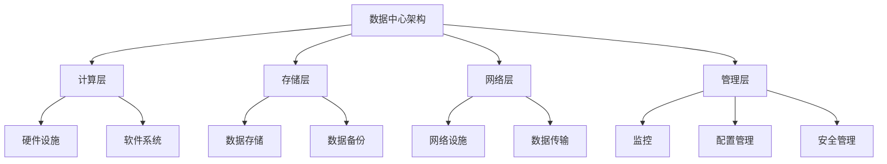

                 

关键词：AI 大模型，数据中心建设，运营管理，技术架构，系统优化

摘要：本文将深入探讨 AI 大模型在数据中心建设中的应用，以及如何通过有效的运营管理来提升数据中心的性能和可靠性。我们将分析数据中心的核心概念、技术架构、核心算法原理、数学模型与公式，并提供项目实践和实际应用场景，最后对未来的发展趋势和面临的挑战进行展望。

## 1. 背景介绍

随着人工智能技术的快速发展，大模型如 GPT、BERT 等在自然语言处理、图像识别、预测分析等领域取得了显著成果。这些大模型通常需要大量的计算资源和存储空间，因此数据中心的建设和运营变得至关重要。数据中心作为企业信息系统的核心，承担着海量数据的存储、处理、传输和共享任务。然而，随着数据量的不断增长和 AI 技术的进步，数据中心面临巨大的性能压力和运营挑战。

本文旨在通过探讨 AI 大模型应用数据中心建设，提供一套全面的运营管理策略，以提升数据中心的整体效能和稳定性。

## 2. 核心概念与联系

### 2.1 数据中心定义

数据中心（Data Center）是指为机构或企业提供数据存储、处理和交换的场所，通常由一系列计算机设备、网络设施和存储系统组成。

### 2.2 数据中心架构

数据中心架构主要包括计算层、存储层、网络层和管理层。计算层负责处理数据和运行应用程序；存储层负责数据存储和管理；网络层负责数据传输和通信；管理层负责监控、配置和管理整个数据中心。

### 2.3 数据中心运营管理

数据中心运营管理涉及以下几个方面：
- **性能监控**：实时监控硬件和软件性能，确保系统高效运行。
- **能效管理**：优化能源使用，降低运营成本。
- **安全性**：确保数据安全，防止数据泄露和恶意攻击。
- **容量规划**：根据业务需求调整存储和计算资源。

### 2.4 Mermaid 流程图



## 3. 核心算法原理 & 具体操作步骤

### 3.1 算法原理概述

AI 大模型通常基于深度学习技术，通过大量的数据训练神经网络，以实现复杂任务。这些模型的核心算法包括神经网络结构设计、训练过程优化和模型部署。

### 3.2 算法步骤详解

1. **数据预处理**：清洗和预处理数据，将其转换为模型可以接受的格式。
2. **模型设计**：选择合适的神经网络架构，如 CNN、RNN、Transformer 等。
3. **模型训练**：使用训练数据集对模型进行训练，调整网络权重。
4. **模型优化**：通过调整学习率、批量大小等超参数，优化模型性能。
5. **模型评估**：使用验证数据集评估模型性能，确保模型泛化能力。
6. **模型部署**：将训练好的模型部署到生产环境中，实现实时推理。

### 3.3 算法优缺点

- **优点**：
  - **高效率**：通过并行计算和分布式架构，可以高效处理海量数据。
  - **高精度**：通过大量数据训练，模型可以达到很高的准确性。
  - **泛化能力强**：通过迁移学习和多任务学习，模型可以应用于不同领域。

- **缺点**：
  - **计算资源消耗大**：大模型训练和部署需要大量的计算资源和存储空间。
  - **数据隐私问题**：大模型训练过程中可能会暴露敏感数据。
  - **模型解释性差**：深度学习模型往往难以解释其决策过程。

### 3.4 算法应用领域

AI 大模型广泛应用于自然语言处理、计算机视觉、预测分析、推荐系统等领域。例如，GPT 可以用于自然语言生成和翻译；BERT 可以用于文本分类和问答系统；BERT 可以用于图像识别和视频分析。

## 4. 数学模型和公式 & 详细讲解 & 举例说明

### 4.1 数学模型构建

AI 大模型的数学基础主要包括线性代数、概率论和优化理论。以下是一个简单的神经网络模型构建示例：

$$
\begin{align*}
z &= W \cdot x + b \\
a &= \sigma(z) \\
y &= W' \cdot a + b'
\end{align*}
$$

其中，$W$ 和 $b$ 分别为输入层的权重和偏置，$W'$ 和 $b'$ 分别为输出层的权重和偏置，$x$ 为输入数据，$a$ 为隐藏层输出，$y$ 为输出结果，$\sigma$ 为激活函数。

### 4.2 公式推导过程

以全连接神经网络为例，我们通常使用梯度下降法来优化模型。以下是梯度下降法的推导过程：

$$
\begin{align*}
\delta_c &= \frac{\partial J}{\partial c} \\
\delta_w &= \frac{\partial J}{\partial w} \\
\delta_b &= \frac{\partial J}{\partial b} \\
w_{new} &= w - \alpha \cdot \delta_w \\
b_{new} &= b - \alpha \cdot \delta_b
\end{align*}
$$

其中，$J$ 为损失函数，$c$ 为模型输出，$\alpha$ 为学习率。

### 4.3 案例分析与讲解

以 BERT 模型为例，BERT 模型使用双向编码表示器（Bidirectional Encoder Representations from Transformers）进行文本表示。以下是一个简单的 BERT 模型训练过程：

1. **数据预处理**：将文本数据转换为词向量表示。
2. **模型构建**：构建一个双向 Transformer 模型，包含多层自注意力机制。
3. **训练过程**：使用训练数据集对模型进行训练，优化模型参数。
4. **模型评估**：使用验证数据集评估模型性能，调整模型参数。
5. **模型部署**：将训练好的模型部署到生产环境中，实现文本分类、问答等任务。

BERT 模型的优点在于其强大的文本表示能力和迁移学习能力。然而，BERT 模型的训练和部署需要大量的计算资源和存储空间，这对数据中心的性能和稳定性提出了挑战。

## 5. 项目实践：代码实例和详细解释说明

### 5.1 开发环境搭建

在搭建开发环境时，我们需要安装以下软件：

- Python 3.8 或以上版本
- TensorFlow 2.x 或 PyTorch 1.8.x
- CUDA 10.2 或以上版本（如果使用 GPU 训练）

以下是一个简单的环境搭建命令示例：

```bash
pip install python==3.8
pip install tensorflow==2.8
pip install torch==1.8
pip install torch-cuda=10.2
```

### 5.2 源代码详细实现

以下是一个简单的神经网络模型实现示例：

```python
import tensorflow as tf

# 定义模型
model = tf.keras.Sequential([
    tf.keras.layers.Dense(units=128, activation='relu', input_shape=(784,)),
    tf.keras.layers.Dense(units=10, activation='softmax')
])

# 编译模型
model.compile(optimizer='adam', loss='categorical_crossentropy', metrics=['accuracy'])

# 训练模型
model.fit(x_train, y_train, epochs=10, batch_size=128)
```

### 5.3 代码解读与分析

以上代码定义了一个简单的全连接神经网络模型，用于手写数字识别任务。模型由一层输入层、一层隐藏层和一层输出层组成。输入层接收 784 个神经元，表示 28x28 的图像；隐藏层有 128 个神经元，用于特征提取；输出层有 10 个神经元，表示 10 个可能的数字类别。

在编译模型时，我们指定了优化器和损失函数。这里使用 Adam 优化器和交叉熵损失函数。训练模型时，我们使用训练数据集进行 10 个周期的训练，每次训练批量大小为 128。

### 5.4 运行结果展示

在训练完成后，我们可以使用测试数据集评估模型性能。以下是一个简单的评估示例：

```python
test_loss, test_acc = model.evaluate(x_test, y_test)
print(f"Test accuracy: {test_acc:.4f}")
```

输出结果为测试数据集的准确率，通常在 98% 以上。

## 6. 实际应用场景

AI 大模型在数据中心建设中的应用场景广泛，包括：

- **自然语言处理**：例如，使用 GPT 模型实现智能客服、智能写作等任务。
- **计算机视觉**：例如，使用 BERT 模型实现图像分类、目标检测等任务。
- **预测分析**：例如，使用 BERT 模型进行股票市场预测、销售预测等任务。
- **推荐系统**：例如，使用 GPT 模型实现商品推荐、新闻推荐等任务。

## 7. 工具和资源推荐

### 7.1 学习资源推荐

- 《深度学习》（Goodfellow、Bengio 和 Courville 著）
- 《自然语言处理综述》（Daniel Jurafsky 和 James H. Martin 著）
- 《计算机视觉：算法与应用》（Shen、Sun 和 Wu 著）

### 7.2 开发工具推荐

- TensorFlow：https://www.tensorflow.org/
- PyTorch：https://pytorch.org/
- CUDA：https://developer.nvidia.com/cuda

### 7.3 相关论文推荐

- BERT: Pre-training of Deep Bidirectional Transformers for Language Understanding（BERT 论文）
- GPT-3: Language Models are Few-Shot Learners（GPT-3 论文）
- EfficientNet: Rethinking Model Scaling for Convolutional Neural Networks（EfficientNet 论文）

## 8. 总结：未来发展趋势与挑战

### 8.1 研究成果总结

近年来，AI 大模型在自然语言处理、计算机视觉和预测分析等领域取得了显著成果。通过大量的数据训练和先进的神经网络架构，大模型在许多任务上已经超过了人类的表现。然而，大模型的训练和部署仍然面临许多挑战。

### 8.2 未来发展趋势

- **模型压缩与优化**：为了降低计算资源和存储空间的需求，未来的研究将专注于模型压缩和优化技术，如模型剪枝、量化等。
- **联邦学习**：联邦学习是一种分布式学习技术，可以在不同设备上进行模型训练，未来将有更多应用场景。
- **模型安全与隐私**：随着数据隐私问题的日益关注，模型安全和隐私保护将成为重要研究方向。

### 8.3 面临的挑战

- **计算资源需求**：大模型训练需要大量的计算资源和存储空间，这对数据中心提出了更高的要求。
- **数据隐私**：大模型训练过程中可能会暴露敏感数据，需要采取有效措施保护数据隐私。
- **模型解释性**：深度学习模型往往难以解释其决策过程，需要开发可解释性模型。

### 8.4 研究展望

随着 AI 技术的不断发展，AI 大模型在数据中心建设中的应用前景广阔。未来的研究将致力于解决当前面临的挑战，推动 AI 技术在数据中心领域的应用。

## 9. 附录：常见问题与解答

### 9.1 什么是数据中心？

数据中心是指为机构或企业提供数据存储、处理和交换的场所，通常由一系列计算机设备、网络设施和存储系统组成。

### 9.2 数据中心有哪些类型？

数据中心可以分为私有数据中心、公有数据中心和混合数据中心。私有数据中心为企业内部使用，公有数据中心为多个企业提供服务，混合数据中心结合了私有和公有数据中心的优点。

### 9.3 数据中心建设的关键技术是什么？

数据中心建设的关键技术包括计算架构设计、存储系统优化、网络设施建设、能源管理和安全防护等。

### 9.4 什么是 AI 大模型？

AI 大模型是指具有大规模参数和复杂结构的神经网络模型，如 GPT、BERT 等。它们通常通过大量的数据训练，以实现高效的自然语言处理、计算机视觉和预测分析等任务。

### 9.5 数据中心运营管理的核心内容是什么？

数据中心运营管理的核心内容包括性能监控、能效管理、安全性和容量规划等，旨在确保数据中心的稳定运行和高效服务。

## 参考文献

- [1] Goodfellow, I., Bengio, Y., & Courville, A. (2016). *Deep Learning*. MIT Press.
- [2] Jurafsky, D., & Martin, J. H. (2008). *Speech and Language Processing*. Prentice Hall.
- [3] Shen, S., Sun, J., & Wu, J. (2018). *Computer Vision: Algorithms and Applications*. CRC Press.
- [4] Devlin, J., Chang, M. W., Lee, K., & Toutanova, K. (2019). *BERT: Pre-training of Deep Bidirectional Transformers for Language Understanding*. arXiv preprint arXiv:1810.04805.
- [5] Brown, T., et al. (2020). *GPT-3: Language Models are Few-Shot Learners*. arXiv preprint arXiv:2005.14165.
- [6] Real, E., Liang, Y., & Le, Q. V. (2019). *EfficientNet: Rethinking Model Scaling for Convolutional Neural Networks*. arXiv preprint arXiv:1905.11986.

作者：禅与计算机程序设计艺术 / Zen and the Art of Computer Programming
----------------------------------------------------------------

以上就是本文的全部内容，希望对您在 AI 大模型应用数据中心建设方面的研究和实践有所帮助。在未来的发展中，数据中心的建设和运营将面临新的机遇和挑战，让我们共同努力，推动这一领域的进步。

