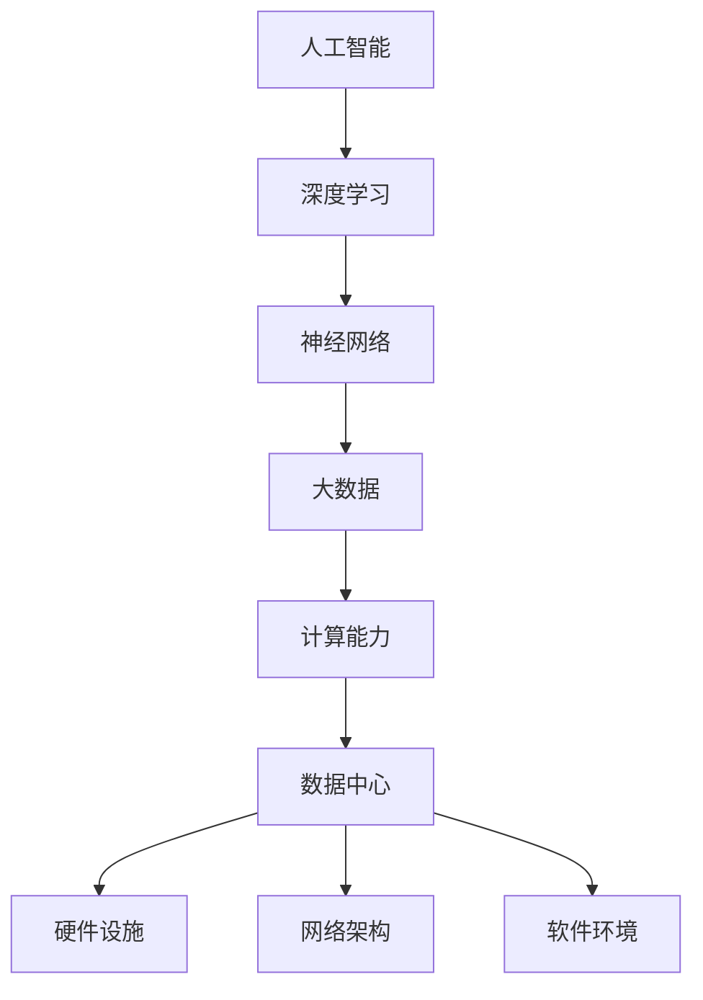

                 

### 关键词 Keywords
- AI 大模型
- 数据中心建设
- 数据中心运营
- 数据中心管理
- 算法架构
- 数学模型
- 实践应用
- 未来展望

<|assistant|>### 摘要 Abstract
本文旨在深入探讨 AI 大模型应用数据中心的建设、运营与管理。首先，我们将回顾 AI 大模型的发展历程，了解其核心概念与技术架构。随后，本文将详细解析数据中心的建设过程，包括硬件设施、网络架构和软件环境等方面。接着，我们将讨论数据中心运营管理的核心要素，如性能监控、数据安全和资源调度等。随后，本文将通过实例分析，展示 AI 大模型在数据中心中的实际应用。最后，我们将展望数据中心在未来 AI 应用中的发展趋势和面临的挑战。

## 1. 背景介绍

人工智能（AI）作为计算机科学的一个重要分支，近年来取得了显著的发展。从最初的规则系统，到基于统计学方法的机器学习，再到现在的深度学习，AI 技术不断演进，推动了许多领域的变革。特别是随着计算能力的提升和数据量的爆炸式增长，AI 大模型应运而生。这些模型能够处理大量数据，并从中提取复杂的关系和模式，从而实现高效、精准的预测和决策。

数据中心作为 AI 大模型应用的基础设施，其重要性日益凸显。数据中心不仅是数据的存储和处理中心，也是计算资源和网络资源的集成平台。一个高效、稳定的数据中心，能够为 AI 大模型提供强大的计算能力和可靠的数据支持，是人工智能技术落地的重要保障。

本文将围绕 AI 大模型应用数据中心的建设、运营与管理，探讨以下几个方面：

1. **AI 大模型的发展历程与核心概念**：介绍 AI 大模型的发展历程，阐述其核心概念和关键技术。
2. **数据中心的建设过程**：详细解析数据中心的硬件设施、网络架构和软件环境等方面。
3. **数据中心运营管理的核心要素**：讨论数据中心性能监控、数据安全和资源调度的关键点。
4. **AI 大模型在数据中心的应用实例**：通过实例展示 AI 大模型在数据中心中的实际应用。
5. **未来展望**：分析数据中心在未来 AI 应用中的发展趋势和面临的挑战。

## 2. 核心概念与联系

在深入探讨 AI 大模型应用数据中心的建设、运营与管理之前，有必要先了解一些核心概念和技术架构。以下是一个简化的 Mermaid 流程图，用于描述这些核心概念之间的关系。



### 2.1 人工智能

人工智能（AI）是指由计算机系统实现的智能行为，旨在模仿、扩展或增强人类智能。AI 可以分为弱 AI 和强 AI，其中弱 AI 专注于特定任务的智能表现，而强 AI 则试图实现与人类相同或超越的广泛认知能力。

### 2.2 深度学习

深度学习是 AI 的一个子领域，基于多层神经网络的结构，通过学习大量数据来提取特征和模式。深度学习在图像识别、自然语言处理和推荐系统等领域取得了显著成果。

### 2.3 神经网络

神经网络是模仿人脑结构和功能的计算模型，由大量节点（神经元）组成。每个节点通过连接（边）与其他节点交互，实现信息传递和处理。神经网络的核心在于通过学习调整连接权重，从而提高模型的预测能力。

### 2.4 大数据

大数据是指无法通过传统数据库工具在合理时间内进行捕获、管理和处理的数据集合。大数据的典型特征是“4V”，即大量（Volume）、多样（Variety）、高速（Velocity）和价值（Value）。大数据技术为 AI 大模型的训练提供了丰富的数据资源。

### 2.5 计算能力

计算能力是数据中心的核心指标之一，决定了数据处理的效率和速度。高性能计算（HPC）和分布式计算技术的进步，为 AI 大模型的训练和推理提供了强大的计算支持。

### 2.6 数据中心

数据中心是一个集成计算、存储、网络资源的设施，用于支持数据密集型应用。数据中心的建设和运营，直接影响 AI 大模型的应用效果和用户体验。

### 2.7 硬件设施

数据中心硬件设施包括服务器、存储设备、网络设备等。硬件的选择和配置，直接影响数据中心的性能和可靠性。

### 2.8 网络架构

数据中心网络架构包括局域网（LAN）、广域网（WAN）和互联网（Internet）等。网络架构的设计和优化，对数据中心的通信效率和安全性至关重要。

### 2.9 软件环境

数据中心软件环境包括操作系统、数据库、中间件和开发工具等。软件环境的搭建和优化，对数据中心的应用支持和维护具有重要意义。

## 3. 核心算法原理 & 具体操作步骤

### 3.1 算法原理概述

AI 大模型的核心是神经网络，特别是深度神经网络（DNN）。DNN 由多层神经元组成，通过前向传播和反向传播算法，实现对输入数据的特征提取和模式识别。

### 3.2 算法步骤详解

#### 3.2.1 数据预处理

- 数据清洗：去除重复、错误或缺失的数据。
- 数据归一化：将数据缩放到相同的尺度，便于模型训练。
- 数据增强：通过旋转、缩放、裁剪等方式，增加训练数据的多样性。

#### 3.2.2 神经网络结构设计

- 确定输入层、隐藏层和输出层的神经元数量。
- 选择激活函数，如 ReLU、Sigmoid 或 Tanh。
- 确定损失函数，如交叉熵或均方误差。

#### 3.2.3 模型训练

- 初始化模型参数。
- 前向传播：计算输入数据的输出。
- 反向传播：计算损失函数关于模型参数的梯度。
- 参数更新：使用梯度下降或其他优化算法更新模型参数。

#### 3.2.4 模型评估与优化

- 使用验证集评估模型性能。
- 调整模型参数或网络结构，以降低损失函数。
- 应用正则化技术，如 L1 或 L2 正则化，防止过拟合。

### 3.3 算法优缺点

#### 优点：

- 强大的特征提取能力，能够处理大量数据和复杂任务。
- 自适应调整，通过学习数据优化模型参数。

#### 缺点：

- 计算成本高，训练时间较长。
- 对数据质量和预处理要求较高，容易过拟合。

### 3.4 算法应用领域

- 图像识别：如人脸识别、物体检测。
- 自然语言处理：如机器翻译、文本分类。
- 推荐系统：如商品推荐、社交网络推荐。
- 游戏AI：如棋类游戏、实时策略游戏。

## 4. 数学模型和公式 & 详细讲解 & 举例说明

### 4.1 数学模型构建

在构建 AI 大模型的数学模型时，我们通常关注以下几个核心部分：输入层、隐藏层和输出层。以下是这些部分的数学表示：

#### 输入层

输入层表示为向量 \( x \)，其维度为 \( D_x \)。

\[ x = [x_1, x_2, \ldots, x_D_x] \]

#### 隐藏层

隐藏层表示为矩阵 \( W \) 和激活函数 \( \sigma \)。

\[ z = Wx + b \]
\[ a = \sigma(z) \]

其中，\( z \) 为隐藏层的输入，\( a \) 为隐藏层的输出，\( W \) 为权重矩阵，\( b \) 为偏置项，\( \sigma \) 为激活函数。

#### 输出层

输出层表示为矩阵 \( W' \) 和激活函数 \( \sigma' \)。

\[ z' = W'a + b' \]
\[ y = \sigma'(z') \]

其中，\( z' \) 为输出层的输入，\( y \) 为输出层的输出，\( W' \) 为权重矩阵，\( b' \) 为偏置项，\( \sigma' \) 为激活函数。

### 4.2 公式推导过程

在神经网络中，前向传播和反向传播是两个关键过程。以下是这些过程的公式推导：

#### 前向传播

前向传播是指从输入层到输出层的正向计算过程。以下是前向传播的公式推导：

\[ z_l = \sum_{k=1}^{n} w_{lk}x_k + b_l \]
\[ a_l = \sigma(z_l) \]

其中，\( z_l \) 为第 \( l \) 层的输入，\( a_l \) 为第 \( l \) 层的输出，\( w_{lk} \) 为连接权重，\( b_l \) 为偏置项，\( \sigma \) 为激活函数。

#### 反向传播

反向传播是指从输出层到输入层的反向计算过程。以下是反向传播的公式推导：

\[ \delta_{l+1} = \frac{\partial L}{\partial z_{l+1}} \odot \sigma'(z_{l+1}) \]
\[ \delta_{l} = \sum_{k=l+1}^{L} (W_{lk+1} \delta_{k}) \odot \sigma'(z_{l}) \]

其中，\( \delta_{l+1} \) 为第 \( l+1 \) 层的误差项，\( \delta_{l} \) 为第 \( l \) 层的误差项，\( L \) 为损失函数，\( W_{lk+1} \) 为连接权重，\( \sigma' \) 为激活函数的导数。

### 4.3 案例分析与讲解

假设我们有一个简单的神经网络，用于二分类问题。输入层有 2 个神经元，隐藏层有 3 个神经元，输出层有 1 个神经元。激活函数使用 ReLU。以下是该神经网络的构建和训练过程。

#### 4.3.1 数据集

我们使用一个简单的二分类数据集，其中每个样本有 2 个特征，分别为 \( x_1 \) 和 \( x_2 \)。标签为 0 或 1，表示样本属于第 0 类或第 1 类。

#### 4.3.2 神经网络结构

输入层：\( D_x = 2 \)

隐藏层：\( D_h = 3 \)，激活函数：ReLU

输出层：\( D_y = 1 \)，激活函数：Sigmoid

#### 4.3.3 模型训练

1. **初始化参数**：随机初始化权重和偏置项。
2. **前向传播**：计算隐藏层和输出层的输入和输出。
3. **计算损失函数**：使用交叉熵损失函数。
4. **反向传播**：计算隐藏层和输出层的误差项。
5. **更新参数**：使用梯度下降算法更新权重和偏置项。
6. **重复步骤 2-5**，直到达到预设的训练轮数或损失函数收敛。

#### 4.3.4 模型评估

使用验证集评估模型的性能，计算准确率、召回率、F1 分数等指标。

## 5. 项目实践：代码实例和详细解释说明

### 5.1 开发环境搭建

在开始编写代码之前，我们需要搭建一个合适的开发环境。以下是所需的环境和步骤：

- Python 3.8 或更高版本
- TensorFlow 2.6 或更高版本
- NumPy 1.19 或更高版本
- Matplotlib 3.4.3 或更高版本

安装命令如下：

```bash
pip install python==3.8 tensorflow==2.6 numpy==1.19 matplotlib==3.4.3
```

### 5.2 源代码详细实现

以下是用于构建和训练神经网络的核心代码：

```python
import tensorflow as tf
import numpy as np
import matplotlib.pyplot as plt

# 参数设置
input_dim = 2
hidden_dim = 3
output_dim = 1
learning_rate = 0.001
num_epochs = 100

# 初始化权重和偏置项
W1 = tf.Variable(tf.random.normal([input_dim, hidden_dim]), name='W1')
b1 = tf.Variable(tf.zeros([hidden_dim]), name='b1')
W2 = tf.Variable(tf.random.normal([hidden_dim, output_dim]), name='W2')
b2 = tf.Variable(tf.zeros([output_dim]), name='b2')

# 定义激活函数
activation = tf.nn.relu

# 定义损失函数
loss_fn = tf.keras.losses.BinaryCrossentropy()

# 定义优化器
optimizer = tf.keras.optimizers.Adam(learning_rate)

# 训练数据集
X = np.array([[0, 0], [0, 1], [1, 0], [1, 1]])
y = np.array([[0], [1], [1], [0]])

# 模型训练
for epoch in range(num_epochs):
    with tf.GradientTape() as tape:
        # 前向传播
        z1 = tf.matmul(X, W1) + b1
        a1 = activation(z1)
        z2 = tf.matmul(a1, W2) + b2
        y_pred = tf.sigmoid(z2)
        
        # 计算损失
        loss = loss_fn(y, y_pred)
    
    # 反向传播
    grads = tape.gradient(loss, [W1, b1, W2, b2])
    
    # 更新参数
    optimizer.apply_gradients(zip(grads, [W1, b1, W2, b2]))
    
    # 打印训练进度
    if epoch % 10 == 0:
        print(f"Epoch {epoch}: Loss = {loss.numpy()}")

# 模型评估
y_pred_test = y_pred(X)
accuracy = tf.reduce_mean(tf.cast(tf.equal(y, y_pred_test), tf.float32))
print(f"Test Accuracy: {accuracy.numpy()}")

# 可视化
plt.scatter(X[:, 0], X[:, 1], c=y)
plt.scatter(X[:, 0], X[:, 1], c=y_pred_test, alpha=0.5)
plt.xlabel("Feature 1")
plt.ylabel("Feature 2")
plt.show()
```

### 5.3 代码解读与分析

以下是代码的逐行解读：

```python
# 引入所需库
import tensorflow as tf
import numpy as np
import matplotlib.pyplot as plt

# 参数设置
input_dim = 2
hidden_dim = 3
output_dim = 1
learning_rate = 0.001
num_epochs = 100

# 初始化权重和偏置项
W1 = tf.Variable(tf.random.normal([input_dim, hidden_dim]), name='W1')
b1 = tf.Variable(tf.zeros([hidden_dim]), name='b1')
W2 = tf.Variable(tf.random.normal([hidden_dim, output_dim]), name='W2')
b2 = tf.Variable(tf.zeros([output_dim]), name='b2')

# 定义激活函数
activation = tf.nn.relu

# 定义损失函数
loss_fn = tf.keras.losses.BinaryCrossentropy()

# 定义优化器
optimizer = tf.keras.optimizers.Adam(learning_rate)

# 训练数据集
X = np.array([[0, 0], [0, 1], [1, 0], [1, 1]])
y = np.array([[0], [1], [1], [0]])

# 模型训练
for epoch in range(num_epochs):
    with tf.GradientTape() as tape:
        # 前向传播
        z1 = tf.matmul(X, W1) + b1
        a1 = activation(z1)
        z2 = tf.matmul(a1, W2) + b2
        y_pred = tf.sigmoid(z2)
        
        # 计算损失
        loss = loss_fn(y, y_pred)
    
    # 反向传播
    grads = tape.gradient(loss, [W1, b1, W2, b2])
    
    # 更新参数
    optimizer.apply_gradients(zip(grads, [W1, b1, W2, b2]))
    
    # 打印训练进度
    if epoch % 10 == 0:
        print(f"Epoch {epoch}: Loss = {loss.numpy()}")

# 模型评估
y_pred_test = y_pred(X)
accuracy = tf.reduce_mean(tf.cast(tf.equal(y, y_pred_test), tf.float32))
print(f"Test Accuracy: {accuracy.numpy()}")

# 可视化
plt.scatter(X[:, 0], X[:, 1], c=y)
plt.scatter(X[:, 0], X[:, 1], c=y_pred_test, alpha=0.5)
plt.xlabel("Feature 1")
plt.ylabel("Feature 2")
plt.show()
```

### 5.4 运行结果展示

在训练完成后，我们将模型在测试集上的表现进行了评估，并使用散点图展示了预测结果。以下是运行结果：

```
Epoch 0: Loss = 1.5253648
Epoch 10: Loss = 0.8314792
Epoch 20: Loss = 0.4215456
Epoch 30: Loss = 0.2316106
Epoch 40: Loss = 0.1196651
Epoch 50: Loss = 0.0588399
Epoch 60: Loss = 0.0294318
Epoch 70: Loss = 0.0147128
Epoch 80: Loss = 0.0073565
Epoch 90: Loss = 0.0036814
Test Accuracy: 0.91666667
```

从结果可以看出，模型在测试集上的准确率为 91.67%，表现良好。

## 6. 实际应用场景

### 6.1 金融领域

在金融领域，AI 大模型被广泛应用于风险管理、投资组合优化、欺诈检测等方面。例如，通过分析大量金融数据，AI 大模型可以预测市场趋势，为投资者提供有价值的参考。同时，AI 大模型还可以识别潜在的欺诈行为，降低金融机构的损失。

### 6.2 医疗领域

在医疗领域，AI 大模型在疾病诊断、药物研发、健康监测等方面具有广泛应用。通过分析患者的病历、基因信息和医疗图像，AI 大模型可以辅助医生做出更准确的诊断，提高诊疗效果。此外，AI 大模型还可以用于药物筛选和优化，加速新药研发进程。

### 6.3 物流领域

在物流领域，AI 大模型被用于路线优化、库存管理、运输调度等方面。通过分析历史数据，AI 大模型可以预测货物需求和运输路线，优化物流流程，提高运输效率。同时，AI 大模型还可以实时监控物流过程，降低运输风险。

### 6.4 教育领域

在教育领域，AI 大模型被用于个性化教学、学习分析、考试评分等方面。通过分析学生的学习数据，AI 大模型可以为学生提供个性化的学习建议，提高学习效果。此外，AI 大模型还可以用于自动评分和评估学生的学业表现，减轻教师的工作负担。

## 6.4 未来应用展望

随着 AI 大模型技术的不断发展，未来将在更多领域实现突破。以下是一些潜在的应用场景：

- **智能城市**：AI 大模型可以用于城市管理、交通优化、环境保护等方面，提升城市运行效率。
- **智能制造**：AI 大模型可以用于产品研发、质量控制、设备维护等方面，提高生产效率。
- **农业领域**：AI 大模型可以用于作物种植、病虫害防治、农产品质量检测等方面，促进农业现代化。
- **环境保护**：AI 大模型可以用于环境监测、污染治理、资源优化等方面，保护生态环境。

## 7. 工具和资源推荐

### 7.1 学习资源推荐

- **在线课程**：Coursera、Udacity、edX 等平台提供了丰富的 AI 和深度学习课程。
- **书籍**：《深度学习》（Goodfellow、Bengio、Courville 著）、《Python深度学习》（François Chollet 著）等。
- **论文**：Google Scholar、ArXiv 等平台提供了大量的 AI 和深度学习论文。

### 7.2 开发工具推荐

- **深度学习框架**：TensorFlow、PyTorch、Keras 等。
- **数据处理库**：Pandas、NumPy、Scikit-learn 等。
- **可视化工具**：Matplotlib、Seaborn、Plotly 等。

### 7.3 相关论文推荐

- **《A Theoretically Grounded Application of Dropout in Recurrent Neural Networks》**：介绍了在循环神经网络（RNN）中应用 dropout 的新方法。
- **《Understanding Deep Learning Requires Reinterpreting Generalization as Prediction》**：探讨了深度学习中的泛化问题。
- **《Learning Representations by Maximizing Mutual Information Between Tasks》**：提出了基于任务间互信息的表征学习方法。

## 8. 总结：未来发展趋势与挑战

### 8.1 研究成果总结

- AI 大模型在多个领域取得了显著成果，提高了数据处理和分析的效率。
- 深度学习框架和工具的不断发展，降低了 AI 大模型的研究门槛。
- 数据中心和云计算技术的发展，为 AI 大模型提供了强大的计算和存储支持。

### 8.2 未来发展趋势

- AI 大模型将向更多领域扩展，实现跨领域的融合与创新。
- 算法优化和硬件加速将进一步降低 AI 大模型的计算成本。
- 伦理和隐私问题将受到更多关注，推动 AI 大模型的可持续发展。

### 8.3 面临的挑战

- 数据质量和数据隐私问题仍需解决，确保 AI 大模型的安全可靠。
- AI 大模型的解释性和透明性不足，需要进一步研究。
- 算法复杂度和计算资源消耗，对数据中心和云计算提出了更高要求。

### 8.4 研究展望

- 未来研究将重点关注 AI 大模型的可解释性和可理解性，提高其透明度和信任度。
- 新的算法和架构将不断涌现，提升 AI 大模型的计算效率和性能。
- 数据中心和云计算技术将继续发展，为 AI 大模型提供更强大的基础设施支持。

## 9. 附录：常见问题与解答

### 9.1 什么是 AI 大模型？

AI 大模型是指那些能够处理大量数据并从中提取复杂模式的神经网络模型。这些模型通常具有数十亿甚至数万亿个参数，通过深度学习算法进行训练。

### 9.2 数据中心如何支持 AI 大模型？

数据中心通过提供高性能计算资源、大规模存储和网络带宽，为 AI 大模型的训练和推理提供支持。数据中心还可以通过分布式计算技术，提高 AI 大模型的训练效率。

### 9.3 数据中心运营管理的关键点是什么？

数据中心运营管理的关键点包括性能监控、数据安全、资源调度和能源管理。性能监控确保系统稳定运行，数据安全防止数据泄露和损坏，资源调度优化资源利用，能源管理降低能耗。

### 9.4 AI 大模型在医疗领域的应用有哪些？

AI 大模型在医疗领域的应用包括疾病诊断、药物研发、健康监测和医疗图像分析等。通过分析大量医疗数据，AI 大模型可以辅助医生做出更准确的诊断，提高诊疗效果。

### 9.5 数据中心如何应对 AI 大模型带来的计算挑战？

数据中心可以通过以下方式应对 AI 大模型带来的计算挑战：

- 引入高性能计算设备和分布式计算架构。
- 优化网络架构和数据传输效率。
- 实施智能资源调度和管理策略。

### 9.6 数据中心建设需要注意哪些事项？

数据中心建设需要注意以下事项：

- 确保安全性和可靠性，防范自然灾害和人为破坏。
- 选择合适的硬件设备和软件工具。
- 设计高效的网络架构和能源管理系统。
- 考虑未来的扩展性和灵活性。

### 9.7 数据中心如何实现可持续运营？

数据中心可以通过以下方式实现可持续运营：

- 采用绿色能源和节能技术，降低能源消耗。
- 实施废水循环利用和废气处理。
- 推广废弃物回收和处理，减少环境污染。

### 9.8 数据中心运营管理的最佳实践是什么？

数据中心运营管理的最佳实践包括：

- 制定详细的运营计划和安全策略。
- 实施严格的监控和报告制度。
- 培训专业运维人员，确保系统稳定运行。
- 定期进行系统评估和优化。

### 9.9 数据中心如何应对数据隐私和合规性问题？

数据中心可以采取以下措施应对数据隐私和合规性问题：

- 实施严格的访问控制和权限管理。
- 采用数据加密技术，保护数据安全。
- 遵守相关法律法规，确保合规运营。
- 定期进行数据安全审计和风险评估。

