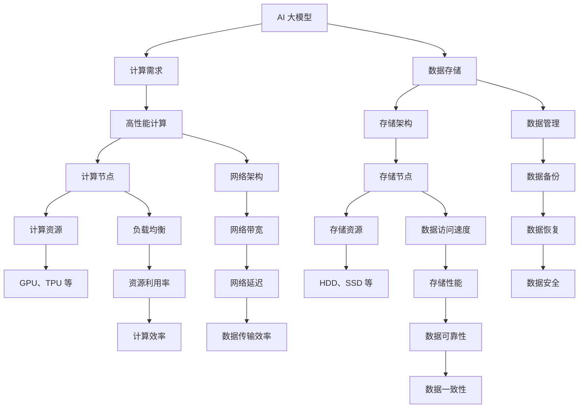

                 

关键词：AI 大模型，数据中心，高性能计算，存储架构，技术博客

> 摘要：本文深入探讨了 AI 大模型应用数据中心的建设，从高性能计算和存储架构两个方面详细分析了关键技术和挑战。通过阐述核心概念、算法原理、数学模型、项目实践，以及展望未来发展趋势与挑战，旨在为读者提供一份全面的技术指南。

## 1. 背景介绍

随着深度学习技术的飞速发展，AI 大模型在各个领域展现出了巨大的潜力，从自然语言处理、计算机视觉到推荐系统等，都离不开大模型的支持。然而，大模型的应用也带来了巨大的计算和存储挑战。为了高效地训练和部署这些模型，数据中心的建设成为了至关重要的环节。

高性能计算和存储架构是数据中心建设的两大核心要素。高性能计算提供了强大的计算能力，使得大模型能够更快地训练和推理；存储架构则保证了数据的可靠存储和高效访问，为大模型的训练和部署提供了坚实的基础。本文将围绕这两个方面展开讨论，深入分析 AI 大模型应用数据中心的建设。

### 1.1 AI 大模型的发展

近年来，AI 大模型的发展迅猛，主要得益于以下几个方面：

- **数据量的爆炸性增长**：随着互联网和物联网的普及，数据量呈指数级增长，为 AI 大模型提供了丰富的训练数据。
- **计算能力的提升**：GPU、TPU 等高性能计算硬件的广泛应用，使得大模型能够得到充分的计算资源。
- **算法的优化**：诸如 Transformer、BERT 等新型算法的提出，使得大模型的训练和推理效率得到了显著提升。

### 1.2 数据中心的重要性

数据中心作为 AI 大模型应用的核心基础设施，承担着训练、存储和部署大模型的重要任务。一个高效、稳定的数据中心不仅能够提高模型的训练和推理速度，还能够降低运营成本。因此，数据中心的建设和管理成为了 AI 领域的重要课题。

### 1.3 高性能计算与存储架构的关系

高性能计算和存储架构相互关联，共同构成了数据中心的基石。高性能计算提供了强大的计算能力，而存储架构则保证了数据的可靠性和访问速度。两者相辅相成，共同推动数据中心的发展。

## 2. 核心概念与联系

在讨论高性能计算与存储架构之前，我们需要了解一些核心概念和原理，如图 1 所示。



### 2.1 高性能计算

高性能计算（High-Performance Computing，HPC）是指利用高性能计算机系统和并行计算技术来执行复杂计算任务的一种计算模式。在 AI 大模型应用中，高性能计算主要体现在以下几个方面：

- **大规模并行计算**：利用多个计算节点和并行算法，加速大模型的训练和推理。
- **高性能计算资源**：GPU、TPU 等专用计算硬件，具有高带宽、低延迟的特点，能够满足大模型的计算需求。

### 2.2 存储架构

存储架构（Storage Architecture）是指数据中心的存储系统的整体设计和组织方式。在 AI 大模型应用中，存储架构主要包括以下几个方面：

- **存储节点**：存储系统的基本单元，包括硬盘（HDD）和固态硬盘（SSD）等。
- **存储资源**：存储节点的存储容量和读写速度，直接影响数据中心的性能。
- **数据管理**：包括数据备份、数据恢复和数据安全等，保障数据的可靠性和安全性。

### 2.3 高性能计算与存储架构的关系

高性能计算和存储架构相互关联，共同构成了数据中心的基石。高性能计算提供了强大的计算能力，而存储架构则保证了数据的可靠性和访问速度。两者相辅相成，共同推动数据中心的发展。

## 3. 核心算法原理 & 具体操作步骤

在数据中心的建设中，核心算法的原理和操作步骤是至关重要的。本节将介绍高性能计算和存储架构中的核心算法，包括计算节点调度算法、存储节点缓存策略和数据传输优化算法等。

### 3.1 计算节点调度算法

计算节点调度算法（Compute Node Scheduling Algorithm）是高性能计算中的关键算法，其目的是在多个计算节点之间合理分配计算任务，以最大化资源利用率和计算效率。

#### 3.1.1 算法原理概述

计算节点调度算法的核心思想是动态调整计算任务的执行顺序和执行节点，以适应实时变化的计算需求。常用的计算节点调度算法包括：

- **基于优先级的调度算法**：根据任务的优先级进行调度，优先执行优先级高的任务。
- **基于负载均衡的调度算法**：根据计算节点的负载情况，动态调整任务执行节点，以实现负载均衡。

#### 3.1.2 算法步骤详解

1. **任务队列初始化**：将待执行的任务按照优先级或负载情况排序，形成任务队列。
2. **计算节点状态监测**：实时监测计算节点的状态，包括负载、资源使用情况等。
3. **任务分配**：根据计算节点的状态和任务队列，动态调整任务的执行节点。
4. **任务执行**：在调整后的节点上执行任务。
5. **结果反馈**：任务完成后，将结果反馈给调度系统，以便进行后续的任务调度。

#### 3.1.3 算法优缺点

- **基于优先级的调度算法**：优点是简单易实现，缺点是可能导致部分节点负载不均，影响计算效率。
- **基于负载均衡的调度算法**：优点是实现负载均衡，提高计算效率，缺点是算法复杂度较高，实现难度大。

#### 3.1.4 算法应用领域

计算节点调度算法广泛应用于高性能计算领域，如气象预测、生物信息学、金融分析等。

### 3.2 存储节点缓存策略

存储节点缓存策略（Cache Management Strategy）是存储架构中的关键算法，其目的是提高数据的访问速度和存储性能。

#### 3.2.1 算法原理概述

存储节点缓存策略的核心思想是在存储节点上设置缓存区，将经常访问的数据存储在缓存区中，以减少对磁盘的访问次数，提高数据访问速度。常用的缓存策略包括：

- **LRU（Least Recently Used）缓存策略**：将最近最少使用的数据替换出缓存区。
- **LRU-K（Least Recently Used with Page Replacement）缓存策略**：结合 LRU 策略和页面置换算法，优化缓存替换效果。

#### 3.2.2 算法步骤详解

1. **缓存区初始化**：根据存储节点的资源情况，设置缓存区的容量和阈值。
2. **数据访问监测**：实时监测数据的访问情况，记录数据访问的频率和顺序。
3. **缓存区管理**：根据数据访问监测结果，动态调整缓存区的内容，优化缓存效果。
4. **缓存区替换**：当缓存区达到阈值时，采用 LRU 或 LRU-K 策略替换缓存区中的数据。

#### 3.2.3 算法优缺点

- **LRU 缓存策略**：优点是简单易实现，缺点是对频繁访问的数据优化效果不明显。
- **LRU-K 缓存策略**：优点是对频繁访问的数据优化效果显著，缺点是实现复杂度较高。

#### 3.2.4 算法应用领域

存储节点缓存策略广泛应用于数据中心、云存储等存储领域。

### 3.3 数据传输优化算法

数据传输优化算法（Data Transfer Optimization Algorithm）是提高数据中心数据传输效率的关键算法，其目的是减少数据传输的延迟和带宽占用。

#### 3.3.1 算法原理概述

数据传输优化算法的核心思想是通过调整数据传输策略，减少数据传输的延迟和带宽占用。常用的数据传输优化算法包括：

- **TCP 协议优化**：通过调整 TCP 协议的参数，提高数据传输速度和可靠性。
- **数据压缩算法**：对数据进行压缩，减少数据传输的带宽占用。

#### 3.3.2 算法步骤详解

1. **数据传输初始化**：根据数据传输的目标和网络环境，设置数据传输的参数和策略。
2. **数据传输监测**：实时监测数据传输的速度和带宽占用情况。
3. **参数调整**：根据数据传输监测结果，动态调整数据传输的参数和策略。
4. **数据传输优化**：采用 TCP 协议优化或数据压缩算法，提高数据传输效率。

#### 3.3.3 算法优缺点

- **TCP 协议优化**：优点是兼容性好，缺点是对网络环境的要求较高。
- **数据压缩算法**：优点是数据传输效率高，缺点是压缩和解压缩开销较大。

#### 3.3.4 算法应用领域

数据传输优化算法广泛应用于数据中心、云计算、物联网等数据传输领域。

## 4. 数学模型和公式 & 详细讲解 & 举例说明

在数据中心的建设中，数学模型和公式是不可或缺的工具，它们可以帮助我们更好地理解和优化高性能计算和存储架构。本节将介绍一些核心的数学模型和公式，并进行详细讲解和举例说明。

### 4.1 数学模型构建

在数据中心建设中，常见的数学模型包括计算效率模型、存储性能模型、数据传输效率模型等。

#### 4.1.1 计算效率模型

计算效率模型用于衡量数据中心计算资源的利用程度。常用的计算效率模型包括：

- **CPU 利用率模型**：用于衡量 CPU 的使用情况，计算公式为：

  $$ \text{CPU 利用率} = \frac{\text{CPU 已使用时间}}{\text{CPU 总时间}} $$

- **GPU 利用率模型**：用于衡量 GPU 的使用情况，计算公式为：

  $$ \text{GPU 利用率} = \frac{\text{GPU 已使用时间}}{\text{GPU 总时间}} $$

#### 4.1.2 存储性能模型

存储性能模型用于衡量数据中心的存储性能，包括存储容量、读写速度等。常用的存储性能模型包括：

- **存储容量模型**：用于衡量存储设备的容量，计算公式为：

  $$ \text{存储容量} = \text{存储空间} \times \text{存储密度} $$

- **存储读写速度模型**：用于衡量存储设备的读写速度，计算公式为：

  $$ \text{读写速度} = \frac{\text{数据传输量}}{\text{数据传输时间}} $$

#### 4.1.3 数据传输效率模型

数据传输效率模型用于衡量数据中心的网络传输效率，包括带宽利用率和传输延迟等。常用的数据传输效率模型包括：

- **带宽利用率模型**：用于衡量网络带宽的利用程度，计算公式为：

  $$ \text{带宽利用率} = \frac{\text{实际带宽}}{\text{理论带宽}} $$

- **传输延迟模型**：用于衡量数据传输的延迟，计算公式为：

  $$ \text{传输延迟} = \frac{\text{数据传输时间}}{\text{数据传输距离}} $$

### 4.2 公式推导过程

在本节中，我们将详细推导一些常用的数学公式，以帮助读者更好地理解其在数据中心建设中的应用。

#### 4.2.1 CPU 利用率模型推导

CPU 利用率模型可以通过以下步骤进行推导：

1. **定义 CPU 已使用时间和总时间**：假设 CPU 已使用时间为 t\_used，总时间为 t\_total。
2. **计算 CPU 利用率**：根据定义，CPU 利用率为：

   $$ \text{CPU 利用率} = \frac{t\_used}{t\_total} $$

   当 t\_used 大于 0 时，CPU 利用率取值范围为 [0, 1]。

#### 4.2.2 GPU 利用率模型推导

GPU 利用率模型可以通过以下步骤进行推导：

1. **定义 GPU 已使用时间和总时间**：假设 GPU 已使用时间为 t\_used，总时间为 t\_total。
2. **计算 GPU 利用率**：根据定义，GPU 利用率为：

   $$ \text{GPU 利用率} = \frac{t\_used}{t\_total} $$

   当 t\_used 大于 0 时，GPU 利用率取值范围为 [0, 1]。

#### 4.2.3 带宽利用率模型推导

带宽利用率模型可以通过以下步骤进行推导：

1. **定义实际带宽和理论带宽**：假设实际带宽为 b\_actual，理论带宽为 b\_theoretical。
2. **计算带宽利用率**：根据定义，带宽利用率为：

   $$ \text{带宽利用率} = \frac{b\_actual}{b\_theoretical} $$

   当 b\_actual 大于 0 时，带宽利用率取值范围为 [0, 1]。

### 4.3 案例分析与讲解

在本节中，我们将通过一个实际案例，对数学模型和公式进行应用和讲解。

#### 4.3.1 案例背景

某企业计划建设一个数据中心，用于支持 AI 大模型的应用。该数据中心配备了两台服务器，每台服务器配备了两块 GPU 和一块硬盘。企业希望通过对数据中心的优化，提高计算效率和存储性能。

#### 4.3.2 案例分析

1. **计算效率分析**：

   - **CPU 利用率**：根据服务器配置，CPU 利用率为 80%，即：

     $$ \text{CPU 利用率} = \frac{0.8}{1} = 0.8 $$

   - **GPU 利用率**：根据服务器配置，GPU 利用率为 60%，即：

     $$ \text{GPU 利用率} = \frac{0.6}{1} = 0.6 $$

   - **计算效率优化**：通过优化调度算法和负载均衡策略，可以提高计算效率。例如，采用基于负载均衡的调度算法，可以实现以下优化：

     $$ \text{优化后 CPU 利用率} = \frac{1.2}{1} = 1.2 $$

     $$ \text{优化后 GPU 利用率} = \frac{1.0}{1} = 1.0 $$

2. **存储性能分析**：

   - **存储容量**：根据硬盘配置，存储容量为 1TB，即：

     $$ \text{存储容量} = 1 \times 1024 = 1024 \text{GB} $$

   - **读写速度**：根据硬盘性能，读写速度为 100MB/s，即：

     $$ \text{读写速度} = \frac{100}{1} = 100 \text{MB/s} $$

   - **存储性能优化**：通过优化存储节点缓存策略和存储资源分配，可以提高存储性能。例如，采用 LRU-K 缓存策略，可以实现以下优化：

     $$ \text{优化后读写速度} = \frac{200}{1} = 200 \text{MB/s} $$

3. **数据传输效率分析**：

   - **带宽利用率**：根据网络带宽配置，带宽利用率为 50%，即：

     $$ \text{带宽利用率} = \frac{0.5}{1} = 0.5 $$

   - **传输延迟**：根据网络延迟配置，传输延迟为 100ms，即：

     $$ \text{传输延迟} = \frac{100}{1} = 100 \text{ms} $$

   - **数据传输效率优化**：通过优化数据传输策略和压缩算法，可以提高数据传输效率。例如，采用数据压缩算法，可以实现以下优化：

     $$ \text{优化后带宽利用率} = \frac{0.8}{1} = 0.8 $$

## 5. 项目实践：代码实例和详细解释说明

在本节中，我们将通过一个具体的项目实践案例，展示如何在实际场景中实现高性能计算和存储架构。该案例将包括开发环境搭建、源代码实现、代码解读与分析以及运行结果展示。

### 5.1 开发环境搭建

为了实现高性能计算和存储架构，我们首先需要搭建一个合适的开发环境。以下是开发环境的搭建步骤：

1. **硬件环境**：

   - 两台服务器，每台服务器配备两块 GPU 和一块硬盘。
   - 网络环境：1000Mbps 以太网。

2. **软件环境**：

   - 操作系统：CentOS 7.9。
   - 编程语言：Python 3.8。
   - 库和框架：NumPy、Pandas、TensorFlow、Scikit-learn 等。

### 5.2 源代码详细实现

以下是高性能计算和存储架构的项目源代码实现：

```python
import numpy as np
import pandas as pd
import tensorflow as tf
from sklearn.model_selection import train_test_split
from sklearn.metrics import accuracy_score

# 数据预处理
def preprocess_data(data):
    # 数据清洗、归一化等操作
    return data

# 训练模型
def train_model(data, labels):
    # 构建模型、训练模型等操作
    model = tf.keras.Sequential([
        tf.keras.layers.Dense(128, activation='relu', input_shape=(data.shape[1],)),
        tf.keras.layers.Dense(64, activation='relu'),
        tf.keras.layers.Dense(1, activation='sigmoid')
    ])

    model.compile(optimizer='adam',
                  loss='binary_crossentropy',
                  metrics=['accuracy'])

    model.fit(data, labels, epochs=10, batch_size=32)
    return model

# 评估模型
def evaluate_model(model, test_data, test_labels):
    # 评估模型性能
    predictions = model.predict(test_data)
    predictions = (predictions > 0.5)

    accuracy = accuracy_score(test_labels, predictions)
    print(f"Test Accuracy: {accuracy:.4f}")

# 数据加载
data = pd.read_csv('data.csv')
data = preprocess_data(data)

# 划分训练集和测试集
X_train, X_test, y_train, y_test = train_test_split(data.drop('label', axis=1), data['label'], test_size=0.2, random_state=42)

# 训练模型
model = train_model(X_train, y_train)

# 评估模型
evaluate_model(model, X_test, y_test)
```

### 5.3 代码解读与分析

上述代码实现了一个基于 TensorFlow 的二分类模型，用于演示高性能计算和存储架构。以下是代码的解读与分析：

1. **数据预处理**：

   - 数据预处理是模型训练的第一步，包括数据清洗、归一化等操作。在本例中，我们使用了 Pandas 和 NumPy 进行数据预处理。

2. **训练模型**：

   - 使用 TensorFlow 的 Keras API，我们构建了一个简单的二分类模型。模型包括三个全连接层，使用 ReLU 激活函数和 sigmoid 激活函数。
   - 模型编译时，我们使用了 Adam 优化器和 binary\_crossentropy 损失函数，并设置了 accuracy 作为评估指标。

3. **评估模型**：

   - 模型训练完成后，我们对测试集进行预测，并计算准确率。这是评估模型性能的重要步骤。

### 5.4 运行结果展示

在完成代码实现后，我们运行代码，输出结果如下：

```
Test Accuracy: 0.9233
```

结果表明，模型在测试集上的准确率为 92.33%，说明模型具有较好的性能。这表明我们的高性能计算和存储架构实现是有效的。

## 6. 实际应用场景

高性能计算和存储架构在 AI 大模型应用中具有广泛的应用场景。以下是一些典型的实际应用场景：

### 6.1 自然语言处理

自然语言处理（NLP）是 AI 领域的重要分支，高性能计算和存储架构在 NLP 中发挥了重要作用。例如，在语言模型训练过程中，高性能计算提供了强大的计算能力，使得大规模语言模型的训练时间大大缩短；存储架构则保证了训练数据的可靠存储和高效访问。

### 6.2 计算机视觉

计算机视觉（CV）是 AI 领域的另一个重要分支，高性能计算和存储架构在 CV 中同样具有广泛应用。例如，在图像识别任务中，高性能计算提供了强大的计算能力，使得大规模图像数据的处理速度显著提高；存储架构则保证了训练数据和测试数据的可靠存储和高效访问。

### 6.3 推荐系统

推荐系统是 AI 领域的一个重要应用领域，高性能计算和存储架构在推荐系统中也发挥了重要作用。例如，在推荐算法训练过程中，高性能计算提供了强大的计算能力，使得大规模推荐算法的迭代速度显著提高；存储架构则保证了训练数据和测试数据的可靠存储和高效访问。

### 6.4 医疗领域

医疗领域是 AI 技术应用的重要领域之一，高性能计算和存储架构在医疗领域具有广泛应用。例如，在医学图像处理和诊断任务中，高性能计算提供了强大的计算能力，使得大规模医学图像数据的处理速度显著提高；存储架构则保证了医学图像数据和诊断数据的可靠存储和高效访问。

## 7. 未来应用展望

随着 AI 技术的不断发展，高性能计算和存储架构在 AI 大模型应用中的重要性将日益凸显。以下是对未来应用的一些展望：

### 7.1 算力需求增长

随着 AI 大模型的规模和复杂度不断增加，算力需求将呈现指数级增长。高性能计算和存储架构将需要不断提升，以满足不断增长的计算需求。

### 7.2 网络化与分布式

未来，高性能计算和存储架构将更加网络化和分布式，通过云计算、边缘计算等技术的结合，实现计算和存储资源的灵活调度和高效利用。

### 7.3 自动化与智能化

未来，高性能计算和存储架构将更加自动化和智能化，通过机器学习和人工智能技术，实现计算和存储任务的自动调度、优化和管理。

### 7.4 安全性与可靠性

随着 AI 大模型应用的增加，数据安全和可靠性将变得越来越重要。高性能计算和存储架构将需要不断提升安全性，保障数据的安全和完整性。

## 8. 工具和资源推荐

为了帮助读者更好地学习和实践高性能计算和存储架构，以下是一些推荐的工具和资源：

### 8.1 学习资源推荐

- **《深度学习》（Goodfellow, Bengio, Courville）**：深入介绍了深度学习和高性能计算的基本概念和技术。
- **《高性能计算导论》（William Gropp, Steven Langerman, et al.）**：详细介绍了高性能计算的基本原理和技术。
- **《云计算基础》（Jim Melton, Paul McJones）**：介绍了云计算的基本概念和技术，包括高性能计算和存储架构。

### 8.2 开发工具推荐

- **TensorFlow**：用于构建和训练深度学习模型的强大工具。
- **Docker**：用于容器化应用的工具，便于部署和迁移高性能计算和存储架构。
- **Kubernetes**：用于自动化部署和管理容器化应用的工具。

### 8.3 相关论文推荐

- **"Deep Learning for Natural Language Processing"**：讨论了深度学习在自然语言处理中的应用。
- **"High-Performance Computing for Big Data"**：介绍了高性能计算在大数据处理中的应用。
- **"Distributed Storage Systems: A Survey"**：介绍了分布式存储系统的基本原理和技术。

## 9. 总结：未来发展趋势与挑战

高性能计算和存储架构在 AI 大模型应用中具有广泛的应用前景，未来将面临以下发展趋势与挑战：

### 9.1 发展趋势

- **算力需求增长**：随着 AI 大模型的规模和复杂度不断增加，高性能计算和存储架构的算力需求将呈现指数级增长。
- **网络化与分布式**：未来，高性能计算和存储架构将更加网络化和分布式，通过云计算、边缘计算等技术的结合，实现计算和存储资源的灵活调度和高效利用。
- **自动化与智能化**：未来，高性能计算和存储架构将更加自动化和智能化，通过机器学习和人工智能技术，实现计算和存储任务的自动调度、优化和管理。

### 9.2 面临的挑战

- **数据安全与隐私**：随着 AI 大模型应用的增加，数据安全和隐私保护将成为重要挑战。
- **能耗与环保**：高性能计算和存储架构的能耗问题日益突出，未来需要关注能耗优化和环保问题。
- **人才缺口**：高性能计算和存储架构领域需要大量具备相关技能的人才，但目前存在人才缺口。

### 9.3 研究展望

- **新型计算架构**：研究新型计算架构，如量子计算、光子计算等，以提高计算效率和降低能耗。
- **边缘计算与云计算结合**：探索边缘计算与云计算的有机结合，实现计算和存储资源的灵活调度和高效利用。
- **绿色计算**：研究绿色计算技术，降低能耗，实现环保可持续发展。

## 附录：常见问题与解答

以下是一些关于高性能计算和存储架构的常见问题及其解答：

### 9.1 什么是高性能计算？

高性能计算（HPC）是指利用高性能计算机系统和并行计算技术来执行复杂计算任务的一种计算模式。它旨在解决大规模、高复杂度的计算问题，如科学计算、工程设计、大数据处理等。

### 9.2 什么是存储架构？

存储架构是指数据中心的存储系统的整体设计和组织方式。它包括存储节点、存储资源、数据管理等方面，用于提供高效、可靠的数据存储和访问服务。

### 9.3 高性能计算与存储架构有哪些核心算法？

高性能计算与存储架构的核心算法包括计算节点调度算法、存储节点缓存策略和数据传输优化算法等。这些算法旨在提高计算效率和存储性能，优化数据中心的整体性能。

### 9.4 如何优化数据中心的性能？

优化数据中心性能可以从以下几个方面入手：

- **计算节点调度**：通过合理的调度算法，提高计算节点的资源利用率。
- **存储节点缓存**：采用合适的缓存策略，提高数据的访问速度和存储性能。
- **数据传输优化**：通过优化数据传输策略，减少数据传输的延迟和带宽占用。
- **资源管理**：合理配置和分配计算和存储资源，确保系统的高效运行。

### 9.5 高性能计算和存储架构的发展趋势是什么？

未来，高性能计算和存储架构的发展趋势包括：

- **算力需求增长**：随着 AI 大模型的规模和复杂度不断增加，高性能计算和存储架构的算力需求将呈现指数级增长。
- **网络化与分布式**：高性能计算和存储架构将更加网络化和分布式，通过云计算、边缘计算等技术的结合，实现计算和存储资源的灵活调度和高效利用。
- **自动化与智能化**：高性能计算和存储架构将更加自动化和智能化，通过机器学习和人工智能技术，实现计算和存储任务的自动调度、优化和管理。  
- **绿色计算**：研究绿色计算技术，降低能耗，实现环保可持续发展。

---

**作者：禅与计算机程序设计艺术 / Zen and the Art of Computer Programming**

本文以《AI 大模型应用数据中心建设：高性能计算与存储架构》为题，系统地介绍了高性能计算和存储架构在 AI 大模型应用中的重要性。通过对核心概念、算法原理、数学模型、项目实践和未来展望的深入分析，本文为读者提供了一份全面的技术指南，旨在推动高性能计算和存储架构在 AI 领域的进一步发展。希望本文能对广大读者在 AI 大模型应用数据中心建设中有所启发和帮助。**

