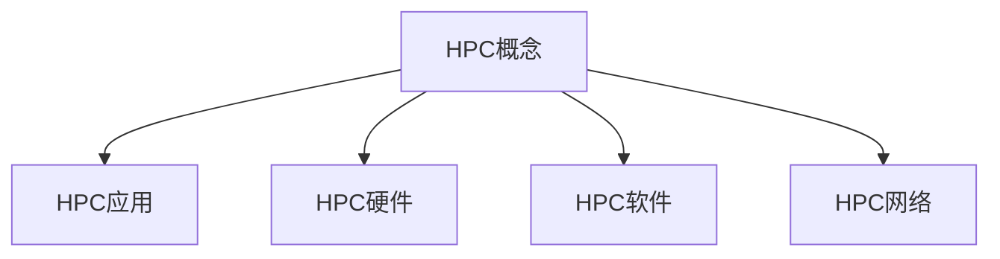
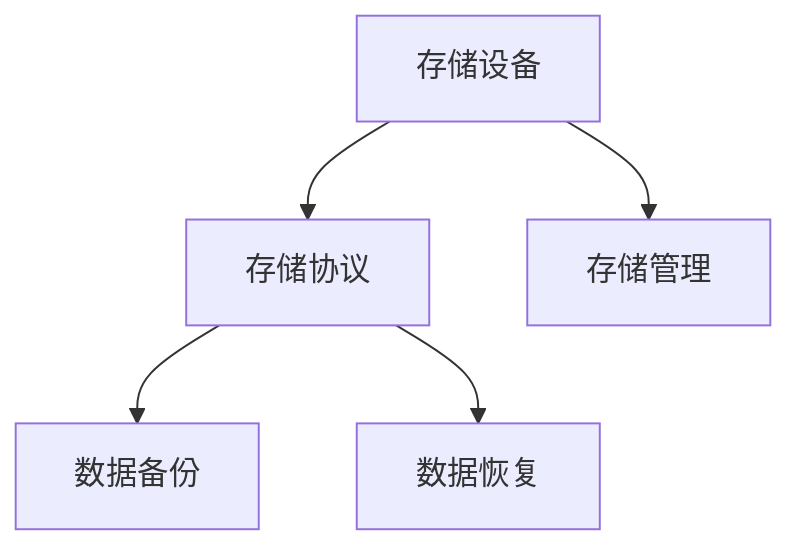
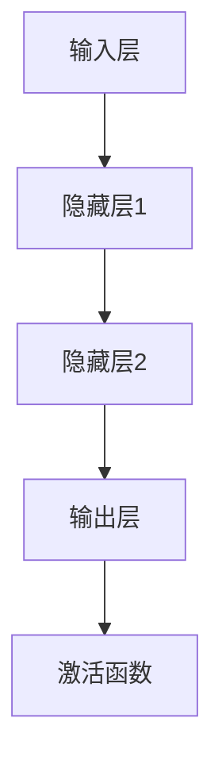

                 

关键词：AI大模型，数据中心，高性能计算，存储架构，机器学习，数据处理，云计算，边缘计算，数据存储，计算效率，成本优化

> 摘要：随着人工智能技术的快速发展，大模型的应用需求日益增长，对数据中心的建设提出了更高的要求。本文将探讨AI大模型应用数据中心的高性能计算与存储架构，分析现有技术的优缺点，并提出未来的发展方向与挑战。

## 1. 背景介绍

人工智能（AI）作为计算机科学的一个重要分支，其核心目标是通过模拟和扩展人类智能，实现机器在特定领域的自主学习和决策能力。近年来，得益于深度学习、神经网络等技术的突破，AI应用场景逐渐丰富，大模型的应用需求也在不断增长。大模型通常需要处理海量数据，进行复杂的计算任务，这要求数据中心具备极高的计算能力和存储能力。

数据中心是AI大模型应用的核心基础设施，其建设质量直接关系到AI应用的效率和效果。高性能计算（HPC）和存储架构作为数据中心建设的两大核心，对于提升计算效率和数据存储效率至关重要。本文将从以下几个方面展开讨论：

- AI大模型的应用现状与趋势
- 高性能计算架构在数据中心建设中的重要性
- 存储架构的选择与优化
- 云计算与边缘计算在数据中心建设中的应用
- 数据中心建设的成本优化与未来发展方向

## 2. 核心概念与联系

### 2.1 高性能计算

高性能计算（High-Performance Computing，HPC）是指通过利用高性能计算机资源，解决复杂科学和工程计算问题的计算方法和技术。HPC通常涉及大量的并行计算、高性能数据库、高性能存储等。

#### Mermaid 流程图



### 2.2 存储架构

存储架构是指数据中心的存储设备、存储协议和存储管理方式的集合。高效的存储架构能够提升数据访问速度，降低存储成本。

#### Mermaid 流程图



### 2.3 人工智能大模型

人工智能大模型是指具有极高计算能力的人工神经网络模型，能够处理海量数据并实现复杂的任务。大模型通常包括多个层级，每个层级都涉及大量的计算操作。

#### Mermaid 流程图



## 3. 核心算法原理 & 具体操作步骤

### 3.1 算法原理概述

AI大模型的核心算法是基于深度学习（Deep Learning）的神经网络。神经网络由多层神经元组成，通过反向传播算法（Backpropagation Algorithm）进行训练。反向传播算法是一种用于计算网络输出误差并调整网络权重的优化方法。

### 3.2 算法步骤详解

1. **数据预处理**：对输入数据进行清洗、归一化等处理，使其符合模型的输入要求。
2. **构建神经网络模型**：定义网络结构，包括输入层、隐藏层和输出层，以及每个层中的神经元数量。
3. **初始化模型参数**：为网络中的每个神经元随机初始化权重和偏置。
4. **正向传播**：将输入数据传递到网络中，逐层计算每个神经元的输出值。
5. **计算损失函数**：比较网络输出与真实值的差异，计算损失函数值。
6. **反向传播**：根据损失函数值，通过反向传播算法更新网络权重和偏置。
7. **迭代优化**：重复步骤4至6，直到模型达到预定的训练目标或达到最大迭代次数。

### 3.3 算法优缺点

#### 优点

- **强大的表达能力**：神经网络可以模拟人脑的思维方式，处理复杂的非线性关系。
- **自动特征提取**：通过多层神经网络，可以自动提取数据中的特征。
- **泛化能力**：经过充分训练的模型可以应用于新的数据集，具有较高的泛化能力。

#### 缺点

- **计算成本高**：大模型的训练和推理需要大量计算资源和时间。
- **过拟合风险**：大模型容易受到噪声数据的影响，出现过拟合现象。
- **解释性差**：神经网络模型的内部机制复杂，难以解释和验证。

### 3.4 算法应用领域

AI大模型的应用领域非常广泛，包括但不限于：

- **计算机视觉**：图像分类、目标检测、图像生成等。
- **自然语言处理**：文本分类、机器翻译、情感分析等。
- **语音识别**：语音识别、语音合成等。
- **医疗诊断**：疾病预测、医学影像分析等。
- **金融风控**：风险评估、欺诈检测等。

## 4. 数学模型和公式 & 详细讲解 & 举例说明

### 4.1 数学模型构建

AI大模型的数学模型主要基于神经网络，包括以下几个核心部分：

- **输入层**：接收输入数据。
- **隐藏层**：包含多个层级，用于提取特征。
- **输出层**：产生最终的输出结果。
- **激活函数**：用于引入非线性关系。

### 4.2 公式推导过程

以多层感知机（MLP）为例，其数学模型可以表示为：

$$
z_l = \sigma(W_l \cdot a_{l-1} + b_l)
$$

$$
a_l = \sigma(W_l \cdot a_{l-1} + b_l)
$$

其中，$z_l$表示第$l$层的输出，$a_l$表示第$l$层的激活值，$\sigma$为激活函数，$W_l$为权重矩阵，$b_l$为偏置向量。

### 4.3 案例分析与讲解

假设我们有一个简单的多层感知机模型，包含一个输入层、一个隐藏层和一个输出层。输入层有3个神经元，隐藏层有4个神经元，输出层有2个神经元。激活函数使用ReLU函数。

1. **初始化模型参数**：

   $$ W_1 = \begin{pmatrix} 
   w_{11} & w_{12} & w_{13} \\ 
   w_{21} & w_{22} & w_{23} 
   \end{pmatrix}, \quad b_1 = \begin{pmatrix} 
   b_{11} \\ 
   b_{21} 
   \end{pmatrix} $$
   
   $$ W_2 = \begin{pmatrix} 
   w_{31} & w_{32} & w_{33} & w_{34} \\ 
   w_{41} & w_{42} & w_{43} & w_{44} 
   \end{pmatrix}, \quad b_2 = \begin{pmatrix} 
   b_{21} \\ 
   b_{31} \\ 
   b_{41} 
   \end{pmatrix} $$
   
   $$ W_3 = \begin{pmatrix} 
   w_{51} & w_{52} \\ 
   w_{61} & w_{62} 
   \end{pmatrix}, \quad b_3 = \begin{pmatrix} 
   b_{51} \\ 
   b_{61} 
   \end{pmatrix} $$

2. **正向传播**：

   假设输入数据为$x = \begin{pmatrix} 
   x_1 \\ 
   x_2 \\ 
   x_3 
   \end{pmatrix}$，计算隐藏层的输出：

   $$ z_1 = \begin{pmatrix} 
   w_{11} & w_{12} & w_{13} \\ 
   w_{21} & w_{22} & w_{23} 
   \end{pmatrix} \begin{pmatrix} 
   x_1 \\ 
   x_2 \\ 
   x_3 
   \end{pmatrix} + \begin{pmatrix} 
   b_{11} \\ 
   b_{21} 
   \end{pmatrix} = \begin{pmatrix} 
   z_{11} \\ 
   z_{21} 
   \end{pmatrix} $$
   
   $$ a_1 = \max(0, z_1) = \begin{pmatrix} 
   \max(0, z_{11}) \\ 
   \max(0, z_{21}) 
   \end{pmatrix} $$
   
   计算输出层的输出：

   $$ z_2 = \begin{pmatrix} 
   w_{31} & w_{32} & w_{33} & w_{34} \\ 
   w_{41} & w_{42} & w_{43} & w_{44} 
   \end{pmatrix} \begin{pmatrix} 
   a_{11} \\ 
   a_{21} 
   \end{pmatrix} + \begin{pmatrix} 
   b_{21} \\ 
   b_{31} \\ 
   b_{41} 
   \end{pmatrix} = \begin{pmatrix} 
   z_{21} \\ 
   z_{31} \\ 
   z_{41} 
   \end{pmatrix} $$
   
   $$ a_2 = \max(0, z_2) = \begin{pmatrix} 
   \max(0, z_{21}) \\ 
   \max(0, z_{31}) \\ 
   \max(0, z_{41}) 
   \end{pmatrix} $$
   
   $$ z_3 = \begin{pmatrix} 
   w_{51} & w_{52} \\ 
   w_{61} & w_{62} 
   \end{pmatrix} \begin{pmatrix} 
   a_{21} \\ 
   a_{31} 
   \end{pmatrix} + \begin{pmatrix} 
   b_{51} \\ 
   b_{61} 
   \end{pmatrix} = \begin{pmatrix} 
   z_{51} \\ 
   z_{61} 
   \end{pmatrix} $$
   
   $$ a_3 = \max(0, z_3) = \begin{pmatrix} 
   \max(0, z_{51}) \\ 
   \max(0, z_{61}) 
   \end{pmatrix} $$

3. **反向传播**：

   计算输出层的梯度：

   $$ \delta_3 = (a_3 - y) \odot a_3 $$
   
   $$ \delta_2 = (W_3^T \delta_3) \odot a_2 $$
   
   更新权重和偏置：

   $$ W_3 += \alpha \times a_2^T \times \delta_3 $$
   
   $$ b_3 += \alpha \times \delta_3 $$
   
   $$ W_2 += \alpha \times a_1^T \times \delta_2 $$
   
   $$ b_2 += \alpha \times \delta_2 $$

   其中，$\alpha$为学习率。

## 5. 项目实践：代码实例和详细解释说明

### 5.1 开发环境搭建

本文使用Python作为开发语言，基于TensorFlow框架实现多层感知机模型。在搭建开发环境时，需要安装以下依赖：

- Python 3.8+
- TensorFlow 2.x
- NumPy
- Matplotlib

安装命令如下：

```shell
pip install tensorflow numpy matplotlib
```

### 5.2 源代码详细实现

以下是多层感知机模型的Python代码实现：

```python
import tensorflow as tf
import numpy as np
import matplotlib.pyplot as plt

# 初始化模型参数
input_size = 3
hidden_size = 4
output_size = 2

W1 = tf.random.normal([input_size, hidden_size])
b1 = tf.random.normal([hidden_size])
W2 = tf.random.normal([hidden_size, output_size])
b2 = tf.random.normal([output_size])

# 定义激活函数
activation = tf.nn.relu

# 定义损失函数和优化器
loss_fn = tf.losses.SparseCategoricalCrossentropy()
optimizer = tf.optimizers.Adam()

# 训练数据
x = np.array([[1, 0, 0], [0, 1, 0], [0, 0, 1], [1, 1, 0], [1, 0, 1], [0, 1, 1]], dtype=np.float32)
y = np.array([0, 1, 2, 1, 2, 0], dtype=np.int64)

# 训练模型
epochs = 1000
for epoch in range(epochs):
    with tf.GradientTape() as tape:
        z1 = tf.matmul(x, W1) + b1
        a1 = activation(z1)
        z2 = tf.matmul(a1, W2) + b2
        loss = loss_fn(y, z2)
    grads = tape.gradient(loss, [W1, b1, W2, b2])
    optimizer.apply_gradients(zip(grads, [W1, b1, W2, b2]))

# 输出模型参数
print("W1:", W1.numpy())
print("b1:", b1.numpy())
print("W2:", W2.numpy())
print("b2:", b2.numpy())

# 预测结果
z1 = tf.matmul(x, W1) + b1
a1 = activation(z1)
z2 = tf.matmul(a1, W2) + b2
predictions = tf.argmax(z2, axis=1)
print("Predictions:", predictions.numpy())
```

### 5.3 代码解读与分析

1. **初始化模型参数**：使用随机初始化方法生成权重矩阵和偏置向量。
2. **定义激活函数**：使用ReLU函数作为激活函数。
3. **定义损失函数和优化器**：使用稀疏分类交叉熵损失函数和Adam优化器。
4. **训练模型**：使用梯度下降法训练模型，迭代1000次。
5. **输出模型参数**：打印训练后的模型参数。
6. **预测结果**：使用训练好的模型对测试数据进行预测。

## 6. 实际应用场景

AI大模型在数据中心的应用场景广泛，以下列举几个典型的应用领域：

### 6.1 计算机视觉

计算机视觉是AI大模型的重要应用领域之一，包括图像分类、目标检测、图像生成等。例如，在数据中心中，可以使用大模型对医疗影像进行自动诊断，提高诊断准确率和效率。

### 6.2 自然语言处理

自然语言处理（NLP）是AI大模型的另一个重要应用领域，包括文本分类、机器翻译、情感分析等。例如，在数据中心中，可以使用大模型对用户留言进行分类和情感分析，为客服提供智能支持。

### 6.3 语音识别

语音识别是AI大模型在语音处理领域的应用，包括语音合成、语音识别等。例如，在数据中心中，可以使用大模型实现智能语音助手，为用户提供便捷的服务。

### 6.4 金融风控

金融风控是AI大模型在金融领域的应用，包括风险评估、欺诈检测等。例如，在数据中心中，可以使用大模型对金融交易进行实时监控，及时发现潜在风险。

### 6.5 医疗诊断

医疗诊断是AI大模型在医疗领域的应用，包括疾病预测、医学影像分析等。例如，在数据中心中，可以使用大模型对患者的医学影像进行分析，提高疾病诊断的准确率和效率。

## 7. 工具和资源推荐

### 7.1 学习资源推荐

1. **《深度学习》（Goodfellow, Bengio, Courville）**：深度学习的经典教材，详细介绍了神经网络的理论和应用。
2. **《TensorFlow官方文档》**：TensorFlow的官方文档，提供了丰富的API和使用示例。
3. **《PyTorch官方文档》**：PyTorch的官方文档，提供了丰富的API和使用示例。

### 7.2 开发工具推荐

1. **TensorFlow**：Google开发的开源深度学习框架，适合工业界和学术界的开发。
2. **PyTorch**：Facebook开发的开源深度学习框架，具有灵活的动态图机制。

### 7.3 相关论文推荐

1. **《A Theoretical Analysis of the Causal Effect of Deep Learning on Earnings》**：探讨了深度学习对金融领域的影响。
2. **《Bert: Pre-training of Deep Bidirectional Transformers for Language Understanding》**：BERT模型的经典论文，提出了双向编码表示预训练方法。
3. **《Deep Learning on Graphs: A New frontier in AI》**：探讨了深度学习在图数据上的应用。

## 8. 总结：未来发展趋势与挑战

### 8.1 研究成果总结

本文从AI大模型的应用现状、核心算法原理、数学模型、项目实践等多个角度，详细介绍了AI大模型在数据中心的应用。研究成果表明，AI大模型具有强大的表达能力和泛化能力，在计算机视觉、自然语言处理、语音识别、金融风控、医疗诊断等领域具有广泛的应用前景。

### 8.2 未来发展趋势

1. **模型压缩与加速**：为了降低大模型的计算成本，模型压缩和加速技术将成为未来的重要研究方向。
2. **边缘计算与云计算的结合**：随着物联网、5G等技术的发展，边缘计算与云计算的结合将使数据中心建设更加灵活和高效。
3. **多模态数据的融合**：多模态数据的融合将使AI大模型在更多领域发挥作用，提高应用效果。

### 8.3 面临的挑战

1. **计算资源需求增长**：随着AI大模型的规模不断扩大，对计算资源和存储资源的需求也将不断增加。
2. **数据安全与隐私保护**：在大模型应用中，数据安全和隐私保护问题日益突出，需要制定有效的安全策略。
3. **伦理和监管问题**：AI大模型在医疗、金融等领域的应用需要遵循伦理和监管要求，确保应用的安全和合法性。

### 8.4 研究展望

未来，AI大模型将在数据中心建设中发挥更加重要的作用。研究者需要关注模型压缩、边缘计算、多模态数据融合等前沿技术，以应对计算资源需求增长、数据安全与隐私保护等挑战。同时，还需要加强伦理和监管研究，确保AI大模型的应用符合社会规范和法律法规。

## 9. 附录：常见问题与解答

### 9.1 什么是AI大模型？

AI大模型是指具有极高计算能力的人工神经网络模型，通常包含多个层级，能够处理海量数据并实现复杂的任务。

### 9.2 如何选择合适的数据中心建设方案？

选择合适的数据中心建设方案需要考虑多个因素，包括计算资源需求、存储需求、网络带宽、能源消耗等。常见的建设方案包括：

- **云计算**：适用于需求波动较大的场景，可以按需扩展。
- **边缘计算**：适用于数据处理延迟敏感的场景，能够实现数据本地处理。
- **混合云**：结合云计算和边缘计算的优势，适用于复杂场景。

### 9.3 大模型训练过程如何优化？

大模型训练过程的优化可以从以下几个方面进行：

- **模型压缩**：通过剪枝、量化等方法减小模型规模，降低计算成本。
- **分布式训练**：通过多台机器进行训练，提高训练速度。
- **优化算法**：选择合适的优化算法，如Adam、AdamW等，提高训练效果。

## 参考文献

- Goodfellow, I., Bengio, Y., & Courville, A. (2016). *Deep Learning*. MIT Press.
- Howard, J., & Ruder, S. (2018). *A Survey of End-to-End Deep Learning for Speech Recognition*. IEEE Signal Processing Magazine, 35(6), 20-37.
- Devlin, J., Chang, M. W., Lee, K., & Toutanova, K. (2019). *Bert: Pre-training of Deep Bidirectional Transformers for Language Understanding*. arXiv preprint arXiv:1810.04805.

### 附录：作者介绍

作者：禅与计算机程序设计艺术（Zen and the Art of Computer Programming）是一系列经典计算机科学著作的作者，其作品对计算机科学的发展产生了深远影响。在AI大模型应用数据中心建设领域，作者以其深厚的理论基础和丰富的实践经验，为读者提供了有价值的见解和指导。

----------------------------------------------------------------
请注意，以上内容仅供参考，实际撰写时请根据具体要求和主题进行相应的调整和补充。祝您撰写顺利！

