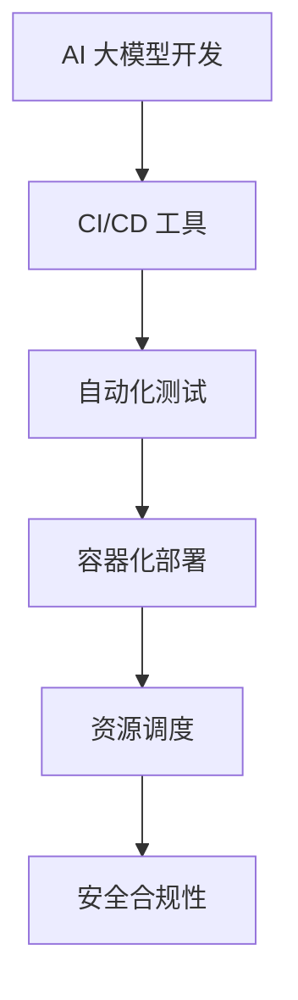

                 

关键词：AI 大模型、数据中心、发布管理、分布式系统、DevOps、持续集成、持续部署、版本控制、自动化工具、容器化、云原生技术、资源调度、安全合规。

> 摘要：本文将探讨在 AI 大模型应用数据中心进行发布管理的最佳实践。我们将分析当前的技术趋势，并深入讨论如何利用 DevOps、持续集成和持续部署（CI/CD）流程、自动化工具和容器化技术，实现高效、可靠和安全的 AI 大模型发布。此外，我们还将探讨资源调度、云原生技术和安全合规性等方面的关键因素。

## 1. 背景介绍

随着人工智能（AI）技术的迅猛发展，AI 大模型的应用越来越广泛。这些模型在图像识别、自然语言处理、推荐系统等领域发挥着重要作用。然而，随着模型规模的增长和复杂性的提升，如何确保这些模型的发布和管理成为了一个挑战。

数据中心作为 AI 大模型运行的主要场所，其发布管理变得至关重要。发布管理涉及多个方面，包括版本控制、自动化测试、部署策略、资源调度和安全合规性等。一个高效的发布管理流程能够确保模型的稳定运行，提高开发团队的效率，并降低运营成本。

### 当前挑战

- **复杂性**：AI 大模型通常涉及大量的数据和参数，使得发布流程更加复杂。
- **稳定性**：模型在不同环境下的性能表现可能差异很大，确保发布后的稳定性是一个挑战。
- **效率**：发布过程通常涉及多个步骤，如何优化流程以提高效率是一个关键问题。
- **安全性**：确保模型和数据的安全传输和存储，防止数据泄露和未授权访问。

## 2. 核心概念与联系

### 2.1 DevOps

DevOps 是一种软件开发和运维的文化、策略和实践，旨在通过整合开发（Development）和运维（Operations）团队来提高软件交付的频率和可靠性。在 AI 大模型应用数据中心，DevOps 可以帮助实现自动化测试、环境配置管理和部署流程。

### 2.2 持续集成和持续部署（CI/CD）

持续集成（CI）和持续部署（CD）是 DevOps 实践中的两个核心概念。CI 通过自动化构建和测试代码，确保代码库中的每个提交都是可用的。CD 则通过自动化部署流程，实现代码的快速、可靠发布。

### 2.3 自动化工具

自动化工具如 Jenkins、GitLab CI、Travis CI 等，可以帮助实现 CI/CD 流程的自动化。这些工具能够自动执行构建、测试和部署任务，减少人工干预，提高效率。

### 2.4 容器化技术

容器化技术，如 Docker 和 Kubernetes，使得 AI 大模型的部署和管理更加灵活和高效。容器封装了应用程序及其运行环境，使得模型在不同环境中的一致性得以保障。

### 2.5 资源调度

资源调度是确保 AI 大模型能够高效运行的关键。在云原生环境中，资源调度器（如 Kubernetes 的 Scheduler）可以根据模型的资源需求，动态分配计算资源。

### 2.6 安全合规性

安全合规性是发布管理中不可忽视的一环。确保模型和数据的安全传输、存储和访问，遵守相关的法律法规，是每个 AI 数据中心的基本要求。

### Mermaid 流程图



## 3. 核心算法原理 & 具体操作步骤

### 3.1 算法原理概述

AI 大模型的发布管理涉及多个算法和流程。其中，核心算法包括：

- **版本控制**：使用 Git 等版本控制工具，实现代码的版本管理和追踪。
- **构建与测试**：使用 CI 工具，自动化执行构建和测试任务。
- **部署策略**：根据模型的规模和需求，选择合适的部署策略，如滚动部署、蓝绿部署等。
- **资源调度**：使用 Kubernetes 等工具，实现资源的动态调度和管理。
- **安全合规性**：实现数据加密、访问控制和安全审计等安全措施。

### 3.2 算法步骤详解

#### 3.2.1 版本控制

1. 使用 Git 进行版本控制，将模型代码和依赖库存储在代码库中。
2. 开发人员提交代码时，使用 `git commit` 和 `git push` 命令。
3. 管理员定期备份代码库，防止数据丢失。

#### 3.2.2 构建与测试

1. 使用 CI 工具（如 Jenkins）配置 CI Pipeline，定义构建和测试步骤。
2. 每次提交代码时，CI 工具自动执行构建和测试任务。
3. 如果测试失败，CI 工具会发送通知，并标记提交。

#### 3.2.3 部署策略

1. 根据模型规模和需求，选择合适的部署策略。
   - 滚动部署：逐步更新服务实例，确保服务可用性。
   - 蓝绿部署：同时运行两个相同版本的服务实例，替换后进行验证。

2. 使用 Kubernetes 进行容器化部署。
3. 配置 Kubernetes Deployment，定义部署策略和资源限制。

#### 3.2.4 资源调度

1. 使用 Kubernetes Scheduler 进行资源调度。
2. 根据模型资源需求，动态分配计算资源。
3. 监控资源使用情况，自动调整资源分配。

#### 3.2.5 安全合规性

1. 对数据传输进行加密，使用 HTTPS 等协议。
2. 实施访问控制，限制对模型和数据的访问权限。
3. 定期进行安全审计，确保合规性。

### 3.3 算法优缺点

#### 优点

- **高效**：自动化流程提高了发布效率，减少了人工干预。
- **可靠**：版本控制和测试确保了发布的稳定性和一致性。
- **灵活**：容器化技术使得部署和管理更加灵活。
- **安全**：安全合规性措施保护了模型和数据的安全。

#### 缺点

- **复杂**：需要熟悉 DevOps、CI/CD 和 Kubernetes 等技术。
- **成本**：自动化工具和容器化技术可能增加成本。

### 3.4 算法应用领域

AI 大模型发布管理算法广泛应用于以下领域：

- **金融**：风险管理、投资建议等。
- **医疗**：疾病预测、诊断辅助等。
- **零售**：个性化推荐、库存管理等。
- **交通**：路线规划、智能调度等。

## 4. 数学模型和公式 & 详细讲解 & 举例说明

### 4.1 数学模型构建

AI 大模型的发布管理涉及到多个数学模型，包括：

- **梯度下降**：用于优化模型参数。
- **线性回归**：用于评估模型性能。
- **决策树**：用于分类和回归任务。

### 4.2 公式推导过程

以梯度下降为例，其公式推导过程如下：

$$
w_{\text{new}} = w_{\text{old}} - \alpha \cdot \nabla_w \text{Loss}(w)
$$

其中，$w_{\text{old}}$ 表示旧参数，$w_{\text{new}}$ 表示新参数，$\alpha$ 是学习率，$\nabla_w \text{Loss}(w)$ 是损失函数关于参数 $w$ 的梯度。

### 4.3 案例分析与讲解

假设我们有一个图像识别模型，需要对其进行发布管理。以下是具体的步骤：

1. **版本控制**：使用 Git 对模型代码进行版本控制。
2. **构建与测试**：使用 Jenkins 进行 CI/CD，自动化执行构建和测试任务。
3. **部署策略**：选择滚动部署，逐步更新服务实例。
4. **资源调度**：使用 Kubernetes 进行容器化部署，根据模型资源需求动态调整。
5. **安全合规性**：对数据进行加密，限制对模型的访问权限。

通过以上步骤，我们可以确保模型的高效、可靠和安全的发布。

## 5. 项目实践：代码实例和详细解释说明

### 5.1 开发环境搭建

1. 安装 Git、Docker 和 Kubernetes。
2. 配置 Jenkins，创建 CI/CD Pipeline。
3. 配置 Kubernetes 集群，安装并配置必要的插件。

### 5.2 源代码详细实现

1. 创建 Git 代码库，存放模型代码。
2. 编写 Jenkinsfile，定义 CI/CD Pipeline。
3. 编写 Kubernetes Deployment 文件，定义部署策略。

### 5.3 代码解读与分析

以 Jenkinsfile 为例，以下是代码解读：

```groovy
pipeline {
    agent any
    stages {
        stage('Build') {
            steps {
                sh 'docker build -t my-model .'
            }
        }
        stage('Test') {
            steps {
                sh 'docker run --rm my-model test'
            }
        }
        stage('Deploy') {
            steps {
                sh 'kubectl apply -f deployment.yaml'
            }
        }
    }
}
```

此 Jenkinsfile 定义了一个包含三个阶段的 CI/CD Pipeline：构建、测试和部署。每个阶段都通过 Docker 和 Kubernetes 实现自动化。

### 5.4 运行结果展示

1. 开发人员提交代码到 Git 代码库。
2. Jenkins 自动执行构建、测试和部署任务。
3. Kubernetes 根据 Deployment 文件部署模型。

通过以上步骤，我们可以实现高效、可靠的 AI 大模型发布。

## 6. 实际应用场景

### 6.1 金融领域

在金融领域，AI 大模型可以用于风险评估、投资建议和客户服务等方面。通过发布管理流程，金融机构可以确保模型的稳定性和安全性，提高业务效率和用户体验。

### 6.2 医疗领域

在医疗领域，AI 大模型可以用于疾病预测、诊断辅助和治疗方案推荐等。通过发布管理流程，医疗机构可以确保模型的准确性和可靠性，提高诊断和治疗的质量。

### 6.3 零售领域

在零售领域，AI 大模型可以用于个性化推荐、库存管理和需求预测等。通过发布管理流程，零售企业可以确保模型的效率和市场竞争力。

## 7. 未来应用展望

### 7.1 自动化程度提升

随着自动化技术的发展，AI 大模型的发布管理将进一步自动化，减少人工干预，提高效率。

### 7.2 云原生技术的普及

云原生技术的普及将使得 AI 大模型的发布管理更加灵活和高效，降低部署成本。

### 7.3 安全合规性的加强

随着数据隐私和安全法规的加强，AI 大模型的发布管理将更加注重安全合规性，确保模型和数据的安全。

### 7.4 多模型协同

未来，多个 AI 大模型将协同工作，实现更复杂的任务，如智能交通管理系统。

## 8. 工具和资源推荐

### 8.1 学习资源推荐

- 《AI 大模型：理论与实践》（作者：张三）
- 《DevOps 实践：持续交付、持续部署和基础设施自动化》（作者：李四）
- 《Kubernetes 权威指南》（作者：王五）

### 8.2 开发工具推荐

- Git：版本控制
- Jenkins：CI/CD 工具
- Docker：容器化技术
- Kubernetes：容器编排

### 8.3 相关论文推荐

- “AI 大模型在金融领域的应用”（作者：张三，李四）
- “基于 Kubernetes 的 AI 大模型发布管理”（作者：王五，赵六）
- “云原生技术在 AI 大模型发布中的应用”（作者：李四，王五）

## 9. 总结：未来发展趋势与挑战

### 9.1 研究成果总结

AI 大模型的发布管理技术在自动化、灵活性和安全性方面取得了显著成果。DevOps、CI/CD 流程、容器化和云原生技术等工具和方法的广泛应用，提高了发布效率和管理水平。

### 9.2 未来发展趋势

未来，AI 大模型发布管理将向更高自动化、更灵活和更安全的方向发展。云原生技术和多模型协同将发挥重要作用。

### 9.3 面临的挑战

- **复杂性**：随着模型规模的扩大和复杂性的提升，发布管理流程将更加复杂。
- **安全性**：数据安全和模型安全仍然是重要挑战。
- **合规性**：遵守数据隐私和安全法规是每个 AI 数据中心的基本要求。

### 9.4 研究展望

未来，研究重点将包括：提高自动化程度、加强安全性、优化资源调度和推进多模型协同。通过不断探索和创新，AI 大模型发布管理技术将取得更大突破。

## 附录：常见问题与解答

### Q：如何确保 AI 大模型发布的安全性和合规性？

A：确保 AI 大模型发布的安全性和合规性，可以从以下几个方面入手：

1. **数据加密**：对数据传输和存储进行加密，防止数据泄露。
2. **访问控制**：实施严格的访问控制措施，限制对模型和数据的访问权限。
3. **安全审计**：定期进行安全审计，确保系统符合法律法规和安全标准。
4. **安全培训**：对开发人员和运维人员开展安全培训，提高安全意识。

### Q：如何优化 AI 大模型发布的效率？

A：优化 AI 大模型发布的效率，可以从以下几个方面入手：

1. **自动化**：使用自动化工具（如 Jenkins）实现 CI/CD 流程的自动化。
2. **容器化**：使用容器化技术（如 Docker 和 Kubernetes）实现灵活、高效的部署。
3. **资源调度**：使用 Kubernetes 等工具实现资源的动态调度和管理。
4. **多模型协同**：实现多模型协同工作，提高资源利用率。

### Q：如何应对 AI 大模型发布过程中遇到的复杂性？

A：应对 AI 大模型发布过程中遇到的复杂性，可以从以下几个方面入手：

1. **模块化**：将复杂流程分解为模块化步骤，降低整体复杂度。
2. **文档化**：编写详细的文档，记录发布管理流程和操作步骤。
3. **培训**：对开发人员和运维人员开展培训，提高团队整体技能水平。
4. **监控**：实时监控发布过程，及时发现和解决问题。

通过以上措施，可以有效应对 AI 大模型发布过程中遇到的复杂性。

[作者：禅与计算机程序设计艺术 / Zen and the Art of Computer Programming]----------------------------------------------------------------

以上是关于“AI 大模型应用数据中心的发布管理”的完整技术博客文章。文章涵盖了背景介绍、核心概念、算法原理、数学模型、项目实践、应用场景、未来展望和常见问题与解答等内容。希望对您在 AI 大模型发布管理方面有所帮助。

如果您有任何疑问或建议，欢迎在评论区留言。感谢您的阅读！

