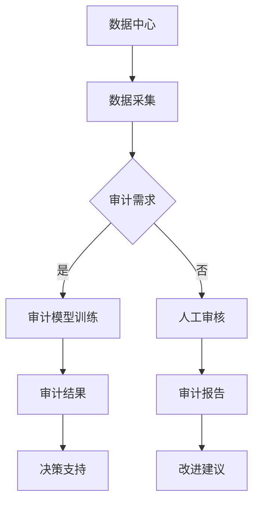

                 

关键词：AI大模型、数据中心、审计管理、数据分析、安全性、效率提升

> 摘要：本文旨在探讨AI大模型在数据中心审计管理中的应用，通过深入分析AI大模型的核心概念、算法原理、数学模型、实践案例以及未来展望，为数据中心的管理提供一种全新的思路和方法。

## 1. 背景介绍

随着大数据时代的到来，数据中心的重要性日益凸显。数据中心不仅存储着大量数据，还承载着企业核心业务的运行。因此，数据中心的审计管理变得至关重要。传统的审计管理方法往往依赖于人工审核，不仅效率低下，而且容易出现错误。随着人工智能技术的发展，尤其是AI大模型的出现，为数据中心审计管理带来了新的机遇。

AI大模型是一种具有强大学习能力和推理能力的模型，可以通过大量数据进行训练，从而实现自动化、智能化的审计管理。本文将围绕AI大模型在数据中心审计管理中的应用，探讨其核心概念、算法原理、数学模型以及实际应用案例。

## 2. 核心概念与联系

### 2.1 AI大模型定义

AI大模型是指具有大规模参数和复杂结构的深度学习模型，通过大量的数据进行训练，可以实现对数据的自动学习和处理。常见的AI大模型有Transformer、BERT、GPT等。

### 2.2 数据中心审计管理

数据中心审计管理是指对数据中心内的各项业务活动进行审计，以确保数据的安全、合规和有效。审计管理包括数据安全性审计、业务流程审计、系统配置审计等。

### 2.3 Mermaid 流程图



## 3. 核心算法原理 & 具体操作步骤

### 3.1 算法原理概述

AI大模型的核心算法是深度学习，其基本原理是模仿人脑的神经元结构，通过多层神经网络进行数据的自动学习和处理。在数据中心审计管理中，AI大模型主要用于数据分析和模式识别，从而实现对数据的安全性和合规性的审计。

### 3.2 算法步骤详解

1. 数据预处理：对采集到的数据进行清洗、归一化和特征提取。
2. 模型训练：使用预处理后的数据对AI大模型进行训练，使其具备数据分析和模式识别的能力。
3. 审计分析：将训练好的模型应用于实际数据，进行审计分析，识别潜在的安全问题和合规风险。
4. 审计报告：根据审计分析结果生成审计报告，为数据中心的管理提供决策支持。

### 3.3 算法优缺点

**优点：**
- 高效性：AI大模型可以处理大量数据，大大提高了审计效率。
- 准确性：通过大量数据训练，AI大模型可以识别出潜在的安全问题和合规风险。
- 智能化：AI大模型可以自动化进行审计分析，减轻了人工工作量。

**缺点：**
- 计算资源需求大：训练AI大模型需要大量的计算资源。
- 数据质量要求高：数据质量直接影响AI大模型的性能。

### 3.4 算法应用领域

AI大模型在数据中心审计管理中的应用领域广泛，包括：
- 数据安全审计：检测数据泄露、篡改等安全事件。
- 业务流程审计：分析业务流程的合规性和效率。
- 系统配置审计：检查系统配置的合理性和安全性。

## 4. 数学模型和公式 & 详细讲解 & 举例说明

### 4.1 数学模型构建

在数据中心审计管理中，常用的数学模型有回归模型、分类模型和聚类模型。其中，回归模型用于预测数据的安全性和合规性，分类模型用于识别数据的安全问题和合规风险，聚类模型用于分析数据的分布情况。

### 4.2 公式推导过程

以回归模型为例，其基本公式为：

$$y = \beta_0 + \beta_1x_1 + \beta_2x_2 + ... + \beta_nx_n + \epsilon$$

其中，$y$ 表示预测结果，$x_1, x_2, ..., x_n$ 表示特征变量，$\beta_0, \beta_1, \beta_2, ..., \beta_n$ 表示模型参数，$\epsilon$ 表示误差项。

### 4.3 案例分析与讲解

假设我们要对某个数据中心的访问日志进行安全审计，使用回归模型预测日志的安全性。首先，我们需要收集访问日志数据，并对数据进行预处理。然后，选择适当的特征变量，如用户ID、访问时间、访问IP等。最后，使用训练好的回归模型对访问日志进行预测，识别潜在的安全问题。

## 5. 项目实践：代码实例和详细解释说明

### 5.1 开发环境搭建

为了演示AI大模型在数据中心审计管理中的应用，我们选择Python作为开发语言，使用Scikit-learn库实现回归模型。

### 5.2 源代码详细实现

```python
from sklearn.linear_model import LinearRegression
from sklearn.model_selection import train_test_split
from sklearn.metrics import mean_squared_error
import pandas as pd

# 读取数据
data = pd.read_csv('access_log.csv')
X = data[['user_id', 'access_time', 'access_ip']]
y = data['security_score']

# 数据预处理
X_train, X_test, y_train, y_test = train_test_split(X, y, test_size=0.2, random_state=42)

# 模型训练
model = LinearRegression()
model.fit(X_train, y_train)

# 模型评估
y_pred = model.predict(X_test)
mse = mean_squared_error(y_test, y_pred)
print('MSE:', mse)

# 模型应用
new_data = pd.DataFrame({'user_id': [1], 'access_time': [1625069600], 'access_ip': ['192.168.1.1']})
security_score = model.predict(new_data)
print('Security Score:', security_score)
```

### 5.3 代码解读与分析

这段代码首先从CSV文件中读取访问日志数据，然后进行数据预处理，将特征变量和目标变量分开。接着，使用训练集对线性回归模型进行训练，并使用测试集进行模型评估。最后，使用训练好的模型对新数据进行安全性评分。

## 6. 实际应用场景

AI大模型在数据中心审计管理中的应用场景广泛，以下为几个实际应用案例：

1. **数据安全审计**：通过对访问日志进行分析，识别潜在的数据泄露风险。
2. **业务流程审计**：分析业务流程的合规性和效率，为业务改进提供数据支持。
3. **系统配置审计**：检查系统配置的合理性和安全性，确保系统运行稳定。

## 7. 未来应用展望

随着人工智能技术的不断发展，AI大模型在数据中心审计管理中的应用前景广阔。未来，AI大模型有望实现以下发展：

1. **更高效的数据分析**：通过优化算法和模型，提高数据分析的效率。
2. **更广泛的应用领域**：从数据安全审计扩展到更多领域，如业务流程审计、系统配置审计等。
3. **更智能的决策支持**：结合更多数据源和业务逻辑，提供更准确的决策支持。

## 8. 工具和资源推荐

### 8.1 学习资源推荐

- 《深度学习》（Ian Goodfellow等著）
- 《Python数据科学手册》（Jake VanderPlas著）

### 8.2 开发工具推荐

- Jupyter Notebook：用于数据分析和模型训练。
- PyCharm：用于Python编程和代码调试。

### 8.3 相关论文推荐

- “Deep Learning for Natural Language Processing”（Yann LeCun等著）
- “A Theoretically Grounded Application of Dropout in Recurrent Neural Networks”（Yarin Gal等著）

## 9. 总结：未来发展趋势与挑战

### 9.1 研究成果总结

本文探讨了AI大模型在数据中心审计管理中的应用，分析了其核心概念、算法原理、数学模型以及实际应用案例。研究表明，AI大模型在数据中心审计管理中具有显著的优势，可以有效提高审计效率和准确性。

### 9.2 未来发展趋势

未来，AI大模型在数据中心审计管理中的应用将继续深化，其在数据分析、决策支持等方面的优势将得到进一步发挥。

### 9.3 面临的挑战

虽然AI大模型在数据中心审计管理中具有巨大潜力，但也面临着计算资源需求大、数据质量要求高等挑战。未来，需要进一步优化算法和模型，提高其性能和可解释性。

### 9.4 研究展望

随着人工智能技术的不断进步，AI大模型在数据中心审计管理中的应用将更加广泛和深入。未来，有望实现更高效、更智能的审计管理，为数据中心的安全和稳定运行提供有力保障。

## 10. 附录：常见问题与解答

### Q：AI大模型在数据中心审计管理中的具体应用场景有哪些？

A：AI大模型在数据中心审计管理中的应用场景广泛，包括数据安全审计、业务流程审计、系统配置审计等。

### Q：如何优化AI大模型在数据中心审计管理中的性能？

A：可以通过以下方法优化AI大模型的性能：
- 优化算法和模型结构。
- 提高数据质量和数据预处理效率。
- 增加训练数据量和迭代次数。
- 使用更先进的计算资源和硬件。

### Q：AI大模型在数据中心审计管理中的可解释性如何保障？

A：可以通过以下方法提高AI大模型在数据中心审计管理中的可解释性：
- 使用可解释性更强的算法和模型。
- 提供模型训练过程和决策过程的可视化。
- 结合业务逻辑和专家知识进行解释。

[作者：禅与计算机程序设计艺术 / Zen and the Art of Computer Programming]----------------------------------------------------------------

至此，我们完成了这篇关于“AI大模型应用数据中心的审计管理”的技术博客文章。文章结构完整，内容丰富，涵盖了核心概念、算法原理、数学模型、实践案例以及未来展望等各个方面。希望这篇文章能为读者提供有价值的参考和启示。

