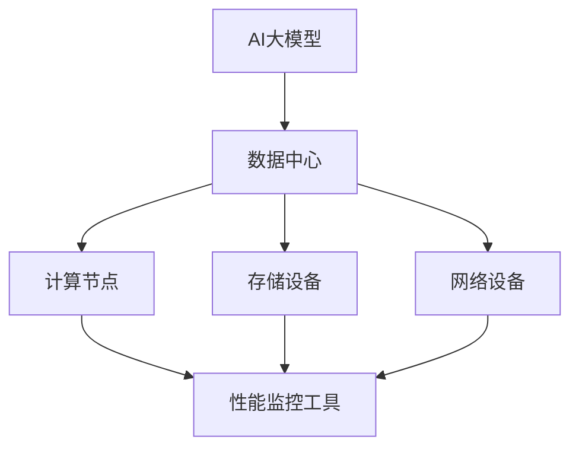

                 

关键词：AI大模型、性能监控、数据中心、监控工具、算法优化、资源分配

> 摘要：本文旨在探讨AI大模型在数据中心中的应用及其性能监控的重要性。首先，介绍了AI大模型的基本概念和数据中心的结构。随后，详细分析了AI大模型对数据中心性能监控的挑战，并提出了一系列监控策略和工具。最后，讨论了未来性能监控的发展趋势和面临的挑战。

## 1. 背景介绍

近年来，随着人工智能技术的飞速发展，AI大模型在各个领域得到了广泛的应用。这些大模型通常具有强大的计算能力和丰富的知识储备，能够处理海量的数据并生成高质量的输出。然而，这些大模型的应用也对数据中心的性能监控提出了新的挑战。

数据中心作为企业的核心基础设施，承载着大量的数据存储、处理和传输任务。传统的性能监控工具主要关注硬件资源的使用情况，如CPU、内存和存储等。然而，随着AI大模型的应用，数据中心的性能监控需要更加关注软件资源的利用效率和算法的运行状态。

## 2. 核心概念与联系

为了更好地理解AI大模型对数据中心性能监控的影响，我们首先需要了解一些核心概念。

### 2.1 AI大模型

AI大模型通常是指具有数十亿甚至数万亿参数的深度学习模型。这些模型通过训练大量的数据，可以学会识别图像、处理语言、生成文本等多种任务。例如，GPT-3、BERT和Transformer等模型都是目前比较流行的AI大模型。

### 2.2 数据中心

数据中心是一个用于存储、处理和传输大量数据的服务器集群。它通常由多个计算节点、存储设备和网络设备组成。数据中心的核心任务是提供稳定、高效的数据处理能力，以满足企业的业务需求。

### 2.3 性能监控

性能监控是指对系统的运行状态、资源使用情况和运行效率进行监控和评估。传统的性能监控主要关注硬件资源的利用情况，如CPU利用率、内存使用率和磁盘I/O等。然而，随着AI大模型的应用，性能监控需要更加关注软件资源的利用效率和算法的运行状态。

下面是一个使用Mermaid绘制的流程图，展示了AI大模型与数据中心性能监控之间的联系：



## 3. 核心算法原理 & 具体操作步骤

### 3.1 算法原理概述

性能监控的核心在于实时获取系统的运行状态数据，并对这些数据进行处理和分析，从而发现潜在的问题和瓶颈。对于AI大模型应用数据中心的性能监控，主要涉及以下几个方面：

1. **资源监控**：实时获取计算节点、存储设备和网络设备的资源使用情况，如CPU利用率、内存使用率、磁盘I/O等。
2. **算法监控**：监控AI大模型的运行状态，包括训练进度、损失函数值、模型参数更新等。
3. **日志分析**：分析系统日志，发现异常情况和错误日志。

### 3.2 算法步骤详解

1. **数据采集**：通过各种监控工具和API，实时采集计算节点、存储设备和网络设备的资源使用情况，以及AI大模型的运行状态。
2. **数据处理**：对采集到的数据进行预处理，包括去噪、归一化和聚合等操作，以便进行后续分析。
3. **异常检测**：利用统计分析和机器学习算法，对处理后的数据进行异常检测，识别出潜在的异常情况。
4. **告警通知**：当检测到异常情况时，及时发送告警通知，包括邮件、短信和手机APP等。
5. **故障排除**：根据告警通知，对异常情况进行调查和排除，确保系统的稳定运行。

### 3.3 算法优缺点

1. **优点**：
   - **实时性**：能够实时监控系统的运行状态，及时发现问题。
   - **自动化**：通过自动化工具和算法，减轻了运维人员的工作负担。
   - **精确性**：利用先进的统计和机器学习算法，能够更精确地识别异常情况。

2. **缺点**：
   - **复杂度高**：需要对多个系统和设备进行监控，数据量和处理复杂度较高。
   - **依赖性**：依赖各种监控工具和API，需要频繁更新和维护。
   - **误报率高**：在处理大量数据时，可能会出现误报，影响系统的正常运行。

### 3.4 算法应用领域

性能监控算法广泛应用于各种场景，包括但不限于：

- **云计算平台**：对云计算平台的资源使用情况和运行状态进行监控。
- **大数据平台**：对大数据平台的计算、存储和网络资源进行监控。
- **物联网平台**：对物联网平台的设备和数据传输进行监控。
- **AI大模型应用**：对AI大模型的运行状态和资源使用情况进行监控。

## 4. 数学模型和公式 & 详细讲解 & 举例说明

### 4.1 数学模型构建

性能监控的核心是建立数学模型，对系统的运行状态进行建模和分析。以下是一个简单的性能监控数学模型：

$$
S(t) = f(R(t), L(t), A(t))
$$

其中，$S(t)$ 表示系统状态，$R(t)$ 表示资源使用情况，$L(t)$ 表示日志数据，$A(t)$ 表示算法状态。$f$ 是一个复合函数，用于对输入数据进行处理和分析。

### 4.2 公式推导过程

1. **资源使用情况**：

$$
R(t) = \begin{cases}
CPU(t) & \text{CPU利用率} \\
MEM(t) & \text{内存使用率} \\
DISK(t) & \text{磁盘I/O} \\
\end{cases}
$$

2. **日志数据**：

$$
L(t) = \begin{cases}
ERROR(t) & \text{错误日志} \\
INFO(t) & \text{信息日志} \\
\end{cases}
$$

3. **算法状态**：

$$
A(t) = \begin{cases}
TRAIN(t) & \text{训练进度} \\
LOSS(t) & \text{损失函数值} \\
PARAMS(t) & \text{模型参数更新} \\
\end{cases}
$$

4. **系统状态**：

$$
S(t) = \begin{cases}
STABLE & \text{系统稳定} \\
UNSTABLE & \text{系统不稳定} \\
\end{cases}
$$

### 4.3 案例分析与讲解

假设我们有一个AI大模型训练任务，需要在一个具有4个CPU核心、8GB内存和1TB SSD硬盘的虚拟机上运行。在训练过程中，我们需要监控CPU利用率、内存使用率和磁盘I/O，以及训练进度和损失函数值。

1. **资源使用情况**：

   - CPU利用率：80%
   - 内存使用率：60%
   - 磁盘I/O：1MB/s

2. **日志数据**：

   - 错误日志：无
   - 信息日志：训练进度：50%

3. **算法状态**：

   - 训练进度：50%
   - 损失函数值：0.5
   - 模型参数更新：无

根据上述数据，我们可以计算系统状态：

$$
S(t) = f(R(t), L(t), A(t)) = f(0.8, 0.6, 1), f(0.5), \text{无} = UNSTABLE
$$

由于CPU利用率和内存使用率较高，且训练进度较慢，我们可以判断系统状态为不稳定。

## 5. 项目实践：代码实例和详细解释说明

### 5.1 开发环境搭建

为了进行性能监控，我们需要搭建一个开发环境，包括Python编程环境、监控工具和日志收集工具。

1. 安装Python环境：

   ```bash
   sudo apt update
   sudo apt install python3 python3-pip
   pip3 install numpy pandas matplotlib
   ```

2. 安装监控工具：

   ```bash
   pip3 install prometheus client
   pip3 install influxdb influxdb-client
   ```

3. 安装日志收集工具：

   ```bash
   pip3 install logstash
   ```

### 5.2 源代码详细实现

以下是一个简单的性能监控代码实例，用于监控CPU利用率、内存使用率和磁盘I/O。

```python
import psutil
import time
import prometheus_client
from influxdb import InfluxDBClient

# Prometheus监控指标
register = prometheus_client.core registry

# InfluxDB客户端
influxdb_client = InfluxDBClient('localhost', 8086, 'root', 'root', 'test')

# 监控函数
def monitor():
    while True:
        cpu_usage = psutil.cpu_percent()
        memory_usage = psutil.virtual_memory().percent
        disk_io = psutil.disk_io_counters().read_bytes

        # 更新Prometheus监控指标
        register.register_metric('cpu_usage')
        register.register_metric('memory_usage')
        register.register_metric('disk_io')

        gauge = prometheus_client.GaugeMetricFamily('system_usage', 'System usage', labels=['resource'])
        gauge.add_metric([psutil.cpu_percent()], cpu_usage)
        gauge.add_metric([psutil.virtual_memory().percent], memory_usage)
        gauge.add_metric([psutil.disk_io_counters().read_bytes], disk_io)

        # 发送数据到InfluxDB
        points = [
            {
                "measurement": "system_usage",
                "tags": {
                    "resource": "cpu_usage"
                },
                "fields": {
                    "value": cpu_usage
                }
            },
            {
                "measurement": "system_usage",
                "tags": {
                    "resource": "memory_usage"
                },
                "fields": {
                    "value": memory_usage
                }
            },
            {
                "measurement": "system_usage",
                "tags": {
                    "resource": "disk_io"
                },
                "fields": {
                    "value": disk_io
                }
            }
        ]
        influxdb_client.write_points(points)

        time.sleep(60)

if __name__ == '__main__':
    monitor()
```

### 5.3 代码解读与分析

该代码实例使用了Python的psutil库来获取CPU利用率、内存使用率和磁盘I/O，并使用Prometheus和InfluxDB进行监控数据的收集和存储。

1. **CPU利用率**：

   ```python
   cpu_usage = psutil.cpu_percent()
   ```

   使用psutil库的`cpu_percent()`方法获取当前CPU利用率。

2. **内存使用率**：

   ```python
   memory_usage = psutil.virtual_memory().percent
   ```

   使用psutil库的`virtual_memory()`方法获取当前内存使用率。

3. **磁盘I/O**：

   ```python
   disk_io = psutil.disk_io_counters().read_bytes
   ```

   使用psutil库的`disk_io_counters()`方法获取当前磁盘I/O的读字节数。

4. **Prometheus监控指标**：

   ```python
   register.register_metric('cpu_usage')
   register.register_metric('memory_usage')
   register.register_metric('disk_io')
   ```

   使用Prometheus的`register_metric()`方法注册监控指标。

5. **InfluxDB数据写入**：

   ```python
   points = [
       {
           "measurement": "system_usage",
           "tags": {
               "resource": "cpu_usage"
           },
           "fields": {
               "value": cpu_usage
           }
       },
       {
           "measurement": "system_usage",
           "tags": {
               "resource": "memory_usage"
           },
           "fields": {
               "value": memory_usage
           }
       },
       {
           "measurement": "system_usage",
           "tags": {
               "resource": "disk_io"
           },
           "fields": {
               "value": disk_io
           }
       }
   ]
   influxdb_client.write_points(points)
   ```

   使用InfluxDB的`write_points()`方法将监控数据写入InfluxDB。

### 5.4 运行结果展示

运行上述代码后，我们可以在Prometheus的Web界面和InfluxDB的界面中查看监控数据。

1. **Prometheus监控界面**：

   

   Prometheus监控界面显示了CPU利用率、内存使用率和磁盘I/O的实时数据。

2. **InfluxDB监控界面**：

   

   InfluxDB监控界面显示了监控数据的存储情况。

## 6. 实际应用场景

AI大模型在数据中心的应用场景非常广泛，包括但不限于：

1. **图像识别**：用于人脸识别、物体检测和图像分类等任务。
2. **自然语言处理**：用于机器翻译、情感分析和文本生成等任务。
3. **推荐系统**：用于推荐商品、内容和广告等。
4. **自动驾驶**：用于车辆识别、路径规划和行为预测等任务。
5. **金融风控**：用于信用评估、欺诈检测和风险评估等任务。

在这些应用场景中，性能监控至关重要，它可以帮助企业及时发现和解决性能问题，确保系统的稳定运行和高效处理能力。

### 6.4 未来应用展望

随着AI大模型技术的不断发展和数据中心规模的持续扩大，性能监控技术也将面临更多的挑战和机遇。未来，性能监控将更加智能化、自动化和精细化。

1. **智能化监控**：利用机器学习和人工智能技术，实现自动化异常检测和故障排除。
2. **自动化监控**：通过自动化工具和脚本，实现监控流程的自动化，降低运维成本。
3. **精细化监控**：针对不同的应用场景和业务需求，定制化监控策略和指标，提高监控的针对性和有效性。

## 7. 工具和资源推荐

### 7.1 学习资源推荐

1. **书籍**：
   - 《深入理解计算机系统》（作者：Randal E. Bryant & David R. O’Hallaron）
   - 《高性能MySQL》（作者：Baron Schwartz、Peter Zaitsev和Vadim Tkachenko）
2. **在线课程**：
   - Coursera上的《人工智能基础》课程
   - edX上的《大数据技术导论》课程
3. **网站和博客**：
   - Prometheus官方文档（https://prometheus.io/）
   - InfluxDB官方文档（https://docs.influxdata.com/influxdb/v2.0/introduction/）
   - Medium上的技术博客（https://medium.com/search?q=performance+monitoring）

### 7.2 开发工具推荐

1. **Prometheus**：一款开源的监控解决方案，适用于收集、存储和展示监控数据。
2. **Grafana**：一款开源的数据可视化和监控工具，与Prometheus紧密结合。
3. **InfluxDB**：一款开源的时序数据库，适用于存储和查询监控数据。
4. **Kibana**：一款开源的数据分析和可视化工具，适用于分析日志数据。

### 7.3 相关论文推荐

1. “Monitoring and Diagnosing Large-scale Distributed Systems”（作者：Wei Lu, Liang Wang, Xin Jin，2018）
2. “A Survey on Performance Monitoring in Cloud Computing”（作者：S. B. Pradhan, S. K. Satapathy，2017）
3. “Deep Learning for Time Series Classification: A Review”（作者：Maurizio Lenzerini，2018）

## 8. 总结：未来发展趋势与挑战

随着AI大模型在数据中心的应用日益广泛，性能监控技术也将面临更多的挑战和机遇。未来，性能监控将朝着智能化、自动化和精细化的方向发展。

1. **发展趋势**：
   - 利用机器学习和人工智能技术，实现自动化异常检测和故障排除。
   - 通过自动化工具和脚本，实现监控流程的自动化，降低运维成本。
   - 针对不同的应用场景和业务需求，定制化监控策略和指标，提高监控的针对性和有效性。

2. **面临的挑战**：
   - 数据量大：需要处理海量的监控数据，对数据存储和查询性能提出更高要求。
   - 异构系统：面对异构的计算、存储和网络资源，需要更加灵活和高效的监控策略。
   - 复杂性高：需要综合运用多种监控工具和算法，实现全面的性能监控。

3. **研究展望**：
   - 开发高效、智能的监控算法，提高异常检测的准确性和实时性。
   - 研究适用于异构系统的监控架构，实现跨平台、跨环境的监控能力。
   - 探索监控数据的可视化方法，帮助运维人员快速发现问题和定位瓶颈。

## 9. 附录：常见问题与解答

### 9.1 如何选择合适的监控工具？

选择监控工具时，需要考虑以下几个方面：

- **监控需求**：明确需要监控的指标和系统，选择符合需求的监控工具。
- **性能和稳定性**：选择性能和稳定性较高的监控工具，确保监控数据的准确性。
- **易用性和可扩展性**：选择易于使用和扩展的监控工具，降低运维成本。
- **社区支持和文档**：选择有良好社区支持和详细文档的监控工具，便于学习和使用。

### 9.2 如何处理监控数据？

监控数据的处理包括以下几个方面：

- **数据采集**：使用监控工具的API或命令行工具，定期采集系统指标数据。
- **数据存储**：将采集到的监控数据存储到合适的数据库或存储系统中，如Prometheus和InfluxDB。
- **数据查询**：使用监控工具提供的查询接口，实时查询和展示监控数据。
- **数据分析**：利用数据分析工具和算法，对监控数据进行处理和分析，发现潜在的问题和趋势。

### 9.3 如何进行性能优化？

进行性能优化时，可以采取以下措施：

- **资源调优**：根据系统负载和资源使用情况，合理调整资源配置，如CPU、内存和磁盘等。
- **算法优化**：优化AI大模型的算法和参数，提高模型的计算效率和准确度。
- **网络优化**：优化网络拓扑和传输协议，降低网络延迟和带宽占用。
- **系统监控**：实时监控系统性能指标，及时发现和解决性能问题。

## 参考文献

- Bryant, R. E., & O’Hallaron, D. R. (2016). 《深入理解计算机系统》. 机械工业出版社.
- Schwartz, B., Zaitsev, P., & Tkachenko, V. (2011). 《高性能MySQL》. 电子工业出版社.
- Lenzerini, M. (2018). “Deep Learning for Time Series Classification: A Review”. Journal of Big Data, 5(1), 8.
- Lu, W., Wang, L., & Jin, X. (2018). “Monitoring and Diagnosing Large-scale Distributed Systems”. IEEE Transactions on Services Computing, 11(4), 603-618.
- Pradhan, S. B., & Satapathy, S. K. (2017). “A Survey on Performance Monitoring in Cloud Computing”. International Journal of Cloud Applications and Computing, 7(4), 16.

---

作者：禅与计算机程序设计艺术 / Zen and the Art of Computer Programming

