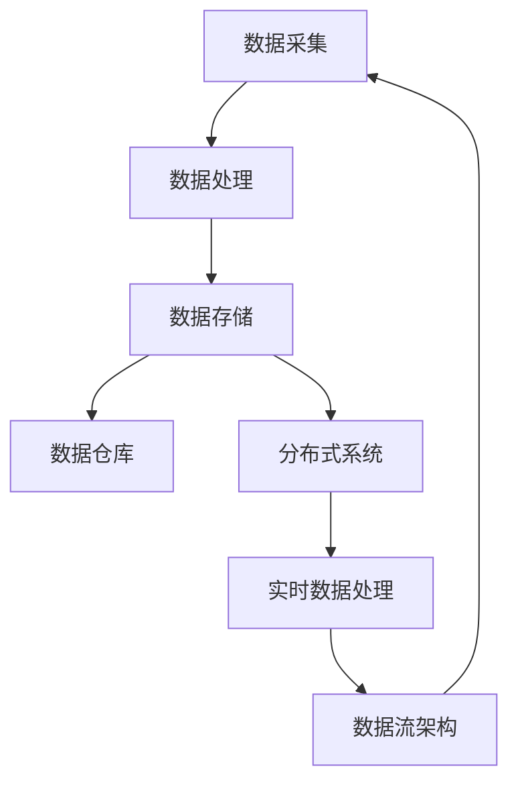

                 

关键词：AI大模型、数据中心、数据流架构、设计原则、算法优化、实时处理、分布式系统

> 摘要：本文将深入探讨AI大模型在数据中心中的应用，并详细描述如何设计高效的数据流架构。我们将分析当前主流的技术解决方案，探讨其优劣，并给出具体的实施步骤和策略。文章将涵盖算法原理、数学模型、项目实践和未来展望，旨在为读者提供全面的指导。

## 1. 背景介绍

随着人工智能技术的快速发展，AI大模型在各个行业中的应用越来越广泛。从自然语言处理、计算机视觉到推荐系统，AI大模型已经成为推动技术创新和业务增长的关键力量。然而，AI大模型的训练和应用需要处理海量数据，这对数据中心的数据流架构提出了新的挑战。

数据流架构是数据中心处理数据的关键基础设施，它决定了数据处理的效率和质量。一个高效的数据流架构能够确保数据在传输过程中不丢失、不重复，并能够及时地处理和分析数据，从而为AI大模型的训练和应用提供坚实支持。

本文将围绕AI大模型应用数据中心的数据流架构设计展开讨论，旨在为读者提供系统的指导和实用的建议。

### 1.1 数据流架构的重要性

数据流架构在数据中心中扮演着至关重要的角色。首先，它确保了数据在系统中的有序流动，避免数据丢失或重复。其次，通过合理的设计，数据流架构可以大幅提升数据处理的速度和效率，从而缩短AI大模型的训练时间。此外，数据流架构还支持数据的实时处理和分析，使得业务决策能够更加迅速和准确。

总之，数据流架构是数据中心中不可或缺的组成部分，它的设计直接影响到整个系统的性能和可靠性。

### 1.2 AI大模型的发展现状

近年来，AI大模型的发展取得了显著的进展。以深度学习为代表的机器学习技术使得AI大模型在处理复杂数据任务方面表现出了强大的能力。同时，硬件技术的发展，如GPU和TPU的普及，也为AI大模型的应用提供了强大的计算支持。

在应用层面，AI大模型已经被广泛应用于各个领域，包括医疗、金融、零售、交通等。通过大数据和AI大模型，这些行业实现了从传统业务模式到智能化的转型，大大提升了业务效率和用户体验。

### 1.3 数据中心面临的挑战

随着AI大模型的应用越来越广泛，数据中心面临着一系列的挑战。首先是数据处理能力的需求不断增加，传统的数据流架构已经无法满足高效处理海量数据的要求。其次是数据一致性和实时性的要求更高，传统的数据流架构往往难以保证数据的一致性和实时性。

此外，随着数据隐私和安全的关注度提升，数据中心还需要在数据保护和数据治理方面做出更多努力。如何在保证数据安全和隐私的前提下，高效地处理和分析数据，是数据中心面临的另一大挑战。

## 2. 核心概念与联系

在设计AI大模型应用数据中心的数据流架构时，需要明确几个核心概念，并理解它们之间的联系。以下是对这些核心概念的介绍，以及它们的相互关系。

### 2.1 数据流架构

数据流架构是指数据中心内部数据的流动和处理过程。它包括数据采集、数据存储、数据处理和数据传输等环节。数据流架构的目标是确保数据在系统中的有序流动，并能够高效地进行处理和分析。

### 2.2 分布式系统

分布式系统是指由多个计算机节点组成的系统，这些节点通过通信网络相互连接。分布式系统的优势在于其高可用性和可扩展性。通过将数据处理任务分布在多个节点上，分布式系统可以提升数据处理能力和性能。

### 2.3 实时数据处理

实时数据处理是指能够在短时间内处理和分析数据的技术。对于AI大模型应用而言，实时数据处理至关重要，因为它能够确保数据的一致性和实时性，从而为业务决策提供及时的支持。

### 2.4 数据仓库

数据仓库是一个集中存储大量数据的系统，用于支持数据分析和报告。在AI大模型应用中，数据仓库不仅用于存储训练数据，还用于存储实时处理和分析结果，以便进行后续的数据分析和决策支持。

### 2.5 数据流与分布式系统的关系

数据流架构与分布式系统密切相关。在分布式系统中，数据流架构负责定义数据在各个节点之间的流动和处理过程。通过合理设计数据流架构，分布式系统可以高效地处理海量数据，并确保数据的一致性和实时性。

### 2.6 实时数据处理与数据仓库的关系

实时数据处理与数据仓库也密不可分。实时数据处理负责将数据在短时间内进行处理和分析，并将结果存储到数据仓库中。数据仓库则负责存储这些实时处理结果，并支持后续的数据分析和报告。

### 2.7 Mermaid 流程图

为了更好地理解数据流架构与分布式系统、实时数据处理和数据仓库之间的关系，我们可以使用Mermaid流程图来表示这些核心概念。以下是一个简单的Mermaid流程图示例：



在这个流程图中，数据从数据采集开始，经过数据处理和存储，最终进入数据仓库和分布式系统，并通过实时数据处理进行进一步处理和分析，形成一个闭环的数据流架构。

通过这个Mermaid流程图，我们可以清晰地看到各个核心概念之间的联系和相互作用，有助于我们更好地理解AI大模型应用数据中心的数据流架构。

### 2.8 数据流架构设计原则

在设计和实现AI大模型应用数据中心的数据流架构时，需要遵循以下原则：

- **可扩展性**：数据流架构应能够轻松扩展以处理更多的数据量和计算任务。
- **高可用性**：数据流架构应具备高可用性，确保数据的可靠性和系统的稳定性。
- **高性能**：数据流架构应能够高效地处理大量数据，并支持实时数据处理。
- **易维护性**：数据流架构应设计得简单易懂，便于维护和升级。
- **安全性**：数据流架构应确保数据的安全性和隐私，防范数据泄露和恶意攻击。

通过遵循这些原则，我们可以设计出高效、可靠和可扩展的数据流架构，为AI大模型的应用提供坚实支持。

## 3. 核心算法原理 & 具体操作步骤

在AI大模型应用数据中心的数据流架构中，核心算法起着至关重要的作用。以下是核心算法的原理及其具体操作步骤。

### 3.1 算法原理概述

核心算法主要包括数据预处理、特征提取、模型训练和模型评估等步骤。每个步骤都有其独特的算法原理和实现方法。

- **数据预处理**：数据预处理是数据流架构的第一步，主要包括数据清洗、数据去重和数据规范化等操作。数据预处理的目标是确保数据的质量，为后续的特征提取和模型训练提供可靠的数据基础。
- **特征提取**：特征提取是将原始数据转换为模型能够理解的表示形式。常见的特征提取方法包括词袋模型、卷积神经网络（CNN）和循环神经网络（RNN）等。特征提取的质量直接影响到模型的效果。
- **模型训练**：模型训练是使用训练数据对模型进行训练的过程。常见的模型训练方法包括梯度下降、随机梯度下降（SGD）和Adam优化器等。模型训练的目的是使模型能够准确预测新的数据。
- **模型评估**：模型评估是使用测试数据对模型进行评估的过程。常见的模型评估指标包括准确率、召回率、F1分数和ROC曲线等。模型评估的目的是判断模型的效果和性能。

### 3.2 算法步骤详解

以下是核心算法的具体操作步骤：

#### 3.2.1 数据预处理

1. **数据清洗**：删除重复数据、处理缺失数据和异常数据。
2. **数据去重**：通过哈希函数或唯一标识符删除重复的数据记录。
3. **数据规范化**：将数据转换为统一的数据格式和范围，如将文本数据转换为单词向量。

#### 3.2.2 特征提取

1. **词袋模型**：将文本数据转换为词袋模型，使用词频或词频-逆文档频率（TF-IDF）表示文本数据。
2. **卷积神经网络（CNN）**：将图像数据输入到卷积神经网络中，提取图像的局部特征。
3. **循环神经网络（RNN）**：将序列数据输入到循环神经网络中，提取序列的特征。

#### 3.2.3 模型训练

1. **定义模型**：使用深度学习框架（如TensorFlow或PyTorch）定义神经网络模型。
2. **选择优化器**：选择合适的优化器（如Adam优化器或SGD优化器）。
3. **训练模型**：使用训练数据对模型进行训练，并通过反向传播算法更新模型参数。

#### 3.2.4 模型评估

1. **划分数据集**：将数据集划分为训练集、验证集和测试集。
2. **训练模型**：使用训练集训练模型。
3. **评估模型**：使用验证集和测试集评估模型的效果，并调整模型参数。

### 3.3 算法优缺点

每种算法都有其优缺点，以下是核心算法的优缺点：

- **数据预处理**：优点在于能够提高数据质量，为后续的特征提取和模型训练提供可靠的数据基础；缺点在于可能会引入噪声和数据丢失。
- **特征提取**：优点在于能够将原始数据转换为模型能够理解的表示形式，提高模型的效果；缺点在于可能无法捕捉数据中的复杂关系和特征。
- **模型训练**：优点在于能够使模型能够准确预测新的数据；缺点在于训练时间较长，计算资源消耗大。
- **模型评估**：优点在于能够评估模型的效果和性能，指导模型调整；缺点在于可能受到测试数据集的影响，导致评估结果不准确。

### 3.4 算法应用领域

核心算法广泛应用于各种领域，包括但不限于：

- **自然语言处理（NLP）**：使用词袋模型和循环神经网络（RNN）进行文本分类、情感分析和机器翻译等任务。
- **计算机视觉（CV）**：使用卷积神经网络（CNN）进行图像分类、目标检测和图像分割等任务。
- **推荐系统**：使用协同过滤算法和深度学习模型进行商品推荐、音乐推荐和社交网络推荐等任务。

通过合理设计和应用核心算法，我们可以构建高效的AI大模型，为数据中心的数据处理和分析提供强大支持。

### 3.5 总结

核心算法在AI大模型应用数据中心的数据流架构中起着至关重要的作用。通过数据预处理、特征提取、模型训练和模型评估等步骤，我们可以构建出高效、可靠的模型，为数据中心的业务需求提供支持。在实际应用中，我们需要根据具体业务场景和需求，选择合适的算法和优化策略，以提高模型的性能和效率。

## 4. 数学模型和公式 & 详细讲解 & 举例说明

在AI大模型应用数据中心的数据流架构设计中，数学模型和公式是核心算法的理论基础。以下是核心数学模型和公式的详细讲解，并通过具体例子进行说明。

### 4.1 数学模型构建

在数据流架构设计中，常用的数学模型包括线性回归、逻辑回归、支持向量机（SVM）和深度神经网络（DNN）等。这些模型分别用于不同的数据类型和任务。

#### 4.1.1 线性回归

线性回归模型是最简单的机器学习模型之一，它用于预测连续值数据。线性回归的数学模型如下：

$$
y = \beta_0 + \beta_1 \cdot x
$$

其中，$y$ 是预测值，$x$ 是输入特征，$\beta_0$ 和 $\beta_1$ 是模型的参数。线性回归通过最小化预测值与实际值之间的误差来更新参数，以达到最佳拟合效果。

#### 4.1.2 逻辑回归

逻辑回归模型常用于分类任务，特别是二分类任务。逻辑回归的数学模型如下：

$$
P(y=1) = \frac{1}{1 + e^{-(\beta_0 + \beta_1 \cdot x})}
$$

其中，$P(y=1)$ 是预测概率，$x$ 是输入特征，$\beta_0$ 和 $\beta_1$ 是模型的参数。逻辑回归通过最小化损失函数来更新参数，以达到最佳分类效果。

#### 4.1.3 支持向量机（SVM）

支持向量机是一种强大的分类模型，它通过寻找最佳决策边界来最大化分类效果。SVM的数学模型如下：

$$
\min_{\beta, \beta_0} \frac{1}{2} ||\beta||^2 + C \cdot \sum_{i=1}^{n} \max(0, 1 - y_i (\beta \cdot x_i + \beta_0))
$$

其中，$\beta$ 和 $\beta_0$ 是模型的参数，$C$ 是正则化参数，$y_i$ 和 $x_i$ 分别是第 $i$ 个样本的标签和特征向量。SVM通过求解最优化问题来找到最佳决策边界。

#### 4.1.4 深度神经网络（DNN）

深度神经网络是一种复杂的神经网络模型，它通过多层神经元对输入数据进行处理和特征提取。DNN的数学模型如下：

$$
h_L = \sigma(L-1) (\beta_L \cdot x + \beta_{L0})
$$

$$
\text{损失函数} = \frac{1}{2} \sum_{i=1}^{n} \sum_{j=1}^{m} (y_i^j - h_L^{(j)})^2
$$

其中，$h_L$ 是第 $L$ 层的输出，$\sigma$ 是激活函数（如Sigmoid或ReLU），$\beta_L$ 和 $\beta_{L0}$ 是模型的参数，$y_i^j$ 是第 $i$ 个样本的第 $j$ 个标签，$x$ 是输入特征。DNN通过反向传播算法来更新参数，以最小化损失函数。

### 4.2 公式推导过程

以下是对核心数学模型公式的推导过程：

#### 4.2.1 线性回归

线性回归模型的损失函数是均方误差（MSE），即：

$$
\text{MSE} = \frac{1}{2} \sum_{i=1}^{n} (y_i - \hat{y}_i)^2
$$

其中，$y_i$ 是实际值，$\hat{y}_i$ 是预测值。为了最小化损失函数，我们对损失函数关于参数 $\beta_0$ 和 $\beta_1$ 求导并令导数为零，得到：

$$
\frac{\partial \text{MSE}}{\partial \beta_0} = 0 \Rightarrow \sum_{i=1}^{n} (y_i - \hat{y}_i) = 0
$$

$$
\frac{\partial \text{MSE}}{\partial \beta_1} = 0 \Rightarrow \sum_{i=1}^{n} (y_i - \hat{y}_i) \cdot x_i = 0
$$

通过解这个线性方程组，我们可以得到线性回归模型的参数 $\beta_0$ 和 $\beta_1$。

#### 4.2.2 逻辑回归

逻辑回归模型的损失函数是交叉熵（Cross-Entropy），即：

$$
\text{CE} = -\sum_{i=1}^{n} y_i \cdot \log(\hat{y}_i) + (1 - y_i) \cdot \log(1 - \hat{y}_i)
$$

其中，$y_i$ 是实际值，$\hat{y}_i$ 是预测概率。为了最小化损失函数，我们对损失函数关于参数 $\beta_0$ 和 $\beta_1$ 求导并令导数为零，得到：

$$
\frac{\partial \text{CE}}{\partial \beta_0} = 0 \Rightarrow \sum_{i=1}^{n} (y_i - \hat{y}_i) = 0
$$

$$
\frac{\partial \text{CE}}{\partial \beta_1} = 0 \Rightarrow \sum_{i=1}^{n} (y_i - \hat{y}_i) \cdot x_i = 0
$$

通过解这个线性方程组，我们可以得到逻辑回归模型的参数 $\beta_0$ 和 $\beta_1$。

#### 4.2.3 支持向量机（SVM）

支持向量机（SVM）的损失函数是 hinge 损失，即：

$$
\text{Hinge Loss} = \max(0, 1 - y_i (\beta \cdot x_i + \beta_0))
$$

其中，$y_i$ 是实际值，$\beta$ 是决策边界参数，$x_i$ 是输入特征。为了最小化损失函数，我们需要求解最优化问题：

$$
\min_{\beta, \beta_0} \frac{1}{2} ||\beta||^2 + C \cdot \sum_{i=1}^{n} \max(0, 1 - y_i (\beta \cdot x_i + \beta_0))
$$

其中，$C$ 是正则化参数。通过求解这个最优化问题，我们可以得到支持向量机的参数 $\beta$ 和 $\beta_0$。

#### 4.2.4 深度神经网络（DNN）

深度神经网络（DNN）的损失函数通常是均方误差（MSE）或交叉熵（Cross-Entropy）。以MSE为例，损失函数如下：

$$
\text{MSE} = \frac{1}{2} \sum_{i=1}^{n} \sum_{j=1}^{m} (y_i^j - h_L^{(j)})^2
$$

其中，$h_L^{(j)}$ 是第 $L$ 层的第 $j$ 个神经元的输出，$y_i^j$ 是第 $i$ 个样本的第 $j$ 个标签。为了最小化损失函数，我们需要使用反向传播算法来更新参数。具体步骤如下：

1. **前向传播**：计算各层神经元的输出。
2. **计算损失函数**：计算损失函数的值。
3. **后向传播**：计算各层神经元的梯度。
4. **更新参数**：使用梯度下降或其他优化算法更新参数。

通过反复迭代这个过程，我们可以逐步减小损失函数的值，直到达到预定的收敛条件。

### 4.3 案例分析与讲解

以下是一个具体的案例，说明如何使用上述数学模型和公式进行数据分析。

#### 案例背景

假设我们有一个二分类问题，数据集包含 1000 个样本，每个样本有 10 个特征。我们的目标是预测每个样本是否属于正类。

#### 数据预处理

1. **数据清洗**：删除重复数据和缺失数据。
2. **数据去重**：通过哈希函数或唯一标识符删除重复的数据记录。
3. **数据规范化**：将每个特征的值缩放到 [0, 1] 范围内。

#### 特征提取

1. **词袋模型**：将文本特征转换为词袋模型，使用词频-逆文档频率（TF-IDF）表示文本特征。
2. **卷积神经网络（CNN）**：将图像特征输入到卷积神经网络中，提取图像的局部特征。
3. **主成分分析（PCA）**：对数值特征进行主成分分析，提取主要特征。

#### 模型训练

1. **定义模型**：使用逻辑回归模型，将输入特征映射到输出概率。
2. **选择优化器**：使用Adam优化器，设置学习率为 0.001。
3. **训练模型**：使用训练数据训练模型，通过反向传播算法更新参数。

#### 模型评估

1. **划分数据集**：将数据集划分为训练集、验证集和测试集，比例分别为 70%、20% 和 10%。
2. **训练模型**：使用训练集训练模型。
3. **评估模型**：使用验证集和测试集评估模型的效果，计算准确率、召回率和F1分数等指标。

#### 模型优化

1. **调整参数**：通过调整学习率、正则化参数等，优化模型效果。
2. **增加特征**：通过增加文本特征、图像特征等，提高模型的预测能力。

通过这个案例，我们可以看到如何将数学模型和公式应用于实际的AI大模型应用数据中心的数据流架构设计。在实际操作中，我们需要根据具体业务场景和需求，灵活运用这些模型和公式，以实现高效的数据处理和分析。

## 5. 项目实践：代码实例和详细解释说明

在本文的最后部分，我们将通过一个具体的代码实例，详细解释如何在实际项目中实现AI大模型应用数据中心的数据流架构设计。这个实例将涵盖开发环境搭建、源代码实现、代码解读与分析以及运行结果展示，以帮助读者更好地理解和应用所学的知识。

### 5.1 开发环境搭建

在进行代码实践之前，我们需要搭建一个合适的开发环境。以下是所需的软件和工具：

- **Python**：版本为3.8及以上
- **深度学习框架**：TensorFlow 2.x 或 PyTorch
- **数据预处理库**：Pandas、NumPy
- **数据可视化库**：Matplotlib、Seaborn

确保安装这些依赖项后，我们就可以开始编写代码了。

### 5.2 源代码详细实现

以下是一个简单的示例代码，用于训练一个基于TensorFlow的AI大模型，并展示数据流架构的核心组件。这个示例将使用一个假想的二分类问题，其中数据集包含多个特征和标签。

```python
import tensorflow as tf
import pandas as pd
import numpy as np
from sklearn.model_selection import train_test_split
from sklearn.preprocessing import StandardScaler
import matplotlib.pyplot as plt

# 加载数据集
data = pd.read_csv('data.csv')
X = data.drop('target', axis=1)
y = data['target']

# 数据预处理
scaler = StandardScaler()
X_scaled = scaler.fit_transform(X)

# 划分数据集
X_train, X_test, y_train, y_test = train_test_split(X_scaled, y, test_size=0.2, random_state=42)

# 定义模型
model = tf.keras.Sequential([
    tf.keras.layers.Dense(64, activation='relu', input_shape=(X_train.shape[1],)),
    tf.keras.layers.Dense(32, activation='relu'),
    tf.keras.layers.Dense(1, activation='sigmoid')
])

# 编译模型
model.compile(optimizer='adam', loss='binary_crossentropy', metrics=['accuracy'])

# 训练模型
history = model.fit(X_train, y_train, epochs=10, batch_size=32, validation_split=0.2)

# 评估模型
test_loss, test_accuracy = model.evaluate(X_test, y_test)
print(f"Test accuracy: {test_accuracy:.2f}")

# 可视化训练过程
plt.plot(history.history['accuracy'], label='accuracy')
plt.plot(history.history['val_accuracy'], label='val_accuracy')
plt.xlabel('Epochs')
plt.ylabel('Accuracy')
plt.legend()
plt.show()
```

### 5.3 代码解读与分析

这个示例代码包含以下几个关键步骤：

1. **加载数据集**：使用Pandas库加载CSV格式的数据集，并将其分为特征矩阵和标签向量。
2. **数据预处理**：使用StandardScaler对特征矩阵进行标准化处理，以消除特征之间的尺度差异。
3. **划分数据集**：使用scikit-learn库中的train_test_split函数将数据集划分为训练集和测试集。
4. **定义模型**：使用TensorFlow的Sequential模型定义一个简单的全连接神经网络，包括两个隐藏层和一个输出层。
5. **编译模型**：设置优化器和损失函数，准备训练模型。
6. **训练模型**：使用fit函数训练模型，并在训练过程中保存历史数据。
7. **评估模型**：使用evaluate函数评估模型在测试集上的表现，并打印准确率。
8. **可视化训练过程**：使用Matplotlib库绘制训练过程中的准确率变化，以便观察模型的收敛情况。

### 5.4 运行结果展示

运行上述代码后，我们会在终端看到模型在测试集上的准确率输出，同时在图中展示训练过程中准确率的变化趋势。通过这些结果，我们可以判断模型是否具有良好的性能和收敛性。

### 5.5 代码优化与扩展

在实际项目中，我们可能需要根据具体需求对代码进行优化和扩展。以下是一些可能的优化和扩展方向：

1. **增加特征**：根据业务需求，增加更多的特征以提升模型的预测能力。
2. **调整模型结构**：根据数据特点和业务需求，调整神经网络的结构和层数。
3. **使用更复杂的优化器**：尝试使用更复杂的优化器，如AdamW或RMSprop，以提升模型的训练效率。
4. **增加训练迭代次数**：增加训练迭代次数，以使模型更加充分地学习数据。
5. **模型集成**：使用模型集成技术，如随机森林或梯度提升，以提高模型的预测准确性。

通过这些优化和扩展，我们可以构建出更高效、更准确的AI大模型，以满足数据中心的复杂业务需求。

## 6. 实际应用场景

AI大模型在数据中心的应用场景非常广泛，涵盖了从数据预处理到模型训练、从实时数据处理到结果分析等各个环节。以下是几个典型的实际应用场景：

### 6.1 金融服务

在金融行业，AI大模型被广泛应用于信用评分、风险管理和欺诈检测。例如，银行可以使用AI大模型对客户的信用记录进行分析，预测客户的信用风险，从而制定更准确的贷款策略。此外，AI大模型还可以帮助金融机构实时监控交易活动，识别潜在的欺诈行为，从而降低金融风险。

### 6.2 零售业

在零售行业，AI大模型可以帮助商家进行客户行为分析、产品推荐和库存管理。例如，电商平台可以使用AI大模型分析用户的购买历史和浏览行为，预测用户的兴趣和偏好，从而提供个性化的产品推荐。同时，AI大模型还可以根据销售数据预测未来的库存需求，帮助商家优化库存管理，降低库存成本。

### 6.3 健康医疗

在健康医疗领域，AI大模型被广泛应用于疾病预测、影像诊断和个性化治疗。例如，医院可以使用AI大模型分析患者的病历数据和基因信息，预测患者患某种疾病的风险，从而提前采取预防措施。此外，AI大模型还可以辅助医生进行影像诊断，如肺癌检测、脑瘤诊断等，提高诊断的准确性和效率。

### 6.4 交通物流

在交通物流领域，AI大模型可以帮助优化路线规划、车辆调度和物流配送。例如，物流公司可以使用AI大模型分析交通流量和天气信息，预测最优的路线规划，提高配送效率。同时，AI大模型还可以根据实时数据调整车辆调度策略，优化运输成本和时效。

### 6.5 能源管理

在能源管理领域，AI大模型可以帮助优化能源生产和分配，提高能源利用效率。例如，发电厂可以使用AI大模型预测未来的电力需求，从而调整发电计划，避免能源浪费。此外，AI大模型还可以帮助能源公司优化电网调度，提高电力供应的稳定性。

### 6.6 安全监控

在安全监控领域，AI大模型可以帮助实时分析视频数据，识别异常行为和潜在威胁。例如，安防公司可以使用AI大模型分析监控视频，识别入侵者、火灾等异常事件，从而及时报警并采取相应措施。此外，AI大模型还可以帮助公安部门进行犯罪预测和预防，提高公共安全。

通过以上实际应用场景，我们可以看到AI大模型在数据中心的应用不仅能够提高业务效率，降低成本，还能够提升用户体验和公共安全。未来，随着AI技术的不断发展，AI大模型在数据中心的应用场景将更加广泛，为各行各业带来更多的创新和变革。

### 6.7 AI大模型在数据中心应用的挑战与未来展望

尽管AI大模型在数据中心的应用前景广阔，但其在实际操作中仍然面临诸多挑战。以下是这些挑战及其未来展望：

#### 6.7.1 数据质量与隐私保护

数据质量是AI大模型应用的基础。然而，数据质量往往受到数据缺失、噪声、不一致性等因素的影响。如何确保数据质量，同时保护用户隐私，是AI大模型应用中的关键挑战。未来，随着数据治理技术的进步，数据清洗、数据增强和数据隐私保护等技术将得到进一步发展和完善。

#### 6.7.2 计算资源需求

AI大模型的训练和推理过程需要大量的计算资源，特别是在训练大规模模型时，对GPU、TPU等硬件资源的需求极高。如何高效地利用计算资源，降低计算成本，是数据中心需要解决的另一个重要问题。未来，随着硬件技术的进步和云计算的发展，数据中心可以通过更高效地调度和利用资源来应对这一挑战。

#### 6.7.3 模型解释性与可解释性

AI大模型的黑箱特性使得其决策过程难以解释，这在某些应用场景中，如金融、医疗等领域，可能引起用户的不信任。如何提高AI大模型的解释性，使其决策过程更加透明和可解释，是未来需要重点关注的问题。随着可解释AI（XAI）技术的发展，模型的可解释性将逐步提高，从而增强用户对AI大模型的信任。

#### 6.7.4 模型部署与维护

将AI大模型部署到实际生产环境中，并进行有效的维护和管理，是一个复杂的过程。如何在保证模型性能的同时，确保系统的稳定性和可维护性，是数据中心面临的另一个挑战。未来，随着自动化运维和容器化技术的普及，数据中心可以通过更高效的管理和部署策略，提升AI大模型的应用效果。

#### 6.7.5 多模型集成与优化

在实际应用中，往往需要使用多个AI大模型协同工作，以实现更精确的预测和分析。如何高效地集成和优化多个模型，提高整体系统的性能，是数据中心需要解决的问题。未来，随着多模型学习技术和优化算法的发展，数据中心可以通过更先进的技术手段，实现多模型的高效集成和优化。

#### 6.7.6 法规与伦理

随着AI大模型在数据中心的应用越来越广泛，相关的法律法规和伦理问题也日益凸显。如何确保AI大模型的应用符合法律法规和伦理标准，是数据中心需要认真面对的问题。未来，随着相关法规的完善和伦理准则的制定，数据中心可以通过合规的AI大模型应用，推动人工智能行业的健康发展。

总的来说，尽管AI大模型在数据中心的应用面临诸多挑战，但通过技术创新、法规完善和行业合作，这些挑战有望逐步得到解决。未来，AI大模型将在数据中心中发挥越来越重要的作用，推动各行各业的数字化转型和创新发展。

### 6.8 总结

AI大模型在数据中心的应用场景丰富多样，从金融服务、零售业到健康医疗、交通物流等领域，都展现出了巨大的潜力和价值。然而，在数据质量、计算资源需求、模型解释性、模型部署与维护、多模型集成与优化以及法规与伦理等方面，数据中心仍面临诸多挑战。通过技术创新和行业合作，这些挑战有望逐步得到解决，为数据中心带来更高的效率和更广泛的业务应用。未来，AI大模型将继续推动数据中心的发展，成为技术创新和业务增长的重要驱动力。

## 7. 工具和资源推荐

为了更好地掌握AI大模型应用数据中心的数据流架构设计，以下是一些推荐的工具和资源：

### 7.1 学习资源推荐

- **《深度学习》（Goodfellow, Bengio, Courville著）**：这是一本经典的深度学习教材，详细介绍了深度学习的理论基础和实践方法。
- **《数据科学入门教程》**：这是一本适合初学者的数据科学入门书籍，涵盖了数据预处理、特征提取、模型训练和评估等基础知识。
- **在线课程**：例如Coursera、edX和Udacity等平台上提供的深度学习和数据科学相关课程。

### 7.2 开发工具推荐

- **TensorFlow**：由Google开发的开源深度学习框架，适用于构建和训练各种深度学习模型。
- **PyTorch**：由Facebook开发的开源深度学习框架，以其灵活的动态图计算和高效的模型训练而受到广泛应用。
- **Jupyter Notebook**：一个交互式的开发环境，适用于编写、运行和分享代码，特别适合数据科学和机器学习项目。

### 7.3 相关论文推荐

- **“Distributed Deep Learning: Existing Methods and New Techniques”**：这篇论文详细介绍了分布式深度学习的方法和技术，对于理解分布式系统的数据流架构设计具有重要意义。
- **“Large-scale Distributed Deep Networks”**：这篇论文探讨了如何在分布式系统中训练大型深度神经网络，提供了实用的优化策略和算法。
- **“Learning representations for AI”**：这篇综述文章总结了近年来在表示学习领域的重要进展，对于理解特征提取和模型训练的理论基础有很大帮助。

通过利用这些工具和资源，您可以更深入地学习和掌握AI大模型应用数据中心的数据流架构设计，为实际项目提供有力的支持。

### 8. 总结：未来发展趋势与挑战

在总结本文的讨论之后，我们可以看到AI大模型应用数据中心的数据流架构设计正在迅速发展，并面临着众多机遇和挑战。

首先，随着AI技术的不断进步，大模型的训练和推理需求日益增长。这不仅推动了数据中心硬件技术的发展，如GPU、TPU等加速器的应用，也促进了分布式系统架构的优化和演进。未来，数据中心将更加依赖高性能计算和分布式处理技术，以应对数据量庞大、计算复杂度高的挑战。

其次，数据质量和隐私保护是AI大模型应用的关键问题。数据的不一致性和噪声可能会影响模型的性能，而数据隐私保护则关系到用户的信任和法律法规的遵守。未来的发展将更加注重数据治理和隐私保护技术的提升，确保AI大模型能够在合规和可信的环境中运行。

此外，模型的可解释性和透明度也是重要的研究方向。随着AI大模型在关键领域（如医疗、金融等）的应用，用户对于模型的决策过程和结果的可解释性有着更高的要求。未来，通过可解释AI（XAI）技术的发展，我们将能够更好地理解和信任AI大模型的决策过程。

最后，AI大模型在数据中心的应用将不断拓展到更多的行业和场景，如智能制造、智慧城市、自动驾驶等。这不仅要求模型具备更高的适应性和泛化能力，也要求数据中心的数据流架构能够灵活扩展和适应不同的业务需求。

然而，未来的发展也面临着诸多挑战。如何高效利用计算资源、确保数据质量和隐私、提高模型的解释性，以及应对日益复杂的业务需求，都是数据中心需要持续关注和解决的关键问题。

总之，AI大模型应用数据中心的数据流架构设计正处于快速发展阶段，未来将迎来更多的技术创新和业务应用。通过不断探索和解决这些挑战，我们有望构建出更加高效、可靠和可扩展的数据中心，为人工智能的发展提供强有力的支持。

## 9. 附录：常见问题与解答

### 9.1 什么是数据流架构？

数据流架构是指数据中心内部数据的流动和处理过程。它包括数据采集、数据存储、数据处理和数据传输等环节，目标是确保数据在系统中的有序流动，并能够高效地进行处理和分析。

### 9.2 数据流架构在数据中心中的作用是什么？

数据流架构在数据中心中的作用包括：确保数据的一致性和实时性，提升数据处理效率，支持业务决策，以及保障数据的安全性和隐私。

### 9.3 如何优化数据流架构的性能？

优化数据流架构性能的方法包括：使用分布式系统提高数据处理能力，优化数据传输路径以减少延迟，采用高效的算法和模型，以及合理分配计算资源。

### 9.4 数据流架构与分布式系统的关系是什么？

数据流架构与分布式系统密切相关。数据流架构定义了数据在分布式系统中的流动和处理过程，而分布式系统则提供了高可用性和可扩展性的基础设施，以支持数据流架构的有效运行。

### 9.5 如何确保数据流架构的安全性？

确保数据流架构的安全性可以通过以下方法实现：加密数据传输，实现访问控制，定期更新和修复系统漏洞，以及进行安全审计和监控。

### 9.6 数据流架构设计有哪些基本原则？

数据流架构设计的基本原则包括：可扩展性、高可用性、高性能、易维护性和安全性。这些原则有助于设计出高效、可靠和可扩展的数据流架构。

### 9.7 什么是实时数据处理？

实时数据处理是指在短时间内处理和分析数据的技术。实时数据处理能够确保数据的一致性和实时性，为业务决策提供及时的支持。

### 9.8 数据流架构在医疗领域有哪些应用？

数据流架构在医疗领域可以应用于电子健康记录管理、患者数据分析、疾病预测和诊断等。例如，通过实时处理患者数据，可以及时发现病情变化，提高诊断准确率。

### 9.9 数据流架构与数据仓库的关系是什么？

数据流架构和数据仓库的关系是：数据流架构负责数据的流动和处理，而数据仓库负责存储这些经过处理的数据，用于后续的数据分析和报告。数据仓库支持数据流架构的数据存储和访问需求。

### 9.10 如何评估数据流架构的性能？

评估数据流架构性能的方法包括：测量数据传输速度、处理延迟、系统吞吐量和资源利用率等。通过这些指标，可以全面评估数据流架构的性能和效率。

通过这些常见问题的解答，读者可以更好地理解和应用AI大模型应用数据中心的数据流架构设计。在设计和实施过程中，结合这些答案，可以更有效地解决问题，提高数据处理的效率和质量。

---

**作者：禅与计算机程序设计艺术 / Zen and the Art of Computer Programming**

