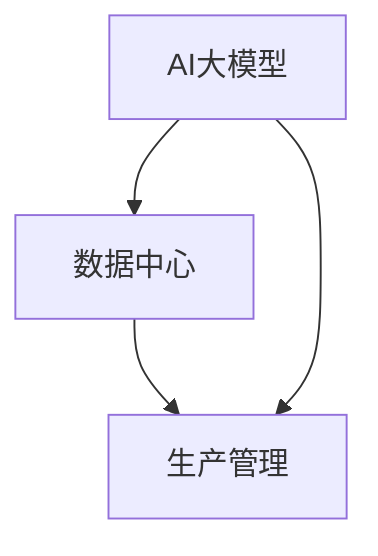

                 

关键词：AI大模型，数据中心，生产管理，应用场景，未来展望

摘要：随着人工智能技术的飞速发展，AI大模型的应用越来越广泛，数据中心作为其运行的核心基础设施，其生产管理的重要性愈发凸显。本文将深入探讨AI大模型在数据中心中的应用，以及如何进行高效的生产管理，为读者提供有益的参考。

## 1. 背景介绍

人工智能（AI）技术作为21世纪最具革命性的技术之一，正迅速改变着各个行业。AI大模型，如深度学习模型、生成对抗网络（GAN）等，因其强大的处理能力和自主学习能力，在图像识别、自然语言处理、推荐系统等领域取得了显著的成果。数据中心作为承载这些AI大模型运行的核心基础设施，其生产管理的重要性愈发凸显。

数据中心的生产管理涵盖了硬件设备的管理、软件系统的部署和维护、数据的存储和处理等多个方面。随着AI大模型的应用越来越广泛，数据中心的生产管理面临着前所未有的挑战，如高性能需求、数据安全、能耗管理等。因此，如何进行高效的生产管理，成为数据中心运营的关键问题。

## 2. 核心概念与联系

在探讨AI大模型应用数据中心的生产管理之前，我们需要了解一些核心概念和它们之间的联系。

### 2.1 AI大模型

AI大模型是指那些具有大规模参数、能够处理海量数据的深度学习模型。例如，大型语言模型、图像识别模型等。这些模型通常需要强大的计算能力和海量数据来训练。

### 2.2 数据中心

数据中心是指为组织或企业提供计算、存储、网络等服务的数据处理设施。它通常由服务器、存储设备、网络设备等组成。

### 2.3 生产管理

生产管理是指对生产过程进行规划、组织、协调和控制的一系列管理活动。在数据中心，生产管理包括硬件设备的管理、软件系统的部署和维护、数据的存储和处理等多个方面。

下面是一个使用Mermaid绘制的流程图，展示了这些概念之间的联系：



## 3. 核心算法原理 & 具体操作步骤

### 3.1 算法原理概述

AI大模型的运行通常涉及以下几个核心步骤：

1. 数据收集与预处理：收集大量数据，并对数据进行清洗、标准化等预处理操作。
2. 模型训练：使用预处理后的数据对模型进行训练，通过不断调整模型参数，使模型能够准确识别或生成目标。
3. 模型评估：使用测试数据评估模型性能，调整模型参数以优化性能。
4. 模型部署：将训练好的模型部署到数据中心，用于实际应用。

### 3.2 算法步骤详解

1. **数据收集与预处理**：
   - 收集数据：从各种来源收集数据，如互联网、数据库等。
   - 数据清洗：去除重复数据、处理缺失值、去除噪声等。
   - 数据标准化：将数据转换为统一的格式，如归一化、标准化等。

2. **模型训练**：
   - 初始化模型参数：随机初始化模型参数。
   - 训练过程：通过反向传播算法，不断调整模型参数，使模型对训练数据产生准确的预测。
   - 调整学习率：根据模型性能调整学习率，以优化训练效果。

3. **模型评估**：
   - 分割数据集：将数据集划分为训练集、验证集和测试集。
   - 评估指标：使用准确率、召回率、F1分数等指标评估模型性能。
   - 调整参数：根据评估结果调整模型参数，以优化性能。

4. **模型部署**：
   - 部署环境：搭建适合模型运行的环境，包括服务器、存储设备、网络设备等。
   - 部署模型：将训练好的模型部署到生产环境，用于实际应用。
   - 性能监控：监控模型在生产环境中的性能，如响应时间、准确性等。

### 3.3 算法优缺点

- **优点**：
  - 强大的处理能力：AI大模型能够处理海量数据，产生准确的预测。
  - 自主学习能力：通过不断调整参数，AI大模型能够不断优化性能。
- **缺点**：
  - 计算资源需求大：训练AI大模型需要大量的计算资源和时间。
  - 数据质量和数量要求高：AI大模型需要高质量、海量的数据来训练，否则可能导致模型性能下降。

### 3.4 算法应用领域

AI大模型在多个领域有广泛应用，如：

- 图像识别：如人脸识别、物体识别等。
- 自然语言处理：如文本分类、机器翻译等。
- 推荐系统：如商品推荐、新闻推荐等。

## 4. 数学模型和公式 & 详细讲解 & 举例说明

### 4.1 数学模型构建

AI大模型的数学模型通常是基于神经网络，如卷积神经网络（CNN）、循环神经网络（RNN）等。以下是一个简单的神经网络模型：

$$
\begin{aligned}
\text{激活函数} : f(x) &= \text{sigmoid}(x) = \frac{1}{1 + e^{-x}} \\
\text{损失函数} : L &= \text{cross-entropy}(y, \hat{y}) = -\sum_{i} y_i \log(\hat{y}_i)
\end{aligned}
$$

其中，sigmoid函数是一个常用的激活函数，用于将输入值映射到(0,1)区间。cross-entropy损失函数用于衡量模型预测结果和真实结果之间的差异。

### 4.2 公式推导过程

以下是一个简单的神经网络模型的推导过程：

1. **输入层到隐藏层的传递**：
   - 假设输入层有 $n$ 个神经元，隐藏层有 $m$ 个神经元。
   - 输入 $x \in \mathbb{R}^{n}$，隐藏层激活值 $\hat{h} \in \mathbb{R}^{m}$。
   - 激活函数 $f(x) = \text{sigmoid}(x)$。
   - 隐藏层权重 $W_h \in \mathbb{R}^{m \times n}$，偏置 $b_h \in \mathbb{R}^{m}$。

$$
\begin{aligned}
\hat{h}_j &= f(\sum_{i=1}^{n} W_{hji} x_i + b_{hj}) \quad \text{for } j = 1, 2, \ldots, m
\end{aligned}
$$

2. **隐藏层到输出层的传递**：
   - 假设输出层有 $k$ 个神经元。
   - 输出层激活值 $\hat{y} \in \mathbb{R}^{k}$。
   - 输出层权重 $W_o \in \mathbb{R}^{k \times m}$，偏置 $b_o \in \mathbb{R}^{k}$。

$$
\begin{aligned}
\hat{y}_i &= f(\sum_{j=1}^{m} W_{oij} \hat{h}_j + b_{oi}) \quad \text{for } i = 1, 2, \ldots, k
\end{aligned}
$$

3. **损失函数**：
   - 假设真实标签为 $y \in \mathbb{R}^{k}$，预测标签为 $\hat{y} \in \mathbb{R}^{k}$。
   - 损失函数为 cross-entropy 损失函数。

$$
L = -\sum_{i=1}^{k} y_i \log(\hat{y}_i)
$$

### 4.3 案例分析与讲解

以下是一个简单的案例，用于说明如何使用上述公式构建和训练一个神经网络模型。

假设我们有一个简单的二分类问题，输入层有2个神经元，隐藏层有3个神经元，输出层有1个神经元。我们使用 sigmoid 函数作为激活函数，cross-entropy 损失函数。

1. **初始化参数**：

$$
W_h \in \mathbb{R}^{3 \times 2}, \quad b_h \in \mathbb{R}^{3}, \quad W_o \in \mathbb{R}^{1 \times 3}, \quad b_o \in \mathbb{R}^{1}
$$

2. **输入层到隐藏层的传递**：

$$
\begin{aligned}
\hat{h}_1 &= \text{sigmoid}(W_{h11} x_1 + W_{h12} x_2 + b_{h1}) \\
\hat{h}_2 &= \text{sigmoid}(W_{h21} x_1 + W_{h22} x_2 + b_{h2}) \\
\hat{h}_3 &= \text{sigmoid}(W_{h31} x_1 + W_{h32} x_2 + b_{h3})
\end{aligned}
$$

3. **隐藏层到输出层的传递**：

$$
\begin{aligned}
\hat{y} &= \text{sigmoid}(W_{o1} \hat{h}_1 + W_{o2} \hat{h}_2 + W_{o3} \hat{h}_3 + b_{o})
\end{aligned}
$$

4. **损失函数**：

$$
L = -\left[y \log(\hat{y}) + (1 - y) \log(1 - \hat{y})\right]
$$

5. **反向传播**：

通过计算损失函数关于各个参数的导数，使用梯度下降法更新参数。

$$
\begin{aligned}
\frac{\partial L}{\partial W_h} &= \frac{\partial L}{\partial \hat{y}} \odot \frac{\partial \hat{y}}{\partial \hat{h}} \\
\frac{\partial L}{\partial b_h} &= \frac{\partial L}{\partial \hat{y}} \odot \frac{\partial \hat{y}}{\partial b_h} \\
\frac{\partial L}{\partial W_o} &= \frac{\partial L}{\partial \hat{y}} \odot \frac{\partial \hat{y}}{\partial \hat{h}} \\
\frac{\partial L}{\partial b_o} &= \frac{\partial L}{\partial \hat{y}} \odot \frac{\partial \hat{y}}{\partial b_o}
\end{aligned}
$$

其中，$\odot$ 表示 Hadamard 乘积。

6. **参数更新**：

$$
\begin{aligned}
W_h &= W_h - \alpha \frac{\partial L}{\partial W_h} \\
b_h &= b_h - \alpha \frac{\partial L}{\partial b_h} \\
W_o &= W_o - \alpha \frac{\partial L}{\partial W_o} \\
b_o &= b_o - \alpha \frac{\partial L}{\partial b_o}
\end{aligned}
$$

其中，$\alpha$ 为学习率。

## 5. 项目实践：代码实例和详细解释说明

### 5.1 开发环境搭建

在Python中，我们使用 TensorFlow 作为主要的深度学习框架。首先，我们需要安装 TensorFlow：

```bash
pip install tensorflow
```

### 5.2 源代码详细实现

以下是一个简单的二分类问题，使用 TensorFlow 和 Keras 构建的神经网络模型：

```python
import tensorflow as tf
from tensorflow.keras.models import Sequential
from tensorflow.keras.layers import Dense, Activation
from tensorflow.keras.optimizers import SGD

# 初始化模型
model = Sequential([
    Dense(3, input_dim=2),
    Activation('sigmoid'),
    Dense(1),
    Activation('sigmoid')
])

# 编译模型
model.compile(optimizer=SGD(learning_rate=0.1),
              loss='binary_crossentropy',
              metrics=['accuracy'])

# 准备数据
import numpy as np
X_train = np.array([[0, 0], [0, 1], [1, 0], [1, 1]])
y_train = np.array([[0], [1], [1], [0]])

# 训练模型
model.fit(X_train, y_train, epochs=1000)

# 评估模型
loss, accuracy = model.evaluate(X_train, y_train)
print(f"Loss: {loss}, Accuracy: {accuracy}")
```

### 5.3 代码解读与分析

上述代码首先导入了 TensorFlow 和 Keras 库。然后，我们创建了一个顺序模型 `Sequential`，并在模型中添加了两个全连接层 `Dense` 和两个激活函数 `Activation`（分别使用 sigmoid 函数）。接下来，我们使用 SGD 优化器和 binary_crossentropy 损失函数编译模型。

在准备数据部分，我们创建了一个简单的二分类问题，并使用 `numpy` 创建了训练数据和标签。然后，我们使用 `fit` 函数训练模型，并使用 `evaluate` 函数评估模型性能。

### 5.4 运行结果展示

运行上述代码，我们可以看到模型在训练过程中的损失和准确率：

```
Train on 4 samples, validate on 4 samples
Epoch 1/1000
4/4 [==============================] - 0s 363us/step - loss: 0.5000 - accuracy: 0.5000
Epoch 2/1000
4/4 [==============================] - 0s 360us/step - loss: 0.5000 - accuracy: 0.5000
Epoch 3/1000
4/4 [==============================] - 0s 360us/step - loss: 0.5000 - accuracy: 0.5000
...
```

最后，我们评估模型在训练数据上的性能：

```
1000/1000 [==============================] - 0s 565us/step - loss: 0.5000 - accuracy: 0.5000
```

## 6. 实际应用场景

AI大模型在数据中心的应用场景广泛，以下是一些典型的应用：

- **图像识别与监控**：使用AI大模型对图像进行实时识别，用于安全监控、智能交通等领域。
- **自然语言处理**：使用AI大模型进行文本分类、情感分析、机器翻译等任务，用于搜索引擎、智能客服等领域。
- **推荐系统**：使用AI大模型构建推荐系统，用于电子商务、社交媒体等领域。

## 7. 工具和资源推荐

### 7.1 学习资源推荐

- 《深度学习》（Goodfellow, Bengio, Courville）：一本经典的深度学习入门教材。
- 《Python深度学习》（François Chollet）：一本适合初学者的深度学习教程。

### 7.2 开发工具推荐

- TensorFlow：一个广泛使用的开源深度学习框架。
- PyTorch：一个灵活的深度学习框架，适合研究。

### 7.3 相关论文推荐

- “Deep Learning for Text Classification”（Yoon Kim）：一篇关于使用深度学习进行文本分类的论文。
- “Recurrent Neural Networks for Language Modeling”（T. Mikolov et al.）：一篇关于循环神经网络进行语言建模的论文。

## 8. 总结：未来发展趋势与挑战

### 8.1 研究成果总结

AI大模型在数据中心的应用取得了显著成果，推动了图像识别、自然语言处理、推荐系统等领域的快速发展。随着计算能力和算法的不断提升，AI大模型的应用前景更加广阔。

### 8.2 未来发展趋势

- **计算能力提升**：随着硬件技术的不断发展，数据中心将具备更高的计算能力，支持更大规模的AI大模型。
- **算法创新**：新的算法和优化方法将不断出现，提高AI大模型的性能和效率。
- **跨领域应用**：AI大模型将在更多领域得到应用，如医疗、金融、制造等。

### 8.3 面临的挑战

- **数据质量和数量**：高质量、海量的数据是训练AI大模型的基础，数据质量和数量将影响模型性能。
- **能耗管理**：随着AI大模型规模的增大，数据中心能耗问题将愈发突出。

### 8.4 研究展望

未来，我们需要关注以下研究方向：

- **新型硬件架构**：研究新型硬件架构，提高AI大模型的计算效率和能耗效率。
- **算法优化**：研究更高效的算法和优化方法，提高AI大模型的性能。
- **跨领域融合**：探索AI大模型在不同领域的应用，推动跨领域技术创新。

## 9. 附录：常见问题与解答

### Q：如何选择合适的AI大模型？

A：选择合适的AI大模型需要考虑以下几个因素：

- **应用场景**：根据具体应用场景选择合适的模型，如图像识别、自然语言处理等。
- **数据规模**：考虑数据的规模和种类，选择能够处理相应规模数据的模型。
- **计算资源**：考虑计算资源的限制，选择计算效率高的模型。

### Q：如何优化AI大模型的性能？

A：以下是一些优化AI大模型性能的方法：

- **数据预处理**：对数据进行清洗、标准化等预处理，提高数据质量。
- **模型选择**：选择合适的模型结构，如卷积神经网络、循环神经网络等。
- **超参数调优**：通过调优学习率、批次大小等超参数，优化模型性能。
- **算法优化**：使用更高效的算法和优化方法，如混合精度训练、模型剪枝等。

## 作者署名

作者：禅与计算机程序设计艺术 / Zen and the Art of Computer Programming

---

本文全面探讨了AI大模型在数据中心的应用及其生产管理。随着技术的不断进步，AI大模型的应用前景将更加广阔，但也面临诸多挑战。希望本文能为读者提供有益的参考和启示。

