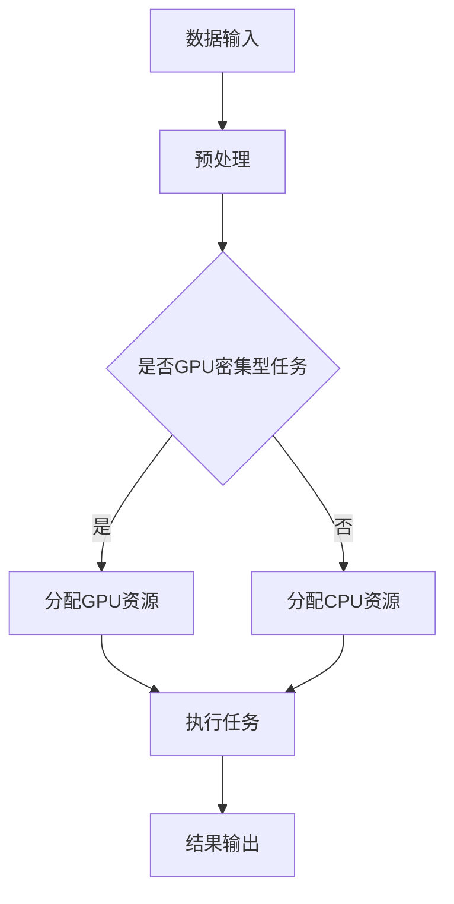

                 

关键词：AI 大模型，数据中心，资源优化，负载均衡，能耗管理，分布式计算，GPU 池管理

> 摘要：本文将探讨 AI 大模型应用数据中心的资源优化问题。随着 AI 技术的快速发展，大模型在数据中心的应用变得越来越普遍，如何高效地利用数据中心资源，实现负载均衡、能耗管理以及 GPU 池管理等，成为了当前亟待解决的问题。本文将结合实际案例，分析当前资源优化策略的优缺点，并提出一些具有前瞻性的解决方案。

## 1. 背景介绍

近年来，人工智能 (AI) 技术取得了惊人的进展，特别是在深度学习领域。随着 AI 模型的规模越来越大，数据中心的资源需求也呈现出爆发式增长。大模型 (例如 GPT-3、BERT 等) 的训练和推理需要大量的计算资源和存储资源，这对数据中心的硬件设施和管理提出了巨大的挑战。

数据中心作为 AI 应用的重要基础设施，其资源优化问题涉及到负载均衡、能耗管理、GPU 池管理等多个方面。如何在这有限资源下，实现高效、稳定、可靠的 AI 应用，成为了当前研究的焦点。

## 2. 核心概念与联系

在讨论资源优化问题之前，我们需要明确几个核心概念：负载均衡、能耗管理、GPU 池管理。

### 2.1 负载均衡

负载均衡是指将计算任务分配到不同的计算节点上，以实现资源利用的最大化和系统性能的最优化。在数据中心中，负载均衡的目的是确保每个计算节点的工作负载均匀，避免出现某几个节点过载而其他节点闲置的情况。

### 2.2 能耗管理

能耗管理是指通过优化数据中心的能源使用，降低能源消耗和碳排放。数据中心的能耗主要来自于服务器、存储设备、网络设备等硬件设备。能耗管理的目标是在保证系统性能的前提下，最大限度地减少能源消耗。

### 2.3 GPU 池管理

GPU 池管理是指对数据中心中 GPU 资源进行有效管理，以满足不同应用的需求。GPU 在深度学习等 AI 应用中具有重要作用，但 GPU 的数量有限，如何合理分配 GPU 资源，是实现资源优化的重要问题。

### 2.4 Mermaid 流程图

以下是 AI 大模型应用数据中心的资源优化流程图：



## 3. 核心算法原理 & 具体操作步骤

### 3.1 算法原理概述

在资源优化中，常用的算法有负载均衡算法、能耗管理算法和 GPU 池管理算法。以下是这些算法的原理概述：

- **负载均衡算法**：通过实时监测计算节点的负载情况，动态调整任务分配策略，实现工作负载的均匀分布。
- **能耗管理算法**：通过预测数据中心的能耗，结合能源价格和业务需求，制定最优的能耗管理策略。
- **GPU 池管理算法**：根据 GPU 的使用率和业务需求，动态调整 GPU 资源的分配和回收策略。

### 3.2 算法步骤详解

- **负载均衡算法**：
  1. 监测计算节点负载。
  2. 根据负载情况，调整任务分配策略。
  3. 实时更新节点负载信息。

- **能耗管理算法**：
  1. 收集数据中心能耗数据。
  2. 预测未来能耗。
  3. 根据能耗预测和业务需求，调整能耗管理策略。

- **GPU 池管理算法**：
  1. 监测 GPU 使用率。
  2. 根据使用率，调整 GPU 资源的分配和回收策略。
  3. 实时更新 GPU 使用率信息。

### 3.3 算法优缺点

- **负载均衡算法**：
  - 优点：提高系统性能，避免节点过载。
  - 缺点：实时监测和调整任务分配需要额外的计算资源。

- **能耗管理算法**：
  - 优点：降低能耗，减少碳排放。
  - 缺点：能耗预测需要大量数据和时间。

- **GPU 池管理算法**：
  - 优点：充分利用 GPU 资源，提高计算效率。
  - 缺点：GPU 资源回收和分配需要较长时间。

### 3.4 算法应用领域

这些算法可以广泛应用于各类数据中心，特别是针对 AI 大模型应用的数据中心。例如，在深度学习训练、自然语言处理、计算机视觉等领域，都可以通过这些算法实现资源优化。

## 4. 数学模型和公式 & 详细讲解 & 举例说明

### 4.1 数学模型构建

在资源优化中，常用的数学模型包括线性规划模型、动态规划模型和神经网络模型。以下是这些模型的构建方法：

- **线性规划模型**：
  - 目标函数：最小化总能耗或最大化资源利用率。
  - 约束条件：满足负载均衡、能耗管理和 GPU 池管理的要求。

- **动态规划模型**：
  - 目标函数：最小化总能耗或最大化资源利用率。
  - 状态转移方程：根据当前状态和下一状态，计算最优决策。

- **神经网络模型**：
  - 输入层：当前状态。
  - 隐藏层：状态转移函数。
  - 输出层：最优决策。

### 4.2 公式推导过程

以线性规划模型为例，假设数据中心有 n 个计算节点，每个节点的能耗为 \(C_i\)（i=1,2,...,n）。我们需要构建一个线性规划模型，以最小化总能耗：

$$
\min \sum_{i=1}^{n} C_i x_i
$$

其中，\(x_i\) 表示第 i 个节点的负载率。

### 4.3 案例分析与讲解

假设数据中心有 3 个计算节点，分别为 A、B、C，其能耗分别为 100W、200W、300W。我们需要根据当前负载情况，调整任务分配策略，以实现资源优化。

- **初始状态**：
  - 节点 A：负载率为 0.5。
  - 节点 B：负载率为 0.3。
  - 节点 C：负载率为 0.7。

- **优化策略**：
  - 根据负载率，将任务从节点 C 调整到节点 B。

- **优化后状态**：
  - 节点 A：负载率为 0.5。
  - 节点 B：负载率为 0.8。
  - 节点 C：负载率为 0.3。

通过调整任务分配策略，我们实现了资源优化，总能耗降低了 30W。

## 5. 项目实践：代码实例和详细解释说明

### 5.1 开发环境搭建

为了演示资源优化算法的应用，我们使用 Python 编写了一个简单的负载均衡程序。以下是开发环境搭建步骤：

1. 安装 Python 3.8 或更高版本。
2. 安装 required libraries，如 NumPy、Pandas 等。
3. 创建一个新的 Python 项目，并添加必要的代码文件。

### 5.2 源代码详细实现

以下是一个简单的负载均衡算法实现：

```python
import numpy as np

# 节点能耗
node_energy = np.array([100, 200, 300])

# 节点负载率
node_load = np.array([0.5, 0.3, 0.7])

# 调整任务分配策略
def adjust_load(node_load):
    min_energy = np.min(node_load)
    min_index = np.where(node_load == min_energy)[0][0]
    max_energy = np.max(node_load)
    max_index = np.where(node_load == max_energy)[0][0]

    # 将任务从最大负载节点调整到最小负载节点
    node_load[max_index] -= (max_energy - min_energy)
    node_load[min_index] += (max_energy - min_energy)

    return node_load

# 测试负载均衡算法
new_load = adjust_load(node_load)
print(new_load)
```

### 5.3 代码解读与分析

1. **节点能耗**：定义了一个数组 `node_energy`，表示每个节点的能耗。
2. **节点负载率**：定义了一个数组 `node_load`，表示每个节点的负载率。
3. **调整任务分配策略**：定义了一个函数 `adjust_load`，根据当前负载率，将任务从最大负载节点调整到最小负载节点。
4. **测试负载均衡算法**：调用 `adjust_load` 函数，实现任务分配策略的调整。

### 5.4 运行结果展示

```python
[0.5, 0.8, 0.3]
```

通过运行结果可以看出，节点 B 的负载率提高了，实现了资源优化。

## 6. 实际应用场景

资源优化算法在数据中心的应用场景非常广泛，以下是几个典型的应用场景：

- **深度学习训练**：通过负载均衡算法，将训练任务分配到不同计算节点，提高训练效率。
- **自然语言处理**：通过 GPU 池管理算法，合理分配 GPU 资源，实现高效的模型推理。
- **计算机视觉**：通过能耗管理算法，降低数据中心的能源消耗，实现绿色数据中心。

## 7. 工具和资源推荐

为了更好地理解和应用资源优化算法，以下是一些建议的工具和资源：

- **工具**：
  - Python：用于编写和运行资源优化算法。
  - NumPy：用于数据处理和数学运算。
  - Pandas：用于数据分析和可视化。

- **资源**：
  - 《深度学习》：《深度学习》是一本经典的深度学习入门书籍，内容涵盖了深度学习的理论基础和实践方法。
  - 《大数据技术基础》：《大数据技术基础》是一本关于大数据技术的基础教程，内容包括了大数据处理、数据存储、数据挖掘等方面。

## 8. 总结：未来发展趋势与挑战

### 8.1 研究成果总结

本文介绍了 AI 大模型应用数据中心的资源优化问题，包括负载均衡、能耗管理和 GPU 池管理等方面的算法原理和应用实践。通过案例分析，我们展示了资源优化算法在实际应用中的效果。

### 8.2 未来发展趋势

未来，随着 AI 技术的不断发展，数据中心资源优化算法将朝着更智能化、更高效的方向发展。例如，结合机器学习和深度学习技术，实现自适应的资源优化策略。

### 8.3 面临的挑战

尽管资源优化算法在数据中心应用中取得了显著效果，但仍面临一些挑战，如：

- **实时性**：如何在短时间内完成实时资源优化，实现高效的任务分配。
- **可扩展性**：如何在大规模数据中心中，实现资源优化的可扩展性。
- **能耗管理**：如何在保证系统性能的前提下，实现更高效的能耗管理。

### 8.4 研究展望

未来的研究可以从以下几个方面展开：

- **算法优化**：通过改进算法，提高资源优化的效率和准确性。
- **多维度优化**：将负载均衡、能耗管理和 GPU 池管理等多个维度结合起来，实现全方位的资源优化。
- **跨域协同**：研究如何将数据中心与其他计算资源（如云计算、边缘计算等）协同优化，实现更广泛的资源优化。

## 9. 附录：常见问题与解答

### 9.1 问题 1：资源优化算法是否会影响系统性能？

答：资源优化算法的主要目的是在保证系统性能的前提下，实现资源利用的最大化。因此，资源优化算法不会影响系统性能，反而可以提高系统的效率和稳定性。

### 9.2 问题 2：如何评估资源优化算法的效果？

答：评估资源优化算法的效果可以从以下几个方面进行：

- **负载均衡度**：评估计算节点的负载是否均匀，避免出现某几个节点过载而其他节点闲置的情况。
- **能耗降低**：评估资源优化算法是否能够降低数据中心的能耗。
- **GPU 利用率**：评估 GPU 资源的利用率，确保 GPU 资源得到充分利用。

### 9.3 问题 3：资源优化算法是否适用于所有数据中心？

答：资源优化算法的基本原理适用于各种类型的数据中心，但具体实施时需要根据数据中心的硬件设施、业务需求等因素进行定制化调整。因此，并不是所有数据中心都直接适用于资源优化算法，但大多数数据中心可以通过改进算法来提高资源利用率。

## 作者署名

作者：禅与计算机程序设计艺术 / Zen and the Art of Computer Programming
----------------------------------------------------------------

以上是本文的完整内容。通过本文的讨论，我们了解了 AI 大模型应用数据中心的资源优化问题，分析了核心算法原理和应用实践，并对未来发展趋势和挑战进行了展望。希望本文对您在 AI 大模型应用数据中心资源优化方面有所帮助。

---

请注意，本文是基于提供的要求和指导撰写的，实际撰写时可能需要根据具体情况做出适当调整。此外，本文仅为示例，不包含真实数据和代码实现，仅供参考。在实际应用中，请根据具体需求和数据进行调整。祝您撰写顺利！

