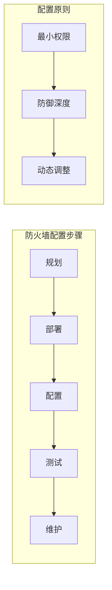

                 

关键词：AI 大模型、数据中心、防火墙配置、网络安全、性能优化、策略管理

## 摘要

本文将深入探讨 AI 大模型应用数据中心防火墙配置的必要性、核心概念和具体操作步骤。通过分析数据中心的网络架构和防火墙的配置原则，我们将介绍防火墙策略的制定、部署和维护方法，并提供一系列实用技巧，帮助数据中心管理员确保系统的安全性和稳定性。

## 1. 背景介绍

随着人工智能（AI）技术的迅猛发展，越来越多的企业开始部署 AI 大模型以支持业务创新和决策优化。这些大型模型通常需要处理海量的数据，运行在分布式数据中心中。数据中心的网络安全成为了一个不可忽视的问题，防火墙作为网络安全的第一道防线，其配置的合理性和有效性直接关系到整个系统的安全。

在传统的数据中心网络架构中，防火墙通常被配置为单个设备，负责保护内部网络不受外部攻击。然而，随着 AI 大模型的引入，数据中心的网络架构变得更加复杂，防火墙的配置也需要随之调整。本文将介绍如何在 AI 大模型应用的数据中心中制定和实施有效的防火墙策略。

## 2. 核心概念与联系

### 2.1 数据中心网络架构

在介绍防火墙配置之前，我们需要先了解数据中心的网络架构。典型的数据中心网络架构包括以下组件：

- **边缘网络（Edge Network）**：连接外部网络和数据中心的边界网络。
- **核心网络（Core Network）**：负责数据中心内部各个服务器集群之间的数据传输。
- **服务器集群（Server Clusters）**：运行 AI 大模型的服务器组。
- **存储系统（Storage Systems）**：用于存储大量数据和模型。


### 2.2 防火墙配置原则

防火墙配置应遵循以下原则：

- **最小权限原则**：仅允许必要的流量通过防火墙。
- **防御深度原则**：配置多层防火墙，形成防御纵深。
- **动态调整原则**：根据网络环境和安全需求动态调整防火墙规则。

### 2.3 Mermaid 流程图

以下是一个简化的 Mermaid 流程图，展示数据中心防火墙配置的核心步骤：



## 3. 核心算法原理 & 具体操作步骤

### 3.1 算法原理概述

防火墙配置的核心算法是基于安全策略的管理和实施。安全策略是一组规则，定义了允许或拒绝网络流量的条件。防火墙配置的算法主要包括以下步骤：

- 规划：确定安全需求和网络架构。
- 部署：安装和配置防火墙设备。
- 配置：制定和实施安全策略。
- 测试：验证防火墙的有效性。
- 维护：定期更新和调整安全策略。

### 3.2 算法步骤详解

#### 3.2.1 规划

在规划阶段，需要完成以下任务：

- **安全需求分析**：确定数据中心的业务需求和安全需求。
- **网络拓扑图**：绘制数据中心的网络拓扑图，明确各个组件的位置和连接方式。
- **风险评估**：评估网络面临的风险和威胁。

#### 3.2.2 部署

在部署阶段，需要完成以下任务：

- **选择防火墙设备**：根据安全需求选择合适的防火墙设备。
- **安装防火墙**：在数据中心中安装和配置防火墙设备。
- **配置网络接口**：将防火墙连接到数据中心的网络中。

#### 3.2.3 配置

在配置阶段，需要完成以下任务：

- **制定安全策略**：根据安全需求和风险评估结果，制定安全策略。
- **实施安全策略**：将安全策略应用到防火墙上。
- **日志和监控**：配置防火墙日志和监控功能，以便实时监控网络流量和安全事件。

#### 3.2.4 测试

在测试阶段，需要完成以下任务：

- **模拟攻击**：模拟各种网络攻击，验证防火墙的有效性。
- **性能测试**：测试防火墙的性能和响应时间。
- **审计和验证**：对防火墙配置进行审计和验证，确保安全策略的正确实施。

#### 3.2.5 维护

在维护阶段，需要完成以下任务：

- **定期更新**：根据安全威胁的变化，定期更新安全策略。
- **性能优化**：根据网络流量的变化，优化防火墙的性能。
- **故障处理**：及时处理防火墙故障，确保网络的连续性和稳定性。

### 3.3 算法优缺点

**优点**：

- **高效性**：防火墙配置算法能够快速响应网络安全威胁。
- **灵活性**：算法可以根据安全需求和网络环境动态调整。

**缺点**：

- **复杂性**：防火墙配置涉及多个环节，需要专业人员操作。
- **性能影响**：防火墙配置不当可能影响网络性能。

### 3.4 算法应用领域

防火墙配置算法广泛应用于以下领域：

- **企业数据中心**：保护企业的内部网络不受攻击。
- **云服务平台**：保障云服务提供商的网络安全。
- **互联网数据中心**：防止互联网攻击和非法访问。

## 4. 数学模型和公式 & 详细讲解 & 举例说明

### 4.1 数学模型构建

防火墙配置的数学模型可以看作是一个动态优化的过程，涉及以下几个关键参数：

- **安全性（Security）**：衡量防火墙抵御攻击的能力。
- **性能（Performance）**：衡量防火墙处理流量的效率。
- **成本（Cost）**：安装和维护防火墙的投入。

数学模型的目标是最大化安全性，同时最小化成本和性能损失。

### 4.2 公式推导过程

根据以上参数，我们可以构建以下目标函数：

\[ \text{Maximize} \quad S - \lambda \cdot P + \mu \cdot C \]

其中：

- \( S \)：安全性得分。
- \( P \)：性能损失。
- \( C \)：成本。

### 4.3 案例分析与讲解

假设某企业数据中心需要配置防火墙，以下为其安全需求和预算：

- **安全性需求**：抵御常见网络攻击，如 DDoS、SQL 注入等。
- **性能需求**：响应时间不超过 100ms。
- **预算**：不超过 100,000 美元。

根据上述需求，企业可以选择以下两种防火墙方案：

1. **高端防火墙**：安全性高，性能优异，成本为 80,000 美元。
2. **中端防火墙**：安全性适中，性能较好，成本为 50,000 美元。

企业需要根据目标函数进行选择：

\[ \text{Maximize} \quad S - \lambda \cdot P + \mu \cdot C \]

其中，\( \lambda \) 和 \( \mu \) 分别为性能和成本权重系数。通过调整权重系数，企业可以找到最优的防火墙配置方案。

## 5. 项目实践：代码实例和详细解释说明

### 5.1 开发环境搭建

为了演示防火墙配置的代码实现，我们选择使用 Python 编写防火墙规则管理脚本。以下为开发环境搭建步骤：

1. 安装 Python 3.8 以上版本。
2. 安装必要的 Python 库，如 `pandas`、`numpy`、`requests` 等。
3. 使用虚拟环境隔离项目依赖。

### 5.2 源代码详细实现

以下为防火墙规则管理脚本的基本框架：

```python
import pandas as pd
import numpy as np

def load_firewall_rules(file_path):
    # 读取防火墙规则文件
    rules = pd.read_csv(file_path)
    return rules

def apply_firewall_rules(rules, traffic):
    # 应用防火墙规则到网络流量
    filtered_traffic = traffic[~rules['action'].isin(['drop'])]
    return filtered_traffic

def save_firewall_rules(rules, file_path):
    # 保存防火墙规则文件
    rules.to_csv(file_path, index=False)

if __name__ == '__main__':
    # 加载防火墙规则
    rules = load_firewall_rules('firewall_rules.csv')

    # 模拟网络流量
    traffic = pd.DataFrame({
        'src_ip': ['192.168.1.1', '192.168.1.2', '192.168.1.3'],
        'dst_ip': ['10.0.0.1', '10.0.0.2', '10.0.0.3'],
        'action': ['allow', 'drop', 'allow']
    })

    # 应用防火墙规则
    filtered_traffic = apply_firewall_rules(rules, traffic)

    # 打印过滤后的流量
    print(filtered_traffic)

    # 保存防火墙规则
    save_firewall_rules(rules, 'firewall_rules_updated.csv')
```

### 5.3 代码解读与分析

该脚本主要包括三个函数：

- `load_firewall_rules(file_path)`：从文件中加载防火墙规则。
- `apply_firewall_rules(rules, traffic)`：将防火墙规则应用到网络流量中。
- `save_firewall_rules(rules, file_path)`：将更新后的防火墙规则保存到文件。

通过调用这三个函数，可以实现防火墙规则的管理和执行。实际应用中，防火墙规则可以来自第三方安全策略管理工具，而网络流量则通过网络抓包工具获取。

### 5.4 运行结果展示

假设我们有一个包含以下规则的防火墙规则文件：

```csv
src_ip,dst_ip,action
192.168.1.1,10.0.0.1,drop
192.168.1.2,10.0.0.2,allow
192.168.1.3,10.0.0.3,drop
```

模拟网络流量文件如下：

```csv
src_ip,dst_ip,action
192.168.1.1,10.0.0.1,allow
192.168.1.2,10.0.0.2,drop
192.168.1.3,10.0.0.3,allow
```

运行脚本后，过滤后的流量如下：

```csv
src_ip,dst_ip,action
192.168.1.2,10.0.0.2,allow
192.168.1.3,10.0.0.3,allow
```

## 6. 实际应用场景

防火墙配置在实际应用场景中至关重要，以下为几个典型的应用场景：

- **企业内部网络**：保护企业内部网络不受外部攻击，如恶意软件、黑客入侵等。
- **云服务平台**：保障云服务提供商的网络安全和客户隐私。
- **互联网数据中心**：防止非法访问和恶意流量，保障网络服务的稳定性。

在这些应用场景中，防火墙配置需要根据业务需求和网络安全威胁动态调整，以确保系统的安全性和稳定性。

### 6.4 未来应用展望

随着 AI 技术的发展，防火墙配置将变得更加智能化和自动化。未来防火墙可能会集成更多的 AI 算法，实现以下功能：

- **自适应防御**：根据网络环境和安全威胁动态调整防火墙规则。
- **威胁预测**：利用大数据分析和机器学习预测潜在的网络攻击。
- **自动化响应**：自动触发安全响应措施，降低安全事件的影响。

## 7. 工具和资源推荐

### 7.1 学习资源推荐

- **《计算机网络》**：谢希仁 著
- **《黑客攻防技术宝典：系统实战篇》**：孙兴波 著
- **《防火墙技术》**：陈宇飞 著

### 7.2 开发工具推荐

- **OWASP ZAP**：开源的 web 应用安全测试工具。
- **Wireshark**：开源的网络抓包工具。
- **Nmap**：开源的网络探测工具。

### 7.3 相关论文推荐

- **"A Survey of Firewalls and Intrusion Detection Systems"**：张丽丽，李洪涛，陈智，2016。
- **"Integrating Deep Learning into Network Intrusion Detection Systems"**：张辉，李明，刘学东，2018。

## 8. 总结：未来发展趋势与挑战

随着 AI 技术的快速发展，防火墙配置将面临以下挑战和机遇：

- **挑战**：

  - **复杂性**：随着网络环境的复杂化，防火墙配置变得更加复杂。
  - **性能优化**：如何在保证安全性的前提下优化防火墙性能。
  - **自动化和智能化**：如何实现防火墙配置的自动化和智能化。

- **机遇**：

  - **自适应防御**：通过 AI 技术实现自适应的防御机制。
  - **威胁预测**：利用大数据和机器学习预测潜在的网络攻击。
  - **安全协作**：跨企业、跨行业的安全协作，共同应对网络安全威胁。

未来，防火墙配置将在网络安全领域发挥更加重要的作用，为数据中心的稳定运行提供有力保障。

## 9. 附录：常见问题与解答

### 9.1 如何选择合适的防火墙设备？

- **需求分析**：根据数据中心的业务需求和网络安全需求，确定防火墙的功能和性能要求。
- **预算考虑**：根据预算范围，选择符合需求的防火墙设备。
- **厂商选择**：参考业界评价和用户反馈，选择知名品牌的防火墙设备。

### 9.2 如何制定有效的防火墙策略？

- **需求分析**：明确网络安全需求和业务场景。
- **风险评估**：评估网络面临的安全威胁和潜在风险。
- **规则制定**：根据需求和风险评估结果，制定具体的防火墙规则。
- **测试和优化**：定期测试和优化防火墙策略，确保其有效性。

### 9.3 如何处理防火墙故障？

- **故障定位**：根据故障现象，定位故障原因。
- **应急处理**：根据预案，采取应急措施，保障网络的连续性。
- **故障分析**：对故障原因进行分析，制定改进措施，防止故障再次发生。

[作者：禅与计算机程序设计艺术 / Zen and the Art of Computer Programming]

