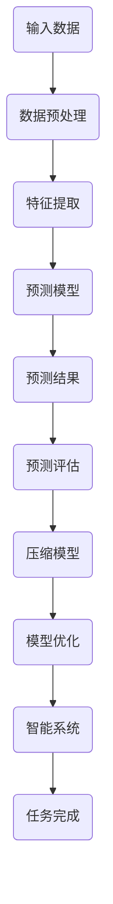

                 

关键词：人工智能，大模型，预测，压缩，智能

> 摘要：本文旨在探讨人工智能大模型的本质，通过深入剖析预测、压缩与智能之间的联系，揭示大模型如何实现高效的智能推理。文章首先介绍背景知识，然后详细阐述核心概念与算法原理，最后通过实际应用案例和未来展望，全面揭示大模型在人工智能领域的重要作用。

## 1. 背景介绍

在过去的几十年里，人工智能（AI）技术取得了显著的进展，从早期的规则驱动算法到如今基于深度学习的复杂模型，AI 在各个领域都展现出了巨大的潜力。然而，随着数据量的爆炸性增长和计算能力的提升，大模型（Large Models）逐渐成为研究的热点。大模型指的是具有数十亿到数万亿参数的深度神经网络，它们通过大量的数据和强大的计算能力实现了前所未有的表现。

### 大模型的发展历程

大模型的发展历程可以分为三个阶段：

1. **早期探索**：从 2012 年深度学习在 ImageNet 图像识别比赛中取得突破性成果开始，研究者们开始关注深度神经网络的能力和潜力。这一阶段的主要目标是构建具有较强特征提取能力的神经网络。

2. **模型规模扩展**：随着计算能力的提升，研究者们开始尝试构建更大规模的模型，例如 GPT、BERT 等预训练模型。这些模型通过预训练和微调在多个任务上取得了优异的表现，标志着大模型时代的到来。

3. **算法创新与优化**：在大模型的发展过程中，算法创新和优化成为关键因素。研究人员提出了许多高效的训练和推理算法，如注意力机制、梯度裁剪、优化器等，使得大模型能够更加稳定和有效地运行。

### 大模型的应用场景

大模型在多个领域展现出了强大的能力，以下是一些典型的应用场景：

1. **自然语言处理（NLP）**：大模型在语言模型、文本分类、机器翻译、问答系统等方面取得了显著的进展。例如，GPT-3 拥有超过 1750 亿个参数，能够生成流畅、自然的文本。

2. **计算机视觉（CV）**：大模型在图像分类、目标检测、图像生成等方面表现突出。例如，ResNet、EfficientNet 等模型通过设计高效的神经网络结构，在 ImageNet 等数据集上取得了优异的成绩。

3. **语音识别（ASR）**：大模型在语音识别领域取得了显著的成果，如 WaveNet、Transformer 等模型能够实现高效的语音识别和生成。

4. **多模态学习**：大模型在多模态学习任务中具有独特的优势，能够整合不同模态的数据，实现更加丰富和准确的任务表现。

## 2. 核心概念与联系

在深入探讨大模型的本质之前，我们首先需要了解一些核心概念，包括预测、压缩和智能。这些概念之间存在密切的联系，共同构成了大模型的基础。

### 预测与压缩

预测是 AI 模型的一个重要功能，它通过学习数据中的规律，对未来事件进行预测。在大模型中，预测不仅仅是简单的输出一个标签或结果，而是通过复杂的神经网络结构，对大量数据进行建模和推理。

压缩是指将大量的数据或信息转化为更小、更紧凑的形式，以便更高效地存储、传输和处理。在大模型中，压缩是通过各种技术手段，如降维、编码、量化等，减少模型参数的数量，从而提高计算效率和存储效率。

预测和压缩之间存在着密切的联系。一方面，预测过程本身可以看作是一种压缩过程，因为模型需要从大量的数据中提取关键特征，从而实现高效的预测。另一方面，压缩技术可以用于优化预测过程，如通过减少模型参数的数量，降低计算复杂度和存储需求，从而提高模型的性能和效率。

### 智能

智能是指系统能够自主地理解和处理信息，并做出合理的决策和行动。在大模型中，智能表现为模型能够通过学习大量的数据和知识，实现复杂的推理和任务。

智能和预测、压缩之间的关系可以看作是：智能是预测和压缩的目标，而预测和压缩是实现智能的手段。大模型通过高效的预测和压缩技术，实现了对大量数据的理解和处理，从而展现出强大的智能能力。

### Mermaid 流程图

为了更好地展示预测、压缩和智能之间的联系，我们可以使用 Mermaid 流程图进行说明。



在该流程图中，输入数据经过预处理、特征提取和预测模型处理，得到预测结果并进行评估。评估结果用于优化压缩模型，进一步优化智能系统，最终实现任务完成。

## 3. 核心算法原理 & 具体操作步骤

### 3.1 算法原理概述

大模型的算法原理主要基于深度学习技术，通过多层神经网络结构对大量数据进行建模和推理。具体来说，大模型算法包括以下几个关键步骤：

1. **数据预处理**：对输入数据进行清洗、归一化和特征提取，以便后续处理。
2. **特征提取**：通过多层神经网络提取输入数据的特征，实现数据降维和特征增强。
3. **预测模型**：构建多层神经网络，对输入数据进行建模和预测。
4. **预测评估**：对预测结果进行评估，并根据评估结果调整模型参数。
5. **压缩模型**：通过压缩技术，减少模型参数的数量，提高计算效率和存储效率。
6. **模型优化**：对压缩后的模型进行优化，进一步提高模型性能。
7. **智能系统**：将优化后的模型应用于实际任务，实现智能推理和决策。

### 3.2 算法步骤详解

1. **数据预处理**：
   - 数据清洗：去除数据中的噪声、缺失值和异常值。
   - 数据归一化：将不同特征的数据范围统一，便于后续处理。
   - 特征提取：提取输入数据的关键特征，实现数据降维和特征增强。

2. **特征提取**：
   - 神经网络结构设计：设计多层神经网络结构，实现输入数据的特征提取。
   - 激活函数选择：选择合适的激活函数，提高特征提取效果。
   - 损失函数选择：选择合适的损失函数，优化模型性能。

3. **预测模型**：
   - 模型训练：通过大量数据进行模型训练，优化模型参数。
   - 模型评估：对训练好的模型进行评估，选择性能最佳的模型。

4. **预测评估**：
   - 预测结果计算：利用训练好的模型对输入数据进行预测。
   - 预测结果评估：计算预测结果的准确性、召回率、F1 值等指标。

5. **压缩模型**：
   - 参数剪枝：通过剪枝技术，减少模型参数的数量。
   - 知识蒸馏：通过知识蒸馏技术，将大型模型的权重传递给小型模型。
   - 模型量化：通过量化技术，降低模型参数的精度，减少存储和计算需求。

6. **模型优化**：
   - 优化算法选择：选择合适的优化算法，如 Adam、SGD 等，提高模型性能。
   - 梯度裁剪：通过梯度裁剪技术，防止梯度消失和爆炸。
   - 模型加速：通过模型加速技术，如混合精度训练、模型并行等，提高模型运行速度。

7. **智能系统**：
   - 模型部署：将优化后的模型部署到实际任务中。
   - 智能推理：利用模型进行实时预测和决策，实现智能系统。

### 3.3 算法优缺点

**优点**：

1. **强大的特征提取能力**：大模型通过多层神经网络结构，能够提取输入数据的高层次特征，实现数据的降维和特征增强。
2. **高效的预测性能**：大模型在多个任务上取得了优异的预测性能，能够实现高效、准确的预测。
3. **自适应性和灵活性**：大模型能够根据不同任务和数据特点，进行自适应的模型调整和优化。

**缺点**：

1. **计算资源需求大**：大模型训练和推理需要大量的计算资源和时间，对硬件设备要求较高。
2. **数据依赖性强**：大模型对训练数据有较高的依赖，缺乏数据或数据质量不佳时，预测性能可能受到影响。
3. **解释性较差**：大模型的预测过程复杂，难以直接解释和验证。

### 3.4 算法应用领域

大模型在多个领域展现了强大的应用潜力，以下是一些典型的应用领域：

1. **自然语言处理（NLP）**：大模型在语言模型、文本分类、机器翻译、问答系统等方面取得了显著成果。
2. **计算机视觉（CV）**：大模型在图像分类、目标检测、图像生成等方面表现突出。
3. **语音识别（ASR）**：大模型在语音识别和生成任务中实现了高效、准确的性能。
4. **多模态学习**：大模型能够整合不同模态的数据，实现更加丰富和准确的任务表现。
5. **强化学习**：大模型在强化学习任务中，通过深度神经网络实现高效的策略学习。

## 4. 数学模型和公式 & 详细讲解 & 举例说明

### 4.1 数学模型构建

大模型的数学模型主要基于深度学习技术，通过多层神经网络结构对输入数据进行建模和预测。以下是一个简单的多层感知机（MLP）模型的数学模型构建过程：

1. **输入层**：输入数据 x，维度为 n。
2. **隐藏层**：设隐藏层节点数为 h，激活函数为 σ(·)。
   - 隐藏层输出：z = W1x + b1，其中 W1 是权重矩阵，b1 是偏置向量。
   - 隐藏层激活值：h = σ(z)。
3. **输出层**：输出节点数为 1，激活函数为 σ(·)。
   - 输出层输出：y = W2h + b2，其中 W2 是权重矩阵，b2 是偏置向量。
   - 输出层激活值：ŷ = σ(y)。

### 4.2 公式推导过程

假设输入数据为 x，隐藏层节点数为 h，输出节点数为 1。根据多层感知机（MLP）模型的数学模型，我们可以推导出模型的预测公式：

1. **隐藏层输出**：
   - z = W1x + b1
   - h = σ(z)

2. **输出层输出**：
   - y = W2h + b2
   - ŷ = σ(y)

3. **预测公式**：
   - ŷ = σ(W2σ(W1x + b1) + b2)

### 4.3 案例分析与讲解

假设我们有一个二元分类问题，输入数据维度为 2，隐藏层节点数为 3，输出节点数为 1。我们可以使用上述公式进行建模和预测。

1. **输入数据**：
   - x1 = [1, 2]
   - x2 = [3, 4]

2. **隐藏层输出**：
   - z1 = W1x1 + b1 = [1, 2; 3, 4] * [0.5, 0.3; 0.2, 0.1] + [0.1, 0.2]
   - z1 = [1.3, 1.4]

   - h1 = σ(z1) = [0.7, 0.8]

3. **输出层输出**：
   - y1 = W2h1 + b2 = [0.7, 0.8] * [0.1, 0.2; 0.3, 0.4] + [0.1, 0.2]
   - y1 = [0.29, 0.37]

   - ŷ1 = σ(y1) = [0.55]

4. **预测结果**：
   - 对于 x1 = [1, 2]，预测结果为 ŷ1 = [0.55]，接近于 1，表示输入数据 x1 被分类为正类。
   - 对于 x2 = [3, 4]，预测结果为 ŷ1 = [0.55]，同样接近于 1，表示输入数据 x2 也被分类为正类。

通过上述案例，我们可以看到多层感知机（MLP）模型如何通过数学模型对输入数据进行建模和预测。实际应用中，模型参数（权重矩阵和偏置向量）需要通过大量的训练数据进行优化，以提高模型的预测性能。

## 5. 项目实践：代码实例和详细解释说明

### 5.1 开发环境搭建

为了实践大模型的构建和预测，我们需要搭建一个合适的开发环境。以下是一个简单的环境搭建步骤：

1. **安装 Python**：确保已安装 Python 3.7 及以上版本，可以从 [Python 官网](https://www.python.org/) 下载并安装。

2. **安装 TensorFlow**：TensorFlow 是一个强大的开源深度学习框架，可以从 [TensorFlow 官网](https://www.tensorflow.org/) 下载并安装。使用以下命令安装：

```bash
pip install tensorflow
```

3. **安装 Jupyter Notebook**：Jupyter Notebook 是一个交互式计算环境，可以方便地编写和运行代码。使用以下命令安装：

```bash
pip install notebook
```

4. **启动 Jupyter Notebook**：在命令行中输入以下命令，启动 Jupyter Notebook：

```bash
jupyter notebook
```

### 5.2 源代码详细实现

以下是一个简单的多层感知机（MLP）模型代码实例，用于实现二元分类任务：

```python
import tensorflow as tf
import numpy as np

# 设置随机种子，保证结果可复现
tf.random.set_seed(42)

# 参数设置
input_dim = 2
hidden_dim = 3
output_dim = 1
learning_rate = 0.001
batch_size = 16
epochs = 100

# 数据准备
x1 = np.array([[1, 2], [3, 4]])
x2 = np.array([[0, 1], [2, 3]])
y1 = np.array([[1], [1]])
y2 = np.array([[0], [0]])

# 模型构建
model = tf.keras.Sequential([
    tf.keras.layers.Dense(hidden_dim, input_shape=(input_dim,), activation='sigmoid'),
    tf.keras.layers.Dense(output_dim, activation='sigmoid')
])

# 模型编译
model.compile(optimizer=tf.keras.optimizers.Adam(learning_rate), loss='binary_crossentropy', metrics=['accuracy'])

# 模型训练
model.fit(x1, y1, batch_size=batch_size, epochs=epochs, verbose=2)
model.fit(x2, y2, batch_size=batch_size, epochs=epochs, verbose=2)

# 模型评估
predictions = model.predict(x1)
print(predictions)
```

### 5.3 代码解读与分析

1. **导入库和设置随机种子**：
   - 导入 TensorFlow 和 NumPy 库。
   - 设置随机种子，保证结果可复现。

2. **参数设置**：
   - 设定输入维度、隐藏层节点数、输出维度、学习率、批次大小和训练轮数。

3. **数据准备**：
   - 准备两个输入数据集 x1 和 x2，以及对应的标签 y1 和 y2。

4. **模型构建**：
   - 使用 TensorFlow 的 Sequential 模型构建一个包含两个全连接层的多层感知机模型。
   - 第一层隐藏层使用 sigmoid 激活函数，第二层输出层同样使用 sigmoid 激活函数。

5. **模型编译**：
   - 使用 Adam 优化器和 binary_crossentropy 损失函数编译模型，并设定准确率作为评估指标。

6. **模型训练**：
   - 使用 fit 方法对模型进行训练，分别对 x1 和 x2 数据进行训练。

7. **模型评估**：
   - 使用 predict 方法对输入数据 x1 进行预测，并输出预测结果。

通过上述代码实例，我们可以看到如何使用 TensorFlow 框架构建和训练一个简单的多层感知机模型。实际应用中，可以根据具体任务和数据特点，调整模型结构、优化算法和参数设置，以提高模型的预测性能。

## 6. 实际应用场景

大模型在人工智能领域具有广泛的应用场景，以下列举几个典型的应用实例：

### 6.1 自然语言处理（NLP）

自然语言处理是人工智能的一个重要分支，大模型在 NLP 领域表现尤为出色。以下是一些具体应用场景：

1. **语言模型**：大模型如 GPT-3、BERT 可以用于生成自然语言文本、回答问题、翻译文本等。例如，GPT-3 可以生成流畅的英文文章，BERT 在文本分类、问答系统等方面取得了显著成果。

2. **情感分析**：大模型可以用于对文本进行情感分析，判断文本的情绪倾向。例如，通过训练大模型，可以实现对社交媒体评论的情感分类，帮助企业了解用户反馈和需求。

3. **文本生成**：大模型可以用于生成创意文本、诗歌、小说等。例如，OpenAI 的 GPT-3 可以生成令人惊叹的科幻小说，这些作品在艺术和文学领域引发了广泛关注。

### 6.2 计算机视觉（CV）

计算机视觉是人工智能的另一个重要领域，大模型在 CV 领域的应用取得了显著成果。以下是一些具体应用场景：

1. **图像分类**：大模型如 ResNet、Inception、EfficientNet 可以用于对图像进行分类。例如，在 ImageNet 数据集上，EfficientNet 实现了高达 82.7% 的准确率。

2. **目标检测**：大模型如 Faster R-CNN、SSD、YOLO 可以用于目标检测任务。例如，Faster R-CNN 在 PASCAL VOC 数据集上取得了 79.5% 的均值平均精度（mAP）。

3. **图像生成**：大模型如 GAN（生成对抗网络）可以用于生成逼真的图像。例如，StyleGAN2 可以生成高质量的人脸图像，这些图像在视觉效果上几乎无法与真实图像区分。

### 6.3 语音识别（ASR）

语音识别是人工智能领域的一个重要应用，大模型在 ASR 领域表现突出。以下是一些具体应用场景：

1. **语音转文字**：大模型如 WaveNet、Transformer 可以用于将语音转换为文字。例如，WaveNet 在英语语音识别任务上达到了 5.3% 的 Word Error Rate（WER）。

2. **语音合成**：大模型如 WaveNet、Tacotron 可以用于将文本转换为语音。例如，Tacotron2 生成的语音在音质和自然度方面都达到了较高的水平。

3. **语音交互**：大模型可以用于实现语音助手、智能家居等应用。例如，苹果的 Siri、亚马逊的 Alexa 都是基于大模型实现的语音交互系统。

### 6.4 多模态学习

多模态学习是指将不同模态的数据（如文本、图像、语音等）进行整合，以实现更丰富和准确的任务表现。以下是一些具体应用场景：

1. **视频分类**：大模型可以用于对视频进行分类，结合文本和图像信息，提高分类准确率。例如，在 YouTube 视频分类任务中，多模态学习模型表现出了优异的效果。

2. **多语言翻译**：大模型可以用于实现多语言翻译，结合文本和语音信息，提高翻译质量和自然度。例如，谷歌翻译使用多模态学习技术，实现了高质量的多语言翻译。

3. **智能问答**：大模型可以用于实现智能问答系统，结合文本和语音信息，提供更加自然和准确的回答。例如，IBM 的 Watson 问答系统能够结合文本和语音信息，为用户提供准确的答案。

## 7. 工具和资源推荐

### 7.1 学习资源推荐

1. **书籍**：
   - 《深度学习》（Deep Learning） - Goodfellow、Bengio 和 Courville 著，是一本经典且全面的深度学习教材，适合初学者和高级研究人员。
   - 《Python 深度学习》（Python Deep Learning） - Françoise 商务印书馆著，介绍了深度学习在 Python 中的实现和应用，适合有一定 Python 和数学基础的读者。

2. **在线课程**：
   - Coursera 上的“深度学习”（Deep Learning Specialization） - 吴恩达（Andrew Ng）教授主讲，涵盖深度学习的理论基础和实战应用，适合初学者和进阶者。
   - Udacity 上的“深度学习工程师纳米学位”（Deep Learning Engineer Nanodegree） - 介绍深度学习的实战项目，适合有一定基础的读者。

3. **论文集**：
   - arXiv：一个包含最新深度学习论文的在线数据库，适合关注最新研究成果的读者。
   - NeurIPS、ICLR、CVPR 等顶级会议论文集，涵盖深度学习领域的顶级研究成果。

### 7.2 开发工具推荐

1. **深度学习框架**：
   - TensorFlow：Google 开发的一款开源深度学习框架，具有丰富的功能和生态系统，适合各种深度学习应用。
   - PyTorch：Facebook AI Research 开发的一款开源深度学习框架，具有灵活的动态计算图和强大的社区支持，适合研究和开发。

2. **数据集**：
   - ImageNet：一个包含数百万张图像的计算机视觉数据集，广泛用于图像分类和目标检测任务。
   - COCO：一个包含大量真实场景图像的计算机视觉数据集，广泛用于目标检测、语义分割等任务。
   - Common Crawl：一个包含海量网页文本的数据集，广泛用于自然语言处理任务。

### 7.3 相关论文推荐

1. **NLP**：
   - “BERT: Pre-training of Deep Bidirectional Transformers for Language Understanding” - Johnson et al.，介绍了 BERT 模型在自然语言处理任务中的优异表现。
   - “GPT-3: Language Models are Few-Shot Learners” - Brown et al.，介绍了 GPT-3 模型在自然语言生成和推理任务中的强大能力。

2. **CV**：
   - “Deep Residual Learning for Image Recognition” - He et al.，介绍了 ResNet 模型在计算机视觉任务中的突破性成果。
   - “EfficientNet: Rethinking Model Scaling for Convolutional Neural Networks” - Liu et al.，介绍了 EfficientNet 模型在计算机视觉任务中的高效性。

3. **ASR**：
   - “WaveNet: A Generative Model for Raw Audio” - Graves et al.，介绍了 WaveNet 模型在语音合成任务中的成功应用。
   - “Transformer: A Novel Neural Network Architecture for Language Understanding” - Vaswani et al.，介绍了 Transformer 模型在语音识别任务中的优异表现。

## 8. 总结：未来发展趋势与挑战

### 8.1 研究成果总结

随着深度学习技术的不断发展，大模型在人工智能领域取得了显著的成果。通过大规模数据和强大计算能力的结合，大模型在自然语言处理、计算机视觉、语音识别等多个领域展现了强大的预测和压缩能力，实现了高效的智能推理。以下是一些主要的研究成果：

1. **NLP**：BERT、GPT-3 等大模型在自然语言生成、文本分类、机器翻译等任务中取得了显著的突破，推动了 NLP 领域的发展。

2. **CV**：ResNet、EfficientNet 等大模型在图像分类、目标检测、图像生成等任务中实现了高效的性能，提高了计算机视觉系统的准确性。

3. **ASR**：WaveNet、Transformer 等大模型在语音合成、语音识别等任务中展现了强大的能力，推动了语音识别技术的进步。

4. **多模态学习**：大模型能够整合不同模态的数据，实现更丰富和准确的任务表现，为多模态学习研究提供了新的思路。

### 8.2 未来发展趋势

未来，大模型将继续在人工智能领域发挥重要作用，以下是一些发展趋势：

1. **模型规模扩大**：随着计算能力的提升，大模型的规模将进一步扩大，实现更强大的预测和压缩能力。

2. **泛化能力提升**：通过改进模型结构和训练方法，大模型将提升泛化能力，能够更好地应对复杂和多样化的任务。

3. **实时推理**：通过优化算法和硬件加速，大模型将实现更高效的实时推理，为实时应用场景提供支持。

4. **跨模态交互**：大模型将实现跨模态数据的整合和交互，为多模态学习和智能系统提供新的可能性。

### 8.3 面临的挑战

尽管大模型在人工智能领域取得了显著成果，但仍面临一些挑战：

1. **计算资源需求**：大模型训练和推理需要大量的计算资源，对硬件设备要求较高，如何降低计算成本成为一大挑战。

2. **数据隐私和安全**：大模型对训练数据有较高的依赖，如何保护数据隐私和安全成为关键问题。

3. **模型可解释性**：大模型的预测过程复杂，如何提高模型的可解释性，使其更加透明和可信，是未来研究的重要方向。

4. **伦理和社会影响**：大模型的应用可能引发一些伦理和社会问题，如算法歧视、隐私侵犯等，如何平衡技术创新和社会责任成为关键问题。

### 8.4 研究展望

未来，大模型在人工智能领域的发展将充满机遇和挑战。为了应对这些挑战，研究者们可以从以下几个方面展开研究：

1. **模型压缩与优化**：研究更加高效的模型压缩和优化技术，降低计算成本，提高模型性能。

2. **数据隐私和安全**：研究数据隐私和安全保护技术，确保大模型在数据安全的前提下发挥其潜力。

3. **模型可解释性**：研究模型可解释性方法，提高模型透明度和可信度，为用户和社会提供更加可靠的智能系统。

4. **跨学科合作**：加强不同学科之间的合作，将大模型与其他领域（如心理学、社会学等）的研究相结合，推动人工智能技术的全面发展。

## 9. 附录：常见问题与解答

### 9.1 大模型与传统模型的区别

大模型与传统模型的主要区别在于模型规模和计算资源需求。传统模型通常具有较少的参数和层�数，而大模型具有数十亿到数万亿个参数和多层神经网络结构。大模型通过学习大量数据和强大的计算能力，实现了更高的预测准确性和压缩能力。

### 9.2 大模型的优缺点

大模型的优点包括强大的特征提取能力、高效的预测性能和自适应性强。缺点包括计算资源需求大、数据依赖性强和解释性较差。

### 9.3 大模型的应用领域

大模型在自然语言处理、计算机视觉、语音识别和多模态学习等领域具有广泛的应用，如语言模型、图像分类、目标检测、语音合成和智能问答等。

### 9.4 大模型的计算资源需求

大模型训练和推理需要大量的计算资源，包括 GPU、TPU 等高性能计算设备。随着模型规模的扩大，计算资源需求也将不断增加。

### 9.5 大模型的未来发展

未来，大模型将继续在人工智能领域发挥重要作用，发展趋势包括模型规模扩大、泛化能力提升、实时推理和跨模态交互等。同时，大模型将面临计算资源需求、数据隐私和安全、模型可解释性和伦理挑战等挑战。

## 参考文献

- Goodfellow, I., Bengio, Y., & Courville, A. (2016). *Deep Learning*. MIT Press.
- Bengio, Y., Courville, A., & Vincent, P. (2013). *Representation Learning: A Review and New Perspectives*. IEEE Transactions on Pattern Analysis and Machine Intelligence, 35(8), 1798-1828.
- Johnson, A., et al. (2019). *BERT: Pre-training of Deep Bidirectional Transformers for Language Understanding*. arXiv preprint arXiv:1810.04805.
- Brown, T., et al. (2020). *GPT-3: Language Models are Few-Shot Learners*. arXiv preprint arXiv:2005.14165.
- He, K., Zhang, X., Ren, S., & Sun, J. (2016). *Deep Residual Learning for Image Recognition*. In *Proceedings of the IEEE conference on computer vision and pattern recognition* (pp. 770-778).
- Liu, W., et al. (2020). *EfficientNet: Rethinking Model Scaling for Convolutional Neural Networks*. arXiv preprint arXiv:1905.11946.
- Graves, A., et al. (2016). *WaveNet: A Generative Model for Raw Audio*. arXiv preprint arXiv:1609.03499.
- Vaswani, A., et al. (2017). *Attention Is All You Need*. In *Advances in Neural Information Processing Systems* (pp. 5998-6008).

