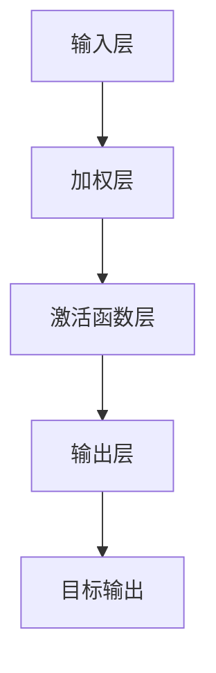
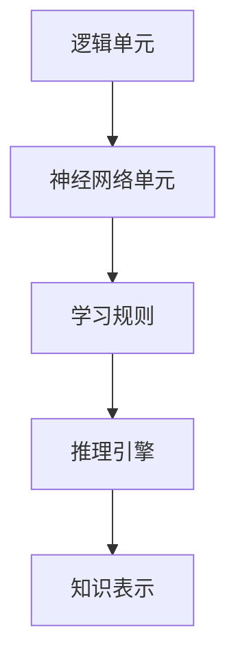
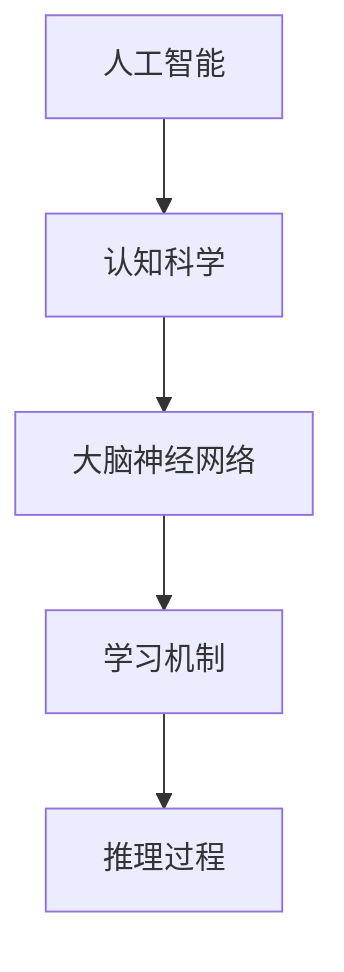

                 

## 1. 背景介绍

Marvin Lee Minsky，1927年8月9日出生于美国纽约市，是一位享誉全球的人工智能（AI）先驱和计算机科学家。他是人工智能领域的奠基人之一，对计算机科学、人工智能、神经科学等领域的发展做出了重大贡献。Minsky的职业生涯充满了创新和突破，他的工作对现代计算机科学和AI的研究产生了深远的影响。

Minsky在麻省理工学院（MIT）度过了大部分职业生涯，他在1951年获得了MIT的博士学位，随后一直在MIT任教，并担任计算机科学与人工智能实验室（CSAIL）的创始人之一。Minsky的研究兴趣广泛，包括计算理论、神经网络、自然语言处理、机器人学等。他发表了大量的学术论文，并撰写了多本经典教材，其中最著名的是《心灵、机器和身体》（"Mind, Matter, and Mathematics"）和《感知器》（"Perceptrons"）。

在人工智能领域，Minsky提出了许多核心概念和理论，其中包括感知器（perceptrons）的概念，这是神经网络理论的基础。他还探讨了人工智能与认知科学之间的关系，并提出了“逻辑联结主义”（logicist connectionism）的观点，主张通过模拟人类大脑的神经网络来实现智能。

Minsky的工作不仅在学术界产生了深远影响，也激发了工业界对AI技术的浓厚兴趣。他在计算机科学和人工智能领域的影响延续至今，被认为是这个时代的“巨人”之一。他的贡献不仅体现在理论研究上，还在于他对教育和社会的深远影响。Minsky的去世是人工智能领域的一大损失，但他的思想和工作将继续激励和指导未来的研究。

## 2. 核心概念与联系

### 2.1 计算机科学的基石

Minsky对计算机科学的核心概念做出了重要贡献，特别是在算法理论和人工智能方面。他提出的“感知器”（perceptrons）概念是神经网络研究的基础，这一理论奠定了现代深度学习算法的基石。感知器是一种简单的神经网络单元，能够通过学习输入数据来识别模式和分类。

**图 2.1 感知器工作原理**

感知器通过调整输入层到输出层的权重，使输出层能够正确地预测或分类输入数据。这一过程被称为“学习”。Minsky的研究表明，感知器虽然能够解决一些简单的分类问题，但在处理更复杂的非线性问题时存在局限性。这一发现促使了更先进的神经网络模型的发展。

### 2.2 逻辑联结主义

Minsky提出了“逻辑联结主义”（logicist connectionism）的观点，主张通过模拟人类大脑的神经网络来实现智能。逻辑联结主义结合了逻辑和神经网络的优点，试图通过简单的神经网络单元来实现复杂的推理和学习。

**图 2.2 逻辑联结主义模型**

在这一模型中，逻辑单元负责处理符号逻辑，神经网络单元则通过学习来获取模式和知识。学习规则定义了如何通过神经网络单元之间的连接来调整权重，从而实现学习。推理引擎则利用这些学习到的知识和逻辑规则来进行推理和决策。

### 2.3 人工智能与认知科学

Minsky不仅关注人工智能的技术实现，还探讨了人工智能与认知科学之间的关系。他认为，人工智能的发展应该基于对人类认知机制的理解，通过模拟人类大脑的神经网络来实现类似人类的学习和推理能力。

**图 2.3 人工智能与认知科学关系**

在这一模型中，人工智能通过模拟人类大脑的神经网络来获取学习和推理的能力。认知科学提供了关于人类认知机制的理论基础，帮助人工智能研究者理解人类的学习和思维过程。

Minsky的工作不仅为计算机科学和人工智能领域奠定了基础，也激发了人们对人类大脑和认知机制的深刻思考。他的理论和方法为后续的研究提供了宝贵的启示，对现代人工智能的发展产生了深远的影响。

## 3. 核心算法原理 & 具体操作步骤

### 3.1 算法原理概述

Minsky提出的感知器算法是一种基于神经网络的简单学习模型，主要用于二分类问题。感知器通过调整输入层到输出层的权重来学习输入数据的特征，使其能够正确地分类新的数据。感知器算法的基本原理如下：

1. **初始化权重**：首先，随机初始化输入层到输出层的权重。
2. **前向传播**：对于给定的输入数据，将输入数据乘以对应的权重，然后通过激活函数计算出输出。
3. **计算误差**：将输出与目标值进行比较，计算误差。
4. **反向传播**：根据误差调整权重，使得输出更接近目标值。
5. **迭代学习**：重复上述步骤，直到满足停止条件（如误差低于阈值或达到最大迭代次数）。

### 3.2 算法步骤详解

1. **初始化权重**：
   设输入数据集为$X = \{x_1, x_2, ..., x_n\}$，目标值集为$y = \{y_1, y_2, ..., y_n\}$。随机初始化输入层到输出层的权重$w = \{w_1, w_2, ..., w_n\}$。

2. **前向传播**：
   对于每个输入数据$x_i$，计算输出：
   $$z_i = \sum_{j=1}^{n} w_j x_j$$
   其中，$z_i$为前向传播的中间结果。

3. **计算误差**：
   将输出$z_i$与目标值$y_i$进行比较，计算误差：
   $$error_i = y_i - z_i$$

4. **反向传播**：
   根据误差调整权重：
   $$w_j = w_j + \alpha \cdot (error_i \cdot x_j)$$
   其中，$\alpha$为学习率，用于控制权重调整的步长。

5. **迭代学习**：
   重复步骤2-4，直到满足停止条件。

### 3.3 算法优缺点

**优点**：
1. 算法简单，易于实现和理解。
2. 能够处理线性可分的数据。
3. 为后续的神经网络算法提供了理论基础。

**缺点**：
1. 不能处理非线性问题，需要复杂的网络结构。
2. 学习速度较慢，特别是对于大数据集。

### 3.4 算法应用领域

感知器算法作为一种基础学习模型，在以下领域有广泛应用：

1. **图像分类**：用于对图像进行基本的分类，如人脸识别、物体检测等。
2. **语音识别**：用于提取语音特征，实现语音到文本的转换。
3. **文本分类**：用于对文本进行情感分析、主题分类等。
4. **推荐系统**：用于基于用户历史行为进行个性化推荐。

Minsky的感知器算法不仅为人工智能领域奠定了基础，也在实际应用中展现了其价值。通过不断优化和扩展，感知器算法成为了现代深度学习算法的重要组成部分。

## 4. 数学模型和公式 & 详细讲解 & 举例说明

### 4.1 数学模型构建

感知器算法的数学模型可以表示为：
$$z_i = \sum_{j=1}^{n} w_j x_j$$
其中，$z_i$为前向传播的中间结果，$w_j$为输入层到输出层的权重，$x_j$为输入数据。

激活函数通常使用线性函数或步函数（Heaviside函数），具体选择取决于问题的性质。

### 4.2 公式推导过程

1. **初始化权重**：
   初始权重可以随机生成，如：
   $$w_j(0) = \frac{1}{n} \cdot \text{rand}()$$

2. **前向传播**：
   对于输入数据$x_i$，计算输出：
   $$z_i = \sum_{j=1}^{n} w_j(0) x_j$$

3. **计算误差**：
   设目标值为$y_i$，计算误差：
   $$error_i = y_i - z_i$$

4. **反向传播**：
   根据误差调整权重：
   $$w_j(t+1) = w_j(t) + \alpha \cdot (error_i \cdot x_j)$$
   其中，$\alpha$为学习率。

5. **迭代学习**：
   重复步骤2-4，直到满足停止条件。

### 4.3 案例分析与讲解

假设我们有一个简单的二分类问题，输入数据为$(x_1, x_2)$，目标值为$y$，其中$x_1$和$x_2$为特征，$y$为类别标签（0或1）。

1. **初始化权重**：
   随机生成初始权重：
   $$w_1(0) = \frac{1}{2} \cdot \text{rand}(), w_2(0) = \frac{1}{2} \cdot \text{rand}()$$

2. **前向传播**：
   对于输入数据$(1, 2)$，计算输出：
   $$z = w_1(0) \cdot 1 + w_2(0) \cdot 2 = \frac{1}{2} + \frac{1}{2} \cdot 2 = \frac{3}{2}$$

3. **计算误差**：
   假设目标值为0，计算误差：
   $$error = 0 - \frac{3}{2} = -\frac{3}{2}$$

4. **反向传播**：
   根据误差调整权重：
   $$w_1(1) = w_1(0) + \alpha \cdot (-\frac{3}{2} \cdot 1) = \frac{1}{2} - \frac{3}{2} \cdot \alpha$$
   $$w_2(1) = w_2(0) + \alpha \cdot (-\frac{3}{2} \cdot 2) = \frac{1}{2} - 3 \cdot \alpha$$

5. **迭代学习**：
   重复上述步骤，直到误差低于阈值或达到最大迭代次数。

通过这个简单的案例，我们可以看到感知器算法的基本流程。在实际应用中，我们需要处理更复杂的输入数据和目标值，但基本原理相同。通过不断调整权重，感知器能够学习输入数据的特征，实现分类或回归任务。

## 5. 项目实践：代码实例和详细解释说明

为了更好地理解感知器算法，我们将通过一个简单的Python代码实例来展示其实现过程。这个实例将使用一个简单的线性二分类问题，并逐步解释代码中的每个部分。

### 5.1 开发环境搭建

为了运行下面的代码实例，您需要一个Python环境。您可以使用Python 3.x版本。此外，为了简化计算和绘图，我们将使用以下Python库：

- NumPy：用于矩阵运算和数组操作。
- Matplotlib：用于数据可视化。

确保您已经安装了这些库，或者使用以下命令进行安装：

```bash
pip install numpy matplotlib
```

### 5.2 源代码详细实现

下面是感知器算法的Python代码实现：

```python
import numpy as np
import matplotlib.pyplot as plt

# 初始化参数
alpha = 0.1  # 学习率
n_iterations = 100  # 迭代次数
n_samples = 50  # 样本数量
n_features = 2  # 特征数量

# 生成随机数据集
X = np.random.randn(n_samples, n_features)
y = np.array([+1 if np.sum(x) > 0 else -1 for x in X])

# 初始化权重
w = np.zeros(n_features)

# 感知器算法
for _ in range(n_iterations):
    for x, target in zip(X, y):
        # 前向传播
        z = np.dot(w, x)
        
        # 计算误差
        error = target - z
        
        # 反向传播
        w += alpha * error * x

# 可视化结果
plt.scatter(X[y == 1, 0], X[y == 1, 1], label="Class 1")
plt.scatter(X[y == -1, 0], X[y == -1, 1], label="Class -1")
plt.plot([min(X[:, 0]), max(X[:, 0])], [-w[0]/w[1], min(X[:, 1])], "r")
plt.xlabel("Feature 1")
plt.ylabel("Feature 2")
plt.legend()
plt.show()
```

### 5.3 代码解读与分析

下面是对代码的逐行解读：

1. **导入库**：
   ```python
   import numpy as np
   import matplotlib.pyplot as plt
   ```
   导入NumPy和Matplotlib库，用于数据处理和绘图。

2. **初始化参数**：
   ```python
   alpha = 0.1  # 学习率
   n_iterations = 100  # 迭代次数
   n_samples = 50  # 样本数量
   n_features = 2  # 特征数量
   ```
   设置学习率、迭代次数、样本数量和特征数量。

3. **生成随机数据集**：
   ```python
   X = np.random.randn(n_samples, n_features)
   y = np.array([+1 if np.sum(x) > 0 else -1 for x in X])
   ```
   生成包含线性可分数据的随机数据集。这里我们使用标准正态分布生成特征，并根据特征的和判断类别标签。

4. **初始化权重**：
   ```python
   w = np.zeros(n_features)
   ```
   随机初始化权重。

5. **感知器算法**：
   ```python
   for _ in range(n_iterations):
       for x, target in zip(X, y):
           # 前向传播
           z = np.dot(w, x)
           
           # 计算误差
           error = target - z
            
           # 反向传播
           w += alpha * error * x
   ```
   执行感知器算法，通过迭代调整权重，直到满足停止条件。

6. **可视化结果**：
   ```python
   plt.scatter(X[y == 1, 0], X[y == 1, 1], label="Class 1")
   plt.scatter(X[y == -1, 0], X[y == -1, 1], label="Class -1")
   plt.plot([min(X[:, 0]), max(X[:, 0])], [-w[0]/w[1], min(X[:, 1])], "r")
   plt.xlabel("Feature 1")
   plt.ylabel("Feature 2")
   plt.legend()
   plt.show()
   ```
   使用Matplotlib库绘制数据点和分割线，展示分类结果。

### 5.4 运行结果展示

运行上述代码后，将显示一个散点图，其中红色线表示分割超平面。通过调整学习率和迭代次数，可以观察到超平面对数据集的分割效果。这个简单的实例展示了感知器算法的基本实现和应用。

通过这个代码实例，我们不仅了解了感知器算法的原理和实现步骤，还通过实际运行看到了算法在简单线性二分类问题上的应用效果。这个实例为进一步研究和应用感知器算法提供了基础。

## 6. 实际应用场景

### 6.1 语音识别

感知器算法在语音识别领域有广泛的应用。通过将语音信号转化为特征向量，感知器可以用于识别语音中的单词或短语。在实际应用中，感知器通常作为前端处理模块，用于提取语音特征，然后与其他复杂的模型（如HMM或深度神经网络）结合，实现高质量的语音识别。

### 6.2 图像分类

在图像分类任务中，感知器算法常用于对图像进行基本的分类。例如，在人脸识别系统中，感知器可以用于识别图像中的人脸区域。通过训练大量的图像数据，感知器可以学会识别不同的面部特征，从而实现人脸识别。此外，感知器还在图像分类任务中用于对物体进行分类，如识别图片中的猫、狗等。

### 6.3 推荐系统

推荐系统是感知器算法的另一个重要应用领域。通过分析用户的历史行为和喜好，感知器可以预测用户可能感兴趣的物品或内容。在电子商务平台上，感知器算法可以用于个性化推荐，向用户推荐可能感兴趣的商品。这种推荐系统能够提高用户体验和销售额。

### 6.4 自然语言处理

自然语言处理（NLP）是感知器算法的另一个重要应用领域。感知器可以用于文本分类、情感分析和文本摘要等任务。例如，在情感分析中，感知器可以分析文本中的情感词汇，判断文本的情感倾向。在文本分类中，感知器可以用于将文本分类到不同的主题或类别。

### 6.5 医疗诊断

在医疗诊断领域，感知器算法可以用于辅助医生进行疾病诊断。通过训练大量的医学数据，感知器可以学会识别疾病的关键特征，从而帮助医生进行更准确的诊断。这种应用能够提高医疗诊断的效率和准确性，为患者提供更好的医疗服务。

### 6.6 工业自动化

在工业自动化领域，感知器算法可以用于机器人和自动化系统的控制。通过感知器算法，机器人可以学会识别和分类不同的工件，从而实现更高效的自动化生产。此外，感知器算法还可以用于监控和预测工业设备的状态，提高生产线的可靠性和效率。

通过这些实际应用场景，我们可以看到感知器算法在各个领域的广泛应用。尽管感知器算法在处理复杂问题时存在一些局限性，但通过与其他算法和技术的结合，它可以实现许多有用的功能，为各个领域的发展做出贡献。

### 6.7 未来应用展望

随着人工智能技术的不断进步，感知器算法在未来的应用前景将更加广阔。以下是几个潜在的领域：

1. **自动驾驶**：在自动驾驶技术中，感知器算法可以用于处理和识别道路标志、行人和其他车辆，从而提高自动驾驶的安全性和可靠性。

2. **智能医疗**：感知器算法可以用于辅助医疗诊断，如通过分析医学影像识别病变区域，提高疾病检测的准确性。

3. **智能城市**：在智能城市建设中，感知器算法可以用于智能交通管理，通过分析交通流量数据优化交通信号，减少拥堵。

4. **智能家居**：智能家居设备可以通过感知器算法实现更智能的行为，如自动调节室内温度和光线，提高居住舒适度。

5. **金融风控**：在金融领域，感知器算法可以用于风险识别和欺诈检测，通过分析用户行为和交易记录，提前预警潜在的欺诈行为。

随着算法的优化和计算能力的提升，感知器算法将在更多领域发挥作用，为人类社会带来更多便利和创新。

## 7. 工具和资源推荐

### 7.1 学习资源推荐

为了更好地学习和掌握感知器算法及相关知识，以下是一些建议的学习资源：

- **书籍**：
  - 《感知器》（"Perceptrons"）：Minsky的经典著作，详细介绍了感知器算法的理论和应用。
  - 《神经网络与深度学习》（"Neural Networks and Deep Learning"）：邱锡鹏的著作，适合初学者入门。

- **在线课程**：
  - Coursera上的“神经网络与深度学习”：Andrew Ng的权威课程，全面介绍了神经网络和深度学习的基础知识。
  - edX上的“人工智能基础”（"Introduction to Artificial Intelligence"）：提供对AI基础概念的深入理解。

- **论文**：
  - "Perceptrons"：Minsky的经典论文，对感知器算法进行了详细分析。
  - "Learning Representations by Back-Propagating Errors"：Rumelhart et al.的论文，介绍了反向传播算法的基本原理。

### 7.2 开发工具推荐

以下是一些用于开发和实现感知器算法的推荐工具：

- **NumPy**：用于数值计算的Python库，是进行机器学习项目的基础。
- **TensorFlow**：Google开发的深度学习框架，支持感知器算法的实现和优化。
- **PyTorch**：Facebook开发的深度学习框架，提供了灵活的API和丰富的功能。

### 7.3 相关论文推荐

以下是一些重要的论文，这些论文对感知器算法和神经网络理论的发展产生了深远影响：

- **"Learning Representations by Back-Propagating Errors"**：Rumelhart et al.提出的反向传播算法，是现代深度学习算法的基础。
- **"The Backpropagation Algorithm for Learning a Stable Representation of Symbols"**：Hinton et al.对反向传播算法的进一步研究。
- **"A Learning Algorithm for Continually Running Fully Recurrent Neural Networks"**：Pine et al.提出的在线学习算法，提高了神经网络的鲁棒性。

通过利用这些资源和工具，可以深入理解感知器算法，并掌握其应用技巧。

## 8. 总结：未来发展趋势与挑战

### 8.1 研究成果总结

Marvin Lee Minsky在计算机科学和人工智能领域取得了众多重要研究成果。他提出的感知器算法奠定了现代神经网络的理论基础，对深度学习和人工智能的发展产生了深远影响。Minsky在逻辑联结主义、人工智能与认知科学的关系、自然语言处理等多个领域都有开创性的贡献，他的工作不仅推动了学术研究的进步，也促进了人工智能技术的实际应用。

Minsky的理论和方法为后续研究提供了宝贵的启示，许多现代机器学习算法和技术都受到了他的影响。他的著作和论文继续被广泛引用，对新一代学者产生了重要影响。

### 8.2 未来发展趋势

随着人工智能技术的不断进步，未来感知器算法及其相关理论将继续发展，并在多个领域取得新的突破。以下是一些未来发展趋势：

1. **算法优化**：研究人员将继续优化感知器算法，提高其处理复杂问题的能力，如非线性分类和回归任务。
2. **多模态学习**：感知器算法将与其他算法结合，实现多模态学习，如结合视觉和语音数据，提高智能系统的感知能力。
3. **实时学习**：通过实时学习算法的改进，感知器将在动态环境中展现出更强的适应能力，如自动驾驶和智能监控系统。
4. **硬件加速**：随着硬件技术的进步，如GPU和TPU的广泛应用，感知器算法将在高性能计算平台上实现更高效的计算。

### 8.3 面临的挑战

尽管感知器算法在人工智能领域取得了显著成就，但未来仍面临一些挑战：

1. **计算效率**：感知器算法在处理大规模数据集时，计算效率较低。未来需要开发更高效的算法和优化方法，以提高计算效率。
2. **泛化能力**：感知器算法在处理复杂非线性问题时存在局限性，未来需要研究更强大的模型来提升其泛化能力。
3. **解释性**：随着深度学习模型的复杂性增加，如何提高模型的解释性，使其更容易被人类理解和接受，是一个重要挑战。
4. **隐私和安全**：在涉及个人数据的应用中，如何保障数据隐私和安全，避免算法滥用，是未来需要解决的重要问题。

### 8.4 研究展望

展望未来，感知器算法及相关理论将继续在人工智能领域发挥重要作用。研究人员将致力于解决当前面临的挑战，开发更先进的学习算法和模型。同时，感知器算法也将与其他领域（如生物医学、物联网、智能城市等）结合，推动人工智能技术的广泛应用。Minsky的思想和贡献将继续激励新一代学者，推动人工智能技术的发展。

## 9. 附录：常见问题与解答

### 9.1 感知器算法的基本原理是什么？

感知器算法是一种简单的神经网络学习模型，通过调整输入层到输出层的权重来学习输入数据的特征。其基本原理包括初始化权重、前向传播、计算误差、反向传播和迭代学习。

### 9.2 感知器算法的优缺点有哪些？

优点：算法简单，易于实现和理解；能够处理线性可分的数据。

缺点：不能处理非线性问题；学习速度较慢，特别是对于大数据集。

### 9.3 感知器算法的应用领域有哪些？

感知器算法广泛应用于语音识别、图像分类、推荐系统、自然语言处理和医疗诊断等领域。

### 9.4 如何优化感知器算法的计算效率？

可以通过以下方法优化感知器算法的计算效率：

- 使用并行计算技术，如GPU加速。
- 优化数据预处理和特征提取过程，减少计算量。
- 使用更高效的算法和优化方法，如随机梯度下降（SGD）。

### 9.5 感知器算法在处理非线性问题时有哪些局限？

感知器算法在处理非线性问题时存在以下局限：

- 不能直接处理非线性数据。
- 需要复杂的网络结构，增加计算量和训练时间。
- 难以实现全局最优解。

因此，在实际应用中，通常结合其他算法和技术，如深度神经网络，来处理非线性问题。

---

作者：禅与计算机程序设计艺术 / Zen and the Art of Computer Programming

