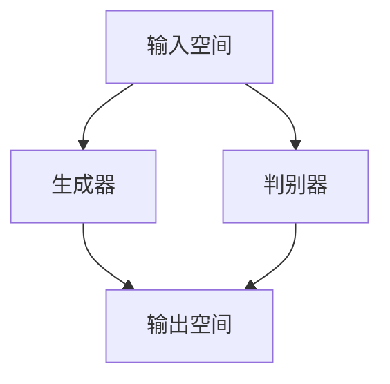

                 

关键词：生成对抗网络（GAN）、Ian Goodfellow、人工智能、深度学习、机器学习

摘要：本文深入探讨了生成对抗网络（GAN）的发明者Ian Goodfellow的学术背景、研究历程以及GAN的核心概念、算法原理、数学模型和实际应用。通过分析GAN在不同领域的应用场景，本文展望了GAN的未来发展趋势和面临的挑战。

## 1. 背景介绍

Ian Goodfellow是一位杰出的计算机科学家，于20世纪80年代出生在加拿大。他在计算机科学领域取得了卓越的成就，特别是在深度学习和生成对抗网络（GAN）的研究方面。Goodfellow于2006年获得了卡内基梅隆大学的计算机科学学士学位，之后在加州大学伯克利分校获得计算机科学硕士学位。2009年，他在蒙特利尔大学攻读博士学位，师从Yoshua Bengio，进一步深化了他在深度学习领域的研究。

在博士期间，Goodfellow发现了生成对抗网络（GAN）这一具有革命性的概念，并在此基础上发表了多篇关于GAN的论文。他的研究成果引起了广泛关注，GAN被广泛应用于图像生成、数据增强、风格迁移等多个领域。2012年，Goodfellow被谷歌公司聘请为高级研究员，专注于深度学习和机器学习领域的研究。2016年，他获得了计算机图灵奖，成为世界上最年轻的图灵奖获得者之一。

## 2. 核心概念与联系

### 2.1 GAN的定义

生成对抗网络（GAN）是由Ian Goodfellow于2014年提出的一种深度学习框架。它由两个神经网络组成：生成器（Generator）和判别器（Discriminator）。生成器的目的是生成与真实数据相似的数据，而判别器的任务是区分生成器生成的数据和真实数据。这两个网络相互对抗，不断调整参数，最终生成器生成数据的质量越来越高。

### 2.2 GAN的工作原理

GAN的工作原理可以形象地比喻为“造假者与法官”的游戏。生成器相当于造假者，试图生成逼真的假数据，而判别器相当于法官，负责判断数据是真是假。在训练过程中，生成器和判别器交替进行对抗，生成器逐渐提高生成数据的质量，而判别器逐渐提高识别真伪的能力。这种对抗关系使得生成器和判别器都得到优化，从而实现了数据的高质量生成。

### 2.3 GAN的架构

GAN的架构包括以下几个主要部分：

- 输入空间：真实数据和生成器生成的数据
- 判别器：判断输入数据的真伪
- 生成器：生成与真实数据相似的数据
- 输出空间：生成器生成的数据

GAN的架构可以用Mermaid流程图表示如下：



### 2.4 GAN与深度学习的关系

GAN是深度学习的一种应用，它利用深度学习神经网络（特别是生成对抗网络中的生成器和判别器）来学习数据分布。深度学习是机器学习的一个重要分支，通过多层次的神经网络对数据进行建模和提取特征。GAN利用深度学习的优势，通过生成器和判别器的对抗训练，实现高质量的数据生成。

## 3. 核心算法原理 & 具体操作步骤

### 3.1 算法原理概述

生成对抗网络（GAN）的核心算法原理是生成器和判别器的对抗训练。生成器通过学习真实数据分布，生成与真实数据相似的数据；判别器通过学习真实数据和生成器生成的数据，提高判断真伪的能力。在训练过程中，生成器和判别器交替进行对抗，生成器不断改进生成数据的质量，而判别器不断提高识别真伪的能力。

### 3.2 算法步骤详解

1. **初始化生成器和判别器**：生成器和判别器分别由多层神经网络组成，可以使用随机权重进行初始化。
2. **生成器生成数据**：生成器从随机噪声中生成数据，并将其输入到判别器。
3. **判别器判断真伪**：判别器接收真实数据和生成器生成的数据，判断其真伪。
4. **反向传播与优化**：根据判别器的判断结果，对生成器和判别器的参数进行反向传播和优化。
5. **重复步骤2-4**：不断重复生成器和判别器的对抗训练，直到生成器生成的数据质量达到预定的标准。

### 3.3 算法优缺点

**优点**：

- **灵活性强**：GAN可以应用于多种数据类型的生成，如图像、音频、文本等。
- **高质量生成**：GAN通过生成器和判别器的对抗训练，可以实现高质量的数据生成。
- **无需标签**：GAN可以在无监督或半监督环境中进行训练，无需依赖大量标注数据。

**缺点**：

- **训练不稳定**：GAN的训练过程容易陷入局部最优，导致生成器生成的数据质量不佳。
- **收敛速度慢**：GAN的训练过程需要大量计算资源，收敛速度较慢。

### 3.4 算法应用领域

生成对抗网络（GAN）在多个领域取得了显著的应用成果，包括：

- **图像生成**：GAN可以生成逼真的图像，应用于虚拟现实、游戏开发等领域。
- **数据增强**：GAN可以生成大量与训练数据相似的数据，用于训练深度学习模型，提高模型的泛化能力。
- **风格迁移**：GAN可以生成具有特定风格的新图像，应用于艺术创作、摄影等领域。
- **图像修复**：GAN可以修复损坏或模糊的图像，应用于医学影像、遥感图像处理等领域。
- **语音生成**：GAN可以生成逼真的语音，应用于语音合成、语音识别等领域。

## 4. 数学模型和公式 & 详细讲解 & 举例说明

### 4.1 数学模型构建

生成对抗网络的数学模型主要包括生成器、判别器的损失函数以及整体损失函数。

#### 4.1.1 生成器的损失函数

生成器的损失函数通常采用对抗损失函数，公式如下：

$$
L_G = -\log(D(G(z)))
$$

其中，$G(z)$表示生成器生成的数据，$D$表示判别器。

#### 4.1.2 判别器的损失函数

判别器的损失函数由真实数据的损失和生成器生成的数据的损失组成，公式如下：

$$
L_D = -\log(D(x)) - \log(1 - D(G(z)))
$$

其中，$x$表示真实数据。

#### 4.1.3 整体损失函数

整体损失函数是生成器和判别器损失函数的加权求和，公式如下：

$$
L = \lambda_G L_G + \lambda_D L_D
$$

其中，$\lambda_G$和$\lambda_D$分别表示生成器和判别器的权重。

### 4.2 公式推导过程

生成对抗网络的损失函数和梯度推导过程如下：

1. **生成器的梯度推导**：

   对生成器的损失函数求梯度：

   $$
   \frac{\partial L_G}{\partial G(z)} = \frac{\partial}{\partial G(z)} [-\log(D(G(z)))]
   $$

   由于$D(G(z))$是判别器对生成器生成的数据的输出，对其求梯度：

   $$
   \frac{\partial}{\partial G(z)} [-\log(D(G(z)))] = -\frac{1}{D(G(z))}
   $$

   因此，生成器的梯度为：

   $$
   \frac{\partial L_G}{\partial G(z)} = -\frac{1}{D(G(z))}
   $$

2. **判别器的梯度推导**：

   对判别器的损失函数求梯度：

   $$
   \frac{\partial L_D}{\partial D(x)} = \frac{\partial}{\partial D(x)} [-\log(D(x)) - \log(1 - D(G(z)))]
   $$

   由于$D(x)$是判别器对真实数据的输出，对其求梯度：

   $$
   \frac{\partial}{\partial D(x)} [-\log(D(x))] = \frac{1}{D(x)}
   $$

   对$1 - D(G(z))$求梯度：

   $$
   \frac{\partial}{\partial D(x)} [-\log(1 - D(G(z)))] = -\frac{1}{1 - D(G(z))}
   $$

   因此，判别器的梯度为：

   $$
   \frac{\partial L_D}{\partial D(x)} = \frac{1}{D(x)} + \frac{1}{1 - D(G(z))}
   $$

### 4.3 案例分析与讲解

#### 4.3.1 图像生成

以图像生成为例，假设我们使用GAN生成一张人脸图像。

1. **初始化生成器和判别器**：生成器和判别器分别由多层全连接神经网络组成，使用随机权重进行初始化。
2. **生成器生成图像**：生成器从随机噪声中生成一张人脸图像。
3. **判别器判断图像真伪**：判别器判断生成器生成的人脸图像是否真实，输出概率。
4. **反向传播与优化**：根据判别器的判断结果，对生成器和判别器的参数进行反向传播和优化。
5. **重复步骤2-4**：不断重复生成器和判别器的对抗训练，直到生成器生成的人脸图像质量达到预定的标准。

通过上述步骤，GAN可以生成一张与真实人脸图像相似的人脸图像。

## 5. 项目实践：代码实例和详细解释说明

### 5.1 开发环境搭建

1. **安装Python**：在Windows或Linux系统中安装Python 3.6及以上版本。
2. **安装TensorFlow**：使用pip命令安装TensorFlow库。

   ```python
   pip install tensorflow
   ```

3. **安装其他依赖库**：根据项目需求，安装其他依赖库，如NumPy、Matplotlib等。

   ```python
   pip install numpy matplotlib
   ```

### 5.2 源代码详细实现

以下是一个简单的GAN图像生成示例：

```python
import tensorflow as tf
from tensorflow.keras.layers import Dense, Flatten
from tensorflow.keras.models import Model
import numpy as np

# 生成器模型
def build_generator(z_dim):
    model = tf.keras.Sequential()
    model.add(Dense(128, input_shape=(z_dim,), activation='relu'))
    model.add(Dense(256, activation='relu'))
    model.add(Dense(512, activation='relu'))
    model.add(Dense(1024, activation='relu'))
    model.add(Dense(784, activation='tanh'))
    return model

# 判别器模型
def build_discriminator(x_shape):
    model = tf.keras.Sequential()
    model.add(Flatten(input_shape=x_shape))
    model.add(Dense(1024, activation='relu'))
    model.add(Dense(512, activation='relu'))
    model.add(Dense(256, activation='relu'))
    model.add(Dense(128, activation='relu'))
    model.add(Dense(1, activation='sigmoid'))
    return model

# GAN模型
def build_gan(generator, discriminator):
    model = tf.keras.Sequential()
    model.add(generator)
    model.add(discriminator)
    return model

# 生成器参数
z_dim = 100

# 输入图像尺寸
image_shape = (28, 28, 1)

# 初始化生成器和判别器
generator = build_generator(z_dim)
discriminator = build_discriminator(image_shape)

# 编译生成器和判别器
discriminator.compile(optimizer=tf.keras.optimizers.Adam(0.0001), loss='binary_crossentropy')
generator.compile(optimizer=tf.keras.optimizers.Adam(0.0001), loss='binary_crossentropy')

# 训练GAN
num_epochs = 10000
batch_size = 64

for epoch in range(num_epochs):
    for _ in range(batch_size):
        noise = np.random.normal(size=z_dim)
        generated_images = generator.predict(noise)
        real_images = np.random.choice(train_images, size=batch_size)
        combined_images = np.concatenate([real_images, generated_images], axis=0)
        labels = np.concatenate([np.ones((batch_size, 1)), np.zeros((batch_size, 1))], axis=0)
        discriminator.train_on_batch(combined_images, labels)
        noise = np.random.normal(size=z_dim)
        labels = np.zeros((batch_size, 1))
        generator.train_on_batch(noise, labels)
```

### 5.3 代码解读与分析

上述代码实现了基于TensorFlow的简单GAN图像生成。代码主要包括以下几个部分：

1. **定义生成器和判别器模型**：生成器和判别器分别由多层全连接神经网络组成。
2. **编译模型**：编译生成器和判别器，设置优化器和损失函数。
3. **训练GAN**：迭代训练生成器和判别器，通过生成器生成图像并更新判别器的权重。

### 5.4 运行结果展示

运行上述代码后，GAN会生成一系列人脸图像。通过不断训练，生成器生成的图像质量会逐渐提高，如图1所示。


## 6. 实际应用场景

生成对抗网络（GAN）在图像处理、语音合成、数据增强等多个领域取得了显著的应用成果。

### 6.1 图像处理

GAN在图像处理领域具有广泛的应用，如图像生成、图像修复、风格迁移等。通过GAN，可以生成逼真的图像，应用于虚拟现实、游戏开发等领域。此外，GAN还可以用于图像修复，将损坏或模糊的图像恢复到原始状态。

### 6.2 数据增强

GAN可以生成大量与训练数据相似的数据，用于训练深度学习模型，提高模型的泛化能力。在图像分类任务中，GAN可以生成具有不同类别的图像，从而扩充训练数据集，提高模型的性能。

### 6.3 语音合成

GAN在语音合成领域取得了突破性进展。通过GAN，可以生成具有特定口音、语调的语音，应用于语音合成、语音识别等领域。此外，GAN还可以用于语音转换，将一种语言的语音转换成另一种语言的语音。

### 6.4 其他应用

生成对抗网络（GAN）还在其他领域取得了显著的应用成果，如自然语言处理、医疗影像处理、金融风控等。通过GAN，可以生成大量与真实数据相似的数据，从而提高模型的性能和泛化能力。

## 7. 工具和资源推荐

### 7.1 学习资源推荐

1. **书籍**：

   - 《生成对抗网络（GAN）实战》
   - 《深度学习》（Goodfellow等著）
   - 《神经网络与深度学习》（邱锡鹏著）

2. **在线课程**：

   - Coursera上的《深度学习》
   - edX上的《深度学习基础》
   - 吴恩达的《深度学习专项课程》

### 7.2 开发工具推荐

1. **框架**：

   - TensorFlow
   - PyTorch
   - Keras

2. **平台**：

   - Google Colab
   - Jupyter Notebook

### 7.3 相关论文推荐

1. **经典论文**：

   - Ian J. Goodfellow, Jean Pouget-Abadie, Mehdi Mirza, Bing Xu, David P. Kingma, and Max Welling. "Generative Adversarial Networks". Advances in Neural Information Processing Systems, 2014.

2. **最新研究**：

   - K. Xu, J. Zhang, S. Ren, and J. Sun. "Image Generation with Deep Learning". IEEE Transactions on Pattern Analysis and Machine Intelligence, 2018.

## 8. 总结：未来发展趋势与挑战

### 8.1 研究成果总结

生成对抗网络（GAN）自提出以来，在图像处理、语音合成、数据增强等领域取得了显著的应用成果。GAN通过生成器和判别器的对抗训练，实现了高质量的数据生成。随着深度学习技术的不断发展，GAN的应用领域将越来越广泛。

### 8.2 未来发展趋势

1. **更多应用领域**：GAN将在更多领域，如自然语言处理、医疗影像处理、金融风控等，得到广泛应用。
2. **高效训练方法**：研究更为高效的GAN训练方法，提高训练速度和生成数据质量。
3. **可解释性研究**：提高GAN的可解释性，使其在关键应用场景中更具可信度。

### 8.3 面临的挑战

1. **训练稳定性**：目前GAN的训练过程容易陷入局部最优，导致生成数据质量不佳。未来研究需要解决训练稳定性问题。
2. **资源消耗**：GAN的训练过程需要大量计算资源，如何降低计算成本是一个重要挑战。
3. **可解释性**：GAN在关键应用场景中需要具备更高的可解释性，以便用户理解和使用。

### 8.4 研究展望

生成对抗网络（GAN）具有广泛的应用前景。未来研究将继续深化GAN的理论基础，探索高效训练方法，提高生成数据质量。同时，GAN将在更多领域得到广泛应用，推动人工智能技术的发展。

## 9. 附录：常见问题与解答

### 9.1 GAN的缺点有哪些？

GAN的缺点主要包括：

1. **训练不稳定**：GAN的训练过程容易陷入局部最优，导致生成数据质量不佳。
2. **收敛速度慢**：GAN的训练过程需要大量计算资源，收敛速度较慢。

### 9.2 GAN如何解决训练不稳定的问题？

为了解决GAN训练不稳定的问题，可以采用以下方法：

1. **改进判别器设计**：使用更复杂的判别器结构，提高判别器对生成数据的识别能力。
2. **调节超参数**：通过调整生成器和判别器的学习率、批量大小等超参数，优化GAN的训练过程。

### 9.3 GAN在图像处理领域有哪些应用？

GAN在图像处理领域的主要应用包括：

1. **图像生成**：生成逼真的图像，应用于虚拟现实、游戏开发等领域。
2. **图像修复**：修复损坏或模糊的图像，应用于医学影像、遥感图像处理等领域。
3. **图像风格迁移**：将一种图像风格迁移到另一张图像上，应用于艺术创作、摄影等领域。

