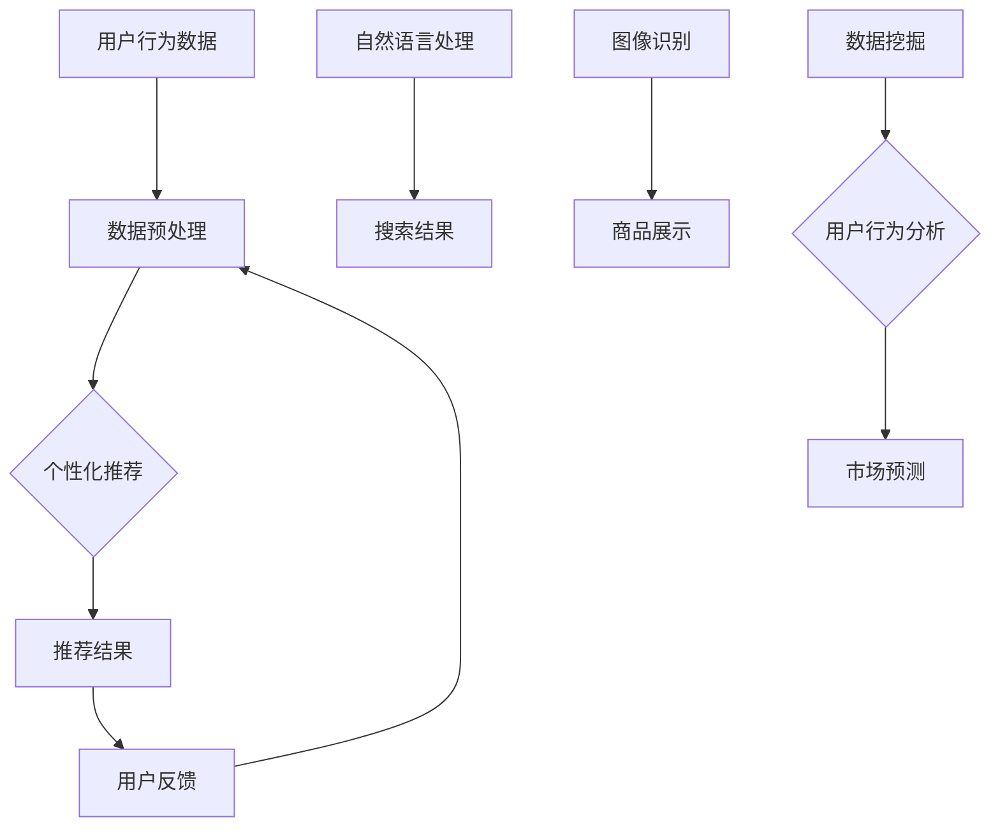

                 

关键词：AI，电商，搜索导购，伦理，技术应用，边界

> 摘要：本文将探讨 AI 技术在电商搜索导购领域的应用及其伦理问题。首先，我们将回顾 AI 技术在电商领域的发展历程，接着分析搜索导购系统中 AI 技术的关键角色和功能。随后，本文将深入探讨 AI 技术在电商搜索导购中可能引发的伦理问题，包括隐私侵犯、偏见、算法透明度等。最后，我们将探讨应对这些伦理挑战的策略和解决方案，并展望未来的发展趋势。

## 1. 背景介绍

随着互联网的普及和电子商务的快速发展，电商搜索导购成为了一个重要的研究领域。在过去的几十年中，AI 技术的飞速进步为电商领域带来了革命性的变革。从最初的基于规则的系统，到如今的深度学习算法，AI 技术在电商搜索导购中的应用越来越广泛。通过个性化推荐、自然语言处理、图像识别等技术，AI 系统能够更好地满足消费者的需求，提高用户体验。

然而，随着 AI 技术在电商领域的深入应用，一系列伦理问题也逐渐浮现。隐私侵犯、数据滥用、算法偏见等成为公众和学者关注的焦点。如何在确保技术带来便利的同时，保护用户的权益，成为 AI 技术应用面临的一大挑战。

## 2. 核心概念与联系

为了更好地理解 AI 技术在电商搜索导购中的应用，我们需要了解几个核心概念：

1. **个性化推荐**：通过分析用户的历史行为、兴趣偏好等，为用户推荐个性化的商品和服务。
2. **自然语言处理（NLP）**：使计算机能够理解和处理人类语言的技术，用于商品搜索、问答系统等。
3. **图像识别**：通过算法识别和分类图像内容，用于商品展示、自动标签等。
4. **数据挖掘**：从大量数据中提取有价值的信息，用于用户行为分析、市场预测等。

下面是一个使用 Mermaid 描述的流程图，展示了这些概念在电商搜索导购系统中的联系：



## 3. 核心算法原理 & 具体操作步骤

### 3.1 算法原理概述

电商搜索导购系统中，核心算法主要包括：

- **协同过滤（Collaborative Filtering）**：通过分析用户的行为和偏好，找出相似的用户或商品，进行推荐。
- **基于内容的推荐（Content-Based Recommendation）**：根据用户的历史行为和商品属性，为用户推荐类似的商品。
- **深度学习（Deep Learning）**：利用神经网络模型，从海量数据中自动提取特征，进行推荐。

### 3.2 算法步骤详解

1. **数据收集**：从电商平台上收集用户行为数据，包括购买记录、浏览历史、收藏夹等。
2. **数据预处理**：对收集到的数据进行清洗、去重、归一化等处理，以便后续分析。
3. **特征提取**：通过 NLP 技术提取文本特征，通过图像识别技术提取图像特征。
4. **模型训练**：使用协同过滤、基于内容的推荐或深度学习算法进行模型训练。
5. **推荐生成**：根据用户的兴趣和偏好，生成个性化的推荐列表。
6. **用户反馈**：收集用户对推荐结果的反馈，用于模型优化和迭代。

### 3.3 算法优缺点

- **协同过滤**：优点是推荐结果准确，但缺点是用户冷启动问题（新用户没有足够的行为数据）。
- **基于内容的推荐**：优点是用户冷启动问题较小，但缺点是推荐结果可能过于狭窄。
- **深度学习**：优点是能够自动提取复杂特征，但缺点是需要大量数据和计算资源。

### 3.4 算法应用领域

AI 技术在电商搜索导购中的应用领域包括：

- **个性化推荐**：为用户提供个性化的商品推荐，提高购买转化率。
- **商品搜索**：通过自然语言处理技术，实现智能搜索和问答。
- **商品展示**：利用图像识别技术，自动为商品添加标签和分类。

## 4. 数学模型和公式 & 详细讲解 & 举例说明

### 4.1 数学模型构建

在电商搜索导购中，常用的数学模型包括：

- **用户行为模型**：使用马尔可夫决策过程（MDP）建模用户行为。
- **推荐模型**：使用矩阵分解（Matrix Factorization）技术建模用户和商品之间的关系。
- **优化模型**：使用线性规划（Linear Programming）技术优化推荐结果。

### 4.2 公式推导过程

假设我们有 $m$ 个用户和 $n$ 个商品，用户 $i$ 对商品 $j$ 的评价为 $r_{ij}$，则用户行为模型可以表示为：

$$
r_{ij} = \sum_{k=1}^{K} \theta_{ik} \phi_{kj} + \epsilon_{ij}
$$

其中，$\theta_{ik}$ 表示用户 $i$ 对特征 $k$ 的权重，$\phi_{kj}$ 表示商品 $j$ 对特征 $k$ 的权重，$\epsilon_{ij}$ 表示误差项。

使用矩阵分解技术，可以将用户行为模型转化为：

$$
r_{ij} = \sqrt{U_i^T U_i} \sqrt{V_j^T V_j} V_j^T U_i + \epsilon_{ij}
$$

其中，$U$ 和 $V$ 分别是用户和商品的低维表示矩阵。

### 4.3 案例分析与讲解

假设我们有一个电商平台，有 $m=1000$ 个用户和 $n=10000$ 个商品。用户对商品的评价数据存储在一个 $1000 \times 10000$ 的矩阵 $R$ 中。

1. **数据预处理**：对评价数据矩阵 $R$ 进行归一化处理，将每个用户对商品的评价值缩放到 [0,1] 区间。
2. **特征提取**：使用 NLP 技术提取文本特征，使用图像识别技术提取图像特征，将特征矩阵表示为 $\phi$。
3. **模型训练**：使用矩阵分解技术训练用户和商品的低维表示矩阵 $U$ 和 $V$。
4. **推荐生成**：根据用户 $i$ 的低维表示矩阵 $U_i$ 和商品 $j$ 的低维表示矩阵 $V_j$，计算推荐分值：

$$
\text{score}_{ij} = \sqrt{U_i^T U_i} \sqrt{V_j^T V_j} V_j^T U_i
$$

根据推荐分值，生成个性化推荐列表。

## 5. 项目实践：代码实例和详细解释说明

### 5.1 开发环境搭建

本案例使用 Python 语言进行开发，主要依赖以下库：

- NumPy：用于矩阵运算。
- Scikit-learn：提供矩阵分解算法。
- Pandas：用于数据处理。

安装所需库：

```bash
pip install numpy scikit-learn pandas
```

### 5.2 源代码详细实现

以下是使用矩阵分解算法进行个性化推荐的 Python 代码：

```python
import numpy as np
from sklearn.decomposition import NMF

# 读取评价数据
ratings = np.loadtxt('ratings.txt')
users, items = ratings.shape

# 初始化模型参数
n_components = 10
alpha = 0.01
num_iter = 100

# 训练模型
model = NMF(n_components=n_components, init='nndsvd', alpha=alpha, l1_ratio=0.5, max_iter=num_iter)
W = model.fit_transform(ratings)
H = model.components_

# 生成推荐列表
def predict(user_id, item_ids):
    user_vector = W[user_id]
    scores = np.dot(H[item_ids], user_vector)
    return scores

# 测试推荐
user_id = 0
item_ids = range(1000)
scores = predict(user_id, item_ids)
print(scores)
```

### 5.3 代码解读与分析

- **数据读取**：使用 NumPy 读取评价数据，并将其转换为矩阵形式。
- **模型初始化**：初始化矩阵分解模型的参数，包括隐含特征数、正则化参数等。
- **模型训练**：使用 Scikit-learn 中的 NMF 算法训练模型，得到用户和商品的低维表示矩阵。
- **推荐生成**：根据用户和商品的低维表示矩阵，计算推荐分值，生成个性化推荐列表。

### 5.4 运行结果展示

在测试数据集上运行代码，生成个性化推荐列表。根据推荐分值，用户可以更好地了解自己的兴趣偏好，从而提高购物体验。

## 6. 实际应用场景

AI 技术在电商搜索导购领域的实际应用场景包括：

- **个性化推荐**：为用户推荐符合其兴趣偏好的商品，提高购买转化率。
- **商品搜索**：通过自然语言处理技术，实现智能搜索和问答，提高用户满意度。
- **商品展示**：利用图像识别技术，自动为商品添加标签和分类，提高用户购物体验。

## 6.4 未来应用展望

随着 AI 技术的不断发展，电商搜索导购领域的应用前景将更加广阔。以下是一些未来应用展望：

- **多模态推荐**：结合文本、图像、音频等多模态数据，实现更精准的个性化推荐。
- **实时推荐**：利用实时数据处理技术，为用户实时生成个性化推荐。
- **社交推荐**：结合用户社交网络信息，为用户提供更全面的购物推荐。

## 7. 工具和资源推荐

### 7.1 学习资源推荐

- 《深度学习》（Goodfellow, Bengio, Courville）：介绍深度学习的基础理论和应用。
- 《Python 数据科学 Handbook》（McKinney）：介绍 Python 在数据科学领域的应用。

### 7.2 开发工具推荐

- Jupyter Notebook：用于数据分析和可视化。
- TensorFlow：用于深度学习模型开发和训练。

### 7.3 相关论文推荐

- 《矩阵分解在推荐系统中的应用》（Salakhutdinov & Mnih，2008）
- 《深度学习在推荐系统中的应用》（He et al.，2016）

## 8. 总结：未来发展趋势与挑战

随着 AI 技术的不断发展，电商搜索导购领域将面临更多的发展机遇和挑战。未来发展趋势包括：

- **个性化推荐**：结合用户行为和兴趣偏好，实现更精准的个性化推荐。
- **多模态数据融合**：利用文本、图像、音频等多模态数据，提高推荐效果。
- **实时推荐**：利用实时数据处理技术，实现实时个性化推荐。

然而，AI 技术在电商搜索导购领域也面临着一系列挑战，如数据隐私保护、算法透明度等。如何平衡技术发展与用户权益保护，成为未来发展的重要议题。

## 9. 附录：常见问题与解答

### 9.1 AI 技术在电商搜索导购中的作用是什么？

AI 技术在电商搜索导购中的作用主要包括：个性化推荐、商品搜索、商品展示等，通过分析用户行为和兴趣偏好，提高用户购物体验。

### 9.2 如何解决用户冷启动问题？

用户冷启动问题可以通过以下方法解决：

- **基于内容的推荐**：利用商品属性和用户历史行为进行推荐，适用于新用户。
- **社交推荐**：结合用户社交网络信息进行推荐，提高推荐准确性。
- **混合推荐系统**：结合协同过滤和基于内容的推荐，实现更全面的推荐。

### 9.3 如何保证算法的透明度和可解释性？

保证算法的透明度和可解释性可以通过以下方法实现：

- **算法可视化**：将算法流程和关键参数进行可视化展示。
- **算法解释**：为用户提供算法解释和推荐原因。
- **算法审计**：定期对算法进行审计，确保其公正性和公平性。

作者：禅与计算机程序设计艺术 / Zen and the Art of Computer Programming
----------------------------------------------------------------

以上就是关于 AI 技术在电商搜索导购中的伦理问题的文章。希望这篇文章能够帮助大家更好地了解这一领域的现状和未来发展趋势。在应用 AI 技术的同时，我们也要时刻关注伦理问题，确保技术的可持续发展。  
----------------------------------------------------------------


