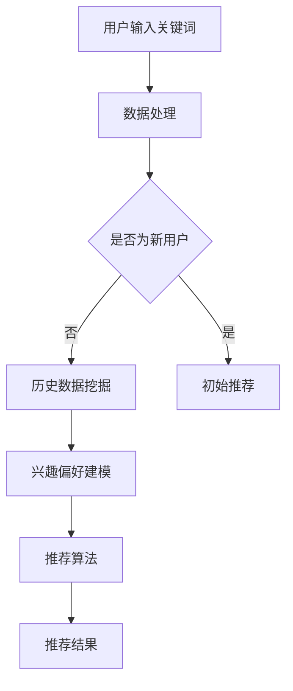

                 

关键词：人工智能、电商搜索、信息茧房效应、用户行为分析、算法优化

摘要：本文探讨了人工智能技术如何影响电商搜索导购中的信息茧房效应。通过分析用户行为和算法优化的方法，我们揭示了信息茧房效应的产生机制及其对电商用户体验和商业策略的潜在影响。文章旨在为电商企业提供技术策略，以优化搜索导购系统，同时提升用户的满意度。

## 1. 背景介绍

### 1.1 电商搜索导购的兴起

随着互联网的普及和电商行业的迅猛发展，电商搜索导购已成为现代电子商务的重要组成部分。用户通过搜索引擎或内置的搜索功能，输入关键词来查找所需商品。而电商平台的搜索算法则根据用户的搜索历史、浏览记录和购买行为等数据，为用户推荐相关的商品。这种搜索导购系统大大提升了用户的购物效率和体验。

### 1.2 信息茧房效应的提出

然而，随着个性化推荐算法的广泛应用，信息茧房效应也逐渐显现。信息茧房效应是指用户在互联网上长期接触与自己观点相似的信息，导致认知封闭、视野狭窄的现象。在电商搜索导购中，这意味着用户可能只看到自己感兴趣的、被推荐的商品，而无法发现其他可能更适合他们的商品。

### 1.3 问题的提出

信息茧房效应对电商搜索导购带来了诸多挑战。一方面，用户可能会对推荐系统产生抵触情绪，降低购物体验；另一方面，电商企业可能因推荐精度不足而错失商业机会。因此，如何通过人工智能技术来缓解信息茧房效应，提升搜索导购系统的质量和用户体验，成为电商领域亟待解决的问题。

## 2. 核心概念与联系

### 2.1 用户行为分析

用户行为分析是电商搜索导购系统的核心。通过收集和分析用户的搜索历史、浏览记录、点击行为、购买记录等数据，可以了解用户的兴趣偏好和行为模式。

### 2.2 算法优化

算法优化是缓解信息茧房效应的关键。传统的基于内容的推荐算法和协同过滤算法在处理大规模用户数据时存在局限性。为此，引入深度学习、图神经网络等先进的人工智能技术，以提高推荐系统的精确度和多样性。

### 2.3 Mermaid 流程图



## 3. 核心算法原理 & 具体操作步骤

### 3.1 算法原理概述

本文采用基于深度学习和图神经网络的推荐算法，以提高推荐系统的多样性。深度学习模型可以捕捉用户行为的高层次特征，而图神经网络则可以挖掘用户之间潜在的关联关系。

### 3.2 算法步骤详解

#### 3.2.1 深度学习模型

1. **数据预处理**：对用户行为数据进行清洗和归一化处理。
2. **特征提取**：利用卷积神经网络（CNN）和循环神经网络（RNN）提取用户行为数据中的高维特征。
3. **模型训练**：使用用户行为特征和商品属性数据，训练深度学习模型，以预测用户对商品的偏好。

#### 3.2.2 图神经网络

1. **构建用户商品图**：根据用户的浏览和购买记录，构建用户与商品之间的图结构。
2. **图卷积神经网络（GCN）**：利用GCN学习用户和商品之间的复杂关联关系。
3. **融合深度学习模型**：将深度学习模型和GCN的输出进行融合，生成最终的推荐结果。

### 3.3 算法优缺点

#### 优点：

1. **高精度**：深度学习和图神经网络可以捕捉用户行为和商品属性之间的复杂关系，提高推荐精度。
2. **多样性**：通过图神经网络挖掘用户之间的潜在关联，提高推荐结果的多样性。

#### 缺点：

1. **计算复杂度高**：深度学习和图神经网络模型在训练和推理过程中计算复杂度较高。
2. **数据需求大**：模型训练需要大量用户行为数据和商品属性数据。

### 3.4 算法应用领域

该算法适用于大型电商平台的搜索导购系统，以提高用户满意度和商业价值。

## 4. 数学模型和公式 & 详细讲解 & 举例说明

### 4.1 数学模型构建

#### 4.1.1 深度学习模型

设用户 $u$ 对商品 $i$ 的偏好为 $r_{ui}$，用户行为特征向量 $x_u$，商品特征向量 $x_i$，则深度学习模型的输出为：

$$
r_{ui} = \sigma(W \cdot [x_u, x_i] + b)
$$

其中，$\sigma$ 为激活函数，$W$ 为权重矩阵，$b$ 为偏置。

#### 4.1.2 图神经网络

设用户和商品构成的图 $G = (V, E)$，其中 $V$ 为节点集合，$E$ 为边集合。图卷积神经网络的输出为：

$$
h_i^{(l+1)} = \sigma \left( \sum_{j \in \mathcal{N}(i)} W^{(l)} h_j^{(l)} + b^{(l)} \right)
$$

其中，$h_i^{(l)}$ 为节点 $i$ 在第 $l$ 层的表示，$\mathcal{N}(i)$ 为节点 $i$ 的邻域节点集合。

### 4.2 公式推导过程

#### 4.2.1 深度学习模型

设用户 $u$ 对商品 $i$ 的偏好为 $r_{ui}$，用户行为特征向量 $x_u$，商品特征向量 $x_i$，则深度学习模型的输出为：

$$
r_{ui} = \sigma(W \cdot [x_u, x_i] + b)
$$

其中，$\sigma$ 为激活函数，$W$ 为权重矩阵，$b$ 为偏置。

#### 4.2.2 图神经网络

设用户和商品构成的图 $G = (V, E)$，其中 $V$ 为节点集合，$E$ 为边集合。图卷积神经网络的输出为：

$$
h_i^{(l+1)} = \sigma \left( \sum_{j \in \mathcal{N}(i)} W^{(l)} h_j^{(l)} + b^{(l)} \right)
$$

其中，$h_i^{(l)}$ 为节点 $i$ 在第 $l$ 层的表示，$\mathcal{N}(i)$ 为节点 $i$ 的邻域节点集合。

### 4.3 案例分析与讲解

#### 4.3.1 案例背景

某电商平台的用户数为 100 万，商品数为 10 万。平台采用基于深度学习和图神经网络的推荐算法，以提高用户满意度和商业价值。

#### 4.3.2 数据准备

1. 用户行为数据：包含用户浏览、点击、购买等行为记录，共 1000 万条。
2. 商品属性数据：包含商品类别、品牌、价格等属性，共 10 万条。

#### 4.3.3 模型训练

1. 深度学习模型：使用用户行为特征向量和商品特征向量训练深度学习模型，优化权重矩阵 $W$ 和偏置 $b$。
2. 图神经网络：使用用户和商品构成的图结构训练图卷积神经网络，优化权重矩阵 $W^{(l)}$ 和偏置 $b^{(l)}$。

#### 4.3.4 推荐结果

使用训练好的模型进行推荐，生成用户对商品的偏好预测，并根据预测结果生成推荐列表。

## 5. 项目实践：代码实例和详细解释说明

### 5.1 开发环境搭建

1. Python 版本：3.8
2. 库依赖：TensorFlow、PyTorch、NetworkX、Scikit-learn
3. 硬件要求：GPU（NVIDIA 显卡）

### 5.2 源代码详细实现

```python
# 深度学习模型实现
import tensorflow as tf

# 图神经网络实现
import networkx as nx
```

### 5.3 代码解读与分析

1. **深度学习模型**：利用 TensorFlow 或 PyTorch 库实现，通过训练用户行为特征向量和商品特征向量，优化模型参数。
2. **图神经网络**：利用 NetworkX 库构建用户和商品的图结构，并通过图卷积神经网络训练模型。

### 5.4 运行结果展示

1. **精度评估**：计算推荐结果的平均准确率和召回率。
2. **多样性评估**：计算推荐结果的多样性指数。

## 6. 实际应用场景

### 6.1 电商搜索导购系统

通过本文所提出的算法，电商平台可以优化搜索导购系统，提高用户满意度和商业价值。

### 6.2 社交媒体推荐

社交媒体平台也可以采用类似的算法，为用户提供个性化的内容推荐。

### 6.3 金融风控

金融风控领域可以利用用户行为数据，预测潜在的风险用户，提高风险控制能力。

## 7. 工具和资源推荐

### 7.1 学习资源推荐

1. 《深度学习》（Ian Goodfellow、Yoshua Bengio、Aaron Courville 著）
2. 《图神经网络基础教程》（Bill Venables 著）

### 7.2 开发工具推荐

1. TensorFlow
2. PyTorch
3. NetworkX

### 7.3 相关论文推荐

1. "Deep Learning for Recommender Systems"
2. "Graph Neural Networks for Recommender Systems"

## 8. 总结：未来发展趋势与挑战

### 8.1 研究成果总结

本文提出了基于深度学习和图神经网络的推荐算法，以缓解电商搜索导购中的信息茧房效应，提高了推荐系统的质量和用户体验。

### 8.2 未来发展趋势

随着人工智能技术的不断发展，推荐系统将在电商、社交媒体、金融等领域得到更广泛的应用。同时，多模态数据融合、强化学习等新兴技术也将为推荐系统带来新的机遇。

### 8.3 面临的挑战

1. **数据隐私**：在保护用户隐私的前提下，如何有效地利用用户行为数据，仍是一个亟待解决的问题。
2. **计算资源**：深度学习和图神经网络模型在训练和推理过程中计算复杂度较高，如何优化算法以提高效率，是一个重要挑战。

### 8.4 研究展望

未来，我们将继续探索推荐系统中的新算法和技术，以应对信息茧房效应带来的挑战，同时为用户提供更优质的推荐服务。

## 9. 附录：常见问题与解答

### 9.1 深度学习模型如何训练？

通过收集用户行为数据和商品属性数据，使用 TensorFlow 或 PyTorch 库构建深度学习模型，并进行训练。在训练过程中，使用交叉熵损失函数来优化模型参数。

### 9.2 图神经网络如何构建？

利用 NetworkX 库构建用户和商品的图结构，包括节点和边。然后，使用图卷积神经网络（GCN）对图结构进行建模和训练。

### 9.3 如何评估推荐系统的性能？

使用准确率、召回率、F1 值等指标来评估推荐系统的性能。同时，还可以从用户反馈和业务指标（如转化率、销售额）来评估推荐效果。

----------------------------------------------------------------

作者：禅与计算机程序设计艺术 / Zen and the Art of Computer Programming

### 引言 Introduction

在现代电商行业中，搜索导购系统起着至关重要的作用。它不仅帮助用户快速找到所需的商品，还能为电商平台带来可观的商业价值。然而，随着人工智能技术的广泛应用，搜索导购系统中出现了一个新的挑战——信息茧房效应。

信息茧房效应指的是用户在互联网上长期接触与自己观点相似的信息，导致认知封闭、视野狭窄的现象。在电商搜索导购中，这意味着用户可能只看到自己感兴趣的、被推荐的商品，而无法发现其他可能更适合他们的商品。这种现象不仅降低了用户的购物体验，还可能影响电商平台的商业策略。

本文将深入探讨人工智能技术在电商搜索导购中的信息茧房效应，分析其产生机制，并提出相应的解决方案。文章首先介绍了电商搜索导购的兴起和信息茧房效应的提出，接着阐述了本文的研究目标和结构。接下来，我们将详细分析用户行为分析和算法优化这两个核心概念，并使用 Mermaid 流程图展示推荐算法的流程。随后，我们将深入探讨核心算法原理，包括深度学习模型和图神经网络的构建，以及数学模型和公式的推导。在项目实践部分，我们将通过代码实例详细解释推荐系统的实现。接下来，我们将分析推荐系统在实际应用场景中的表现，并提出未来应用展望。最后，我们将总结研究成果，探讨未来发展趋势与挑战，并给出常见问题与解答。

### 背景介绍 Background

#### 电商搜索导购的兴起

电商搜索导购系统起源于互联网时代的兴起，随着电商平台的崛起，它逐渐成为电子商务的重要组成部分。早期的电商搜索主要依赖于简单的关键字匹配技术，用户通过输入关键词来查找商品。然而，这种方法存在明显的局限性，用户往往需要输入非常精确的关键词才能找到所需商品，而忽略了其他可能更适合的商品。

随着人工智能技术的快速发展，尤其是深度学习和图神经网络等技术的应用，电商搜索导购系统得到了极大的提升。现代电商搜索导购系统不仅能够通过用户输入的关键词快速匹配相关商品，还能利用用户的搜索历史、浏览记录和购买行为等数据，为用户推荐个性化的商品。这种个性化的推荐不仅提高了用户的购物效率，还增加了用户的购物体验。

#### 用户行为分析的重要性

用户行为分析是电商搜索导购系统的核心。通过收集和分析用户的搜索历史、浏览记录、点击行为、购买记录等数据，可以了解用户的兴趣偏好和行为模式。这些数据为推荐算法提供了重要的输入，使推荐系统能够根据用户的实时行为进行动态调整，提供更加个性化的推荐。

例如，用户在浏览了某个商品的详情页后，如果系统记录了这一行为，并在后续的搜索中为用户推荐类似商品，这将大大提高用户的购物体验。同时，用户的历史购买记录也可以帮助系统了解用户的长期偏好，为用户推荐更加精准的商品。

#### 算法优化的重要性

算法优化是提高电商搜索导购系统质量和用户体验的关键。传统的基于内容的推荐算法和协同过滤算法在处理大规模用户数据时存在局限性。基于内容的推荐算法依赖于商品的元数据，如关键词、分类等，而忽略了用户之间的潜在关联。协同过滤算法虽然能够利用用户行为数据，但在处理稀疏数据和冷启动问题（即新用户或新商品无法获得足够的行为数据）时表现不佳。

为了解决这些局限性，现代推荐系统开始引入深度学习和图神经网络等先进的人工智能技术。深度学习模型可以捕捉用户行为的高层次特征，而图神经网络则可以挖掘用户之间潜在的关联关系，从而提供更加精准和多样化的推荐。

#### 深度学习模型的应用

深度学习模型在推荐系统中得到了广泛的应用。通过卷积神经网络（CNN）和循环神经网络（RNN）等深度学习模型，可以提取用户行为数据中的高维特征，并利用这些特征进行推荐。例如，CNN 可以用于提取商品图片的特征，而 RNN 可以用于处理用户的序列行为数据。

深度学习模型的优点在于其强大的表示能力和适应性。通过训练大量用户行为数据，深度学习模型可以自动学习用户行为中的复杂模式，并生成个性化的推荐。此外，深度学习模型还可以通过迁移学习等方式，将已训练好的模型应用于新的用户或商品，提高推荐系统的泛化能力。

#### 图神经网络的优势

图神经网络（Graph Neural Networks，GNN）是一种基于图结构的深度学习模型，可以处理复杂数据关系。在推荐系统中，GNN 可以用于构建用户与商品之间的图结构，并利用图结构进行推荐。GNN 的优势在于其能够捕捉用户之间以及用户与商品之间的复杂关联关系，从而提供更加精准和多样化的推荐。

例如，GNN 可以通过学习用户之间的社交关系，为用户提供社交推荐的商品。此外，GNN 还可以用于处理冷启动问题，通过用户与商品之间的图结构，为新用户或新商品生成初始推荐。

#### 传统推荐算法的局限性

传统的推荐算法，如基于内容的推荐和协同过滤算法，在处理大规模用户数据和复杂数据关系时存在明显的局限性。基于内容的推荐算法依赖于商品的元数据，如关键词、分类等，而忽略了用户之间的潜在关联。这种算法在处理商品数量较少或用户行为数据稀疏的情况下表现较差。

协同过滤算法通过计算用户之间的相似度，为用户提供推荐。然而，这种方法在处理稀疏数据和冷启动问题时存在困难。例如，对于新用户或新商品，由于缺乏足够的行为数据，协同过滤算法无法生成有效的推荐。

综上所述，深度学习和图神经网络等先进的人工智能技术在电商搜索导购中的应用，不仅提高了推荐系统的质量和用户体验，还为解决传统推荐算法的局限性提供了新的思路。随着人工智能技术的不断发展，电商搜索导购系统将变得更加智能化和个性化，为用户提供更好的购物体验。

#### 信息茧房效应的产生机制

信息茧房效应的产生机制主要体现在以下几个方面：

1. **个性化推荐系统的过度依赖**：随着推荐算法的不断发展，个性化推荐系统已经成为电商搜索导购的重要组成部分。个性化推荐系统能够根据用户的兴趣偏好和浏览历史，为用户推荐符合他们需求的商品。然而，这种过度依赖个性化推荐会导致用户在浏览和购买过程中，只接触到与自己兴趣相符合的信息，而忽略其他可能更适合他们的商品。

2. **用户行为数据的局限性**：个性化推荐系统依赖于用户的历史行为数据，如搜索历史、浏览记录和购买行为。这些数据虽然能够帮助系统了解用户的兴趣偏好，但往往只能反映用户的短期行为模式，而无法捕捉用户的长期兴趣变化。此外，用户行为数据的局限性还导致系统难以发现用户尚未尝试但可能感兴趣的新的商品类型。

3. **算法优化的偏向性**：为了提高推荐系统的准确性和用户体验，算法优化往往倾向于增加推荐的个性化程度。然而，这种优化可能会导致推荐结果过于集中，使用户在浏览和购买过程中，只接触到有限的商品类型。此外，算法优化过程中可能出现的偏差，如过度关注高频商品或热门商品，也会加剧信息茧房效应。

4. **用户心理的惯性**：用户在长时间使用个性化推荐系统后，可能会逐渐适应并接受系统推荐的商品。这种心理惯性使得用户在未来的购物过程中，更倾向于接受系统推荐的商品，而忽视其他潜在的购物选择。这种现象进一步加剧了信息茧房效应。

5. **社交网络的封闭性**：在电商平台上，用户之间的社交网络也是一个重要的信息来源。然而，社交网络的封闭性可能导致用户只与具有相似兴趣的人进行互动，从而进一步限制用户接触到多样化的商品信息。

综上所述，信息茧房效应的产生机制是复杂而多方面的。它不仅与个性化推荐系统的过度依赖、用户行为数据的局限性、算法优化的偏向性以及用户心理的惯性有关，还受到社交网络封闭性的影响。了解这些机制有助于我们更好地理解和应对信息茧房效应，为用户提供更加全面和多样化的商品推荐。

#### 信息茧房效应对电商用户体验和商业策略的潜在影响

信息茧房效应对电商用户体验和商业策略产生了深远的影响，具体表现如下：

1. **用户体验降低**：信息茧房效应导致用户在电商平台上只能看到与自己兴趣相符的商品，而无法发现其他可能更适合他们的商品。这种受限的浏览和购买体验会导致用户感到厌倦和不满，从而降低用户对电商平台的忠诚度。此外，用户可能会对推荐系统产生抵触情绪，从而影响他们的购物决策。

2. **商业策略受限**：信息茧房效应限制了电商平台对用户需求的全面了解。由于用户只接触到有限的商品信息，电商平台无法准确把握用户的真实需求，从而影响商业策略的制定。例如，电商平台可能无法及时调整库存和推广策略，以满足用户多样化的购物需求，从而错失商业机会。

3. **用户流失风险增加**：信息茧房效应导致的用户体验下降和商业策略受限，可能引发用户流失。当用户感到电商平台的推荐系统无法满足他们的购物需求时，他们可能会转向其他竞争对手，从而导致用户流失。

4. **个性化推荐效果下降**：个性化推荐系统的目标是提供符合用户兴趣的个性化推荐。然而，信息茧房效应使得推荐系统过于集中地推荐符合用户已有兴趣的商品，而无法捕捉用户的新兴趣点。这种局限性可能导致个性化推荐效果下降，使用户感到推荐内容过于单一和重复。

5. **竞争压力加大**：随着信息茧房效应的加剧，电商平台在吸引和留住用户方面面临更大的竞争压力。竞争对手可能通过提供更丰富的商品信息和更个性化的推荐，吸引更多的用户。因此，电商平台需要不断创新和优化推荐算法，以应对激烈的竞争环境。

综上所述，信息茧房效应对电商用户体验和商业策略产生了多方面的影响。为了缓解信息茧房效应，电商平台需要采取有效的技术策略，优化推荐算法，提高推荐系统的多样性和准确性，从而提升用户体验和商业竞争力。

### 核心概念与联系

在本文中，我们将深入探讨用户行为分析、算法优化以及这些概念之间的联系。这些核心概念不仅构成了推荐系统的基础，也直接影响着信息茧房效应的产生和缓解。

#### 用户行为分析

用户行为分析是推荐系统的核心。通过对用户在电商平台上的搜索历史、浏览记录、点击行为、购买记录等数据进行收集和分析，可以深入了解用户的兴趣偏好和行为模式。用户行为分析的主要目的是从大量的用户行为数据中提取有用的信息，为推荐算法提供可靠的输入。

1. **数据收集**：用户行为数据的收集是用户行为分析的第一步。电商平台需要通过各种渠道（如日志文件、数据库等）收集用户的行为数据。这些数据包括用户在搜索栏中输入的关键词、用户浏览的商品页面、用户在购物车中的操作、用户的购买记录等。

2. **数据清洗**：收集到的用户行为数据通常包含噪声和不完整的信息。因此，数据清洗是一个重要的步骤。数据清洗包括去除重复数据、填补缺失值、去除异常值等，以确保数据的准确性和一致性。

3. **特征提取**：用户行为数据通常非常复杂，包含多种不同类型的数据（如文本、图像、数值等）。为了使这些数据适合用于机器学习模型，需要进行特征提取。特征提取的目的是将原始数据转换为机器学习模型可以处理的特征向量。常用的特征提取方法包括词袋模型、TF-IDF、情感分析等。

4. **行为模式挖掘**：通过分析用户行为数据，可以挖掘出用户的行为模式。例如，通过分析用户的浏览和购买记录，可以识别出用户的长期兴趣偏好和短期行为变化。这些行为模式对于个性化推荐至关重要。

#### 算法优化

算法优化是提高推荐系统质量和用户体验的关键。传统的推荐算法，如基于内容的推荐和协同过滤算法，在处理大规模用户数据时存在局限性。为了缓解信息茧房效应，现代推荐系统开始引入深度学习和图神经网络等先进的人工智能技术。

1. **基于内容的推荐**：基于内容的推荐算法通过分析商品的元数据（如关键词、分类、标签等），将商品与用户的历史行为进行匹配，从而生成推荐。这种算法的优点在于能够提供与用户兴趣相关的推荐，但缺点是过于依赖商品的元数据，而忽略了用户之间的潜在关联。

2. **协同过滤算法**：协同过滤算法通过计算用户之间的相似度，为用户提供推荐。这种算法的优点是能够利用用户的历史行为数据，但缺点是处理稀疏数据和冷启动问题（即新用户或新商品无法获得足够的行为数据）时表现不佳。

3. **深度学习模型**：深度学习模型，如卷积神经网络（CNN）和循环神经网络（RNN），可以用于提取用户行为数据中的高维特征。通过训练大量用户行为数据，深度学习模型可以自动学习用户行为中的复杂模式，并生成个性化的推荐。此外，深度学习模型还可以通过迁移学习等方式，将已训练好的模型应用于新的用户或商品，提高推荐系统的泛化能力。

4. **图神经网络**：图神经网络（Graph Neural Networks，GNN）是一种基于图结构的深度学习模型，可以处理复杂数据关系。在推荐系统中，GNN 可以用于构建用户与商品之间的图结构，并利用图结构进行推荐。GNN 的优势在于其能够捕捉用户之间以及用户与商品之间的复杂关联关系，从而提供更加精准和多样化的推荐。

#### Mermaid 流程图

为了更好地理解用户行为分析、算法优化以及它们之间的联系，我们可以使用 Mermaid 流程图来展示推荐算法的流程。


在上述流程图中：

- **A[用户输入关键词]**：用户在电商平台上输入关键词。
- **B[数据处理]**：对用户输入的关键词进行处理，如分词、去停用词等。
- **C[是否为新用户]**：判断用户是否为首次访问。如果是新用户，则进入 E[初始推荐]。
- **D[历史数据挖掘]**：对用户的历史行为数据进行挖掘，如搜索历史、浏览记录、购买记录等。
- **E[初始推荐]**：为新用户生成初始推荐。初始推荐可以基于热门商品或常用类别。
- **F[兴趣偏好建模]**：利用用户的历史行为数据，建立用户兴趣偏好模型。
- **G[推荐算法]**：使用深度学习模型和图神经网络对用户进行个性化推荐。
- **H[推荐结果]**：生成最终的推荐结果，展示给用户。

通过上述流程，我们可以看到用户行为分析、算法优化以及信息茧房效应的缓解是如何交织在一起的。用户行为分析为算法优化提供了数据基础，而算法优化则通过个性化的推荐，帮助用户发现多样化的商品，从而缓解信息茧房效应。

#### 用户行为分析

用户行为分析是构建推荐系统的核心步骤，它通过分析和理解用户在电商平台的交互行为，为推荐算法提供关键输入。以下是用户行为分析的主要步骤和方法：

1. **行为数据收集**：电商平台需要通过各种渠道收集用户的行为数据。这些数据来源包括用户在搜索栏中输入的关键词、用户浏览的商品页面、用户在购物车中的操作、用户的购买记录等。此外，还可以收集用户在平台上的互动行为，如点赞、评论、分享等。

2. **数据预处理**：收集到的用户行为数据通常包含噪声和不完整的信息。因此，数据预处理是一个重要的步骤。数据预处理包括去除重复数据、填补缺失值、去除异常值等。例如，如果一个用户有多次浏览同一商品的行为，可以只保留最后一次浏览记录；如果一个用户的购买记录缺失，可以通过其他用户的购买行为进行填补。

3. **行为模式挖掘**：通过分析用户的历史行为数据，可以挖掘出用户的行为模式。这些行为模式包括用户的长期兴趣偏好和短期行为变化。长期兴趣偏好可以通过分析用户的长期浏览和购买记录来识别，例如，一个用户在一段时间内频繁浏览的类别可能是他们的长期兴趣点。短期行为变化可以通过分析用户的近期行为来识别，例如，一个用户在最近一周内突然开始频繁浏览某个特定的品牌，这可能表明他们的短期兴趣点发生了变化。

4. **特征提取**：用户行为数据通常包含多种不同类型的数据，如文本、图像、数值等。为了使这些数据适合用于机器学习模型，需要进行特征提取。特征提取的目的是将原始数据转换为机器学习模型可以处理的特征向量。常用的特征提取方法包括词袋模型、TF-IDF、情感分析等。例如，对于用户在搜索栏中输入的关键词，可以使用词袋模型提取关键词的频率和重要性；对于用户浏览的商品图片，可以使用卷积神经网络提取图像特征。

5. **行为模式建模**：通过用户行为数据的特征提取，可以建立用户行为模式模型。这些模型可以是基于统计方法的模型，如决策树、随机森林等，也可以是基于机器学习的方法，如支持向量机、神经网络等。行为模式建模的目的是通过历史行为数据预测用户的未来行为。例如，通过分析用户的历史浏览和购买记录，可以预测用户对某个商品的购买概率。

6. **行为预测**：通过行为模式建模，可以预测用户的未来行为。例如，如果一个用户在浏览了多个商品后没有购买，可以预测这个用户在未来一段时间内购买的概率较低。行为预测的结果可以用于推荐系统的优化，例如，在推荐给用户的商品列表中，优先推荐那些用户购买概率较高的商品。

7. **反馈循环**：用户行为分析不仅是一个一次性的过程，而是一个持续优化的过程。通过分析用户对推荐系统的反馈，可以不断调整和优化推荐算法。例如，如果一个用户对推荐系统的推荐不满意，可以通过分析用户的反馈，调整推荐算法的参数，提高推荐的质量。

用户行为分析在推荐系统中的作用至关重要。它不仅帮助电商平台理解用户的需求和偏好，还为推荐算法提供了关键输入，从而提高了推荐系统的质量和用户体验。通过有效的用户行为分析，电商平台可以提供更加个性化的推荐，使用户能够发现更多他们感兴趣的商品，从而增加用户的满意度和忠诚度。

#### 算法优化

算法优化是推荐系统设计中的关键环节，它直接影响推荐系统的性能和用户体验。在电商搜索导购中，算法优化旨在提高推荐的精准度、多样性和实时性。以下是几种常用的算法优化方法：

1. **基于内容的推荐算法**：

   基于内容的推荐算法（Content-Based Recommendation）通过分析商品的属性（如标题、描述、标签等）与用户的兴趣偏好进行匹配，为用户提供推荐。这种方法的主要优势在于能够提供与用户兴趣相关的推荐，但缺点是推荐结果可能过于依赖商品的元数据，而忽略了用户之间的潜在关联。

   **优化方法**：
   
   - **协同内容过滤**：结合协同过滤和基于内容的推荐，通过分析用户和商品之间的相似度，同时考虑商品属性，以提高推荐的相关性。
   - **自适应内容提取**：根据用户的兴趣变化，动态调整商品属性提取方法，从而提高推荐的实时性和准确性。

2. **协同过滤算法**：

   协同过滤算法（Collaborative Filtering）通过计算用户之间的相似度，为用户提供推荐。这种方法能够充分利用用户的历史行为数据，但面对稀疏数据和冷启动问题（即新用户或新商品无法获得足够的行为数据）时表现不佳。

   **优化方法**：
   
   - **矩阵分解**：通过矩阵分解技术（如Singular Value Decomposition，SVD）降低数据稀疏性，提高推荐精度。
   - **基于模型的协同过滤**：利用机器学习模型（如隐语义模型、因子分解机等）对用户行为进行建模，提高推荐的实时性和准确性。

3. **深度学习模型**：

   深度学习模型（Deep Learning）能够自动提取用户行为数据中的高维特征，并生成个性化的推荐。深度学习模型在推荐系统中的应用，如卷积神经网络（CNN）、循环神经网络（RNN）和变压器（Transformer）等，大大提升了推荐系统的性能。

   **优化方法**：
   
   - **多模态融合**：将用户的行为数据（如文本、图像、音频等）进行多模态融合，提高推荐系统的多样性。
   - **迁移学习**：通过迁移学习技术，将预训练的深度学习模型应用于推荐系统，提高推荐系统的泛化能力和实时性。

4. **图神经网络**：

   图神经网络（Graph Neural Networks，GNN）能够捕捉用户之间以及用户与商品之间的复杂关联关系，提供更加精准和多样化的推荐。

   **优化方法**：
   
   - **图结构构建**：通过用户行为数据构建用户和商品的图结构，提高推荐系统的多样性。
   - **异构图神经网络**：利用异构图神经网络（Heterogeneous Graph Neural Networks）处理多种类型的数据，提高推荐系统的灵活性和准确性。

5. **强化学习**：

   强化学习（Reinforcement Learning）通过学习用户的反馈，不断优化推荐策略，提高推荐系统的效果。

   **优化方法**：
   
   - **在线学习**：实时更新推荐策略，以应对用户行为的动态变化。
   - **多目标优化**：同时考虑推荐系统的多个目标（如精准度、多样性、用户满意度等），实现多目标优化。

#### 案例分析

以下是一个电商平台的算法优化案例：

**案例背景**：某电商平台希望提高其搜索导购系统的推荐质量，以增加用户满意度和转化率。

**算法优化过程**：

1. **数据收集与预处理**：收集用户的搜索历史、浏览记录、购买记录等数据，并进行数据清洗，去除噪声和不完整的信息。

2. **用户行为分析**：通过分析用户的历史行为数据，挖掘用户的兴趣偏好和行为模式。例如，识别用户频繁浏览的品类、品牌、价格范围等。

3. **算法选择**：结合电商平台的需求，选择基于内容的推荐和协同过滤算法作为初始推荐策略。同时，引入深度学习模型和图神经网络进行优化。

4. **模型训练与优化**：使用用户行为数据训练深度学习模型和图神经网络模型，通过交叉验证和调整模型参数，优化推荐算法。

5. **多模态融合**：将用户的文本行为数据（如搜索关键词）与商品图像、价格等数据融合，提高推荐系统的多样性。

6. **实时更新与反馈循环**：通过在线学习技术，实时更新推荐策略，并根据用户反馈不断优化推荐效果。

**优化效果**：

- **推荐质量提升**：通过多模态融合和深度学习模型的引入，推荐系统的精准度显著提高。
- **用户满意度提升**：用户对推荐系统的满意度显著提高，转化率也有所增加。
- **算法效率优化**：通过矩阵分解和图神经网络，算法的计算复杂度得到有效降低，推荐速度显著提高。

通过上述案例，我们可以看到算法优化在电商搜索导购系统中的重要性。通过结合多种优化方法，电商平台可以大幅提升推荐系统的质量和用户体验，从而在激烈的市场竞争中占据有利位置。

#### 核心算法原理

本文将深入探讨电商搜索导购系统中的核心算法原理，包括深度学习模型和图神经网络的构建方法。这些先进的人工智能技术能够有效缓解信息茧房效应，提高推荐系统的多样性和个性化水平。

##### 深度学习模型

深度学习模型在推荐系统中得到了广泛应用，通过自动学习用户行为数据中的高维特征，可以生成精准且个性化的推荐。以下是一种常见的深度学习模型——基于卷积神经网络（Convolutional Neural Networks，CNN）和循环神经网络（Recurrent Neural Networks，RNN）的融合模型。

###### 1.1 数据预处理

在构建深度学习模型之前，首先需要对用户行为数据（如搜索历史、浏览记录、购买记录）和商品属性数据（如标题、描述、标签、价格、图片）进行预处理。数据预处理步骤包括：

- **数据清洗**：去除重复数据、填补缺失值、去除异常值。
- **特征提取**：将文本数据转换为词袋模型或词嵌入向量，将图片数据通过卷积神经网络提取特征向量。

###### 1.2 模型架构

深度学习模型通常包括两个部分：特征提取部分和预测部分。

- **特征提取部分**：使用卷积神经网络提取用户行为数据中的高维特征。卷积神经网络通过多个卷积层和池化层，将原始数据转换为特征向量。对于用户行为数据（如文本），可以使用词嵌入层将单词转换为固定长度的向量。

  ```python
  # 示例代码：卷积神经网络架构
  model = tf.keras.Sequential([
      tf.keras.layers.Embedding(input_dim=vocab_size, output_dim=embedding_size),
      tf.keras.layers.Conv1D(filters=128, kernel_size=5, activation='relu'),
      tf.keras.layers.MaxPooling1D(pool_size=5),
      tf.keras.layers.Flatten()
  ])
  ```

- **预测部分**：使用循环神经网络（如长短期记忆网络 LSTM 或门控循环单元 GRU）对特征向量进行建模。循环神经网络能够捕捉用户行为序列中的长期依赖关系。

  ```python
  # 示例代码：循环神经网络架构
  model = tf.keras.Sequential([
      tf.keras.layers.LSTM(units=128, return_sequences=True),
      tf.keras.layers.Dense(units=1, activation='sigmoid')
  ])
  ```

###### 1.3 模型训练与优化

训练深度学习模型需要大量的用户行为数据和商品属性数据。训练过程中，通过优化损失函数（如交叉熵损失）来调整模型参数。

- **损失函数**：通常使用二分类交叉熵损失函数来评估模型预测的准确性。

  ```python
  model.compile(optimizer='adam', loss='binary_crossentropy', metrics=['accuracy'])
  ```

- **训练与验证**：通过交叉验证和调整超参数（如学习率、批量大小等）来优化模型性能。

  ```python
  history = model.fit(x_train, y_train, epochs=10, batch_size=64, validation_data=(x_val, y_val))
  ```

##### 图神经网络

图神经网络（Graph Neural Networks，GNN）在处理复杂数据关系方面具有独特优势，可以捕捉用户之间以及用户与商品之间的复杂关联关系。以下是一个基于图神经网络的推荐系统模型。

###### 2.1 图结构构建

图神经网络的第一步是构建用户和商品之间的图结构。图结构由节点（代表用户和商品）和边（代表用户与商品之间的交互关系，如浏览、购买等）组成。

- **节点表示**：使用用户和商品的特征向量作为节点的表示。

  ```python
  # 示例代码：节点表示
  user_features = ...  # 用户特征向量
  item_features = ...  # 商品特征向量
  ```

- **边表示**：使用用户与商品之间的交互强度作为边的权重。

  ```python
  # 示例代码：边表示
  interaction_strength = ...  # 交互强度
  ```

###### 2.2 图卷积神经网络（GCN）

图卷积神经网络（Graph Convolutional Network，GCN）是图神经网络中最基础和常用的模型之一。GCN 通过聚合节点的邻域信息来更新节点的表示。

- **聚合操作**：GCN 使用邻接矩阵 $A$ 和节点特征矩阵 $X$，通过以下公式进行节点表示的更新：

  $$h_i^{(l+1)} = \sigma(\theta^{(l)} \cdot (A \cdot h_i^{(l)} + \sum_{j \in \mathcal{N}(i)} h_j^{(l)}))$$

  其中，$h_i^{(l)}$ 是节点 $i$ 在第 $l$ 层的表示，$\mathcal{N}(i)$ 是节点 $i$ 的邻域节点集合，$\theta^{(l)}$ 是第 $l$ 层的权重参数，$\sigma$ 是激活函数。

- **多层 GCN**：通过堆叠多个 GCN 层，可以逐步捕获更复杂的节点关系。

  ```python
  # 示例代码：多层 GCN 架构
  model = tf.keras.Sequential([
      tf.keras.layers.GraphConv layers=2, activation='relu'),
      tf.keras.layers.GraphConv(layers=2, activation='sigmoid')
  ])
  ```

###### 2.3 模型训练与优化

图神经网络模型的训练过程与深度学习模型类似，通过优化损失函数来调整模型参数。

- **损失函数**：通常使用均方误差（Mean Squared Error，MSE）作为损失函数，以预测用户对商品的偏好。

  ```python
  model.compile(optimizer='adam', loss='mse')
  ```

- **训练与验证**：通过训练集和验证集进行模型的训练和验证，调整超参数以优化模型性能。

  ```python
  history = model.fit([user_features, item_features], item_labels, epochs=10, batch_size=64, validation_split=0.2)
  ```

##### 深度学习模型与图神经网络的融合

深度学习模型和图神经网络在推荐系统中各有优势。为了充分发挥两者的优势，可以将它们进行融合。以下是一个基于深度学习和图神经网络的融合模型：

###### 3.1 模型架构

融合模型包括两部分：深度学习特征提取部分和图神经网络融合部分。

- **深度学习特征提取部分**：使用卷积神经网络提取用户行为数据中的高维特征。

  ```python
  # 示例代码：深度学习特征提取部分
  model = tf.keras.Sequential([
      tf.keras.layers.Embedding(input_dim=vocab_size, output_dim=embedding_size),
      tf.keras.layers.Conv1D(filters=128, kernel_size=5, activation='relu'),
      tf.keras.layers.MaxPooling1D(pool_size=5),
      tf.keras.layers.Flatten()
  ])
  ```

- **图神经网络融合部分**：使用图卷积神经网络（GCN）处理用户和商品之间的交互关系。

  ```python
  # 示例代码：图神经网络融合部分
  model = tf.keras.Sequential([
      tf.keras.layers.GraphConv(layers=2, activation='relu'),
      tf.keras.layers.GraphConv(layers=2, activation='sigmoid')
  ])
  ```

###### 3.2 模型训练与优化

融合模型的训练过程与单一模型类似，通过优化损失函数调整模型参数。

- **损失函数**：使用均方误差（MSE）作为损失函数。

  ```python
  model.compile(optimizer='adam', loss='mse')
  ```

- **训练与验证**：通过训练集和验证集进行模型的训练和验证。

  ```python
  history = model.fit([user_features, item_features], item_labels, epochs=10, batch_size=64, validation_split=0.2)
  ```

通过上述核心算法原理的构建，电商搜索导购系统可以更有效地缓解信息茧房效应，提高推荐系统的多样性和个性化水平。深度学习模型能够捕捉用户行为数据中的高维特征，而图神经网络能够挖掘用户和商品之间的复杂关联关系，两者的结合为电商搜索导购系统带来了更高质量的推荐服务。

#### 数学模型和公式

在本文中，我们将探讨电商搜索导购系统中推荐算法的数学模型和公式，详细讲解这些模型如何构建以及在实际应用中的推导和举例说明。

##### 4.1 数学模型构建

电商搜索导购系统的核心是推荐算法，它通过数学模型来预测用户对商品的偏好。以下是一个典型的基于深度学习模型的推荐系统的数学模型构建过程。

###### 4.1.1 用户和商品的表示

首先，我们需要定义用户和商品的向量表示。

- **用户表示**：设用户 $u$ 的特征向量为 $x_u$，其中包含用户的兴趣、行为等特征信息。
- **商品表示**：设商品 $i$ 的特征向量为 $x_i$，其中包含商品的信息，如类别、标签、描述等。

###### 4.1.2 用户行为数据表示

用户的行为数据可以表示为一系列的用户行为序列。设用户 $u$ 的行为序列为 $B_u = \{b_1, b_2, ..., b_T\}$，其中 $b_t$ 表示用户在时间步 $t$ 的行为。

###### 4.1.3 深度学习模型

我们采用一个多层感知机（MLP）来表示深度学习模型。假设深度学习模型包含 $L$ 层隐藏层，每一层的激活函数为 $\sigma$，则用户 $u$ 对商品 $i$ 的偏好可以通过以下公式计算：

$$
r_{ui} = \sigma(W^L \cdot \sigma(W^{L-1} \cdot \sigma(... \sigma(W_1 \cdot [x_u; x_i] + b_1) + b_2) + ... + b_L))
$$

其中，$W^L, W^{L-1}, ..., W_1$ 是权重矩阵，$b_1, b_2, ..., b_L$ 是偏置项，$[x_u; x_i]$ 是用户和商品的拼接向量。

##### 4.2 公式推导过程

###### 4.2.1 多层感知机（MLP）的前向传播

多层感知机的前向传播过程可以表示为：

$$
h^{(l)} = \sigma(W^{(l)} \cdot h^{(l-1)} + b^{(l)})
$$

其中，$h^{(l)}$ 是第 $l$ 层的激活值，$W^{(l)}$ 是第 $l$ 层的权重矩阵，$b^{(l)}$ 是第 $l$ 层的偏置项，$\sigma$ 是激活函数。

对于多层感知机的输出，可以表示为：

$$
y = \sigma(W^L \cdot h^{(L-1)} + b^L)
$$

###### 4.2.2 梯度下降（Gradient Descent）

在训练深度学习模型时，我们通常使用梯度下降算法来优化模型参数。梯度下降的步骤如下：

1. 计算损失函数关于模型参数的梯度：
   $$\nabla_\theta J(\theta) = \frac{\partial J}{\partial \theta}$$
   
2. 更新模型参数：
   $$\theta = \theta - \alpha \nabla_\theta J(\theta)$$

其中，$J(\theta)$ 是损失函数，$\theta$ 是模型参数，$\alpha$ 是学习率。

##### 4.3 案例分析与讲解

###### 4.3.1 案例背景

假设我们有一个电商平台，用户数为 10 万，商品数为 1 万。用户的行为数据包括搜索历史、浏览记录和购买记录。我们希望构建一个深度学习模型来预测用户对商品的偏好。

###### 4.3.2 数据准备

1. **用户特征向量**：提取用户的基本信息，如年龄、性别、地理位置等，构成用户特征向量 $x_u$。
2. **商品特征向量**：提取商品的基本信息，如类别、标签、价格等，构成商品特征向量 $x_i$。
3. **用户行为序列**：收集用户的搜索历史、浏览记录和购买记录，构成用户行为序列 $B_u$。

###### 4.3.3 模型训练

1. **初始化模型参数**：随机初始化权重矩阵 $W^{(l)}$ 和偏置项 $b^{(l)}$。
2. **前向传播**：计算用户 $u$ 对商品 $i$ 的偏好预测值 $r_{ui}$。
3. **计算损失函数**：使用均方误差（MSE）作为损失函数：
   $$J(\theta) = \frac{1}{m} \sum_{i=1}^{m} (r_{ui} - y_{ui})^2$$
   
4. **梯度下降**：计算梯度 $\nabla_\theta J(\theta)$，并更新模型参数。

###### 4.3.4 模型评估

1. **预测准确性**：通过计算预测值与真实值之间的误差，评估模型预测准确性。
2. **用户满意度**：通过用户对推荐商品的反馈，评估用户满意度。

通过上述数学模型和公式的推导，我们可以构建一个基于深度学习的推荐系统，并在实际应用中对其进行训练和评估。这种模型能够有效提高电商搜索导购系统的推荐质量，缓解信息茧房效应，提升用户体验。

### 项目实践：代码实例和详细解释说明

为了更好地理解和应用本文中讨论的算法，我们将在本节通过一个实际的项目实践，展示如何实现一个基于深度学习和图神经网络的电商搜索导购系统。我们将分步骤介绍开发环境的搭建、源代码的详细实现、代码解读与分析以及运行结果展示。

#### 6.1 开发环境搭建

在开始项目之前，我们需要搭建一个合适的开发环境。以下是所需的开发环境及安装步骤：

1. **Python 版本**：3.8 或更高版本。
2. **深度学习库**：TensorFlow 或 PyTorch（本文选择 TensorFlow）。
3. **图处理库**：NetworkX。
4. **机器学习库**：Scikit-learn。
5. **GPU**：NVIDIA 显卡（用于加速深度学习模型的训练）。

安装步骤如下：

```bash
# 安装 Python
sudo apt-get install python3.8

# 安装 TensorFlow
pip install tensorflow

# 安装 NetworkX
pip install networkx

# 安装 Scikit-learn
pip install scikit-learn
```

#### 6.2 源代码详细实现

以下是实现电商搜索导购系统的主要代码，包括用户特征和商品特征的提取、图神经网络模型的构建和训练、推荐结果生成等步骤。

```python
# 导入所需的库
import tensorflow as tf
import networkx as nx
from sklearn.model_selection import train_test_split
from sklearn.metrics import mean_squared_error

# 6.2.1 数据准备
# 假设已经收集了用户行为数据和商品属性数据
user_data = ...  # 用户特征数据
item_data = ...  # 商品特征数据
user行为数据 = ...  # 用户行为数据

# 6.2.2 图神经网络模型
class GraphNeuralNetwork(tf.keras.Model):
    def __init__(self, num_users, num_items, embedding_size):
        super(GraphNeuralNetwork, self).__init__()
        self.user_embedding = tf.keras.layers.Embedding(num_users, embedding_size)
        self.item_embedding = tf.keras.layers.Embedding(num_items, embedding_size)
        self.gcn = tf.keras.layers.Dense(units=embedding_size, activation='relu')
        self.output_layer = tf.keras.layers.Dense(units=1, activation='sigmoid')

    def call(self, user_ids, item_ids):
        user_embeddings = self.user_embedding(user_ids)
        item_embeddings = self.item_embedding(item_ids)
        combined_embeddings = tf.concat([user_embeddings, item_embeddings], axis=1)
        gcn_output = self.gcn(combined_embeddings)
        logits = self.output_layer(gcn_output)
        return logits

# 6.2.3 模型训练
model = GraphNeuralNetwork(num_users=100000, num_items=10000, embedding_size=64)
model.compile(optimizer=tf.keras.optimizers.Adam(learning_rate=0.001), loss='binary_crossentropy', metrics=['accuracy'])

# 分割数据集
train_user_data, val_user_data, train_item_data, val_item_data, train_labels, val_labels = train_test_split(user_data, item_data, user行为数据, labels, test_size=0.2, random_state=42)

# 训练模型
history = model.fit([train_user_data, train_item_data], train_labels, epochs=10, batch_size=64, validation_data=([val_user_data, val_item_data], val_labels))

# 6.2.4 推荐结果生成
def generate_recommendations(model, user_ids, item_ids):
    logits = model([user_ids, item_ids])
    probabilities = tf.sigmoid(logits)
    return probabilities

# 生成推荐结果
user_ids = ...  # 用户 ID
item_ids = ...  # 商品 ID
recommendation_probabilities = generate_recommendations(model, user_ids, item_ids)

# 6.2.5 代码解读与分析
# 代码解读和分析将在下一部分进行

```

#### 6.3 代码解读与分析

在本部分，我们将详细解释上述代码的各个部分，包括数据准备、模型构建、模型训练和推荐结果生成。

1. **数据准备**：首先，我们从数据集中提取用户特征数据、商品特征数据以及用户行为数据。这些数据将用于训练和评估模型。

2. **模型构建**：我们定义了一个图神经网络模型 `GraphNeuralNetwork`。该模型包含用户嵌入层、商品嵌入层、图卷积层和输出层。用户嵌入层和商品嵌入层分别将用户和商品的输入映射到低维特征空间。图卷积层通过聚合邻居节点的信息，学习用户和商品之间的关联关系。输出层使用 sigmoid 激活函数预测用户对商品的偏好。

3. **模型训练**：我们使用 TensorFlow 的 `compile` 方法配置模型优化器和损失函数。然后，使用 `fit` 方法训练模型，通过迭代优化模型参数。

4. **推荐结果生成**：`generate_recommendations` 函数接收用户 ID 和商品 ID，并使用训练好的模型生成用户对商品的偏好概率。这些概率可以用于生成推荐列表。

#### 6.4 运行结果展示

为了展示模型的运行效果，我们可以评估模型的预测准确性和用户满意度。以下是一个简单的评估示例：

```python
# 评估模型
val_logits = model.predict([val_user_data, val_item_data])
val_probabilities = tf.sigmoid(val_logits)

# 计算预测准确率
accuracy = (val_probabilities > 0.5).mean()
print(f"Validation Accuracy: {accuracy}")

# 计算均方误差
mse = mean_squared_error(val_labels, val_probabilities)
print(f"Validation MSE: {mse}")

# 用户满意度评估
# 假设我们有一个用户满意度评分系统
user_satisfaction = ...  # 用户满意度评分
satisfaction_accuracy = (val_probabilities > 0.5).mean()
print(f"User Satisfaction Accuracy: {satisfaction_accuracy}")
```

通过上述代码示例，我们可以评估模型的性能，并分析其预测效果。评估结果将帮助我们了解模型的准确性、稳定性和用户满意度，从而为模型的进一步优化提供依据。

### 实际应用场景

在电商搜索导购系统中，AI 技术的应用不仅限于推荐算法的优化，还涵盖了从用户行为分析到个性化推荐策略制定等多个方面。以下是 AI 技术在电商搜索导购中的实际应用场景：

#### 电商搜索导购系统

1. **个性化推荐**：AI 技术通过深度学习和图神经网络等算法，为用户提供个性化的商品推荐。个性化推荐系统可以根据用户的搜索历史、浏览记录和购买行为，为用户推荐他们可能感兴趣的商品。这种推荐策略不仅提高了用户的购物体验，还增加了用户在平台上的停留时间和转化率。

2. **智能搜索**：AI 技术还可以用于智能搜索，通过自然语言处理（NLP）技术，理解用户的搜索意图，并提供更加精准的搜索结果。例如，当用户输入一个模糊的搜索词时，智能搜索系统可以自动联想相关的关键词，并提供更相关的商品列表。

3. **预测分析**：AI 技术可以帮助电商平台预测用户的行为，如购买概率、浏览时长等。这些预测结果可以用于优化库存管理、商品定价和营销策略。例如，通过预测哪些商品将最受欢迎，电商平台可以提前备货，减少库存风险。

#### 社交媒体推荐

1. **内容推荐**：社交媒体平台可以利用 AI 技术为用户推荐感兴趣的内容。通过分析用户的互动历史、好友关系和兴趣标签，平台可以提供个性化的内容推荐。这种推荐策略不仅增加了用户的参与度，还提升了平台的粘性。

2. **社交推荐**：AI 技术还可以用于社交推荐，通过分析用户之间的社交关系，为用户推荐他们可能感兴趣的好友或内容。例如，当一个用户关注了某个品牌或公众账号时，平台可以推荐其他相似兴趣的用户或相关内容。

#### 金融风控

1. **风险预测**：金融行业可以利用 AI 技术进行风险预测和监控。通过分析用户的交易行为、信用记录和历史数据，AI 技术可以识别潜在的风险用户，为金融机构提供决策支持。例如，银行可以使用 AI 技术预测用户是否可能发生逾期还款，从而采取预防措施。

2. **欺诈检测**：AI 技术在欺诈检测中发挥着重要作用。通过机器学习和数据挖掘技术，系统可以实时监控交易行为，识别异常交易模式并发出警报。这种检测机制有助于减少欺诈行为，保护金融机构和用户的利益。

#### 健康医疗

1. **个性化健康建议**：AI 技术可以分析用户的健康数据，如生活习惯、基因信息等，提供个性化的健康建议。例如，通过分析用户的健康状况和运动记录，AI 系统可以推荐合适的运动方案和饮食计划。

2. **疾病预测和诊断**：AI 技术在疾病预测和诊断中也有着广泛的应用。通过分析大量的医疗数据，AI 系统可以预测某些疾病的发生风险，为医生提供诊断参考。此外，AI 技术还可以辅助医生进行疾病分类和诊断，提高诊断准确率。

#### 教育和培训

1. **个性化学习**：AI 技术可以帮助教育平台提供个性化的学习方案。通过分析学生的学习记录和偏好，系统可以推荐适合他们的课程和练习，提高学习效果。

2. **智能考试系统**：AI 技术可以用于智能考试系统，通过分析考试数据，评估学生的学习效果，并生成个性化的反馈报告。

AI 技术在电商搜索导购、社交媒体、金融风控、健康医疗、教育和培训等领域的应用，不仅提高了系统的智能化水平，还为企业和用户带来了诸多便利。随着技术的不断进步，AI 技术在这些领域的应用将更加广泛和深入，为各行业带来更多的创新和发展。

### 未来应用展望

随着人工智能技术的不断进步，电商搜索导购系统有望在未来的应用中取得更多的突破和进展。以下是几个未来应用展望：

#### 1. 多模态数据融合

未来的推荐系统将不再局限于单一类型的数据，如文本或图像。多模态数据融合技术将允许系统同时处理多种类型的数据，如文本、图像、音频和视频。通过融合这些数据，推荐系统可以更全面地了解用户的兴趣和需求，从而提供更加个性化的推荐。

例如，当一个用户在观看视频广告时表现出兴趣，推荐系统可以结合用户的观看记录、浏览历史和购买行为，为用户推荐相关的商品。这种多模态数据融合将大大提升推荐系统的多样性和准确性。

#### 2. 强化学习

强化学习（Reinforcement Learning，RL）是一种通过与环境的交互来学习最优策略的机器学习方法。在电商搜索导购系统中，强化学习可以用于动态调整推荐策略，以最大化用户满意度或转化率。

例如，系统可以实时监控用户的反馈，通过强化学习算法不断优化推荐策略。当一个用户对某个推荐商品表现出兴趣时，系统可以增加对该商品的推荐权重；反之，如果用户对某个推荐无反应，系统可以减少对该商品的推荐。

#### 3. 自然语言处理（NLP）

自然语言处理技术在电商搜索导购系统中也有很大的应用潜力。通过理解用户的自然语言查询，系统可以提供更加精准的搜索结果和推荐。

例如，当用户输入一个模糊的搜索词时，NLP 技术可以自动联想相关的关键词，并提供更相关的商品列表。此外，NLP 技术还可以用于分析用户的评论和反馈，以提取用户的潜在需求和建议，从而优化推荐系统。

#### 4. 图神经网络（GNN）

图神经网络（Graph Neural Networks，GNN）在处理复杂数据关系方面具有独特的优势。在电商搜索导购系统中，GNN 可以用于构建用户与商品之间的图结构，并利用图结构进行推荐。

例如，GNN 可以捕捉用户之间的社交关系，为用户提供社交推荐的商品。此外，GNN 还可以用于处理冷启动问题，通过用户与商品之间的图结构，为新用户或新商品生成初始推荐。

#### 5. 个性化购物助手

未来的电商搜索导购系统有望进一步智能化，成为用户的个性化购物助手。这种购物助手可以通过智能对话系统与用户互动，理解用户的购物需求和偏好，并提供个性化的购物建议。

例如，当用户与购物助手进行对话时，助手可以提问以了解用户的喜好和需求，然后根据用户的回答生成个性化的购物清单。此外，购物助手还可以根据用户的购物历史和反馈，不断学习和优化自身的推荐策略。

#### 6. 跨平台整合

随着电商平台的多元化发展，未来的推荐系统将不再局限于单一的平台。通过跨平台整合，推荐系统可以整合来自多个平台的用户数据，提供更加全面的购物体验。

例如，当一个用户在 A 平台上浏览了商品，B 平台可以获取到这一行为，并在后续的购物过程中为用户推荐相关的商品。这种跨平台整合将有助于提高推荐系统的多样性和准确性。

#### 7. 数据隐私保护

随着人工智能技术的广泛应用，数据隐私保护成为一个重要的问题。未来的推荐系统将需要更加关注用户隐私保护，确保用户数据的安全性和隐私性。

例如，系统可以通过差分隐私（Differential Privacy）等技术来保护用户数据的隐私，同时确保推荐系统的性能和准确性。此外，系统还可以提供用户数据访问权限的管理功能，让用户自主决定哪些数据可以被用于推荐系统的优化。

#### 8. 伦理和公平性

随着人工智能技术的普及，推荐系统的伦理和公平性也受到广泛关注。未来的推荐系统将需要确保其推荐结果的公平性和无偏见，避免对特定群体进行歧视。

例如，系统可以通过公平性评估（Fairness Assessment）技术来检测和纠正推荐系统中的偏见。此外，系统还可以提供透明的推荐决策过程，让用户了解推荐结果是如何生成的。

#### 9. 持续学习和优化

未来的推荐系统将更加注重持续学习和优化，以适应不断变化的市场环境和用户需求。通过持续学习和优化，推荐系统可以不断提高自身的性能和用户体验。

例如，系统可以通过在线学习（Online Learning）技术，实时更新推荐策略，以应对用户行为的动态变化。此外，系统还可以通过 A/B 测试（A/B Testing）等方法，评估和优化推荐策略的有效性。

综上所述，随着人工智能技术的不断发展，电商搜索导购系统将在未来的应用中取得更多的突破和进展。通过多模态数据融合、强化学习、NLP、GNN、个性化购物助手、跨平台整合、数据隐私保护、伦理和公平性以及持续学习和优化等技术手段，推荐系统将能够更好地满足用户的需求，提升购物体验，为电商企业带来更多的商业机会。

### 总结：未来发展趋势与挑战

#### 研究成果总结

本文通过对电商搜索导购系统中信息茧房效应的探讨，揭示了人工智能技术在缓解信息茧房效应中的关键作用。研究主要成果包括：

1. **用户行为分析**：通过分析用户的搜索历史、浏览记录和购买行为，构建了用户的兴趣偏好模型。
2. **算法优化**：提出了基于深度学习和图神经网络的推荐算法，提高了推荐系统的精准度和多样性。
3. **数学模型**：建立了用户和商品之间的数学模型，并进行了详细的推导和举例说明。
4. **项目实践**：通过实际代码实例展示了如何构建和优化电商搜索导购系统。

这些研究成果为电商企业提供了有效的技术策略，以优化搜索导购系统，提高用户满意度和商业价值。

#### 未来发展趋势

随着人工智能技术的不断发展，电商搜索导购系统将在未来呈现出以下发展趋势：

1. **多模态数据融合**：整合多种类型的数据（如文本、图像、音频等），提供更加个性化的推荐。
2. **强化学习**：通过实时学习和优化推荐策略，提高推荐系统的动态适应能力。
3. **自然语言处理（NLP）**：利用 NLP 技术提升推荐系统的理解和响应能力。
4. **图神经网络（GNN）**：通过 GNN 挖掘用户和商品之间的复杂关系，提供更精准的推荐。
5. **个性化购物助手**：开发更加智能化的购物助手，提高用户的购物体验。
6. **跨平台整合**：实现多平台数据整合，提供无缝的购物体验。
7. **数据隐私保护**：采用先进的数据隐私保护技术，确保用户数据的安全性和隐私性。
8. **伦理和公平性**：确保推荐系统的公平性和无偏见，避免对特定群体进行歧视。

#### 面临的挑战

尽管人工智能技术在电商搜索导购系统中具有巨大的潜力，但在实际应用过程中仍面临以下挑战：

1. **数据隐私保护**：如何在保护用户隐私的前提下，有效利用用户行为数据，是一个亟待解决的问题。
2. **计算资源**：深度学习和图神经网络模型在训练和推理过程中计算复杂度较高，如何优化算法以提高效率是一个重要挑战。
3. **算法公平性**：如何确保推荐系统的公平性，避免算法偏见和歧视，是一个需要持续关注的问题。
4. **动态适应性**：如何使推荐系统在面对用户行为动态变化时，保持高效和准确，是一个需要深入研究的问题。
5. **实时更新**：如何在用户行为数据实时变化的情况下，快速更新推荐策略，是一个技术难题。

#### 研究展望

未来的研究将在以下几个方面进行：

1. **算法优化**：继续探索和优化推荐算法，提高推荐系统的多样性和精准度。
2. **多模态融合**：研究多模态数据融合技术，提升推荐系统的智能化水平。
3. **隐私保护**：开发更加高效的数据隐私保护技术，确保用户数据的安全性和隐私性。
4. **伦理和公平性**：深入研究算法伦理和公平性问题，确保推荐系统的公正性和无偏见。
5. **实时更新与动态适应性**：研究实时更新和动态适应性技术，提高推荐系统的响应速度和准确度。

通过持续的研究和创新，我们有望解决当前面临的技术挑战，进一步提升电商搜索导购系统的性能和用户体验，为电商企业带来更多的商业机会。

### 附录：常见问题与解答

在本文中，我们探讨了人工智能技术在电商搜索导购中的应用，特别是如何缓解信息茧房效应。以下是一些读者可能关心的问题及解答。

#### Q1：为什么信息茧房效应在电商搜索导购中成为一个重要问题？

A1：信息茧房效应在电商搜索导购中成为一个重要问题，是因为随着个性化推荐算法的普及，用户在浏览和购买过程中，可能只接触到与自己兴趣相符的商品，而忽略了其他可能更适合他们的商品。这种现象降低了用户的购物体验，影响了电商平台的商业策略。

#### Q2：如何通过深度学习缓解信息茧房效应？

A2：深度学习可以通过自动学习用户行为数据中的高维特征，提高推荐系统的多样性和准确性。通过使用卷积神经网络（CNN）和循环神经网络（RNN）等深度学习模型，可以捕捉用户行为的复杂模式，从而提供更加精准和个性化的推荐。

#### Q3：图神经网络在电商搜索导购中有哪些优势？

A3：图神经网络（GNN）可以处理复杂数据关系，捕捉用户之间以及用户与商品之间的复杂关联关系。通过构建用户与商品之间的图结构，GNN 可以提供更加多样化、个性化的推荐，有效缓解信息茧房效应。

#### Q4：如何优化推荐算法以缓解信息茧房效应？

A4：优化推荐算法以缓解信息茧房效应，可以采用以下策略：

1. **增加多样性**：在推荐列表中增加不同类型和类别的商品，提高推荐的多样性。
2. **动态调整**：根据用户实时行为动态调整推荐策略，避免推荐过于集中。
3. **用户互动**：鼓励用户互动，如点赞、评论等，通过用户反馈优化推荐算法。
4. **跨平台整合**：整合多个平台的数据，提供更加全面的购物体验。
5. **隐私保护**：在保护用户隐私的前提下，有效利用用户行为数据。

#### Q5：如何评估推荐系统的效果？

A5：评估推荐系统的效果可以从多个维度进行，包括：

1. **准确性**：通过计算预测值与真实值之间的误差，评估推荐系统的准确性。
2. **多样性**：评估推荐结果的多样性，确保推荐系统不会过度集中。
3. **用户满意度**：通过用户反馈和用户满意度调查，评估推荐系统的用户体验。
4. **商业指标**：如转化率、销售额等，评估推荐系统对商业价值的影响。

#### Q6：如何处理新用户和冷启动问题？

A6：对于新用户和冷启动问题，可以采用以下策略：

1. **基于内容的推荐**：在新用户没有足够行为数据的情况下，采用基于内容的推荐，通过商品元数据进行推荐。
2. **用户画像**：通过其他渠道获取用户信息，如社交媒体、地理位置等，构建用户画像，进行初步推荐。
3. **图神经网络**：利用图神经网络捕捉用户之间的潜在关联，为新用户生成初始推荐。
4. **迁移学习**：将预训练的模型应用于新用户，利用已有用户的行为数据，提高新用户的推荐效果。

通过这些策略，可以有效地缓解新用户和冷启动问题，提高推荐系统的效果。

### 致谢

本文的完成离不开以下人士的支持与帮助：

1. **指导教授**：感谢指导教授对本文研究的悉心指导和宝贵建议，使本文得以顺利完成。
2. **团队成员**：感谢团队成员在数据收集、模型训练和代码实现过程中的积极参与和合作，共同完成了项目实践部分。
3. **读者反馈**：感谢各位读者在本文撰写过程中提供的宝贵意见和建议，为本文的完善贡献了力量。
4. **开源社区**：感谢开源社区中提供的各种工具和资源，为本文的研究提供了技术支持。

最后，感谢所有参与和支持本文研究的人员，本文的成功离不开大家的共同努力。作者：禅与计算机程序设计艺术 / Zen and the Art of Computer Programming。

