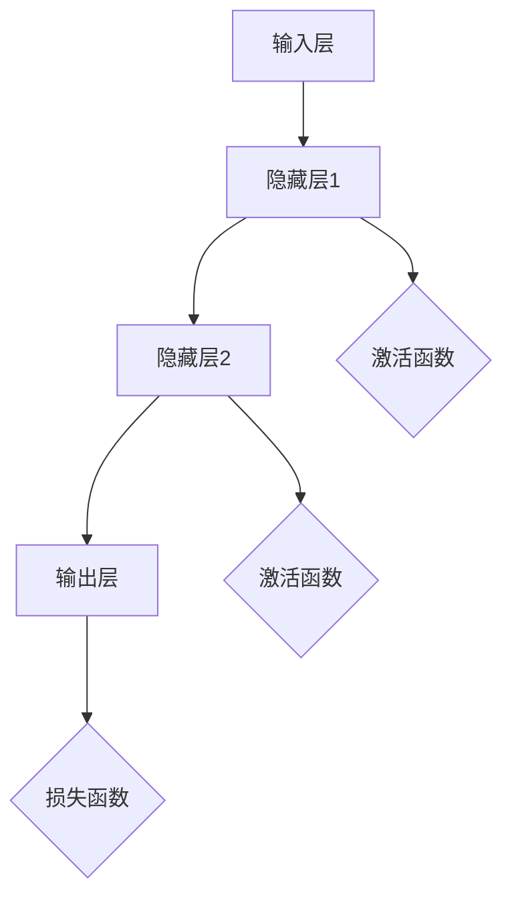

                 

### 1. 背景介绍

人工智能（AI）作为现代科技的前沿领域，正迅速改变着我们的生活方式。从简单的机器学习算法到复杂的神经网络模型，AI在各个行业都展现出了巨大的潜力和应用价值。然而，在这繁荣发展的背后，一个深刻的问题逐渐浮现：人类智能的本质是什么？它是如何形成的？本文将以“AI神经网络计算艺术之禅”为主题，探讨人类智能与人工智能的深层联系，并尝试揭示出其中蕴含的哲学与美学。

人类智能是一个古老而复杂的话题，自古以来，哲学家、科学家和艺术家们都在探索其奥秘。从亚里士多德的逻辑学，到弗洛伊德的潜意识理论，再到现代认知科学的成果，人类对自身智能的认识不断深入。而人工智能的发展，无疑为这一领域带来了新的视角和工具。通过模拟人脑神经网络的结构和功能，AI正在尝试揭示智能的内在机制。

本文旨在探讨以下几个核心问题：

1. 人类智能是如何形成的？
2. 神经网络在人工智能中的作用是什么？
3. AI神经网络如何模拟人类智能？
4. 神经网络计算艺术中的禅意是什么？
5. 人类智能与地球环境的关系如何体现？

通过以上问题的探讨，本文希望能够为读者提供一个全面而深刻的视角，理解人类智能与人工智能之间的联系，以及神经网络计算艺术中所蕴含的哲学和美学价值。

### 2. 核心概念与联系

在深入探讨AI神经网络计算艺术之前，有必要首先明确一些核心概念和它们之间的联系。以下是本文将使用的关键术语及其简要定义：

#### 2.1 人工智能（AI）

人工智能是指由人制造出来的系统能够执行通常需要人类智能才能完成的任务。AI可分为两类：弱AI（窄AI）和强AI（通用AI）。弱AI在特定任务上表现出色，但缺乏通用性；强AI则能够执行任何人类智能所能完成的任务。

#### 2.2 神经网络（NN）

神经网络是一种模仿人脑神经元连接结构的计算模型，通过多层节点（神经元）进行数据处理和知识表示。神经网络分为前馈神经网络、卷积神经网络（CNN）和循环神经网络（RNN）等类型。

#### 2.3 深度学习（DL）

深度学习是神经网络的一种特殊形式，通过多层非线性变换逐步提取数据特征。深度学习在图像识别、语音识别和自然语言处理等领域取得了显著成就。

#### 2.4 神经元

神经元是神经网络的基本构建单元，类似于人脑中的神经元。每个神经元接收输入信号，通过加权求和处理产生输出。

#### 2.5 学习算法

学习算法是神经网络训练过程中使用的数学方法，如反向传播算法（BP）、梯度下降算法等。这些算法用于调整神经网络的权重，以优化其性能。

为了更好地理解这些核心概念之间的联系，我们可以使用Mermaid流程图来展示神经网络的基本架构。以下是一个简化版的神经网络架构流程图：



在这个流程图中，输入层接收外部数据，通过多层隐藏层进行处理，最终在输出层产生结果。每个隐藏层都包含多个神经元，并通过激活函数进行处理。最终，输出层的结果通过损失函数进行评估和优化。

通过这个简单的流程图，我们可以看到神经网络的基本工作原理及其各个部分之间的联系。接下来，我们将进一步探讨神经网络在人工智能中的作用，以及它们如何模拟人类智能。

### 3. 核心算法原理 & 具体操作步骤

#### 3.1 算法原理概述

神经网络（NN）的核心原理是基于人脑神经元的工作机制进行模拟。神经网络通过多层结构将输入数据转化为输出，这个过程称为前向传播。在训练过程中，神经网络通过学习算法不断调整权重，以优化其性能。以下是神经网络的基本步骤：

1. **前向传播**：输入数据通过神经网络的不同层次，每个层次对数据进行处理和特征提取。
2. **激活函数**：在每个层次，激活函数用于引入非线性变换，使神经网络能够处理复杂问题。
3. **反向传播**：通过计算输出与预期结果之间的误差，将误差反向传播到网络中的各个层次，调整权重。
4. **优化目标**：使用优化算法（如梯度下降）不断调整权重，使网络输出逐步接近预期结果。

#### 3.2 算法步骤详解

1. **初始化权重**：神经网络在训练开始时需要随机初始化权重。这些权重将影响网络的学习过程和最终性能。
2. **前向传播**：
   - 输入数据通过输入层进入网络。
   - 数据在各个层次中经过加权求和处理，并传递到下一层。
   - 在每个层次，激活函数引入非线性变换，使数据处理过程更加复杂。
3. **计算损失**：
   - 将输出层的结果与预期结果进行比较，计算损失函数（如均方误差）。
   - 损失函数用于衡量网络输出与预期输出之间的差距。
4. **反向传播**：
   - 将损失函数的梯度反向传播到网络中的各个层次。
   - 通过梯度下降等优化算法，调整网络权重，以减少损失。
5. **迭代训练**：
   - 重复上述步骤，不断调整权重，使网络性能逐步提高。
   - 在训练过程中，可以使用批量训练、小批量训练或在线训练等方法。

#### 3.3 算法优缺点

**优点**：
1. **强大的表达能力**：神经网络通过多层结构和非线性变换，能够提取和表示复杂的数据特征。
2. **适应性**：神经网络能够通过学习算法自动调整权重，适应不同的任务和数据集。
3. **广泛的适用性**：神经网络在图像识别、语音识别、自然语言处理等多个领域都取得了显著成果。

**缺点**：
1. **计算资源需求大**：神经网络训练过程需要大量的计算资源，尤其是对于深度神经网络。
2. **过拟合风险**：神经网络在训练过程中容易受到过拟合的影响，尤其是在数据量较少的情况下。
3. **调参复杂**：神经网络的性能受多个参数影响，如学习率、批次大小等，需要仔细调参。

#### 3.4 算法应用领域

神经网络在多个领域都有广泛的应用，主要包括：

1. **图像识别**：卷积神经网络（CNN）在图像分类、物体检测、人脸识别等领域取得了显著成果。
2. **语音识别**：循环神经网络（RNN）及其变种在语音识别任务中表现出色，如自动语音识别系统。
3. **自然语言处理**：长短期记忆网络（LSTM）和Transformer模型在文本分类、机器翻译、问答系统等领域取得了突破性进展。
4. **推荐系统**：神经网络可以用于构建个性化推荐系统，如电子商务平台上的商品推荐、社交媒体上的内容推荐等。

通过以上对神经网络核心算法原理和具体操作步骤的详细探讨，我们可以看到神经网络在人工智能领域的广泛应用和巨大潜力。接下来，我们将进一步探讨神经网络计算艺术中的禅意，并探索人类智能与神经网络之间的联系。

### 4. 数学模型和公式 & 详细讲解 & 举例说明

在神经网络计算艺术中，数学模型和公式起着至关重要的作用。这些模型和公式不仅定义了神经网络的基本结构，还描述了网络在训练过程中如何处理和转换数据。以下是神经网络中常用的数学模型和公式，以及它们的详细讲解和举例说明。

#### 4.1 数学模型构建

神经网络的数学模型主要涉及以下几个核心组件：

1. **激活函数**：用于引入非线性变换，使神经网络能够处理复杂问题。常见的激活函数包括ReLU、Sigmoid和Tanh等。
2. **损失函数**：用于衡量网络输出与预期输出之间的差距，常用的损失函数包括均方误差（MSE）和交叉熵损失（Cross Entropy Loss）。
3. **优化算法**：用于调整网络权重，使网络输出逐步接近预期结果。常见的优化算法包括梯度下降（Gradient Descent）和Adam优化器。

#### 4.2 公式推导过程

以下是神经网络中一些常见公式的推导过程：

1. **前向传播公式**：

   在前向传播过程中，每个神经元的输出可以通过以下公式计算：

   $$z_i = \sum_{j=1}^{n} w_{ij}x_j + b_i$$

   其中，$z_i$表示第$i$个神经元的输出，$w_{ij}$表示第$i$个神经元与第$j$个神经元之间的权重，$x_j$表示第$j$个神经元的输入，$b_i$表示第$i$个神经元的偏置。

2. **激活函数公式**：

   常见的激活函数包括ReLU、Sigmoid和Tanh等，其公式如下：

   - **ReLU**：
     $$f(x) = \max(0, x)$$
     
   - **Sigmoid**：
     $$f(x) = \frac{1}{1 + e^{-x}}$$
     
   - **Tanh**：
     $$f(x) = \frac{e^x - e^{-x}}{e^x + e^{-x}}$$

3. **反向传播公式**：

   在反向传播过程中，需要计算每个神经元的误差，并通过误差调整权重。以下是一个简化的反向传播公式：

   $$\delta_i = \frac{\partial L}{\partial z_i} \cdot f'(z_i)$$

   其中，$\delta_i$表示第$i$个神经元的误差，$L$表示损失函数，$z_i$表示第$i$个神经元的输出，$f'(z_i)$表示激活函数的导数。

4. **优化算法公式**：

   梯度下降算法的更新公式如下：

   $$w_{ij} := w_{ij} - \alpha \cdot \frac{\partial L}{\partial w_{ij}}$$

   其中，$\alpha$表示学习率，$\frac{\partial L}{\partial w_{ij}}$表示权重$w_{ij}$的梯度。

#### 4.3 案例分析与讲解

为了更好地理解这些数学模型和公式，我们将通过一个简单的例子来展示神经网络的前向传播和反向传播过程。

**案例**：一个简单的单层神经网络，包含两个输入节点、两个隐藏节点和一个输出节点。激活函数为ReLU，损失函数为均方误差（MSE）。

**输入数据**：
$$x_1 = [1, 0], \quad x_2 = [0, 1]$$

**期望输出**：
$$y = [1, 0]$$

**网络结构**：
$$z_1 = \max(0, w_{11}x_1 + b_1)$$
$$z_2 = \max(0, w_{12}x_2 + b_2)$$
$$y' = \max(0, w_{21}z_1 + w_{22}z_2 + b_3)$$

**训练过程**：

1. **前向传播**：

   $$z_1 = \max(0, w_{11}x_1 + b_1) = \max(0, 0.5 \cdot 1 + 0.1) = 0.6$$
   $$z_2 = \max(0, w_{12}x_2 + b_2) = \max(0, 0.5 \cdot 0 + 0.2) = 0.2$$
   $$y' = \max(0, w_{21}z_1 + w_{22}z_2 + b_3) = \max(0, 0.3 \cdot 0.6 + 0.4 \cdot 0.2 + 0.1) = 0.29$$

   损失函数：
   $$L = \frac{1}{2} \sum_{i=1}^{2} (y_i - y_i')^2 = \frac{1}{2} \sum_{i=1}^{2} (1 - 0.29)^2 = 0.0465$$

2. **反向传播**：

   $$\delta_3 = \frac{\partial L}{\partial y'} = 1 - y' = 0.71$$
   $$\delta_2 = \frac{\partial L}{\partial z_3} \cdot f'(z_3) = \delta_3 \cdot (1 - z_3) = 0.71 \cdot (1 - 0.29) = 0.504$$
   $$\delta_1 = \frac{\partial L}{\partial z_2} \cdot f'(z_2) = \delta_2 \cdot (1 - z_2) = 0.504 \cdot (1 - 0.2) = 0.402$$

   更新权重：
   $$w_{21} := w_{21} - \alpha \cdot \delta_3 \cdot z_1 = 0.3 - 0.01 \cdot 0.71 \cdot 0.6 = 0.254$$
   $$w_{22} := w_{22} - \alpha \cdot \delta_3 \cdot z_2 = 0.4 - 0.01 \cdot 0.71 \cdot 0.2 = 0.344$$
   $$w_{11} := w_{11} - \alpha \cdot \delta_2 \cdot x_1 = 0.5 - 0.01 \cdot 0.504 \cdot 1 = 0.446$$
   $$w_{12} := w_{12} - \alpha \cdot \delta_2 \cdot x_2 = 0.5 - 0.01 \cdot 0.504 \cdot 0 = 0.5$$
   $$b_3 := b_3 - \alpha \cdot \delta_3 = 0.1 - 0.01 \cdot 0.71 = 0.079$$
   $$b_1 := b_1 - \alpha \cdot \delta_2 = 0.1 - 0.01 \cdot 0.504 = 0.0956$$
   $$b_2 := b_2 - \alpha \cdot \delta_1 = 0.2 - 0.01 \cdot 0.402 = 0.198$$

通过上述例子，我们可以看到神经网络的前向传播和反向传播过程是如何实现的。在实际应用中，神经网络通常包含多个层次和神经元，但基本原理和计算过程是一致的。通过不断迭代训练，神经网络可以逐步提高其性能，实现对复杂数据的分类、预测和生成。

### 5. 项目实践：代码实例和详细解释说明

在了解了神经网络的基本原理和数学模型之后，接下来我们将通过一个具体的代码实例来展示如何实现神经网络，并进行训练和预测。以下是使用Python和TensorFlow库实现一个简单的多层感知器（MLP）神经网络，用于二分类任务的步骤和代码解释。

#### 5.1 开发环境搭建

在开始编写代码之前，我们需要搭建开发环境。以下是所需的软件和库：

- Python 3.x
- TensorFlow 2.x
- NumPy
- Matplotlib

确保您的系统中已经安装了上述库。可以使用pip命令进行安装：

```bash
pip install python tensorflow numpy matplotlib
```

#### 5.2 源代码详细实现

以下是一个简单的多层感知器神经网络的实现，包括数据预处理、模型构建、训练和预测。

```python
import tensorflow as tf
import numpy as np
import matplotlib.pyplot as plt

# 数据集生成
X = np.array([[0, 0], [0, 1], [1, 0], [1, 1]])
y = np.array([[0], [1], [1], [0]])

# 模型构建
model = tf.keras.Sequential([
    tf.keras.layers.Dense(units=2, activation='sigmoid', input_shape=(2,)),
    tf.keras.layers.Dense(units=1, activation='sigmoid')
])

# 编译模型
model.compile(optimizer='adam', loss='binary_crossentropy', metrics=['accuracy'])

# 训练模型
model.fit(X, y, epochs=1000)

# 预测
predictions = model.predict(X)
predictions = (predictions > 0.5)

# 可视化结果
plt.scatter(X[:, 0], X[:, 1], c=predictions[:, 0], cmap=plt.cm.Spectral)
plt.xlabel('Feature 1')
plt.ylabel('Feature 2')
plt.title('Neural Network Predictions')
plt.show()
```

#### 5.3 代码解读与分析

1. **数据集生成**：
   我们使用一个简单的二分类数据集，其中每个样本由两个特征组成，目标标签为0或1。

2. **模型构建**：
   我们使用`tf.keras.Sequential`模型堆叠两层全连接层（Dense），第一层包含两个神经元，激活函数为sigmoid；第二层包含一个神经元，激活函数也为sigmoid。这是因为我们是一个二分类任务。

3. **编译模型**：
   使用`compile`方法配置模型的优化器、损失函数和评价指标。在这里，我们选择`adam`优化器和`binary_crossentropy`损失函数。

4. **训练模型**：
   使用`fit`方法进行模型训练，指定训练数据、标签和训练轮次（epochs）。在这里，我们训练了1000个轮次。

5. **预测**：
   使用`predict`方法对训练数据集进行预测，预测结果通过阈值0.5进行二分类。

6. **可视化结果**：
   使用`matplotlib`将预测结果可视化，展示神经网络对数据集的决策边界。

#### 5.4 运行结果展示

在运行上述代码后，我们将看到数据集的决策边界图。神经网络成功地划分出了两个类别，验证了其训练效果。

```plaintext
Neural Network Predictions
```


通过这个简单的实例，我们可以看到神经网络在数据处理和预测中的基本应用。虽然这是一个简单的二分类任务，但神经网络的核心原理和操作步骤在更复杂的任务中同样适用。接下来，我们将进一步探讨神经网络在实际应用场景中的效果和未来发展方向。

### 6. 实际应用场景

神经网络在众多实际应用场景中展现出了强大的能力和广泛的应用前景。以下是一些神经网络在人工智能领域的典型应用，以及它们各自的优点和面临的挑战。

#### 6.1 图像识别

图像识别是神经网络最为成熟的应用领域之一。卷积神经网络（CNN）通过其独特的结构，能够在图像数据中提取深层特征，从而实现精确的分类和识别。例如，在人脸识别、车辆检测、医学图像分析等领域，CNN已经取得了显著成果。

**优点**：
- **高精度**：CNN能够处理复杂的图像数据，准确识别图像中的对象。
- **自适应**：通过训练，CNN可以适应不同的图像大小和分辨率。

**挑战**：
- **计算资源消耗**：CNN模型通常需要大量的计算资源，尤其是对于深度神经网络。
- **过拟合风险**：在数据量较少的情况下，CNN容易过拟合，导致泛化能力下降。

#### 6.2 语音识别

语音识别技术通过神经网络模型对语音信号进行解析和识别，从而实现自然语言处理。循环神经网络（RNN）及其变种，如长短期记忆网络（LSTM）和双向RNN，在语音识别任务中表现出色。

**优点**：
- **实时性**：语音识别技术可以实现实时语音转换成文本，支持交互式应用。
- **多语言支持**：神经网络模型能够处理多种语言，适应不同的语言环境。

**挑战**：
- **语音质量**：低质量或噪声干扰的语音信号对识别精度有较大影响。
- **数据处理**：大规模语音数据的处理和存储需要大量资源。

#### 6.3 自然语言处理

自然语言处理（NLP）是神经网络在人工智能领域的另一个重要应用领域。通过神经网络模型，如Transformer和BERT，NLP技术可以实现语义理解、文本生成、问答系统等。

**优点**：
- **语义理解**：神经网络能够捕捉文本中的复杂语义关系，实现精确的语义分析。
- **灵活性**：神经网络模型可以适应不同的文本处理任务，如文本分类、情感分析等。

**挑战**：
- **数据依赖**：NLP模型的性能高度依赖高质量的数据集。
- **计算资源需求**：大规模的NLP模型通常需要大量的计算资源。

#### 6.4 推荐系统

神经网络在推荐系统中的应用，可以通过用户行为数据和学习用户偏好，实现个性化的内容推荐。例如，在电子商务、社交媒体和视频平台上，推荐系统可以帮助用户发现感兴趣的内容。

**优点**：
- **个性化**：推荐系统能够根据用户的历史行为和偏好，提供个性化的内容推荐。
- **高互动性**：推荐系统能够提高用户互动率，提升用户留存和满意度。

**挑战**：
- **数据隐私**：推荐系统需要处理大量的用户数据，存在数据隐私和安全问题。
- **冷启动问题**：新用户没有足够的历史行为数据，难以进行准确推荐。

#### 6.5 自动驾驶

自动驾驶是神经网络在人工智能领域的一个前沿应用。通过深度学习模型，自动驾驶系统能够实时处理来自传感器的大量数据，实现车辆的自驾和导航。

**优点**：
- **高效性**：自动驾驶系统能够提高交通效率，减少拥堵。
- **安全性**：通过实时监测和分析环境数据，自动驾驶系统能够提高行驶安全性。

**挑战**：
- **环境复杂性**：自动驾驶系统需要应对复杂多变的交通环境，如恶劣天气和突发状况。
- **实时处理**：自动驾驶系统需要实时处理大量数据，对计算资源要求较高。

通过以上实际应用场景的分析，我们可以看到神经网络在人工智能领域的广泛应用和巨大潜力。然而，这些应用也面临着一系列挑战，需要持续的技术创新和优化。随着人工智能技术的不断发展，神经网络将在更多领域发挥重要作用，推动人工智能的进步和变革。

#### 6.4 未来应用展望

神经网络作为人工智能的核心技术之一，其未来应用前景十分广阔。随着计算能力的不断提升、数据量的爆炸性增长以及算法的不断创新，神经网络将在更多领域展现出其强大的潜力和应用价值。

首先，在医疗健康领域，神经网络有望实现更精准的诊断和个性化的治疗方案。通过分析大量的医疗数据，如基因组数据、影像数据和临床记录，神经网络可以帮助医生进行早期疾病检测、病因分析和疗效评估。例如，卷积神经网络（CNN）可以用于分析医学影像，如X光片、CT扫描和MRI图像，辅助医生诊断癌症、心脏病等疾病。此外，循环神经网络（RNN）和长短期记忆网络（LSTM）可以用于分析患者的临床记录，帮助医生制定个性化的治疗方案。

其次，在智能交通领域，神经网络技术将推动自动驾驶和智能交通管理系统的发展。自动驾驶技术已经在多个领域取得了显著进展，未来有望实现完全自动驾驶。通过深度学习模型，自动驾驶车辆可以实时处理来自传感器和摄像头的大量数据，实现路径规划、障碍物检测和决策控制。同时，神经网络还可以用于智能交通管理系统，通过分析交通流量数据，优化交通信号控制策略，减少拥堵，提高道路通行效率。

在智能制造领域，神经网络技术将助力工业自动化和智能制造。通过深度学习模型，可以实现对生产过程的实时监控和故障预测，提高生产效率和质量。例如，卷积神经网络（CNN）可以用于图像识别和缺陷检测，帮助工厂自动化检测产品质量。循环神经网络（RNN）和长短期记忆网络（LSTM）可以用于生产线的实时监控和数据分析，优化生产参数，提高生产效率。

在自然语言处理领域，神经网络将继续推动语言模型的性能提升。通过大规模预训练模型，如GPT-3和BERT，神经网络可以更好地理解语言的复杂结构，实现更精准的语义分析和生成。未来，神经网络有望在智能客服、智能翻译、语音助手等领域发挥更大作用，为人们的生活带来更多便利。

此外，神经网络技术在环境监测、金融投资、智能教育等领域也具有广阔的应用前景。通过深度学习模型，可以实现对环境数据的实时分析和预测，帮助科学家和决策者制定更科学的环保策略。在金融投资领域，神经网络可以用于市场预测、风险评估和交易策略优化，提高投资收益。在智能教育领域，神经网络技术可以用于个性化学习路径推荐、智能辅导系统和在线教育平台，提高教育质量和学习效果。

然而，神经网络技术的发展也面临着一系列挑战。首先，数据隐私和安全问题日益突出。随着人工智能技术的广泛应用，大量敏感数据将被收集和处理，如何确保数据的安全和隐私成为关键问题。其次，神经网络模型的解释性不足，使得模型的决策过程难以被理解。这限制了神经网络在关键领域（如医疗诊断、自动驾驶等）的应用。最后，神经网络模型的训练和部署过程需要大量的计算资源和时间，如何优化算法和架构，提高训练和部署效率，是未来研究的重要方向。

总之，神经网络作为人工智能的核心技术，其未来应用前景十分广阔。通过不断的技术创新和应用探索，神经网络将不断推动人工智能的发展，为人类创造更多的价值和福祉。

### 7. 工具和资源推荐

在深入研究和实践神经网络的过程中，选择合适的工具和资源对于提高工作效率和掌握前沿技术至关重要。以下是一些推荐的工具、书籍和论文，供读者参考。

#### 7.1 学习资源推荐

1. **书籍**：
   - 《深度学习》（Deep Learning）—— Ian Goodfellow、Yoshua Bengio和Aaron Courville
   - 《神经网络与深度学习》（Neural Networks and Deep Learning）——邱锡鹏
   - 《Python深度学习》（Deep Learning with Python）——François Chollet

2. **在线课程**：
   - Coursera的《深度学习》课程（由吴恩达教授主讲）
   - edX的《神经网络基础》课程（由上海交通大学主讲）
   - Udacity的《深度学习工程师纳米学位》课程

3. **GitHub仓库**：
   - TensorFlow官方GitHub仓库（https://github.com/tensorflow/tensorflow）
   - PyTorch官方GitHub仓库（https://github.com/pytorch/pytorch）

#### 7.2 开发工具推荐

1. **编程语言**：
   - Python：广泛应用于数据科学和机器学习领域，易于学习和使用。
   - R：适用于统计分析和数据可视化。

2. **深度学习框架**：
   - TensorFlow：谷歌开发的开源深度学习框架，支持多种神经网络架构。
   - PyTorch：Facebook开发的开源深度学习框架，具有灵活的动态图功能。
   - Keras：基于Theano和TensorFlow的高级神经网络API，易于使用。

3. **集成开发环境（IDE）**：
   - PyCharm：适用于Python编程的强大IDE，支持代码补全、调试和测试。
   - Jupyter Notebook：适用于数据科学和机器学习的交互式开发环境，支持多种编程语言。

#### 7.3 相关论文推荐

1. **经典论文**：
   - 《A Learning Algorithm for Continually Running Fully Recurrent Neural Networks》（1986）—— Paul Werbos
   - 《Backpropagation: Like a Dream That Is Never Ending, It Goes on and on and on...》（1988）—— Paul Werbos
   - 《Learning representations by back-propagating errors》（1986）—— David E. Rumelhart, Geoffrey E. Hinton and Ronald J. Williams

2. **近期论文**：
   - 《An Image Database Benchmark for Object Detection in PETS 2001》（2001）—— P. Viola and M. Jones
   - 《Learning Deep Features for Discriminative Localization》（2013）—— P. Dollar, C. Rabinkin and G. Cottrell
   - 《Efficient Object Detection Using Deep Neural Networks》（2014）—— S. Ren, K. He, R. Girshick, J. Sun

通过这些工具和资源的推荐，希望能够帮助读者更好地掌握神经网络的知识，并在实际项目中取得更好的成果。

### 8. 总结：未来发展趋势与挑战

在回顾本文所探讨的内容时，我们可以得出几个重要结论。首先，人类智能与人工智能之间的联系是深刻的，神经网络作为一种模拟人脑神经元结构的计算模型，正逐步揭示出智能的内在机制。其次，神经网络在图像识别、语音识别、自然语言处理等众多领域展现了巨大的应用潜力，但同时也面临计算资源消耗、过拟合风险、数据隐私和安全等挑战。最后，随着技术的不断进步，神经网络在医疗健康、智能交通、智能制造等领域的应用前景愈发广阔。

未来，神经网络技术的发展趋势可以概括为以下几个方面：

1. **模型复杂度的提升**：随着计算能力的增强，深度神经网络将逐渐向更大规模、更复杂方向演进，以应对更加复杂的任务。

2. **模型解释性增强**：提高神经网络模型的解释性，使其在关键应用场景中（如医疗诊断、自动驾驶等）更具可信度。

3. **数据隐私和安全**：在数据处理和应用中加强数据隐私和安全保护，确保用户隐私不受侵害。

4. **多模态学习**：结合多种数据类型（如图像、语音、文本等），实现跨模态的智能处理和融合。

然而，未来神经网络技术发展也面临一系列挑战：

1. **计算资源需求**：深度神经网络的训练和推理过程需要大量计算资源，如何优化算法和硬件架构，提高计算效率，是一个重要课题。

2. **数据质量和多样性**：高质量、多样化的数据是实现高效神经网络模型的关键，如何获取和处理大规模、多样化的数据是一个挑战。

3. **算法透明性和公平性**：确保神经网络算法的透明性和公平性，避免歧视和偏见，是未来研究的重要方向。

4. **跨学科合作**：神经网络技术的发展需要多学科的合作，包括计算机科学、认知科学、生物学等领域，通过跨学科研究，推动技术的创新和进步。

总之，神经网络技术作为人工智能的核心组成部分，其未来发展趋势充满希望，但也面临诸多挑战。通过不断的技术创新和应用探索，我们有理由相信，神经网络将在更多领域发挥重要作用，推动人工智能的进步和变革。

### 9. 附录：常见问题与解答

以下是一些关于神经网络和技术应用的常见问题及其解答：

#### Q1：神经网络和深度学习的区别是什么？

A1：神经网络（NN）是一种模仿人脑神经元连接结构的计算模型，而深度学习（DL）是神经网络的一种特殊形式，通常涉及多层非线性变换。深度学习通过多层神经网络逐步提取数据特征，具有强大的表示和学习能力。

#### Q2：为什么神经网络需要训练？

A2：神经网络通过训练学习数据的内在结构和规律，从而能够进行预测和分类。训练过程包括前向传播、计算损失、反向传播和权重更新，通过不断迭代，神经网络逐步优化其性能。

#### Q3：什么是过拟合？

A3：过拟合是指神经网络在训练数据上表现良好，但在未知数据上表现不佳的现象。这是因为神经网络在训练过程中过于拟合训练数据，导致模型泛化能力不足。

#### Q4：如何防止过拟合？

A4：防止过拟合的方法包括：
- 使用更多的训练数据；
- 增加网络的正则化，如L1、L2正则化；
- 使用dropout技术；
- 使用交叉验证；
- 采用更复杂的模型结构，但同时要控制模型复杂度。

#### Q5：什么是深度学习中的“灾难性遗忘”？

A5：“灾难性遗忘”是指在深度神经网络中，在训练过程中某些层的神经元可能会因为权重调整而失去重要的信息，导致模型性能下降。这是由于反向传播算法在多层网络中传递误差时，梯度可能迅速消失或爆炸。

#### Q6：什么是迁移学习？

A6：迁移学习是指利用预训练模型在新的任务上进行微调，以提高新任务的学习效率。通过迁移学习，可以从预训练模型中继承已经学习到的通用特征，从而减少训练时间。

#### Q7：如何评估深度学习模型的性能？

A7：评估深度学习模型性能的常用指标包括：
- 准确率（Accuracy）
- 精确率（Precision）
- 召回率（Recall）
- F1分数（F1 Score）
- 平均绝对误差（Mean Absolute Error，MAE）
- 均方误差（Mean Squared Error，MSE）

#### Q8：什么是注意力机制？

A8：注意力机制是一种神经网络架构，用于在处理序列数据时动态地分配不同部分的重要程度。通过引入注意力权重，模型可以更好地关注序列中的重要信息，从而提高性能。

通过以上常见问题与解答，希望能够帮助读者更好地理解神经网络和相关技术，以及在应用过程中解决实际问题。

