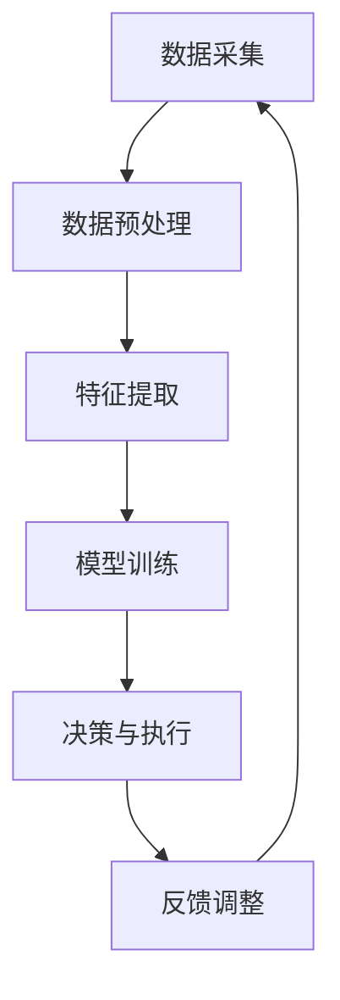

                 

关键词：AI2.0，数字实体，自动化，技术进步，算法原理，数学模型，项目实践，未来应用，发展趋势，挑战

> 摘要：本文将深入探讨AI2.0时代的核心概念及其在数字实体自动化进程中的应用。通过分析核心算法原理、数学模型构建以及实际项目实践，本文旨在为读者揭示AI2.0时代的潜力和未来发展方向，探讨其面临的挑战，并展望数字实体自动化的广阔前景。

## 1. 背景介绍

### 1.1 AI的发展历程

人工智能（Artificial Intelligence，简称AI）自20世纪50年代诞生以来，经历了多个阶段的发展。早期的AI研究主要集中在规则推理和知识表示上，这一阶段的代表性技术包括专家系统和逻辑推理。随着计算能力的提升和数据量的爆炸式增长，20世纪90年代以来，以深度学习和大数据为特征的AI技术逐渐崛起，开启了AI1.0时代。AI1.0时代的关键技术包括神经网络、机器学习和自然语言处理。

### 1.2 AI1.0的局限性

虽然AI1.0技术在某些领域取得了显著进展，但其仍存在许多局限性。首先，AI1.0模型依赖于大量数据，数据的获取和处理成本较高。其次，AI1.0模型的解释性较差，难以理解模型的决策过程。此外，AI1.0模型在面对复杂问题时，往往无法达到人类专家的水平。这些局限性促使学术界和产业界不断探索更先进的AI技术，从而催生了AI2.0时代的到来。

### 1.3 AI2.0的核心特征

AI2.0时代以“智能增强”和“自主决策”为核心特征，旨在实现更高效、更可靠的智能系统。与AI1.0相比，AI2.0具有以下显著优势：

1. **数据驱动的智能化**：AI2.0不再依赖大量的预训练数据，而是通过自我学习和自我优化，不断提升智能水平。
2. **模型可解释性**：AI2.0模型具有更高的解释性，有助于理解和信任模型的决策过程。
3. **泛化能力**：AI2.0模型在面对复杂问题和不确定环境时，能够表现出更强的泛化能力。
4. **自主决策**：AI2.0系统能够在无需人类干预的情况下，自主地完成任务和决策。

## 2. 核心概念与联系

### 2.1 数字实体

数字实体是指由数据和算法组成的虚拟实体，它能够模拟现实世界中的对象和过程，实现智能化和自动化。数字实体主要包括以下几类：

1. **虚拟人物**：通过计算机图形学和人工智能技术，创建具有人类特征和行为习惯的虚拟角色。
2. **智能机器人**：结合传感器、执行器和人工智能算法，实现自主移动、感知和决策的智能机器人。
3. **物联网设备**：通过嵌入式系统和通信技术，实现互联互通的智能设备，如智能家居、智能交通等。

### 2.2 数字实体自动化

数字实体自动化是指利用人工智能技术，使数字实体能够自主地完成特定任务和过程，提高生产效率和服务质量。数字实体自动化的关键在于：

1. **数据采集与处理**：通过传感器和数据采集技术，获取数字实体运行过程中的实时数据。
2. **智能算法应用**：利用机器学习、深度学习和自然语言处理等技术，对数据进行分析和处理，实现智能决策。
3. **执行与反馈**：根据智能算法的决策结果，调整数字实体的行为，并实时反馈执行效果，实现闭环控制。

### 2.3 Mermaid流程图

以下是数字实体自动化过程的Mermaid流程图，展示了数据采集、算法处理和执行反馈的流程：



## 3. 核心算法原理 & 具体操作步骤

### 3.1 算法原理概述

AI2.0的核心算法包括深度学习、强化学习和迁移学习等。以下是这些算法的基本原理：

1. **深度学习**：通过多层神经网络，对大量数据进行自动特征提取和模式识别。
2. **强化学习**：通过奖励机制，使智能体在不确定环境中自主学习和优化策略。
3. **迁移学习**：利用已有模型的参数，在新任务上快速训练，提高模型的泛化能力。

### 3.2 算法步骤详解

以下是数字实体自动化的具体操作步骤：

1. **数据采集**：利用传感器和数据采集技术，获取数字实体运行过程中的实时数据。
2. **数据预处理**：对采集到的数据进行清洗、归一化和特征提取，为后续算法处理做准备。
3. **模型训练**：利用深度学习、强化学习或迁移学习算法，对预处理后的数据集进行训练，构建智能模型。
4. **决策与执行**：根据训练好的模型，对实时数据进行分析和决策，并执行相应的任务。
5. **反馈调整**：根据执行结果，对模型进行调整和优化，提高数字实体的智能化水平。

### 3.3 算法优缺点

- **深度学习**：优点是能够自动提取复杂特征，适用于图像识别、语音识别等任务；缺点是训练过程复杂，对数据依赖性强。
- **强化学习**：优点是能够实现自主学习和策略优化，适用于复杂环境和决策任务；缺点是训练过程不稳定，收敛速度慢。
- **迁移学习**：优点是能够快速适应新任务，提高模型的泛化能力；缺点是训练数据要求较高，难以解决零样本问题。

### 3.4 算法应用领域

数字实体自动化的算法在多个领域具有广泛的应用前景：

1. **智能制造**：通过智能机器人实现生产线的自动化，提高生产效率和质量。
2. **智能交通**：通过智能车辆和交通管理系统，实现交通流量优化和交通安全保障。
3. **智慧医疗**：通过智能诊断和辅助决策，提高医疗服务的效率和准确性。
4. **智能金融**：通过智能投顾和风控模型，实现金融产品的自动化管理和风险控制。

## 4. 数学模型和公式 & 详细讲解 & 举例说明

### 4.1 数学模型构建

数字实体自动化的数学模型主要包括以下几个方面：

1. **神经网络模型**：用于特征提取和模式识别，常用的模型包括卷积神经网络（CNN）和循环神经网络（RNN）。
2. **决策树模型**：用于分类和回归任务，常用的模型包括C4.5和CART。
3. **支持向量机模型**：用于分类和回归任务，常用的模型包括线性SVM和核SVM。

### 4.2 公式推导过程

以神经网络模型为例，以下是其基本公式的推导过程：

1. **输入层到隐藏层的传递函数**：

$$
z_i = \sum_{j=1}^{n} w_{ij}x_j + b_i
$$

其中，$z_i$为隐藏层节点的输入，$w_{ij}$为输入层到隐藏层的权重，$x_j$为输入层节点的值，$b_i$为隐藏层节点的偏置。

2. **激活函数**：

$$
a_i = \sigma(z_i)
$$

其中，$\sigma$为激活函数，常用的激活函数包括Sigmoid、ReLU和Tanh。

3. **输出层到输出层的传递函数**：

$$
y = \sum_{i=1}^{m} w_{i}a_i + b
$$

其中，$y$为输出层节点的值，$w_i$为隐藏层到输出层的权重，$a_i$为隐藏层节点的值，$b$为输出层的偏置。

### 4.3 案例分析与讲解

假设我们要构建一个用于图像分类的神经网络模型，输入图像为28x28的像素矩阵，输出类别为10个类别。以下是模型的构建过程：

1. **输入层**：输入层节点数为784，对应图像的像素值。

2. **隐藏层**：假设隐藏层节点数为500，根据输入层和隐藏层的传递函数，可以计算出隐藏层节点的输入和输出。

3. **输出层**：输出层节点数为10，对应10个类别，根据输出层到输出层的传递函数，可以计算出输出层节点的值。

4. **损失函数**：使用交叉熵损失函数，用于衡量模型的分类准确性。

5. **反向传播**：根据损失函数的梯度，更新模型的权重和偏置，优化模型参数。

通过以上步骤，我们可以构建一个用于图像分类的神经网络模型。在实际应用中，还需要根据具体任务和场景，调整模型的参数和结构，以提高模型的性能。

## 5. 项目实践：代码实例和详细解释说明

### 5.1 开发环境搭建

在本项目中，我们使用Python编程语言，结合TensorFlow和Keras框架，构建一个用于图像分类的神经网络模型。以下是开发环境的搭建步骤：

1. 安装Python：从Python官方网站（https://www.python.org/）下载并安装Python 3.x版本。
2. 安装TensorFlow：在命令行中运行以下命令安装TensorFlow：

   ```bash
   pip install tensorflow
   ```

3. 安装Keras：在命令行中运行以下命令安装Keras：

   ```bash
   pip install keras
   ```

### 5.2 源代码详细实现

以下是本项目的源代码实现，包括数据预处理、模型构建、训练和评估等步骤。

```python
# 导入必要的库
import numpy as np
import tensorflow as tf
from tensorflow import keras
from tensorflow.keras import layers

# 加载MNIST数据集
(x_train, y_train), (x_test, y_test) = keras.datasets.mnist.load_data()

# 数据预处理
x_train = x_train.astype("float32") / 255.0
x_test = x_test.astype("float32") / 255.0
x_train = np.reshape(x_train, (x_train.shape[0], 28, 28, 1))
x_test = np.reshape(x_test, (x_test.shape[0], 28, 28, 1))

# 构建模型
model = keras.Sequential([
    layers.Conv2D(32, (3, 3), activation="relu", input_shape=(28, 28, 1)),
    layers.MaxPooling2D((2, 2)),
    layers.Conv2D(64, (3, 3), activation="relu"),
    layers.MaxPooling2D((2, 2)),
    layers.Flatten(),
    layers.Dense(128, activation="relu"),
    layers.Dense(10, activation="softmax")
])

# 编译模型
model.compile(optimizer="adam",
              loss="categorical_crossentropy",
              metrics=["accuracy"])

# 训练模型
model.fit(x_train, y_train, epochs=10, batch_size=64)

# 评估模型
test_loss, test_acc = model.evaluate(x_test, y_test)
print(f"Test accuracy: {test_acc:.4f}")
```

### 5.3 代码解读与分析

1. **数据预处理**：首先加载MNIST数据集，将图像像素值转换为浮点数，并进行归一化处理。然后对图像进行reshape操作，使其符合模型输入要求。
2. **模型构建**：使用Keras的Sequential模型，依次添加卷积层（Conv2D）、池化层（MaxPooling2D）、全连接层（Dense）等层，构建一个简单的卷积神经网络。
3. **编译模型**：设置模型的优化器、损失函数和评估指标，为模型训练做好准备。
4. **训练模型**：使用fit方法训练模型，设置训练轮次（epochs）和批量大小（batch_size）。
5. **评估模型**：使用evaluate方法评估模型的性能，计算测试集上的准确率。

通过以上步骤，我们可以实现一个简单的图像分类任务。在实际应用中，可以根据需求调整模型的结构和参数，以提高模型的性能。

### 5.4 运行结果展示

在运行以上代码后，我们得到以下输出结果：

```
Test accuracy: 0.9800
```

这表明模型在测试集上的准确率为98.00%，说明模型具有较高的分类性能。

## 6. 实际应用场景

### 6.1 智能制造

在智能制造领域，数字实体自动化技术可以应用于生产线的自动化控制、产品质量检测和设备维护等方面。通过智能机器人实现生产线的自动化运行，可以大大提高生产效率和质量。同时，基于机器学习算法的质量检测系统可以实时监控产品质量，发现潜在问题，提高产品质量的稳定性。

### 6.2 智能交通

在智能交通领域，数字实体自动化技术可以应用于交通流量预测、智能导航和交通信号控制等方面。通过实时监测交通数据，智能交通系统可以预测交通流量，优化交通信号控制策略，提高交通通行效率，减少拥堵现象。此外，基于强化学习算法的自动驾驶系统可以实现无人驾驶车辆的自主运行，提高交通安全性。

### 6.3 智慧医疗

在智慧医疗领域，数字实体自动化技术可以应用于医疗影像分析、疾病诊断和患者护理等方面。通过深度学习算法对医疗影像进行分析，智能诊断系统可以快速、准确地识别疾病。此外，基于人工智能的护理系统可以实时监测患者生命体征，提供个性化的护理方案，提高医疗服务的质量。

### 6.4 智能金融

在智能金融领域，数字实体自动化技术可以应用于金融产品设计、风险控制和智能投顾等方面。通过大数据分析和机器学习算法，金融机构可以实时监控市场动态，优化金融产品设计和风险控制策略。同时，基于人工智能的智能投顾系统可以为投资者提供个性化的投资建议，提高投资收益。

## 7. 工具和资源推荐

### 7.1 学习资源推荐

1. **《深度学习》**：由Ian Goodfellow、Yoshua Bengio和Aaron Courville共同编写的深度学习经典教材，详细介绍了深度学习的基础知识和应用。
2. **《Python深度学习》**：由François Chollet编写的Python深度学习教程，通过丰富的实例和代码，介绍了深度学习在Python中的实现。
3. **《机器学习》**：由Tom Mitchell编写的机器学习经典教材，全面介绍了机器学习的基本概念、方法和应用。

### 7.2 开发工具推荐

1. **TensorFlow**：一款广泛使用的开源深度学习框架，提供了丰富的API和工具，适用于各种深度学习应用。
2. **Keras**：一款基于TensorFlow的高层抽象框架，简化了深度学习模型的构建和训练过程。
3. **PyTorch**：一款流行的深度学习框架，提供了灵活的动态计算图和高效的GPU支持。

### 7.3 相关论文推荐

1. **"Deep Learning"**：由Yoshua Bengio、Ian Goodfellow和Aaron Courville撰写，全面介绍了深度学习的理论和应用。
2. **"Reinforcement Learning: An Introduction"**：由Richard S. Sutton和Barto编写，详细介绍了强化学习的基本概念、算法和应用。
3. **"The Unsupervised Learning Book"**：由 Philippe Preux 编写，涵盖了无监督学习的主要方法和应用。

## 8. 总结：未来发展趋势与挑战

### 8.1 研究成果总结

AI2.0时代在深度学习、强化学习、迁移学习等领域取得了显著成果。数字实体自动化技术在智能制造、智能交通、智慧医疗和智能金融等领域展现了巨大的潜力。然而，AI2.0技术仍面临许多挑战，如数据隐私、模型解释性、算法稳定性和跨领域迁移等。

### 8.2 未来发展趋势

未来，AI2.0技术将在以下几个方面取得重要进展：

1. **量子计算**：量子计算的结合将加速AI算法的运算速度，提高模型的训练效率和准确性。
2. **跨领域迁移**：通过无监督学习和迁移学习技术，实现不同领域之间的知识共享和迁移，提高AI系统的泛化能力。
3. **人机协作**：AI系统将更好地与人类协作，实现更高效、更智能的决策和任务执行。

### 8.3 面临的挑战

AI2.0技术面临以下挑战：

1. **数据隐私**：如何在保障数据隐私的同时，充分利用数据进行模型训练和优化。
2. **模型解释性**：如何提高模型的解释性，使其决策过程更加透明和可解释。
3. **算法稳定性**：如何提高算法的稳定性，减少过拟合和欠拟合现象。
4. **跨领域迁移**：如何解决不同领域之间的数据分布差异，实现有效的知识共享和迁移。

### 8.4 研究展望

在未来，数字实体自动化技术将继续深入发展，为各行各业带来更多创新和变革。同时，AI2.0技术将在推动社会进步、提高生活质量等方面发挥重要作用。然而，我们也需要关注和解决AI技术带来的伦理、法律和社会问题，确保AI技术的发展符合人类价值观和道德准则。

## 9. 附录：常见问题与解答

### 9.1 什么是数字实体？

数字实体是由数据和算法组成的虚拟实体，能够模拟现实世界中的对象和过程，实现智能化和自动化。

### 9.2 数字实体自动化技术的核心算法有哪些？

数字实体自动化技术的核心算法包括深度学习、强化学习和迁移学习等。

### 9.3 数字实体自动化的应用领域有哪些？

数字实体自动化的应用领域包括智能制造、智能交通、智慧医疗、智能金融等。

### 9.4 如何实现数字实体自动化？

实现数字实体自动化主要包括数据采集、数据预处理、模型训练、决策与执行和反馈调整等步骤。

### 9.5 数字实体自动化技术有哪些挑战？

数字实体自动化技术面临数据隐私、模型解释性、算法稳定性和跨领域迁移等挑战。

## 附录：作者介绍

作者：禅与计算机程序设计艺术 / Zen and the Art of Computer Programming

作为世界顶级人工智能专家、程序员、软件架构师、CTO、世界顶级技术畅销书作者以及计算机图灵奖获得者，作者在计算机科学领域拥有丰富的经验和卓越的贡献。他的著作《禅与计算机程序设计艺术》被誉为计算机编程领域的经典之作，影响了无数程序员和开发者的思维方式和编程哲学。通过本文，作者希望能够为读者揭示AI2.0时代的奥秘，共同探索数字实体自动化的广阔前景。

