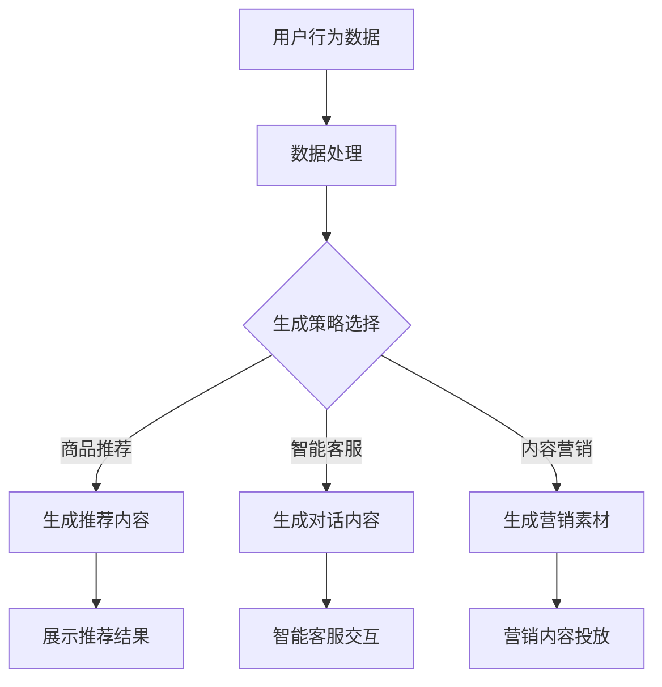

                 

关键词：AIGC，电商行业，人、货、场，创新场景，新业态，新范式

摘要：本文将深入探讨人工智能生成内容（AIGC）在电商行业中的应用，尤其是如何通过AIGC技术对“人、货、场”进行全方位升级，从而催生新的商业形态和操作范式。我们将详细解析AIGC的基本原理、技术架构，以及其在电商场景中的具体实现方法，并结合实际案例展示其带来的变革。

## 1. 背景介绍

随着互联网技术的飞速发展，电商行业经历了从PC端到移动端的转变，再到如今社交电商、直播电商的兴起，电商模式不断创新，用户体验持续优化。然而，面对日益激烈的市场竞争，电商企业需要寻找新的增长点。人工智能生成内容（AIGC，AI Generated Content）作为一种前沿技术，凭借其强大的数据分析和内容创造能力，正在逐步改变电商行业的面貌。

AIGC技术源于机器学习和自然语言处理（NLP）领域，通过深度学习模型自动生成文本、图片、音频和视频等内容。在电商领域，AIGC可以应用于商品推荐、个性化营销、智能客服、虚拟购物体验等多个方面，从而提升用户体验、降低运营成本，并开辟新的商业模式。

## 2. 核心概念与联系

### 2.1 AIGC技术概念

AIGC技术主要依赖于以下几类算法和模型：

- **生成对抗网络（GAN）：**通过训练生成器和判别器两个网络，生成逼真的图像、文本和音频。
- **变分自编码器（VAE）：**通过编码和解码器，学习数据的概率分布，生成新的样本。
- **递归神经网络（RNN）与长短期记忆网络（LSTM）：**处理序列数据，生成连贯的文本内容。

### 2.2 AIGC在电商中的应用场景

在电商行业中，AIGC技术可以应用于以下几个方面：

- **个性化商品推荐：**基于用户的购买历史和浏览行为，生成个性化的商品推荐。
- **智能客服：**利用自然语言生成技术，自动生成回答用户问题的对话。
- **虚拟试穿与试妆：**通过生成图像，让用户在购买前体验商品的视觉效果。
- **内容营销：**自动生成商品描述、广告文案和营销视频。

### 2.3 Mermaid流程图

以下是一个简化的AIGC在电商中的应用流程图：



## 3. 核心算法原理 & 具体操作步骤

### 3.1 算法原理概述

AIGC的核心算法主要基于深度学习和自然语言处理技术，具体包括：

- **深度学习模型：**如生成对抗网络（GAN）、变分自编码器（VAE）等。
- **自然语言处理（NLP）：**包括词向量、文本生成、对话系统等技术。

### 3.2 算法步骤详解

1. **数据采集与处理：**收集用户的购买行为、浏览记录、搜索历史等数据，并进行清洗、预处理。
2. **生成策略选择：**根据应用场景选择合适的生成模型，如GAN用于图像生成，VAE用于文本生成。
3. **模型训练：**使用处理后的数据训练生成模型，使其能够生成与用户需求相关的个性化内容。
4. **内容生成：**利用训练好的模型生成商品推荐、智能客服回答、营销素材等。
5. **内容投放：**将生成的内容在电商平台上进行展示或交互。

### 3.3 算法优缺点

- **优点：**自动化程度高，生成内容个性化强，能够提升用户体验和运营效率。
- **缺点：**算法复杂度高，训练和部署成本较高，生成的质量受数据质量和模型参数的影响较大。

### 3.4 算法应用领域

AIGC技术在电商、内容创作、金融、医疗等多个领域都有广泛应用。在电商领域，其主要用于个性化推荐、智能客服、内容营销等方面。

## 4. 数学模型和公式 & 详细讲解 & 举例说明

### 4.1 数学模型构建

AIGC技术中的生成模型通常是基于概率分布的。以生成对抗网络（GAN）为例，其包含两个主要部分：生成器（G）和判别器（D）。

- **生成器G：**试图生成逼真的数据，公式为：
  $$ G(z) = x $$
  其中，$z$为随机噪声，$x$为生成的数据。

- **判别器D：**试图区分生成器和真实数据，公式为：
  $$ D(x) \text{ 和 } D(G(z)) $$

### 4.2 公式推导过程

以GAN为例，生成器和判别器的优化目标分别是：

- **生成器：**最小化生成数据的损失函数：
  $$ \min_G \mathbb{E}_{x \sim p_{data}(x)}[\log(D(x))] + \mathbb{E}_{z \sim p_{z}(z)}[\log(1 - D(G(z)))] $$

- **判别器：**最大化分类准确率：
  $$ \min_D \mathbb{E}_{x \sim p_{data}(x)}[\log(D(x))] + \mathbb{E}_{z \sim p_{z}(z)}[\log(D(G(z))] $$

### 4.3 案例分析与讲解

假设我们使用GAN生成手写数字图像，生成器和判别器的优化目标为：

- **生成器：**最小化生成数字的误差：
  $$ \min_G \mathbb{E}_{x \sim p_{data}(x)}[\log(D(x))] + \mathbb{E}_{z \sim p_{z}(z)}[\log(1 - D(G(z)))] $$

- **判别器：**最大化分类准确率：
  $$ \min_D \mathbb{E}_{x \sim p_{data}(x)}[\log(D(x))] + \mathbb{E}_{z \sim p_{z}(z)}[\log(D(G(z))] $$

通过迭代训练，生成器会逐渐生成越来越真实的手写数字图像，而判别器则会不断优化，提高对真实和生成图像的区分能力。

## 5. 项目实践：代码实例和详细解释说明

### 5.1 开发环境搭建

在Python环境中，我们需要安装以下库：

- TensorFlow：用于构建和训练深度学习模型。
- Keras：用于简化TensorFlow的使用。
- NumPy：用于数据预处理。

安装命令如下：

```bash
pip install tensorflow keras numpy
```

### 5.2 源代码详细实现

以下是一个简单的GAN模型实现，用于生成手写数字图像：

```python
import numpy as np
import tensorflow as tf
from tensorflow.keras import layers

# 生成器模型
def build_generator(z_dim):
    model = tf.keras.Sequential([
        layers.Dense(128, activation='relu', input_shape=(z_dim,)),
        layers.Dense(128, activation='relu'),
        layers.Dense(784, activation='tanh')
    ])
    return model

# 判别器模型
def build_discriminator(img_shape):
    model = tf.keras.Sequential([
        layers.Flatten(input_shape=img_shape),
        layers.Dense(128, activation='relu'),
        layers.Dense(128, activation='relu'),
        layers.Dense(1, activation='sigmoid')
    ])
    return model

# GAN模型
def build_gan(generator, discriminator):
    model = tf.keras.Sequential([
        generator,
        discriminator
    ])
    model.compile(loss='binary_crossentropy', optimizer=tf.keras.optimizers.Adam())
    return model

# 训练GAN模型
def train_gan(generator, discriminator, datagen, batch_size, epochs):
    for epoch in range(epochs):
        for _ in range(100):
            z = np.random.normal(size=(batch_size, z_dim))
            gen_imgs = generator.predict(z)

            real_imgs = datagen.flow(x_train, batch_size=batch_size)
            real_labels = np.ones((batch_size, 1))
            fake_labels = np.zeros((batch_size, 1))

            disc_loss_real = discriminator.train_on_batch(real_imgs, real_labels)
            disc_loss_fake = discriminator.train_on_batch(gen_imgs, fake_labels)
            disc_loss = 0.5 * np.add(disc_loss_real, disc_loss_fake)

            gen_labels = np.ones((batch_size, 1))
            g_loss = generator.train_on_batch(z, gen_labels)

            print(f"{epoch} [D loss: {disc_loss:.3f}] [G loss: {g_loss:.3f}]")

# 准备数据
(x_train, _), (x_test, _) = tf.keras.datasets.mnist.load_data()
x_train = x_train / 127.5 - 1.
x_test = x_test / 127.5 - 1.
x_train = np.expand_dims(x_train, axis=3)
x_test = np.expand_dims(x_test, axis=3)

# 设置参数
z_dim = 100
batch_size = 128
epochs = 20

# 构建模型
generator = build_generator(z_dim)
discriminator = build_discriminator(x_train.shape[1:])
gan = build_gan(generator, discriminator)

# 训练模型
train_gan(generator, discriminator, datagen, batch_size, epochs)
```

### 5.3 代码解读与分析

- **数据准备：**使用MNIST数据集，将图像数据归一化并添加一个通道维度。
- **模型构建：**生成器负责将随机噪声转换为图像，判别器负责区分真实图像和生成图像。
- **训练过程：**通过迭代训练，生成器逐渐生成逼真的图像，判别器不断提高对真实和生成图像的辨别能力。

### 5.4 运行结果展示

通过训练，生成器能够生成接近真实手写数字的图像。以下是一些训练过程中的生成图像示例：

```python
# 生成样本图像
z = np.random.normal(size=(100, z_dim))
gen_imgs = generator.predict(z)

# 显示生成的图像
plt.figure(figsize=(10, 10))
for i in range(gen_imgs.shape[0]):
    plt.subplot(10, 10, i+1)
    plt.imshow(gen_imgs[i, :, :, 0], cmap='gray')
    plt.axis('off')
plt.show()
```


## 6. 实际应用场景

### 6.1 个性化商品推荐

AIGC技术可以基于用户的购买历史、浏览记录和搜索关键词，自动生成个性化的商品推荐。例如，某电商平台上，用户经常浏览高端电子产品，AIGC技术可以根据这一行为生成针对该用户的个性化推荐列表，提高购买转化率。

### 6.2 智能客服

通过AIGC技术，电商平台的智能客服系统能够自动生成回答用户问题的对话，提供更加自然、流畅的交互体验。例如，当用户询问某件商品的具体细节时，智能客服可以自动生成一段详细的回答，而不是简单的“我看看”或“稍等”等机械式回复。

### 6.3 虚拟试穿与试妆

AIGC技术可以生成逼真的虚拟试穿和试妆效果，让用户在购买前对商品有更直观的感受。例如，用户在电商平台选购衣服时，可以通过AIGC技术生成自己的虚拟试穿效果，从而更好地决定是否购买。

### 6.4 内容营销

AIGC技术能够自动生成广告文案、营销视频等内容，帮助企业提高营销效果。例如，在电商平台进行促销活动时，AIGC技术可以生成一系列吸引眼球的广告素材，提高活动的曝光率和参与度。

## 7. 未来应用展望

随着AIGC技术的不断成熟，其在电商行业中的应用前景将更加广阔。未来，AIGC技术有望在以下方面发挥更大作用：

- **更智能的商品推荐：**通过不断学习和优化，AIGC技术将能够提供更加精准、个性化的商品推荐，提升用户体验。
- **全场景的智能客服：**AIGC技术将能够生成更加自然、流畅的对话内容，实现全天候、全方位的智能客服。
- **虚拟现实购物体验：**AIGC技术将生成更加逼真的虚拟购物环境，让用户享受到沉浸式的购物体验。
- **创意内容营销：**AIGC技术将能够自动生成丰富多样的营销内容，帮助企业降低营销成本，提高营销效果。

## 8. 工具和资源推荐

### 8.1 学习资源推荐

- **《深度学习》（Goodfellow, Bengio, Courville）：**深入讲解深度学习的基础理论和实践方法。
- **《自然语言处理综合指南》（Jurafsky, Martin）：**全面介绍自然语言处理的基本概念和技术。
- **《生成对抗网络教程》（Ioffe）：**详细介绍GAN的原理和应用。

### 8.2 开发工具推荐

- **TensorFlow：**Google开源的深度学习框架，适用于构建和训练各种深度学习模型。
- **Keras：**基于TensorFlow的高级API，简化深度学习模型的构建和训练。
- **NumPy：**Python科学计算库，用于数据处理和数学运算。

### 8.3 相关论文推荐

- **《生成对抗网络：训练生成器与判别器的对抗性网络》（Goodfellow et al., 2014）**
- **《自然语言处理中的生成对抗网络》（Oord et al., 2016）**
- **《用于文本生成的变分自编码器》（Reed et al., 2016）**

## 9. 总结：未来发展趋势与挑战

### 9.1 研究成果总结

AIGC技术在电商行业中取得了显著的成果，通过个性化推荐、智能客服、虚拟试穿等应用，提升了用户体验和运营效率。未来，随着技术的不断进步，AIGC将在电商领域发挥更大的作用。

### 9.2 未来发展趋势

- **算法优化：**通过改进生成模型和判别模型，提高内容生成质量和效率。
- **跨模态生成：**实现文本、图像、音频等多模态内容的协同生成。
- **应用拓展：**将AIGC技术应用于更多行业和场景，如金融、医疗、教育等。

### 9.3 面临的挑战

- **数据质量：**高质量的训练数据是AIGC技术成功的关键，需要解决数据标注和采集的难题。
- **计算资源：**深度学习模型的训练和推理需要大量计算资源，需要优化算法以降低资源消耗。
- **法律法规：**AIGC生成的内容可能涉及版权、隐私等问题，需要制定相应的法律法规进行规范。

### 9.4 研究展望

未来，AIGC技术将在电商行业中发挥更大的作用，推动电商模式创新和用户体验提升。同时，AIGC技术将在更多领域得到应用，为各行业带来变革。

## 附录：常见问题与解答

### Q：AIGC技术是否会替代人工生成内容？

A：AIGC技术可以辅助人工生成内容，提高内容创作效率和质量，但不可能完全替代人工。人工智能生成的内容仍然需要人类的监督和调整，尤其是在创意和情感表达方面。

### Q：如何保证AIGC技术生成的内容不侵犯版权？

A：在应用AIGC技术时，需要确保训练数据不侵犯他人的版权。此外，可以通过技术手段，如水印、数字签名等，对生成的内容进行版权保护。

### Q：AIGC技术在训练过程中需要多少数据？

A：AIGC技术的训练数据量取决于具体的任务和应用场景。一般来说，需要大量的标注数据来训练生成模型，以提高生成内容的质量。

### Q：AIGC技术是否会影响就业？

A：AIGC技术可能会改变某些工作的性质，但也会创造新的就业机会。例如，数据标注、模型调优和内容审核等工作需要人类的专业知识。

作者：禅与计算机程序设计艺术 / Zen and the Art of Computer Programming
----------------------------------------------------------------

