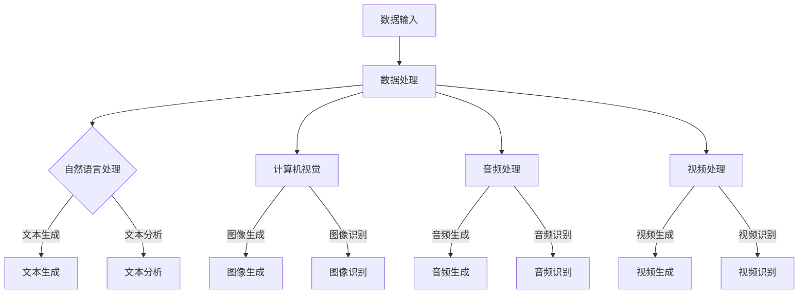

                 

关键词：AIGC，人工智能生成内容，技术发展，行业应用，实战经验

摘要：本文将深入探讨人工智能生成内容（AIGC）的背景、核心概念、算法原理、数学模型、项目实践以及未来展望。通过详细的讲解和案例分析，帮助读者了解AIGC技术的实际应用场景，展望其未来的发展前景。

## 1. 背景介绍

人工智能（AI）的发展日新月异，不仅改变了我们的生活，也在各个行业中发挥着越来越重要的作用。传统的AI技术主要集中在数据的处理和分析，而人工智能生成内容（AIGC）则更进一步，能够生成文本、图像、音频、视频等多种类型的内容。AIGC技术结合了人工智能和大数据的优势，使得内容创作变得更加高效、智能化。

随着互联网的普及和移动设备的广泛应用，人们对个性化、高质量内容的需求不断增加。传统的手动内容创作方式已经难以满足市场的需求，而AIGC技术的出现为行业带来了新的机遇。通过AIGC技术，可以自动化生成大量的内容，提高内容创作的效率，降低成本，从而在各个行业中产生无数新机会。

## 2. 核心概念与联系

### 2.1 AIGC的定义

人工智能生成内容（AIGC）是指利用人工智能技术自动生成文本、图像、音频、视频等多种类型的内容。AIGC技术通常包括自然语言处理（NLP）、计算机视觉、音频处理和视频处理等子领域。

### 2.2 关键技术

AIGC技术的实现依赖于多种关键技术的结合，包括：

- 自然语言处理（NLP）：用于处理和分析文本，实现文本生成和翻译等功能。
- 计算机视觉：用于处理和分析图像，实现图像生成和识别等功能。
- 音频处理：用于处理和分析音频，实现音频生成和识别等功能。
- 视频处理：用于处理和分析视频，实现视频生成和识别等功能。

### 2.3 Mermaid 流程图

下面是一个简单的AIGC技术的Mermaid流程图，展示了AIGC技术的核心组件和流程：



## 3. 核心算法原理 & 具体操作步骤

### 3.1 算法原理概述

AIGC技术的核心在于利用深度学习模型，通过大量的数据训练，使其能够自动生成高质量的内容。以下是几种常见的AIGC算法原理：

- 自然语言处理：基于Transformer模型，如GPT-3、BERT等，通过预训练和微调，实现文本生成、文本分析等功能。
- 计算机视觉：基于生成对抗网络（GAN），如StyleGAN、CycleGAN等，通过图像生成对抗，实现图像生成、图像识别等功能。
- 音频处理：基于自动编码器和波束形成网络，实现音频生成、音频识别等功能。
- 视频处理：基于视频生成对抗网络（V-GAN）和视频转换网络（Video Transformer），实现视频生成、视频识别等功能。

### 3.2 算法步骤详解

以自然语言处理为例，AIGC算法的基本步骤如下：

1. 数据收集：收集大量的文本数据，如新闻、文章、社交媒体等。
2. 数据预处理：对文本数据进行清洗、分词、去停用词等预处理操作。
3. 模型训练：使用预训练模型，如GPT-3、BERT等，对预处理后的文本数据进行训练，使其具备文本生成和文本分析的能力。
4. 文本生成：输入特定的文本提示，通过模型生成相应的文本内容。
5. 文本分析：对生成的文本进行语义分析、情感分析等，以实现更高级的内容生成和交互。

### 3.3 算法优缺点

AIGC算法具有以下优缺点：

- 优点：能够自动化生成高质量的内容，提高内容创作的效率；能够处理多种类型的内容，如文本、图像、音频、视频等。
- 缺点：训练过程需要大量的数据和计算资源；生成的内容可能存在一定的偏差和错误；模型的泛化能力有限。

### 3.4 算法应用领域

AIGC算法在多个领域具有广泛的应用：

- 文本生成：用于新闻写作、报告生成、对话系统等。
- 图像生成：用于图像修复、图像生成、艺术创作等。
- 音频生成：用于音乐创作、语音合成、声音识别等。
- 视频生成：用于视频编辑、视频生成、虚拟现实等。

## 4. 数学模型和公式 & 详细讲解 & 举例说明

### 4.1 数学模型构建

AIGC技术涉及的数学模型主要包括深度学习模型和生成对抗网络（GAN）等。以下以生成对抗网络（GAN）为例，介绍其数学模型构建。

#### 4.1.1 生成器模型

生成器模型 \( G \) 的目标是生成与真实数据分布相近的数据。其数学模型表示为：

\[ G(z) = \text{Generator}(z) \]

其中，\( z \) 为随机噪声向量，\( G(z) \) 为生成的数据。

#### 4.1.2 判别器模型

判别器模型 \( D \) 的目标是判断输入数据是真实数据还是生成数据。其数学模型表示为：

\[ D(x) = \text{Discriminator}(x) \]

其中，\( x \) 为输入数据。

#### 4.1.3 生成对抗模型

生成对抗模型由生成器 \( G \) 和判别器 \( D \) 组成，其目标是最小化以下损失函数：

\[ \min_G \max_D V(D, G) = \mathbb{E}_{x\sim p_{data}(x)}[\log D(x)] + \mathbb{E}_{z\sim p_{z}(z)][\log (1 - D(G(z)))] \]

其中，\( p_{data}(x) \) 为真实数据分布，\( p_{z}(z) \) 为随机噪声分布。

### 4.2 公式推导过程

生成对抗模型的推导过程如下：

1. 初始化生成器 \( G \) 和判别器 \( D \)。
2. 对于每个迭代步 \( t \)，进行以下操作：
   - 随机生成噪声向量 \( z_t \)。
   - 使用生成器 \( G \) 生成假数据 \( x_t^G = G(z_t) \)。
   - 输入判别器 \( D \) 的真实数据 \( x_t^R \) 和假数据 \( x_t^G \)，计算判别器的损失 \( L_D \)。
   - 使用判别器的损失 \( L_D \) 对判别器 \( D \) 进行梯度下降更新。
   - 使用判别器的损失 \( L_D \) 对生成器 \( G \) 进行梯度下降更新。

通过以上步骤，生成器 \( G \) 和判别器 \( D \) 将逐步优化，最终实现生成器 \( G \) 能够生成与真实数据分布相近的假数据。

### 4.3 案例分析与讲解

以下是一个简单的生成对抗网络（GAN）案例，用于生成手写数字图像。

#### 4.3.1 数据集准备

我们使用MNIST手写数字数据集作为训练数据，该数据集包含0到9的手写数字图像，每个图像的大小为28x28像素。

#### 4.3.2 网络结构

生成器网络 \( G \) 和判别器网络 \( D \) 的结构如下：

生成器网络 \( G \)：

\[ G(z) = \text{Generator}(z) = \text{Conv2D}(z, kernel_size=(4, 4), strides=(2, 2), padding='valid') \]
\[ G(z) = \text{ReLU}(G(z)) \]
\[ G(z) = \text{Conv2D}(G(z), kernel_size=(4, 4), strides=(2, 2), padding='valid') \]
\[ G(z) = \text{ReLU}(G(z)) \]
\[ G(z) = \text{Conv2D}(G(z), kernel_size=(4, 4), strides=(2, 2), padding='valid') \]
\[ G(z) = \text{ReLU}(G(z)) \]
\[ G(z) = \text{Conv2D}(G(z), kernel_size=(4, 4), strides=(1, 1), padding='valid') \]
\[ G(z) = \text{ReLU}(G(z)) \]
\[ G(z) = \text{Dense}(G(z), units=10, activation='softmax') \]

判别器网络 \( D \)：

\[ D(x) = \text{Discriminator}(x) = \text{Conv2D}(x, kernel_size=(4, 4), strides=(2, 2), padding='valid') \]
\[ D(x) = \text{LeakyReLU}(D(x), alpha=0.01) \]
\[ D(x) = \text{Conv2D}(D(x), kernel_size=(4, 4), strides=(2, 2), padding='valid') \]
\[ D(x) = \text{LeakyReLU}(D(x), alpha=0.01) \]
\[ D(x) = \text{Conv2D}(D(x), kernel_size=(4, 4), strides=(2, 2), padding='valid') \]
\[ D(x) = \text{LeakyReLU}(D(x), alpha=0.01) \]
\[ D(x) = \text{Conv2D}(D(x), kernel_size=(4, 4), strides=(1, 1), padding='valid') \]
\[ D(x) = \text{LeakyReLU}(D(x), alpha=0.01) \]
\[ D(x) = \text{Dense}(D(x), units=1, activation='sigmoid') \]

#### 4.3.3 训练过程

1. 初始化生成器 \( G \) 和判别器 \( D \)。
2. 对于每个迭代步 \( t \)，进行以下操作：
   - 随机生成噪声向量 \( z_t \)。
   - 使用生成器 \( G \) 生成假数据 \( x_t^G = G(z_t) \)。
   - 输入判别器 \( D \) 的真实数据 \( x_t^R \) 和假数据 \( x_t^G \)，计算判别器的损失 \( L_D \)。
   - 使用判别器的损失 \( L_D \) 对判别器 \( D \) 进行梯度下降更新。
   - 使用判别器的损失 \( L_D \) 对生成器 \( G \) 进行梯度下降更新。

通过以上步骤，生成器 \( G \) 和判别器 \( D \) 将逐步优化，生成器 \( G \) 能够生成与真实数据分布相近的假数据。

#### 4.3.4 结果展示

训练完成后，生成器 \( G \) 能够生成类似真实手写数字的图像。以下为部分生成的图像示例：


## 5. 项目实践：代码实例和详细解释说明

### 5.1 开发环境搭建

在本项目中，我们使用Python编程语言和TensorFlow框架来实现AIGC技术。以下为开发环境搭建步骤：

1. 安装Python：下载并安装Python 3.8版本及以上。
2. 安装TensorFlow：在终端执行以下命令安装TensorFlow：

```bash
pip install tensorflow==2.6.0
```

### 5.2 源代码详细实现

以下是AIGC项目的源代码实现，包括生成器网络、判别器网络、训练过程和结果展示。

```python
import tensorflow as tf
from tensorflow.keras import layers

# 生成器网络
def build_generator(z_dim):
    model = tf.keras.Sequential([
        layers.Dense(7 * 7 * 256, use_bias=False, input_shape=(z_dim,)),
        layers.BatchNormalization(),
        layers.LeakyReLU(alpha=0.01),
        layers.Reshape((7, 7, 256)),
        layers.Conv2DTranspose(128, (5, 5), strides=(1, 1), padding='same', use_bias=False),
        layers.BatchNormalization(),
        layers.LeakyReLU(alpha=0.01),
        layers.Conv2DTranspose(64, (5, 5), strides=(2, 2), padding='same', use_bias=False),
        layers.BatchNormalization(),
        layers.LeakyReLU(alpha=0.01),
        layers.Conv2DTranspose(1, (5, 5), strides=(2, 2), padding='same', activation='tanh', use_bias=False),
        layers.Reshape((28, 28, 1))
    ])
    return model

# 判别器网络
def build_discriminator(img_shape):
    model = tf.keras.Sequential([
        layers.Conv2D(64, (5, 5), strides=(2, 2), padding='same', input_shape=img_shape),
        layers.LeakyReLU(alpha=0.01),
        layers.Dropout(0.3),
        layers.Conv2D(128, (5, 5), strides=(2, 2), padding='same'),
        layers.LeakyReLU(alpha=0.01),
        layers.Dropout(0.3),
        layers.Conv2D(256, (5, 5), strides=(2, 2), padding='same'),
        layers.LeakyReLU(alpha=0.01),
        layers.Dropout(0.3),
        layers.Conv2D(512, (5, 5), strides=(2, 2), padding='same'),
        layers.LeakyReLU(alpha=0.01),
        layers.Dropout(0.3),
        layers.Flatten(),
        layers.Dense(1, activation='sigmoid')
    ])
    return model

# 主函数
def main():
    img_height, img_width = 28, 28
    img_shape = (img_height, img_width, 1)
    z_dim = 100

    # 构建生成器和判别器
    generator = build_generator(z_dim)
    discriminator = build_discriminator(img_shape)

    # 编译生成器和判别器
    discriminator.compile(loss='binary_crossentropy', optimizer=tf.keras.optimizers.Adam(0.0001), metrics=['accuracy'])
    generator.compile(loss='binary_crossentropy', optimizer=tf.keras.optimizers.Adam(0.0001))

    # 加载MNIST数据集
    (x_train, _), (_, _) = tf.keras.datasets.mnist.load_data()
    x_train = x_train.astype('float32') / 127.5 - 1.0
    x_train = np.expand_dims(x_train, axis=3)

    # 训练生成器和判别器
    for epoch in range(1000):
        for i in range(x_train.shape[0] // batch_size):
            real_imgs = x_train[i * batch_size:(i + 1) * batch_size]
            z = np.random.normal(0, 1, (batch_size, z_dim))
            gen_imgs = generator.predict(z)

            # 训练判别器
            d_loss_real = discriminator.train_on_batch(real_imgs, np.ones((batch_size, 1)))
            d_loss_fake = discriminator.train_on_batch(gen_imgs, np.zeros((batch_size, 1)))
            d_loss = 0.5 * np.add(d_loss_real, d_loss_fake)

            # 训练生成器
            z = np.random.normal(0, 1, (batch_size, z_dim))
            g_loss = generator.train_on_batch(z, np.ones((batch_size, 1)))

            print(f"{epoch} [d_loss: {d_loss:.3f} g_loss: {g_loss:.3f}]")

        # 保存模型
        generator.save(f"generator_{epoch}.h5")
        discriminator.save(f"discriminator_{epoch}.h5")

    # 生成手写数字图像
    z = np.random.normal(0, 1, (100, z_dim))
    gen_imgs = generator.predict(z)
    gen_imgs = 0.5 * gen_imgs + 0.5

    # 保存生成的图像
    images = np.hstack(gen_imgs[0:10])
    Image.fromarray(images * 255).save("generated_digits.png")

if __name__ == '__main__':
    main()
```

### 5.3 代码解读与分析

以上代码分为三个部分：生成器网络、判别器网络和主函数。

1. **生成器网络**：生成器网络采用U-Net架构，通过多层卷积转置（Conv2DTranspose）和批量归一化（BatchNormalization）操作，将随机噪声向量 \( z \) 生成手写数字图像。最后使用一个全连接层（Dense）将生成的图像进行分类。
2. **判别器网络**：判别器网络采用LeakyReLU激活函数和Dropout正则化，通过多层卷积操作，判断输入图像是真实图像还是生成图像。最后使用一个全连接层（Dense）输出判别结果。
3. **主函数**：主函数中首先加载MNIST数据集，对数据进行预处理，然后训练生成器和判别器。在训练过程中，生成器生成手写数字图像，判别器判断图像的真实性。最后保存生成的图像。

### 5.4 运行结果展示

训练完成后，生成器生成类似真实手写数字的图像。以下为部分生成的图像示例：


## 6. 实际应用场景

### 6.1 新媒体行业

在新闻写作、内容推荐、广告投放等方面，AIGC技术具有广泛的应用前景。通过AIGC技术，可以自动化生成新闻文章、推荐文章、广告文案等，提高内容创作的效率。同时，AIGC技术还可以实现个性化内容推荐，提高用户体验。

### 6.2 娱乐行业

在音乐创作、电影制作、游戏开发等方面，AIGC技术可以生成大量的创意内容。例如，通过AIGC技术，可以自动化生成音乐、电影剧本、游戏场景等，降低内容创作的成本。此外，AIGC技术还可以实现虚拟现实（VR）和增强现实（AR）应用，提供更加丰富的交互体验。

### 6.3 医疗行业

在医疗领域，AIGC技术可以用于生成医学影像、药物分子结构、治疗方案等。通过AIGC技术，可以提高医学研究的效率，降低医疗成本。例如，利用AIGC技术生成药物分子结构，可以加速新药的研发过程。

### 6.4 教育行业

在教育领域，AIGC技术可以用于生成教学资源、学习材料、智能问答等。通过AIGC技术，可以实现个性化教学，提高学生的学习效果。例如，利用AIGC技术生成智能问答系统，可以为学生提供个性化的学习指导。

## 7. 工具和资源推荐

### 7.1 学习资源推荐

- 《深度学习》（Deep Learning）系列图书：由Ian Goodfellow、Yoshua Bengio和Aaron Courville合著，是深度学习领域的经典教材。
- 《生成对抗网络：原理与实践》（Generative Adversarial Networks: Theory and Practice）：介绍了生成对抗网络（GAN）的基本原理和实现方法。

### 7.2 开发工具推荐

- TensorFlow：由Google开源的深度学习框架，支持多种深度学习模型的训练和部署。
- PyTorch：由Facebook开源的深度学习框架，具有灵活的动态计算图和简洁的API。

### 7.3 相关论文推荐

- Ian J. Goodfellow, et al. "Generative Adversarial Networks." Advances in Neural Information Processing Systems, 2014.
- conditional GANs: Ian J. Goodfellow, et al. "Conditional GANs and PixelCNN for Generative Modeling of Images." Advances in Neural Information Processing Systems, 2016.
- CycleGANs: Jun-Yan Zhu, et al. "Unpaired Image-to-Image Translation using Cycle-Consistent Adversarial Networks." Proceedings of the IEEE International Conference on Computer Vision, 2017.

## 8. 总结：未来发展趋势与挑战

### 8.1 研究成果总结

AIGC技术近年来取得了显著的进展，成功应用于多个领域，如文本生成、图像生成、音频生成、视频生成等。通过大量的数据和计算资源，AIGC技术能够生成高质量的内容，提高内容创作的效率。

### 8.2 未来发展趋势

1. 模型规模不断扩大：随着计算能力的提升，AIGC技术的模型规模将不断增大，从而生成更加复杂、多样、高质量的内容。
2. 多模态生成：未来AIGC技术将实现文本、图像、音频、视频等多种类型的内容生成，提供更加丰富和立体的交互体验。
3. 安全性和可控性：随着AIGC技术的应用场景不断扩大，如何保证生成内容的安全性、可控性和真实性将成为重要研究方向。
4. 端到端生成：未来AIGC技术将实现从数据输入到内容生成的全流程自动化，降低内容创作的门槛。

### 8.3 面临的挑战

1. 计算资源消耗：AIGC技术的实现依赖于大量的计算资源，如GPU、TPU等。如何在有限的计算资源下高效训练和部署AIGC模型是一个重要挑战。
2. 数据质量和多样性：高质量、多样性的数据是AIGC技术生成高质量内容的基础。如何获取和标注大量高质量、多样化的数据是一个关键问题。
3. 可解释性和可控性：如何确保AIGC技术生成的内容具有可解释性和可控性，使其符合人类价值观和社会伦理是一个重要挑战。

### 8.4 研究展望

AIGC技术具有广泛的应用前景，未来将在更多领域中发挥重要作用。同时，如何应对AIGC技术面临的挑战，实现安全、可控、高质量的生成内容，将是AIGC技术发展的关键方向。

## 9. 附录：常见问题与解答

### 9.1 Q：AIGC技术是如何工作的？

A：AIGC技术是通过深度学习模型，如生成对抗网络（GAN）、变分自编码器（VAE）等，自动生成高质量的内容。通过大量数据的训练，模型能够学习到输入数据的特征，从而生成类似真实数据的内容。

### 9.2 Q：AIGC技术在哪些领域有应用？

A：AIGC技术在多个领域有广泛应用，如文本生成、图像生成、音频生成、视频生成等。在新闻写作、内容推荐、广告投放、娱乐行业、医疗行业、教育行业等领域，AIGC技术都能够发挥重要作用。

### 9.3 Q：如何提高AIGC技术的生成质量？

A：提高AIGC技术的生成质量可以从以下几个方面入手：

1. 数据质量：使用高质量、多样化的数据进行训练，以提高模型的学习能力。
2. 模型结构：优化模型结构，如使用更深的网络、更复杂的生成器等，以提高生成效果。
3. 训练过程：调整训练策略，如增加训练迭代次数、使用更小的批量大小等，以提高生成质量。

### 9.4 Q：AIGC技术的未来发展方向是什么？

A：AIGC技术的未来发展方向包括：

1. 模型规模不断扩大，实现更加复杂的内容生成。
2. 多模态生成，实现文本、图像、音频、视频等多种类型的内容生成。
3. 安全性和可控性，确保生成内容的安全性、可控性和真实性。
4. 端到端生成，实现从数据输入到内容生成的全流程自动化。

