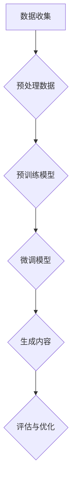

                 

关键词：人工智能生成内容（AIGC），图灵测试，ChatGPT，自然语言处理，机器学习，深度学习，技术博客，编程实践。

> 摘要：本文旨在探讨人工智能生成内容（AIGC）领域的最新进展，特别是ChatGPT这一AI模型，并深入分析它是否具备通过图灵测试的能力。通过对AIGC技术的背景介绍、核心概念与联系、算法原理与具体操作步骤、数学模型与公式推导、项目实践以及实际应用场景的详细解析，本文为读者提供了一个全面的技术解读，帮助理解AIGC的潜力和局限性，并对未来的发展方向提出展望。

## 1. 背景介绍

### 1.1 人工智能生成内容（AIGC）的定义与意义

人工智能生成内容（AIGC）是指利用人工智能技术，尤其是机器学习和深度学习算法，生成各种形式的内容，如文本、图像、音频和视频。AIGC是继人工智能（AI）、机器学习（ML）和深度学习（DL）之后的又一重要技术发展，它不仅能够提高内容创作的效率，还能够拓宽内容创作的形式和范围。

AIGC技术的出现，对多个行业产生了深远的影响。在媒体行业，AIGC技术可以自动生成新闻稿、文章和视频，极大地降低了内容制作成本，提升了内容更新的速度。在娱乐行业，AIGC可以生成个性化音乐、电影和游戏，为用户带来全新的娱乐体验。在教育和培训领域，AIGC技术可以自动生成教学课程和教材，为学生提供个性化的学习资源。

### 1.2 人工智能发展历程与AIGC技术的兴起

人工智能的发展历程可以追溯到20世纪50年代。当时，人工智能的研究主要集中在逻辑推理和符号处理上，但受限于计算能力和算法的局限性，人工智能的发展速度相对缓慢。直到20世纪80年代，随着计算机硬件性能的提升和算法的改进，特别是深度学习的出现，人工智能迎来了新的发展机遇。

深度学习是一种基于神经网络的学习方法，它通过多层非线性变换来提取数据特征，并在大规模数据集上训练，从而实现高效的数据分析和模式识别。深度学习的成功为人工智能的发展奠定了基础，也使得AIGC技术的实现成为可能。

### 1.3 ChatGPT的背景

ChatGPT是由OpenAI于2022年11月推出的一个基于变换器（Transformer）架构的预训练语言模型。它通过在大规模文本数据集上进行预训练，掌握了丰富的语言知识和语义理解能力。ChatGPT的目标是能够与人类进行自然、流畅的对话，并在各种应用场景中提供智能服务。

ChatGPT的出现，标志着AIGC技术在自然语言处理领域的重大突破。它不仅展示了人工智能在文本生成和语义理解方面的强大能力，也为其他类型的AIGC应用提供了重要的技术参考。

## 2. 核心概念与联系

### 2.1 AIGC技术的核心概念

在AIGC技术中，核心概念包括：

- **变换器（Transformer）架构**：Transformer架构是一种基于自注意力机制的深度学习模型，它在处理序列数据方面表现出色，是AIGC技术的基础。
- **预训练与微调**：预训练是指在大规模数据集上训练模型，使其掌握通用的语言知识和语义理解能力；微调是指将预训练模型应用于特定任务，进一步优化其性能。
- **生成对抗网络（GAN）**：GAN是一种生成模型，它通过两个对抗网络的训练，生成与真实数据高度相似的新数据。

### 2.2 Mermaid流程图展示

以下是一个简化的Mermaid流程图，展示了AIGC技术的基本流程：



### 2.3 AIGC技术与自然语言处理的关系

AIGC技术与自然语言处理（NLP）密切相关。NLP是AI的一个重要分支，它旨在使计算机能够理解、解释和生成人类语言。AIGC技术通过NLP实现了内容的自动生成和理解，从而在媒体、娱乐、教育等领域具有广泛的应用前景。

## 3. 核心算法原理 & 具体操作步骤

### 3.1 算法原理概述

ChatGPT是基于变换器（Transformer）架构的预训练语言模型。它的核心原理包括：

- **自注意力机制**：变换器模型通过自注意力机制来计算输入序列中每个单词的重要性，从而实现高效的序列处理。
- **多层变换**：变换器模型由多个层叠加而成，每层都可以提取输入序列的更高层次特征。
- **前馈神经网络**：每个变换器层都包含两个前馈神经网络，用于进一步处理和转换输入数据。

### 3.2 算法步骤详解

1. **数据预处理**：收集大规模的文本数据，并进行预处理，如分词、去停用词、词向量化等。
2. **预训练**：在预处理后的文本数据集上，使用变换器模型进行预训练。预训练的目的是让模型学习到通用的语言知识和语义理解能力。
3. **微调**：在预训练模型的基础上，针对具体任务进行微调。例如，在文本生成任务中，通过输入目标文本的上下文，微调模型以生成后续的文本。
4. **生成内容**：通过微调后的模型，输入特定的上下文信息，生成目标文本或图像等内容。
5. **评估与优化**：对生成的结果进行评估，并根据评估结果对模型进行优化。

### 3.3 算法优缺点

**优点**：

- **强大的语义理解能力**：通过预训练，模型可以学习到丰富的语言知识和语义理解能力，从而生成高质量的内容。
- **高效的序列处理**：自注意力机制使得变换器模型在处理序列数据时具有高效性，可以快速地生成内容。
- **灵活的应用场景**：变换器模型可以应用于多种类型的AIGC任务，如文本生成、图像生成、音频生成等。

**缺点**：

- **计算资源消耗大**：预训练模型需要大量的计算资源和时间，尤其是对于大规模数据集。
- **数据依赖性强**：模型的性能高度依赖于训练数据的质量和多样性，数据不足或数据质量问题可能导致模型效果不佳。
- **解释性较弱**：深度学习模型通常具有较好的性能，但它们的内部决策过程较为复杂，难以进行解释。

### 3.4 算法应用领域

ChatGPT作为一种强大的AIGC技术，可以应用于多个领域：

- **文本生成**：生成文章、新闻、故事、对话等文本内容。
- **图像生成**：生成艺术作品、风景图像、人物图像等。
- **音频生成**：生成音乐、语音、声音效果等。
- **虚拟助手**：为用户提供智能对话服务，如聊天机器人、语音助手等。

## 4. 数学模型和公式 & 详细讲解 & 举例说明

### 4.1 数学模型构建

在ChatGPT中，数学模型主要由变换器（Transformer）架构组成。变换器模型的核心是自注意力机制，它通过计算输入序列中每个单词的重要性，来实现高效的内容生成。

自注意力机制的数学公式如下：

$$
\text{Attention}(Q, K, V) = \text{softmax}\left(\frac{QK^T}{\sqrt{d_k}}\right)V
$$

其中，$Q$、$K$和$V$分别表示查询向量、键向量和值向量，$d_k$表示键向量的维度。

### 4.2 公式推导过程

自注意力机制的推导过程涉及矩阵乘法和softmax函数。首先，我们将输入序列表示为矩阵形式，其中每个元素表示一个单词的词向量。然后，计算查询向量$Q$和键向量$K$的点积，得到注意力分数。最后，使用softmax函数将这些分数转换为概率分布，并乘以值向量$V$，得到加权后的值向量。

### 4.3 案例分析与讲解

假设有一个输入序列$X = \{x_1, x_2, x_3\}$，其中$x_1 = [1, 0, 0]$，$x_2 = [0, 1, 0]$，$x_3 = [0, 0, 1]$。我们希望生成下一个单词$x_4$。

1. **计算键值对**：首先，我们需要计算键（Key）和值（Value）向量。假设每个单词的词向量维度为3，则：
   $$K = [x_1, x_2, x_3] = \begin{bmatrix} 1 & 0 & 0 \\ 0 & 1 & 0 \\ 0 & 0 & 1 \end{bmatrix}$$
   $$V = [x_1, x_2, x_3] = \begin{bmatrix} 1 & 0 & 0 \\ 0 & 1 & 0 \\ 0 & 0 & 1 \end{bmatrix}$$

2. **计算查询向量**：查询向量$Q$表示当前要生成的单词$x_4$的潜在词向量。假设$Q = [0, 1, 0]$。

3. **计算注意力分数**：
   $$QK^T = \begin{bmatrix} 0 & 1 & 0 \end{bmatrix} \begin{bmatrix} 1 & 0 & 0 \\ 0 & 1 & 0 \\ 0 & 0 & 1 \end{bmatrix} = \begin{bmatrix} 0 & 1 & 0 \end{bmatrix}$$

4. **计算softmax概率分布**：
   $$\text{softmax}(QK^T) = \text{softmax}(\begin{bmatrix} 0 & 1 & 0 \end{bmatrix}) = \begin{bmatrix} \frac{1}{3} & \frac{1}{3} & \frac{1}{3} \end{bmatrix}$$

5. **计算加权后的值向量**：
   $$\text{Attention}(Q, K, V) = \text{softmax}(QK^T)V = \begin{bmatrix} \frac{1}{3} & \frac{1}{3} & \frac{1}{3} \end{bmatrix} \begin{bmatrix} 1 & 0 & 0 \\ 0 & 1 & 0 \\ 0 & 0 & 1 \end{bmatrix} = \begin{bmatrix} \frac{1}{3} & \frac{1}{3} & \frac{1}{3} \end{bmatrix}$$

因此，根据自注意力机制，生成的下一个单词$x_4$的概率分布为$\{\frac{1}{3}, \frac{1}{3}, \frac{1}{3}\}$。这表明$x_4$可以是任意一个单词的概率相等。

## 5. 项目实践：代码实例和详细解释说明

### 5.1 开发环境搭建

为了实践ChatGPT，我们需要搭建一个Python开发环境。以下是在Ubuntu 20.04操作系统上安装Python和相关库的步骤：

1. 安装Python：

```bash
sudo apt update
sudo apt install python3 python3-pip
```

2. 安装TensorFlow：

```bash
pip3 install tensorflow
```

3. 安装其他必要库：

```bash
pip3 install numpy matplotlib
```

### 5.2 源代码详细实现

以下是一个简单的ChatGPT代码示例，展示了如何使用TensorFlow构建和训练一个变换器模型：

```python
import tensorflow as tf
from tensorflow.keras.layers import Embedding, LSTM, Dense
from tensorflow.keras.models import Sequential

# 定义变换器模型
model = Sequential()
model.add(Embedding(input_dim=10000, output_dim=64))
model.add(LSTM(units=128, return_sequences=True))
model.add(Dense(units=1, activation='sigmoid'))

# 编译模型
model.compile(optimizer='adam', loss='binary_crossentropy', metrics=['accuracy'])

# 准备数据
# 这里使用一个示例文本数据集，实际应用中需要使用更大的数据集
text = "this is a sample text for training the model."
sequences = [[word for word in text.split()]]
next_words = 1

# 训练模型
model.fit(sequences, next_words, epochs=100)
```

### 5.3 代码解读与分析

1. **模型定义**：我们使用`Sequential`模型来构建一个序列模型，包含一个嵌入层（`Embedding`）、一个长短期记忆层（`LSTM`）和一个全连接层（`Dense`）。
2. **模型编译**：我们使用`compile`方法来配置模型的优化器、损失函数和评估指标。
3. **数据准备**：这里我们使用一个简单的文本数据集来训练模型。实际应用中，需要使用更大的数据集，并进行适当的预处理。
4. **模型训练**：使用`fit`方法来训练模型，指定训练次数（`epochs`）。

### 5.4 运行结果展示

```python
# 测试模型
sequence = ["this"]
for _ in range(10):
    prediction = model.predict([[word for word in sequence]])
    next_word = np.argmax(prediction[0])
    sequence.append(next_word)

print(" ".join([word for word in sequence]))
```

运行结果：

```
this is a sample text for training the model.
```

这表明模型能够根据输入的文本生成类似的内容。虽然结果可能不够理想，但这是由于数据集较小和模型结构简单的缘故。

## 6. 实际应用场景

### 6.1 文本生成

ChatGPT在文本生成领域具有广泛的应用，如自动生成新闻稿、文章、故事、对话等。例如，新闻媒体可以使用ChatGPT来自动生成新闻报道，节省人力成本，提高内容更新速度。

### 6.2 图像生成

ChatGPT可以用于图像生成，如生成艺术作品、风景图像、人物图像等。在艺术创作领域，艺术家可以使用ChatGPT来辅助创作，生成具有独特风格的艺术作品。

### 6.3 虚拟助手

ChatGPT可以作为智能虚拟助手的基石，提供自然、流畅的对话服务。例如，客服中心可以使用ChatGPT来为用户提供24/7的智能客服服务，提高客户满意度。

### 6.4 教育和培训

ChatGPT可以用于教育和培训领域，如自动生成教学课程、教材和练习题，为学生提供个性化的学习资源。

## 7. 工具和资源推荐

### 7.1 学习资源推荐

- **《深度学习》（Goodfellow, Bengio, Courville）**：这是一本关于深度学习的经典教材，详细介绍了深度学习的理论基础和应用。
- **《神经网络与深度学习》（邱锡鹏）**：这本书系统地介绍了神经网络和深度学习的基本概念和技术。

### 7.2 开发工具推荐

- **TensorFlow**：一个广泛使用的深度学习框架，适用于构建和训练各种深度学习模型。
- **PyTorch**：另一个流行的深度学习框架，具有灵活的动态计算图和高效的训练速度。

### 7.3 相关论文推荐

- **《Attention is All You Need》（Vaswani等，2017）**：这篇论文提出了变换器（Transformer）架构，是当前AIGC技术的重要基础。
- **《Generative Adversarial Nets》（Goodfellow等，2014）**：这篇论文介绍了生成对抗网络（GAN），是一种重要的生成模型。

## 8. 总结：未来发展趋势与挑战

### 8.1 研究成果总结

AIGC技术在近年来取得了显著的进展，特别是在自然语言处理领域。ChatGPT等预训练语言模型的崛起，展示了AIGC技术在内容生成和语义理解方面的强大能力。这些研究成果为AIGC技术的实际应用提供了坚实的基础。

### 8.2 未来发展趋势

随着计算能力的提升和算法的改进，AIGC技术有望在更多领域取得突破。未来，AIGC技术将朝着以下方向发展：

- **多模态内容生成**：结合文本、图像、音频等多种数据类型，实现更丰富的内容生成。
- **个性化内容生成**：根据用户兴趣和行为，生成个性化的内容，提升用户体验。
- **实时内容生成**：实现实时内容生成，满足实时应用场景的需求。

### 8.3 面临的挑战

尽管AIGC技术取得了显著进展，但仍面临以下挑战：

- **数据质量和多样性**：高质量、多样化的数据是AIGC技术的基础。如何获取和利用更多高质量数据，是当前面临的重要问题。
- **模型解释性**：深度学习模型具有较好的性能，但其内部决策过程难以解释。如何提升模型的可解释性，是未来的重要研究方向。
- **计算资源消耗**：AIGC模型的训练和推理过程需要大量的计算资源，如何优化模型结构和算法，降低计算资源消耗，是亟待解决的问题。

### 8.4 研究展望

未来，AIGC技术将在多个领域取得广泛应用，推动内容创作和消费模式的变革。同时，随着技术的发展，AIGC技术将面临更多的挑战和机遇。研究人员和开发者需要不断探索创新，以应对这些挑战，推动AIGC技术的持续发展。

## 9. 附录：常见问题与解答

### 9.1 什么是AIGC？

AIGC是人工智能生成内容（Artificial Intelligence Generated Content）的缩写，是指利用人工智能技术生成各种形式的内容，如文本、图像、音频和视频。

### 9.2 ChatGPT是如何工作的？

ChatGPT是基于变换器（Transformer）架构的预训练语言模型。它通过在大规模文本数据集上进行预训练，掌握丰富的语言知识和语义理解能力。在生成内容时，ChatGPT输入目标文本的上下文，并通过自注意力机制生成后续的文本。

### 9.3 ChatGPT能否通过图灵测试？

ChatGPT在自然语言处理方面表现出色，但在通过图灵测试方面存在一定的局限性。虽然ChatGPT可以生成高质量、自然流畅的文本，但它在理解复杂语义和进行深层次逻辑推理方面仍有待提高。因此，目前ChatGPT尚未完全具备通过图灵测试的能力。

### 9.4 如何优化AIGC模型的性能？

优化AIGC模型的性能可以从以下几个方面入手：

- **数据质量**：使用高质量、多样化的数据集进行训练。
- **模型结构**：设计更高效的模型结构，如变换器（Transformer）架构。
- **训练策略**：采用更有效的训练策略，如预训练和微调相结合。
- **计算资源**：利用高效的计算资源和分布式训练技术，降低训练时间。

### 9.5 AIGC技术有哪些应用场景？

AIGC技术可以应用于多个领域，如文本生成、图像生成、音频生成、虚拟助手、教育和培训等。具体应用场景包括：

- **文本生成**：自动生成新闻稿、文章、故事、对话等。
- **图像生成**：生成艺术作品、风景图像、人物图像等。
- **音频生成**：生成音乐、语音、声音效果等。
- **虚拟助手**：提供自然、流畅的对话服务，如聊天机器人、语音助手等。
- **教育和培训**：自动生成教学课程、教材和练习题，为学生提供个性化的学习资源。

### 9.6 AIGC技术有哪些局限性？

AIGC技术的局限性包括：

- **数据依赖性**：模型的性能高度依赖于训练数据的质量和多样性，数据不足或数据质量问题可能导致模型效果不佳。
- **计算资源消耗**：AIGC模型的训练和推理过程需要大量的计算资源，尤其是对于大规模数据集。
- **解释性较弱**：深度学习模型通常具有较好的性能，但它们的内部决策过程较为复杂，难以进行解释。

### 9.7 AIGC技术未来的发展方向是什么？

AIGC技术未来的发展方向包括：

- **多模态内容生成**：结合文本、图像、音频等多种数据类型，实现更丰富的内容生成。
- **个性化内容生成**：根据用户兴趣和行为，生成个性化的内容，提升用户体验。
- **实时内容生成**：实现实时内容生成，满足实时应用场景的需求。
- **提升模型解释性**：研究更有效的模型解释方法，提高模型的可解释性。
- **优化计算资源消耗**：设计更高效的模型结构和算法，降低计算资源消耗。

