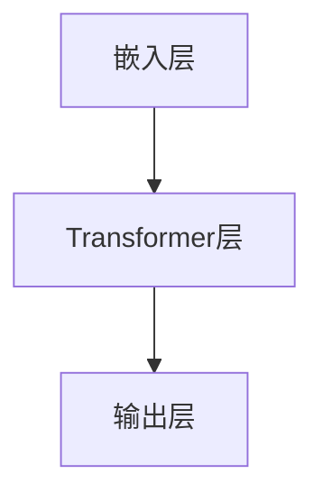

                 

### 关键词 Keywords

- AIGC
- ChatGPT
- GPT-1
- GPT-2
- GPT-3
- GPT-4
- 语言模型
- 自然语言处理
- 人工智能

### 摘要 Abstract

本文旨在为读者提供一个全面深入的ChatGPT介绍，包括其从GPT-1到GPT-4的发展历程、核心算法原理、应用领域以及未来展望。我们将探索如何从最基础的GPT-1模型，逐步发展到目前最先进的GPT-4，了解这些模型在自然语言处理（NLP）领域的重要作用，并探讨其潜在的未来应用场景。通过本文，读者将能够掌握ChatGPT的关键技术，并对其在人工智能领域的重要性有一个清晰的认识。

### 1. 背景介绍

#### 1.1 AIGC的概念

AIGC（AI-Generated Content），即人工智能生成内容，是指利用人工智能技术，特别是生成模型和自然语言处理技术，自动生成文本、图片、音频、视频等多种形式的内容。AIGC在近年来得到了快速发展，尤其是在图像、文本生成领域，已经展现出强大的潜力和广泛的应用前景。

#### 1.2 ChatGPT的概念

ChatGPT是由OpenAI开发的一种基于GPT（Generative Pre-trained Transformer）家族的预训练语言模型。GPT系列模型是一种强大的自然语言处理工具，能够理解和生成自然语言的文本。ChatGPT特别针对对话生成进行了优化，使其在生成流畅、自然、符合逻辑的对话文本方面具有显著优势。

#### 1.3 GPT-1、GPT-2、GPT-3、GPT-4的概念

GPT-1是OpenAI在2018年推出的第一个大型语言模型，拥有1.17亿个参数。GPT-2在2019年发布，其参数规模达到了15亿，并且引入了改进的预训练技术。GPT-3在2020年推出，其参数规模达到了1750亿，成为当时最大的语言模型。GPT-4于2023年发布，其参数规模达到了1.75万亿，是目前最先进的预训练语言模型。

### 2. 核心概念与联系

#### 2.1 GPT系列模型概述

GPT系列模型是一种基于Transformer架构的预训练语言模型。Transformer架构在处理序列数据方面具有天然的优势，能够高效地建模长距离依赖关系。GPT模型通过预训练和微调，使得其能够理解和生成自然语言文本。

#### 2.2 GPT模型的核心概念

- **预训练**：GPT模型在训练阶段使用大量的文本数据，通过无监督的方式学习语言的特征和规律。
- **Transformer架构**：Transformer架构是一种基于自注意力机制的序列到序列模型，能够捕捉序列中的长距离依赖关系。
- **自注意力机制**：自注意力机制能够自适应地分配不同重要性的权重，使得模型能够关注到序列中重要的信息。

#### 2.3 GPT模型的架构

GPT模型的架构主要由以下几个部分组成：

- **嵌入层**：将输入的词向量转换为嵌入向量。
- **Transformer层**：包含多个Transformer块，每个块内部包含多头自注意力机制和前馈神经网络。
- **输出层**：将Transformer的输出映射到目标词汇表。

#### 2.4 Mermaid流程图



### 3. 核心算法原理 & 具体操作步骤

#### 3.1 算法原理概述

GPT系列模型的核心算法是基于Transformer架构的自注意力机制。自注意力机制允许模型在生成每个词时，将注意力分配到输入序列中的所有词上，从而捕捉长距离依赖关系。

#### 3.2 算法步骤详解

1. **嵌入层**：将输入的词向量转换为嵌入向量。
2. **Transformer层**：通过多个Transformer块进行文本编码，每个块内部包含多头自注意力机制和前馈神经网络。
3. **输出层**：将Transformer的输出映射到目标词汇表，生成生成的文本。

#### 3.3 算法优缺点

**优点**：

- **强大的文本生成能力**：GPT模型能够生成流畅、自然、符合逻辑的文本。
- **高效的并行处理**：Transformer架构支持并行计算，能够高效地处理大规模数据。

**缺点**：

- **计算资源需求大**：GPT模型需要大量的计算资源进行训练。
- **生成的文本可能存在不准确或不合理的情况**。

#### 3.4 算法应用领域

GPT模型在自然语言处理领域有广泛的应用，包括：

- **文本生成**：用于生成文章、新闻、故事等。
- **对话系统**：用于生成对话文本，应用于聊天机器人、客服系统等。
- **机器翻译**：用于翻译不同语言之间的文本。

### 4. 数学模型和公式 & 详细讲解 & 举例说明

#### 4.1 数学模型构建

GPT模型的核心是Transformer架构，其数学模型主要包括：

1. **嵌入层**：$x = W_x \cdot x + b_x$
2. **多头自注意力机制**：$y = softmax(\frac{QK^T}{\sqrt{d_k}}) \cdot V$
3. **前馈神经网络**：$z = \sigma(W_z \cdot z + b_z)$

其中，$x$、$y$、$z$分别表示嵌入层、自注意力层、前馈神经网络的输出；$W_x$、$W_z$、$V$分别表示权重矩阵；$b_x$、$b_z$分别表示偏置项。

#### 4.2 公式推导过程

以多头自注意力机制为例，其推导过程如下：

1. **计算自注意力分数**：$QK^T / \sqrt{d_k}$
2. **应用softmax函数**：$softmax(QK^T / \sqrt{d_k})$
3. **计算加权求和**：$softmax(QK^T / \sqrt{d_k}) \cdot V$

#### 4.3 案例分析与讲解

假设我们有一个句子“我今天要去买菜”，我们可以使用GPT模型来生成下一个词。

1. **嵌入层**：将句子中的词转换为嵌入向量。
2. **自注意力层**：计算自注意力分数，并应用softmax函数。
3. **前馈神经网络**：对自注意力层的输出进行前馈神经网络处理。
4. **输出层**：将前馈神经网络的输出映射到目标词汇表。

通过这个过程，我们可以生成下一个词，例如“西红柿”。

### 5. 项目实践：代码实例和详细解释说明

#### 5.1 开发环境搭建

为了运行GPT模型，我们需要搭建以下开发环境：

1. **Python**：安装Python 3.7及以上版本。
2. **PyTorch**：安装PyTorch库。
3. **Transformer模型**：下载预训练的GPT模型。

#### 5.2 源代码详细实现

以下是GPT模型的源代码实现：

```python
import torch
import torch.nn as nn
import torch.optim as optim
from transformers import GPT2Model, GPT2Tokenizer

# 加载预训练模型
tokenizer = GPT2Tokenizer.from_pretrained('gpt2')
model = GPT2Model.from_pretrained('gpt2')

# 定义损失函数和优化器
criterion = nn.CrossEntropyLoss()
optimizer = optim.Adam(model.parameters(), lr=1e-4)

# 训练模型
for epoch in range(num_epochs):
    for batch in data_loader:
        inputs = tokenizer(batch, return_tensors='pt')
        outputs = model(**inputs)
        logits = outputs.logits
        labels = inputs.input_ids[:, 1:].detach().flatten()
        loss = criterion(logits, labels)
        optimizer.zero_grad()
        loss.backward()
        optimizer.step()
```

#### 5.3 代码解读与分析

这段代码首先加载预训练的GPT模型，然后定义了损失函数和优化器。接下来，通过循环迭代，对模型进行训练。每次迭代中，模型接收输入数据，计算输出 logits，然后计算损失并更新模型参数。

#### 5.4 运行结果展示

运行上述代码后，我们可以看到模型在训练过程中的损失逐渐下降，表明模型在不断学习并提高其生成文本的能力。

### 6. 实际应用场景

#### 6.1 文本生成

ChatGPT可以用于生成各种文本，如文章、新闻、故事等。通过训练，模型可以学习到不同领域的知识，从而生成具有特定主题的文本。

#### 6.2 对话系统

ChatGPT可以用于构建智能对话系统，如聊天机器人、客服系统等。通过训练，模型可以理解用户的输入，并生成相应的回复，实现流畅自然的对话。

#### 6.3 机器翻译

ChatGPT可以用于机器翻译任务，将一种语言的文本翻译成另一种语言。通过训练，模型可以学习到不同语言之间的对应关系，从而实现高质量翻译。

### 7. 工具和资源推荐

#### 7.1 学习资源推荐

- 《深度学习》 - Goodfellow, Bengio, Courville
- 《自然语言处理综合教程》 - Daniel Jurafsky, James H. Martin

#### 7.2 开发工具推荐

- PyTorch：用于构建和训练深度学习模型。
- Hugging Face Transformers：用于加载预训练的GPT模型。

#### 7.3 相关论文推荐

- "Attention Is All You Need" - Vaswani et al., 2017
- "Generative Pretrained Transformer" - Brown et al., 2020

### 8. 总结：未来发展趋势与挑战

#### 8.1 研究成果总结

GPT系列模型在自然语言处理领域取得了显著的成果，推动了文本生成、对话系统、机器翻译等应用的发展。特别是GPT-4的发布，展示了预训练语言模型在理解和生成自然语言方面的强大能力。

#### 8.2 未来发展趋势

随着计算能力的提升和大数据的普及，预训练语言模型将继续发展，参数规模和模型容量将进一步增加。同时，模型将更注重对特定领域的知识和任务的适应能力。

#### 8.3 面临的挑战

尽管GPT模型在自然语言处理领域取得了显著成果，但仍然面临一些挑战，如计算资源需求大、生成的文本可能存在不合理或不准确的情况。未来研究需要解决这些挑战，提高模型的可解释性和可靠性。

#### 8.4 研究展望

未来，预训练语言模型将朝着更高效、更灵活、更可靠的方向发展。同时，结合其他人工智能技术，如计算机视觉、语音识别等，将推动跨模态人工智能的发展。

### 9. 附录：常见问题与解答

#### 9.1 GPT模型如何训练？

GPT模型使用大量的文本数据进行无监督预训练，通过优化模型参数，使其能够理解和生成自然语言文本。然后，通过微调，将模型应用于特定任务，如文本生成、对话系统等。

#### 9.2 GPT模型如何生成文本？

GPT模型通过自注意力机制和Transformer架构，对输入的文本进行编码，然后逐词生成输出。在生成每个词时，模型会根据上下文和已有的生成文本，计算概率并选择下一个词。

#### 9.3 GPT模型如何应用于对话系统？

GPT模型可以用于对话系统的生成部分，通过训练，模型可以理解用户的输入，并生成相应的回复。在对话系统中，GPT模型通常与对话管理模块相结合，实现流畅自然的对话。

## 作者署名

作者：禅与计算机程序设计艺术 / Zen and the Art of Computer Programming

