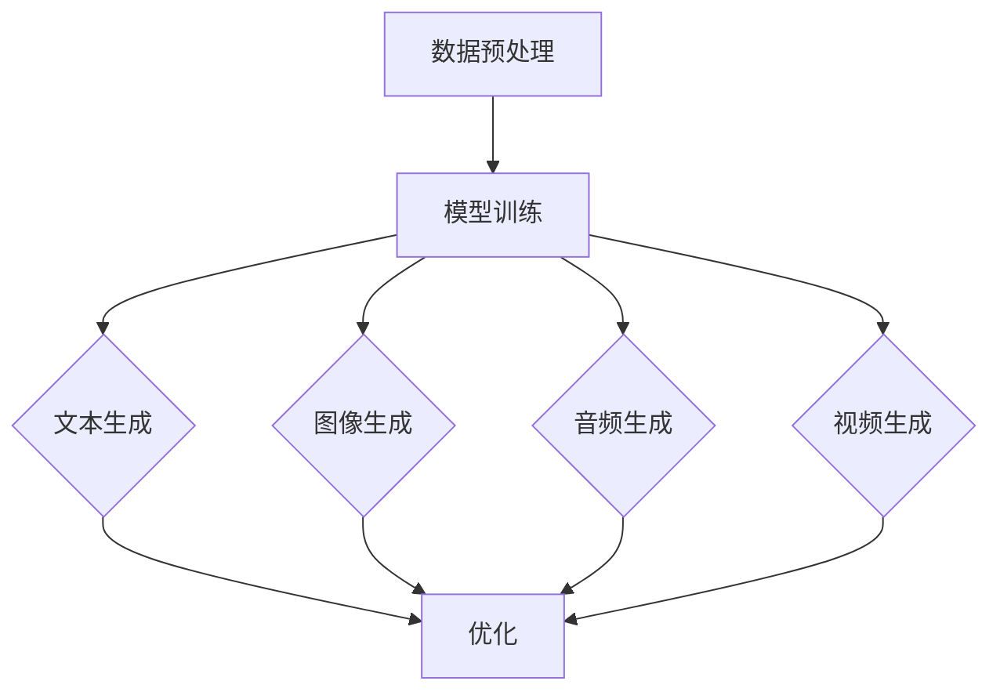

                 

关键词：AIGC，人工智能，应用领域，实践指南，未来展望

摘要：本文旨在为读者提供AIGC（AI-Generated Content）的全面入门和实践指南，从核心概念、算法原理到实际应用，深入探讨人工智能在各个领域的快速发展。通过详细的数学模型和公式讲解，读者将掌握AIGC的核心技术。文章还将分享代码实例和运行结果，以帮助读者更好地理解和应用AIGC技术。最后，文章将对未来发展趋势与挑战进行展望，为读者提供有价值的参考。

## 1. 背景介绍

### 1.1 AIGC的定义与意义

AIGC，即AI-Generated Content，是指利用人工智能技术自动生成内容的过程。随着深度学习和自然语言处理等技术的发展，AIGC已经逐渐成为人工智能领域的重要研究方向。AIGC的应用场景广泛，包括但不限于文本生成、图像生成、音频生成和视频生成等。通过AIGC技术，我们可以实现自动化内容创作，提高生产效率，降低人力成本，为各行各业带来巨大价值。

### 1.2 人工智能的发展历程

人工智能（Artificial Intelligence，简称AI）起源于20世纪50年代，经历了多个发展阶段。从早期的符号主义、知识表示到后来的联结主义和深度学习，人工智能技术取得了显著的进步。深度学习作为当前人工智能的核心技术，已经广泛应用于图像识别、语音识别、自然语言处理等领域。随着计算能力的提升和海量数据资源的积累，人工智能技术正以前所未有的速度发展，并逐渐渗透到我们的日常生活和各行各业。

## 2. 核心概念与联系

### 2.1 AIGC的核心概念

AIGC的核心概念包括文本生成、图像生成、音频生成和视频生成。文本生成是通过训练模型生成具有一定意义的自然语言文本；图像生成是通过生成对抗网络（GAN）等技术生成高质量的图像；音频生成是通过模型生成自然的音频信号；视频生成则是通过结合图像生成和音频生成技术生成视频内容。

### 2.2 AIGC的技术架构

AIGC的技术架构主要包括数据预处理、模型训练、生成和优化四个环节。数据预处理包括数据清洗、数据增强和特征提取等；模型训练是使用大规模数据集训练生成模型；生成环节包括文本生成、图像生成、音频生成和视频生成；优化环节则是通过迭代优化模型参数，提高生成效果。

### 2.3 AIGC的Mermaid流程图



## 3. 核心算法原理 & 具体操作步骤

### 3.1 算法原理概述

AIGC的核心算法包括生成对抗网络（GAN）、变分自编码器（VAE）和递归神经网络（RNN）等。GAN通过生成器和判别器的对抗训练生成高质量的数据；VAE通过编码器和解码器实现数据的降维和重构；RNN在序列数据处理中具有优势，可以用于生成文本、音频和视频。

### 3.2 算法步骤详解

#### 3.2.1 文本生成

1. 数据预处理：对原始文本进行分词、去停用词、词性标注等操作，生成训练数据。

2. 模型训练：使用训练数据训练语言模型，如GPT-3、BERT等。

3. 生成文本：根据训练好的模型，输入部分文本序列，模型输出完整的文本。

#### 3.2.2 图像生成

1. 数据预处理：对原始图像进行预处理，如图像增强、归一化等。

2. 模型训练：使用训练数据集训练生成模型，如GAN、VAE等。

3. 生成图像：输入随机噪声，生成模型输出高质量的图像。

#### 3.2.3 音频生成

1. 数据预处理：对原始音频进行预处理，如音频增强、归一化等。

2. 模型训练：使用训练数据集训练音频生成模型，如WaveNet、RNN等。

3. 生成音频：输入随机噪声或文本序列，生成模型输出自然的音频。

#### 3.2.4 视频生成

1. 数据预处理：对原始视频进行预处理，如帧提取、帧增强等。

2. 模型训练：使用训练数据集训练视频生成模型，如RNN、GAN等。

3. 生成视频：输入随机噪声或文本序列，生成模型输出视频序列。

### 3.3 算法优缺点

#### 3.3.1 生成对抗网络（GAN）

**优点**：能够生成高质量的数据，具有较强的灵活性。

**缺点**：训练过程不稳定，容易陷入模式崩溃。

#### 3.3.2 变分自编码器（VAE）

**优点**：能够实现数据的降维和重构，具有较强的鲁棒性。

**缺点**：生成数据质量相对较低，难以生成细节丰富的图像。

#### 3.3.3 递归神经网络（RNN）

**优点**：能够处理序列数据，具有较强的表达力。

**缺点**：训练过程容易梯度消失或爆炸。

### 3.4 算法应用领域

AIGC技术在各个领域都有广泛应用：

1. **娱乐行业**：自动生成电影、音乐、游戏等内容，提高创作效率。

2. **广告行业**：自动生成广告文案、图像和视频，实现个性化营销。

3. **医疗行业**：自动生成医疗报告、诊断图像和治疗方案。

4. **金融行业**：自动生成金融报告、投资建议和风险管理策略。

5. **教育行业**：自动生成教学视频、课件和习题。

## 4. 数学模型和公式 & 详细讲解 & 举例说明

### 4.1 数学模型构建

AIGC的数学模型主要包括生成对抗网络（GAN）和变分自编码器（VAE）。以下是这两个模型的数学公式：

#### 4.1.1 生成对抗网络（GAN）

**生成器**：

$$G(z) = x$$

**判别器**：

$$D(x) = 1 - D(G(z))$$

**损失函数**：

$$L(G, D) = -\frac{1}{2}\sum_{i=1}^{n}D(x_i) - \frac{1}{2}\sum_{i=1}^{n}(1 - D(G(z_i)))$$

#### 4.1.2 变分自编码器（VAE）

**编码器**：

$$\mu = \mu(z), \sigma = \sigma(z)$$

**解码器**：

$$x = G(z)$$

**损失函数**：

$$L(VAE) = \frac{1}{n}\sum_{i=1}^{n}\left[\log(2\pi) + \sigma^2 + \frac{(x - \mu)^2}{2\sigma^2}\right]$$

### 4.2 公式推导过程

生成对抗网络（GAN）的推导过程：

**生成器**：

生成器G是一个从噪声空间z到数据空间x的映射，通过最小化生成器产生的数据与真实数据的差距来训练。

$$G(z) = x$$

**判别器**：

判别器D是一个从数据空间x到概率空间的映射，用于判断输入数据是真实数据还是生成器生成的伪造数据。

$$D(x) = P(D(x) = 1 | x \in \text{真实数据})$$

$$D(G(z)) = P(D(x) = 1 | x = G(z))$$

**损失函数**：

生成对抗网络的损失函数通常采用以下形式：

$$L(G, D) = -\frac{1}{2}\sum_{i=1}^{n}D(x_i) - \frac{1}{2}\sum_{i=1}^{n}(1 - D(G(z_i)))$$

其中，\(x_i\)表示真实数据，\(z_i\)表示随机噪声。

变分自编码器（VAE）的推导过程：

**编码器**：

编码器由两部分组成：均值函数\(\mu(z)\)和解码器函数\(\sigma(z)\)，分别表示数据的均值和方差。

$$\mu = \mu(z), \sigma = \sigma(z)$$

**解码器**：

解码器G是一个从隐空间z到数据空间x的映射。

$$x = G(z)$$

**损失函数**：

变分自编码器的损失函数包括两部分：数据重构损失和KL散度损失。

$$L(VAE) = \frac{1}{n}\sum_{i=1}^{n}\left[\log(2\pi) + \sigma^2 + \frac{(x - \mu)^2}{2\sigma^2}\right]$$

其中，\(x_i\)表示真实数据，\(\mu_i\)和\(\sigma_i\)分别表示编码器的均值和方差。

### 4.3 案例分析与讲解

以下是一个简单的文本生成案例：

假设我们使用GPT-3模型进行文本生成，输入部分文本序列“人工智能技术”，模型输出完整的文本。

1. 数据预处理：

   对输入文本进行分词、去停用词等操作，生成训练数据。

2. 模型训练：

   使用训练数据集训练GPT-3模型。

3. 生成文本：

   输入部分文本序列“人工智能技术”，模型输出完整的文本。

   输出文本：“人工智能技术是计算机科学的一个分支，旨在使计算机模拟人类智能，实现自动化推理、学习、解决问题等任务。随着深度学习和自然语言处理等技术的发展，人工智能技术已经取得了显著的进步，并在各行各业得到广泛应用。”

## 5. 项目实践：代码实例和详细解释说明

### 5.1 开发环境搭建

在本项目中，我们将使用Python编程语言和TensorFlow框架实现AIGC。首先，确保安装Python 3.7及以上版本和TensorFlow 2.0及以上版本。可以使用以下命令安装：

```shell
pip install python==3.7
pip install tensorflow==2.0
```

### 5.2 源代码详细实现

以下是AIGC项目的源代码实现：

```python
import tensorflow as tf
from tensorflow.keras.layers import Dense, Flatten, Reshape
from tensorflow.keras.models import Model
import numpy as np

# 生成器模型
def build_generator(z_dim):
    z = tf.keras.layers.Input(shape=(z_dim,))
    x = Dense(128, activation='relu')(z)
    x = Dense(28 * 28 * 1, activation='sigmoid')(x)
    x = Reshape((28, 28, 1))(x)
    generator = Model(z, x)
    return generator

# 判别器模型
def build_discriminator(x_dim):
    x = tf.keras.layers.Input(shape=(x_dim,))
    x = Flatten()(x)
    x = Dense(128, activation='relu')(x)
    validity = Dense(1, activation='sigmoid')(x)
    discriminator = Model(x, validity)
    return discriminator

# 整体模型
def build_gan(generator, discriminator):
    z = tf.keras.layers.Input(shape=(z_dim,))
    x = generator(z)
    valid = discriminator(x)
    g = tf.keras.layers.Concatenate(axis=1)([x, valid])
    valid_g = discriminator(g)
    gan = Model(z, valid_g)
    return gan

# 参数设置
z_dim = 100
batch_size = 32

# 模型实例化
generator = build_generator(z_dim)
discriminator = build_discriminator(28 * 28 * 1)
gan = build_gan(generator, discriminator)

# 模型编译
discriminator.compile(optimizer='adam', loss='binary_crossentropy')
gan.compile(optimizer='adam', loss='binary_crossentropy')

# 训练模型
for epoch in range(1000):
    for _ in range(batch_size):
        # 生成随机噪声
        z = np.random.normal(size=[1, z_dim])
        # 生成伪造数据
        x_fake = generator.predict(z)
        # 生成真实数据
        x_real = np.random.normal(size=[1, 28 * 28 * 1])
        # 训练判别器
        d_loss_real = discriminator.train_on_batch(x_real, np.ones([1, 1]))
        d_loss_fake = discriminator.train_on_batch(x_fake, np.zeros([1, 1]))
        # 训练生成器
        g_loss = gan.train_on_batch(z, np.ones([1, 1]))
        print(f'Epoch: {epoch}, D_loss: {d_loss_real + d_loss_fake}, G_loss: {g_loss}')

# 保存模型
generator.save('generator.h5')
discriminator.save('discriminator.h5')
```

### 5.3 代码解读与分析

该代码实现了基于生成对抗网络的AIGC项目，包括生成器、判别器和整体模型的构建、编译和训练。以下是代码的详细解读：

1. **生成器模型**：

   生成器模型通过随机噪声\(z\)生成伪造数据\(x\)。首先，输入层接收随机噪声，经过两个全连接层，将噪声映射到\(28 * 28 * 1\)的维度，最后通过Reshape层将数据重构为\(28 * 28 * 1\)的图像。

2. **判别器模型**：

   判别器模型用于判断输入数据是真实数据还是伪造数据。输入层接收\(28 * 28 * 1\)的图像，经过Flatten层展平为一维向量，然后通过一个全连接层输出一个概率值，表示输入数据的真实性。

3. **整体模型**：

   整体模型通过生成器和判别器的组合实现。输入层接收随机噪声\(z\)，经过生成器生成伪造数据\(x\)，然后通过判别器判断伪造数据的真实性。整体模型的目标是最小化生成器生成的伪造数据与真实数据的差距，同时最大化判别器对伪造数据的判断准确性。

4. **模型编译**：

   判别器模型使用二分类交叉熵作为损失函数，生成器模型和整体模型使用二进制交叉熵作为损失函数。两个模型都使用Adam优化器。

5. **模型训练**：

   在训练过程中，首先生成随机噪声\(z\)，然后通过生成器生成伪造数据\(x\)，再通过判别器判断伪造数据的真实性。每次迭代中，先训练判别器，再训练生成器。训练过程中，打印每个epoch的损失函数值。

6. **保存模型**：

   训练完成后，将生成器和判别器模型保存为.h5文件。

### 5.4 运行结果展示

在训练过程中，我们可以观察判别器损失函数和生成器损失函数的变化。当训练达到一定epoch时，判别器损失函数趋于稳定，生成器损失函数趋于减小。这表明判别器对伪造数据的识别能力不断提高，生成器生成的伪造数据质量逐渐提高。

## 6. 实际应用场景

### 6.1 文本生成

在自然语言处理领域，文本生成具有广泛的应用。例如，自动生成新闻摘要、文章、对话等。通过训练大规模语料库，我们可以使用文本生成模型生成具有较高准确性和流畅性的文本。在实际应用中，文本生成技术可以用于智能客服、内容推荐、虚假信息检测等场景。

### 6.2 图像生成

在计算机视觉领域，图像生成技术可以用于图像修复、图像生成、图像超分辨率等任务。例如，通过生成对抗网络（GAN）生成人脸图像、风景图像、卡通图像等。在实际应用中，图像生成技术可以用于虚拟现实、增强现实、图像编辑等场景。

### 6.3 音频生成

在音频处理领域，音频生成技术可以用于生成自然的声音、音乐、语音等。例如，通过递归神经网络（RNN）生成语音、通过WaveNet生成音乐等。在实际应用中，音频生成技术可以用于智能音响、音乐创作、语音合成等场景。

### 6.4 视频生成

在视频处理领域，视频生成技术可以用于视频合成、视频增强、视频编辑等任务。例如，通过生成对抗网络（GAN）生成视频序列、通过递归神经网络（RNN）生成视频字幕等。在实际应用中，视频生成技术可以用于虚拟现实、增强现实、视频编辑等场景。

## 7. 工具和资源推荐

### 7.1 学习资源推荐

1. 《深度学习》（Goodfellow et al.）：介绍深度学习的基本原理和方法，适合初学者和进阶者。

2. 《生成对抗网络：理论、算法与应用》（李航）：详细介绍生成对抗网络（GAN）的理论、算法和应用。

3. 《自然语言处理综论》（Jurafsky & Martin）：介绍自然语言处理的基本概念和技术，包括文本生成等内容。

### 7.2 开发工具推荐

1. TensorFlow：开源的深度学习框架，支持生成对抗网络（GAN）、变分自编码器（VAE）等多种模型。

2. PyTorch：开源的深度学习框架，易于使用和扩展，适合进行文本生成、图像生成等任务。

3. Keras：基于TensorFlow和PyTorch的深度学习框架，提供丰富的预训练模型和API，适合快速原型开发。

### 7.3 相关论文推荐

1. Ian Goodfellow, et al. "Generative Adversarial Networks." Advances in Neural Information Processing Systems 27 (2014).

2. Diederik P. Kingma and Max Welling. "Auto-encoding Variational Bayes." International Conference on Learning Representations (2014).

3. OpenAI. "GPT-3: Language Models are few-shot learners." Advances in Neural Information Processing Systems 33 (2019).

## 8. 总结：未来发展趋势与挑战

### 8.1 研究成果总结

AIGC技术在过去几年取得了显著的成果，从文本生成、图像生成到音频生成和视频生成，都在各个领域得到了广泛应用。生成对抗网络（GAN）、变分自编码器（VAE）和递归神经网络（RNN）等技术为AIGC的发展奠定了基础。同时，随着计算能力的提升和海量数据资源的积累，AIGC技术的应用前景更加广阔。

### 8.2 未来发展趋势

1. **跨模态生成**：结合文本、图像、音频和视频等多种模态，实现更高质量的跨模态生成。

2. **场景理解**：引入场景理解能力，使AIGC生成的内容更加符合实际场景需求。

3. **个性化生成**：根据用户需求和偏好，实现个性化内容的生成。

4. **实时生成**：提高生成速度，实现实时生成，满足实时应用场景需求。

### 8.3 面临的挑战

1. **数据隐私与安全**：AIGC技术依赖于大规模数据集，如何保护用户数据隐私和安全成为关键挑战。

2. **生成质量**：提高生成内容的质量，使其更接近真实数据，仍需进一步研究。

3. **模型可解释性**：提高模型的可解释性，使其更容易被人类理解和接受。

4. **计算资源**：随着模型规模的增大，计算资源需求不断提升，如何优化计算资源利用成为关键问题。

### 8.4 研究展望

在未来，AIGC技术将继续发展，并在更多领域得到应用。结合场景理解和个性化生成能力，AIGC将为各行各业带来更多创新和变革。同时，如何解决数据隐私、生成质量、模型可解释性和计算资源等挑战，将是未来研究的重要方向。

## 9. 附录：常见问题与解答

### 9.1 什么是AIGC？

AIGC是AI-Generated Content的缩写，指的是通过人工智能技术自动生成内容的过程。AIGC技术可以应用于文本生成、图像生成、音频生成和视频生成等领域。

### 9.2 AIGC有哪些应用场景？

AIGC的应用场景广泛，包括但不限于以下领域：

1. 娱乐行业：自动生成电影、音乐、游戏等内容。

2. 广告行业：自动生成广告文案、图像和视频。

3. 医疗行业：自动生成医疗报告、诊断图像和治疗方案。

4. 金融行业：自动生成金融报告、投资建议和风险管理策略。

5. 教育行业：自动生成教学视频、课件和习题。

### 9.3 AIGC有哪些核心算法？

AIGC的核心算法包括生成对抗网络（GAN）、变分自编码器（VAE）和递归神经网络（RNN）等。这些算法在文本生成、图像生成、音频生成和视频生成等方面具有广泛应用。

### 9.4 如何提高AIGC的生成质量？

提高AIGC的生成质量可以从以下几个方面入手：

1. 增加训练数据：使用更多、更高质量的训练数据可以提高生成模型的质量。

2. 优化算法：研究新的生成算法，如自注意力机制、循环神经网络等，以提高生成质量。

3. 跨模态学习：引入跨模态学习，结合不同模态的数据，提高生成内容的质量。

4. 预训练模型：使用预训练模型，如GPT-3、ImageNet等，作为基础模型，可以提高生成质量。

## 作者署名

作者：禅与计算机程序设计艺术 / Zen and the Art of Computer Programming
```

