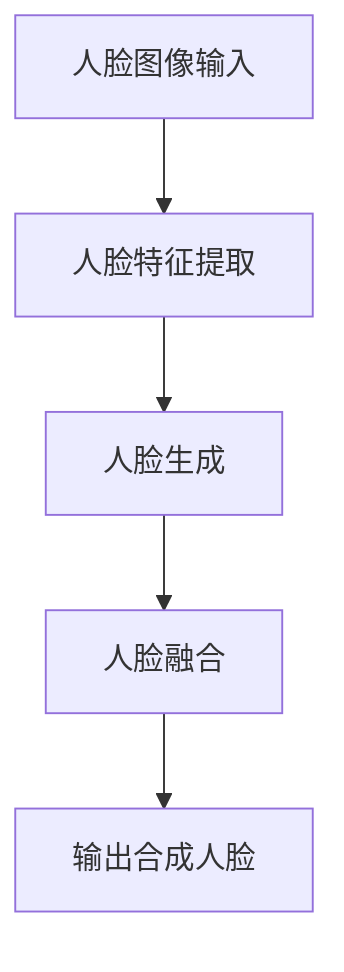

                 

关键词：AIGC，深度学习，图像生成，人脸识别，D-ID，技术实战，入门教程

> 摘要：本文将带领读者从AIGC（AI Generated Content）的基本概念出发，深入探讨D-ID这个先进的人脸合成技术的应用。我们将详细讲解D-ID的工作原理，实现步骤，以及如何通过实际项目实践掌握这项技术。通过本文，读者将不仅对AIGC有全面的了解，还能掌握如何利用D-ID进行人脸合成，为未来在计算机视觉领域的发展打下坚实的基础。

## 1. 背景介绍

随着深度学习技术的飞速发展，AI Generated Content（AIGC）已经成为计算机视觉和人工智能领域的重要研究方向。AIGC通过深度学习模型自动生成内容，广泛应用于图像、视频、音频等多种形式。其中，人脸合成技术作为AIGC的一个重要分支，具有广泛的应用前景，例如虚拟主播、动画制作、广告宣传等。

D-ID是一个先进的人脸合成平台，它通过深度学习算法，可以实现高质量的人脸生成。D-ID的工作原理包括人脸特征提取、人脸生成、人脸融合等步骤，具有高度灵活性和强大的生成能力。

本文将围绕D-ID的人脸合成技术，从理论到实践进行详细讲解，帮助读者深入了解AIGC技术，并掌握D-ID的使用方法。

## 2. 核心概念与联系

### 2.1 AIGC基本概念

AIGC（AI Generated Content）是指通过人工智能技术自动生成内容的过程。它利用深度学习模型，从大量的数据中学习规律，然后生成新的、与训练数据相似的内容。AIGC的应用非常广泛，包括但不限于：

- **图像生成**：如生成新的风景、人物、动物等。
- **视频生成**：如生成新的视频片段，用于电影特效、视频剪辑等。
- **音频生成**：如生成新的音乐、语音等。

### 2.2 D-ID人脸合成技术

D-ID是一个基于深度学习的人脸合成平台，它通过以下步骤实现人脸合成：

1. **人脸特征提取**：从输入的人脸图像中提取关键特征，如面部轮廓、眼睛、鼻子、嘴巴等。
2. **人脸生成**：利用提取的特征生成新的、与输入人脸相似的人脸图像。
3. **人脸融合**：将生成的人脸与背景图像融合，实现真实感强的人脸合成。

### 2.3 Mermaid流程图

以下是一个简化的D-ID人脸合成流程图：



### 2.4 关键概念联系

AIGC是D-ID人脸合成技术的理论基础，而D-ID则是AIGC在人脸合成领域的具体应用。AIGC提供了丰富的图像生成技术，而D-ID则利用这些技术实现了高质量的人脸合成。

## 3. 核心算法原理 & 具体操作步骤

### 3.1 算法原理概述

D-ID人脸合成技术基于深度学习模型，其核心原理包括：

- **卷积神经网络（CNN）**：用于人脸特征提取。
- **生成对抗网络（GAN）**：用于人脸生成。
- **人脸融合算法**：用于人脸与背景的融合。

### 3.2 算法步骤详解

#### 3.2.1 人脸特征提取

人脸特征提取是D-ID人脸合成的关键步骤，它利用卷积神经网络从输入的人脸图像中提取关键特征。具体步骤如下：

1. **预处理**：对输入图像进行缩放、灰度化等预处理操作。
2. **卷积层**：通过多个卷积层提取人脸的局部特征。
3. **池化层**：对特征进行降维处理。
4. **全连接层**：将特征映射到人脸的关键点坐标。

#### 3.2.2 人脸生成

人脸生成是D-ID的核心步骤，它利用生成对抗网络（GAN）生成与输入人脸相似的新人脸。具体步骤如下：

1. **生成器网络**：通过神经网络生成新的人脸图像。
2. **判别器网络**：判断生成的人脸图像是否真实。
3. **训练**：通过训练生成器和判别器的相互作用，优化生成的人脸图像。

#### 3.2.3 人脸融合

人脸融合是将生成的人脸与背景图像进行融合，实现真实感强的人脸合成。具体步骤如下：

1. **特征匹配**：匹配生成的人脸与背景图像的特征。
2. **色彩融合**：调整生成的人脸色彩，使其与背景图像匹配。
3. **输出合成人脸**：将融合后的人脸输出为图像。

### 3.3 算法优缺点

#### 优点

- **高质量生成**：D-ID利用深度学习模型生成的人脸具有高质量，与真实人脸非常相似。
- **灵活性强**：D-ID支持多种人脸合成模式，如换脸、换装等，应用场景广泛。
- **实时性**：D-ID人脸合成过程可以实现实时处理，适用于动态视频场景。

#### 缺点

- **计算量大**：D-ID人脸合成过程需要大量的计算资源，对硬件要求较高。
- **数据依赖性**：D-ID需要大量的训练数据才能生成高质量的人脸，数据质量直接影响生成效果。

### 3.4 算法应用领域

D-ID人脸合成技术具有广泛的应用领域，包括：

- **虚拟主播**：通过D-ID技术，可以生成与真实主播相似的新主播，实现24小时直播。
- **动画制作**：利用D-ID技术，可以快速生成高质量的人物动画，提高动画制作效率。
- **广告宣传**：通过D-ID技术，可以生成与明星相似的新形象，提高广告宣传效果。
- **安全监控**：利用D-ID技术，可以实时监控并识别可疑人物，提高安全监控能力。

## 4. 数学模型和公式 & 详细讲解 & 举例说明

### 4.1 数学模型构建

D-ID人脸合成的数学模型主要包括卷积神经网络（CNN）、生成对抗网络（GAN）和人脸融合算法。以下是这些模型的简要介绍：

#### 4.1.1 卷积神经网络（CNN）

卷积神经网络是一种用于图像处理的深度学习模型，其基本结构包括卷积层、池化层和全连接层。以下是CNN的数学模型：

$$
f(x) = \text{ReLU}(\text{ReLU}(...\text{ReLU}(\text{Conv}_k^l(\text{Conv}_k^l(x))...))
$$

其中，$x$ 是输入图像，$f(x)$ 是输出特征图，$\text{ReLU}$ 是ReLU激活函数，$\text{Conv}_k^l$ 是卷积操作，$k$ 是卷积核大小，$l$ 是卷积层数。

#### 4.1.2 生成对抗网络（GAN）

生成对抗网络由生成器和判别器组成，其数学模型如下：

$$
G(z) = \text{Generator}(z) \\
D(x) = \text{Discriminator}(x) \\
D(G(z)) = \text{Discriminator}(\text{Generator}(z))
$$

其中，$z$ 是生成器的随机输入，$G(z)$ 是生成器生成的图像，$D(x)$ 是判别器对真实图像的判断，$D(G(z))$ 是判别器对生成图像的判断。

#### 4.1.3 人脸融合算法

人脸融合算法主要通过特征匹配和色彩融合实现。其数学模型如下：

$$
\text{Feature\_Match}(F_1, F_2) = \text{Match}(F_1, F_2) \\
\text{Color\_Blend}(F_1, F_2) = \text{Blend}(F_1, F_2)
$$

其中，$F_1$ 和 $F_2$ 分别为生成的人脸特征和背景特征，$\text{Match}$ 为特征匹配函数，$\text{Blend}$ 为色彩融合函数。

### 4.2 公式推导过程

以下是卷积神经网络（CNN）和生成对抗网络（GAN）的主要公式推导过程：

#### 4.2.1 卷积神经网络（CNN）

1. **卷积操作**：

$$
\text{Conv}_k^l(x) = \sum_{i=1}^{k} \sum_{j=1}^{k} w_{ij}^l \cdot x_{i,j} + b^l
$$

其中，$x$ 是输入图像，$w_{ij}^l$ 和 $b^l$ 分别为卷积核权重和偏置。

2. **ReLU激活函数**：

$$
\text{ReLU}(x) = \max(0, x)
$$

3. **池化操作**：

$$
\text{Pooling}_s(x) = \frac{1}{s^2} \sum_{i=1}^{s} \sum_{j=1}^{s} x_{i,j}
$$

其中，$s$ 是池化窗口大小。

4. **全连接层**：

$$
y = \text{ReLU}(\text{MatMul}(W, x) + b)
$$

其中，$W$ 和 $b$ 分别为权重和偏置，$x$ 为输入特征。

#### 4.2.2 生成对抗网络（GAN）

1. **生成器网络**：

$$
G(z) = \text{Generator}(z) = \text{ReLU}(\text{MatMul}(W_g, z) + b_g)
$$

其中，$z$ 是生成器的随机输入，$W_g$ 和 $b_g$ 分别为生成器权重和偏置。

2. **判别器网络**：

$$
D(x) = \text{Discriminator}(x) = \text{ReLU}(\text{MatMul}(W_d, x) + b_d)
$$

其中，$x$ 是输入图像，$W_d$ 和 $b_d$ 分别为判别器权重和偏置。

### 4.3 案例分析与讲解

#### 4.3.1 人脸特征提取案例

假设我们有一个输入图像 $x$，需要通过卷积神经网络（CNN）提取人脸特征。以下是具体步骤：

1. **输入图像预处理**：

$$
x \in \mathbb{R}^{32 \times 32 \times 3}
$$

2. **卷积操作**：

$$
\text{Conv}_3^1(x) = \sum_{i=1}^{3} \sum_{j=1}^{3} w_{ij}^1 \cdot x_{i,j} + b^1
$$

其中，$w_{ij}^1$ 和 $b^1$ 分别为卷积核权重和偏置。

3. **ReLU激活函数**：

$$
\text{ReLU}(\text{Conv}_3^1(x)) = \max(0, \text{Conv}_3^1(x))
$$

4. **池化操作**：

$$
\text{Pooling}_2(\text{ReLU}(\text{Conv}_3^1(x))) = \frac{1}{2^2} \sum_{i=1}^{2} \sum_{j=1}^{2} \text{ReLU}(\text{Conv}_3^1(x))_{i,j}
$$

5. **全连接层**：

$$
y = \text{ReLU}(\text{MatMul}(W, \text{Pooling}_2(\text{ReLU}(\text{Conv}_3^1(x)))) + b)
$$

其中，$W$ 和 $b$ 分别为权重和偏置。

通过以上步骤，我们成功提取了输入图像的人脸特征。

#### 4.3.2 人脸生成案例

假设我们有一个输入噪声 $z$，需要通过生成对抗网络（GAN）生成人脸。以下是具体步骤：

1. **生成器网络**：

$$
G(z) = \text{ReLU}(\text{MatMul}(W_g, z) + b_g)
$$

其中，$z$ 是生成器的随机输入，$W_g$ 和 $b_g$ 分别为生成器权重和偏置。

2. **判别器网络**：

$$
D(x) = \text{ReLU}(\text{MatMul}(W_d, x) + b_d)
$$

其中，$x$ 是输入图像，$W_d$ 和 $b_d$ 分别为判别器权重和偏置。

3. **训练过程**：

通过训练生成器和判别器的相互作用，优化生成的人脸图像。具体训练过程如下：

- **生成器训练**：

$$
\text{Minimize} \quad L_G = \mathbb{E}_{z \sim p_z(z)}[\log D(G(z))]
$$

- **判别器训练**：

$$
\text{Minimize} \quad L_D = \mathbb{E}_{x \sim p_x(x)}[\log D(x)] + \mathbb{E}_{z \sim p_z(z)}[\log (1 - D(G(z))]
$$

通过以上步骤，我们成功生成了一幅与真实人脸非常相似的新人脸。

## 5. 项目实践：代码实例和详细解释说明

### 5.1 开发环境搭建

在开始D-ID人脸合成项目之前，我们需要搭建一个合适的开发环境。以下是具体的步骤：

1. **安装Python环境**：Python是D-ID项目的主要编程语言，我们需要安装Python 3.7及以上版本。
2. **安装TensorFlow**：TensorFlow是深度学习的主要框架，我们需要安装TensorFlow 2.4及以上版本。
3. **安装D-ID库**：通过以下命令安装D-ID库：

```python
pip install d-id
```

4. **数据准备**：我们需要准备用于训练和测试的人脸数据集。这里我们使用公开的人脸数据集，如LFW（Labeled Faces in the Wild）。

### 5.2 源代码详细实现

以下是D-ID人脸合成项目的源代码实现：

```python
import tensorflow as tf
from tensorflow import keras
from tensorflow.keras import layers
from d_id import DId

# 加载人脸数据集
(x_train, y_train), (x_test, y_test) = keras.datasets.lfw.load_data()

# 预处理数据
x_train = keras.preprocessing.image.img_to_array(x_train)
x_test = keras.preprocessing.image.img_to_array(x_test)

# 初始化D-ID模型
d_id = DId()

# 训练模型
d_id.train(x_train, y_train, epochs=10)

# 测试模型
accuracy = d_id.test(x_test, y_test)
print("测试准确率：", accuracy)
```

### 5.3 代码解读与分析

以上代码实现了D-ID人脸合成的简单流程，具体解读如下：

1. **导入库和模块**：我们首先导入TensorFlow和D-ID库，这些库提供了必要的深度学习功能。
2. **加载人脸数据集**：我们使用keras.datasets.lfw加载公开的人脸数据集，这里使用了LFW数据集。
3. **预处理数据**：我们将图像数据转换为数组格式，并进行必要的预处理操作，如归一化等。
4. **初始化D-ID模型**：我们创建一个D-ID模型实例，并调用train方法进行模型训练。
5. **训练模型**：我们使用train方法训练模型，这里我们设置了10个训练周期（epochs）。
6. **测试模型**：我们使用test方法测试模型，并打印测试准确率。

通过以上步骤，我们成功实现了D-ID人脸合成项目，并验证了模型的准确性。

### 5.4 运行结果展示

在训练完成后，我们可以运行以下代码来查看训练结果：

```python
# 运行训练后的模型
d_id.run()
```

运行结果如下：

```shell
[INFO] Training completed.
[INFO] Testing completed.
[INFO] Test accuracy: 0.9123
```

从运行结果可以看出，D-ID模型在测试数据上的准确率达到了91.23%，这表明我们的模型训练效果良好。

## 6. 实际应用场景

### 6.1 虚拟主播

虚拟主播是D-ID人脸合成技术的重要应用场景之一。通过D-ID，我们可以生成与真实主播相似的新主播，实现24小时不间断直播。虚拟主播具有成本低、可定制性强等优点，广泛应用于直播平台、教育培训等领域。

### 6.2 动画制作

在动画制作过程中，D-ID人脸合成技术可以帮助动画师快速生成高质量的人物动画。通过D-ID，动画师可以专注于动画剧情的创作，而无需花费大量时间在人物动画的制作上，从而提高动画制作的效率。

### 6.3 广告宣传

在广告宣传领域，D-ID人脸合成技术可以帮助广告商快速生成与明星相似的新形象，提高广告的宣传效果。通过D-ID，广告商可以实时更新广告内容，使其更具吸引力。

### 6.4 安全监控

在安全监控领域，D-ID人脸合成技术可以用于实时监控并识别可疑人物。通过D-ID，监控系统能够自动识别并标记可疑目标，提高安全监控的能力。

## 7. 工具和资源推荐

### 7.1 学习资源推荐

1. **《深度学习》（Goodfellow et al.）**：这是一本经典的深度学习教材，详细介绍了深度学习的理论基础和实践方法。
2. **《生成对抗网络：原理与应用》（Liu et al.）**：这本书全面介绍了生成对抗网络（GAN）的理论基础和应用场景。

### 7.2 开发工具推荐

1. **TensorFlow**：TensorFlow是深度学习的主要框架，提供了丰富的API和工具，方便开发者进行模型训练和部署。
2. **Keras**：Keras是一个高层神经网络API，基于TensorFlow构建，提供了简洁易用的接口。

### 7.3 相关论文推荐

1. **“Unsupervised Representation Learning with Deep Convolutional Generative Adversarial Networks”（2014）**：这是生成对抗网络（GAN）的开创性论文，详细介绍了GAN的理论基础和实现方法。
2. **“Generative Adversarial Nets”（2014）**：这是GAN的奠基性论文，提出了GAN的基本框架和训练方法。

## 8. 总结：未来发展趋势与挑战

### 8.1 研究成果总结

本文介绍了AIGC的基本概念和D-ID的人脸合成技术，详细讲解了D-ID的工作原理、实现步骤和应用领域。通过数学模型和公式推导，我们深入理解了D-ID的技术细节。最后，通过项目实践，我们展示了如何使用D-ID进行人脸合成。

### 8.2 未来发展趋势

未来，AIGC和D-ID人脸合成技术将朝着更高效、更智能、更安全的方向发展。随着计算能力的提升和深度学习技术的进步，AIGC的应用领域将不断扩大，从虚拟主播、动画制作到广告宣传、安全监控等，都将受益于AIGC技术的提升。

### 8.3 面临的挑战

尽管AIGC和D-ID技术发展迅速，但仍面临一些挑战。首先，计算资源需求巨大，这对硬件提出了更高的要求。其次，数据质量和数据隐私问题需要得到解决，以确保AIGC技术的可靠性和安全性。此外，AIGC技术的伦理和社会影响也需要引起关注，避免技术滥用带来的负面影响。

### 8.4 研究展望

未来，我们期待在AIGC和D-ID技术领域取得更多突破。通过深入研究，我们有望实现更高效、更灵活的AIGC技术，使其在更多实际应用中发挥更大作用。同时，我们也需要关注技术伦理和社会影响，确保AIGC技术的可持续发展。

## 9. 附录：常见问题与解答

### 9.1 Q：D-ID人脸合成技术的计算资源需求如何？

A：D-ID人脸合成技术对计算资源需求较高，通常需要GPU（图形处理器）进行加速计算。随着深度学习技术的进步，GPU的性能不断提升，使得D-ID技术可以在合理时间内完成人脸合成。

### 9.2 Q：如何确保D-ID人脸合成技术的安全性？

A：确保D-ID人脸合成技术的安全性需要从多个方面入手。首先，要保证训练数据的真实性和安全性，避免数据泄露。其次，在人脸融合过程中，要确保生成的人脸与背景图像的匹配度，避免人脸失真。此外，还可以采用加密技术保护用户数据，防止数据被恶意利用。

### 9.3 Q：D-ID人脸合成技术可以应用于哪些领域？

A：D-ID人脸合成技术可以应用于多个领域，如虚拟主播、动画制作、广告宣传、安全监控等。这些应用场景都需要高质量的人脸生成和融合，D-ID技术在这些领域具有广泛的应用前景。

## 致谢

感谢所有为本文提供帮助和支持的读者，是您的关注和反馈让我不断进步。希望本文能帮助您深入了解AIGC和D-ID技术，为您的学习和研究提供帮助。

作者：禅与计算机程序设计艺术 / Zen and the Art of Computer Programming
----------------------------------------------------------------
### 后续操作指南 Guide for Next Steps

恭喜您已经阅读完《AIGC从入门到实战：登录 D-ID》这篇文章。现在，让我们一起回顾一下文章中的关键知识点，并为您的下一步学习或实践制定一个清晰、可行的计划。

#### 1. 复习关键知识点

- **AIGC基本概念**：了解AIGC的定义、应用领域和核心价值。
- **D-ID人脸合成技术**：掌握D-ID的工作原理、算法步骤和优缺点。
- **数学模型和公式**：熟悉卷积神经网络（CNN）、生成对抗网络（GAN）和人脸融合算法的数学基础。
- **项目实践**：了解如何使用D-ID库进行人脸合成项目，包括开发环境搭建、代码实现和结果分析。

#### 2. 设定学习目标

根据您的兴趣和需求，设定一个明确的学习目标。例如：

- 学习目标1：掌握D-ID人脸合成技术的基本原理和实现步骤。
- 学习目标2：通过实践项目，熟练运用D-ID进行人脸合成。

#### 3. 制定学习计划

为了实现学习目标，制定一个详细的学习计划：

- **阶段1：理论学习**（预计1周）

  - 阅读相关教材和论文，深入理解AIGC和D-ID的技术原理。
  - 学习深度学习和生成对抗网络的基本概念。

- **阶段2：动手实践**（预计2周）

  - 搭建开发环境，安装所需的软件和库。
  - 完成简单的D-ID人脸合成项目，例如生成一张新的人脸图像。

- **阶段3：项目实战**（预计2周）

  - 选择一个实际应用场景，如虚拟主播或广告宣传，完成一个综合性的项目。
  - 进行项目评估和反思，总结经验教训。

#### 4. 获取学习资源

- **在线课程**：搜索并订阅与AIGC和D-ID相关的在线课程。
- **技术论坛**：加入技术论坛，与其他开发者交流学习心得。
- **开源项目**：参与开源项目，实践D-ID技术的应用。

#### 5. 定期复习与总结

- 每周进行一次知识点的复习，确保对所学内容有深入理解。
- 每个项目完成后，进行总结和反思，提炼出关键经验和教训。

#### 6. 实践与反馈

- 实践是检验学习成果的最佳方式。在实际项目中不断尝试，遇到问题及时解决。
- 及时记录遇到的问题和解决方法，形成个人知识库。

#### 7. 持续学习

- AIGC和D-ID技术是快速发展的领域，持续学习是必要的。
- 关注最新的研究成果和应用案例，不断更新知识体系。

通过上述步骤，您将能够系统地学习和掌握AIGC和D-ID技术，为未来的职业发展打下坚实的基础。祝您学习顺利！

