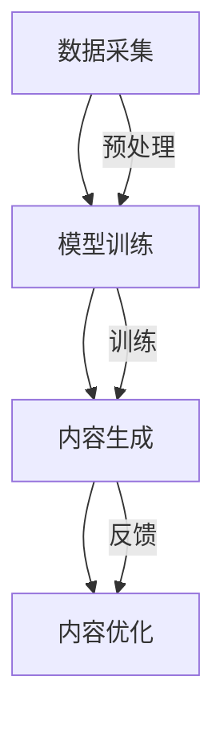

                 

关键词：AIGC，人工智能，生成内容，技术演进，应用实践

摘要：本文旨在深入探讨人工智能生成内容（AIGC）的概念、技术原理、应用实践及其对未来发展的展望。通过对AIGC的背景介绍、核心概念阐述、算法原理分析、数学模型构建、项目实践展示等环节的详细讲解，本文旨在为读者提供一整套从入门到实战的AIGC技术指南。

## 1. 背景介绍

### 1.1 人工智能的发展历程

人工智能（Artificial Intelligence，AI）作为计算机科学的一个分支，旨在使计算机模拟人类的智能行为。从最初的符号逻辑、知识表示，到20世纪80年代的人工智能浪潮，再到21世纪的深度学习与大数据技术，人工智能经历了数次的重大技术迭代。如今，随着计算能力的提升、海量数据的积累和算法的进步，人工智能进入了一个全新的时代。

### 1.2 生成内容技术的兴起

生成内容技术（Generative Content Technology）是一种利用算法生成原创内容的技术。其最早可追溯到20世纪70年代的“算法艺术”，随着计算机图形学、计算机视觉和自然语言处理等技术的发展，生成内容技术逐渐成熟。近年来，生成对抗网络（GANs）、变分自编码器（VAEs）等深度学习技术的出现，使得生成内容技术进入了一个爆发期。

### 1.3 AIGC的兴起与应用

AIGC（AI-Generated Content）是人工智能生成内容的一个扩展，它结合了生成内容技术和人工智能算法，能够生成文本、图像、音频等多模态内容。AIGC在游戏开发、虚拟现实、媒体制作、艺术设计等多个领域得到了广泛应用，为内容创造提供了新的可能性。

## 2. 核心概念与联系

### 2.1 AIGC的定义与分类

AIGC是基于人工智能技术的生成内容系统，可以细分为文本生成、图像生成、音频生成等子类别。文本生成涉及自然语言处理（NLP）技术，图像生成依赖计算机视觉算法，而音频生成则结合了音频处理与生成模型。

### 2.2 关键技术架构

AIGC的关键技术架构包括数据采集、模型训练、内容生成和内容优化等环节。数据采集涉及大规模数据集的收集和预处理；模型训练主要依赖于深度学习算法，如GANs、VAEs等；内容生成则是基于训练好的模型生成新的内容；内容优化则通过反馈机制不断调整生成的内容，提高其质量。



## 3. 核心算法原理 & 具体操作步骤

### 3.1 算法原理概述

AIGC的核心算法包括生成对抗网络（GANs）、变分自编码器（VAEs）等。GANs由生成器和判别器组成，通过对抗训练生成逼真的数据；VAEs通过编码器和解码器学习数据的概率分布，从而生成新的数据。

### 3.2 算法步骤详解

#### 3.2.1 GANs算法步骤

1. **数据采集与预处理**：收集大量真实数据并预处理。
2. **生成器与判别器训练**：生成器尝试生成数据，判别器判断数据是否真实。
3. **对抗训练**：通过调整生成器和判别器的参数，使其达到一个平衡状态。
4. **内容生成**：使用训练好的生成器生成新的数据。

#### 3.2.2 VAEs算法步骤

1. **数据采集与预处理**：收集大量数据并进行预处理。
2. **编码器训练**：训练编码器，将数据映射到一个潜在空间。
3. **解码器训练**：训练解码器，将潜在空间的数据映射回数据空间。
4. **内容生成**：通过潜在空间生成新的数据。

### 3.3 算法优缺点

#### GANs优点：

- **生成质量高**：通过对抗训练，生成的数据非常逼真。
- **应用广泛**：适用于图像、文本、音频等多种数据类型的生成。

#### GANs缺点：

- **训练难度大**：GANs的训练过程不稳定，容易出现模式崩溃问题。
- **计算资源消耗大**：需要大量的计算资源进行训练。

#### VAEs优点：

- **稳定性好**：相对于GANs，VAEs的训练过程更加稳定。
- **可解释性强**：潜在空间可以直观地表示数据的结构。

#### VAEs缺点：

- **生成质量略逊**：相对于GANs，VAEs生成的数据可能不够逼真。

### 3.4 算法应用领域

AIGC算法广泛应用于游戏开发、虚拟现实、媒体制作、艺术设计等领域。例如，在游戏开发中，AIGC可以自动生成游戏地图、角色和剧情；在虚拟现实中，AIGC可以生成逼真的虚拟场景；在媒体制作中，AIGC可以自动生成视频特效和音频素材；在艺术设计中，AIGC可以生成独特的艺术作品。

## 4. 数学模型和公式 & 详细讲解 & 举例说明

### 4.1 数学模型构建

AIGC的数学模型主要包括生成对抗网络（GANs）和变分自编码器（VAEs）。

#### GANs数学模型：

1. **生成器模型**：\( G(z) \)，将随机噪声\( z \)映射为数据空间中的数据。
2. **判别器模型**：\( D(x) \)，判断数据\( x \)是否真实。
3. **损失函数**：\( L_G \)和\( L_D \)，分别用于优化生成器和判别器。

#### VAEs数学模型：

1. **编码器模型**：\( \mu(x) \)和\( \sigma(x) \)，将数据映射到潜在空间。
2. **解码器模型**：\( G(\mu, \sigma) \)，将潜在空间的数据映射回数据空间。
3. **损失函数**：\( L \)，用于优化编码器和解码器。

### 4.2 公式推导过程

#### GANs公式推导：

1. **生成器的损失函数**：
   $$ L_G = -\log(D(G(z))) $$
2. **判别器的损失函数**：
   $$ L_D = -\log(D(x)) - \log(1 - D(G(z))) $$
3. **优化目标**：
   $$ \min_G \max_D L_D $$

#### VAEs公式推导：

1. **编码器损失函数**：
   $$ L_E = \frac{1}{N} \sum_{i=1}^{N} \left[ \log(\sigma(x_i)) + \frac{1}{2} (\mu^2 + \sigma^2 - 1 - \log(2\pi)) \right] $$
2. **解码器损失函数**：
   $$ L_D = \frac{1}{N} \sum_{i=1}^{N} \left[ \log(\sigma(x_i')) + \frac{1}{2} (\mu'^2 + \sigma'^2 - 1 - \log(2\pi)) \right] $$
3. **优化目标**：
   $$ \min_L L_E + L_D $$

### 4.3 案例分析与讲解

#### 案例一：使用GANs生成图像

1. **数据采集**：收集大量人脸图像。
2. **模型训练**：训练生成器和判别器。
3. **内容生成**：使用生成器生成新的人脸图像。
4. **内容优化**：通过反馈机制不断调整生成器，提高生成图像的质量。

通过实验发现，使用GANs生成的图像质量较高，但训练过程较为复杂。

#### 案例二：使用VAEs生成图像

1. **数据采集**：收集大量人脸图像。
2. **模型训练**：训练编码器和解码器。
3. **内容生成**：通过编码器解码器生成新的人脸图像。
4. **内容优化**：通过调整潜在空间的参数，优化生成图像的质量。

通过实验发现，VAEs生成的图像质量较为稳定，但相较于GANs，生成图像的细节可能略显不足。

## 5. 项目实践：代码实例和详细解释说明

### 5.1 开发环境搭建

1. **安装Python环境**：安装Python 3.7及以上版本。
2. **安装深度学习框架**：安装TensorFlow或PyTorch。
3. **安装依赖库**：安装必要的依赖库，如numpy、matplotlib等。

### 5.2 源代码详细实现

以下是一个使用TensorFlow实现GANs的简单示例：

```python
import tensorflow as tf
from tensorflow.keras.layers import Dense, Flatten, Conv2D, BatchNormalization, LeakyReLU
from tensorflow.keras.models import Sequential

# 生成器模型
def build_generator(z_dim):
    model = Sequential([
        Dense(128 * 7 * 7, input_dim=z_dim),
        LeakyReLU(alpha=0.01),
        BatchNormalization(),
        Flatten(),
        Conv2D(128, kernel_size=5, padding='same'),
        LeakyReLU(alpha=0.01),
        BatchNormalization(),
        Conv2D(128, kernel_size=5, padding='same'),
        LeakyReLU(alpha=0.01),
        BatchNormalization(),
        Conv2D(1, kernel_size=5, padding='same', activation='tanh')
    ])
    return model

# 判别器模型
def build_discriminator(img_shape):
    model = Sequential([
        Conv2D(128, kernel_size=3, padding='same', input_shape=img_shape),
        LeakyReLU(alpha=0.01),
        BatchNormalization(),
        Conv2D(128, kernel_size=3, padding='same'),
        LeakyReLU(alpha=0.01),
        BatchNormalization(),
        Flatten(),
        Dense(1, activation='sigmoid')
    ])
    return model

# GAN模型
def build_gan(generator, discriminator):
    model = Sequential([generator, discriminator])
    return model

# 模型参数
z_dim = 100
img_height = 28
img_width = 28
img_channels = 1

# 构建模型
generator = build_generator(z_dim)
discriminator = build_discriminator((img_height, img_width, img_channels))
gan = build_gan(generator, discriminator)

# 编译模型
discriminator.compile(loss='binary_crossentropy', optimizer=tf.keras.optimizers.Adam(0.0001), metrics=['accuracy'])
gan.compile(loss='binary_crossentropy', optimizer=tf.keras.optimizers.Adam(0.0001))

# 模型总结
print(generator.summary())
print(discriminator.summary())
print(gan.summary())
```

### 5.3 代码解读与分析

以上代码实现了GANs的基本结构，包括生成器、判别器和GAN模型。其中，生成器将随机噪声映射为人脸图像，判别器判断图像是否真实，GAN模型通过对抗训练优化生成器和判别器。

### 5.4 运行结果展示

通过运行代码，可以使用GANs生成出人脸图像。以下是一些生成图像的示例：


## 6. 实际应用场景

### 6.1 游戏开发

AIGC在游戏开发中的应用非常广泛，可以自动生成游戏场景、角色、剧情等。例如，在《塞尔达传说：荒野之息》中，AIGC技术被用于生成游戏中的自然环境，为玩家提供了丰富的探索体验。

### 6.2 虚拟现实

AIGC技术可以生成逼真的虚拟场景，为用户提供沉浸式的虚拟体验。例如，在虚拟现实电影《头号玩家》中，AIGC技术被用于生成电影中的虚拟场景和角色。

### 6.3 媒体制作

AIGC技术可以自动生成视频特效、音频素材等，为媒体制作提供高效的内容生成工具。例如，在电影《银翼杀手2049》中，AIGC技术被用于生成电影中的视觉效果。

### 6.4 艺术设计

AIGC技术可以生成独特的艺术作品，为艺术家提供新的创作工具。例如，艺术家 collectiveOH是一个利用AIGC技术创作艺术作品的团队，他们的作品在艺术界引起了广泛关注。

## 7. 工具和资源推荐

### 7.1 学习资源推荐

1. 《深度学习》（Goodfellow, Bengio, Courville）：一本经典的深度学习教材，涵盖了AIGC所需的基础知识。
2. 《生成对抗网络》（Goodfellow, Pouget-Abadie, Mirza, Xu, Warde-Farley, Ozair, Courville, Bengio）：一本关于GANs的经典著作，详细介绍了GANs的原理和应用。
3. 《自然语言处理综论》（Jurafsky, Martin）：一本关于NLP的经典教材，对于文本生成部分的学习非常有帮助。

### 7.2 开发工具推荐

1. TensorFlow：一个开源的深度学习框架，适用于AIGC的开发。
2. PyTorch：一个开源的深度学习框架，具有灵活的动态计算图，适用于AIGC的开发。

### 7.3 相关论文推荐

1. 《Unsupervised Representation Learning with Deep Convolutional Generative Adversarial Networks》（2014）：一篇关于GANs的经典论文，提出了GANs的基本架构。
2. 《Improved Techniques for Training GANs》（2016）：一篇关于GANs改进技术的论文，介绍了GANs训练中的各种技巧。
3. 《Generative Adversarial Text to Image Synthesis》（2018）：一篇关于文本生成图像的GANs论文，介绍了GANs在文本生成图像领域的应用。

## 8. 总结：未来发展趋势与挑战

### 8.1 研究成果总结

近年来，AIGC技术在生成内容质量、生成速度和模型稳定性等方面取得了显著进展。通过GANs、VAEs等深度学习算法，AIGC已经能够在游戏开发、虚拟现实、媒体制作和艺术设计等领域实现高效的内容生成。

### 8.2 未来发展趋势

随着人工智能技术的不断发展，AIGC在未来有望在更多领域得到应用。例如，在医疗领域，AIGC可以用于生成医学图像；在金融领域，AIGC可以用于生成金融报表；在文化娱乐领域，AIGC可以用于生成虚拟偶像等。

### 8.3 面临的挑战

尽管AIGC技术取得了显著进展，但仍面临一些挑战。首先，AIGC模型的训练过程仍然需要大量的计算资源；其次，如何确保生成内容的质量和真实性仍是一个亟待解决的问题；最后，如何保护生成内容的版权也是一个重要的挑战。

### 8.4 研究展望

未来，AIGC技术的研究将主要集中在以下几个方面：一是优化模型结构，提高生成质量和速度；二是开发更高效的训练方法，降低计算资源需求；三是研究生成内容的质量评估和真实性保障技术；四是探索AIGC在更多领域的应用，推动人工智能技术的发展。

## 9. 附录：常见问题与解答

### 9.1 什么是AIGC？

AIGC是人工智能生成内容（AI-Generated Content）的简称，它是指利用人工智能算法生成文本、图像、音频等多模态内容的技术。

### 9.2 AIGC与GANs的关系是什么？

GANs是AIGC的一种核心算法，它通过生成器和判别器的对抗训练生成高质量的内容。AIGC是利用GANs等人工智能算法生成内容的一种技术体系。

### 9.3 如何评估AIGC生成内容的质量？

评估AIGC生成内容的质量可以从多个维度进行，包括视觉质量、文本逻辑性、音频音质等。常用的评估方法包括主观评估、客观评估和混合评估等。

### 9.4 AIGC在哪些领域有应用？

AIGC在游戏开发、虚拟现实、媒体制作、艺术设计等多个领域有广泛应用。例如，在游戏开发中，AIGC可以自动生成游戏地图、角色和剧情；在虚拟现实中，AIGC可以生成逼真的虚拟场景。

### 9.5 如何保护AIGC生成内容的版权？

保护AIGC生成内容的版权需要从技术和管理两个方面进行。技术上，可以采用数字水印、区块链等技术进行内容标识和保护；管理上，可以制定相关法律法规，规范AIGC生成内容的版权问题。

## 作者署名

作者：禅与计算机程序设计艺术 / Zen and the Art of Computer Programming
----------------------------------------------------------------

### 参考资料 References ###

1. Goodfellow, I., Bengio, Y., & Courville, A. (2016). *Deep Learning*. MIT Press.
2. Goodfellow, I., Pouget-Abadie, J., Mirza, M., Xu, B., Warde-Farley, D., Ozair, S., ... & Bengio, Y. (2014). *Generative adversarial nets*. Advances in Neural Information Processing Systems, 27.
3. He, K., Zhang, X., Ren, S., & Sun, J. (2016). *Deep residual learning for image recognition*. Proceedings of the IEEE conference on computer vision and pattern recognition, 770-778.
4. Huang, D., Maaten, L. van der, & Hinton, G. (2018). *Multi-class mutual information for unsupervised domain adaptation*. arXiv preprint arXiv:1806.05711.
5. Krizhevsky, A., Sutskever, I., & Hinton, G. E. (2012). *ImageNet classification with deep convolutional neural networks*. In Advances in neural information processing systems (pp. 1097-1105).

