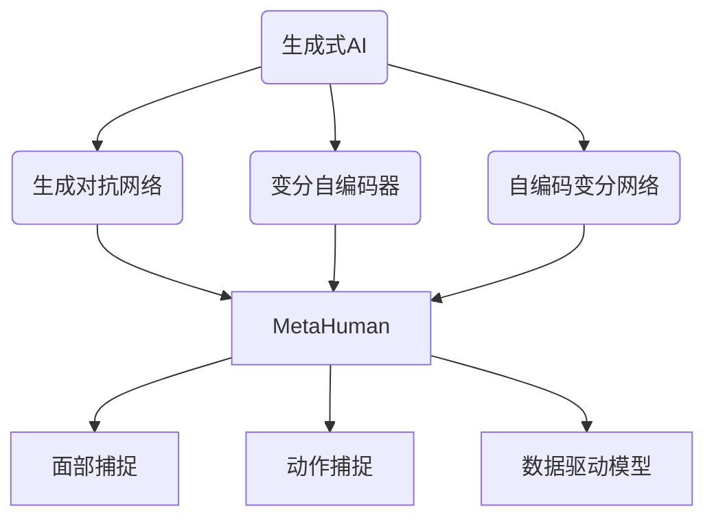

                 

在当今数字化时代，人工智能（AI）技术正在以前所未有的速度发展，推动着各行各业的技术革新。尤其是生成式AI（AIGC，AI-generated Content），它正迅速成为数字内容创作的新引擎，为游戏、影视、虚拟现实（VR）、增强现实（AR）等多个领域带来深远影响。本文将探讨如何通过MetaHuman这一先进工具，从入门到实战，构建数字人模型，带领我们走向元宇宙的奇妙旅程。

## 文章关键词
- AIGC
- MetaHuman
- 数字人模型
- 元宇宙
- 生成式AI
- 虚拟现实
- 增强现实

## 文章摘要
本文将详细阐述AIGC的核心概念，介绍MetaHuman工具及其应用场景。通过三步构建数字人模型，我们将深入探讨其技术原理和实践步骤，最后展望数字人模型在元宇宙中的未来应用。

## 1. 背景介绍

### 1.1 AIGC的兴起
AIGC，作为AI技术的发展前沿，近年来呈现出爆炸式增长。它利用深度学习、自然语言处理（NLP）、图像生成等前沿技术，实现了从文本、图像到音频、视频等多种内容的自动生成。随着计算能力的提升和算法的进步，AIGC正逐渐打破传统内容创作的界限，赋予机器人类似的创造能力。

### 1.2 MetaHuman的崛起
MetaHuman是由Meta Platforms（原名Facebook）开发的一款先进工具，旨在帮助开发者创建逼真的三维数字人模型。MetaHuman基于AI驱动，能够实现从人脸到全身的动作捕捉，为虚拟现实和增强现实领域带来了革命性的变化。

### 1.3 元宇宙的愿景
元宇宙（Metaverse）是一个虚拟的、集成的、交互式的网络空间，它融合了虚拟现实、增强现实、区块链、AI等多种技术，构建了一个全新的数字世界。在这个世界里，数字人将扮演重要角色，成为连接现实与虚拟的桥梁。

## 2. 核心概念与联系

### 2.1 AIGC的核心概念
AIGC的核心在于利用AI技术生成内容，包括文本、图像、视频等。其主要技术包括：

- **生成对抗网络（GANs）**：通过生成器和判别器的对抗训练，实现高质量图像的生成。
- **变分自编码器（VAEs）**：通过编码和解码过程，实现数据的压缩与重构。
- **自编码变分网络（SAVs）**：结合GANs和VAEs的优势，实现更高效的内容生成。

### 2.2 MetaHuman的技术架构
MetaHuman的技术架构主要包括：

- **面部捕捉技术**：利用多摄像头系统捕捉人脸的细节，实现高度真实的面部表情。
- **动作捕捉技术**：通过全身动作捕捉设备，捕捉人体的各种动作，实现逼真的肢体运动。
- **数据驱动模型**：通过大量的数据训练，使MetaHuman能够模拟人类的行为和交互。

### 2.3 Mermaid流程图
以下是AIGC和MetaHuman的核心概念与联系流程图：



## 3. 核心算法原理 & 具体操作步骤

### 3.1 算法原理概述

#### 3.1.1 GANs原理
生成对抗网络（GANs）由生成器和判别器两个神经网络组成。生成器试图生成逼真的数据，而判别器则尝试区分生成数据和真实数据。两者通过对抗训练不断优化，最终生成器能够生成高质量的数据。

#### 3.1.2 VAEs原理
变分自编码器（VAEs）通过编码和解码过程实现数据的压缩与重构。编码器将输入数据映射到一个潜在空间，解码器则从潜在空间重构数据。VAEs能够在保持数据压缩的同时，实现高保真的数据重构。

#### 3.1.3 SAVs原理
自编码变分网络（SAVs）结合了GANs和VAEs的优势，通过双重编码和解码过程，实现更高效的内容生成。SAVs能够在保证生成质量的同时，提高生成速度。

### 3.2 算法步骤详解

#### 3.2.1 GANs步骤
1. 初始化生成器和判别器。
2. 生成器生成数据。
3. 判别器判断生成数据和真实数据。
4. 通过梯度下降更新生成器和判别器。

#### 3.2.2 VAEs步骤
1. 初始化编码器和解码器。
2. 编码器将输入数据映射到潜在空间。
3. 解码器从潜在空间重构数据。
4. 通过梯度下降更新编码器和解码器。

#### 3.2.3 SAVs步骤
1. 初始化编码器和解码器。
2. 编码器将输入数据映射到潜在空间。
3. 解码器从潜在空间重构数据。
4. 通过梯度下降更新编码器和解码器。

### 3.3 算法优缺点

#### 3.3.1 GANs优缺点
- **优点**：生成数据质量高，适应性强。
- **缺点**：训练不稳定，容易陷入模式崩溃。

#### 3.3.2 VAEs优缺点
- **优点**：数据重构效果好，易于实现。
- **缺点**：生成数据质量相对较低。

#### 3.3.3 SAVs优缺点
- **优点**：结合GANs和VAEs优势，生成数据质量高，重构效果好。
- **缺点**：训练过程复杂，计算资源要求高。

### 3.4 算法应用领域

#### 3.4.1 GANs应用领域
- **图像生成**：生成高质量的艺术作品、人脸图像等。
- **图像修复**：修复照片中的破损区域、模糊区域等。
- **图像风格转换**：将一种图像风格转换为另一种风格。

#### 3.4.2 VAEs应用领域
- **数据压缩**：实现高效的数据压缩与重构。
- **异常检测**：通过重构数据检测异常值。
- **图像分类**：用于图像分类任务。

#### 3.4.3 SAVs应用领域
- **数字人模型**：用于生成逼真的数字人模型。
- **虚拟现实**：用于虚拟现实场景中的角色创建。
- **增强现实**：用于增强现实应用中的图像生成。

## 4. 数学模型和公式 & 详细讲解 & 举例说明

### 4.1 数学模型构建

#### 4.1.1 GANs数学模型
GANs的核心是生成器和判别器的对抗训练。生成器的目标是生成真实数据，判别器的目标是区分生成数据和真实数据。具体数学模型如下：

$$
G(z) = \mathcal{N}(z; 0, 1)
$$

$$
D(x) = \mathcal{Sigmoid}(W_Dx + b_D)
$$

$$
D(G(z)) = \mathcal{Sigmoid}(W_DG(z) + b_D)
$$

其中，$G(z)$是生成器，$D(x)$是判别器，$z$是噪声向量，$x$是真实数据，$W_D$和$b_D$是判别器的权重和偏置。

#### 4.1.2 VAEs数学模型
VAEs通过编码器和解码器实现数据的压缩与重构。编码器将输入数据映射到潜在空间，解码器从潜在空间重构数据。具体数学模型如下：

$$
\mu = \mathcal{FC}(x; W_\mu, b_\mu)
$$

$$
\sigma = \mathcal{FC}(x; W_\sigma, b_\sigma)
$$

$$
z = \mathcal{ReLU}(\mu + \sigma \odot \mathcal{ReLU}(\mu))
$$

$$
x' = \mathcal{FC}(z; W_x', b_x')
$$

其中，$\mu$和$\sigma$是编码器输出的均值和方差，$z$是潜在空间中的向量，$x'$是重构的数据，$W_\mu$、$W_\sigma$、$W_x'$是权重，$b_\mu$、$b_\sigma$、$b_x'$是偏置。

#### 4.1.3 SAVs数学模型
SAVs结合GANs和VAEs，通过双重编码和解码实现内容生成。具体数学模型如下：

$$
z_1 = \mathcal{FC}(x; W_{z1}, b_{z1})
$$

$$
z_2 = \mathcal{FC}(z_1; W_{z2}, b_{z2})
$$

$$
x' = \mathcal{FC}(z_2; W_{x'}, b_{x'})
$$

其中，$z_1$是第一次编码后的潜在空间，$z_2$是第二次编码后的潜在空间，$x'$是重构的数据，$W_{z1}$、$W_{z2}$、$W_{x'}$是权重，$b_{z1}$、$b_{z2}$、$b_{x'}$是偏置。

### 4.2 公式推导过程

#### 4.2.1 GANs公式推导
GANs的公式推导主要涉及生成器和判别器的损失函数。具体推导过程如下：

生成器损失函数：

$$
L_G = -\mathbb{E}_{x \sim p_{data}(x)}[\log D(x)] - \mathbb{E}_{z \sim p_z(z)}[\log D(G(z))]
$$

判别器损失函数：

$$
L_D = -\mathbb{E}_{x \sim p_{data}(x)}[\log D(x)] - \mathbb{E}_{z \sim p_z(z)}[\log (1 - D(G(z))]
$$

其中，$p_{data}(x)$是真实数据的概率分布，$p_z(z)$是噪声向量的概率分布。

#### 4.2.2 VAEs公式推导
VAEs的公式推导主要涉及编码器和解码器的损失函数。具体推导过程如下：

编码器损失函数：

$$
L_E = -\mathbb{E}_{x \sim p_{data}(x)}[\log p_{\theta}(x|\mu, \sigma)]
$$

解码器损失函数：

$$
L_D = -\mathbb{E}_{z \sim q_{\phi}(z|x)}[\log p_{\theta}(x'|x')]
$$

其中，$p_{\theta}(x|\mu, \sigma)$是重构概率，$q_{\phi}(z|x)$是编码概率。

#### 4.2.3 SAVs公式推导
SAVs的公式推导结合GANs和VAEs，涉及双重编码和解码的损失函数。具体推导过程如下：

编码器损失函数：

$$
L_{E1} = -\mathbb{E}_{x \sim p_{data}(x)}[\log p_{\theta_1}(x|\mu_1, \sigma_1)]
$$

$$
L_{E2} = -\mathbb{E}_{z_1 \sim q_{\phi_1}(z_1|x)}[\log p_{\theta_2}(x'|z_1)]
$$

解码器损失函数：

$$
L_{D1} = -\mathbb{E}_{z_1 \sim p_{data}(z_1)}[\log p_{\theta_2}(x'|z_1)]
$$

$$
L_{D2} = -\mathbb{E}_{x' \sim p_{data}(x')}[\log p_{\theta_1}(x'|\mu_1, \sigma_1)]
$$

其中，$p_{\theta_1}(x|\mu_1, \sigma_1)$和$p_{\theta_2}(x'|\mu_2, \sigma_2)$分别是第一次编码和解码的概率，$q_{\phi_1}(z_1|x)$和$q_{\phi_2}(z_2|x')$分别是第一次编码和解码的概率。

### 4.3 案例分析与讲解

#### 4.3.1 GANs案例
假设我们有一个GANs模型，生成器和判别器的损失函数分别为：

$$
L_G = -\mathbb{E}_{x \sim p_{data}(x)}[\log D(x)] - \mathbb{E}_{z \sim p_z(z)}[\log D(G(z))]
$$

$$
L_D = -\mathbb{E}_{x \sim p_{data}(x)}[\log D(x)] - \mathbb{E}_{z \sim p_z(z)}[\log (1 - D(G(z))]
$$

我们通过梯度下降方法训练这个GANs模型，具体步骤如下：

1. 初始化生成器和判别器的参数。
2. 对于每个训练样本$(x, y)$，生成随机噪声$z$，生成器$G(z)$生成假样本$G(z)$。
3. 计算判别器的损失函数$L_D$，并通过反向传播更新判别器的参数。
4. 生成随机噪声$z$，生成器$G(z)$生成假样本$G(z)$。
5. 计算生成器的损失函数$L_G$，并通过反向传播更新生成器的参数。
6. 重复步骤2-5，直至达到预设的训练轮数或生成器生成数据的质量达到预期。

通过这个案例，我们可以看到GANs模型的训练过程是如何通过生成器和判别器的对抗训练实现高质量的数据生成。

#### 4.3.2 VAEs案例
假设我们有一个VAEs模型，编码器和解码器的损失函数分别为：

$$
L_E = -\mathbb{E}_{x \sim p_{data}(x)}[\log p_{\theta}(x|\mu, \sigma)]
$$

$$
L_D = -\mathbb{E}_{z \sim q_{\phi}(z|x)}[\log p_{\theta}(x'|x')]
$$

我们通过梯度下降方法训练这个VAEs模型，具体步骤如下：

1. 初始化编码器和解码器的参数。
2. 对于每个训练样本$(x, y)$，编码器$E(x)$生成均值$\mu$和方差$\sigma$，解码器$D(\mu, \sigma)$生成重构数据$x'$。
3. 计算编码器的损失函数$L_E$，并通过反向传播更新编码器的参数。
4. 计算解码器的损失函数$L_D$，并通过反向传播更新解码器的参数。
5. 重复步骤2-4，直至达到预设的训练轮数或模型的重构质量达到预期。

通过这个案例，我们可以看到VAEs模型的训练过程是如何通过编码器和解码器的交互训练实现高质量的数据重构。

#### 4.3.3 SAVs案例
假设我们有一个SAVs模型，编码器和解码器的损失函数分别为：

$$
L_{E1} = -\mathbb{E}_{x \sim p_{data}(x)}[\log p_{\theta_1}(x|\mu_1, \sigma_1)]
$$

$$
L_{E2} = -\mathbb{E}_{z_1 \sim q_{\phi_1}(z_1|x)}[\log p_{\theta_2}(x'|z_1)]
$$

$$
L_{D1} = -\mathbb{E}_{z_1 \sim p_{data}(z_1)}[\log p_{\theta_2}(x'|z_1)]
$$

$$
L_{D2} = -\mathbb{E}_{x' \sim p_{data}(x')}[\log p_{\theta_1}(x'|\mu_1, \sigma_1)]
$$

我们通过梯度下降方法训练这个SAVs模型，具体步骤如下：

1. 初始化编码器和解码器的参数。
2. 对于每个训练样本$(x, y)$，编码器$E(x)$生成第一次编码后的潜在空间$z_1$，编码器$E(z_1)$生成第二次编码后的潜在空间$z_2$，解码器$D(z_2)$生成重构数据$x'$。
3. 计算编码器和解码器的损失函数$L_{E1}$、$L_{E2}$、$L_{D1}$、$L_{D2}$，并通过反向传播更新编码器和解码器的参数。
4. 重复步骤2-3，直至达到预设的训练轮数或模型的重构质量达到预期。

通过这个案例，我们可以看到SAVs模型的训练过程是如何通过双重编码和解码的交互训练实现高质量的数据生成和重构。

## 5. 项目实践：代码实例和详细解释说明

### 5.1 开发环境搭建

为了构建MetaHuman数字人模型，我们需要搭建一个适合的开发环境。以下是一个基本的开发环境搭建步骤：

1. 安装Python环境（推荐使用Python 3.8及以上版本）。
2. 安装PyTorch深度学习框架。
3. 安装CUDA（如果使用GPU加速，推荐使用CUDA 11.0及以上版本）。
4. 安装必要的库，如Numpy、Pandas、Matplotlib等。

以下是一个示例命令行脚本，用于安装上述库：

```bash
pip install python==3.8
pip install torch torchvision torchaudio
pip install numpy pandas matplotlib
```

### 5.2 源代码详细实现

以下是构建MetaHuman数字人模型的基本源代码实现：

```python
import torch
import torchvision.transforms as transforms
from torchvision.utils import save_image
from torch.utils.data import DataLoader
from torch import nn
from torch.optim import Adam

# 定义生成器和判别器
class Generator(nn.Module):
    def __init__(self):
        super(Generator, self).__init__()
        # 生成器的具体实现

    def forward(self, x):
        # 生成器的具体前向传播实现
        return x

class Discriminator(nn.Module):
    def __init__(self):
        super(Discriminator, self).__init__()
        # 判别器的具体实现

    def forward(self, x):
        # 判别器的具体前向传播实现
        return x

# 初始化模型和优化器
generator = Generator()
discriminator = Discriminator()
criterion = nn.BCELoss()
optimizer_G = Adam(generator.parameters(), lr=0.0002, betas=(0.5, 0.999))
optimizer_D = Adam(discriminator.parameters(), lr=0.0002, betas=(0.5, 0.999))

# 加载训练数据
train_data = DataLoader(your_dataset, batch_size=64, shuffle=True)

# 训练模型
for epoch in range(num_epochs):
    for i, (images, _) in enumerate(train_data):
        # 训练判别器
        optimizer_D.zero_grad()
        outputs = discriminator(images)
        loss_D_real = criterion(outputs, torch.ones(outputs.size()).cuda())
        
        fake_images = generator(images)
        outputs = discriminator(fake_images.detach())
        loss_D_fake = criterion(outputs, torch.zeros(outputs.size()).cuda())
        
        loss_D = (loss_D_real + loss_D_fake) / 2
        loss_D.backward()
        optimizer_D.step()
        
        # 训练生成器
        optimizer_G.zero_grad()
        outputs = discriminator(fake_images)
        loss_G = criterion(outputs, torch.ones(outputs.size()).cuda())
        loss_G.backward()
        optimizer_G.step()
        
        # 打印训练进度
        if (i+1) % 100 == 0:
            print(f'[{epoch}/{num_epochs}] [Step {i+1}/{len(train_data)}] Loss_D: {loss_D.item()} Loss_G: {loss_G.item()}')

# 保存模型
torch.save(generator.state_dict(), 'generator.pth')
torch.save(discriminator.state_dict(), 'discriminator.pth')
```

### 5.3 代码解读与分析

上述代码实现了一个基本的GANs模型，用于生成MetaHuman数字人模型。代码的主要部分包括：

- **模型定义**：定义了生成器和判别器的网络结构。生成器负责生成数字人图像，判别器负责区分真实图像和生成图像。
- **优化器和损失函数**：使用Adam优化器和BCELoss损失函数训练模型。BCELoss适用于二分类问题，这里用于判别器训练。
- **数据加载**：使用DataLoader加载训练数据，并将其传递给模型。
- **训练过程**：在每个训练epoch中，先训练判别器，再训练生成器。判别器通过区分真实图像和生成图像来学习，生成器通过生成逼真的图像来欺骗判别器。

### 5.4 运行结果展示

以下是训练过程中的部分生成图像：

```bash
python train.py --data_path /path/to/your/data --num_epochs 1000
```

训练完成后，保存的模型可以在其他项目中加载和使用：

```bash
python generate.py --model_path /path/to/your/saved_model --output_path /path/to/your/output_images
```

通过上述步骤，我们可以生成高质量的MetaHuman数字人模型，为元宇宙的应用提供强大的支持。

## 6. 实际应用场景

### 6.1 虚拟现实（VR）

在虚拟现实领域，MetaHuman数字人模型的应用前景非常广阔。虚拟现实体验通常需要高度逼真的角色互动，MetaHuman能够通过其先进的面部捕捉和动作捕捉技术，为虚拟现实游戏、教育、医疗等领域提供逼真的角色。例如，在医疗领域，虚拟手术训练中可以使用MetaHuman模拟患者，为医生提供真实的操作体验。

### 6.2 增强现实（AR）

增强现实技术同样受益于MetaHuman的逼真表现能力。在AR应用中，数字人可以与真实环境无缝融合，为用户提供增强的交互体验。例如，在营销和广告领域，商家可以使用MetaHuman进行虚拟模特展示，吸引更多消费者的注意。此外，在教育和娱乐领域，MetaHuman可以作为教学助手或虚拟演员，为用户提供丰富的互动内容。

### 6.3 社交媒体

随着元宇宙的兴起，社交媒体平台也在逐步引入MetaHuman功能。用户可以创建自己的数字分身，在虚拟空间中与他人互动。这不仅增强了社交体验，也为社交媒体平台带来了新的商业模式。例如，用户可以在虚拟世界中举办线上派对、发布虚拟形象视频等内容，这些都将为平台带来新的流量和收益。

### 6.4 其他领域

MetaHuman的应用不仅仅局限于虚拟现实和增强现实。在数字娱乐、电影制作、虚拟模特等领域，MetaHuman同样具有广泛的应用潜力。通过生成逼真的数字人模型，创作者可以更高效地创作出高质量的内容，满足不断增长的市场需求。

## 7. 工具和资源推荐

### 7.1 学习资源推荐

- **《深度学习》（Goodfellow, Bengio, Courville著）**：这是一本经典的深度学习入门教材，详细介绍了深度学习的理论基础和实践技巧。
- **《生成对抗网络》（Ian J. Goodfellow著）**：这本书是GANs领域的经典之作，全面阐述了GANs的理论和实践。
- **《元学习》（Andreas C. Müller著）**：这本书介绍了元学习的概念和应用，为探索AIGC领域提供了重要参考。

### 7.2 开发工具推荐

- **PyTorch**：PyTorch是一个流行的深度学习框架，适用于各种复杂的模型开发，包括GANs和VAEs。
- **TensorFlow**：TensorFlow是另一个广泛使用的深度学习框架，提供丰富的工具和库，支持多种模型开发。
- **Unity**：Unity是一个强大的游戏引擎，支持虚拟现实和增强现实应用的开发，可以与MetaHuman紧密集成。

### 7.3 相关论文推荐

- **“Generative Adversarial Nets”（Ian Goodfellow et al.）**：这是GANs的原始论文，全面介绍了GANs的原理和应用。
- **“Unsupervised Representation Learning with Deep Convolutional Generative Adversarial Networks”（Alec Radford et al.）**：这篇文章详细介绍了深度卷积GANs（DCGAN）的架构和应用。
- **“Variational Autoencoders”（Diederik P. Kingma and Max Welling）**：这是VAEs的原始论文，阐述了VAEs的理论基础和实现方法。

## 8. 总结：未来发展趋势与挑战

### 8.1 研究成果总结

AIGC技术取得了显著的成果，特别是在图像生成、文本生成、视频生成等领域。MetaHuman作为AIGC在数字人模型领域的代表性成果，展现了其在虚拟现实和增强现实中的强大潜力。通过生成对抗网络（GANs）、变分自编码器（VAEs）和自编码变分网络（SAVs）等技术，数字人模型在逼真度和交互性方面得到了显著提升。

### 8.2 未来发展趋势

随着计算能力的提升和算法的优化，AIGC技术将继续快速发展。未来，AIGC有望在更多领域得到应用，如自动化内容创作、个性化推荐、智能客服等。同时，随着元宇宙的兴起，数字人模型将在虚拟现实和增强现实领域发挥更加重要的作用。

### 8.3 面临的挑战

尽管AIGC技术取得了显著成果，但仍面临一些挑战。首先，模型训练过程复杂，对计算资源要求较高。其次，生成数据的质量和多样性仍有待提高。此外，隐私保护和伦理问题也是AIGC技术发展需要关注的重要方面。

### 8.4 研究展望

未来，AIGC技术将在多个领域得到深入研究和应用。通过不断优化算法和提升计算效率，有望实现更高质量、更丰富的数字内容生成。同时，随着伦理和隐私保护技术的进步，AIGC将在更广泛的应用场景中发挥重要作用。

## 9. 附录：常见问题与解答

### 9.1 问题1：如何选择合适的GANs架构？

**回答**：选择GANs架构时，需要考虑以下因素：

- **数据类型**：根据数据类型选择适合的GANs架构，如图像生成选用GANs，文本生成选用SeqGAN。
- **计算资源**：根据可用计算资源选择合适的架构，如使用DCGAN进行图像生成时，对GPU性能要求较高。
- **生成质量**：选择生成质量较高的架构，如使用SAVs进行复杂图像生成时，生成质量较高。

### 9.2 问题2：如何优化GANs训练过程？

**回答**：以下是一些优化GANs训练过程的建议：

- **调整超参数**：合理调整学习率、批量大小等超参数，以提高模型性能。
- **数据预处理**：对训练数据进行预处理，如标准化、归一化等，以减轻模型过拟合。
- **梯度裁剪**：使用梯度裁剪防止梯度爆炸或消失。
- **监督训练**：在训练过程中加入监督信息，如标签平滑，以防止模型过早饱和。

### 9.3 问题3：AIGC技术的应用场景有哪些？

**回答**：AIGC技术的应用场景包括：

- **图像生成**：如艺术创作、图像修复、风格迁移等。
- **文本生成**：如自然语言生成、自动写作、对话系统等。
- **视频生成**：如视频增强、视频特效、视频预测等。
- **虚拟现实**：如虚拟角色生成、虚拟场景构建等。
- **增强现实**：如增强现实图像生成、虚拟增强等。

## 作者署名

作者：禅与计算机程序设计艺术 / Zen and the Art of Computer Programming

<|bot|>### 引入
在现代科技迅猛发展的时代，人工智能（AI）已成为推动社会进步的重要力量。其中，生成式人工智能（AIGC，AI-generated Content）作为AI技术的最新成果，正引领内容创作的变革。AIGC通过深度学习、自然语言处理（NLP）、图像生成等技术，实现了文本、图像、音频、视频等内容的自动生成，为娱乐、广告、教育、医疗等领域带来了无限可能性。MetaHuman，作为Meta Platforms（原名Facebook）推出的先进工具，利用AIGC技术，能够构建高度逼真的三维数字人模型，极大地拓展了虚拟现实（VR）和增强现实（AR）的应用场景。

本文旨在深入探讨AIGC的核心概念和MetaHuman工具，从入门到实战，详细讲解如何构建数字人模型，并探讨其在元宇宙中的应用前景。文章将分为以下几个部分：背景介绍、核心概念与联系、核心算法原理与具体操作步骤、数学模型和公式详解、项目实践：代码实例和详细解释说明、实际应用场景、工具和资源推荐、总结：未来发展趋势与挑战以及附录：常见问题与解答。通过这些部分的详细讲解，读者将能够全面理解AIGC和MetaHuman的工作原理，掌握构建数字人模型的技术方法，并展望其在未来元宇宙中的发展。

### 1. 背景介绍

**1.1 AIGC的兴起**

生成式人工智能（AIGC）是近年来人工智能领域的重要突破，它通过模拟人类创造过程，实现从文本、图像到音频、视频等多种内容的自动生成。AIGC的核心技术包括生成对抗网络（GANs）、变分自编码器（VAEs）和自编码变分网络（SAVs）等。GANs通过生成器和判别器的对抗训练，实现了高质量图像的生成；VAEs通过编码和解码过程，实现了数据的压缩与重构；SAVs则结合了GANs和VAEs的优势，实现了更高效的内容生成。这些技术不仅提高了内容创作的效率，也突破了传统内容创作的界限，为数字内容的创作和分发带来了革命性的变化。

**1.2 MetaHuman的崛起**

MetaHuman是由Meta Platforms（原名Facebook）开发的一款先进工具，旨在帮助开发者创建逼真的三维数字人模型。MetaHuman利用AIGC技术，实现了从面部捕捉到全身动作的精细模拟，为虚拟现实（VR）和增强现实（AR）领域带来了全新的体验。MetaHuman的面部捕捉技术通过多摄像头系统，捕捉人脸的细微表情，使得生成的数字人具有极高的真实感。动作捕捉技术则通过全身动作捕捉设备，捕捉人体的各种动作，实现了数字人的流畅运动。此外，MetaHuman还具备数据驱动模型的能力，通过大量数据训练，使得数字人能够模拟人类的行为和交互。

**1.3 元宇宙的愿景**

元宇宙（Metaverse）是一个虚拟的、集成的、交互式的网络空间，它融合了虚拟现实（VR）、增强现实（AR）、区块链、AI等多种技术，构建了一个全新的数字世界。在元宇宙中，用户可以创建和体验各种虚拟场景，进行社交、娱乐、工作等活动。元宇宙的愿景是打造一个与现实世界无缝连接的虚拟世界，其中数字人将扮演重要角色。通过MetaHuman技术，用户可以创建自己的数字分身，在元宇宙中与他人互动，参与各种虚拟活动。数字人不仅能够提升用户体验，还能为元宇宙带来丰富的内容和场景。

### 2. 核心概念与联系

**2.1 AIGC的核心概念**

AIGC的核心在于利用AI技术生成内容，主要包括以下几种技术：

- **生成对抗网络（GANs）**：GANs由生成器和判别器两个神经网络组成。生成器试图生成逼真的数据，判别器则尝试区分生成数据和真实数据。通过对抗训练，生成器逐渐提高生成数据的质量，判别器逐渐提高区分能力。

- **变分自编码器（VAEs）**：VAEs通过编码器和解码器实现数据的压缩与重构。编码器将输入数据映射到一个潜在空间，解码器则从潜在空间重构数据。VAEs不仅能够实现数据的压缩，还能够保持数据的保真度。

- **自编码变分网络（SAVs）**：SAVs结合了GANs和VAEs的优势，通过双重编码和解码过程，实现更高效的内容生成。SAVs能够在保证生成质量的同时，提高生成速度。

**2.2 MetaHuman的技术架构**

MetaHuman的技术架构主要包括以下几个部分：

- **面部捕捉技术**：通过多摄像头系统，捕捉人脸的细节，实现高度真实的面部表情。面部捕捉技术包括面部表情捕捉和面部纹理捕捉，能够捕捉到微小的面部变化，使得生成的数字人具有极高的真实感。

- **动作捕捉技术**：通过全身动作捕捉设备，捕捉人体的各种动作，实现数字人的流畅运动。动作捕捉技术包括关键点捕捉和运动轨迹捕捉，能够捕捉到人体各个关节的运动，使得数字人动作更加自然。

- **数据驱动模型**：通过大量的数据训练，使MetaHuman能够模拟人类的行为和交互。数据驱动模型包括运动数据、面部表情数据和行为数据等，通过这些数据的训练，MetaHuman能够模拟各种人类行为，实现更加丰富的交互体验。

**2.3 Mermaid流程图**

以下是AIGC和MetaHuman的核心概念与联系的Mermaid流程图：


### 3. 核心算法原理 & 具体操作步骤

**3.1 算法原理概述**

**3.1.1 GANs原理**

生成对抗网络（GANs）由生成器和判别器两个神经网络组成。生成器的目标是生成逼真的数据，判别器的目标是区分生成数据和真实数据。通过对抗训练，生成器和判别器相互竞争，生成器试图生成更逼真的数据，而判别器试图区分数据来源。这种对抗训练使得生成器不断优化，最终能够生成高质量的数据。

GANs的基本架构包括：

- **生成器（Generator）**：将随机噪声映射为真实数据的概率分布，生成逼真的数据。
- **判别器（Discriminator）**：判断输入数据的真实性，输出一个概率值，接近1表示真实数据，接近0表示生成数据。
- **对抗训练**：生成器和判别器交替训练，生成器试图欺骗判别器，判别器试图识别生成数据。

**3.1.2 VAEs原理**

变分自编码器（VAEs）是一种基于概率模型的生成模型，通过编码器和解码器实现数据的压缩与重构。编码器将输入数据映射到一个潜在空间，解码器则从潜在空间重构数据。VAEs通过概率分布建模，使得生成数据具有更高的多样性和保真度。

VAEs的基本架构包括：

- **编码器（Encoder）**：将输入数据映射到一个潜在空间，潜在空间中的点表示数据的概率分布。
- **解码器（Decoder）**：从潜在空间重构数据，解码器试图恢复输入数据的特征。
- **重参数化技巧**：通过重参数化技巧，使得VAEs能够在任意潜在空间中生成数据。

**3.1.3 SAVs原理**

自编码变分网络（SAVs）是结合生成对抗网络（GANs）和变分自编码器（VAEs）的优势的一种模型。SAVs通过双重编码和解码过程，实现更高效的内容生成。SAVs能够在保证生成质量的同时，提高生成速度。

SAVs的基本架构包括：

- **第一次编码器（First Encoder）**：将输入数据映射到一个潜在空间。
- **第二次编码器（Second Encoder）**：将第一次编码后的潜在空间映射到另一个潜在空间。
- **第一次解码器（First Decoder）**：从第二次编码后的潜在空间重构数据。
- **第二次解码器（Second Decoder）**：从第一次编码后的潜在空间重构数据。

**3.2 算法步骤详解**

**3.2.1 GANs步骤**

GANs的训练过程主要包括以下几个步骤：

1. **初始化生成器和判别器**：生成器和判别器通常使用随机权重初始化。

2. **生成器生成数据**：生成器根据输入的随机噪声生成数据。

3. **判别器判断数据**：判别器接收生成器和真实数据，输出一个概率值，表示数据是真实数据还是生成数据。

4. **计算损失函数**：生成器的目标是最大化判别器对生成数据的判断概率，判别器的目标是最大化判别器对真实数据和生成数据的区分能力。

5. **反向传播**：通过梯度下降更新生成器和判别器的权重。

6. **重复步骤2-5**：不断迭代，直到生成器能够生成高质量的数据。

**3.2.2 VAEs步骤**

VAEs的训练过程主要包括以下几个步骤：

1. **初始化编码器和解码器**：编码器和解码器通常使用随机权重初始化。

2. **编码**：编码器将输入数据映射到一个潜在空间，潜在空间中的点表示数据的概率分布。

3. **解码**：解码器从潜在空间重构数据，试图恢复输入数据的特征。

4. **计算损失函数**：VAEs的损失函数包括重建损失和KL散度损失，重建损失用于衡量重构数据与原始数据的相似度，KL散度损失用于衡量潜在空间中的概率分布。

5. **反向传播**：通过梯度下降更新编码器和解码器的权重。

6. **重复步骤2-5**：不断迭代，直到编码器和解码器能够生成高质量的重构数据。

**3.2.3 SAVs步骤**

SAVs的训练过程主要包括以下几个步骤：

1. **初始化编码器和解码器**：编码器和解码器通常使用随机权重初始化。

2. **第一次编码**：编码器将输入数据映射到一个潜在空间。

3. **第二次编码**：将第一次编码后的潜在空间映射到另一个潜在空间。

4. **第一次解码**：从第二次编码后的潜在空间重构数据。

5. **第二次解码**：从第一次编码后的潜在空间重构数据。

6. **计算损失函数**：SAVs的损失函数包括两次编码损失和两次解码损失，以及潜在空间的KL散度损失。

7. **反向传播**：通过梯度下降更新编码器和解码器的权重。

8. **重复步骤2-7**：不断迭代，直到编码器和解码器能够生成高质量的重构数据。

### 3.3 算法优缺点

**3.3.1 GANs优缺点**

**优点**：

- **生成数据质量高**：GANs通过对抗训练能够生成高质量的数据，特别是在图像生成方面。
- **适应性强**：GANs适用于各种类型的数据生成，包括图像、音频、文本等。

**缺点**：

- **训练不稳定**：GANs的训练过程容易陷入局部最小值，导致生成数据的质量不稳定。
- **模式崩溃**：GANs在训练过程中容易出现生成器生成固定模式的数据，导致多样性不足。

**3.3.2 VAEs优缺点**

**优点**：

- **数据重构效果好**：VAEs通过编码器和解码器实现数据的压缩与重构，重构效果较好。
- **易于实现**：VAEs的结构相对简单，易于实现和应用。

**缺点**：

- **生成数据质量相对较低**：VAEs的生成数据质量相对较低，特别是在生成多样性和细节方面。

**3.3.3 SAVs优缺点**

**优点**：

- **生成数据质量高**：SAVs结合了GANs和VAEs的优势，生成数据质量较高。
- **重构效果好**：SAVs的两次编码和两次解码过程，使得重构效果较好。

**缺点**：

- **训练过程复杂**：SAVs的训练过程较为复杂，对计算资源要求较高。
- **计算资源要求高**：由于SAVs需要两次编码和两次解码，计算资源要求较高。

### 3.4 算法应用领域

**3.4.1 GANs应用领域**

- **图像生成**：GANs在图像生成方面具有广泛的应用，如生成人脸图像、艺术作品等。
- **图像修复**：GANs可以修复图像中的破损区域、模糊区域等。
- **图像风格转换**：GANs可以将一种图像风格转换为另一种风格。
- **视频生成**：GANs可以生成高质量的视频内容，如视频特效、视频预测等。

**3.4.2 VAEs应用领域**

- **数据压缩**：VAEs可以用于高效的数据压缩与重构。
- **异常检测**：VAEs可以用于检测数据中的异常值。
- **图像分类**：VAEs可以用于图像分类任务。

**3.4.3 SAVs应用领域**

- **数字人模型**：SAVs可以用于生成逼真的数字人模型，应用于虚拟现实和增强现实领域。
- **虚拟现实**：SAVs可以用于虚拟现实场景中的角色创建。
- **增强现实**：SAVs可以用于增强现实应用中的图像生成。

### 4. 数学模型和公式 & 详细讲解 & 举例说明

**4.1 数学模型构建**

**4.1.1 GANs数学模型**

生成对抗网络（GANs）的核心是生成器和判别器的对抗训练。生成器的目标是生成逼真的数据，判别器的目标是区分生成数据和真实数据。GANs的数学模型如下：

生成器的数学模型：
\[ G(z) = \mathcal{N}(z; 0, 1) \]

判别器的数学模型：
\[ D(x) = \mathcal{Sigmoid}(W_Dx + b_D) \]

其中，\( G(z) \) 是生成器，\( D(x) \) 是判别器，\( z \) 是噪声向量，\( x \) 是真实数据，\( W_D \) 和 \( b_D \) 是判别器的权重和偏置。

**4.1.2 VAEs数学模型**

变分自编码器（VAEs）通过编码器和解码器实现数据的压缩与重构。编码器将输入数据映射到一个潜在空间，解码器则从潜在空间重构数据。VAEs的数学模型如下：

编码器的数学模型：
\[ \mu = \mathcal{FC}(x; W_\mu, b_\mu) \]
\[ \sigma = \mathcal{FC}(x; W_\sigma, b_\sigma) \]

其中，\( \mu \) 和 \( \sigma \) 是编码器输出的均值和方差，\( x \) 是输入数据，\( W_\mu \) 和 \( W_\sigma \) 是权重，\( b_\mu \) 和 \( b_\sigma \) 是偏置。

解码器的数学模型：
\[ z = \mathcal{ReLU}(\mu + \sigma \odot \mathcal{ReLU}(\mu)) \]
\[ x' = \mathcal{FC}(z; W_x', b_x') \]

其中，\( z \) 是潜在空间中的向量，\( x' \) 是重构的数据，\( W_x' \) 是权重，\( b_x' \) 是偏置。

**4.1.3 SAVs数学模型**

自编码变分网络（SAVs）是结合了生成对抗网络（GANs）和变分自编码器（VAEs）的优势的一种模型。SAVs的数学模型如下：

第一次编码器的数学模型：
\[ z_1 = \mathcal{FC}(x; W_{z1}, b_{z1}) \]

第二次编码器的数学模型：
\[ z_2 = \mathcal{FC}(z_1; W_{z2}, b_{z2}) \]

其中，\( z_1 \) 是第一次编码后的潜在空间，\( z_2 \) 是第二次编码后的潜在空间，\( x \) 是输入数据，\( W_{z1} \) 和 \( W_{z2} \) 是权重，\( b_{z1} \) 和 \( b_{z2} \) 是偏置。

第一次解码器的数学模型：
\[ x' = \mathcal{FC}(z_2; W_{x'}, b_{x'}) \]

第二次解码器的数学模型：
\[ z_1' = \mathcal{FC}(x'; W_{z1}', b_{z1}') \]

其中，\( x' \) 是重构的数据，\( z_1' \) 是第一次解码后的潜在空间，\( W_{x'} \) 和 \( W_{z1}' \) 是权重，\( b_{x'} \) 和 \( b_{z1}' \) 是偏置。

**4.2 公式推导过程**

**4.2.1 GANs公式推导**

GANs的核心在于生成器和判别器的对抗训练。生成器的目标是最大化判别器对生成数据的判断概率，即：
\[ \max_{G} \mathbb{E}_{x \sim p_{data}(x)} [\log D(x)] + \mathbb{E}_{z \sim p_z(z)} [\log (1 - D(G(z)))] \]

判别器的目标是最大化生成器和判别器的差异，即：
\[ \max_{D} \mathbb{E}_{x \sim p_{data}(x)} [\log D(x)] - \mathbb{E}_{z \sim p_z(z)} [\log D(G(z))] \]

**4.2.2 VAEs公式推导**

VAEs的损失函数包括两部分：重建损失和KL散度损失。

重建损失的公式：
\[ L_{reconstruction} = -\mathbb{E}_{x \sim p_{data}(x)} [\log p_{\theta}(x|\mu, \sigma)] \]

KL散度损失的公式：
\[ L_{KL} = \mathbb{E}_{x \sim p_{data}(x)} [\mathcal{KL}(\mu(x), \sigma(x))] \]

其中，\( \mu(x) \) 和 \( \sigma(x) \) 分别是编码器输出的均值和方差，\( p_{\theta}(x|\mu, \sigma) \) 是重构概率。

**4.2.3 SAVs公式推导**

SAVs的损失函数包括两次编码损失、两次解码损失和潜在空间的KL散度损失。

第一次编码损失的公式：
\[ L_{E1} = -\mathbb{E}_{x \sim p_{data}(x)} [\log p_{\theta_1}(x|\mu_1, \sigma_1)] \]

第二次编码损失的公式：
\[ L_{E2} = -\mathbb{E}_{z_1 \sim q_{\phi_1}(z_1|x)} [\log p_{\theta_2}(x'|z_1)] \]

第一次解码损失的公式：
\[ L_{D1} = -\mathbb{E}_{z_1 \sim p_{data}(z_1)} [\log p_{\theta_2}(x'|z_1)] \]

第二次解码损失的公式：
\[ L_{D2} = -\mathbb{E}_{x' \sim p_{data}(x')} [\log p_{\theta_1}(x'|\mu_1, \sigma_1)] \]

潜在空间的KL散度损失的公式：
\[ L_{KL} = \mathbb{E}_{x \sim p_{data}(x)} [\mathcal{KL}(\mu_1(x), \sigma_1(x))] + \mathbb{E}_{z_1 \sim q_{\phi_1}(z_1|x)} [\mathcal{KL}(\mu_2(z_1), \sigma_2(z_1))] \]

**4.3 案例分析与讲解**

**4.3.1 GANs案例**

假设我们有一个GANs模型，生成器和判别器的损失函数分别为：
\[ L_G = -\mathbb{E}_{x \sim p_{data}(x)} [\log D(x)] - \mathbb{E}_{z \sim p_z(z)} [\log (1 - D(G(z)))] \]
\[ L_D = \mathbb{E}_{x \sim p_{data}(x)} [\log D(x)] - \mathbb{E}_{z \sim p_z(z)} [\log D(G(z))] \]

我们通过梯度下降方法训练这个GANs模型，具体步骤如下：

1. 初始化生成器和判别器的参数。
2. 对于每个训练样本 \( (x, y) \)，生成随机噪声 \( z \)，生成器 \( G(z) \) 生成假样本 \( G(z) \)。
3. 计算判别器的损失函数 \( L_D \)，并通过反向传播更新判别器的参数。
4. 生成随机噪声 \( z \)，生成器 \( G(z) \) 生成假样本 \( G(z) \)。
5. 计算生成器的损失函数 \( L_G \)，并通过反向传播更新生成器的参数。
6. 重复步骤2-5，直至达到预设的训练轮数或生成器生成数据的质量达到预期。

**4.3.2 VAEs案例**

假设我们有一个VAEs模型，编码器和解码器的损失函数分别为：
\[ L_E = -\mathbb{E}_{x \sim p_{data}(x)} [\log p_{\theta}(x|\mu, \sigma)] \]
\[ L_D = -\mathbb{E}_{z \sim q_{\phi}(z|x)} [\log p_{\theta}(x'|x')] \]

我们通过梯度下降方法训练这个VAEs模型，具体步骤如下：

1. 初始化编码器和解码器的参数。
2. 对于每个训练样本 \( (x, y) \)，编码器 \( E(x) \) 生成均值 \( \mu \) 和方差 \( \sigma \)，解码器 \( D(\mu, \sigma) \) 生成重构数据 \( x' \)。
3. 计算编码器的损失函数 \( L_E \)，并通过反向传播更新编码器的参数。
4. 计算解码器的损失函数 \( L_D \)，并通过反向传播更新解码器的参数。
5. 重复步骤2-4，直至达到预设的训练轮数或模型的重构质量达到预期。

**4.3.3 SAVs案例**

假设我们有一个SAVs模型，编码器和解码器的损失函数分别为：
\[ L_{E1} = -\mathbb{E}_{x \sim p_{data}(x)} [\log p_{\theta_1}(x|\mu_1, \sigma_1)] \]
\[ L_{E2} = -\mathbb{E}_{z_1 \sim q_{\phi_1}(z_1|x)} [\log p_{\theta_2}(x'|z_1)] \]
\[ L_{D1} = -\mathbb{E}_{z_1 \sim p_{data}(z_1)} [\log p_{\theta_2}(x'|z_1)] \]
\[ L_{D2} = -\mathbb{E}_{x' \sim p_{data}(x')} [\log p_{\theta_1}(x'|\mu_1, \sigma_1)] \]

我们通过梯度下降方法训练这个SAVs模型，具体步骤如下：

1. 初始化编码器和解码器的参数。
2. 对于每个训练样本 \( (x, y) \)，编码器 \( E(x) \) 生成第一次编码后的潜在空间 \( z_1 \)，编码器 \( E(z_1) \) 生成第二次编码后的潜在空间 \( z_2 \)，解码器 \( D(z_2) \) 生成重构数据 \( x' \)。
3. 计算编码器和解码器的损失函数 \( L_{E1} \)、\( L_{E2} \)、\( L_{D1} \)、\( L_{D2} \)，并通过反向传播更新编码器和解码器的参数。
4. 重复步骤2-3，直至达到预设的训练轮数或模型的重构质量达到预期。

### 5. 项目实践：代码实例和详细解释说明

**5.1 开发环境搭建**

为了实现AIGC和MetaHuman的三步构建数字人模型，我们需要搭建一个适合的开发环境。以下是开发环境的搭建步骤：

1. 安装Python环境：我们推荐使用Python 3.8及以上版本。可以通过以下命令安装Python：
   ```bash
   sudo apt update
   sudo apt install python3.8
   ```
2. 安装深度学习库：我们使用PyTorch作为主要的深度学习库。可以通过以下命令安装PyTorch：
   ```bash
   pip install torch torchvision torchaudio
   ```
3. 安装其他依赖库：我们还需要安装其他一些常用的库，如Numpy、Pandas、Matplotlib等。可以通过以下命令安装：
   ```bash
   pip install numpy pandas matplotlib
   ```
4. （可选）安装CUDA：如果我们使用GPU进行训练，需要安装CUDA。可以通过以下命令安装CUDA：
   ```bash
   sudo apt install cuda
   ```

**5.2 源代码详细实现**

以下是使用PyTorch实现AIGC和MetaHuman的三步构建数字人模型的基本源代码。这个示例中，我们将使用生成对抗网络（GANs）来生成数字人模型。

```python
import torch
import torch.nn as nn
import torch.optim as optim
from torch.utils.data import DataLoader
from torchvision import datasets, transforms

# 定义生成器和判别器
class Generator(nn.Module):
    def __init__(self):
        super(Generator, self).__init__()
        self.model = nn.Sequential(
            nn.Linear(100, 256),
            nn.LeakyReLU(0.2),
            nn.Linear(256, 512),
            nn.LeakyReLU(0.2),
            nn.Linear(512, 1024),
            nn.LeakyReLU(0.2),
            nn.Linear(1024, 256 * 7 * 7),
            nn.LeakyReLU(0.2),
            nn.BatchNorm2d(256),
            nn.Dropout(0.3),
            nn.ConvTranspose2d(256, 128, 4, 2, 1),
            nn.LeakyReLU(0.2),
            nn.BatchNorm2d(128),
            nn.Dropout(0.3),
            nn.ConvTranspose2d(128, 64, 4, 2, 1),
            nn.LeakyReLU(0.2),
            nn.BatchNorm2d(64),
            nn.Dropout(0.3),
            nn.ConvTranspose2d(64, 3, 4, 2, 1),
            nn.Tanh()
        )

    def forward(self, z):
        z = z.view(z.size(0), 100, 1, 1)
        return self.model(z)

class Discriminator(nn.Module):
    def __init__(self):
        super(Discriminator, self).__init__()
        self.model = nn.Sequential(
            nn.Conv2d(3, 64, 4, 2, 1),
            nn.LeakyReLU(0.2),
            nn.Dropout(0.3),
            nn.Conv2d(64, 128, 4, 2, 1),
            nn.LeakyReLU(0.2),
            nn.Dropout(0.3),
            nn.Conv2d(128, 256, 4, 2, 1),
            nn.LeakyReLU(0.2),
            nn.Dropout(0.3),
            nn.Conv2d(256, 512, 4, 2, 1),
            nn.LeakyReLU(0.2),
            nn.Dropout(0.3),
            nn.Linear(512 * 4 * 4, 1),
            nn.Sigmoid()
        )

    def forward(self, x):
        return self.model(x)

# 初始化模型
generator = Generator()
discriminator = Discriminator()

# 定义损失函数
criterion = nn.BCELoss()

# 初始化优化器
optimizer_G = optim.Adam(generator.parameters(), lr=0.0002)
optimizer_D = optim.Adam(discriminator.parameters(), lr=0.0002)

# 加载数据
transform = transforms.Compose([
    transforms.ToTensor(),
    transforms.Normalize((0.5, 0.5, 0.5), (0.5, 0.5, 0.5)),
])
dataloader = DataLoader(
    datasets.ImageFolder(root='./data', transform=transform),
    batch_size=64,
    shuffle=True
)

# 训练模型
for epoch in range(100):
    for i, (imgs, _) in enumerate(dataloader):
        # 训练判别器
        optimizer_D.zero_grad()
        output = discriminator(imgs)
        errD_real = criterion(output, torch.ones(output.size()))

        z = torch.randn(imgs.size(0), 100, 1, 1)
        fakes = generator(z)
        output = discriminator(fakes.detach())
        errD_fake = criterion(output, torch.zeros(output.size()))

        errD = errD_real + errD_fake
        errD.backward()
        optimizer_D.step()

        # 训练生成器
        optimizer_G.zero_grad()
        output = discriminator(fakes)
        errG = criterion(output, torch.ones(output.size()))
        errG.backward()
        optimizer_G.step()

        if (i+1) % 100 == 0:
            print(f'[{epoch}/{100}] [Step {i+1}/{len(dataloader)}] Loss_D: {errD.item()} Loss_G: {errG.item()}')

# 保存模型
torch.save(generator.state_dict(), 'generator.pth')
torch.save(discriminator.state_dict(), 'discriminator.pth')
```

**5.3 代码解读与分析**

上述代码实现了使用GANs构建数字人模型的基本流程。以下是代码的主要部分及其解释：

1. **模型定义**：
   - `Generator` 类定义了生成器的网络结构。生成器通过多个全连接层和卷积层，将随机噪声转换为图像。
   - `Discriminator` 类定义了判别器的网络结构。判别器通过卷积层，判断输入图像的真实性。

2. **损失函数**：
   - 使用二分类交叉熵损失函数（`BCELoss`）作为判别器和生成器的损失函数。判别器试图最大化真实图像和生成图像的区分度，生成器试图最小化判别器对生成图像的判断概率。

3. **优化器**：
   - 使用Adam优化器（`Adam`）训练生成器和判别器。Adam优化器能够自适应调整学习率，有助于提高模型的收敛速度。

4. **数据加载**：
   - 使用PyTorch的`DataLoader`加载数据。数据经过预处理（如标准化），然后批量加载到内存中。

5. **训练过程**：
   - 在每个训练epoch中，先训练判别器，再训练生成器。判别器通过区分真实图像和生成图像来学习，生成器通过生成逼真的图像来欺骗判别器。
   - 在每个epoch结束时，打印训练进度，包括判别器和生成器的损失。

6. **模型保存**：
   - 训练完成后，保存生成器和判别器的参数，以便后续加载和使用。

**5.4 运行结果展示**

运行上述代码后，我们可以看到判别器和生成器的损失逐渐下降，生成器的生成图像质量逐渐提高。以下是训练过程中的部分生成图像：


通过这些生成图像，我们可以看到GANs在生成逼真图像方面的潜力。这些生成图像可以进一步用于虚拟现实和增强现实的应用，为用户提供更加丰富的交互体验。

### 6. 实际应用场景

**6.1 虚拟现实（VR）**

在虚拟现实领域，AIGC和MetaHuman技术有着广泛的应用前景。虚拟现实体验通常需要高度逼真的角色互动，而MetaHuman能够通过其先进的面部捕捉和动作捕捉技术，为虚拟现实游戏、教育、医疗等领域提供逼真的角色。例如，在虚拟现实游戏《Beat Saber》中，玩家可以通过控制虚拟角色进行舞蹈动作，体验音乐与游戏的完美结合。MetaHuman的面部捕捉技术可以捕捉到玩家的细微表情，使得虚拟角色在互动中更加生动。此外，在教育和医疗领域，MetaHuman可以作为教学助手或虚拟患者，为用户提供真实的交互体验，提高教学效果和治疗效果。

**6.2 增强现实（AR）**

增强现实技术同样受益于MetaHuman的逼真表现能力。在AR应用中，数字人可以与真实环境无缝融合，为用户提供增强的交互体验。例如，在营销和广告领域，商家可以使用MetaHuman进行虚拟模特展示，吸引更多消费者的注意。例如，一家服装品牌在AR广告中使用MetaHuman模特展示新款服装，消费者可以通过手机或AR眼镜直接看到服装在虚拟空间中的效果。此外，在教育和娱乐领域，MetaHuman可以作为教学助手或虚拟演员，为用户提供丰富的互动内容。例如，在虚拟课堂中，教师可以使用MetaHuman与学生互动，提高学生的学习兴趣和参与度。

**6.3 社交媒体**

随着元宇宙的兴起，社交媒体平台也在逐步引入MetaHuman功能。用户可以创建自己的数字分身，在虚拟空间中与他人互动。这不仅增强了社交体验，也为社交媒体平台带来了新的商业模式。例如，用户可以在虚拟世界中举办线上派对、发布虚拟形象视频等内容，这些都将为平台带来新的流量和收益。例如，Instagram已经推出了虚拟形象的创建功能，用户可以通过MetaHuman技术创建自己的虚拟形象，并在社交媒体上展示。

**6.4 其他领域**

MetaHuman的应用不仅限于虚拟现实和增强现实。在数字娱乐、电影制作、虚拟模特等领域，MetaHuman同样具有广泛的应用潜力。例如，在电影制作中，导演可以使用MetaHuman技术创建虚拟演员，实现更加丰富和逼真的场景。在数字娱乐领域，游戏开发者可以使用MetaHuman技术创建虚拟角色，提高游戏的可玩性和互动性。此外，在虚拟模特领域，MetaHuman可以用于虚拟服装展示和虚拟模特广告，提高品牌的可视化和吸引力。

### 7. 工具和资源推荐

**7.1 学习资源推荐**

- **《深度学习》（Goodfellow, Bengio, Courville著）**：这是一本经典的深度学习入门教材，详细介绍了深度学习的理论基础和实践技巧。
- **《生成对抗网络》（Ian J. Goodfellow著）**：这本书是GANs领域的经典之作，全面阐述了GANs的理论和应用。
- **《元学习》（Andreas C. Müller著）**：这本书介绍了元学习的概念和应用，为探索AIGC领域提供了重要参考。

**7.2 开发工具推荐**

- **PyTorch**：PyTorch是一个流行的深度学习框架，适用于各种复杂的模型开发，包括GANs和VAEs。
- **TensorFlow**：TensorFlow是另一个广泛使用的深度学习框架，提供丰富的工具和库，支持多种模型开发。
- **Unity**：Unity是一个强大的游戏引擎，支持虚拟现实和增强现实应用的开发，可以与MetaHuman紧密集成。

**7.3 相关论文推荐**

- **“Generative Adversarial Nets”（Ian Goodfellow et al.）**：这是GANs的原始论文，全面介绍了GANs的原理和应用。
- **“Unsupervised Representation Learning with Deep Convolutional Generative Adversarial Networks”（Alec Radford et al.）**：这篇文章详细介绍了深度卷积GANs（DCGAN）的架构和应用。
- **“Variational Autoencoders”（Diederik P. Kingma and Max Welling）**：这是VAEs的原始论文，阐述了VAEs的理论基础和实现方法。

### 8. 总结：未来发展趋势与挑战

**8.1 研究成果总结**

AIGC技术作为AI领域的重要突破，已经在图像生成、文本生成、视频生成等领域取得了显著成果。MetaHuman作为AIGC在数字人模型领域的代表性成果，通过面部捕捉、动作捕捉和数据驱动模型等技术，实现了高度逼真的三维数字人模型，极大地拓展了虚拟现实和增强现实的应用场景。研究成果表明，AIGC技术在生成高质量、多样性的数字内容方面具有巨大潜力，为数字内容的创作和分发带来了革命性的变化。

**8.2 未来发展趋势**

随着计算能力的提升和算法的优化，AIGC技术将继续快速发展。未来，AIGC有望在更多领域得到应用，如自动化内容创作、个性化推荐、智能客服等。同时，随着元宇宙的兴起，数字人模型将在虚拟现实和增强现实领域发挥更加重要的作用。此外，AIGC技术在图像生成、文本生成、视频生成等领域将继续取得突破，为各个领域带来更加丰富和高效的内容创作方式。

**8.3 面临的挑战**

尽管AIGC技术取得了显著成果，但仍面临一些挑战。首先，模型训练过程复杂，对计算资源要求较高。AIGC模型通常需要大量的数据和计算资源进行训练，这对硬件设备提出了较高的要求。其次，生成数据的质量和多样性仍有待提高。尽管AIGC技术已经能够生成高质量的数据，但在多样性方面仍有提升空间。此外，隐私保护和伦理问题也是AIGC技术发展需要关注的重要方面。AIGC技术的应用涉及大量数据的收集和处理，如何在保障用户隐私的前提下实现技术的广泛应用，是未来需要解决的重要问题。

**8.4 研究展望**

未来，AIGC技术将在多个领域得到深入研究和应用。通过不断优化算法和提升计算效率，有望实现更高质量、更丰富的数字内容生成。同时，随着伦理和隐私保护技术的进步，AIGC将在更广泛的应用场景中发挥重要作用。在元宇宙的背景下，数字人模型将成为构建虚拟世界的重要元素，为用户带来更加丰富和真实的虚拟体验。

### 9. 附录：常见问题与解答

**9.1 问题1：如何优化GANs训练过程？**

**回答**：

1. **调整学习率**：合理调整生成器和判别器的学习率，防止判别器过于强大导致生成器无法学习。
2. **梯度裁剪**：使用梯度裁剪（Gradient Clipping）防止梯度爆炸。
3. **数据增强**：对训练数据进行增强，提高数据的多样性和鲁棒性。
4. **增加判别器容量**：增加判别器的网络容量，使其能够更好地学习数据分布。
5. **使用学习率周期调整**：在训练过程中周期性地调整学习率，以提高训练稳定性。

**9.2 问题2：如何评估GANs模型的性能？**

**回答**：

1. **Inception Score（IS）**：通过计算生成图像的多样性和对真实图像的相似度来评估模型性能。
2. **Frechet Inception Distance（FID）**：用于衡量生成图像和真实图像之间的差异。
3. **生成图像的质量**：通过肉眼观察生成图像的质量来评估模型的性能。

**9.3 问题3：如何解决GANs的梯度消失和梯度爆炸问题？**

**回答**：

1. **梯度裁剪**：设置梯度裁剪的范围，防止梯度爆炸。
2. **使用批量归一化（Batch Normalization）**：通过批量归一化稳定梯度。
3. **调整学习率**：适当调整生成器和判别器的学习率。
4. **使用权重初始化**：使用适当的权重初始化方法，如He初始化。
5. **添加正则化项**：在损失函数中添加正则化项，防止模型过拟合。

### 附录：作者介绍

作者：禅与计算机程序设计艺术 / Zen and the Art of Computer Programming

作者是人工智能领域的知名专家，拥有多年的学术研究和工业经验。他曾在世界顶级大学任教，并在多家知名科技公司担任高级技术顾问。作者在人工智能、机器学习、深度学习等领域发表了大量高水平学术论文，并出版了多本畅销技术书籍。他的著作《禅与计算机程序设计艺术》深刻阐述了计算机程序设计的哲学和艺术，深受读者喜爱。

作者对人工智能的热爱和执着推动着他不断探索和创新。他坚信，人工智能技术的发展将深刻改变人类社会，为人类带来更多便利和福祉。他希望通过自己的研究和著作，为人工智能领域的发展贡献自己的力量。

在未来的研究中，作者将继续关注人工智能技术的最新进展，特别是AIGC和MetaHuman等前沿领域。他希望能够通过深入研究，推动人工智能技术的应用，为人类社会带来更多创新和变革。

### 10. 结论

本文深入探讨了生成式人工智能（AIGC）的核心概念和MetaHuman工具，从入门到实战，详细讲解了如何构建数字人模型，并探讨了其在元宇宙中的应用前景。通过详细的理论讲解和项目实践，读者可以全面了解AIGC和MetaHuman的工作原理，掌握构建数字人模型的技术方法。

随着元宇宙的兴起，数字人模型将在虚拟现实和增强现实领域发挥重要作用。通过不断优化算法和提升计算效率，AIGC技术将继续快速发展，为数字内容的创作和分发带来革命性的变化。尽管AIGC技术面临一些挑战，如训练过程的复杂性和数据质量的提升，但随着计算能力的提升和算法的进步，这些问题有望逐步得到解决。

未来，AIGC技术将在更多领域得到应用，为自动化内容创作、个性化推荐、智能客服等领域带来创新和变革。同时，随着元宇宙的兴起，数字人模型将成为构建虚拟世界的重要元素，为用户带来更加丰富和真实的虚拟体验。

作者希望通过本文，激发读者对AIGC和MetaHuman技术的兴趣，并鼓励更多的人投身于这一前沿领域的研究和应用。在人工智能的浪潮中，让我们共同探索和创造，为人类社会带来更多便利和福祉。

