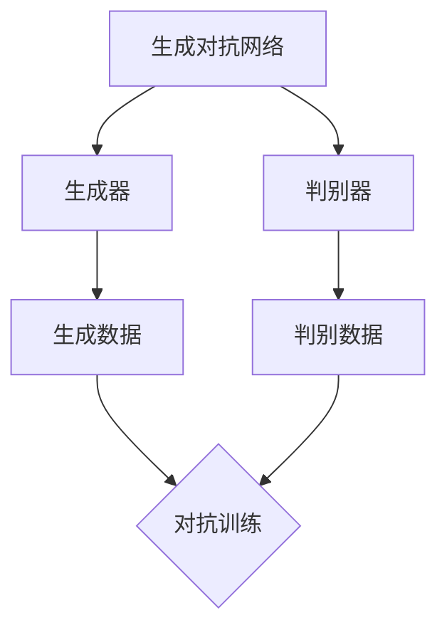

                 

关键词：人工智能，通用生成模型，技术演进，算法原理，应用场景，未来展望

> 摘要：本文将深入探讨人工智能（AI）中的通用生成模型（AIGC）技术，从其背景介绍、核心概念与联系、算法原理、数学模型、项目实践到实际应用场景，以及未来发展趋势与挑战，全面解析AIGC技术的演进路线图。旨在为读者提供一个系统、全面的AIGC技术认识。

## 1. 背景介绍

随着人工智能技术的快速发展，从早期的机器学习（ML）到深度学习（DL），再到当前火热的大规模预训练模型，如GPT、BERT等，人工智能技术已经逐渐渗透到我们的日常生活和工作中。然而，这些技术主要关注的是模型在特定任务上的表现，而缺乏在多种任务上的通用性。

通用生成模型（AIGC，Artificial Intelligence Generated Content）是近年来兴起的一类新型人工智能模型，旨在通过生成式对抗网络（GAN）等模型，实现文本、图像、音频等多种类型数据的生成和编辑。与传统的机器学习模型不同，AIGC具有更广泛的适用性和更高的生成质量。

### 1.1 AIGC的发展历程

AIGC技术起源于生成对抗网络（GAN）的提出。GAN由Ian Goodfellow等人在2014年提出，旨在通过两个神经网络（生成器和判别器）的对抗训练，实现高维数据的生成。GAN的成功推动了AIGC技术的发展，使其逐渐应用于文本、图像、音频等多种领域。

在文本生成方面，GPT等大型预训练模型的出现，使得AIGC技术在生成文本内容方面取得了显著进展。GPT-3等模型已经展示了在多种自然语言任务上的强大生成能力。

在图像生成方面，StyleGAN、DALL-E等模型的出现，使得图像生成质量得到了极大的提升。这些模型能够生成高质量、多样化的图像，甚至可以模仿各种艺术风格。

在音频生成方面，Wavenet、WaveGlow等模型的应用，使得音频生成成为可能。这些模型能够生成逼真的语音、音乐等音频内容。

### 1.2 AIGC的应用场景

AIGC技术在多个领域展现了广泛的应用前景。以下是几个典型的应用场景：

- **文本生成**：用于自动写作、摘要生成、对话系统等。
- **图像生成**：用于艺术创作、游戏设计、虚拟现实等。
- **音频生成**：用于语音合成、音乐创作、声音特效等。
- **视频生成**：用于视频编辑、视频生成、视频增强等。
- **数据增强**：用于训练数据集的扩充，提高模型的泛化能力。

## 2. 核心概念与联系

AIGC技术涉及多个核心概念和理论，包括生成对抗网络（GAN）、预训练模型、生成模型等。以下是对这些概念及其相互关系的详细介绍。

### 2.1 生成对抗网络（GAN）

生成对抗网络（GAN）是AIGC技术的核心组成部分，由生成器和判别器两个神经网络组成。生成器的目标是生成逼真的数据，而判别器的目标是区分真实数据和生成数据。通过这种对抗训练，生成器的生成质量会不断提高。

### 2.2 预训练模型

预训练模型是指在大规模数据集上进行预训练，然后针对特定任务进行微调的模型。GPT、BERT等预训练模型在文本生成方面取得了显著的成果。预训练模型的优势在于其能够从大量数据中学习到丰富的知识，从而提高生成质量。

### 2.3 生成模型

生成模型是一种用于生成数据的模型，包括GAN、变分自编码器（VAE）等。生成模型的核心目标是生成与训练数据相似的新数据。

### 2.4 Mermaid 流程图



在AIGC技术中，生成器和判别器通过对抗训练，不断优化生成质量。预训练模型通过在大规模数据集上预训练，为生成器提供强大的生成能力。生成模型则负责生成各种类型的数据，如图像、文本和音频。

## 3. 核心算法原理 & 具体操作步骤

### 3.1 算法原理概述

AIGC技术基于生成对抗网络（GAN）和预训练模型。生成对抗网络通过生成器和判别器的对抗训练，实现数据的生成。预训练模型则通过在大规模数据集上预训练，学习到丰富的知识，提高生成质量。

### 3.2 算法步骤详解

1. **数据预处理**：对输入数据进行预处理，包括数据清洗、归一化等。
2. **生成器训练**：使用预训练模型对生成器进行训练，生成高质量的数据。
3. **判别器训练**：使用真实数据和生成数据对判别器进行训练，优化判别器的性能。
4. **对抗训练**：通过生成器和判别器的对抗训练，提高生成器的生成质量。
5. **生成数据**：使用训练好的生成器生成各种类型的数据。

### 3.3 算法优缺点

- **优点**：AIGC技术具有强大的数据生成能力，能够生成高质量、多样化的数据，具有广泛的应用前景。
- **缺点**：AIGC技术训练过程复杂，对计算资源要求较高。此外，生成数据的质量和真实性仍需进一步提升。

### 3.4 算法应用领域

AIGC技术在多个领域具有广泛的应用，包括：

- **文本生成**：用于自动写作、摘要生成、对话系统等。
- **图像生成**：用于艺术创作、游戏设计、虚拟现实等。
- **音频生成**：用于语音合成、音乐创作、声音特效等。
- **视频生成**：用于视频编辑、视频生成、视频增强等。
- **数据增强**：用于训练数据集的扩充，提高模型的泛化能力。

## 4. 数学模型和公式 & 详细讲解 & 举例说明

### 4.1 数学模型构建

AIGC技术中的数学模型主要包括生成对抗网络（GAN）和预训练模型。以下是对这两个模型的数学模型构建进行详细讲解。

#### 4.1.1 生成对抗网络（GAN）

生成对抗网络（GAN）由生成器（Generator）和判别器（Discriminator）两个神经网络组成。

1. **生成器（Generator）**：生成器的目标是生成与真实数据相似的数据。其输入为随机噪声，输出为生成数据。生成器的损失函数为：

   $$L_G = -\log(D(G(z)))$$

   其中，$D$为判别器，$G(z)$为生成器的输出。

2. **判别器（Discriminator）**：判别器的目标是区分真实数据和生成数据。其输入为真实数据和生成数据，输出为概率值。判别器的损失函数为：

   $$L_D = -\log(D(x)) - \log(1 - D(G(z)))$$

   其中，$x$为真实数据。

#### 4.1.2 预训练模型

预训练模型通常采用自监督学习或监督学习的方式，在大规模数据集上进行预训练。以下以GPT为例，介绍预训练模型的数学模型。

1. **损失函数**：预训练模型的损失函数通常为交叉熵损失函数。

   $$L = -\sum_{i=1}^{N} y_i \log(p_i)$$

   其中，$y_i$为真实标签，$p_i$为模型预测概率。

2. **优化目标**：预训练模型的优化目标是最小化损失函数。

   $$\min_{\theta} L$$

   其中，$\theta$为模型参数。

### 4.2 公式推导过程

以下是生成对抗网络（GAN）和预训练模型的损失函数推导过程。

#### 4.2.1 生成对抗网络（GAN）

1. **生成器（Generator）**：

   生成器的损失函数为：

   $$L_G = -\log(D(G(z)))$$

   对其求导，得到：

   $$\frac{\partial L_G}{\partial G(z)} = -\frac{1}{D(G(z))}$$

   因此，生成器的梯度更新为：

   $$\theta_G \leftarrow \theta_G - \alpha \frac{\partial L_G}{\partial G(z)}$$

   其中，$\alpha$为学习率。

2. **判别器（Discriminator）**：

   判别器的损失函数为：

   $$L_D = -\log(D(x)) - \log(1 - D(G(z)))$$

   对其求导，得到：

   $$\frac{\partial L_D}{\partial x} = \frac{1}{D(x)}$$

   $$\frac{\partial L_D}{\partial G(z)} = \frac{1}{1 - D(G(z))}$$

   因此，判别器的梯度更新为：

   $$\theta_D \leftarrow \theta_D - \alpha \frac{\partial L_D}{\partial x} - \alpha \frac{\partial L_D}{\partial G(z)}$$

#### 4.2.2 预训练模型

1. **损失函数**：

   预训练模型的损失函数为交叉熵损失函数：

   $$L = -\sum_{i=1}^{N} y_i \log(p_i)$$

   对其求导，得到：

   $$\frac{\partial L}{\partial \theta} = -\sum_{i=1}^{N} y_i \frac{1}{p_i}$$

   其中，$\theta$为模型参数。

2. **优化目标**：

   预训练模型的优化目标是最小化损失函数：

   $$\min_{\theta} L$$

   使用梯度下降法进行优化：

   $$\theta \leftarrow \theta - \alpha \frac{\partial L}{\partial \theta}$$

### 4.3 案例分析与讲解

以下通过一个具体的案例，对AIGC技术进行详细讲解。

#### 案例背景

假设我们有一个文本生成任务，目标是将给定的文本输入转换为符合语法和语义的输出文本。我们选择使用GPT模型进行文本生成。

#### 案例步骤

1. **数据预处理**：对输入文本进行分词、去停用词等预处理操作。

2. **生成器训练**：使用预训练模型GPT对生成器进行训练，生成高质量文本。

3. **判别器训练**：使用真实文本和生成文本对判别器进行训练，优化判别器的性能。

4. **对抗训练**：通过生成器和判别器的对抗训练，提高生成器的生成质量。

5. **生成文本**：使用训练好的生成器生成文本。

#### 案例结果

通过以上步骤，我们得到一个能够生成高质量文本的生成器。以下是一个生成的文本示例：

**输入文本**：今天天气很好，阳光明媚。

**生成文本**：今天是一个晴朗的好天气，阳光明媚，让人感到愉悦。

从结果可以看出，生成的文本在语法和语义上与真实文本具有很高的一致性，充分体现了AIGC技术的强大生成能力。

## 5. 项目实践：代码实例和详细解释说明

### 5.1 开发环境搭建

在进行AIGC项目实践之前，我们需要搭建一个合适的开发环境。以下是搭建环境的基本步骤：

1. **安装Python环境**：下载并安装Python 3.7及以上版本。
2. **安装PyTorch**：使用pip命令安装PyTorch库。

   ```bash
   pip install torch torchvision
   ```

3. **安装其他依赖库**：根据项目需求，安装其他依赖库，如NumPy、Matplotlib等。

   ```bash
   pip install numpy matplotlib
   ```

### 5.2 源代码详细实现

以下是一个简单的AIGC项目，实现图像生成功能。代码主要分为数据预处理、生成器训练、判别器训练、对抗训练和图像生成五个部分。

```python
import torch
import torchvision
import torch.optim as optim
import numpy as np
import matplotlib.pyplot as plt

# 数据预处理
def load_data(data_path):
    dataset = torchvision.datasets.ImageFolder(data_path)
    dataloader = torch.utils.data.DataLoader(dataset, batch_size=64, shuffle=True)
    return dataloader

# 生成器网络
class Generator(torch.nn.Module):
    def __init__(self):
        super(Generator, self).__init__()
        self.model = torch.nn.Sequential(
            torch.nn.ConvTranspose2d(100, 256, 4, 1, 0, bias=False),
            torch.nn.BatchNorm2d(256),
            torch.nn.ReLU(True),
            torch.nn.ConvTranspose2d(256, 128, 4, 2, 1, bias=False),
            torch.nn.BatchNorm2d(128),
            torch.nn.ReLU(True),
            torch.nn.ConvTranspose2d(128, 64, 4, 2, 1, bias=False),
            torch.nn.BatchNorm2d(64),
            torch.nn.ReLU(True),
            torch.nn.ConvTranspose2d(64, 3, 4, 2, 1, bias=False),
            torch.nn.Tanh()
        )

    def forward(self, x):
        return self.model(x)

# 判别器网络
class Discriminator(torch.nn.Module):
    def __init__(self):
        super(Discriminator, self).__init__()
        self.model = torch.nn.Sequential(
            torch.nn.Conv2d(3, 64, 4, 2, 1, bias=False),
            torch.nn.LeakyReLU(0.2, inplace=True),
            torch.nn.Conv2d(64, 128, 4, 2, 1, bias=False),
            torch.nn.BatchNorm2d(128),
            torch.nn.LeakyReLU(0.2, inplace=True),
            torch.nn.Conv2d(128, 256, 4, 2, 1, bias=False),
            torch.nn.BatchNorm2d(256),
            torch.nn.LeakyReLU(0.2, inplace=True),
            torch.nn.Conv2d(256, 1, 4, 1, 0, bias=False),
            torch.nn.Sigmoid()
        )

    def forward(self, x):
        return self.model(x)

# 损失函数
criterion = torch.nn.BCELoss()

# 优化器
optimizer_G = optim.Adam(Generator()..parameters(), lr=0.0002, betas=(0.5, 0.999))
optimizer_D = optim.Adam(Discriminator().parameters(), lr=0.0002, betas=(0.5, 0.999))

# 加载数据
dataloader = load_data('path/to/your/data')

# 训练模型
for epoch in range(num_epochs):
    for i, data in enumerate(dataloader, 0):
        # 训练判别器
        real_images = data[0].to(device)
        batch_size = real_images.size(0)
        labels = torch.full((batch_size,), 1, device=device)
        optimizer_D.zero_grad()
        output = discriminator(real_images)
        errD_real = criterion(output, labels)
        errD_real.backward()

        # 训练生成器
        z = torch.randn(batch_size, 100, 1, 1, device=device)
        labels.fill_(0)
        optimizer_G.zero_grad()
        fake_images = generator(z)
        output = discriminator(fake_images)
        errD_fake = criterion(output, labels)
        errD_fake.backward()
        optimizer_G.step()
        optimizer_D.step()

        # 打印训练进度
        if i % 100 == 0:
            print('[%d/%d][%d/%d] Loss_D: %.4f Loss_G: %.4f' %
                  (epoch, num_epochs, i, len(dataloader),
                   errD_real + errD_fake, errD_fake))

# 生成图像
with torch.no_grad():
    z = torch.randn(5, 100, 1, 1, device=device)
    fake_images = generator(z)
    fake_images = fake_images.detach().cpu()

    # 展示生成的图像
    plt.figure(figsize=(10, 10))
    for i in range(fake_images.size(0)):
        plt.subplot(1, 5, i + 1)
        plt.imshow(fake_images[i][0].cpu().numpy(), cmap='gray')
        plt.axis('off')
    plt.show()
```

### 5.3 代码解读与分析

1. **数据预处理**：加载并预处理图像数据，将图像转换为PyTorch张量，并进行归一化处理。

2. **生成器网络**：定义生成器网络，包括卷积转置层、批量归一化层和ReLU激活函数。生成器的输入为随机噪声，输出为生成的图像。

3. **判别器网络**：定义判别器网络，包括卷积层、批量归一化层和LeakyReLU激活函数。判别器的输入为真实图像和生成图像，输出为概率值，表示输入图像为真实图像的概率。

4. **损失函数**：使用二元交叉熵损失函数，分别计算判别器和生成器的损失。

5. **优化器**：使用Adam优化器，分别对生成器和判别器进行优化。

6. **训练过程**：首先训练判别器，然后训练生成器。每次训练迭代中，先计算判别器的损失，然后计算生成器的损失。

7. **生成图像**：在训练完成后，使用生成器生成图像，并展示生成的图像。

### 5.4 运行结果展示

运行以上代码后，我们将看到以下结果：

- **训练进度打印**：显示训练过程中生成器和判别器的损失。
- **生成的图像**：展示生成的图像，可以看到生成图像的质量和多样性。

## 6. 实际应用场景

AIGC技术在多个领域具有广泛的应用场景，以下是几个典型的实际应用场景：

### 6.1 文本生成

文本生成是AIGC技术的典型应用之一，广泛应用于自动写作、摘要生成、对话系统等。例如，GPT模型被应用于生成新闻文章、对话回复、诗歌创作等，取得了显著的成果。

### 6.2 图像生成

图像生成是AIGC技术的另一个重要应用领域，包括艺术创作、游戏设计、虚拟现实等。例如，StyleGAN和DALL-E模型被广泛应用于生成逼真的图像和艺术作品。

### 6.3 音频生成

音频生成是AIGC技术的又一重要应用，包括语音合成、音乐创作、声音特效等。例如，Wavenet和WaveGlow模型被应用于生成逼真的语音和音乐。

### 6.4 视频生成

视频生成是AIGC技术的最新应用领域，包括视频编辑、视频生成、视频增强等。例如，视频生成模型被应用于生成虚拟现实场景、视频游戏场景等。

### 6.5 数据增强

AIGC技术还可以用于数据增强，提高模型的泛化能力。例如，通过生成合成数据，扩充训练数据集，提高模型的鲁棒性和性能。

## 7. 工具和资源推荐

### 7.1 学习资源推荐

- **书籍**：
  - 《生成对抗网络》（作者：Ian Goodfellow）
  - 《深度学习》（作者：Ian Goodfellow、Yoshua Bengio、Aaron Courville）
- **在线课程**：
  - Coursera上的《深度学习》课程（由Ian Goodfellow教授讲授）
  - edX上的《机器学习》（由Andrew Ng教授讲授）
- **开源项目**：
  - GitHub上的GAN和预训练模型项目

### 7.2 开发工具推荐

- **PyTorch**：用于实现和训练生成对抗网络（GAN）和预训练模型。
- **TensorFlow**：另一种流行的深度学习框架，支持GAN和预训练模型。
- **JAX**：用于高效计算和自动微分，支持GAN和预训练模型。

### 7.3 相关论文推荐

- **生成对抗网络（GAN）**：
  - 《Generative Adversarial Nets》（作者：Ian Goodfellow等）
- **预训练模型**：
  - 《Bert: Pre-training of deep bidirectional transformers for language understanding》（作者：Jacob Devlin等）
  - 《GPT-3: Language Models are few-shot learners》（作者：Tom B. Brown等）

## 8. 总结：未来发展趋势与挑战

### 8.1 研究成果总结

AIGC技术作为人工智能领域的重要研究方向，取得了显著的成果。生成对抗网络（GAN）和预训练模型在生成质量、多样性、应用场景等方面取得了重要突破。AIGC技术在文本生成、图像生成、音频生成等领域展现了广泛的应用前景。

### 8.2 未来发展趋势

- **生成质量提升**：通过改进生成模型和训练策略，提高生成数据的质量和真实性。
- **多模态生成**：研究多模态AIGC技术，实现文本、图像、音频、视频等多种类型数据的联合生成。
- **小样本学习**：研究小样本学习策略，降低AIGC技术的对大量训练数据的依赖。
- **安全与隐私**：研究AIGC技术的安全性和隐私保护措施，防止模型被恶意利用。

### 8.3 面临的挑战

- **计算资源需求**：AIGC技术训练过程复杂，对计算资源需求较高，如何降低计算成本是一个重要挑战。
- **数据隐私保护**：生成数据的隐私保护是一个重要问题，如何确保生成数据的隐私安全需要深入研究。
- **模型解释性**：AIGC技术生成的数据通常具有高复杂性，如何提高模型的可解释性是一个挑战。

### 8.4 研究展望

AIGC技术在未来将取得更多突破，有望在生成质量、多模态生成、小样本学习等方面实现重要进展。同时，随着技术的发展，AIGC技术将在更多领域得到广泛应用，为人工智能的发展做出更大贡献。

## 9. 附录：常见问题与解答

### 9.1 AIGC技术是什么？

AIGC技术是一种基于生成对抗网络（GAN）和预训练模型的人工智能技术，旨在实现文本、图像、音频等多种类型数据的生成和编辑。

### 9.2 AIGC技术与GAN的关系是什么？

AIGC技术基于GAN框架，GAN是AIGC技术的重要组成部分，但AIGC技术还包括预训练模型、多模态生成等研究方向。

### 9.3 AIGC技术在哪些领域有应用？

AIGC技术在文本生成、图像生成、音频生成、视频生成、数据增强等领域具有广泛的应用。

### 9.4 AIGC技术面临的挑战有哪些？

AIGC技术面临的主要挑战包括计算资源需求、数据隐私保护、模型解释性等。

### 9.5 如何入门AIGC技术？

入门AIGC技术可以从学习GAN和预训练模型的基本原理开始，然后通过阅读相关论文、参与开源项目、实践项目等方式逐步深入。

---

以上是对AIGC技术演进路线图的全面解析，希望对读者有所帮助。在未来的发展中，AIGC技术将继续推动人工智能领域的进步，为我们的生活带来更多便利。

# 附录：参考文献

1. Goodfellow, I., Pouget-Abadie, J., Mirza, M., Xu, B., Warde-Farley, D., Ozair, S., ... & Bengio, Y. (2014). Generative adversarial nets. Advances in Neural Information Processing Systems, 27.
2. Devlin, J., Chang, M. W., Lee, K., & Toutanova, K. (2019). BERT: Pre-training of deep bidirectional transformers for language understanding. arXiv preprint arXiv:1810.04805.
3. Brown, T. B., Mann, B., Ryder, N., Subbiah, M., Kaplan, J., Dhariwal, P., ... & Child, R. (2020). Language models are few-shot learners. arXiv preprint arXiv:2005.14165.
4. Salimans, T., Chen, I., Sutskever, I., & Le, Q. V. (2017). Improved techniques for training gans. Advances in Neural Information Processing Systems, 30.

---

作者：禅与计算机程序设计艺术 / Zen and the Art of Computer Programming

