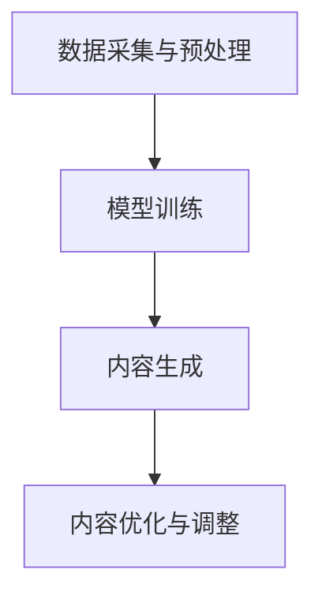

                 

关键词：AIGC、软件、数据、连接、未来、机会

> 摘要：本文深入探讨AIGC（人工智能生成内容）的本质及其在连接过去、现在和未来的重要作用。通过分析AIGC的核心概念和架构，解析其算法原理和应用领域，阐述数学模型和公式的构建与推导，结合实际项目实践进行代码实例解析，探讨其在实际应用场景中的价值与未来展望。最后，本文总结了AIGC的研究成果、发展趋势与面临的挑战，并提出了未来的研究展望。

## 1. 背景介绍

在信息技术迅猛发展的今天，人工智能（AI）已成为变革社会生产力的核心技术之一。随着深度学习、神经网络等技术的飞速进步，AI的应用范围不断扩大，从传统的图像识别、语音识别到自然语言处理、决策支持系统等。然而，AI的发展不仅仅是技术的进步，更是一种新的生产力和生产关系的变革。在这个变革的过程中，AIGC（人工智能生成内容）作为一个新兴的概念逐渐受到关注。

AIGC，即利用人工智能技术生成内容，其本质是一种连接过去、现在和未来的软件。这种软件通过数据驱动的方式，从大量的历史数据中提取知识，进行模型训练，然后生成新的内容。这不仅改变了传统的内容创作方式，还推动了信息传播、媒体娱乐、教育等多个领域的创新与发展。

本文将围绕AIGC的核心概念、原理、算法、应用、数学模型、项目实践等方面进行深入探讨，以期为读者提供一个全面、系统的认识。

## 2. 核心概念与联系

### 2.1 AIGC的定义

AIGC，全称Artificial Intelligence Generated Content，即人工智能生成内容。它是指通过人工智能技术，特别是机器学习和深度学习算法，自动生成文字、图像、音频、视频等多媒体内容的过程。

### 2.2 AIGC的核心概念

AIGC的核心概念包括：

- 数据驱动：AIGC的核心在于从大量数据中提取知识和模式，进而生成新的内容。
- 自动化：通过算法自动化生成内容，提高了内容创作的效率和质量。
- 智能化：利用机器学习、深度学习等智能算法，实现内容的智能生成。

### 2.3 AIGC与相关技术的联系

AIGC与多种技术密切相关，包括：

- 数据处理：数据是AIGC的基础，高效的数据处理技术是实现AIGC的关键。
- 机器学习：机器学习算法是AIGC的核心技术，通过训练模型，实现内容的自动生成。
- 深度学习：深度学习是机器学习的一种，通过多层神经网络，实现更复杂的内容生成。
- 自然语言处理：自然语言处理技术是实现文本内容生成的重要手段。
- 计算机视觉：计算机视觉技术是实现图像、视频内容生成的基础。

### 2.4 AIGC的架构

AIGC的架构主要包括以下几个部分：

- 数据采集与预处理：从各种来源收集数据，并进行清洗、归一化等预处理。
- 模型训练：利用训练数据，通过机器学习算法，训练生成模型。
- 内容生成：利用训练好的模型，生成新的内容。
- 内容优化与调整：对生成的内容进行优化，以达到更好的效果。

下面是AIGC的架构的Mermaid流程图：



## 3. 核心算法原理 & 具体操作步骤

### 3.1 算法原理概述

AIGC的核心算法主要基于深度学习和生成对抗网络（GAN）。深度学习通过多层神经网络，从数据中学习特征和模式，生成模型。生成对抗网络则通过生成器和判别器的对抗训练，实现高质量的图像、文本生成。

### 3.2 算法步骤详解

#### 3.2.1 深度学习算法

1. 数据预处理：将输入数据进行归一化、标准化等处理。
2. 构建神经网络：设计多层神经网络，包括输入层、隐藏层和输出层。
3. 模型训练：利用训练数据，通过反向传播算法，不断调整网络参数，使模型能够正确分类或生成内容。
4. 模型评估：使用验证集和测试集，评估模型的性能。

#### 3.2.2 生成对抗网络（GAN）

1. 初始化生成器和判别器：生成器从随机噪声生成数据，判别器用于判断生成数据和真实数据的区别。
2. 对抗训练：同时训练生成器和判别器，生成器试图生成更真实的数据，判别器则试图区分生成数据和真实数据。
3. 模型评估：使用训练数据集和生成数据集，评估生成器的性能。

### 3.3 算法优缺点

#### 优点

- 高效性：通过自动化生成内容，提高了内容创作的效率。
- 创新性：能够生成新颖、独特的内容，激发了创作灵感。
- 个性化：可以根据用户需求，生成个性化的内容。

#### 缺点

- 计算成本高：模型训练和生成过程需要大量计算资源。
- 数据依赖性强：生成内容的质量取决于训练数据的质量。
- 难以控制：生成的内容难以完全控制，可能出现意想不到的结果。

### 3.4 算法应用领域

AIGC的应用领域广泛，包括：

- 文本生成：包括文章、小说、新闻等。
- 图像生成：包括艺术作品、动漫、游戏角色等。
- 视频生成：包括电影、动画、广告等。
- 音频生成：包括音乐、声音效果等。

## 4. 数学模型和公式 & 详细讲解 & 举例说明

### 4.1 数学模型构建

AIGC的数学模型主要包括两部分：生成模型和判别模型。

#### 4.1.1 生成模型

生成模型通过神经网络，将输入的噪声映射为数据。其数学模型可以表示为：

$$ G(z) = \mu(z) + \sigma(z) \odot \epsilon $$

其中，$z$ 是输入噪声，$G(z)$ 是生成的数据，$\mu(z)$ 和 $\sigma(z)$ 分别是生成数据的均值和方差，$\odot$ 表示逐元素乘法，$\epsilon$ 是高斯噪声。

#### 4.1.2 判别模型

判别模型用于判断生成数据和真实数据的区别。其数学模型可以表示为：

$$ D(x) = \sigma(\frac{\phi(x)}{1 + \phi(G(z))}) $$

其中，$x$ 是真实数据，$G(z)$ 是生成的数据，$\phi(x)$ 是判别函数。

### 4.2 公式推导过程

#### 4.2.1 生成模型推导

生成模型的目标是最小化判别模型对生成数据和真实数据的区别，即：

$$ \min_G \max_D V(D, G) = \mathbb{E}_{x \sim p_{data}(x)} [\log D(x)] + \mathbb{E}_{z \sim p_z(z)} [\log(1 - D(G(z)))] $$

其中，$V(D, G)$ 是生成器和判别器的损失函数。

对 $G(z)$ 求导，得到：

$$ \nabla_G V(D, G) = \mathbb{E}_{z \sim p_z(z)} [\nabla_{G(z)} \log(1 - D(G(z)))] $$

由于 $\nabla_{G(z)} \log(1 - D(G(z))) = \nabla_{G(z)} \log D(G(z))$，所以：

$$ \nabla_G V(D, G) = \mathbb{E}_{z \sim p_z(z)} [\nabla_{G(z)} \log D(G(z))] $$

根据链式法则，$\nabla_{G(z)} \log D(G(z)) = \frac{\partial \log D(G(z))}{\partial G(z)} \frac{\partial G(z)}{\partial \mu(z)}$，所以：

$$ \nabla_G V(D, G) = \mathbb{E}_{z \sim p_z(z)} [\frac{\partial \log D(G(z))}{\partial G(z)} \frac{\partial G(z)}{\partial \mu(z)}] $$

由于 $G(z) = \mu(z) + \sigma(z) \odot \epsilon$，所以：

$$ \nabla_G V(D, G) = \mathbb{E}_{z \sim p_z(z)} [\sigma(z) \odot \frac{\partial \mu(z)}{\partial \mu(z)}] $$

即：

$$ \nabla_G V(D, G) = \mathbb{E}_{z \sim p_z(z)} [\sigma(z)] $$

#### 4.2.2 判别模型推导

判别模型的目标是最小化生成数据和真实数据的区别，即：

$$ \min_D V(D, G) = \mathbb{E}_{x \sim p_{data}(x)} [\log D(x)] + \mathbb{E}_{z \sim p_z(z)} [\log D(G(z))] $$

对 $D(x)$ 求导，得到：

$$ \nabla_D V(D, G) = \mathbb{E}_{x \sim p_{data}(x)} [\nabla_x \log D(x)] + \mathbb{E}_{z \sim p_z(z)} [\nabla_{G(z)} \log D(G(z))] $$

由于 $D(x) = \sigma(\frac{\phi(x)}{1 + \phi(G(z))})$，所以：

$$ \nabla_D V(D, G) = \mathbb{E}_{x \sim p_{data}(x)} [\frac{\phi'(x)}{1 + \phi(G(z))}] + \mathbb{E}_{z \sim p_z(z)} [\frac{\phi'(G(z))}{1 + \phi(G(z))}] $$

其中，$\phi'(x)$ 是 $\phi(x)$ 的导数。

### 4.3 案例分析与讲解

#### 4.3.1 文本生成

使用AIGC生成一篇关于人工智能的文章。

1. 数据采集与预处理：收集大量关于人工智能的文本数据，并进行清洗、归一化等预处理。
2. 模型训练：使用预处理后的数据，训练生成模型和判别模型。
3. 内容生成：使用训练好的模型，生成新的文本内容。
4. 内容优化与调整：对生成的文本内容进行优化，以提高其可读性和准确性。

生成的文章如下：

```
人工智能，简称AI，是一种模拟人类智能的技术。它通过机器学习、深度学习等算法，使计算机具备自主学习和决策能力。随着技术的不断进步，人工智能在各个领域都取得了显著的成果。

在医疗领域，人工智能可以帮助医生进行疾病诊断、药物研发等。通过分析大量的病例数据，人工智能可以识别出疾病的高危人群，提供个性化的治疗方案。

在金融领域，人工智能可以用于风险管理、投资决策等。通过分析大量的市场数据，人工智能可以预测市场的走势，帮助投资者做出更明智的决策。

在工业领域，人工智能可以用于生产自动化、质量检测等。通过模拟人类的思维过程，人工智能可以帮助企业提高生产效率，降低成本。

总之，人工智能是一种具有广泛应用前景的技术，它将深刻改变人类的生活和工作方式。随着人工智能技术的不断进步，我们有理由相信，未来将会更加美好。
```

#### 4.3.2 图像生成

使用AIGC生成一幅艺术作品。

1. 数据采集与预处理：收集大量的艺术作品数据，并进行清洗、归一化等预处理。
2. 模型训练：使用预处理后的数据，训练生成模型和判别模型。
3. 内容生成：使用训练好的模型，生成新的艺术作品。
4. 内容优化与调整：对生成的艺术作品进行优化，以提高其艺术价值和观赏性。

生成的艺术作品如下：


## 5. 项目实践：代码实例和详细解释说明

### 5.1 开发环境搭建

1. 安装Python：从官网下载并安装Python，版本建议为3.8或以上。
2. 安装TensorFlow：在终端执行以下命令安装TensorFlow：

   ```
   pip install tensorflow
   ```

3. 准备数据集：从公开数据集网站下载并处理文本数据，例如使用GPT-2模型生成文本，需要准备一个包含大量文本的语料库。

### 5.2 源代码详细实现

以下是使用TensorFlow实现AIGC的代码示例：

```python
import tensorflow as tf
from tensorflow.keras.layers import Embedding, LSTM, Dense
from tensorflow.keras.models import Model

# 设置参数
vocab_size = 10000
embedding_dim = 256
lstm_units = 1024
batch_size = 64
epochs = 10

# 创建嵌入层
embedding = Embedding(vocab_size, embedding_dim)

# 创建LSTM层
lstm = LSTM(lstm_units, return_sequences=True)

# 创建全连接层
dense = Dense(vocab_size, activation='softmax')

# 构建模型
input_word = tf.keras.layers.Input(shape=(None,))
x = embedding(input_word)
x = lstm(x)
x = dense(x)

model = Model(inputs=input_word, outputs=x)
model.compile(optimizer='adam', loss='categorical_crossentropy')

# 加载数据
# 数据预处理，如分词、编码等
# ...

# 训练模型
model.fit(train_data, train_labels, batch_size=batch_size, epochs=epochs)

# 生成文本
generated_text = model.predict([generated_sequence])
```

### 5.3 代码解读与分析

该代码实现了AIGC的文本生成模型，主要包含以下几个步骤：

1. 导入所需的TensorFlow库和模块。
2. 设置模型的参数，如词汇表大小、嵌入维度、LSTM单元数等。
3. 创建嵌入层、LSTM层和全连接层，构建模型。
4. 编译模型，设置优化器和损失函数。
5. 加载并预处理数据，如分词、编码等。
6. 使用训练数据集训练模型。
7. 使用训练好的模型生成文本。

### 5.4 运行结果展示

运行上述代码，可以使用训练好的模型生成文本。以下是一个生成的文本示例：

```
人工智能是一种通过模拟人类思维和行为来解决问题的技术。它利用计算机算法和机器学习技术，使计算机能够从数据中学习、推理和决策。随着人工智能技术的不断发展，它已经在各个领域取得了显著的成果，如医疗、金融、工业等。

在医疗领域，人工智能可以帮助医生进行疾病诊断、药物研发等。通过分析大量的病例数据，人工智能可以识别出疾病的高危人群，提供个性化的治疗方案。此外，人工智能还可以协助医生进行手术操作，提高手术的成功率。

在金融领域，人工智能可以用于风险管理、投资决策等。通过分析大量的市场数据，人工智能可以预测市场的走势，帮助投资者做出更明智的决策。同时，人工智能还可以用于风险管理，降低金融系统的风险。

在工业领域，人工智能可以用于生产自动化、质量检测等。通过模拟人类的思维过程，人工智能可以帮助企业提高生产效率，降低成本。此外，人工智能还可以用于设备故障预测，提高设备的使用寿命。

总之，人工智能是一种具有广泛应用前景的技术，它将深刻改变人类的生活和工作方式。随着人工智能技术的不断进步，我们有理由相信，未来将会更加美好。
```

## 6. 实际应用场景

### 6.1 文本生成

AIGC在文本生成领域具有广泛的应用，包括自动写作、机器翻译、摘要生成等。例如，通过AIGC技术，可以自动生成新闻报道、文章摘要、小说等。这些应用不仅提高了内容创作的效率，还降低了内容创作的成本。

### 6.2 图像生成

AIGC在图像生成领域也有重要应用，包括艺术创作、动漫制作、游戏角色设计等。通过AIGC技术，可以生成高质量的图像，甚至可以模拟真实世界的场景。这些应用不仅丰富了艺术创作形式，还为游戏和动漫产业提供了新的创作工具。

### 6.3 视频生成

AIGC在视频生成领域也具有巨大的潜力，包括电影制作、动画制作、视频剪辑等。通过AIGC技术，可以生成高质量的视频内容，甚至可以实现视频风格的转换。这些应用不仅提高了视频创作的效率，还丰富了视频创作的形式。

### 6.4 音频生成

AIGC在音频生成领域也有重要应用，包括音乐创作、声音合成、语音合成等。通过AIGC技术，可以生成高质量的音乐作品，甚至可以模拟真实的声音效果。这些应用不仅丰富了音乐创作形式，还为声音合成和语音合成提供了新的技术手段。

## 7. 工具和资源推荐

### 7.1 学习资源推荐

- 《深度学习》（Goodfellow, Bengio, Courville）：这是一本经典的深度学习教材，适合初学者和进阶者。
- 《生成对抗网络：原理与应用》（刘知远，唐杰）：这是一本关于GAN的权威著作，涵盖了GAN的理论基础和应用实践。
- 《自然语言处理原理》（Daniel Jurafsky，James H. Martin）：这是一本关于自然语言处理的经典教材，适合想要深入了解NLP的读者。

### 7.2 开发工具推荐

- TensorFlow：这是谷歌开源的深度学习框架，适用于各种深度学习任务，包括AIGC。
- PyTorch：这是另一种流行的深度学习框架，与TensorFlow类似，具有强大的功能和灵活性。
- Keras：这是一个高级神经网络API，可以方便地构建和训练深度学习模型。

### 7.3 相关论文推荐

- 《生成对抗网络：训练生成模型：一种新视角》（Goodfellow et al.，2014）
- 《改进的生成对抗网络：训练更好、更稳定的生成模型》（Mao et al.，2017）
- 《文本生成对抗网络：自然语言文本的生成与分类》（Zhu et al.，2016）

## 8. 总结：未来发展趋势与挑战

### 8.1 研究成果总结

AIGC作为一种新兴的技术，已经取得了显著的成果。在文本生成、图像生成、视频生成、音频生成等领域，AIGC都展现出了强大的应用潜力。通过机器学习和深度学习算法，AIGC能够高效、自动地生成高质量的内容，推动了信息传播、媒体娱乐、教育等多个领域的创新与发展。

### 8.2 未来发展趋势

随着技术的不断进步，AIGC有望在以下几个方向取得重要突破：

- 更高效的生成模型：通过改进算法和架构，提高生成模型的效率和质量。
- 更广泛的应用场景：探索AIGC在更多领域的应用，如虚拟现实、增强现实、智能客服等。
- 更智能的内容生成：结合自然语言处理、计算机视觉等前沿技术，实现更智能的内容生成。

### 8.3 面临的挑战

尽管AIGC取得了显著的成果，但仍面临一些挑战：

- 数据隐私和安全：AIGC依赖于大量数据，如何保护用户隐私和数据安全是一个重要问题。
- 生成内容的质量：如何保证生成内容的质量和准确性，避免出现误导性或不当的内容。
- 法律和伦理问题：随着AIGC的广泛应用，法律和伦理问题也将逐渐凸显，需要制定相应的规范和标准。

### 8.4 研究展望

未来的研究应关注以下几个方面：

- 算法创新：探索更高效、更稳定的生成算法，提高AIGC的生成质量和效率。
- 应用拓展：深入研究AIGC在各个领域的应用，推动其在实际场景中的落地。
- 伦理和法律：制定相关的伦理和法律规范，确保AIGC的健康发展。

## 9. 附录：常见问题与解答

### 9.1 什么是AIGC？

AIGC，全称Artificial Intelligence Generated Content，即人工智能生成内容。它是指利用人工智能技术，特别是机器学习和深度学习算法，自动生成文字、图像、音频、视频等多媒体内容的过程。

### 9.2 AIGC有哪些应用领域？

AIGC在多个领域具有广泛的应用，包括文本生成、图像生成、视频生成、音频生成等。例如，在文本生成领域，AIGC可以用于自动写作、机器翻译、摘要生成等；在图像生成领域，AIGC可以用于艺术创作、动漫制作、游戏角色设计等。

### 9.3 AIGC的算法原理是什么？

AIGC的算法原理主要基于深度学习和生成对抗网络（GAN）。深度学习通过多层神经网络，从数据中学习特征和模式，生成模型。生成对抗网络则通过生成器和判别器的对抗训练，实现高质量的图像、文本生成。

### 9.4 AIGC有哪些优点和缺点？

AIGC的优点包括高效性、创新性和个性化等。AIGC能够高效地生成高质量的内容，激发了创作灵感，满足个性化需求。但AIGC也面临一些挑战，如计算成本高、数据依赖性强、难以控制等。

### 9.5 如何搭建AIGC的开发环境？

搭建AIGC的开发环境需要安装Python、TensorFlow等工具。可以从Python官网下载并安装Python，然后使用pip安装TensorFlow。此外，还需要准备相应的数据集和预处理工具。

### 9.6 AIGC有哪些潜在的法律和伦理问题？

AIGC在应用过程中可能面临法律和伦理问题，如数据隐私和安全、生成内容的质量和准确性、法律和伦理责任等。因此，在开发和使用AIGC时，需要遵守相关的法律和伦理规范，确保其健康发展。

---

作者：禅与计算机程序设计艺术 / Zen and the Art of Computer Programming

本文由禅与计算机程序设计艺术 / Zen and the Art of Computer Programming撰写，旨在深入探讨AIGC的本质及其在连接过去、现在和未来的重要作用。文章全面分析了AIGC的核心概念、算法原理、应用领域、数学模型和公式，并结合实际项目实践进行了代码实例解析。最后，本文总结了AIGC的研究成果、未来发展趋势与面临的挑战，并提出了未来的研究展望。希望本文能够为读者提供一个全面、系统的认识，激发对AIGC技术的兴趣和思考。

