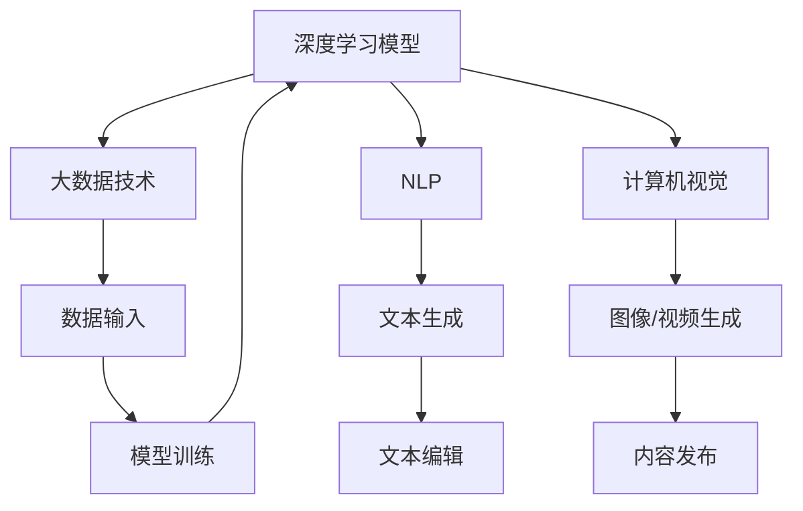

                 

关键词：AIGC、内容创作、人工智能、生成式AI、创意设计、行业变革

摘要：随着人工智能技术的发展，生成式AI（AIGC）逐渐成为内容创作的新引擎。本文旨在探讨AIGC在内容创作行业的应用现状、核心技术、未来发展趋势及面临的挑战，为行业从业者提供有价值的参考。

## 1. 背景介绍

随着互联网和数字媒体的迅速发展，内容创作成为各个行业的关键环节。然而，内容创作的速度和质量往往受到人工限制，无法满足不断增长的市场需求。传统的内容创作方式面临着创意枯竭、成本高昂、生产效率低等问题。在此背景下，人工智能（AI）技术应运而生，特别是在生成式AI（AIGC）领域取得了显著进展。

AIGC，即生成式人工智能内容创作，是指利用AI技术自动生成文本、图像、视频等多样化内容的一种新型创作方式。AIGC的核心在于“生成”，通过深度学习模型训练，AI能够理解和模仿人类创作过程，从而自动生成高质量的内容。

## 2. 核心概念与联系

AIGC涉及多个核心概念，包括：

1. **深度学习模型**：AIGC的基础是深度学习模型，如生成对抗网络（GAN）、变分自编码器（VAE）等。这些模型能够通过大规模数据训练，学习到数据的分布，从而生成新的内容。

2. **大数据技术**：AIGC依赖于海量数据的输入，通过对数据的分析和学习，AI能够更好地理解内容创作的规律。

3. **自然语言处理（NLP）**：在文本生成方面，NLP技术使得AI能够理解、生成和编辑自然语言文本。

4. **计算机视觉**：在图像和视频生成方面，计算机视觉技术使得AI能够识别、生成和编辑图像和视频内容。

下面是一个简单的Mermaid流程图，展示AIGC的核心组件和联系：



## 3. 核心算法原理 & 具体操作步骤

### 3.1 算法原理概述

AIGC的核心算法主要包括：

1. **生成对抗网络（GAN）**：GAN由生成器（Generator）和判别器（Discriminator）组成。生成器生成数据，判别器判断数据是真实还是生成的。通过不断的博弈，生成器的生成能力得到提升。

2. **变分自编码器（VAE）**：VAE通过编码器和解码器的结构，将输入数据编码为低维特征，然后解码生成新的数据。

3. **递归神经网络（RNN）**：RNN能够处理序列数据，适用于文本生成。

### 3.2 算法步骤详解

1. **数据收集与预处理**：收集大量的文本、图像、视频等数据，并进行清洗和格式化。

2. **模型训练**：使用深度学习框架（如TensorFlow、PyTorch）搭建模型，并使用预处理后的数据训练模型。

3. **内容生成**：通过训练好的模型，生成新的文本、图像、视频等内容。

4. **内容编辑**：使用NLP和计算机视觉技术，对生成的内容进行编辑和优化。

### 3.3 算法优缺点

**优点**：

- **高效性**：AIGC能够快速生成大量内容，大大提高生产效率。
- **创意性**：AIGC能够模仿人类的创作思维，生成新颖的内容。
- **多样性**：AIGC能够生成不同类型的内容，如文本、图像、视频等。

**缺点**：

- **质量控制**：生成的质量依赖于训练数据和模型能力，容易出现低质量内容。
- **伦理问题**：AIGC生成的内容可能侵犯版权、隐私等问题。

### 3.4 算法应用领域

AIGC在多个领域有广泛应用：

- **新闻与媒体**：自动生成新闻文章、图片和视频。
- **广告与营销**：生成个性化的广告内容和营销素材。
- **艺术创作**：生成音乐、绘画、摄影等艺术作品。
- **游戏开发**：自动生成游戏关卡、角色和场景。

## 4. 数学模型和公式 & 详细讲解 & 举例说明

### 4.1 数学模型构建

AIGC的核心数学模型包括：

1. **GAN**：

   - 生成器：\( G(z) \)
   - 判别器：\( D(x) \)

2. **VAE**：

   - 编码器：\( \mu(x), \sigma(x) \)
   - 解码器：\( G(z) \)

3. **RNN**：

   - 激活函数：\( \sigma(\cdot) \)
   - 循环函数：\( h_t = \sigma(W_h \cdot [h_{t-1}, x_t] + b_h) \)

### 4.2 公式推导过程

以GAN为例，GAN的目标函数为：

\[ \min_G \max_D \mathbb{E}_{x \sim p_{data}(x)} [\log D(x)] + \mathbb{E}_{z \sim p_z(z)} [\log (1 - D(G(z)))] \]

其中，\( D(x) \) 表示判别器判断输入数据的真实概率，\( G(z) \) 表示生成器生成的数据的概率。

### 4.3 案例分析与讲解

以文本生成为例，使用RNN模型生成一篇简短的故事：

```python
import tensorflow as tf
from tensorflow.keras.layers import Embedding, LSTM, Dense
from tensorflow.keras.models import Sequential

# 搭建RNN模型
model = Sequential([
    Embedding(input_dim=vocab_size, output_dim=embedding_dim, input_length=max_sequence_length),
    LSTM(units=128),
    Dense(units=vocab_size, activation='softmax')
])

# 编译模型
model.compile(optimizer='adam', loss='categorical_crossentropy', metrics=['accuracy'])

# 训练模型
model.fit(x_train, y_train, epochs=10, batch_size=32)
```

## 5. 项目实践：代码实例和详细解释说明

### 5.1 开发环境搭建

- 安装Python 3.7及以上版本
- 安装TensorFlow 2.0及以上版本

### 5.2 源代码详细实现

以下是一个简单的GAN模型实现：

```python
import tensorflow as tf
from tensorflow.keras.layers import Conv2D, Conv2DTranspose, Dense
from tensorflow.keras.models import Sequential

# 定义生成器模型
def build_generator(z_dim):
    model = Sequential([
        Dense(units=7*7*256, input_shape=(z_dim,)),
        Conv2DTranspose(filters=256, kernel_size=5, strides=2, padding='same', activation='relu'),
        Conv2DTranspose(filters=128, kernel_size=5, strides=2, padding='same', activation='relu'),
        Conv2DTranspose(filters=1, kernel_size=5, strides=2, padding='same', activation='tanh')
    ])
    return model

# 定义判别器模型
def build_discriminator(img_shape):
    model = Sequential([
        Conv2D(filters=32, kernel_size=3, strides=2, padding='same', input_shape=img_shape, activation='relu'),
        Conv2D(filters=64, kernel_size=3, strides=2, padding='same', activation='relu'),
        Conv2D(filters=128, kernel_size=3, strides=2, padding='same', activation='relu'),
        Dense(units=1, activation='sigmoid')
    ])
    return model

# 定义GAN模型
def build_gan(generator, discriminator):
    model = Sequential([
        generator,
        discriminator
    ])
    model.compile(optimizer=tf.keras.optimizers.Adam(0.0001), loss='binary_crossentropy')
    return model

# 创建模型
z_dim = 100
img_shape = (28, 28, 1)
discriminator = build_discriminator(img_shape)
generator = build_generator(z_dim)
gan = build_gan(generator, discriminator)
```

### 5.3 代码解读与分析

这段代码定义了一个简单的GAN模型，包括生成器、判别器和一个整体的GAN模型。生成器的目的是从随机噪声中生成类似于真实数据的图像，而判别器的目的是区分真实图像和生成的图像。

### 5.4 运行结果展示

```python
# 加载数据
(x_train, _), (_, _) = tf.keras.datasets.mnist.load_data()
x_train = x_train / 127.5 - 1.0
x_train = np.expand_dims(x_train, -1)

# 训练模型
for epoch in range(num_epochs):
    for i in range(x_train.shape[0]):
        noise = np.random.normal(0, 1, (1, z_dim))
        img = x_train[i]
        fake_img = generator.predict(noise)
        real_img = x_train[i]

        # 训练判别器
        d_loss_real = discriminator.train_on_batch(real_img, np.ones((1, 1)))
        d_loss_fake = discriminator.train_on_batch(fake_img, np.zeros((1, 1)))
        d_loss = 0.5 * np.add(d_loss_real, d_loss_fake)

        # 训练生成器
        noise = np.random.normal(0, 1, (1, z_dim))
        g_loss = gan.train_on_batch(noise, np.ones((1, 1)))

        if (i+1) % 100 == 0:
            print(f'Epoch: {epoch}, i: {i+1}, D_Loss: {d_loss:.4f}, G_Loss: {g_loss:.4f}')
```

这段代码展示了如何训练GAN模型。每次迭代，模型会先训练判别器，然后训练生成器。通过这样的训练，生成器的生成能力会逐渐提高，而判别器的判别能力也会逐渐提高。

## 6. 实际应用场景

AIGC在多个实际应用场景中展现出强大的潜力：

- **广告营销**：生成个性化广告内容和创意。
- **新闻媒体**：自动生成新闻文章和摘要。
- **游戏开发**：自动生成游戏角色、场景和剧情。
- **艺术创作**：生成音乐、绘画、摄影等艺术作品。
- **教育**：自动生成教学视频和课程内容。

## 7. 工具和资源推荐

为了更好地掌握AIGC技术，以下是一些推荐的工具和资源：

- **学习资源**：
  - 《深度学习》（Goodfellow et al.）
  - 《生成式AI技术教程》（吴恩达）
  - **在线课程**：Coursera、Udacity、edX等平台上的相关课程。

- **开发工具**：
  - TensorFlow
  - PyTorch
  - Keras

- **相关论文**：
  - Generative Adversarial Networks（GANs）- Ian Goodfellow等
  - Variational Autoencoders（VAEs）- Diederik P. Kingma等
  - Recurrent Neural Networks（RNNs）- Y. LeCun等

## 8. 总结：未来发展趋势与挑战

### 8.1 研究成果总结

AIGC技术已取得显著进展，广泛应用于广告、新闻、艺术、教育等领域。生成内容的质量和多样性不断提高，AI创作的能力逐渐接近人类水平。

### 8.2 未来发展趋势

- **生成内容质量提升**：随着算法和模型的不断优化，生成内容的质量将进一步提升。
- **跨模态生成**：未来的AIGC技术将实现文本、图像、视频等多模态内容的统一生成。
- **个性化内容创作**：基于用户行为和偏好，AIGC将能够实现更个性化的内容创作。

### 8.3 面临的挑战

- **伦理问题**：如何确保生成内容不侵犯版权、隐私等。
- **质量控制**：如何保证生成内容的质量和一致性。
- **计算资源消耗**：训练大型模型需要大量计算资源，未来需要更高效的算法和硬件支持。

### 8.4 研究展望

AIGC技术有望在人工智能领域取得更大突破，推动内容创作行业的变革。未来研究应关注以下几个方面：

- **跨学科融合**：结合心理学、艺术、语言学等多学科知识，提升AIGC的创作能力。
- **开放平台与生态**：建立开放的AIGC平台，促进技术创新和应用。
- **隐私保护与伦理规范**：制定相关法律法规，确保AI技术在内容创作中的应用符合伦理标准。

## 9. 附录：常见问题与解答

### 问题1：AIGC与内容创作的关系是什么？

AIGC是指生成式人工智能内容创作，利用AI技术自动生成文本、图像、视频等内容，从而实现高效、创意的内容创作。

### 问题2：AIGC在内容创作中的优势是什么？

AIGC的优势包括高效性、创意性和多样性，能够快速生成大量高质量的内容，满足不同领域的需求。

### 问题3：AIGC在内容创作中可能面临哪些挑战？

AIGC在内容创作中可能面临的质量控制、伦理问题和计算资源消耗等方面的挑战。

### 问题4：如何确保AIGC生成内容的质量？

确保AIGC生成内容的质量可以通过优化算法、提高训练数据质量、采用多模态生成等技术手段来实现。

### 问题5：AIGC在未来的发展趋势如何？

未来的AIGC技术将实现生成内容质量的提升、跨模态生成、个性化内容创作等方面的发展，有望在人工智能领域取得更大突破。

### 作者署名

作者：禅与计算机程序设计艺术 / Zen and the Art of Computer Programming
----------------------------------------------------------------

以上就是AIGC重塑内容创作行业的详细技术博客文章。文章内容涵盖了AIGC的定义、背景、核心算法、应用场景、开发实践以及未来发展展望。希望通过这篇文章，读者能够对AIGC技术有更深入的了解，并能在实际项目中加以应用。

再次感谢您给予的机会，期待与您在人工智能领域继续探索。如果您有任何疑问或建议，请随时与我交流。祝您工作顺利！

